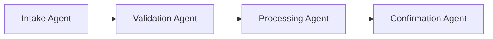
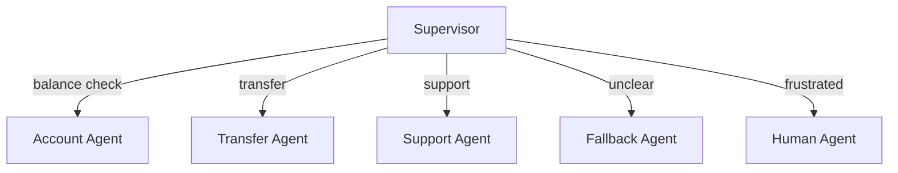
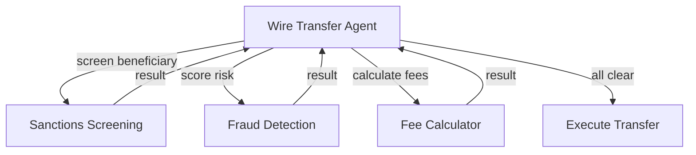
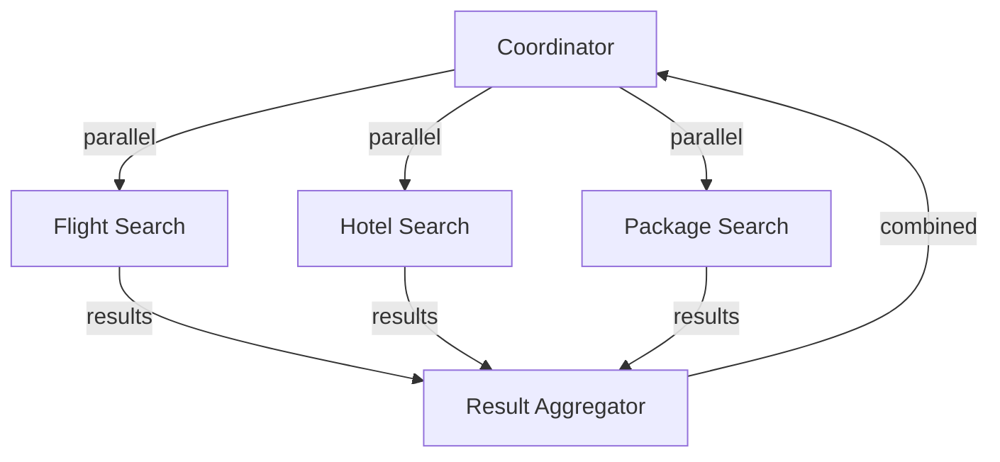
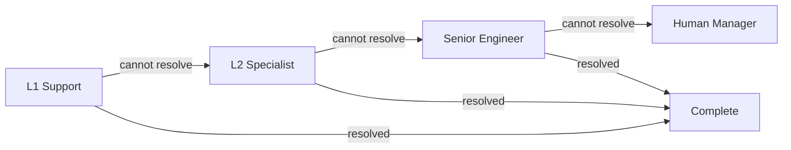
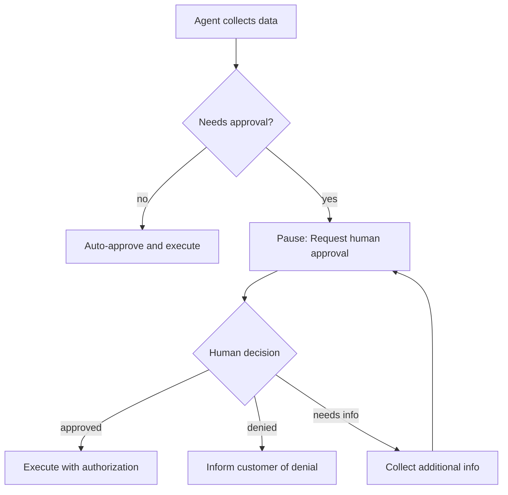
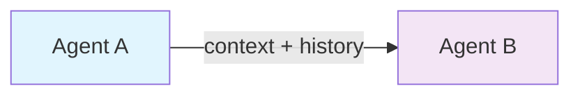
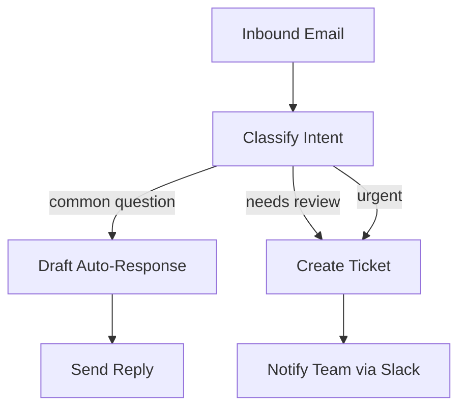
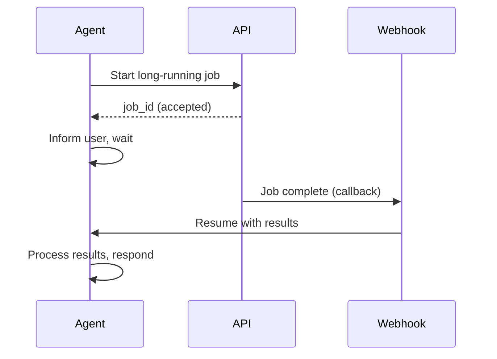

# Orchestration & Integration Examples

Reusable multi-agent coordination patterns and step-by-step integration recipes for connecting ABL agents to external services. Each section includes Mermaid diagrams, complete ABL code, and guidance on authentication and error handling.

---

## Orchestration Patterns

Patterns for multi-agent coordination. When discussing architecture with your team, refer to patterns by name (e.g., "this uses a Router/Dispatcher topology").

### Pattern 1: Sequential Pipeline (A -> B -> C)

A chain of agents where each agent completes its work and hands off to the next. Data flows in one direction. No branching.

**When to use:** Multi-stage processing pipelines -- document review, data enrichment, approval chains, or any workflow where each stage depends on the previous stage's output.



#### ABL Implementation

The supervisor manages the pipeline by routing through each stage in sequence:

```abl
SUPERVISOR: Document_Pipeline
VERSION: "1.0"
DESCRIPTION: "Sequential document processing pipeline: intake -> validate -> process -> confirm"


GOAL: "Process documents through a sequential pipeline with validation at each stage"

PERSONA: |
  Efficient pipeline coordinator. Moves documents through each stage
  in order, ensuring each step completes before the next begins.

MEMORY:
  session:
    - pipeline_stage
    - document_id
    - validation_result
    - processing_result
    - intake_data

ON_START:
  SET:
    pipeline_stage = "intake"
  RESPOND: "Document processing pipeline ready. Please provide the document to process."

HANDOFF:
  # Stage 1: Intake
  - TO: Intake_Agent
    WHEN: pipeline_stage == "intake"
    CONTEXT:
      pass: [document_id, raw_content]
      summary: "New document for intake processing"
    RETURN: true
    ON_RETURN:
      handler: advance_to_validation
    MAP:
      extracted_data: intake_data
      document_type: document_type

  # Stage 2: Validation
  - TO: Validation_Agent
    WHEN: pipeline_stage == "validation"
    CONTEXT:
      pass: [document_id, intake_data, document_type]
      summary: "Document intake complete -- ready for validation"
    RETURN: true
    ON_RETURN:
      handler: advance_to_processing
    MAP:
      is_valid: validation_result
      errors: validation_errors

  # Stage 3: Processing
  - TO: Processing_Agent
    WHEN: pipeline_stage == "processing" AND validation_result == true
    CONTEXT:
      pass: [document_id, intake_data, document_type]
      summary: "Validation passed -- ready for processing"
    RETURN: true
    ON_RETURN:
      handler: advance_to_confirmation
    MAP:
      result: processing_result
      output_id: output_id

  # Stage 4: Confirmation
  - TO: Confirmation_Agent
    WHEN: pipeline_stage == "confirmation"
    CONTEXT:
      pass: [document_id, processing_result, output_id]
      summary: "Processing complete -- generate confirmation"
    RETURN: true

  # Validation failed -- route to error handler
  - TO: Error_Handler
    WHEN: pipeline_stage == "processing" AND validation_result == false
    CONTEXT:
      pass: [document_id, validation_errors]
      summary: "Validation failed: {{validation_errors}}"
    RETURN: false

COMPLETE:
  - WHEN: pipeline_stage == "complete"
    RESPOND: |
      Document {{document_id}} processed successfully.
      Output ID: {{output_id}}
      All pipeline stages completed.
```

**Key pattern characteristics:**

- Each `HANDOFF` entry advances the pipeline by one stage.
- `RETURN: true` ensures the supervisor regains control after each stage.
- `MAP` extracts results from the child agent and stores them in session.
- The supervisor can inspect intermediate results and short-circuit the pipeline (e.g., validation failure).

---

### Pattern 2: Router/Dispatcher

A supervisor classifies the incoming request and routes it to the appropriate specialist. The specialist handles the request independently.

**When to use:** Multi-department customer service, ticket routing, help desk systems, and any application where different request types need different handlers.



#### ABL Implementation

```abl
SUPERVISOR: Service_Router
VERSION: "1.0"
DESCRIPTION: "Routes customer requests to specialist agents based on intent"


GOAL: "Classify the customer's intent and route to the correct specialist"

PERSONA: |
  Efficient service coordinator. Classifies requests accurately
  and routes with full context. Never handles domain logic directly.

MEMORY:
  session:
    - current_intent
    - routing_history
    - handoff_count
  persistent:
    - user.name
    - user.customer_id
  recall:
    - ON: session:start
      ACTION: prompt_llm
      INSTRUCTION: "Check if returning customer"
HANDOFF:
  # Priority 1: Account operations
  - TO: Account_Agent
    WHEN: intent.category == "balance" OR intent.category == "account_details" OR intent.category == "statements"
    CONTEXT:
      pass: [customer_id, session_context]
      summary: "Customer wants account information"
    RETURN: true
    ON_RETURN:
      handler: check_additional_needs
  # Priority 2: Transfers
  - TO: Transfer_Agent
    WHEN: intent.category == "transfer" OR intent.category == "payment"
    CONTEXT:
      pass: [customer_id, session_context]
      summary: "Customer wants to make a transfer or payment"
    RETURN: true
    ON_RETURN:
      handler: check_additional_needs
  # Priority 3: Support
  - TO: Support_Agent
    WHEN: intent.category == "help" OR intent.category == "issue" OR intent.category == "complaint"
    CONTEXT:
      pass: [customer_id, issue_description]
      summary: "Customer needs support"
    RETURN: false

  # Fallback: Unclear intent
  - TO: Fallback_Agent
    WHEN: intent.unclear == true OR intent.confidence < 0.5
    CONTEXT:
      pass: [session_context, last_message]
      summary: "Need clarification on intent"
    RETURN: true
    ON_RETURN:
      handler: reclassify_intent
ESCALATE:
  triggers:
    - WHEN: user.wants_human == true OR user.frustration_detected == true
      REASON: "Customer requested human assistance"
      PRIORITY: high
    - WHEN: handoff_count >= 4
      REASON: "Customer bounced between too many agents"
      PRIORITY: high

ON_ERROR:
  routing_failure:
    RESPOND: "I'm having trouble routing your request. Connecting you with support."
    RETRY: 1
    THEN: ESCALATE with REASON: "Routing failure requires human support"

COMPLETE:
  - WHEN: handoff_successful == true
    RESPOND: "Connected you with the right specialist."
```

**Key pattern characteristics:**

- Priority ordering ensures urgent cases (escalation) are always handled first.
- `RETURN: true` on domain agents allows multi-turn sessions where the customer returns to the router for additional requests.
- `ESCALATE` handles human/system escalation without pretending a human queue is a machine agent.
- The fallback agent uses a named `ON_RETURN` handler (`handler: reclassify_intent`) to re-evaluate the customer's clarified intent.

---

### Pattern 3: Hierarchical Delegation

A parent agent delegates specific sub-tasks to child agents and uses their results to make decisions. Unlike handoff (which transfers control), delegation is synchronous -- the parent waits for the result and continues.

**When to use:** Complex decisions that require input from multiple specialists -- risk assessment, compliance checks, pricing calculations, or any workflow where multiple assessments feed into a single decision.



#### ABL Implementation

```abl
AGENT: Wire_Transfer_Agent
VERSION: "1.0"
DESCRIPTION: "Processes wire transfers with delegated compliance checks"


GOAL: "Process wire transfers with sanctions screening, fraud detection, and fee calculation"

PERSONA: |
  Methodical wire transfer specialist. Never executes a wire without
  completing all compliance checks. Transparent about each step.

TOOLS:
  execute_wire(account_id: string, beneficiary_id: string, amount: number, authorization_code: string) -> {confirmation_number: string, status: string}
    description: "Execute the wire transfer after all checks pass"
    type: http
    endpoint: "https://api.bankexample.com/v2/wire/execute"
    method: POST
    auth: bearer
    hints:
      side_effects: true

MEMORY:
  session:
    - sanctions_clear
    - fraud_score
    - dual_auth_required
    - total_fees

# Synchronous sub-agent calls
DELEGATE:
  # Step 1: Sanctions screening
  - AGENT: Sanctions_Screening
    WHEN: beneficiary_name IS SET AND beneficiary_country IS SET
    PURPOSE: "Screen beneficiary against OFAC, EU, and UN sanctions lists"
    INPUT:
      name: beneficiary_name
      country: beneficiary_country
      amount: amount
    RETURNS:
      cleared: sanctions_clear
      match_score: sanctions_match_score
    USE_RESULT: "Block if match_score > 85. Review if 50-85. Proceed if cleared."
    ON_FAILURE: escalate
    FAILURE_MESSAGE: "Sanctions screening unavailable. Cannot proceed -- compliance is mandatory."
    TIMEOUT: "15s"

  # Step 2: Fraud detection
  - AGENT: Fraud_Detection
    WHEN: amount IS SET AND source_account IS SET
    PURPOSE: "Score transaction for fraud risk"
    INPUT:
      account_id: source_account
      amount: amount
      beneficiary_country: beneficiary_country
    RETURNS:
      risk_score: fraud_score
      requires_dual_auth: dual_auth_required
    USE_RESULT: "If score < 40: proceed. If 40-79: require dual auth. If >= 80: block."
    ON_FAILURE: escalate
    TIMEOUT: "10s"

  # Step 3: Fee calculation
  - AGENT: Fee_Calculator
    WHEN: transfer_type IS SET AND amount IS SET
    PURPOSE: "Calculate wire fees and FX conversion"
    INPUT:
      transfer_type: transfer_type
      amount: amount
      destination_country: beneficiary_country
    RETURNS:
      total_fee: total_fees
      exchange_rate: exchange_rate
    USE_RESULT: "Present fee breakdown to customer before confirming"
    TIMEOUT: "5s"

CONSTRAINTS:
  action_rules: # label only; add WHEN / BEFORE for explicit runtime scoping
    - REQUIRE sanctions_clear == true
      ON_FAIL: HANDOFF Compliance_Officer
    - REQUIRE fraud_score < 80
      ON_FAIL: HANDOFF Fraud_Review_Team

COMPLETE:
  - WHEN: confirmation_number IS SET
    RESPOND: "Wire executed. Confirmation: {{confirmation_number}}"
```

**Key pattern characteristics:**

- `DELEGATE` blocks are synchronous -- the parent agent waits for each result.
- `INPUT` maps parent session variables to child agent parameters.
- `RETURNS` maps child agent output back to parent session variables.
- `USE_RESULT` tells the parent's LLM how to interpret the child's response.
- `ON_FAILURE` defines fallback behavior when a delegate fails.
- Delegates can run conditionally (`WHEN`) and have independent timeouts.
- Constraint labels such as `action_rules` are organizational only; use the rule conditions themselves, `WHEN`, or structural `BEFORE` for runtime gating.

---

### Pattern 4: Fan-Out / Fan-In

Multiple agents execute in parallel. A coordinator collects and aggregates their results before proceeding.

**When to use:** Comparison shopping, multi-source data aggregation, parallel API calls, or any workflow where independent tasks can run simultaneously to reduce total latency.



#### ABL Implementation

```abl
AGENT: Travel_Search_Coordinator
VERSION: "1.0"
DESCRIPTION: "Coordinates parallel travel searches and aggregates results"


GOAL: |
  Search for flights, hotels, and packages in parallel. Aggregate results,
  identify the best value, and present a unified comparison to the customer.

PERSONA: |
  Efficient travel search coordinator. Runs searches simultaneously
  to save time. Highlights the best value option across all categories.

TOOLS:
  search_flights(origin: string, destination: string, date: string) -> {flights: object[], search_id: string}
    description: "Search available flights"

  search_hotels(destination: string, checkin: string, checkout: string) -> {hotels: object[], search_id: string}
    description: "Search available hotels"

  search_packages(origin: string, destination: string, date: string) -> {packages: object[], search_id: string}
    description: "Search flight+hotel packages"

  # Sandbox tool for aggregation logic
  aggregate_results(flights: object[], hotels: object[], packages: object[], budget: number) -> {recommendations: object[], best_value: object, savings: number}
    description: "Compare results across all categories and identify the best value"

MEMORY:
  session:
    - flight_results
    - hotel_results
    - package_results
    - aggregated_recommendations
    - best_value_option

INSTRUCTIONS: |
  1. Collect travel criteria from the customer (destination, dates, budget)
  2. Execute search_flights, search_hotels, and search_packages in parallel
  3. Wait for all results to arrive
  4. Call aggregate_results to find the best value combination
  5. Present the top recommendations with a clear comparison
  6. If a package is cheaper than booking separately, highlight the savings

GATHER:
  destination:
    prompt: "Where would you like to travel?"
    type: string
    required: true
  departure_date:
    prompt: "When do you want to leave?"
    type: date
    required: true
  return_date:
    prompt: "When do you want to return?"
    type: date
    required: true
  budget:
    prompt: "What is your total budget?"
    type: number
    required: false

COMPLETE:
  - WHEN: user.selection_made == true
    RESPOND: "Your selection is ready for booking."
```

> **Note:** ABL handles parallel tool execution natively -- when the LLM determines that multiple tools are independent, the runtime executes them concurrently. For step-based execution, you can use `DELEGATE` blocks with `PARALLEL: true` to explicitly fan out.

---

### Pattern 5: Escalation Chain

An escalation chain routes issues through progressively more capable handlers. If the first agent cannot resolve the issue, it escalates to the next level, with full context preservation.

**When to use:** Support tiers, incident management, approval hierarchies, and any workflow where unresolved issues need progressively higher authority.



#### ABL Implementation

```abl
SUPERVISOR: Support_Escalation
VERSION: "1.0"
DESCRIPTION: "Tiered support escalation: L1 -> L2 -> L3 -> Human"


GOAL: "Resolve customer issues at the lowest tier possible, escalating when needed"

PERSONA: |
  Support routing coordinator. Starts with L1 for common issues,
  escalates to L2 for complex technical problems, L3 for critical
  infrastructure issues, and human managers for unresolvable cases.

MEMORY:
  session:
    - escalation_level
    - issue_description
    - resolution_status
    - attempted_solutions
    - escalation_history

ON_START:
  SET:
    escalation_level = 1
    resolution_status = "open"
  RESPOND: "Welcome to support. Let me connect you with the right team."

HANDOFF:
  # Level 1: Common issues -- FAQ, password resets, basic troubleshooting
  - TO: L1_Support
    WHEN: escalation_level == 1
    CONTEXT:
      pass: [issue_description, customer_id]
      summary: "New support request -- L1 triage"
    RETURN: true
    ON_RETURN:
      handler: check_resolution
    MAP:
      resolved: resolution_status
      solution: attempted_solutions

  # Level 2: Complex technical issues
  - TO: L2_Specialist
    WHEN: escalation_level == 2
    CONTEXT:
      pass: [issue_description, customer_id, attempted_solutions, escalation_history]
      summary: "L1 could not resolve -- escalating to L2 specialist"
    RETURN: true
    ON_RETURN:
      handler: check_resolution
    MAP:
      resolved: resolution_status
      solution: attempted_solutions

  # Level 3: Critical infrastructure / senior engineer
  - TO: L3_Senior_Engineer
    WHEN: escalation_level == 3
    CONTEXT:
      pass: [issue_description, customer_id, attempted_solutions, escalation_history]
      summary: "L2 could not resolve -- escalating to senior engineer"
    RETURN: true
    ON_RETURN:
      handler: check_resolution
  # Level 4: Human manager (final escalation)
  - TO: Human_Manager
    WHEN: escalation_level >= 4
    CONTEXT:
      pass: [issue_description, customer_id, attempted_solutions, escalation_history, conversation_history]
      summary: "All automated tiers exhausted -- human intervention required"
    RETURN: false

ESCALATE:
  triggers:
    - WHEN: user.frustration_detected == true AND escalation_level < 4
      REASON: "Customer frustrated -- skip to human manager"
      PRIORITY: high

    - WHEN: resolution_status == "open" AND escalation_level >= 4
      REASON: "All automated tiers exhausted"
      PRIORITY: critical

  context_for_human:
    - issue_description
    - attempted_solutions
    - escalation_history
    - conversation_history

ON_ERROR:
  agent_unavailable:
    RESPOND: "This support tier is temporarily unavailable. Escalating."
    RETRY: 1
    THEN: ESCALATE

COMPLETE:
  - WHEN: resolution_status == "resolved"
    RESPOND: "Your issue has been resolved. Is there anything else?"
```

**Key pattern characteristics:**

- `escalation_level` tracks progress through the chain.
- Each tier receives `attempted_solutions` and `escalation_history` so agents do not repeat previous steps.
- A named `ON_RETURN` handler (`handler: check_resolution`) evaluates whether to complete or escalate further.
- Frustration detection can skip tiers to reach a human faster.

---

### Pattern 6: Human-in-the-Loop

The agent pauses execution at critical decision points and waits for human approval before proceeding. This is different from escalation (where the human takes over) -- here, the human provides a decision and the agent resumes.

**When to use:** High-value approvals, content moderation, compliance sign-off, and any workflow where automated decisions need human oversight before execution.



#### ABL Implementation

```abl
AGENT: High_Value_Transfer_Agent
VERSION: "1.0"
DESCRIPTION: "Processes transfers with human approval gates for high-value operations"


GOAL: |
  Process fund transfers. Auto-approve amounts under $10,000.
  Pause for human approval on amounts over $10,000.
  Require VP approval on amounts over $100,000.

TOOLS:
  execute_transfer(from: string, to: string, amount: number, auth_code: string) -> {confirmation: string, status: string}
    description: "Execute the transfer after approval"
    type: http
    endpoint: "https://api.bankexample.com/v2/transfers/execute"
    method: POST
    auth: bearer
    hints:
      side_effects: true

  request_approval(transfer_id: string, amount: number, reason: string, level: string) -> {approved: boolean, approver: string, auth_code: string, notes: string}
    description: "Request human approval -- blocks until decision is made"
    type: http
    endpoint: "https://api.bankexample.com/v2/approvals/request"
    method: POST
    auth: bearer
    hints:
      side_effects: true
      latency: slow
      timeout: 300000

MEMORY:
  session:
    - transfer_amount
    - approval_level
    - auth_code
    - approval_status

CONSTRAINTS:
  action_rules: # label only; use WHEN / BEFORE for explicit runtime scoping
    # Auto-approve under $10,000
    - REQUIRE transfer_amount < 10000 OR auth_code IS SET
      ON_FAIL: "This transfer requires manager approval. Requesting now."

    # VP approval over $100,000
    - REQUIRE transfer_amount < 100000 OR approval_level == "vp"
      ON_FAIL: "Transfers over $100,000 require VP approval."

ESCALATE:
  triggers:
    - WHEN: transfer_amount >= 10000 AND transfer_amount < 100000 AND auth_code IS NOT SET
      REASON: "Transfer of {{transfer_amount}} requires manager approval"
      PRIORITY: medium
      TAGS: [approval, manager]

    - WHEN: transfer_amount >= 100000 AND auth_code IS NOT SET
      REASON: "Transfer of {{transfer_amount}} requires VP approval"
      PRIORITY: high
      TAGS: [approval, vp]

  context_for_human:
    - customer_id
    - transfer_amount
    - source_account
    - destination_account
    - transfer_reason
    - risk_score

  on_human_complete:
    - IF human.approved == true:
      SET:
        auth_code = human.auth_code
        approval_status = "approved"
      CONTINUE

    - IF human.denied == true:
      SET:
        approval_status = "denied"
      RESPOND: "The transfer was not approved. Reason: {{human.notes}}"

    - IF human.needs_info == true:
      RESPOND: "The approver needs more information: {{human.notes}}"
      CONTINUE

COMPLETE:
  - WHEN: approval_status == "approved" AND confirmation IS SET
    RESPOND: |
      Transfer approved and executed.
      Confirmation: {{confirmation}}
      Approved by: {{approver}}
```

---

### Pattern 7: Context-Preserving Handoff

When transferring a customer between agents, the full conversation context -- session state, interaction history, and accumulated data -- is forwarded to the receiving agent. This prevents the customer from repeating information.

**When to use:** Cross-department transfers, shift changes, specialist escalation, and any scenario where the customer has already provided information that the next agent needs.



#### ABL Implementation

```abl
SUPERVISOR: Context_Aware_Router
VERSION: "1.0"
DESCRIPTION: "Routes with full context preservation between agents"


GOAL: "Transfer customers between agents with zero information loss"

MEMORY:
  session:
    - accumulated_context
    - customer_id
    - customer_name
    - verified_info
    - interaction_summary
    - previous_agent
    - data_collected

HANDOFF:
  # Transfer from Sales to Booking with full context
  - TO: Booking_Manager
    WHEN: intent.category == "manage_booking" AND previous_agent == "Sales_Agent"
    CONTEXT:
      pass: [customer_id, customer_name, verified_info, data_collected, interaction_summary]
      summary: |
        Customer transferred from Sales. Already verified identity.
        Collected: destination ({{destination}}), dates ({{dates}}),
        travelers ({{num_travelers}}), budget ({{budget}}).
        Customer selected flight {{selected_flight}} and hotel {{selected_hotel}}.
      history: full
      memory_grants:
        - path: user.preferences
          access: read
        - path: user.loyalty_tier
          access: read
    RETURN: true

  # Transfer from Support to Specialist with partial context
  - TO: Technical_Specialist
    WHEN: intent.category == "technical" AND escalation_needed == true
    CONTEXT:
      pass: [customer_id, customer_name, issue_description, steps_tried, error_logs, device_info]
      summary: |
        Escalated from L1 Support. Customer experiencing {{issue_description}}.
        Steps already tried: {{steps_tried}}.
        Device: {{device_info}}. Error logs attached.
      history:
        mode: last_n
        count: 20
    RETURN: true

  # Transfer to live-agent wrapper with maximum context
  - TO: Live_Agent_Transfer
    WHEN: user.wants_human == true
    CONTEXT:
      pass: [customer_id, customer_name, verified_info, data_collected, interaction_summary, routing_history, escalation_reason]
      summary: |
        FULL CONTEXT TRANSFER
        Customer: {{customer_name}} (ID: {{customer_id}})
        Verified: {{verified_info}}
        Journey: {{routing_history}}
        Current issue: {{interaction_summary}}
        Reason for transfer: {{escalation_reason}}
      history: full
    RETURN: false
```

**Key context-preservation features:**

| Feature                                | Description                                                              |
| -------------------------------------- | ------------------------------------------------------------------------ |
| `pass: [...]`                          | Explicit list of session variables forwarded to the child agent          |
| `summary`                              | Human-readable context summary with template interpolation               |
| `history: full`                        | Forward the complete conversation history                                |
| `history: { mode: last_n, count: 20 }` | Forward only the recent turns while keeping the contract explicit        |
| `memory_grants: [...]`                 | Give the child agent explicit access to specific persistent memory paths |
| `ON_RETURN.map`                        | Map child agent outputs back to parent session variables                 |

**Anti-pattern: Context loss.** If you use `RETURN: false` without adequate `pass` and `summary`, the receiving agent starts with no context. Always pass at minimum: customer ID, verified status, and a summary of what has been discussed.

---

### Orchestration Pattern Summary

| Pattern                    | Topology                | Use Case                    | Key ABL Construct                              |
| -------------------------- | ----------------------- | --------------------------- | ---------------------------------------------- |
| Sequential Pipeline        | A -> B -> C             | Multi-stage processing      | `HANDOFF` with `RETURN: true` + stage tracking |
| Router/Dispatcher          | Hub -> Spokes           | Intent-based routing        | `HANDOFF` with priority ordering               |
| Hierarchical Delegation    | Parent -> Children      | Multi-assessment decisions  | `DELEGATE` with `INPUT`/`RETURNS`              |
| Fan-Out/Fan-In             | 1 -> N -> 1             | Parallel search/aggregation | Parallel `TOOLS` or `DELEGATE`                 |
| Escalation Chain           | L1 -> L2 -> L3 -> Human | Tiered support              | `ESCALATE` with tier-aware routing             |
| Human-in-the-Loop          | Agent -> Human -> Agent | Approval workflows          | `ESCALATE` with `on_human_complete`            |
| Context-Preserving Handoff | A -> B (with context)   | Cross-agent transfers       | `CONTEXT.pass` + `history` + `summary`         |

### Combining Patterns

Production systems often combine multiple patterns. For example:

- **Jupiter Bank** (industry example) combines Router/Dispatcher (supervisor), Hierarchical Delegation (compliance checks), Escalation Chain (support tiers), and Context-Preserving Handoff (authentication gate).
- **Travel Booking** combines Router/Dispatcher (supervisor), Sequential Pipeline (search -> quote -> payment), and Human-in-the-Loop (refund approval).
- **Telecom NOC** combines Router/Dispatcher (alarm routing), Sequential Pipeline (triage -> specialist), and Escalation Chain (P1 SLA enforcement).

---

## Integration Recipes

Step-by-step recipes for connecting ABL agents to external services. Each recipe includes the ABL tool definition, a TypeScript implementation for the tool handler (where needed), and guidance on authentication and error handling.

### Connecting to Salesforce CRM

Use Salesforce REST APIs to look up accounts, create cases, and update records from your agent.

#### ABL Tool Declaration

```abl
AGENT: CRM_Agent
VERSION: "1.0"
DESCRIPTION: "Looks up customer records and manages cases in Salesforce"


GOAL: "Help support agents by pulling customer data from Salesforce and creating support cases"

TOOLS:
  # Look up a Salesforce account by email or phone
  sf_lookup_account(email: string = "", phone: string = "") -> {account_id: string, name: string, type: string, owner: string, tier: string, open_cases: number}
    description: "Search for a Salesforce account by email or phone number"
    type: http
    endpoint: "https://your-instance.salesforce.com/services/data/v59.0/parameterizedSearch/"
    method: GET
    auth: oauth2
    hints:
      cacheable: true
      latency: medium
      timeout: 10000

  # Get account details by ID
  sf_get_account(account_id: string) -> {name: string, industry: string, annual_revenue: number, billing_address: object, contacts: object[]}
    description: "Retrieve full account details from Salesforce"
    type: http
    endpoint: "https://your-instance.salesforce.com/services/data/v59.0/sobjects/Account/{account_id}"
    method: GET
    auth: oauth2
    hints:
      cacheable: true
      timeout: 8000

  # Create a new support case
  sf_create_case(account_id: string, subject: string, description: string, priority: string = "Medium", origin: string = "Chat") -> {case_id: string, case_number: string, status: string}
    description: "Create a new support case in Salesforce linked to an account"
    type: http
    endpoint: "https://your-instance.salesforce.com/services/data/v59.0/sobjects/Case"
    method: POST
    auth: oauth2
    hints:
      side_effects: true
      timeout: 10000

  # Update case status
  sf_update_case(case_id: string, status: string, resolution: string = "") -> {success: boolean, updated_at: string}
    description: "Update the status and resolution notes of an existing case"
    type: http
    endpoint: "https://your-instance.salesforce.com/services/data/v59.0/sobjects/Case/{case_id}"
    method: PATCH
    auth: oauth2
    hints:
      side_effects: true
      timeout: 8000

GATHER:
  customer_email:
    prompt: "What is the customer's email address?"
    type: string
    required: true

  issue_description:
    prompt: "Describe the customer's issue."
    type: string
    required: true

COMPLETE:
  - WHEN: case_id IS SET
    RESPOND: "Case {{case_number}} created in Salesforce for {{account_name}}."
```

#### Authentication Setup

1. Register a Connected App in Salesforce Setup with the "API" OAuth scope.
2. In the Agent Platform 2.0, navigate to **Project Settings > Credentials**.
3. Add a new OAuth2 credential:
   - **Name:** `salesforce`
   - **Auth URL:** `https://login.salesforce.com/services/oauth2/authorize`
   - **Token URL:** `https://login.salesforce.com/services/oauth2/token`
   - **Client ID:** Your Connected App consumer key
   - **Client Secret:** Your Connected App consumer secret
   - **Scopes:** `api refresh_token`
4. The runtime automatically handles token refresh when `auth: oauth2` is specified.

#### Error Handling

```abl
ON_ERROR:
  tool_error:
    RESPOND: "I had trouble reaching the CRM. Let me retry."
    RETRY: 2
    THEN: CONTINUE

  # Salesforce-specific: session expired
  auth_error:
    RESPOND: "Authentication expired. Refreshing credentials."
    RETRY: 1
    THEN: CONTINUE
```

---

### Sending Slack Notifications

Send messages to Slack channels or users from your agent using Slack's Web API.

#### ABL Tool Declaration

```abl
AGENT: Notification_Agent
VERSION: "1.0"
DESCRIPTION: "Sends notifications to Slack channels based on agent events"


GOAL: "Notify the team via Slack when important events occur -- escalations, completions, errors"

TOOLS:
  # Send a message to a Slack channel
  slack_send_message(channel: string, text: string, blocks: object[] = []) -> {ok: boolean, ts: string, channel: string}
    description: "Send a message to a Slack channel using the Slack Web API"
    type: http
    endpoint: "https://slack.com/api/chat.postMessage"
    method: POST
    auth: bearer
    hints:
      side_effects: true
      timeout: 5000

  # Send a direct message to a user
  slack_send_dm(user_id: string, text: string) -> {ok: boolean, ts: string, channel: string}
    description: "Send a direct message to a Slack user"
    type: http
    endpoint: "https://slack.com/api/chat.postMessage"
    method: POST
    auth: bearer
    hints:
      side_effects: true
      timeout: 5000

  # Look up a user by email
  slack_lookup_user(email: string) -> {ok: boolean, user: {id: string, name: string, real_name: string}}
    description: "Find a Slack user by their email address"
    type: http
    endpoint: "https://slack.com/api/users.lookupByEmail"
    method: GET
    auth: bearer
    hints:
      cacheable: true
      timeout: 5000
```

#### TypeScript Tool Handler

If you need custom message formatting, implement a sandbox tool handler:

```typescript
// tools/slack-notifier.ts
// This runs in the code sandbox with access to the memory API

interface SlackNotification {
  channel: string;
  event_type: 'escalation' | 'completion' | 'error';
  summary: string;
  details: Record<string, string>;
}

export async function format_slack_notification(params: SlackNotification): Promise<object> {
  const { channel, event_type, summary, details } = params;

  // Build Slack Block Kit message
  const blocks = [
    {
      type: 'header',
      text: {
        type: 'plain_text',
        text: `Agent ${event_type.toUpperCase()}: ${summary}`,
      },
    },
    {
      type: 'section',
      fields: Object.entries(details).map(([key, value]) => ({
        type: 'mrkdwn',
        text: `*${key}:*\n${value}`,
      })),
    },
    {
      type: 'context',
      elements: [
        {
          type: 'mrkdwn',
          text: `Sent by ABL Agent at ${new Date().toISOString()}`,
        },
      ],
    },
  ];

  return { channel, blocks, text: summary };
}
```

#### ABL Integration

Reference the sandbox tool alongside the HTTP tool:

```abl
TOOLS:
  # Sandbox tool for formatting
  format_slack_notification(channel: string, event_type: string, summary: string, details: object) -> {channel: string, blocks: object[], text: string}
    description: "Format a rich Slack notification using Block Kit"

  # HTTP tool for sending
  slack_send_message(channel: string, text: string, blocks: object[]) -> {ok: boolean, ts: string}
    description: "Send formatted message to Slack"
    type: http
    endpoint: "https://slack.com/api/chat.postMessage"
    method: POST
    auth: bearer

INSTRUCTIONS: |
  When an escalation, error, or completion event occurs:
  1. Call format_slack_notification to build the rich message
  2. Call slack_send_message with the formatted blocks
```

#### Authentication Setup

1. Create a Slack App at [api.slack.com/apps](https://api.slack.com/apps).
2. Add the `chat:write`, `users:read.email` bot token scopes.
3. Install the app to your workspace and copy the Bot User OAuth Token.
4. In the Agent Platform 2.0, add the token as a Bearer credential named `slack`.

---

### Processing Email Conversations

Ingest email threads, extract customer intent, and generate responses or create tickets.

#### ABL Tool Declaration

```abl
AGENT: Email_Processor
VERSION: "1.0"
DESCRIPTION: "Processes inbound customer emails and generates responses or creates tickets"


GOAL: |
  Analyze incoming emails, extract customer intent and urgency,
  draft a response or create a support ticket, and route to the
  appropriate department if needed.

PERSONA: |
  Professional email support specialist. Matches the customer's
  formality level. Responds in the same language as the original email.

TOOLS:
  # Fetch emails from the inbox
  fetch_emails(folder: string = "INBOX", unread_only: boolean = true, limit: number = 10) -> {emails: {id: string, from: string, subject: string, body: string, received_at: string, attachments: object[]}[], total: number}
    description: "Fetch emails from the specified folder"
    type: http
    endpoint: "https://api.emailservice.example.com/v1/messages"
    method: GET
    auth: oauth2
    hints:
      timeout: 15000

  # Send an email reply
  send_reply(message_id: string, body: string, cc: string[] = []) -> {sent: boolean, message_id: string}
    description: "Send a reply to an email thread"
    type: http
    endpoint: "https://api.emailservice.example.com/v1/messages/reply"
    method: POST
    auth: oauth2
    hints:
      side_effects: true
      timeout: 10000

  # Create a support ticket from the email
  create_ticket(email_id: string, subject: string, body: string, priority: string, category: string, customer_email: string) -> {ticket_id: string, status: string}
    description: "Create a support ticket from an email"
    type: http
    endpoint: "https://api.ticketsystem.example.com/v1/tickets"
    method: POST
    auth: bearer
    hints:
      side_effects: true

  # Classify email sentiment and urgency
  classify_email(subject: string, body: string) -> {intent: string, urgency: string, sentiment: string, language: string, key_entities: object[]}
    description: "Classify email intent, urgency, sentiment, and language"

INSTRUCTIONS: |
  For each unread email:
  1. Call classify_email to determine intent, urgency, and sentiment
  2. If urgency is "high" or sentiment is "negative", create a ticket with priority "High"
  3. If the intent is a common question (password reset, status check), draft an auto-response
  4. If the intent requires human judgment, create a ticket and flag for review
  5. Always reply to the customer acknowledging receipt

MEMORY:
  session:
    - processed_emails
    - tickets_created
    - replies_sent

COMPLETE:
  - WHEN: all_emails_processed == true
    RESPOND: "Processed {{processed_count}} emails. Created {{tickets_created}} tickets. Sent {{replies_sent}} auto-replies."
```

#### Workflow: Email -> Agent -> Response/Ticket



---

### Building a WhatsApp Bot

Connect your agent to WhatsApp using the WhatsApp Business API. The agent receives messages via webhook and responds through the API.

#### ABL Agent Definition

```abl
AGENT: WhatsApp_Bot
VERSION: "1.0"
DESCRIPTION: "Customer service agent accessible via WhatsApp"


GOAL: "Handle customer inquiries via WhatsApp with channel-appropriate responses"

PERSONA: |
  Friendly, concise customer service agent optimized for mobile messaging.
  Keeps responses short (under 300 characters per message).
  Uses structured messages (lists, buttons) when appropriate.
  Confirms actions before executing.

LIMITATIONS:
  - "Cannot send messages longer than 4096 characters"
  - "Cannot send more than 3 quick-reply buttons per message"
  - "Cannot initiate conversations without a pre-approved template"

TOOLS:
  # Send a text message
  wa_send_text(phone_number: string, message: string) -> {message_id: string, status: string}
    description: "Send a text message to a WhatsApp number"
    type: http
    endpoint: "https://graph.facebook.com/v18.0/{phone_number_id}/messages"
    method: POST
    auth: bearer
    hints:
      side_effects: true
      timeout: 5000

  # Send a message with quick-reply buttons
  wa_send_buttons(phone_number: string, body: string, buttons: object[]) -> {message_id: string, status: string}
    description: "Send a message with up to 3 quick-reply buttons"
    type: http
    endpoint: "https://graph.facebook.com/v18.0/{phone_number_id}/messages"
    method: POST
    auth: bearer
    hints:
      side_effects: true

  # Send a list message (up to 10 items)
  wa_send_list(phone_number: string, body: string, button_text: string, sections: object[]) -> {message_id: string, status: string}
    description: "Send an interactive list message with selectable items"
    type: http
    endpoint: "https://graph.facebook.com/v18.0/{phone_number_id}/messages"
    method: POST
    auth: bearer
    hints:
      side_effects: true

  # Mark message as read
  wa_mark_read(message_id: string) -> {success: boolean}
    description: "Mark a WhatsApp message as read (shows blue check marks)"
    type: http
    endpoint: "https://graph.facebook.com/v18.0/{phone_number_id}/messages"
    method: POST
    auth: bearer

TEMPLATES:
  welcome:
    DEFAULT: |
      Welcome to Customer Support!
      How can I help you today?
    VOICE INSTRUCTIONS: "Keep it short for mobile -- under 160 characters."

  quick_menu:
    DEFAULT: |
      What would you like help with?
      1. Check order status
      2. Returns & refunds
      3. Product questions
      4. Speak to an agent

MEMORY:
  session:
    - phone_number
    - customer_id
    - conversation_state
  persistent:
    - user.whatsapp_opted_in
    - user.preferred_language
  recall:
    - ON: session:start
      ACTION: prompt_llm
      INSTRUCTION: "Check if returning WhatsApp user"
ON_START:
  RESPOND: TEMPLATE(welcome)

COMPLETE:
  - WHEN: issue_resolved == true
    RESPOND: "Glad I could help! Message us anytime you need assistance."
```

#### Webhook Handler (TypeScript)

Register a webhook endpoint to receive inbound WhatsApp messages and forward them to the ABL runtime:

```typescript
// webhooks/whatsapp-handler.ts
import { createLogger } from '@abl/compiler/platform';

const log = createLogger('whatsapp-webhook');

interface WhatsAppMessage {
  from: string;
  id: string;
  timestamp: string;
  type: 'text' | 'interactive' | 'image';
  text?: { body: string };
  interactive?: {
    type: string;
    button_reply?: { id: string; title: string };
  };
}

export async function handleWhatsAppWebhook(payload: Record<string, unknown>): Promise<void> {
  const entry = (payload.entry as Array<Record<string, unknown>>)?.[0];
  const changes = (entry?.changes as Array<Record<string, unknown>>)?.[0];
  const value = changes?.value as Record<string, unknown>;
  const messages = value?.messages as WhatsAppMessage[];

  if (!messages || messages.length === 0) return;

  for (const message of messages) {
    const userText =
      message.type === 'text' ? message.text?.body : message.interactive?.button_reply?.title;

    if (!userText) continue;

    // Forward to ABL runtime session
    const response = await fetch(
      `${process.env.RUNTIME_URL}/api/sessions/${message.from}/message`,
      {
        method: 'POST',
        headers: {
          'Content-Type': 'application/json',
          Authorization: `Bearer ${process.env.RUNTIME_API_KEY}`,
        },
        body: JSON.stringify({
          message: userText,
          channel: 'whatsapp',
          metadata: {
            phone_number: message.from,
            message_id: message.id,
          },
        }),
      },
    );

    if (!response.ok) {
      log.error('Failed to forward WhatsApp message to runtime', {
        phone: message.from,
        status: response.status,
      });
    }
  }
}
```

#### Authentication Setup

1. Create a WhatsApp Business App in Meta Developer Portal.
2. Add the WhatsApp product and configure a phone number.
3. Copy the **Permanent Token** and **Phone Number ID**.
4. In the Agent Platform 2.0, add the token as a Bearer credential named `whatsapp`.
5. Configure the webhook URL pointing to your handler endpoint.

---

### Setting Up Voice IVR

Connect your agent to a voice channel using SIP/PSTN integration for interactive voice response (IVR) flows.

#### ABL Agent Definition

```abl
AGENT: IVR_Agent
VERSION: "1.0"
DESCRIPTION: "Voice IVR agent that routes callers to the right department"


GOAL: "Route voice callers to the appropriate department efficiently"

PERSONA: |
  Concise and professional voice assistant. Uses short, clear sentences.
  Speaks at a moderate pace. Pauses between options for clarity.

TOOLS:
  check_availability(queue: string) -> {available: boolean, wait_time: number, agents_online: number}
    description: "Check if agents are available in a queue"
    type: http
    endpoint: "https://api.contactcenter.example.com/v1/queues/status"
    method: GET
    auth: bearer
    hints:
      cacheable: true
      timeout: 3000

  transfer_call(queue: string, priority: number, metadata: object) -> {status: string, transfer_id: string}
    description: "Transfer the voice call to a human agent queue"
    type: http
    endpoint: "https://api.contactcenter.example.com/v1/calls/transfer"
    method: POST
    auth: bearer
    hints:
      side_effects: true
      timeout: 10000

FLOW:
  entry_point: welcome

  steps:
    - welcome
    - select_department
    - check_queue
    - transfer
    - no_agents
    - after_hours

  welcome:
    REASONING: false
    RESPOND: "Welcome. For sales, say sales. For support, say support. For billing, say billing."
      VOICE INSTRUCTIONS: "Speak clearly at moderate pace. Pause 500ms between each option."
    THEN: select_department

  select_department:
    REASONING: false
    GATHER:
      - department: required
        prompt: "Which department would you like?"
        type: enum
        options: ["sales", "support", "billing"]
    THEN: check_queue

  check_queue:
    REASONING: false
    CALL: check_availability
      WITH:
        queue: "{{department}}_queue"
      AS: queueStatus
    ON_RESULT:
      - IF: queueStatus.available == true
        THEN: transfer
      - IF: queueStatus.available == false AND queueStatus.agents_online > 0
        RESPOND: "All agents are currently busy. Estimated wait: {{queueStatus.wait_time}} minutes. Would you like to wait or leave a callback number?"
          VOICE INSTRUCTIONS: "Use a sympathetic tone. Speak the wait time slowly."
        THEN: transfer
      - ELSE:
        THEN: after_hours

  transfer:
    REASONING: false
    CALL: transfer_call
      WITH:
        queue: "{{department}}_queue"
        priority: 5
        metadata:
          channel: "voice"
          department: "{{department}}"
      AS: transferResult
    ON_RESULT:
      - IF: transferResult.status == "waiting"
        RESPOND: "Connecting you now. Please hold."
          VOICE INSTRUCTIONS: "Use a reassuring tone."
        THEN: COMPLETE
      - ELSE:
        THEN: no_agents

  no_agents:
    REASONING: false
    RESPOND: "No agents are available. Please call back during business hours, Monday through Friday, 8 AM to 6 PM."
      VOICE INSTRUCTIONS: "Speak slowly and clearly. Emphasize business hours."
    THEN: COMPLETE

  after_hours:
    REASONING: false
    RESPOND: "Our office is currently closed. Business hours are Monday through Friday, 8 AM to 6 PM Eastern. You can also visit our website for self-service options."
      VOICE INSTRUCTIONS: "Speak at a moderate pace. Provide the website URL slowly."
    THEN: COMPLETE

COMPLETE:
  - WHEN: transferResult.status == "waiting"
    RESPOND: "Thank you for calling. Goodbye."
      VOICE INSTRUCTIONS: "Use a warm farewell tone."
```

**Key voice-specific features:**

- `VOICE INSTRUCTIONS` on each `RESPOND` block controls speech synthesis tone, pace, and emphasis.
- `type: enum` on GATHER enables voice recognition for specific keywords.
- Short, declarative sentences work better for speech synthesis than long paragraphs.
- The flow uses deterministic steps (`REASONING: false`) for predictable IVR navigation.

---

### Integrating with External REST APIs

A general recipe for connecting any REST API to your agent. This example uses a weather API, but the pattern applies to any HTTP service.

#### ABL Tool Declaration

```abl
AGENT: API_Integration_Demo
VERSION: "1.0"
DESCRIPTION: "Demonstrates REST API integration patterns"


GOAL: "Show how to connect to external REST APIs with authentication, error handling, and caching"

TOOLS:
  # GET request with query parameters
  get_weather(city: string, units: string = "metric") -> {temperature: number, conditions: string, humidity: number, wind_speed: number}
    description: "Get current weather for a city"
    type: http
    endpoint: "https://api.weatherservice.example.com/v1/current"
    method: GET
    auth: api_key
    hints:
      cacheable: true
      latency: fast
      timeout: 5000

  # POST request with JSON body
  create_order(customer_id: string, items: object[], shipping_address: object) -> {order_id: string, total: number, estimated_delivery: string}
    description: "Create a new order in the e-commerce system"
    type: http
    endpoint: "https://api.shopexample.com/v2/orders"
    method: POST
    auth: bearer
    hints:
      side_effects: true
      timeout: 15000

  # PUT request for updates
  update_profile(user_id: string, updates: object) -> {success: boolean, updated_fields: string[]}
    description: "Update a user profile"
    type: http
    endpoint: "https://api.userservice.example.com/v1/users/{user_id}"
    method: PUT
    auth: bearer
    hints:
      side_effects: true
      timeout: 8000

  # DELETE request
  cancel_subscription(subscription_id: string, reason: string) -> {cancelled: boolean, effective_date: string, refund_amount: number}
    description: "Cancel a subscription"
    type: http
    endpoint: "https://api.billing.example.com/v1/subscriptions/{subscription_id}"
    method: DELETE
    auth: bearer
    hints:
      side_effects: true
      timeout: 10000

  # Tool with complex response handling
  search_products(query: string, category: string = "", page: number = 1, limit: number = 10) -> {products: object[], total: number, page: number, has_more: boolean}
    description: "Search the product catalog"
    type: http
    endpoint: "https://api.shopexample.com/v2/products/search"
    method: POST
    auth: api_key
    hints:
      cacheable: true
      latency: medium
      timeout: 10000
    on_result:
      SET:
        product_count = result.total
        search_page = result.page
        has_more_results = result.has_more
    on_error:
      SET:
        search_error = result.error
        search_status = "failed"

ON_ERROR:
  tool_timeout:
    RESPOND: "The external service is responding slowly. Retrying."
    RETRY: 2
    THEN: CONTINUE

  tool_error:
    RESPOND: "Something went wrong with the external service."
    RETRY: 1
    THEN: CONTINUE
```

#### Authentication Methods

| Auth Type    | ABL Declaration | How It Works                                                             |
| ------------ | --------------- | ------------------------------------------------------------------------ |
| Bearer Token | `auth: bearer`  | Sends `Authorization: Bearer <token>` header                             |
| API Key      | `auth: api_key` | Sends the key as a header or query parameter (configured in credentials) |
| OAuth2       | `auth: oauth2`  | Handles token acquisition and refresh automatically                      |
| Basic Auth   | `auth: basic`   | Sends `Authorization: Basic <base64(user:pass)>` header                  |
| None         | (omit `auth`)   | No authentication header sent                                            |

#### Credential Configuration

1. Navigate to **Project Settings > Credentials** in the ABL Studio.
2. Add a credential for each external service:
   - **Name:** A descriptive identifier (e.g., `weather_api`, `shop_api`)
   - **Type:** Bearer, API Key, OAuth2, or Basic
   - **Value:** The token, key, or OAuth configuration
3. The runtime matches `auth: bearer` to the credential associated with the tool's endpoint domain.

---

### Using Webhooks for Async Operations

Some operations take too long for synchronous tool calls. Use webhooks to receive results asynchronously -- the agent sends a request, then resumes when the webhook fires.

#### Architecture



#### ABL Implementation

```abl
AGENT: Async_Report_Agent
VERSION: "1.0"
DESCRIPTION: "Generates reports asynchronously and notifies the user when ready"


GOAL: |
  Accept report requests, submit them for background processing,
  and notify the user when the report is ready for download.

TOOLS:
  # Submit the report job (returns immediately with a job ID)
  submit_report(report_type: string, date_range: object, filters: object) -> {job_id: string, status: string, estimated_minutes: number}
    description: "Submit a report generation job. Returns immediately with a job ID."
    type: http
    endpoint: "https://api.reporting.example.com/v1/reports/generate"
    method: POST
    auth: bearer
    hints:
      side_effects: true
      timeout: 10000

  # Check job status (poll or callback)
  check_report_status(job_id: string) -> {status: string, progress: number, download_url: string, error: string}
    description: "Check the status of a report generation job"
    type: http
    endpoint: "https://api.reporting.example.com/v1/reports/{job_id}/status"
    method: GET
    auth: bearer
    hints:
      cacheable: false
      timeout: 5000

  # Send download link to the user
  send_download_link(email: string, report_name: string, download_url: string) -> {sent: boolean}
    description: "Email the report download link to the user"
    type: http
    endpoint: "https://api.notifications.example.com/v1/email/send"
    method: POST
    auth: bearer
    hints:
      side_effects: true

MEMORY:
  session:
    - job_id
    - job_status
    - estimated_minutes

INSTRUCTIONS: |
  1. Collect report parameters (type, date range, filters)
  2. Call submit_report to start the job
  3. Inform the user of the estimated completion time
  4. If the user waits, periodically check_report_status
  5. When the report is ready, provide the download link
  6. Optionally send the download link via email

GATHER:
  report_type:
    prompt: "What type of report do you need? (sales, inventory, customer, financial)"
    type: string
    required: true
    validate: enum(sales, inventory, customer, financial)

  date_range:
    prompt: "What date range? (e.g., last 30 days, Q1 2026, custom)"
    type: string
    required: true

COMPLETE:
  - WHEN: job_status == "completed"
    RESPOND: |
      Your report is ready.
      Download: {{download_url}}
      This link expires in 24 hours.

  - WHEN: job_status == "emailed"
    RESPOND: "The report download link has been sent to your email."
```

#### Webhook Endpoint (TypeScript)

Register a webhook to receive completion callbacks:

```typescript
// webhooks/report-callback.ts
import { createLogger } from '@abl/compiler/platform';

const log = createLogger('report-webhook');

interface ReportCallback {
  job_id: string;
  status: 'completed' | 'failed';
  download_url?: string;
  error?: string;
}

export async function handleReportCallback(payload: ReportCallback): Promise<void> {
  const { job_id, status, download_url, error } = payload;

  // Resume the agent session that submitted this job
  const sessionResponse = await fetch(
    `${process.env.RUNTIME_URL}/api/sessions/by-job/${job_id}/resume`,
    {
      method: 'POST',
      headers: {
        'Content-Type': 'application/json',
        Authorization: `Bearer ${process.env.RUNTIME_API_KEY}`,
      },
      body: JSON.stringify({
        event: 'report_complete',
        data: {
          job_id,
          status,
          download_url,
          error,
        },
      }),
    },
  );

  if (!sessionResponse.ok) {
    log.error('Failed to resume session for report callback', {
      job_id,
      status: sessionResponse.status,
    });
  }
}
```

#### Callback Configuration

1. When calling `submit_report`, include a `callback_url` parameter pointing to your webhook endpoint.
2. The external service POSTs results to your webhook when the job completes.
3. Your webhook handler calls the runtime's session resume API to continue the agent conversation.

---

### Integration Recipe Summary

| Recipe              | External Service      | Auth Method           | Pattern                                               |
| ------------------- | --------------------- | --------------------- | ----------------------------------------------------- |
| Salesforce CRM      | Salesforce REST API   | OAuth2                | CRUD operations with account/case management          |
| Slack Notifications | Slack Web API         | Bearer Token          | Event-driven notifications with Block Kit formatting  |
| Email Processing    | Email Service API     | OAuth2                | Inbound processing with classification and auto-reply |
| WhatsApp Bot        | WhatsApp Business API | Bearer Token          | Webhook inbound + API outbound messaging              |
| Voice IVR           | Contact Center API    | Bearer Token          | Flow with voice-specific RESPOND options              |
| REST API            | Any REST service      | Bearer/API Key/OAuth2 | General HTTP tool pattern with error handling         |
| Async Webhooks      | Any async service     | Bearer Token          | Submit job + webhook callback + session resume        |

---

## Next Steps

- See [Examples by Pattern](./by-pattern) for fundamental ABL construct examples.
- See [Examples by Industry](./by-industry) for production implementations using these patterns.
- See the [ABL Language Reference](../abl-reference/language-overview) for complete syntax documentation.
- See the [Tools Reference](../abl-reference/tools) for detailed tool configuration options.
