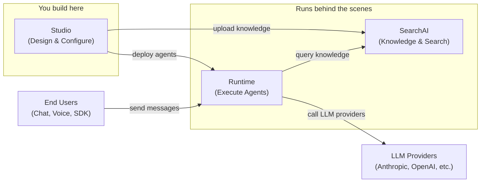
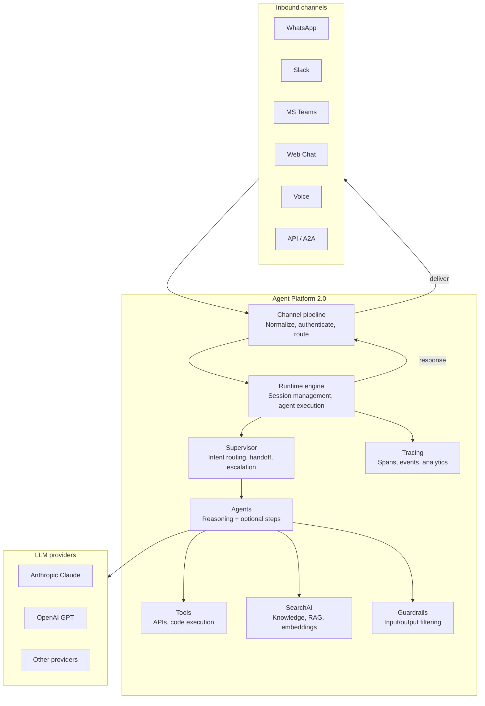
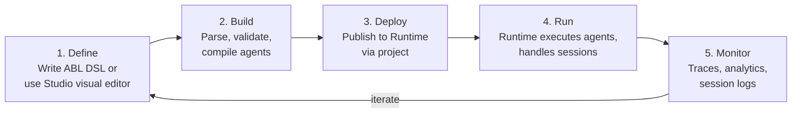

# Platform Overview

## What is Agent Platform 2.0

Agent Platform 2.0 is an enterprise agent platform that lets you define, orchestrate, and deploy AI agents using a purpose-built domain-specific language (DSL). Instead of writing hundreds of lines of imperative code, you describe _what_ your agents should do in a structured, human-readable format — and the platform handles execution, routing, channels, and observability.

Three value propositions define the platform:

- **DSL-driven agent development** — Define agents in ABL, a declarative language designed for agent behavior. No framework boilerplate.
- **Multi-agent orchestration** — Supervisors route conversations to specialist agents with handoff, delegation, escalation, and fan-out patterns built in.
- **Enterprise-grade by default** — Multi-tenant isolation, encryption at rest and in transit, audit logging, and guardrails are platform primitives, not afterthoughts.

### Who is this for?

Agent Platform 2.0 serves four primary personas, each with a different entry point:

- **Agent developer** — You define agent behavior in ABL DSL or Studio's visual editor. You write supervisor routing logic, tool integrations, and knowledge base configurations. Start with the [Quickstart](./quickstart), then move to [Your first agent](../tutorials/build-your-first-agent).
- **QA / Tester** — You create evaluation sets with personas, scenarios, and LLM-based judges to validate agent behavior at scale. Start with the [Evaluation guide](../tutorials/safety-testing-publishing).
- **Ops engineer** — You deploy and monitor agents across environments. The platform provides health checks, trace-level observability, session analytics, and distributed execution on Kubernetes.
- **Workspace admin** — You manage tenants, projects, users, and permissions. You configure LLM credentials, channel connections, and access policies across your organization.

## Key Advantages

Agent Platform 2.0 takes a fundamentally different approach to building AI agents. This section covers the core design decisions and how they compare to alternatives.

### Declarative agent definition

ABL agents are defined in a purpose-built DSL, not imperative code. You declare the agent's goal, tools, and behavior — the runtime handles execution.

```abl
AGENT: Policy_Advisor

EXECUTION:
  model: claude-sonnet-4-5-20250929

GOAL: |
  Answer airline policy questions using semantic search
  over policy documents.

TOOLS:
  search_hybrid(index_id: string, query: string, top_k: number) -> {results: object[]}

INSTRUCTIONS: |
  1. Analyze query for airline-specific terms
  2. Execute search_hybrid with query and filters
  3. Synthesize a clear policy answer with source attribution
```

This 15-line definition replaces what would otherwise be several hundred lines of framework setup code. The DSL is version-controlled, diffable, and readable by non-engineers.

### Per-step reasoning control

Most agent frameworks force a binary choice: full LLM reasoning or no reasoning at all. ABL lets you control reasoning at the step level within a single agent.

```abl
FLOW:
  steps:
    - welcome
    - get_destination
    - search_hotels
    - present_options

  welcome:
    REASONING: false
    RESPOND: "Welcome to Hotel Booking! Let's find your perfect hotel."
    THEN: get_destination

  get_destination:
    REASONING: false
    GATHER:
      - destination: required
    THEN: search_hotels

  search_hotels:
    REASONING: false
    CALL: search_hotels(destination, checkin_date, checkout_date, num_guests)
    THEN: present_options

  # The LLM composes a personalized recommendation based on
  # the search results, user preferences, and destination context.
  present_options:
    REASONING: true
    INSTRUCTIONS: |
      Review the hotel search results and present a curated
      recommendation. Highlight pros and cons based on the
      user's destination and travel context.
    AVAILABLE_TOOLS: [get_hotel_reviews]
    THEN: COMPLETE
```

Deterministic steps (data gathering, API calls, template responses) run without LLM calls. Reasoning steps (like `present_options` above) use the LLM to make intelligent decisions — here, composing a personalized hotel recommendation rather than a static template. You control cost, latency, and predictability per step.

### Multi-agent orchestration

ABL has first-class support for multi-agent systems. A Supervisor routes conversations to specialist agents based on intent, context, and priority.

```abl
SUPERVISOR: Travel_Supervisor

GOAL: |
  Route customers to the right specialist for booking,
  support, or human assistance.

HANDOFF:
  - TO: Flight_Search
    WHEN: intent contains "flight" OR intent contains "fly"
    CONTEXT:
      pass: [destination, date, passengers]
      summary: "User needs flight booking assistance"
    RETURN: true

  - TO: Hotel_Search
    WHEN: intent contains "hotel" OR intent contains "stay"
    CONTEXT:
      pass: [destination, checkin, checkout, guests]
    RETURN: true

  - TO: Live_Agent_Transfer
    WHEN: user.frustration_detected == true
    CONTEXT:
      pass: [conversation_summary, transfer_reason]
    RETURN: false
```

Orchestration patterns supported out of the box:

| Pattern            | Description                                                    |
| ------------------ | -------------------------------------------------------------- |
| **Handoff**        | Route a conversation to a specialist agent                     |
| **Delegation**     | Send a sub-task to an agent and get results back               |
| **Escalation**     | Transfer to a human agent with full context                    |
| **Fan-out**        | Run multiple agents in parallel and merge results              |
| **Return routing** | Agent completes its task and returns control to the supervisor |

### Enterprise-ready

Security and compliance features are built into the platform core, not bolted on.

- **Multi-tenant isolation** — Every query is scoped to a tenant. Cross-tenant access is architecturally prevented.
- **Encryption** — Data encrypted at rest and in transit.
- **Audit logging** — Every agent action, tool call, and administrative change is logged.
- **Guardrails** — Input and output guardrails filter content before and after LLM processing.

```abl
GUARDRAILS:
  profanity_filter:
    kind: input
    check: abl.matches_pattern(abl.lower(input), "(abusive|profane)")
    action: block
    message: "Please keep our conversation respectful."

  toxicity_check:
    kind: output
    provider: openai_moderation
    category: hate
    threshold: 0.5
    action: block
    message: "Response blocked due to potential harmful content."
```

### Visual and code development

Studio provides a visual editor for designing agents alongside a code editor for the ABL DSL. Agents use a full-page configuration panel. Agents with steps also have a canvas-based flow editor with a configuration sidebar for designing their step sequences.

Both modes produce the same ABL DSL output. You can start visually and switch to code, or vice versa. Teams can collaborate with each member using their preferred editing mode.

### 20+ communication channels

Deploy agents to any channel without changing agent logic. The platform adapts responses to each channel's native format.

| Category       | Channels                                                                           |
| -------------- | ---------------------------------------------------------------------------------- |
| **Messaging**  | WhatsApp, Slack, Microsoft Teams, Telegram, Messenger, Instagram, LINE, Twilio SMS |
| **Voice**      | VXML, Kore Voice Gateway, AudioCodes, Twilio Voice, LiveKit, Pipeline Voice        |
| **Web**        | Web Chat, SDK WebSocket, AG-UI                                                     |
| **Enterprise** | Zendesk, Genesys, Email                                                            |
| **API**        | HTTP, HTTP Async, Agent-to-Agent (A2A)                                             |

Agents can define channel-specific response formats using templates:

```abl
TEMPLATES:
  welcome:
    DEFAULT: "Welcome! How can I help you today?"
    MARKDOWN: |
      # Welcome!
      How can I help you today?
    HTML: |
      <div class="welcome-card">
        <h2>Welcome!</h2>
        <p>How can I help you today?</p>
      </div>
    VOICE INSTRUCTIONS: "Use a warm, friendly tone."
```

### Knowledge base with RAG pipeline

SearchAI provides a full retrieval-augmented generation pipeline. Upload documents, and the platform handles chunking, embedding, indexing, and retrieval.

Agents access knowledge through built-in search tools:

- **Semantic search** — Vector-based similarity search
- **Structured search** — Metadata-filtered queries with vocabulary resolution
- **Hybrid search** — Combines semantic and structured approaches

Knowledge sources are declared at the agent or project level. No custom retrieval code required.

### Built-in evaluation framework

Test agents systematically before deploying them to production.

- **Personas** — Define synthetic user profiles with demographics, behavior patterns, and communication styles
- **Scenarios** — Create multi-turn conversation scripts that exercise specific agent behaviors
- **Evaluators** — Configure LLM-based judges that score responses on custom criteria
- **Eval runs** — Execute evaluation sets at scale and compare results across agent versions

### Comparison: ABL vs alternatives

| Capability                 | Agent Platform 2.0                      | LangGraph        | CrewAI      | Bedrock Agents     |
| -------------------------- | --------------------------------------- | ---------------- | ----------- | ------------------ |
| Agent definition           | Declarative DSL                         | Python code      | Python code | Console + SDK      |
| Per-step reasoning control | Yes                                     | Manual           | No          | No                 |
| Multi-agent orchestration  | Built-in (supervisor, handoff, fan-out) | Graph-based      | Role-based  | Single agent       |
| Communication channels     | 20+ built-in                            | Custom           | Custom      | Limited            |
| Visual editor              | Studio (visual + code)                  | LangGraph Studio | No          | Console            |
| Knowledge/RAG              | Integrated (SearchAI)                   | Custom           | Custom      | Knowledge bases    |
| Guardrails                 | DSL-level (input + output)              | Custom           | Custom      | Bedrock Guardrails |
| Evaluation framework       | Built-in (personas, scenarios, judges)  | LangSmith        | No          | No                 |
| Multi-tenant isolation     | Platform-level                          | Custom           | Custom      | AWS IAM            |
| Voice support              | Native (6 voice channels)               | Custom           | No          | No                 |
| Deployment                 | Hosted or self-hosted                   | Self-hosted      | Self-hosted | AWS only           |

## Platform Components

Agent Platform 2.0 is made up of three cooperating services. You interact directly with one of them (Studio), and the other two work behind the scenes.



### Studio

Studio is the browser-based development environment — no local installation required. It is where you design and configure your agents. In Studio, you:

- Create and manage projects
- Define agents using ABL (the Agent Blueprint Language) or the visual editor
- Configure tools, guardrails, and multi-agent orchestration
- Upload documents to knowledge bases
- Connect LLM providers and manage credentials
- Test agents in the built-in chat playground
- Deploy agents to production

Studio provides two editing modes:

- **Visual editor** — Full-page configuration panel for all agents; canvas-based flow editor for agents with steps
- **Code editor** — Direct ABL DSL editing with syntax highlighting and validation

Everything you do in Studio produces configuration and definitions that the Runtime uses to execute your agents.

### Runtime

Runtime is the agent execution engine. When an end user sends a message, Runtime:

1. Receives messages from end users via chat, voice, SDK, or channel integrations
2. Loads the compiled agent definition (the IR, or Intermediate Representation)
3. Executes reasoning loops or step-based flows depending on the agent's execution mode
4. Calls LLM providers to generate responses
5. Invokes tools when the agent needs external data or actions
6. Enforces guardrails and constraints
7. Manages conversation sessions and context
8. Coordinates multi-agent handoffs and delegations
9. Delivers the response through the appropriate channel adapter

You do not interact with the Runtime directly during development. Your end users interact with it through the channels you configure. On the managed platform, Runtime scales automatically — you never need to provision or manage execution infrastructure.

### SearchAI

SearchAI powers the knowledge base and RAG pipeline. When you upload documents, SearchAI processes them into a searchable format. When an agent needs to answer questions using your knowledge, the Runtime queries SearchAI. SearchAI handles:

- **Document ingestion** — Upload PDFs, Word docs, HTML, and other formats; extract text automatically
- **Chunking and preprocessing** — Split documents into optimal retrievable segments
- **Embedding** — Generate vector embeddings for semantic search
- **Indexing** — Store embeddings and metadata for fast retrieval
- **Query processing** — Vocabulary resolution, hybrid search, and result ranking
- **Live data sync** — Enrich content with metadata, entities, and summaries from external connectors

Agents access SearchAI through built-in search tools. You configure knowledge sources at the project level and reference them in agent definitions.

### Tools

Tools are the bridge between agents and external systems. The platform provides:

- **Built-in tools** — Search, knowledge retrieval, vocabulary resolution
- **Custom tools** — Define tool signatures in ABL and connect them to API endpoints
- **Code execution** — Run sandboxed Python code for computation tasks

Tools are declared in agent definitions and bound to implementations at the project level.

### Channels

Channels connect agents to users across messaging, voice, web, and enterprise platforms. Each channel adapter handles:

- **Inbound message normalization** — Convert platform-specific payloads to a common format
- **Outbound response formatting** — Adapt agent responses to the channel's native format
- **Media processing** — Handle file uploads, images, and attachments
- **Authentication** — Verify webhook signatures and manage channel credentials

You configure channel connections per project in Studio. Agent logic stays the same regardless of which channel delivers the message.

### Architecture diagram



## Developer Workflow

Building an agent on Agent Platform 2.0 follows a natural progression from design to deployment.



Each stage maps to a specific platform component:

1. **Create a project** — A project is a container for your agents, knowledge bases, tools, and configuration. Everything in ABL is project-scoped.
2. **Define agents** — Write agents in ABL or use the visual editor. Agents reason by default; optionally add a FLOW section with steps for structured execution.
3. **Configure tools and knowledge** — Give your agents capabilities by connecting tools (APIs, code, MCP services) and uploading knowledge base documents.
4. **Set guardrails and constraints** — Define safety boundaries: input filtering, output checks, topic restrictions, and PII handling.
5. **Test in the playground** — Use the built-in chat to interact with your agents, inspect trace events, and debug behavior.
6. **Deploy** — Publish your agents and connect them to channels (web widget, voice, custom SDK integration).
7. **Monitor and optimize** — Track conversations, review analytics, and refine your agent definitions based on real usage.

### What you see vs. what happens behind the scenes

| What you see                        | What happens behind the scenes                                                                                                            |
| ----------------------------------- | ----------------------------------------------------------------------------------------------------------------------------------------- |
| Writing an ABL definition in Studio | The compiler parses ABL into an Intermediate Representation (IR) that the Runtime can execute                                             |
| Uploading a PDF to a knowledge base | SearchAI extracts text, chunks it, generates embeddings, and stores it for retrieval                                                      |
| Testing an agent in the playground  | The Runtime creates a session, sends your message through the execution engine, calls the LLM, and streams the response back              |
| Deploying an agent                  | The Runtime loads the compiled IR and makes the agent available on configured channels                                                    |
| An end user asking a question       | The Runtime receives the message, the agent queries SearchAI for relevant knowledge, the LLM generates a response with guardrails applied |

### Build phase

1. You write agent definitions in ABL DSL or Studio's visual editor
2. The parser validates syntax and produces an abstract syntax tree (AST)
3. The compiler transforms the AST into an executable agent configuration
4. The compiled output is stored in the project and published to Runtime

### Deploy phase

1. Projects group related agents, tools, knowledge bases, and channel connections
2. Each project has a published version that Runtime loads on demand
3. Channel connections are configured per project — one project can serve multiple channels

### Run phase

1. A user sends a message through a channel (WhatsApp, Slack, web, etc.)
2. The channel adapter normalizes the message and resolves the session
3. Runtime loads the active agent for the session
4. For supervisor agents, the message is routed to the appropriate specialist
5. The agent executes its logic: reasoning mode calls the LLM; steps with `REASONING: false` follow the flow deterministically
6. Tools are called, knowledge is retrieved, and guardrails are applied
7. The response is formatted for the channel and delivered back to the user

### Monitor phase

1. Every execution path produces trace events (spans, tool calls, LLM requests)
2. Session analytics track conversation metrics, intents, and outcomes
3. The evaluation framework runs automated test conversations against agent versions

## Key Concepts

A few concepts that appear throughout the platform:

- **Project** — The top-level container for all your work. Agents, knowledge bases, tools, and settings are all scoped to a project.
- **Agent** — An AI-powered entity that can converse with users, use tools, and coordinate with other agents. Agents reason by default and can optionally include a FLOW section with structured steps.
- **ABL (Agent Blueprint Language)** — The enterprise control plane for agentic AI. A schema-driven language for multi-agent orchestration that spans the full control spectrum — from autonomous delegation to deterministic state machines. Agent definitions compile into immutable, auditable artifacts.
- **IR (Intermediate Representation)** — The compiled output of ABL definitions. The Runtime executes the IR, not the raw ABL text. You do not need to work with the IR directly.
- **Session** — A conversation between an end user and an agent (or a chain of agents). Sessions track conversation history, collected data, and execution state.
- **Tenant** — An organizational boundary. All resources (projects, agents, knowledge bases, credentials) are isolated within a tenant.

## Deployment Options

| Option                       | Description                                                                                                      |
| ---------------------------- | ---------------------------------------------------------------------------------------------------------------- |
| **Cloud (SaaS)**             | The default experience. Sign up, open Studio in your browser, and start building — nothing to install or manage. |
| **Self-hosted (Enterprise)** | For organizations that require on-premises deployment. Available as an enterprise option with dedicated support. |

The cloud platform is the recommended path for most teams. Self-hosted deployments provide the same platform capabilities and are available for enterprise customers with specific data-residency or compliance requirements.
