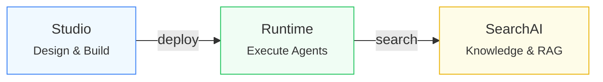
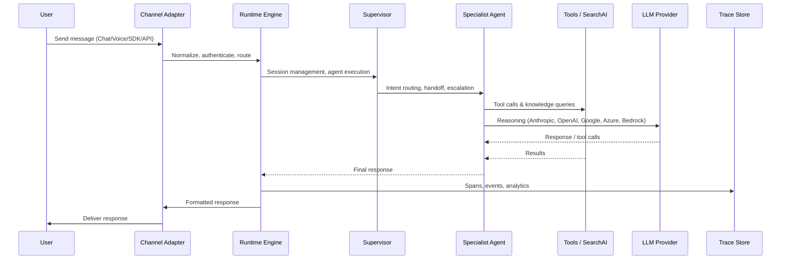
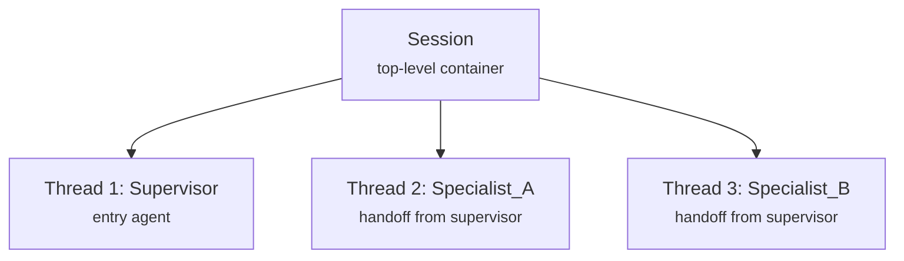
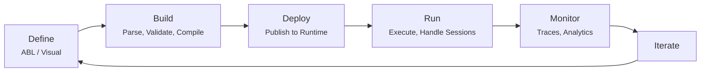

# Agent Platform 2.0: Comprehensive Overview

> This document is a consolidated reference covering the Agent Platform 2.0 end-to-end. It is designed to serve as input for generating training slides and presentation decks that provide both an executive-level overview and sufficient technical depth for a developer audience.

---

## 1. Elevator Pitch

**Agent Platform 2.0 is an enterprise SaaS platform for building, deploying, and managing AI agents using ABL (Agent Blueprint Language) -- the enterprise control plane for agentic AI, where deterministic governance meets autonomous reasoning.**

Instead of writing hundreds of lines of imperative framework code, teams describe _what_ their agents should do in a structured, human-readable DSL -- and the platform handles execution, multi-agent routing, 20+ communication channels, knowledge retrieval, guardrails, and full observability.

**Three sentences that capture the value:**

1. **Declarative, not imperative.** A 15-line ABL definition replaces what would otherwise be several hundred lines of Python/JS framework boilerplate. Agent definitions are version-controlled, diffable, and readable by non-engineers.
2. **Multi-agent orchestration is a first-class primitive.** Supervisors route conversations to specialist agents with handoff, delegation, escalation, and fan-out patterns -- all defined declaratively in ABL.
3. **Enterprise-grade from day one.** Multi-tenant isolation, encryption at rest/transit, input/output guardrails, audit logging, PII protection, and SOC 2 Type II compliance are built into the platform core -- not bolted on.

---

## 2. Who Is This For?

| Persona             | Entry Point            | What They Do                                                                                    |
| ------------------- | ---------------------- | ----------------------------------------------------------------------------------------------- |
| **Agent Developer** | Studio IDE / ABL DSL   | Define agent behavior, write supervisor routing logic, configure tools and knowledge bases      |
| **QA / Tester**     | Evaluation Framework   | Create personas, scenarios, and LLM judges to validate agent behavior at scale                  |
| **Ops Engineer**    | Deployments & Sessions | Deploy agents across environments, monitor traces, track session analytics                      |
| **Workspace Admin** | Admin Console          | Manage tenants, users, permissions, LLM credentials, channel connections, and security policies |

---

## 3. Platform Architecture

### Three Core Services



**Studio** -- Browser-based IDE (Next.js, port 5173). No local installation. Design agents visually or in code, test interactively, deploy to production.

**Runtime** -- Stateless execution engine (Node.js, port 3112). Receives messages from 20+ channels, loads compiled agent definitions (IR), executes reasoning loops or step-based flows, calls LLMs, invokes tools, enforces guardrails, manages sessions, coordinates multi-agent handoffs.

**SearchAI** -- Full RAG pipeline (port 3113, with SearchAI Runtime on 3114). Handles document ingestion (PDF, DOCX, HTML, CSV, JSON), text extraction, chunking (semantic/fixed/hierarchical), embedding (BGE-M3), vector+keyword hybrid search, vocabulary resolution, knowledge graph extraction, and live data sync via connectors.

**Supporting Services** -- Admin Console (port 3003), Python services for document processing: Docling (8080), BGE-M3 embeddings (8000), Preprocessing (8003). Infrastructure: MongoDB 7.0+ (replica set), Redis 7+ (persistence, TLS), ClickHouse (optional, for analytics).

### End-to-End Flow



---

## 4. ABL -- The Agent Blueprint Language

Every enterprise deploying agents faces the same tension: you need AI autonomy to unlock value, but you need deterministic control to stay in production. ABL resolves this with a schema-driven language purpose-built for multi-agent orchestration.

- **Full-spectrum control** -- Not just autonomous or deterministic — ABL spans the entire control spectrum. Delegate autonomously, supervise selectively, or lock down as a deterministic state machine. One language, every mode.
- **Local + remote agent topology** -- Local agents run deterministic logic with creative reasoning. Remote agents connect any custom framework via A2A-enabled fan-out patterns. Your agents, your infrastructure, one orchestration layer.
- **Parallel execution with state semantics** -- Fan-out/fan-in orchestration with parent-child state transfer — so parallel agents stay coordinated without brittle glue code.
- **Compiled and immutable by design** -- Agent definitions compile into immutable artifacts. Every version is auditable, every deployment is reproducible, every change is governed.
- **Deep observability — native, not bolted on** -- Tracing across agent delegation chains is built into the runtime. No third-party instrumentation, no blind spots between handoffs.
- **AI-programmable platform** -- ABL is not just human-writable — it is designed as a code-generation target. AI authors agent blueprints; the platform compiles and enforces them.

### File Types

| Extension          | Document Type    | Purpose                                        |
| ------------------ | ---------------- | ---------------------------------------------- |
| `.agent.abl`       | Agent definition | Most common -- defines a single agent          |
| `.supervisor.abl`  | Supervisor       | Top-level orchestrator for multi-agent         |
| `.tools.abl`       | Tool library     | Reusable tool definitions shared across agents |
| `.agent.yaml`      | YAML agent       | Alternative YAML format for agent definitions  |
| `BEHAVIOR_PROFILE` | Behavior profile | Reusable behavior configurations               |

### Top-Level Sections

Every ABL agent can include these sections (only `AGENT` and `GOAL` are required):

| Section         | Purpose                                     | Required |
| --------------- | ------------------------------------------- | -------- |
| `AGENT`         | Agent name (PascalCase_With_Underscores)    | Yes      |
| `GOAL`          | Primary objective                           | Yes      |
| `VERSION`       | Semantic version (default: "1.0.0")         | No       |
| `DESCRIPTION`   | Human-readable summary                      | No       |
| `LANGUAGE`      | BCP 47 language code (e.g., "en", "es-EC")  | No       |
| `PERSONA`       | Agent personality and communication style   | No       |
| `IDENTITY`      | Structured identity (role, expertise, tone) | No       |
| `LIMITATIONS`   | Prompt-level boundaries and caveats         | No       |
| `INSTRUCTIONS`  | Operational procedural guidance             | No       |
| `EXECUTION`     | Model & runtime configuration               | No       |
| `TOOLS`         | Tool definitions and imports                | No       |
| `GATHER`        | Information collection fields               | No       |
| `FLOW`          | Structured execution steps                  | No       |
| `MEMORY`        | Session & persistent state                  | No       |
| `CONSTRAINTS`   | Runtime checks and business rules           | No       |
| `GUARDRAILS`    | Input/output safety checks                  | No       |
| `HANDOFF`       | Agent transfer rules                        | No       |
| `DELEGATE`      | Sub-agent delegation                        | No       |
| `ESCALATE`      | Human escalation triggers                   | No       |
| `COMPLETE`      | Completion conditions                       | No       |
| `NLU`           | Natural language understanding config       | No       |
| `ON_START`      | Session initialization                      | No       |
| `ON_ERROR`      | Error handlers                              | No       |
| `HOOKS`         | Lifecycle event handlers                    | No       |
| `TEMPLATES`     | Reusable response templates                 | No       |
| `MESSAGES`      | Customizable system-generated messages      | No       |
| `LOOKUP_TABLES` | Reference data for validation               | No       |
| `ATTACHMENTS`   | File/media collection config                | No       |
| `SYSTEM_PROMPT` | Custom system prompt template               | No       |

### Anatomy of an ABL Agent

```abl
AGENT: Support_Assistant

VERSION: "1.0.0"

EXECUTION:
  model: claude-sonnet-4-5-20250929
  temperature: 0.3
  max_tokens: 4096
  max_reasoning_iterations: 15
  enable_thinking: true
  thinking_budget: 2048

GOAL: |
  Help customers with product questions. Be concise
  and friendly. If you do not know the answer, say so.

PERSONA: |
  Helpful product support assistant. Answers questions
  clearly and concisely.

LIMITATIONS:
  - "Cannot process payments or refunds"
  - "Cannot access customer account information"

TOOLS:
  search_knowledge(query: string) -> {results: object[], totalCount: number}
    description: "Search the product knowledge base"

GUARDRAILS:
  profanity_filter:
    kind: input
    check: abl.matches_pattern(abl.lower(input), "(abusive|profane)")
    action: block
    message: "Please keep our conversation respectful."

INSTRUCTIONS: |
  1. Understand the customer's question
  2. Search the knowledge base for relevant information
  3. Provide a clear, sourced answer
  4. If unsure, offer to connect with a human agent
```

### Execution Configuration

The `EXECUTION` block controls model selection and runtime behavior:

| Property                   | Description                                      |
| -------------------------- | ------------------------------------------------ |
| `model`                    | Primary LLM model identifier                     |
| `temperature`              | Sampling temperature (0.0-1.0)                   |
| `max_tokens`               | Maximum tokens in LLM response                   |
| `max_reasoning_iterations` | Maximum reasoning loop iterations                |
| `max_flow_iterations`      | Maximum step transitions in flow                 |
| `tool_timeout`             | Tool execution timeout (ms)                      |
| `llm_timeout`              | LLM inference timeout (ms)                       |
| `session_idle_timeout`     | Session expiration timeout                       |
| `fallback_model`           | Model for unavailability fallback                |
| `enable_thinking`          | Extended thinking capability                     |
| `thinking_budget`          | Token budget for extended thinking               |
| `compaction_threshold`     | Context usage ratio triggering auto-compaction   |
| `inline_gather`            | Collect gather fields inline during conversation |
| `voice_latency_target`     | Target latency for voice responses               |

**Per-Operation Model Routing** -- Route different operations to different models within the same agent:

```abl
EXECUTION:
  models:
    extraction: gpt-4o-mini        # Fast model for data extraction
    response_gen: claude-sonnet     # Balanced model for responses
    reasoning: claude-opus          # Powerful model for complex reasoning
    coordination: gpt-4o-mini      # Fast model for multi-agent routing
```

### One Agent, Two Execution Modes

Every agent reasons by default. When you need structured execution, add a FLOW section with steps. This is not a different type of agent -- it is the same agent with an optional flow definition.

| Feature           | Agent (default)                             | Agent with steps                              |
| ----------------- | ------------------------------------------- | --------------------------------------------- |
| Decision making   | LLM decides next action autonomously        | Steps define explicit transitions             |
| Best for          | Open-ended conversations, complex reasoning | Structured workflows, deterministic processes |
| Reasoning control | Always on                                   | Per-step (`REASONING: true/false`)            |
| Editor UI         | Full-page configuration panel               | Full-page config + visual flow canvas         |

### Per-Step Reasoning Control -- The Differentiator

Within a FLOW, each step's `REASONING` toggle controls whether it uses LLM reasoning or runs deterministically:

```abl
FLOW:
  collect_preferences:
    REASONING: false         # Deterministic data collection
    GATHER:
      - destination: required
      - travel_dates: required
    THEN: research_options

  research_options:
    REASONING: true          # LLM autonomously researches
    GOAL: "Research travel options for {{destination}}"
    AVAILABLE_TOOLS: [search_flights, search_hotels, get_weather]
    MAX_TURNS: 8
    EXIT_WHEN: "all options found"
    STEP_CONSTRAINTS:
      - REQUIRE total_cost <= budget
    THEN: present_plan

  present_plan:
    REASONING: false         # Deterministic presentation
    RESPOND: "Here is your travel plan: {{compiled_itinerary}}"
    THEN: COMPLETE
```

This gives teams deterministic control where they need predictability (data collection, confirmations, API calls) and LLM autonomy where they need flexibility (research, analysis, open-ended Q&A).

### Flow Control Constructs

| Construct          | Purpose                                            |
| ------------------ | -------------------------------------------------- |
| `THEN`             | Basic next-step transition                         |
| `ON_RESULT`        | Multi-way branching based on tool result (IF/ELSE) |
| `ON_INPUT`         | Branching based on user input after GATHER         |
| `ON_SUCCESS/FAIL`  | Alternative to ON_RESULT for binary branching      |
| `DIGRESSIONS`      | Intent-based flow interruptions with resume/goto   |
| `SUB_INTENTS`      | Step-scoped intent patterns for corrections        |
| `MAX_ATTEMPTS`     | Limit step executions with ON_EXHAUSTED fallback   |
| `CALL...WITH...AS` | Invoke tool with parameters, store result          |
| `SET`              | Assign session variables                           |
| `CHECK`            | Evaluate condition with ON_FAIL                    |
| `CLEAR`            | Remove variables from context                      |
| `TRANSFORM`        | Filter, map, sort, limit arrays                    |
| `PRESENT`          | Display formatted presentation before collection   |
| `COMPLETE`         | Exit the flow                                      |

### Interactive Actions in Flow

Steps can present interactive UI elements (buttons, select menus, input fields) and handle user responses:

```abl
  confirm_booking:
    REASONING: false
    RESPOND: "Review your booking details:"
    ACTIONS:
      - id: confirm
        type: button
        label: "Confirm Booking"
        value: confirmed
      - id: cancel
        type: button
        label: "Cancel"
        value: cancelled
    ON_ACTION:
      confirm:
        SET: booking_status = "confirmed"
        GOTO: process_payment
      cancel:
        RESPOND: "Booking cancelled."
        COMPLETE: true
```

### Expressions & Built-in Functions

ABL includes a full expression language with 36+ built-in functions:

**Operators**: `==`, `!=`, `>`, `<`, `>=`, `<=`, `IN`, `NOT IN`, `contains`, `matches`, `AND`, `OR`, `NOT`, `IS SET`, `IS NOT SET`, `EXISTS`, `EMPTY`

**Math**: `ADD`, `SUB`, `MUL`, `DIV`, `ROUND`, `ABS`, `MIN`, `MAX`

**String**: `UPPER`, `LOWER`, `TRIM`, `SUBSTRING`, `REPLACE`, `SPLIT`, `JOIN`, `PAD_START`, `PAD_END`, `REPEAT`

**Formatting**: `MASK` (last4, first4, N\*N patterns), `FORMAT_CURRENCY`, `FORMAT_DATE`, `ORDINAL`

**Type**: `IS_ARRAY`, `IS_NUMBER`, `IS_STRING`, `TO_NUMBER`, `TO_STRING`, `LENGTH`

**Array/Object**: `ARRAY_FIND`, `ARRAY_FIND_INDEX`, `OBJECT_KEYS`, `OBJECT_VALUES`, `OBJECT_MERGE`

**Utility**: `COALESCE`, `NOW`, `UNIQUE_ID`

**Template Syntax**: `{{variable_name}}`, `{{#if variable}}...{{/if}}`, `{{FORMAT_CURRENCY(balance, "USD")}}`

### Data Types

**Primitive types**: `string`, `number`, `boolean`, `date`, `datetime`

**Complex types**: `array<T>`, `object<{...}>`, `enum<[...]>`, `union<[...]>`, `nullable<T>`

**Lookup Tables** -- Reference data for validation with three source types:

| Source       | Description                                |
| ------------ | ------------------------------------------ |
| `inline`     | Static values defined directly in ABL      |
| `collection` | External data collection (database-backed) |
| `api`        | HTTP endpoint returning lookup data        |

Lookup tables support `case_sensitive`, `fuzzy_match`, and `fuzzy_threshold` (default 0.85) for flexible matching.

### Attachments

GATHER can collect files and media with automatic processing:

```abl
ATTACHMENTS:
  receipt_photo:
    prompt: "Please upload a photo of your receipt"
    category: image
    required: true
    max_file_size_mb: 10
    allowed_mime_types: ["image/jpeg", "image/png"]
    ocr_enabled: true
```

| Category   | Processing                                   | Access Pattern             |
| ---------- | -------------------------------------------- | -------------------------- |
| `document` | OCR text extraction                          | `{{field.extracted_text}}` |
| `image`    | OCR text extraction                          | `{{field.extracted_text}}` |
| `audio`    | Speech-to-text transcription                 | `{{field.transcript}}`     |
| `video`    | Keyframe extraction + optional transcription | `{{field.keyframes}}`      |

---

## 5. Multi-Agent Orchestration

ABL has first-class support for multi-agent systems with four coordination patterns:

### Orchestration Patterns

| Pattern        | Description                                      | User Experience                                   |
| -------------- | ------------------------------------------------ | ------------------------------------------------- |
| **Handoff**    | Route conversation to a specialist agent         | User is "transferred" to a new agent              |
| **Delegation** | Send a sub-task to an agent and get results back | Transparent -- user doesn't see the delegation    |
| **Escalation** | Transfer to a human agent with full context      | User gets connected to a real person              |
| **Fan-out**    | Run multiple agents in parallel, merge results   | Transparent -- user sees a single combined result |

### Session Hierarchy



**Context flow between agents:**

| Data Type              | Transferred?                                                       |
| ---------------------- | ------------------------------------------------------------------ |
| Session metadata       | Yes (non-internal values forwarded)                                |
| Conversation history   | Configurable: auto/summary\*only/full/{ mode: last_n, count }/none |
| GATHER progress        | No (not transferred)                                               |
| Custom variables (SET) | Yes (transferred as metadata)                                      |
| Agent-specific state   | No (not transferred)                                               |
| Persistent memory      | Via explicit `memory_grants`                                       |

### Supervisor Definition

```abl
SUPERVISOR: Travel_Supervisor

GOAL: "Route customers to the right specialist"

HANDOFF:
  - TO: Flight_Search
    WHEN: intent contains "flight" OR intent contains "fly"
    CONTEXT:
      pass: [destination, date, passengers]
      summary: "User needs flight booking assistance"
      history: auto
      memory_grants:
        - path: user.preferences.travel
          access: read
    RETURN: true
    ON_RETURN:
      handler: Summarize the booking result
    MAP:
      booking_id: flight_booking_id

  - TO: Hotel_Search
    WHEN: intent contains "hotel" OR intent contains "stay"
    CONTEXT:
      pass: [destination, checkin, checkout, guests]
    RETURN: true

  - TO: Live_Agent_Transfer
    WHEN: user.frustration_detected == true
    CONTEXT:
      pass: [conversation_summary, transfer_reason]
    RETURN: false
```

### Supervisor Advanced Features

**HANDOFF** -- Ordered conditional routing rules with context passing:

```abl
HANDOFF:
  - TO: Premium_Agent
    WHEN: customer_tier == "platinum"
    CONTEXT:
      pass: [customer_tier, account_summary]
    RETURN: true
```

**STATE** -- Typed state schema for supervisor-managed variables (organized by namespace, with source tracking)

**POLICIES** -- High-level behavioral rules with `allowedWhen`, `forbiddenWhen`, and `triggerSignal` conditions

**BEHAVIOR** -- Supervisor capabilities: `canRespondDirectly`, `allowedDirectActions`, `forbiddenActions`

**COMMUNICATION** -- Language, formality level (formal/informal/neutral), pronouns, vocabulary, constraints

### Delegation (Call-and-Return)

```abl
DELEGATE:
  - AGENT: Price_Calculator
    WHEN: intent.category == "pricing_quote"
    PURPOSE: "Calculate total price with discounts"
    INPUT:
      items: cart_items
      membership: customer_tier
    RETURNS:
      total_price: calculated_total
      discount_applied: discount_percent
    USE_RESULT: "Present the pricing to the user"
    TIMEOUT: 30000
    ON_FAILURE: respond
    FAILURE_MESSAGE: "Unable to calculate price right now."
```

### Fan-out (Parallel Delegation)

Multiple DELEGATE entries with overlapping WHEN conditions execute in parallel. Each has independent TIMEOUT and ON_FAILURE handling, with distinct variable names in RETURNS.

### Escalation to Humans

```abl
ESCALATE:
  triggers:
    - WHEN: user.frustration_detected == true
      REASON: "Customer expressing frustration"
      PRIORITY: high
      TAGS: ["customer-experience"]
    - WHEN: handoff_count >= 3
      REASON: "Multiple failed handoffs"
      PRIORITY: critical
  context_for_human: [conversation_summary, customer_tier, account_id]
  routing:
    queue: "tier2-support"
    skill_tags: ["billing", "retention"]
  on_human_complete:
    - IF: "outcome == 'resolved'"
      THEN: COMPLETE
    - IF: "outcome == 'needs_agent'"
      THEN: HANDOFF Specialist_Agent
```

### Human Task System

When escalation triggers, a human task appears in the team inbox:

| Property    | Description                                                   |
| ----------- | ------------------------------------------------------------- |
| Task types  | approval, data_entry, review, decision, escalation            |
| Status      | pending, assigned, in_progress, completed, expired, cancelled |
| Priority    | low, medium, high, critical                                   |
| Form fields | text, number, boolean, select, textarea, date                 |
| SLA         | Deadline with escalation chains                               |

Sessions suspend until human resolution, then resume with `human.field` context available.

### Project Orchestration Patterns (Pre-built Topologies)

| Pattern       | Description                                           | Best For                    |
| ------------- | ----------------------------------------------------- | --------------------------- |
| **Concierge** | Single front-facing agent delegates behind the scenes | Customer service, help desk |
| **Router**    | Triage agent routes to specialists directly           | Multi-department support    |
| **Tiered**    | Triage -> L1 -> L2 with escalation paths              | Technical support           |
| **Custom**    | Flexible topology                                     | Advanced use cases          |

### Real-World Scale: Jupiter Banking Example

A 12-agent enterprise banking deployment with ordered conditional routing:

```mermaid
graph TD
    JS["Jupiter_Supervisor"]
    IV["Identity_Verification<br/><small>auth gate</small>"]
    FC["Fraud_Claims<br/><small>P2 - time-sensitive</small>"]
    DR["Dispute_Resolution<br/><small>P3</small>"]
    CH["Complaint_Handler<br/><small>P4</small>"]
    CM["Card_Management<br/><small>P5</small>"]
    PP["Payment_Processing<br/><small>P6</small>"]
    AI["Account_Inquiry<br/><small>P7</small>"]
    AM["Account_Maintenance<br/><small>P8</small>"]
    FR["Fee_Resolution<br/><small>P9</small>"]
    LA["Lending_Advisory<br/><small>P10</small>"]
    CA["Credit_Card_Advisory<br/><small>P11</small>"]
    SO["Savings_Optimizer<br/><small>P12</small>"]
    LT["Live_Agent_Transfer<br/><small>P0 - human escalation</small>"]

    JS --> IV
    JS --> FC
    JS --> DR
    JS --> CH
    JS --> CM
    JS --> PP
    JS --> AI
    JS --> AM
    JS --> FR
    JS --> LA
    JS --> CA
    JS --> SO
    JS --> LT
```



---

## 6. Studio -- The Development Environment

Studio is a browser-based IDE -- no local installation required. It covers the entire agent lifecycle.

### Key Capabilities

- **Project Dashboard** -- Grid of project cards with metrics (agents, sessions, tokens, cost, containment rate), search, and "New Project" dropdown
- **Agent Editor** -- 17 configuration sections organized into six groups:
  - **Identity & Core**: Identity, Execution, Tools
  - **Data & Logic**: Gather, Memory, Flow
  - **Safety & Behavior**: Constraints, Guardrails, Behavior
  - **Coordination**: Handoffs, Delegates, Escalation
  - **Lifecycle**: On Start, Error Handling, Completion
  - **Advanced**: Templates, Definition
- **Visual Flow Editor** -- Canvas-based flow designer with drag-and-drop step palette, node connections, zoom/pan, and property panel for editing step details
- **Code Editor** -- Monaco-powered ABL editor with syntax highlighting and real-time validation; changes sync between visual and code modes
- **AI Architect** -- Context-aware AI assistant built into Studio (see details below)
- **AI-Guided Project Creation** -- Multi-phase wizard (see details below)
- **Test Chat** -- Interactive testing with real-time trace inspection, debug panel, session management, and variable state viewer
- **Command Palette** -- Cmd+K (Mac) / Ctrl+K quick navigation across pages, agents, and actions
- **Project Switcher** -- Dropdown at top of sidebar to switch projects without returning to dashboard
- **Agent Versioning** -- Version history with status tracking (draft, testing, staged, active, deprecated), side-by-side diff viewer, and promotion workflow
- **Pattern-Aware Agent Creation** -- Auto-assigns roles (Concierge, Router, Tiered, Custom) based on selected orchestration pattern
- **WebSocket Connectivity Indicator** -- Real-time connection status in header

### AI Architect

A context-aware AI assistant embedded in Studio that helps design, build, and improve agents:

- **Context Awareness**: Adapts to current page (Agents, Sessions, Overview), current agent, and current section being edited
- **Suggestion Chips**: Context-specific suggestions:
  - Agent editor: "Explain code", "Add error handling", "Suggest improvements", "Generate tests"
  - Session viewer: "Analyze session", "Suggest fix"
  - Project overview: "Summarize health", "Identify bottlenecks"
- **Code Changes**: Proposes changes via diff view with Accept/Reject/Refine workflow
- **Conversation History**: Project-scoped, persisted to server across sessions
- **Controls**: Maximize/restore, minimize, close; accessible from header icon, section buttons, or floating button

### AI-Guided Project Creation Wizard

A multi-phase process for generating complete project structures:

1. **Welcome** -- Introduction to the wizard
2. **Interview** -- AI asks targeted questions about your use case
3. **Upload** -- Analyze uploaded documents (product manuals, FAQs, policies)
4. **Generating** -- AI generates project structure, agents, tools, and routing
5. **Reveal** -- Preview generated structure
6. **Review** -- Edit and refine before creation
7. **Create** -- Generate the project with all components

### Project Sidebar Navigation

| Section       | Pages                                                                                                              |
| ------------- | ------------------------------------------------------------------------------------------------------------------ |
| **Build**     | Overview, Agents, Workflows                                                                                        |
| **Resources** | Tools, Knowledge Bases, Integrations                                                                               |
| **Evaluate**  | Evaluations, Experiments                                                                                           |
| **Operate**   | Sessions, Deployments, Inbox, Alerts, Transfer Sessions                                                            |
| **Insights**  | Dashboard, Agent Performance, Quality Monitor, Customer Insights, Voice Analytics                                  |
| **Govern**    | Guardrails, Governance                                                                                             |
| **Settings**  | Members, API Keys, Models, Config Variables, Git, Runtime Config, Trace Dimensions, Agent Transfer, PII Protection |

---

## 7. Tools & Integrations

Agents connect to external systems through five tool types:

### Tool Types

| Type               | Description                                      | Use Case                                                  |
| ------------------ | ------------------------------------------------ | --------------------------------------------------------- |
| **HTTP Tools**     | REST API calls with auth, retry, circuit breaker | CRM lookup, payment processing, booking APIs              |
| **Code Sandbox**   | Isolated JavaScript/Python execution             | Custom calculations, data transforms, ML inference        |
| **MCP Servers**    | Model Context Protocol connections               | Standardized multi-tool servers (browser, database, etc.) |
| **Lambda Tools**   | Serverless function invocations                  | Lightweight compute, event processing                     |
| **Async Webhooks** | Suspend/resume for long-running operations       | Payment processing, approval workflows, async tasks       |

### Tool Declaration Syntax

```abl
TOOLS:
  tool_name(param1: type, param2: type = default) -> {field: type, field?: type}
    description: "What this tool does"
    type: http | mcp | sandbox | lambda | async_webhook
    # ... binding-specific properties
```

### Tool Execution Hints

```abl
  hints:
    cacheable: true          # Results can be cached
    latency: fast|medium|slow
    side_effects: true       # Modifies external state
    requires_auth: true
    timeout: 5000
```

### Key Tool Features

- **Authentication**: None, API key, Bearer, OAuth2 client credentials, OAuth2 user authorization, SAML, custom headers
- **OAuth2 Details**: `token_url`, `client_id`, `client_secret`, `scopes`, `provider` (for consent UI); automatic token caching and refresh
- **Reliability**: Configurable timeout, retry count, retry_delay, exponential backoff, circuit breaker (threshold + reset_ms)
- **Rate Limiting**: Per-tool requests/second caps
- **Confirmation Prompts**: Require user approval before executing tools with side effects (`require: always|never|when_side_effects`, `immutable_params` for protected values)
- **Async Webhooks**: Platform suspends session, registers callback URL, resumes on webhook callback with HMAC-SHA256 signature verification; configurable timeout (supports minutes to hours)
- **Result Mapping**: `on_result` for variable assignment from tool output; `on_error` for error handling with variable assignment
- **PII Access Control**: `pii_access` levels (tools, user, logs, llm) control where sensitive data flows
- **Context Access**: `context_access` with `read` and `write` permissions for session variables
- **Reusable Tool Files**: `.tools.abl` files with `base_url`, shared `auth`, `timeout`, `retry`, `headers` defaults; import syntax: `FROM "./tools/file.tools.abl" USE: tool1, tool2`

### Code Sandbox Tools

```abl
TOOLS:
  calculate_tax(amount: number, state: string) -> {tax: number, total: number}
    description: "Calculate sales tax"
    type: sandbox
    runtime: javascript    # or python
    timeout: 5000
    memory_mb: 128
    code: |
      function calculate_tax({ amount, state }) {
        const rates = { CA: 0.0725, NY: 0.08, TX: 0.0625 };
        const tax = amount * (rates[state] || 0.05);
        return { tax: Math.round(tax * 100) / 100, total: amount + tax };
      }
```

### Tool Definition Example (HTTP)

```abl
TOOLS:
  process_payment(amount: number, currency: string, card_token: string) -> {transaction_id: string, success: boolean}
    description: "Process a payment"
    type: http
    endpoint: "https://payments.example.com/v1/charge"
    method: POST
    auth: bearer
    timeout: 10000
    retry: 3
    retry_delay: 1000
    circuit_breaker:
      threshold: 5
      reset_ms: 60000
    confirmation:
      require: always
      immutable_params: [amount, currency]
```

### Error Handling

Agent-level and step-level error handlers with retry and backoff:

```abl
ON_ERROR:
  tool_timeout:
    RESPOND: "The service is taking longer than expected."
    RETRY: 2
    RETRY_DELAY: 3000
    RETRY_BACKOFF: exponential
    RETRY_MAX_DELAY: 30000
    THEN: CONTINUE
  tool_error:
    RESPOND: "Something went wrong. Let me try a different approach."
    THEN: ESCALATE
```

Error types: `tool_timeout`, `tool_error`, `validation_error`, `llm_error`, `routing_failure`, `agent_unavailable`, `timeout`. Each supports `subtypes` for fine-grained matching and `BACKTRACK_TO` for flow step recovery.

---

## 8. Knowledge Bases & RAG

SearchAI provides an integrated RAG pipeline with no custom retrieval code required.

### Ingestion Pipeline

```
Upload/Connect -> Ingest -> Extract Text -> Chunk -> Enrich -> Embed -> Store
```

1. **Ingest** -- Register document, check for duplicates via content hashing
2. **Extract** -- Format-specific text extraction (PDF, DOCX, JSON, HTML, plain text)
3. **Chunk** -- Split into searchable segments
4. **Enrich** -- Entity detection, summary generation, language detection, knowledge graph extraction
5. **Embed** -- Vector generation via BGE-M3 (multilingual)
6. **Store** -- Vector database with metadata and permissions

### Supported Formats

- **Documents**: PDF, DOCX, TXT, Markdown
- **Web**: HTML pages, crawls
- **Structured**: JSON, CSV
- **Rich media**: Images in documents (with OCR)

### Chunking Strategies

| Strategy           | Description                                         |
| ------------------ | --------------------------------------------------- |
| **Fixed-size**     | Target token size with configurable overlap         |
| **Semantic**       | Splits on natural boundaries (paragraphs, sections) |
| **Hierarchical**   | Tree of summarized chunks                           |
| **Sliding window** | Overlapping windows for context preservation        |

### Search Strategies

| Strategy                 | Description                                        |
| ------------------------ | -------------------------------------------------- |
| **Hybrid** (recommended) | Combines vector similarity + keyword matching      |
| **Semantic**             | Pure vector search for conceptual matching         |
| **Structured**           | Metadata-filtered queries for structured data      |
| **Aggregation**          | Sum, avg, count, min, max over structured datasets |

### Agent-Level Search Tools

| Tool                 | Purpose                             |
| -------------------- | ----------------------------------- |
| `search_hybrid`      | Vector + keyword search (default)   |
| `search_vector`      | Pure semantic search                |
| `vocabulary_resolve` | Business terms to metadata filters  |
| `search_aggregate`   | Sum, avg, count, min, max over data |
| `search_structured`  | Metadata filter queries             |
| `search_list`        | Paginated structured results        |

### Search Configuration

- `topK`: Number of results (default 5)
- `minScore`: Confidence threshold (default 0.7)
- `strategy`: hybrid/vector/structured/aggregation
- `cacheTtl`: Embedding cache TTL

### Live Data Connectors

| Connector   | What It Syncs                 | Auth Type                |
| ----------- | ----------------------------- | ------------------------ |
| SharePoint  | Documents and pages           | OAuth 2.0                |
| Confluence  | Pages and blog posts          | API token                |
| Jira        | Issues, comments, attachments | API token                |
| Salesforce  | Knowledge articles, cases     | OAuth 2.0                |
| ServiceNow  | Knowledge articles, incidents | OAuth 2.0 / API key      |
| HubSpot     | KB articles                   | API key                  |
| Web Crawler | Any website                   | Configurable crawl rules |
| Database    | SQL query results             | Connection string        |

All connectors support delta sync on configurable schedules -- initial full sync followed by periodic delta syncs. Deleted document removal is automatic.

---

## 9. Data Collection with GATHER

GATHER collects structured data from users through natural conversation.

### Key Features

- **LLM Extraction**: Users provide multiple fields in a single message; the LLM extracts them all
- **Strategies**: `llm` (default -- LLM-based), `pattern` (regex-based), `hybrid` (combined)
- **Field Types**: string, number, date, email, phone, boolean
- **Validation**: Regex patterns (`REGEX`), code-based (`CODE`), LLM-based judgment (`LLM`), cross-field validation via CONSTRAINTS
- **Inference**: Auto-extract values from conversation context with configurable `infer_confidence` threshold (default 0.8) and optional `infer_confirm`
- **Corrections**: Users can change previously provided values without restarting (enable with `CORRECTIONS: true`)
- **Progressive Activation**: Fields activate only after dependencies are met (`activation: progressive`, `depends_on`)
- **Extraction Hints**: Guide LLM on how to interpret ambiguous input
- **List Collection**: `list: true` to collect arrays of values
- **Range Collection**: `range: true` to collect `{low, high}` pairs
- **Preferences**: `preferences: true` to categorize into accept/desire/avoid/refuse
- **Sensitive Fields**: `sensitive: true` with `sensitive_display` (redact/mask/replace) and `mask_config`
- **Transient Fields**: `transient: true` to auto-clean after GATHER completes
- **Custom Retry**: Per-field `retry_prompt` and `max_retries`

### GATHER Example

```abl
GATHER:
  FIELDS:
    destination:
      prompt: "Where would you like to travel?"
      type: string
      required: true
      infer: true
      infer_confidence: 0.9
      extraction_hints: "Look for city names, country names, or airport codes"

    budget:
      prompt: "What's your budget range?"
      type: number
      range: true
      validate: min(100)
      depends_on: [destination]
      activation: progressive

    travel_dates:
      prompt: "When do you want to travel?"
      type: date
      required: true
      validate: "value > NOW()"
      retry_prompt: "Please provide a future date."

  STRATEGY: llm
  CORRECTIONS: true
  COMPLETE_WHEN: "destination IS SET AND travel_dates IS SET"
```

---

## 10. Memory & State Management

### Session Variables

- Scoped to a single conversation; created at session start, discarded at end
- Declared in `MEMORY.session` section
- Types: string, number, object, array, boolean
- Properties: `TYPE`, `DESCRIPTION`, `INITIAL`, `RESET` (per_session / per_step / never)
- Used in templates (`{{var}}`), conditions, and tool calls

### State Manipulation Directives

```abl
# SET -- assign values (literals, expressions, function calls)
SET:
  total: ADD(subtotal, tax)
  greeting: "Hello, {{customer_name}}"
  order_id: UNIQUE_ID(12)
  timestamp: NOW()

# CLEAR -- remove variables from session
CLEAR: [temp_result, intermediate_data]

# TRANSFORM -- filter, map, sort, limit arrays
TRANSFORM:
  SOURCE: search_results
  AS: item
  INTO: filtered_results
  FILTER: "item.score >= 0.8"
  MAP: "{title: item.title, url: item.url}"
  SORT_BY: "item.score DESC"
  LIMIT: 5
```

### Persistent Memory

- Survives across sessions (user preferences, history)
- Dot-notation paths: `user.preferences.language`, `project.faq_count`
- Scope: `user` (per-user) or `project` (shared across users)
- Access control: `read`, `write`, `readwrite`
- TTL-based expiration (s/m/h/d)
- Stored in fact store, accessible via Memory API

### Auto-Recall (Remember/Recall Pattern)

```abl
MEMORY:
  remember:
    - WHEN: "preferred_language IS SET"
      STORE:
        preferred_language -> user.preferences.language
      TTL: 90d

  recall:
    - ON: session:start
      ACTION: inject_context
      PATHS: ["user.preferences"]
    - ON: search:before
      ACTION: load_memory
      DOMAIN: "user.history"
    - ON: session:start
      ACTION: prompt_llm
      INSTRUCTION: "Recall the user's previous interactions and preferences"
```

---

## 11. Safety & Guardrails

Multi-layered safety built into the platform core with a three-tier architecture:

### Three-Tier Guardrail Implementation

| Tier | Type            | Speed    | Description                            |
| ---- | --------------- | -------- | -------------------------------------- |
| 1    | **CEL-based**   | Fastest  | Deterministic pattern matching (regex) |
| 2    | **Model-based** | Fast     | Pre-trained safety models (moderation) |
| 3    | **LLM-based**   | Moderate | Natural language LLM judgment checks   |

### Input Guardrails

- Pattern-based detection (regex for PII: SSN, credit cards, phone numbers)
- Model-based content moderation (OpenAI Moderation, Azure Content Safety, Lakera Guard, Anthropic)
- LLM-based topic relevance checks
- Actions: `block`, `warn`, `redact`, `escalate`, `reask`, `filter`
- Priority ordering (lower numbers run first)
- `severity_actions` for per-severity branching

### Output Guardrails

- PII leak prevention
- Toxicity scoring
- Response length limits
- Fix strategies: `strip_html`, `redact_pii`, `truncate`, `normalize`, `custom` (CEL expression)
- `max_reasks` for reask action (default 2)
- `filter_min_length` for minimum content length after filtering

### Streaming Guardrails

- `streaming: true` to enable real-time evaluation during response generation
- `streaming_interval`: `token`, `sentence`, or `chunk_size`
- Stops generation mid-stream on violation

### Business Constraints

```abl
CONSTRAINTS:
  booking_rules:
    - REQUIRE passenger_count <= 9
      ON_FAIL: "We can only book for up to 9 passengers."

    - REQUIRE departure_date > NOW()
      ON_FAIL:
        RESPOND: "Travel dates must be in the future."
        COLLECT: [departure_date]
        THEN: retry

  risk_controls:
    - LIMIT daily_transactions <= 50
      ON_FAIL: ESCALATE

    - RESTRICT destination IN ["sanctioned_countries"]
      ON_FAIL: BLOCK
```

**Constraint keywords**: `REQUIRE` (assertion), `LIMIT` (numeric boundary), `RESTRICT` (prohibition)

**Constraint labels**: `always`, `search_rules`, `action_rules`, `booking_rules`, or custom labels. They group related rules for readability; use `WHEN` or structural `BEFORE` for runtime gating.

### Guardrail Providers

| Provider             | Type          | Categories                                    |
| -------------------- | ------------- | --------------------------------------------- |
| OpenAI Moderation    | Model-based   | hate, violence, sexual, self-harm, harassment |
| Azure Content Safety | Model-based   | hate, violence, sexual, self-harm             |
| Anthropic            | Model-based   | harmless, honest                              |
| Lakera Guard         | Model-based   | prompt injection, PII, toxic                  |
| Built-in PII         | Pattern-based | SSN, credit cards, phone, email               |
| Custom HTTP/Webhook  | Custom        | Any via external endpoint                     |
| Custom LLM           | LLM-based     | Any via natural language check                |

### Guardrail Policies (Centralized)

- Project-level and agent-level scope (project policies are universal, agent policies are domain-specific)
- Settings: `enableInputGuardrails`, `enableOutputGuardrails`, `enableStreamingGuardrails`
- Budget controls: `maxEvalsPerMinute`, `maxCostPerDay`
- Caching: `enabled`, `ttlSeconds` to reduce duplicate evaluations
- Constitution principles for organizational safety guidelines
- Audit trail of all guardrail evaluations
- Fail modes: `fail-open` (flag if provider unavailable) or `fail-closed` (block)

### Built-in Guardrail Templates

Pre-configured templates for common patterns: `account_number_masking`, `credential_input`, `ssn_protection`, `profanity_filter`, `harmful_content_detection`

### Rate Limiting

| Level       | Controls                                            |
| ----------- | --------------------------------------------------- |
| Tenant      | requests/min, messages/min                          |
| Project     | messagesPerMinute, sessionsPerHour, tokensPerMinute |
| Per-user    | Individual limits                                   |
| Token       | tokensPerMinute, tokensPerDay budgets               |
| SDK channel | messagesPerMinute, maxConcurrentSessions            |

Rate limit responses: HTTP 429 with `retryAfter` header.

### Audit Logging

- Enabled by default; tracks mutations (create, update, delete) and auth events
- Fields: timestamp, actor, action, resource, outcome, requestId, ipAddress
- Request/response body capture with `redactFields` for sensitive data
- Export to CSV or external SIEM systems
- Retention: 90+ days on Professional/Enterprise plans

---

## 12. NLU & Multi-Language Support

### Intent Classification

```abl
NLU:
  intents:
    - NAME: book_flight
      PATTERNS: ["book", "flight", "fly to"]
      EXAMPLES:
        - "I need to book a flight to London"
        - "Can you find me flights next Tuesday?"
      ENTITIES: [destination, travel_date]

    - NAME: check_status
      PATTERNS: ["status", "where is", "track"]
      EXAMPLES_FILE: "./intents/status-examples.txt"

  entities:
    - NAME: destination
      TYPE: enum
      VALUES: ["London", "Paris", "Tokyo"]
      SYNONYMS:
        London: ["LON", "Heathrow", "LHR"]

    - NAME: travel_date
      TYPE: date
      VALIDATION: "value >= NOW()"
```

- Pattern-based and example-based intent definitions
- Entity types: `enum`, `pattern` (regex), `date`, `number`, `location`, `free_text`
- Categories for high-level routing
- Synonyms for canonical value mapping

### Embedding-Based Semantic Matching

```abl
NLU:
  embeddings:
    enabled: true
    provider: openai
    model: text-embedding-3-small
    threshold: 0.75
    cache_ttl: 3600
```

Provides robust classification when patterns alone are insufficient.

### NLU Model Configuration

- `fast`: Low-latency model for routing (e.g., gpt-4o-mini)
- `balanced`: Higher-accuracy model for extraction (e.g., claude-sonnet)
- Evaluation: `log_predictions`, `ab_test`, `confidence_threshold`
- External NLU: `config_file` reference for external YAML configuration

### Multi-Language Support

- ISO 639-1 language codes with auto-detection
- `allow_code_switching`: Follow user's language changes mid-conversation
- Language-specific model routing via `language_models`
- Domain glossary for consistent terminology across languages
- Multilingual embeddings (BGE-M3) for cross-language search
- Language-based agent routing via handoff conditions
- TEMPLATES for multi-language pre-written responses
- Environment variable support for deployment-specific language overrides

---

## 13. Lifecycle & Hooks

### ON_START (Session Initialization)

Fires before any user input; used for welcome messages, variable setup, and tool calls:

```abl
ON_START:
  SET:
    session_start: NOW()
    greeting_sent: false
  CALL: get_user_profile
    WITH: {user_id: "{{session.userId}}"}
    AS: user_profile
  RESPOND: "Welcome back, {{user_profile.name}}! How can I help?"
  VOICE:
    INSTRUCTIONS: "Speak warmly and professionally"
  RICH_CONTENT:
    ADAPTIVE_CARD: |
      { "type": "AdaptiveCard", ... }
  ACTIONS:
    - id: quick_start
      type: button
      label: "Quick Start Guide"
```

### HOOKS (Lifecycle Event Handlers)

```abl
HOOKS:
  before_agent:
    SET: {agent_activated: NOW()}
    CALL: log_activation
  after_agent:
    CALL: save_summary
  before_turn:
    CALL: check_session_validity
  after_turn:
    SET: {last_activity: NOW()}
```

| Hook           | Fires When                     |
| -------------- | ------------------------------ |
| `before_agent` | Agent first activated          |
| `after_agent`  | Agent completes or deactivated |
| `before_turn`  | Before processing user message |
| `after_turn`   | After turn completes           |

### TEMPLATES (Reusable Responses)

```abl
TEMPLATES:
  booking_confirmation:
    DEFAULT: "Your booking #{{booking_id}} is confirmed for {{date}}."
    MARKDOWN: "## Booking Confirmed\n**ID**: {{booking_id}}\n**Date**: {{date}}"
    ADAPTIVE_CARD: |
      { "type": "AdaptiveCard", "body": [...] }
    VOICE:
      INSTRUCTIONS: "Read the confirmation slowly and clearly"
    ACTIONS:
      - id: view_details
        type: button
        label: "View Details"
```

Reference with `TEMPLATE(booking_confirmation)` in RESPOND or ON_START.

### MESSAGES (System Message Customization)

Override system-generated messages for consistent branding:

- `error_default` -- Generic error message
- `constraint_blocked` -- Constraint violation message
- `escalation_format` -- Human escalation message
- `conversation_complete` -- Session end message
- `gather_prompt` -- Data collection prompt

---

## 14. Rich Content & Voice

### Rich Content Formats

| Format          | Channel            | Description                           |
| --------------- | ------------------ | ------------------------------------- |
| `MARKDOWN`      | Web, general       | Formatted markdown                    |
| `ADAPTIVE_CARD` | Microsoft Teams    | Adaptive Cards JSON                   |
| `SLACK`         | Slack              | Block Kit JSON                        |
| `WHATSAPP`      | WhatsApp           | Interactive messages (buttons, lists) |
| `AG_UI`         | AG-UI / CopilotKit | AG-UI events                          |
| `HTML`          | Email, web         | HTML content                          |
| `CAROUSEL`      | Web, mobile        | Scrollable card collection            |

### Carousels

```abl
RICH_CONTENT:
  CAROUSEL:
    - title: "Flight Option 1"
      subtitle: "$299 - Direct"
      imageUrl: "https://example.com/flight1.jpg"
      buttons:
        - id: select_flight_1
          type: button
          label: "Select"
          value: "FL001"
    - title: "Flight Option 2"
      subtitle: "$199 - 1 Stop"
      imageUrl: "https://example.com/flight2.jpg"
      buttons:
        - id: select_flight_2
          type: button
          label: "Select"
          value: "FL002"
```

### Interactive Actions

```abl
ACTIONS:
  - id: departure_select
    type: select
    label: "Select departure city"
    options: ["New York", "Los Angeles", "Chicago"]
  - id: passenger_count
    type: input
    inputType: number
    label: "Number of passengers"
    placeholder: "1-9"
    required: true
  - id: submit_search
    type: button
    label: "Search Flights"
    value: search

submitLabel: "Submit"
submitId: search_form
```

### Voice (SSML)

```abl
VOICE:
  ssml: |
    <speak>
      Your flight <say-as interpret-as="characters">UA</say-as>
      <say-as interpret-as="cardinal">472</say-as>
      departs at <say-as interpret-as="time">3:45pm</say-as>.
      <break time="500ms"/>
      Gate <say-as interpret-as="characters">B</say-as>
      <say-as interpret-as="cardinal">12</say-as>.
    </speak>
  instructions: "Speak clearly and at a measured pace"
  plain_text: "Your flight UA 472 departs at 3:45 PM from Gate B12."
```

### File Attachments

- ATTACHMENTS block declares accepted file types per category (image, document, audio, video)
- Automatic processing: OCR for images/documents, transcription for audio, keyframe extraction for video
- Max file size, allowed MIME types configurable
- Channel handling normalized across web, Slack, WhatsApp, Teams, Email, Telegram
- Upload API: `POST /api/projects/:projectId/sessions/:id/attachments`
- Status tracking: `scanStatus`, `processingStatus`, `embeddingStatus`

---

## 15. Testing & Evaluation Framework

A complete testing pipeline built into the platform:

### Components

| Component      | Purpose                                                                                      |
| -------------- | -------------------------------------------------------------------------------------------- |
| **Personas**   | Synthetic user profiles with communication style, domain knowledge, behavioral traits, goals |
| **Scenarios**  | Test conversation scripts with initial messages, expected outcomes, milestones               |
| **Evaluators** | LLM judges, trajectory analyzers, code scorers, human review                                 |
| **Eval Sets**  | Bundles of personas + scenarios + evaluators as reusable test suites                         |
| **Runs**       | Execute the Cartesian product: every persona x scenario x variant, scored by all evaluators  |

### Evaluation Pipeline

```
Test Data Generation -> Conversation Execution -> LLM Judge Evaluation -> Recommendation Generation
```

### Studio Test Chat

- Interactive testing with real-time message input/response
- Observe tool calls, flow transitions, handoffs, guardrails in real-time
- Metadata per message: step executed, tools called, response time
- Trace inspection: span tree, decision points, timing
- Session management: start new, view history, copy session ID
- Variable state viewer: inspect current session variables

### Test Personas

- Communication styles: casual, formal, technical, terse, verbose
- Domain knowledge levels: beginner, intermediate, expert
- Behavioral traits and goals
- AI-generated personas for quick setup
- **Adversarial personas**: prompt_injection, social_engineering, off_topic, abusive, edge_case

### Test Scenarios

- Category, difficulty (easy/medium/hard), entry agent
- Initial message and expected outcome
- Max turns for conversation length
- Expected milestones: key checkpoints the conversation should hit
- Agent path: expected sequence of agents (for multi-agent testing)
- Tags for filtering and organization

### Evaluator Types

| Type                     | Description                                               |
| ------------------------ | --------------------------------------------------------- |
| **LLM Judge**            | LLM scores conversations using rubric (1-5 or pass/fail)  |
| **Trajectory Evaluator** | Assesses execution path: milestones, handoffs, efficiency |
| **Code Scorer**          | Deterministic checks via regex, keywords, thresholds      |
| **Human Review**         | Manual assessment by human reviewer                       |

### LLM Judge Features

- Categories: quality, safety, efficiency, empathy, tool_correctness, custom
- Configurable judge model (gpt-4o, claude-sonnet, etc.) and temperature
- Chain of thought: explain reasoning before scoring
- **Bias mitigation**: Position swap, blind evaluation, cross-model judge, evidence-first mode

### Eval Sets & Runs

- **Eval Sets**: Combine personas + scenarios + evaluators as reusable test suites
- **Cartesian product**: Total conversations = personas x scenarios x variants
- **Total evaluations**: conversations x evaluators
- **Concurrency control**: Max concurrent conversations configurable
- **Regression detection**: Compare current run vs. baseline with configurable threshold (e.g., 0.1 = 10% delta)
- **CI/CD integration**: API-triggered runs, regression checks block deployments

### Result Interpretation

| Pattern               | Meaning                | Action                           |
| --------------------- | ---------------------- | -------------------------------- |
| High avg, low stdDev  | Consistently good      | Ship it                          |
| High avg, high stdDev | Good but unpredictable | Investigate outliers             |
| Low avg, low stdDev   | Consistently bad       | Review instructions/flow         |
| Low avg, high stdDev  | Wildly varying         | Check specific failing scenarios |

### Result Details

- Per-evaluator score breakdown with standard deviation and confidence intervals
- Individual conversation review: full transcript, scores with reasoning, trace, milestones
- Pass@K metric for creative tasks
- Regression detail: evaluator, persona/scenario, baseline vs. current, delta

---

## 16. 20+ Communication Channels

Deploy agents to any channel without changing agent logic:

| Category       | Channels                                                                              |
| -------------- | ------------------------------------------------------------------------------------- |
| **Messaging**  | WhatsApp, Slack, Microsoft Teams, Telegram, Messenger, Instagram, LINE, Twilio SMS    |
| **Voice**      | Jambonz (SIP), Twilio Voice, AudioCodes, LiveKit, BYOC SIP, Browser Voice, Kore Voice |
| **Web**        | Web Chat Widget (SDK), WebSocket, AG-UI                                               |
| **Enterprise** | Zendesk, Genesys, Email                                                               |
| **API**        | HTTP, HTTP Async, Agent-to-Agent (A2A)                                                |

### Channel-Specific Features

| Channel  | Rich Output                  | Threading | Media  | Streaming |
| -------- | ---------------------------- | --------- | ------ | --------- |
| Web SDK  | Full (HTML, Markdown)        | N/A       | Upload | SSE       |
| Slack    | Block Kit                    | Threaded  | Files  | No        |
| Teams    | Adaptive Cards               | Threaded  | Files  | No        |
| WhatsApp | Interactive (buttons, lists) | No        | Media  | No        |
| Voice    | SSML                         | N/A       | N/A    | Real-time |
| Email    | HTML                         | Thread    | Attach | No        |
| Telegram | Keyboards                    | No        | Media  | No        |

### Web SDK Setup

```javascript
import { AgentSDK } from '@agent-platform/web-sdk';

const sdk = new AgentSDK({
  baseUrl: 'https://your-instance.ablplatform.com',
  projectId: 'proj_abc123',
  channelId: 'chan_xyz789',
});

await sdk.connect({ token: 'sdk_token_here' });
const chat = sdk.chat();
chat.send('Hello!');
chat.onMessage((msg) => console.log(msg.text));
```

### Web SDK Features

- **Modes**: Vanilla JavaScript, React hooks (`AgentProvider`, `useAgent()`, `useChat()`, `useVoice()`), web component
- **Chat**: Message sending, attachment uploads (25MB max), typing indicators, rich content rendering
- **Voice**: Voice interaction with VAD (voice activity detection), pipeline mode and realtime mode
- **Widget**: Configurable position (bottom-right/left, top-right/left), theme customization (primaryColor, fontFamily)
- **Security**: Domain restriction via `allowedOrigins` whitelist, user context passing (id, name, email, metadata)
- **Environment targeting**: dev/staging/production

### Slack Integration

- Create Slack app with scopes: `chat:write`, `app_mentions:read`, `im:read/write`, `files:read`
- Threaded replies to keep channels clean
- Slash commands (e.g., `/ask`) routing to webhook
- Interactivity: button clicks, menu selections
- Multi-workspace support via generic webhook URL

### WhatsApp Integration

- Meta Cloud API or third-party (Infobip, Twilio)
- Interactive messages: buttons, lists
- Media support: images, documents, audio, video (auto-downloaded)

### Voice Channels

- Jambonz (primary SIP gateway), Twilio, BYOC SIP, AudioCodes VoiceAI Connect
- STT providers: Deepgram, others
- TTS providers: ElevenLabs, others
- SSML support for fine-grained voice control
- Browser-based voice via Twilio Client SDK

### Rich Content Across Channels

- Multi-channel templates: `DEFAULT`, `MARKDOWN`, `HTML`, `VOICE`, `ADAPTIVE_CARD`, `SLACK`, `WHATSAPP`
- Carousels with images and action buttons
- Interactive actions: buttons, select menus, input fields with form submission
- SSML for fine-grained voice control
- File attachments with OCR, transcription, and key frame extraction
- Fallback to plain text RESPOND when channel doesn't support rich content

---

## 17. Deployment & Operations

### Agent Versioning

- **Version snapshots**: Capture compiled ABL definition at a point in time
- **Version status**: draft, testing, staged, active, deprecated
- **Version comparison**: Side-by-side diff viewer showing additions/removals
- **Promotion workflow**: Promote versions through status stages
- **Validation**: Compilation errors rejected before version creation

### Deployment Pipeline

```
Development -> Staging -> Production
```

- **Versioned manifests**: Agent name -> version mapping (or "auto" for latest)
- **Entry agent**: Typically the supervisor
- **Deployment lifecycle**: active -> draining -> retired
  - **Active**: Accepting new sessions
  - **Draining**: No new sessions; existing sessions complete naturally
  - **Retired**: Fully decommissioned
- **Rollback**: Retire current, reactivate previous deployment
- **Model overrides**: Per-agent model/temperature without changing ABL code
- **Auto-follow channels**: Update automatically when new deployments are created
- Only one active deployment per environment

### Environment Management

- Three built-in environments: dev, staging, production
- Per-environment variables: referenced as `{{env.KEY}}`
- Secret variables: write-only after saving (never exposed in API/logs)
- Copy variables between environments
- Feature flags via environment variables
- Environment-specific model overrides and channel bindings

### Git Integration

- Supports GitHub (OAuth/PAT/GitHub App), GitLab, Bitbucket, generic Git (PAT/SSH)
- **Export format**: `agents/`, `tools/`, `project.yaml`, `project-lock.yaml`
- Push/pull ABL files between Studio and repository
- Auto-sync with configurable conflict strategies: `manual`, `local_wins`, `remote_wins`
- Auto-deploy on branch push (GitOps workflow)
- Branch-per-environment mapping: develop->dev, staging->staging, main->production

### Project Import/Export

- **Export preview**: Manifest, lockfile, files, warnings with validation
- **Export format**: JSON with manifest, lockfile, files map (folder or zip)
- **Import preview**: Dry-run showing operations (create/update/delete)
- **Import validation**: Applied with validation before changes take effect
- **CI/CD integration**: Pull preview, apply if valid
- **Migration**: Export from one workspace, import to another
- **Limits**: 1 MB individual file, 50 MB total; max 1000 agents, 500 tools

---

## 18. Operations & Monitoring

### Session Browser

- Sortable, filterable session table with date range and agent filters
- Full conversation transcripts
- Agent conversation tree visualization (multi-agent branching)
- Execution trace timeline with timing, payloads, decisions
- Session export to CSV format

### Trace System (Full Observability)

Every execution produces a span tree with these event types:

| Event Type       | What It Captures                         |
| ---------------- | ---------------------------------------- |
| `llm_call`       | Model, tokens, latency, prompt/response  |
| `tool_call`      | Tool name, parameters, timing            |
| `tool_result`    | Return values, errors                    |
| `decision`       | Routing decisions, condition evaluations |
| `handoff`        | Agent transfers with context             |
| `guardrail_eval` | Check results, actions taken             |
| `state_change`   | Variable assignments, memory updates     |
| `error`          | Error type, message, stack               |
| `response`       | Final response sent to user              |

- Real-time trace streaming during test sessions
- Trace analysis endpoint for automated diagnostics
- **Trace search**: `agent:name`, `status:outcome`, `model:name`, `duration:>2s`, `tokens:>5000`
- Filter by type, decision kind, span ID
- Metrics: latency, token usage, tool success rate, guardrail block rate

### Insights Dashboard

- **KPI cards**: Sessions, Messages, Tokens, Estimated Cost, Containment Rate
- **Trend charts**: Volume and containment over time
- **Cost breakdown**: By agent, by model, by environment
- **Agent performance**: Sessions, duration, resolution rate, messages per session, tokens, cost, error rate
- **Quality monitoring**: Score trends, regression alerts
- **Customer insights**: User behavior patterns, satisfaction signals
- **Voice analytics**: Call duration, MOS scores, jitter, latency, barge-in rate, ASR score, TTS MOS, silence percentage, turns

### Voice Analytics (Detailed)

| Metric        | Description                           |
| ------------- | ------------------------------------- |
| Session count | Total voice calls per period          |
| Error count   | Failed calls                          |
| Call duration | Average and distribution              |
| MOS scores    | Mean Opinion Score (inbound/outbound) |
| Jitter        | Audio quality variance                |
| Latency       | Response time                         |
| Barge-in rate | User interruptions                    |
| DTMF fallback | Keypad-based fallback rate            |
| ASR score     | Speech recognition accuracy           |
| TTS MOS       | Text-to-speech quality                |
| Silence %     | Percentage of silence in calls        |
| Turns         | Average conversation turns            |

### Human-in-the-Loop

- Task inbox for approvals, data entry, review, decisions, escalations
- SLA countdown and priority indicators
- Transfer session monitoring across providers (SmartAssist, Genesys, NICE, Five9)
- **Human Task API**:
  - `GET /api/projects/:projectId/human-tasks` -- View pending tasks
  - `POST .../human-tasks/:taskId/claim` -- Claim a task
  - `POST .../human-tasks/:taskId/resolve` -- Complete a task
  - `POST .../human-tasks/:taskId/assign` -- Reassign a task

### Alerts

- Alert rules: error rate spikes, volume changes, SLA breaches, eval score drops, deployment events, latency thresholds, token budget, abandonment rate
- Notification channels: in-app, email, webhook

### Custom Trace Dimensions

Extract business attributes from session data for segmentation and custom analytics views.

### Natural Language Analytics

Query analytics data using natural language (e.g., "Show me error rate trends for the billing agent last week").

---

## 19. API & SDKs

### Authentication Methods

| Method            | Prefix/Header           | Use Case                              | Lifetime    |
| ----------------- | ----------------------- | ------------------------------------- | ----------- |
| JWT Bearer Token  | `Authorization: Bearer` | Studio sessions, user actions         | Short-lived |
| API Key           | `abl_` prefix           | Server-to-server, CI/CD               | Long-lived  |
| SDK Session Token | `X-SDK-Token` header    | Embedded widget sessions              | Short-lived |
| Public API Key    | `pk_` prefix            | Client-side widget, origin-restricted | Long-lived  |

### Conversation API

- **Send messages** to agents, create/retrieve sessions, access conversation history
- **Streaming**: SSE (Server-Sent Events) for real-time response streaming
- **Traces**: Retrieve execution traces with detailed span trees
- **Sessions**: Create, list, get by ID, send messages, get history

### Management APIs

- **Agent Management**: CRUD operations on agent definitions
- **Multi-Agent Workflows**: Supervisor routing, handoff rules, delegation configuration
- **Tool Management**: Create, configure, test tools (HTTP, code, MCP)
- **Deployment Management**: Publish to environments, manage deployment lifecycle
- **Project Configuration**: Create/update/delete projects, manage settings

### Knowledge & Memory APIs

- **Memory API**: GET/SET/DELETE operations on named memory stores
- **Contacts API**: Create/read/update contacts, link to sessions, query with filters

### Analytics APIs

- **Metrics aggregation** by dimensions: category, event_type, agent_name, channel, hour, day
- **Available metrics**: count, avg_duration, error_rate, p95_duration, sum_tokens, sum_cost
- **Event categories**: session, message, llm, tool, agent, gather, flow, channel, deployment, search, voice, audit, evaluation, feedback, system
- **Session-level metrics**, cost breakdown, session export
- **Voice analytics**: Hourly aggregations with MOS, jitter, latency, barge-in, ASR, TTS metrics

### Project Export/Import API

- `GET .../export/preview` -- Preview export metadata
- `GET .../export` -- Full export (manifest + lockfile + files)
- `POST .../import/preview` -- Dry-run import showing operations
- `POST .../import` -- Apply import with validation

### Key API Features

- SSE streaming for real-time responses
- Offset-based pagination (limit/offset)
- Rate limit headers (X-RateLimit-Remaining, Retry-After)
- Standard error codes with clear resolution guidance
- CORS support for widget embedding

### ABL SDK (`@abl/core` + `@abl/compiler`)

| Function                    | Purpose                                            |
| --------------------------- | -------------------------------------------------- |
| `parse(text)`               | Parse ABL text to AST                              |
| `parseAgent(text)`          | Parse agent definition                             |
| `parseSupervisor(text)`     | Parse supervisor definition                        |
| `parseAgentBasedABL(text)`  | Parse agent-based format                           |
| `parseYamlABL(text)`        | Parse YAML format                                  |
| `validate(text)`            | Validate ABL, return errors                        |
| `isValid(text)`             | Boolean validity check                             |
| `serialize(ast)`            | Convert AST back to ABL text                       |
| `compileABLtoIR(docs)`      | Compile parsed docs to Intermediate Representation |
| `validateIR(ir)`            | Validate compiled IR                               |
| `validateCrossAgentRefs()`  | Validate cross-agent references                    |
| `validateFieldReferences()` | Validate field references                          |
| `parseCondition(text)`      | Parse expression/condition                         |
| `expressionToPython(expr)`  | Convert expression to Python                       |
| `tokenize(text)`            | Lexer for custom tooling                           |

---

## 20. Administration & Security

### Workspace & Team Management

**Resource Hierarchy**: Organization (optional) > Workspace > Project

**Workspace Roles**:

| Role         | Key Permissions                                                    |
| ------------ | ------------------------------------------------------------------ |
| **Owner**    | Full control, transfer ownership, delete workspace, manage billing |
| **Admin**    | Manage members, models, secrets, connectors, view audit logs       |
| **Operator** | Deploy agents, view analytics, manage env vars, view sessions      |
| **Member**   | Create/edit agents, run tests, manage project resources            |
| **Viewer**   | Read-only access                                                   |

**Project Roles**: Admin (full project control), Developer (build/change project resources), Tester (verification, simulation, analytics), Viewer (read-only)

**Organization Roles**: ORG_OWNER, ORG_ADMIN, ORG_MEMBER, ORG_BILLING

**Custom Roles**: Tenant-scoped role definitions managed from workspace settings and used for project-level custom memberships. Canonical engineering detail lives in `docs/features/workspace-sharing.md` and `docs/features/custom-project-roles.md`.

**Member Management**: Invite by email, pending invitation tracking (7-day expiry), resend/revoke, and role hierarchy enforcement.

### Authentication

- **Email/password** with optional MFA (TOTP with recovery codes)
- **Enterprise SSO**:
  - SAML 2.0: ACS URL, Entity ID, attribute mapping (email, firstName, lastName)
  - OIDC: Discovery URL, Client ID, Client Secret, scopes
  - Domain verification via DNS TXT record
  - Force SSO enforcement with password fallback for Owner
- **MFA enforcement**: Workspace-level with grace period (7/14/30 days)
- **JWT-based session tokens**
- **API keys**: Long-lived, prefixed `abl_`, scoped to projects, hash-based storage
- **SDK tokens**: Short-lived, safe for browser
- **Channel authentication**: HMAC signature, JWT, API keys

### AI Model Configuration

**Provider-Neutral Architecture** -- Register models at workspace level, assign to tiers:

| Tier         | Purpose                      | Example Models                   |
| ------------ | ---------------------------- | -------------------------------- |
| **Fast**     | Low-latency, high-throughput | Haiku, GPT-4o mini, Gemini Flash |
| **Balanced** | General-purpose              | Sonnet, GPT-4o, Gemini Flash     |
| **Powerful** | Complex reasoning            | Opus, o3, Gemini Pro             |
| **Voice**    | Real-time voice interaction  | GPT-4o Realtime, Gemini Live     |

**Supported Providers**:

| Provider       | Models                                  |
| -------------- | --------------------------------------- |
| Anthropic      | Claude 4 Opus, Sonnet, Haiku            |
| OpenAI         | GPT-4.1, GPT-4o, GPT-4o mini, o3        |
| Azure OpenAI   | GPT-4, GPT-4o (Azure deployments)       |
| Google         | Gemini 2.5 Pro, Flash; Gemini 2.0 Flash |
| Amazon Bedrock | Claude, Titan models                    |
| Custom/LiteLLM | 100+ providers via unified interface    |

**5-Level Model Resolution Chain** (priority order):

1. Deployment override
2. Agent DSL declaration (`EXECUTION.model`)
3. Agent DB config (Studio settings)
4. Project DB config (tier mapping)
5. Tenant default

**Operation Tier Overrides**: Different tiers for `extraction`, `validation`, `tool_selection`, `response_gen`, `summarization`, `reasoning`, `coordination`, `realtime_voice`

**Fallback Chains**: Automatic retry with alternative providers on failure

**Context Window Management**: Tool result compression, prior turn truncation, conversation compaction (triggered by `compaction_threshold`)

**LLM Policies**: Allowed providers, model allowlists, daily/monthly token budgets, rate limits, demo mode

**Credential Management**: API key validation, workspace/personal scoping, active/inactive status, last used/validated timestamps

### Security Posture

| Area                  | Implementation                                                                                |
| --------------------- | --------------------------------------------------------------------------------------------- |
| **Encryption**        | TLS in transit, application-level encryption at rest, KMS for credentials                     |
| **Tenant Isolation**  | Every query scoped to tenantId; cross-tenant returns 404                                      |
| **Audit Logging**     | Immutable logs for all admin actions, guardrail events, deployments                           |
| **PII Protection**    | GATHER sensitive field masking, guardrail-based PII detection/redaction                       |
| **Secret Management** | Encrypted storage, never exposed in logs/traces/API responses; reference via `{{secret.KEY}}` |
| **Rate Limiting**     | Tenant, project, user, and channel level limits                                               |
| **Input Validation**  | All API inputs validated/sanitized, payload size limits                                       |
| **Session Security**  | Project/tenant scoped, encrypted at rest, configurable timeouts, explicit termination         |

### KMS -- Bring Your Own Key (Enterprise)

- **Envelope encryption**: Key Encryption Key (KEK) from your provider wraps short-lived Data Encryption Keys (DEKs)
- **Supported providers**: AWS KMS (symmetric CMK), Azure Key Vault (RSA/AES), Google Cloud KMS (AES), External KMS (any REST-compatible)
- **DEK scope**: Per project/environment
- **Key rotation**: Automatic (if provider supports) or manual via new key version
- **Failure modes**: Fail-closed (encryption/decryption fail) or graceful degradation (cached DEKs)

### Secrets & Configuration

- **Secrets**: Key-value pairs with encryption, workspace or project-scoped; rotation via generate new -> update -> revoke old
- **Environment Variables**: Per project, per environment; reference as `{{env.KEY}}`; secret flag hides value in UI; bulk import via `.env` or CSV
- **Workspace Guardrails**: Content safety categories with configurable thresholds (0.0-1.0) and actions (block/warn/log) at workspace level; layered with project-specific policies

### Connectors & Integrations

| Category          | Connectors                       | Auth Types          |
| ----------------- | -------------------------------- | ------------------- |
| **Messaging**     | Slack, Teams, WhatsApp, Telegram | OAuth 2.0, API key  |
| **Communication** | Twilio, SendGrid, SMTP           | API key, basic auth |
| **CRM**           | Salesforce, HubSpot, Zendesk     | OAuth 2.0, API key  |
| **Webhooks**      | Inbound/outbound webhook support | HMAC, API key       |
| **Custom**        | Any REST API via HTTP connector  | Configurable        |

Connectors have lifecycle states: active, expired (OAuth refresh needed), revoked. Schema discovery auto-detects available data fields.

### Compliance

| Framework         | Status                                                                           |
| ----------------- | -------------------------------------------------------------------------------- |
| **SOC 2 Type II** | Maintained (independently audited)                                               |
| **GDPR**          | Compliant (data minimization, right to erasure, data portability, DPA available) |
| **ISO 27001**     | Aligned                                                                          |
| **CCPA**          | Compliant                                                                        |
| **HIPAA**         | Ready (Enterprise plan with BAA)                                                 |

### Data Protection

- **Data retention**: Configurable per tenant, auto-purged
- **Right to erasure**: Cascading deletion across all services
- **PII handling**: Detection, tokenization, redaction in logs
- **LLM provider data**: Varies by provider (Anthropic, OpenAI, Azure, AWS data policies)
- **Data residency**: Region-specific deployments available
- **Responsible disclosure**: security@ablplatform.com with 2-day acknowledgment, 5-day assessment SLA
- **Data Processing Agreement (DPA)**: Available on request

---

## 21. Billing, Plans & Limits

### Plan Tiers

| Feature             | Starter              | Professional           | Enterprise                |
| ------------------- | -------------------- | ---------------------- | ------------------------- |
| **Members**         | 5                    | 25                     | Unlimited                 |
| **Projects**        | 3                    | 20                     | Unlimited                 |
| **Sessions/month**  | 1,000                | 50,000                 | Unlimited                 |
| **Tokens/month**    | 1M                   | 50M                    | Unlimited                 |
| **LLM Providers**   | 2                    | All                    | All                       |
| **Knowledge Bases** | 1 KB, 100 docs, 10MB | 20 KB, 10K docs, 100MB | Unlimited                 |
| **Connectors**      | --                   | Yes                    | Yes                       |
| **Guardrails**      | Basic                | Full                   | Full + custom             |
| **SSO**             | --                   | --                     | SAML + OIDC               |
| **KMS (BYOK)**      | --                   | --                     | Yes                       |
| **SLA**             | Best effort          | 99.9%                  | 99.95% + custom           |
| **Support**         | Community            | Standard (1 biz day)   | Premium (1 hour critical) |

### Usage Tracking & Billing

- **Credit model**: Allocated credits with burn rate tracking and low-credit alerts
- **Usage metrics**: Sessions, messages, tokens, tool calls, estimated cost
- **LLM usage analytics**: Daily trends by provider, model, agent
- **Billing periods**: Monthly or annual with monthly tracking
- **Alerts**: Credit low, usage threshold, health degraded, feature limit, SLA breach

### Platform Limits

| Category           | Limits                                                               |
| ------------------ | -------------------------------------------------------------------- |
| **Rate Limits**    | Auth routes: 20/15min; API routes: 100/min; Chat: configurable       |
| **Payload**        | 10MB request, 1MB webhook, 25MB file upload, 100MB batch             |
| **Session**        | Max concurrent, configurable age/idle/service timeouts               |
| **Data Retention** | Sessions: 30d, Messages: 90d, Traces: 30d, Audit: 90d (configurable) |

---

## 22. Deployment Options

| Option                       | Description                                                                           |
| ---------------------------- | ------------------------------------------------------------------------------------- |
| **Cloud (SaaS)**             | Default. Sign up, open Studio, start building. Nothing to install or manage.          |
| **Self-Hosted (Enterprise)** | On-premises deployment for data residency/compliance requirements. Same capabilities. |

### Self-Hosted Requirements

| Requirement   | Minimum (Dev)               | Recommended (Production)    |
| ------------- | --------------------------- | --------------------------- |
| **CPU**       | 4 cores                     | 16+ cores                   |
| **Memory**    | 16 GB RAM                   | 64+ GB RAM                  |
| **Storage**   | 50 GB SSD                   | 500+ GB NVMe                |
| **Runtime**   | Docker 24+, Node.js 20 LTS  | Kubernetes 1.28+            |
| **Database**  | MongoDB 7.0+ (replica set)  | MongoDB 7.0+ (replica set)  |
| **Cache**     | Redis 7+ (persistence, TLS) | Redis 7+ (persistence, TLS) |
| **Analytics** | Optional                    | ClickHouse                  |

### Self-Hosted Services

| Service          | Port | Purpose                      |
| ---------------- | ---- | ---------------------------- |
| Runtime          | 3112 | Agent execution engine       |
| Studio           | 5173 | Browser IDE                  |
| Admin            | 3003 | Administration console       |
| SearchAI         | 3113 | Knowledge pipeline           |
| SearchAI Runtime | 3114 | Knowledge search             |
| Docling          | 8080 | Document processing (Python) |
| BGE-M3           | 8000 | Embedding model (Python)     |
| Preprocessing    | 8003 | Text preprocessing (Python)  |

### Self-Hosted Security Checklist

- TLS on all endpoints
- 256-bit encryption key
- 32+ character JWT secret
- Auth enabled on MongoDB/Redis
- PII detection enabled
- Rate limiting configured
- IP allowlist
- Audit logging enabled

### Operational Features

- **Health checks**: `/health` on Runtime/Admin, `/api/health` on Studio/SearchAI
- **Scaling**: Stateless Runtime/SearchAI behind load balancer; session state in Redis; shared state in MongoDB
- **Zero-downtime upgrades**: Rolling updates with maxSurge:1, maxUnavailable:0, graceful WebSocket drain
- **Vault providers**: Environment vars, file, HashiCorp Vault, AWS Secrets Manager, Azure Key Vault, K8s Secrets
- **Database migrations**: Auto-applied on startup; manual migrations available via CLI

---

## 23. Competitive Differentiation

| Capability                 | Agent Platform 2.0                                  | LangGraph        | CrewAI      | Bedrock Agents     |
| -------------------------- | --------------------------------------------------- | ---------------- | ----------- | ------------------ |
| Agent definition           | Declarative DSL                                     | Python code      | Python code | Console + SDK      |
| Per-step reasoning control | Yes                                                 | Manual           | No          | No                 |
| Multi-agent orchestration  | Built-in (supervisor, handoff, fan-out, delegation) | Graph-based      | Role-based  | Single agent       |
| Communication channels     | 20+ built-in                                        | Custom           | Custom      | Limited            |
| Visual editor              | Studio (visual + code)                              | LangGraph Studio | No          | Console            |
| Knowledge/RAG              | Integrated (SearchAI)                               | Custom           | Custom      | Knowledge bases    |
| Guardrails                 | DSL-level (input + output + streaming)              | Custom           | Custom      | Bedrock Guardrails |
| Evaluation framework       | Built-in (personas, scenarios, LLM judges)          | LangSmith        | No          | No                 |
| Multi-tenant isolation     | Platform-level                                      | Custom           | Custom      | AWS IAM            |
| Voice support              | Native (6+ voice channels)                          | Custom           | No          | No                 |
| Human-in-the-loop          | Built-in (task inbox, approvals)                    | Custom           | No          | No                 |
| Deployment                 | Hosted or self-hosted                               | Self-hosted      | Self-hosted | AWS only           |

---

## 24. Industry Examples

The platform includes production-quality agent templates across industries:

| Industry       | Example                            | Scale                                             |
| -------------- | ---------------------------------- | ------------------------------------------------- |
| **Banking**    | Jupiter: 12-agent retail banking   | Credit cards, loans, deposits, fraud, disputes    |
| **Airlines**   | SkyConnect: 6-agent travel service | Flight search, booking management, policy advisor |
| **Retail**     | Face Frames: 5-agent optical store | Product discovery, order management, returns      |
| **Telecom**    | NOC Supervisor: network operations | Alarm triage, outage detection, vendor dispatch   |
| **Healthcare** | Patient assistant                  | Appointment scheduling, symptoms, prescriptions   |
| **Travel**     | Hotel booking with parallel search | Flights + hotels + activities fan-out             |
| **Insurance**  | Claims processing                  | Intake, assessment, routing, approval workflows   |

### Orchestration Pattern Templates

| Pattern              | Description                                |
| -------------------- | ------------------------------------------ |
| Sequential Pipeline  | A -> B -> C chain processing               |
| Router/Dispatcher    | Central router to specialists              |
| Hub-and-Spoke        | Coordinator with satellite agents          |
| Parallel Fan-out     | Multiple agents in parallel, merge results |
| Tiered Escalation    | L1 -> L2 -> Human with de-escalation       |
| Human-in-the-Loop    | Agent + approval gates                     |
| Specialist Swarm     | Coordinator spawns specialist teams        |
| Event-Driven Reactor | Agents respond to system events            |

### Integration Patterns

| Pattern               | Description                                                |
| --------------------- | ---------------------------------------------------------- |
| API Gateway           | Tool-based REST calls to backend services                  |
| OAuth 2.0 Connectors  | Slack, Salesforce, HubSpot with auto-refresh tokens        |
| Webhook Ingestion     | Inbound events trigger agents via channel webhooks         |
| Agent-to-Agent (A2A)  | REST API or internal handoff protocol between agents       |
| Async Approval Chains | Multi-step human approval workflows with webhook callbacks |

---

## 25. Developer Experience

### Getting Started (Under 5 Minutes)

1. Sign up at ablplatform.com (no installation required)
2. Create a project in Studio (or use AI-Guided Wizard)
3. Paste a 20-line ABL definition
4. Test in the built-in chat playground
5. Deploy to a web widget or any channel

### Development Workflow



### Tutorial Path

| Tutorial | Topic                         | Duration | Level        |
| -------- | ----------------------------- | -------- | ------------ |
| 1        | Build your first agent        | ~30 min  | Beginner     |
| 2        | Build a scripted flow         | ~25 min  | Beginner     |
| 3        | Multi-agent & knowledge bases | ~45 min  | Intermediate |
| 4        | Safety, testing, publishing   | ~45 min  | Intermediate |

---

## 26. Community & Support

### Getting Help

| Channel         | Description                                  |
| --------------- | -------------------------------------------- |
| Documentation   | Comprehensive docs within Studio             |
| Community Forum | Community forum for builders                 |
| Slack           | Community Slack workspace                    |
| Stack Overflow  | Tag: `abl-platform`                          |
| In-app Support  | Built into Studio                            |
| GitHub Issues   | Bug reporting with component labels          |
| Public Roadmap  | roadmap.ablplatform.com with priority voting |

### Support Tiers

| Tier       | Response Time     | Availability      |
| ---------- | ----------------- | ----------------- |
| Community  | Best effort       | Forum/Slack       |
| Standard   | 1 business day    | Email/tickets     |
| Premium    | 4 hours           | Dedicated channel |
| Enterprise | 1 hour (critical) | Dedicated + phone |

### Uptime Commitments

| Plan       | SLA         |
| ---------- | ----------- |
| Free       | Best effort |
| Starter    | 99.5%       |
| Growth     | 99.9%       |
| Enterprise | 99.95%      |

### Incident Response

Detection -> Acknowledgment (15 min) -> Investigation (30-min updates) -> Resolution -> Post-mortem (5 business days)

Status monitoring: status.ablplatform.com with email/RSS subscriptions.

### Partner Program

Early access to features, technical support, co-marketing, training materials, and partner directory listing.

---

## 27. Glossary of Key Terms

| Term               | Definition                                                                    |
| ------------------ | ----------------------------------------------------------------------------- |
| **ABL**            | Agent Blueprint Language -- the enterprise control plane for agentic AI       |
| **Agent**          | Autonomous unit with goal, persona, tools, and rules                          |
| **Supervisor**     | Coordination layer that routes conversations to specialist agents             |
| **Handoff**        | Context-preserving transfer of conversation to another agent                  |
| **Delegate**       | Synchronous sub-agent invocation (call-and-return)                            |
| **Escalate**       | Transfer to a human agent with full context                                   |
| **Fan-out**        | Parallel delegation to multiple agents, merged results                        |
| **Flow**           | Step-based execution with deterministic transitions                           |
| **Reasoning**      | LLM-driven autonomous decision-making (default mode)                          |
| **Gather**         | Structured data collection from natural conversation                          |
| **Guardrail**      | Safety policy enforced on input, output, or streaming content                 |
| **Constraint**     | Business rule with enforcement action on violation                            |
| **Session**        | Stateful conversation between user and agent(s)                               |
| **Thread**         | Agent activation within a session (each agent gets its own thread)            |
| **Trace**          | Execution record with span tree of all events                                 |
| **Knowledge Base** | Document collection with vector embeddings for semantic search                |
| **RAG**            | Retrieval-Augmented Generation -- search + LLM                                |
| **IR**             | Intermediate Representation -- compiled ABL ready for execution               |
| **Channel**        | Communication endpoint (web, Slack, WhatsApp, voice, etc.)                    |
| **Tenant**         | Isolated workspace with its own data, users, and configuration                |
| **Project**        | Container grouping agents, tools, knowledge bases, and settings               |
| **Model Tier**     | Abstraction layer: Fast, Balanced, Powerful, Voice                            |
| **MCP**            | Model Context Protocol -- standardized tool server interface                  |
| **NLU**            | Natural Language Understanding -- intent classification and entity extraction |
| **SSML**           | Speech Synthesis Markup Language -- voice output control                      |

---

## 28. Summary: Why Agent Platform 2.0

1. **Fastest path from idea to production agent** -- 20-line ABL definitions, browser IDE, AI-guided project creation, no infrastructure to manage
2. **Unique per-step reasoning control** -- Mix deterministic and LLM-driven steps in one agent, controlling cost, latency, and predictability
3. **Enterprise multi-agent orchestration** -- Supervisors, handoff, delegation, fan-out, escalation, and human-in-the-loop as first-class DSL constructs
4. **20+ channels out of the box** -- Web, voice, WhatsApp, Slack, Teams, and more -- agent logic stays the same
5. **Integrated RAG pipeline** -- Upload documents, configure search strategies, connect live data sources -- no custom retrieval code
6. **Built-in evaluation framework** -- Personas, scenarios, LLM judges, trajectory evaluators, regression detection, CI/CD integration
7. **Enterprise security as a foundation** -- SOC 2, GDPR, multi-tenant isolation, encryption, guardrails, audit logging, KMS/BYOK
8. **Provider-neutral LLM support** -- Anthropic, OpenAI, Google, Azure, Bedrock, custom -- with 5-level resolution cascade and automatic fallback chains
9. **Full observability** -- Trace every LLM call, tool invocation, decision, and handoff with span-level timing and natural language analytics
10. **Visual + code development** -- Teams collaborate with each member using their preferred editing mode, with AI Architect assistance
11. **Complete lifecycle management** -- Version control, Git integration, environment management, GitOps workflows, import/export, rollback
12. **Flexible deployment** -- Cloud SaaS or self-hosted with Kubernetes, Docker, and full operational tooling
