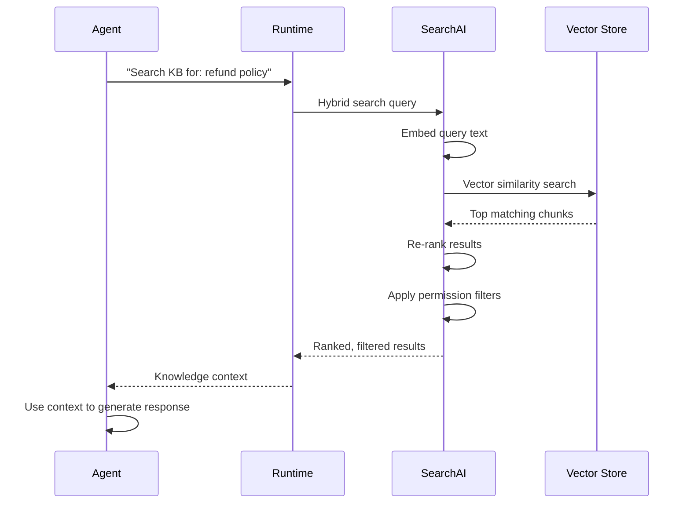
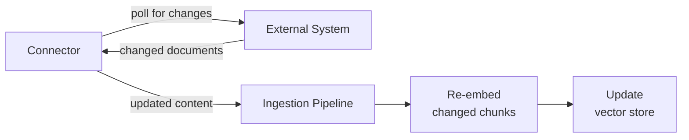

# Knowledge Bases

Knowledge bases give your agents access to your organization's information. Instead of relying solely on the LLM's training data, your agents can search through your documents, websites, and connected data sources to find accurate, up-to-date answers.

This guide covers the full lifecycle: how documents are processed into searchable knowledge, how to create and populate a knowledge base, how to connect it to an agent, and how to tune search strategies and live data connectors.

## How Knowledge Bases Work

When you upload a document or connect a data source, it goes through a multi-stage pipeline before it is searchable. Each stage transforms the raw content into a format optimized for retrieval.


### The Ingestion Pipeline

**1. Ingest** -- The ingestion stage receives your content and prepares it for processing. For uploaded files, the ingester registers the document and checks for duplicates (using content hashing to avoid reprocessing identical files). For connected data sources, the ingester discovers and tracks documents within the source. Documents already indexed with unchanged content are skipped.

**2. Extract text** -- The extraction stage pulls plain text from your source files. Different formats require different extraction strategies:

| Format                | Extraction approach                                                  |
| --------------------- | -------------------------------------------------------------------- |
| Plain text, Markdown  | Used as-is                                                           |
| HTML                  | Tags stripped, structure preserved where meaningful                  |
| PDF                   | Text extracted from pages (layout-aware extraction for complex PDFs) |
| DOCX / Office formats | Document content extracted from the file structure                   |
| JSON                  | Values extracted and concatenated with structural context            |

The extraction stage also captures document metadata (titles, headings, page numbers) that is used later for enrichment and search result context.

**3. Chunk** -- Raw extracted text is typically too long to embed as a single unit. The chunking stage splits text into smaller, meaningful segments that can be individually embedded and retrieved. Agent Platform 2.0 supports three chunking strategies:

- **Fixed-size chunking** -- Splits text into windows of a target token size with configurable overlap between chunks. Simple and predictable.
- **Semantic chunking** -- Splits on natural boundaries like paragraphs, sections, and topic shifts. Produces chunks that are more coherent but vary in size.
- **Sliding window** -- Creates overlapping windows that slide across the text, ensuring no information falls between chunk boundaries.

Chunk overlap is important: it ensures that context at the edges of chunks is not lost. A concept that spans two paragraphs will appear in both chunks when overlap is configured.

**4. Enrich** -- The enrichment stage adds metadata to each chunk to improve search quality:

- **Entity detection** -- Identifies emails, URLs, dates, and monetary values
- **Summary generation** -- Creates a brief summary of each chunk's content
- **Language detection** -- Identifies the language of the content
- **Knowledge graph extraction** -- Extracts entities and relationships to build a knowledge graph

Enrichment metadata is stored alongside the chunk and can be used for filtering and ranking search results.

**5. Embed** -- The embedding stage converts each text chunk into a vector representation -- a list of numbers that captures the chunk's semantic meaning. These vectors enable semantic search: finding content that is conceptually related to a query, even when the exact words differ.

**6. Store** -- The final stage stores the embedded chunks in a vector database for fast retrieval. Each stored chunk includes the original text content, the vector embedding, metadata from enrichment, source information (document ID, source ID, page number), and permission metadata for access control.

### How Agents Query Knowledge at Runtime

When an agent needs information from a knowledge base, the Runtime executes a search query against SearchAI.



Agent Platform 2.0 uses **hybrid search**, combining two complementary strategies:

- **Semantic search** -- Finds chunks whose vector embeddings are most similar to the query embedding. This catches conceptual matches ("How do I get my money back?" matches a chunk about "Refund policy and procedures").
- **Keyword search** -- Finds chunks containing the exact terms in the query. This catches specific names, product codes, or technical terms that semantic search might miss.

Results from both strategies are merged and re-ranked to produce a single list of the most relevant chunks.

**Permission-aware search** -- Search results are filtered based on the requesting user's permissions. If your knowledge base is connected to a data source with access controls (like SharePoint or Confluence), only documents the user has permission to see are included in results.

### Supported Formats

| Category            | Formats                                                                 |
| ------------------- | ----------------------------------------------------------------------- |
| **Documents**       | PDF, DOCX, TXT, Markdown                                                |
| **Web content**     | HTML pages, web crawls                                                  |
| **Structured data** | JSON, CSV (via structured data ingestion)                               |
| **Rich media**      | Images within documents (via visual enrichment for diagrams and charts) |

### What Affects Retrieval Quality

**Document quality** -- Clean, well-structured content with clear headings and logical organization produces better chunks and more accurate retrieval. Documents with clear section headings, complete sentences, and consistent terminology work best. Scanned images without OCR text, heavily formatted tables, and mixed-language documents hurt retrieval quality.

**Chunking configuration** -- Chunk size is a trade-off between precision and context. Smaller chunks (100-200 tokens) give more precise matching but less context -- good for FAQ-style content. Larger chunks (500-1000 tokens) provide more context but less precise matching -- good for narrative content. A 10-20% overlap is a reasonable starting point.

**Query quality** -- How the agent formulates its search query affects what it finds. Agents reasoning autonomously (without a FLOW section) can reformulate queries if initial results are not relevant. Steps with `REASONING: false` use the query as defined in the flow step.

## Create a Knowledge Base

Use a knowledge base to give your agent access to domain-specific documents so it can answer questions grounded in your content.

### Create an Index in Studio

Open your project in Studio. Navigate to **Knowledge** in the sidebar and select **New Knowledge Base**.

1. Enter a name for the knowledge base (e.g., `product-docs`).
2. Select the embedding model. The default (`bge-m3`) works well for most use cases.
3. Choose a chunking strategy:
   - **Semantic** -- splits on meaning boundaries (recommended for prose).
   - **Fixed-size** -- splits at a fixed token count (good for structured data).
   - **Hierarchical** -- builds a tree of progressively summarized chunks (best for large documents).
4. Select **Create**.

Studio creates the knowledge base and returns an index ID.

### Create an Index via the API

```bash
curl -X POST https://your-platform/api/indexes \
  -H "Authorization: Bearer $TOKEN" \
  -H "Content-Type: application/json" \
  -d '{
    "name": "product-docs",
    "description": "Product documentation and FAQs",
    "embeddingModel": "bge-m3",
    "chunkingStrategy": "semantic"
  }'
```

The response includes the `indexId` you need for ingestion and agent configuration.

### Knowledge Base with Custom Chunk Size

```bash
curl -X POST https://your-platform/api/indexes \
  -H "Authorization: Bearer $TOKEN" \
  -H "Content-Type: application/json" \
  -d '{
    "name": "legal-contracts",
    "embeddingModel": "bge-m3",
    "chunkingStrategy": "fixed",
    "chunkingConfig": {
      "chunkSize": 512,
      "chunkOverlap": 64
    }
  }'
```

### Knowledge Base with Hierarchical Chunking

Hierarchical chunking builds a tree structure where parent nodes contain summaries of their children. This improves retrieval for long documents.

```bash
curl -X POST https://your-platform/api/indexes \
  -H "Authorization: Bearer $TOKEN" \
  -H "Content-Type: application/json" \
  -d '{
    "name": "research-papers",
    "embeddingModel": "bge-m3",
    "chunkingStrategy": "hierarchical"
  }'
```

### Troubleshooting

- **"Index already exists" error:** Index names must be unique within a tenant. Choose a different name or delete the existing index first.
- **Embedding model not available:** Verify that the BGE-M3 service is running. Check the SearchAI service health endpoint at `/api/health`.

## Ingest Documents

Ingest documents into a knowledge base so your agent can search and retrieve relevant content at runtime.

### Add a Source and Upload Documents

Create a source within your knowledge base, then submit documents for ingestion.

```bash
# 1. Create a source
curl -X POST https://your-platform/api/indexes/$INDEX_ID/sources \
  -H "Authorization: Bearer $TOKEN" \
  -H "Content-Type: application/json" \
  -d '{
    "name": "product-manuals",
    "sourceType": "upload"
  }'

# 2. Upload a PDF
curl -X POST https://your-platform/api/indexes/$INDEX_ID/ingest \
  -H "Authorization: Bearer $TOKEN" \
  -F "file=@manual.pdf" \
  -F "sourceId=$SOURCE_ID"
```

The platform extracts text, splits it into chunks, generates embeddings, and indexes the content. You receive a job ID to track progress.

### Check Ingestion Status

```bash
curl https://your-platform/api/indexes/$INDEX_ID/jobs/$JOB_ID \
  -H "Authorization: Bearer $TOKEN"
```

The response includes `status` (`queued`, `processing`, `completed`, `failed`) and progress details.

### Ingest a DOCX File

The same upload endpoint handles DOCX files. The platform uses Docling to extract structured text from Word documents.

```bash
curl -X POST https://your-platform/api/indexes/$INDEX_ID/ingest \
  -H "Authorization: Bearer $TOKEN" \
  -F "file=@report.docx" \
  -F "sourceId=$SOURCE_ID"
```

### Ingest from a URL

Submit a web page URL for the platform to crawl, extract content, and index.

```bash
curl -X POST https://your-platform/api/indexes/$INDEX_ID/ingest \
  -H "Authorization: Bearer $TOKEN" \
  -H "Content-Type: application/json" \
  -d '{
    "sourceId": "'$SOURCE_ID'",
    "url": "https://docs.example.com/getting-started",
    "extractionConfig": {
      "followLinks": false,
      "maxDepth": 0
    }
  }'
```

### Ingest Structured Data (JSON/CSV)

For structured datasets, the platform analyzes the schema, detects foreign keys, and indexes the data for both semantic and structured queries.

```bash
curl -X POST https://your-platform/api/indexes/$INDEX_ID/structured-data/ingest \
  -H "Authorization: Bearer $TOKEN" \
  -F "file=@products.csv" \
  -F "sourceId=$SOURCE_ID" \
  -F "tableName=products"
```

### Batch Ingestion

Upload multiple files in a single request by submitting them as separate `file` fields.

```bash
curl -X POST https://your-platform/api/indexes/$INDEX_ID/ingest \
  -H "Authorization: Bearer $TOKEN" \
  -F "file=@doc1.pdf" \
  -F "file=@doc2.pdf" \
  -F "file=@doc3.pdf" \
  -F "sourceId=$SOURCE_ID"
```

### Troubleshooting

- **Ingestion stuck in "queued":** The ingestion worker may be at capacity. Check the job queue health at `/api/indexes/$INDEX_ID/jobs`.
- **Extraction produces empty content:** Scanned PDFs without an OCR layer require the vision enrichment pipeline. Verify that the visual enrichment worker is enabled for your index.
- **Large file rejected:** The default upload limit is 50 MB. For larger files, split them before uploading or contact your administrator to adjust limits.

## Connect a Knowledge Base to an Agent

Connect a knowledge base to your agent so it can search and retrieve relevant content when answering user questions.

### Reference Knowledge Tools in Your Agent

Add search tools to your agent definition that point to your knowledge base. The platform provides built-in search tools that connect to SearchAI.

```abl
AGENT: Support_Agent
GOAL: "Answer customer questions using product documentation"

TOOLS:
  - search_hybrid: Execute hybrid vector + keyword search
  - search_vector: Execute pure vector (semantic) search
  - vocabulary_resolve: Resolve business terms to metadata filters

INSTRUCTIONS: |
  1. When the user asks a question, search the knowledge base using search_hybrid
  2. If results are insufficient, retry with search_vector for broader semantic matching
  3. Synthesize an answer from retrieved chunks
  4. Include source attribution for transparency
```

The runtime automatically binds these tool names to the knowledge base configured for your project.

### Configure the Knowledge Base Binding in Project Settings

In Studio, navigate to **Settings > Knowledge** and select the knowledge base to bind to search tools. Alternatively, set this via the API:

```bash
curl -X PATCH https://your-platform/api/projects/$PROJECT_ID/settings \
  -H "Authorization: Bearer $TOKEN" \
  -H "Content-Type: application/json" \
  -d '{
    "knowledgeBase": {
      "indexId": "your-index-id",
      "searchDefaults": {
        "topK": 5,
        "minScore": 0.7
      }
    }
  }'
```

### Agent with Vocabulary Resolution

Vocabulary resolution maps business-specific terms to metadata filters, improving search precision for domain-heavy queries.

```abl
AGENT: Knowledge_Retrieval_Agent
GOAL: |
  Retrieve relevant knowledge to answer user questions using semantic
  search. Use vocabulary resolution to add metadata filters when the
  query contains domain-specific terms.

TOOLS:
  - vocabulary_resolve: Resolve business terms to metadata filters
  - search_hybrid: Execute hybrid vector + keyword search
  - search_vector: Execute pure vector (semantic) search

INSTRUCTIONS: |
  1. Analyze the query for domain-specific terms
  2. If domain terms are found, call vocabulary_resolve to get metadata filters
  3. Execute search_hybrid with the query and any resolved filters
  4. If results are insufficient, retry with search_vector
  5. Synthesize an answer from the retrieved knowledge chunks
  6. Include source attribution for transparency
```

### Agent with Structured Data Queries

For knowledge bases that contain structured data (CSV, JSON), use the aggregation and list query tools.

```abl
AGENT: Analytics_Agent
GOAL: "Answer analytical questions about business data"

TOOLS:
  - vocabulary_resolve: Resolve business terms to measures and dimensions
  - search_aggregate: Execute aggregation queries (sum, avg, count, min, max)
  - search_structured: Execute structured metadata filter queries

CONSTRAINTS:
  REQUIRE measure_field IS SET BEFORE calling search_aggregate
```

### Flow-Based Agent with Knowledge Retrieval Step

In a flow with structured steps, dedicate a step to knowledge retrieval before responding.

```abl
FLOW:
  steps:
    - greet
    - understand_question
    - search_knowledge
    - respond_with_answer

  search_knowledge:
    REASONING: true
    GOAL: "Search the knowledge base for relevant information"
    AVAILABLE_TOOLS: [search_hybrid, vocabulary_resolve]
    EXIT_WHEN: relevant_chunks IS SET
    MAX_TURNS: 3
    THEN: respond_with_answer
```

### Troubleshooting

- **Agent does not use the knowledge base:** Verify that search tools (`search_hybrid`, `search_vector`) are listed in the agent's `TOOLS` block. The runtime only binds tools that are declared.
- **Search returns no results:** Check that documents have been ingested and that the index status is `ready`. Low `minScore` thresholds (e.g., `0.3`) return more results but with lower relevance.
- **Wrong knowledge base connected:** Verify the `indexId` in project settings matches the knowledge base you intend to use.

## Configure Search Strategies

Configure search strategies to control how your agent retrieves information from a knowledge base -- balancing precision, recall, and performance.

### Set Default Search Parameters

Configure project-level search defaults that apply to all search tool invocations.

```bash
curl -X PATCH https://your-platform/api/projects/$PROJECT_ID/settings \
  -H "Authorization: Bearer $TOKEN" \
  -H "Content-Type: application/json" \
  -d '{
    "knowledgeBase": {
      "indexId": "your-index-id",
      "searchDefaults": {
        "topK": 5,
        "minScore": 0.7,
        "strategy": "hybrid"
      }
    }
  }'
```

### Hybrid Search (Recommended Default)

Hybrid search combines vector similarity (semantic meaning) with keyword matching (exact terms). This is the best general-purpose strategy.

```abl
AGENT: Support_Agent
GOAL: "Answer questions using hybrid search for balanced precision and recall"

TOOLS:
  - search_hybrid: Execute hybrid vector + keyword search

INSTRUCTIONS: |
  Use search_hybrid for all queries. It combines semantic understanding
  with keyword precision, handling both conceptual questions and
  specific term lookups.
```

### Pure Semantic Search

Use pure vector search when queries are conceptual and unlikely to contain exact keywords from the source documents.

```abl
TOOLS:
  - search_vector: Execute pure vector (semantic) search

INSTRUCTIONS: |
  Use search_vector when the user asks conceptual or paraphrased
  questions. This finds semantically similar content even when the
  exact words differ from the source documents.
```

### Structured List Queries

For knowledge bases containing structured data, use metadata filters to retrieve specific records.

```abl
AGENT: List_Query_Agent
GOAL: "Find specific items using structured metadata filters"

TOOLS:
  - vocabulary_resolve: Resolve business terms to canonical fields
  - search_structured: Execute structured metadata filter queries
  - search_list: Retrieve paginated results with sorting

INSTRUCTIONS: |
  1. Identify filterable concepts in the query
  2. Call vocabulary_resolve to map business terms to canonical fields
  3. Construct structured filters from resolved terms
  4. Execute search_structured with the filters
  5. Present results in a clear, organized format

CONSTRAINTS:
  REQUIRE resolved_fields IS SET BEFORE calling search_structured
```

### Aggregation Queries

For analytical questions (totals, averages, counts), use the aggregation search strategy.

```abl
AGENT: Aggregation_Agent
GOAL: "Answer analytical questions with aggregation queries"

TOOLS:
  - vocabulary_resolve: Resolve business terms to measures and dimensions
  - search_aggregate: Execute aggregation queries (sum, avg, count, min, max)
  - validate_aggregation: Validate aggregation results for consistency

INSTRUCTIONS: |
  1. Identify the measure (what to aggregate), dimension (how to group),
     and filters (what to include/exclude)
  2. Call vocabulary_resolve to map each concept to canonical fields
  3. Execute search_aggregate with the specification
  4. Validate results for reasonableness
  5. Present results with clear labels and context

CONSTRAINTS:
  REQUIRE measure_field IS SET BEFORE calling search_aggregate
  REQUIRE aggregation_validated BEFORE returning results
```

### Multi-Strategy Agent with Fallback

Combine strategies with fallback logic for maximum retrieval success.

```abl
INSTRUCTIONS: |
  1. Try search_hybrid first for balanced results
  2. If fewer than 2 relevant results, retry with search_vector
     for broader semantic matching
  3. If the query contains filterable terms, also try search_structured
  4. Merge and deduplicate results before synthesizing an answer
```

### Troubleshooting

- **Too many irrelevant results:** Increase `minScore` (e.g., from `0.5` to `0.75`). This filters out low-confidence matches.
- **Missing relevant results:** Decrease `minScore` or increase `topK`. Also verify that the source documents were fully ingested.
- **Slow search performance:** Reduce `topK` to return fewer results. For large knowledge bases, consider enabling search caching in project settings.
- **Vocabulary resolution fails:** The vocabulary must be configured with your domain terms. Check the vocabulary configuration in your knowledge base settings.

## Use Connectors for Live Data

Use connectors to automatically sync external data sources into your knowledge base, keeping content up to date without manual re-ingestion.

### How Sync Works



Connectors use delta sync -- they track what has changed since the last sync and only reprocess modified or new documents. Deleted documents are removed from the knowledge base. Sync runs on a configurable schedule.

### Supported Connectors

| Connector       | What it syncs                                           |
| --------------- | ------------------------------------------------------- |
| **SharePoint**  | Documents and pages from SharePoint sites and libraries |
| **Jira**        | Issues, comments, and attachments                       |
| **Confluence**  | Pages and blog posts from Confluence spaces             |
| **HubSpot**     | Knowledge base articles and documentation               |
| **ServiceNow**  | Knowledge articles and incident data                    |
| **Salesforce**  | Knowledge articles, cases, and custom objects           |
| **Web Crawler** | Any website with configurable crawl rules               |
| **Database**    | Records from a relational database via SQL query        |

### Create a Confluence Connector

```bash
curl -X POST https://your-platform/api/indexes/$INDEX_ID/connectors \
  -H "Authorization: Bearer $TOKEN" \
  -H "Content-Type: application/json" \
  -d '{
    "name": "confluence-docs",
    "type": "confluence",
    "config": {
      "baseUrl": "https://your-org.atlassian.net/wiki",
      "spaceKeys": ["PRODUCT", "SUPPORT"],
      "auth": {
        "type": "api_token",
        "email": "bot@your-org.com",
        "tokenSecret": "confluence_api_token"
      }
    },
    "syncSchedule": {
      "interval": "6h"
    }
  }'
```

The connector runs an initial full sync, then performs delta syncs at the configured interval.

### Create a SharePoint Connector

```bash
curl -X POST https://your-platform/api/indexes/$INDEX_ID/connectors \
  -H "Authorization: Bearer $TOKEN" \
  -H "Content-Type: application/json" \
  -d '{
    "name": "sharepoint-policies",
    "type": "sharepoint",
    "config": {
      "siteUrl": "https://your-org.sharepoint.com/sites/Policies",
      "driveId": "your-drive-id",
      "auth": {
        "type": "oauth2_client",
        "clientId": "app-client-id",
        "clientSecretKey": "sharepoint_client_secret",
        "tenantId": "azure-tenant-id"
      }
    },
    "syncSchedule": {
      "interval": "12h"
    }
  }'
```

### Create a Web Crawler Connector

Crawl a website and automatically index new or updated pages.

```bash
curl -X POST https://your-platform/api/indexes/$INDEX_ID/connectors \
  -H "Authorization: Bearer $TOKEN" \
  -H "Content-Type: application/json" \
  -d '{
    "name": "help-center",
    "type": "web_crawler",
    "config": {
      "startUrls": ["https://help.example.com"],
      "maxDepth": 3,
      "maxPages": 500,
      "allowPatterns": ["/help/*", "/faq/*"],
      "denyPatterns": ["/admin/*", "/internal/*"]
    },
    "syncSchedule": {
      "interval": "24h"
    }
  }'
```

### Create a Database Connector

Sync records from a relational database into the knowledge base.

```bash
curl -X POST https://your-platform/api/indexes/$INDEX_ID/connectors \
  -H "Authorization: Bearer $TOKEN" \
  -H "Content-Type: application/json" \
  -d '{
    "name": "product-catalog",
    "type": "database",
    "config": {
      "connectionString": "{{secrets.DB_CONNECTION_STRING}}",
      "query": "SELECT id, name, description, category FROM products WHERE active = true",
      "deltaColumn": "updated_at"
    },
    "syncSchedule": {
      "interval": "1h"
    }
  }'
```

### Monitor Connector Status

```bash
# List all connectors for an index
curl https://your-platform/api/indexes/$INDEX_ID/connectors \
  -H "Authorization: Bearer $TOKEN"

# Get a specific connector's sync history
curl https://your-platform/api/indexes/$INDEX_ID/connectors/$CONNECTOR_ID \
  -H "Authorization: Bearer $TOKEN"
```

### Trigger a Manual Sync

```bash
curl -X POST https://your-platform/api/indexes/$INDEX_ID/connectors/$CONNECTOR_ID/sync \
  -H "Authorization: Bearer $TOKEN" \
  -H "Content-Type: application/json" \
  -d '{"mode": "full"}'
```

Use `"mode": "delta"` for incremental sync or `"mode": "full"` to re-process all content.

### Connector Authentication

Each connector type has its own authentication mechanism. SharePoint uses OAuth (with device code flow for initial authorization). Other connectors use API keys or OAuth tokens configured through Studio. The `tokenSecret` or `clientSecretKey` must reference a valid secret stored in the platform's secret manager.

### Troubleshooting

- **Connector fails on first sync:** Verify the authentication credentials and that the referenced secrets exist in the platform's secret manager.
- **Delta sync misses updates:** Ensure the `deltaColumn` (for database connectors) or the external platform's change tracking is configured correctly. Some platforms require webhook subscriptions for real-time change detection.
- **Rate limiting from external source:** Increase the sync interval to reduce request frequency. The platform respects backoff headers from external APIs.
- **Connector shows "stale" status:** The delta sync scheduler runs on a fixed interval. Check that the scheduler service is healthy.

## Further Reading

- [Core Concepts](../getting-started/core-concepts) -- Foundational platform concepts
- [Tools](../abl-reference/tools) -- Search tool definitions and parameters
- [Memory & State](./memory-and-state) -- Store and recall knowledge search results
