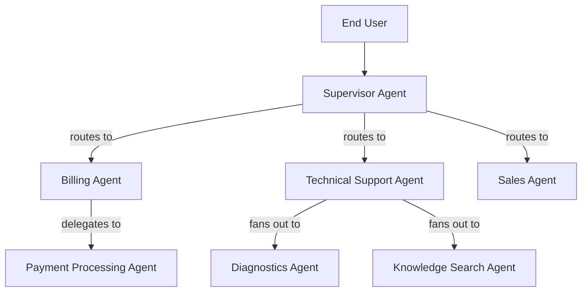
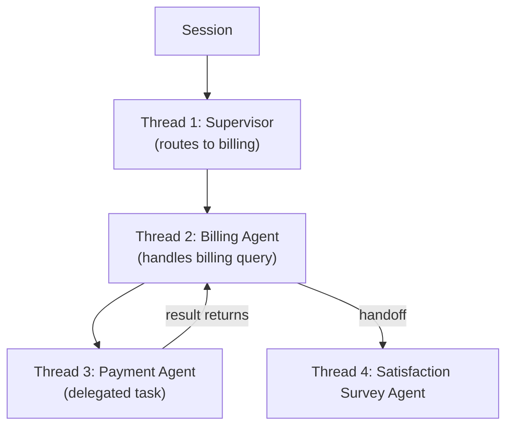

# Multi-Agent Orchestration

Complex workflows often need multiple agents working together. Agent Platform 2.0 supports multi-agent orchestration through four patterns: supervisor routing, handoff, delegation, and fan-out. This guide covers all four patterns with practical ABL examples.

## How Multi-Agent Works

Multi-agent orchestration is about routing work to the right agent and managing context as conversations move between agents. The supervisor is the entry point -- it receives all incoming messages and decides which agent should handle them.



### Orchestration patterns

| Pattern                | When to use                                                      | User experience                                    |
| ---------------------- | ---------------------------------------------------------------- | -------------------------------------------------- |
| **Supervisor routing** | Entry point for multi-agent systems; intent-based routing        | User talks to one agent at a time, routed by topic |
| **Handoff**            | User needs a different specialist; conversation topic changes    | User is "transferred" to a new agent               |
| **Delegation**         | Agent needs a sub-task done; result feeds back into current flow | Transparent -- user does not see the delegation    |
| **Fan-out**            | Agent needs multiple things done in parallel                     | Transparent -- user sees a single combined result  |

### Session hierarchy

All multi-agent patterns operate within a session hierarchy:



- **Session** -- The top-level container for a conversation. One session spans the entire interaction, even across multiple agents.
- **Thread** -- Each agent activation within a session is a thread. Handoffs create new threads.
- **Active thread** -- At any given time, one thread is active and processing messages.
- **Context flow** -- Data flows forward through threads via handoff context and session metadata.

### What context transfers between agents

| Data type              | Handoff                                                                                      | Delegation                   | Fan-out                      |
| ---------------------- | -------------------------------------------------------------------------------------------- | ---------------------------- | ---------------------------- |
| Session metadata       | Forwarded (non-internal values)                                                              | Available via parent context | Available via parent context |
| Conversation history   | Configurable (`auto` default / `summary_only` / `full` / `{ mode: last_n, count }` / `none`) | Not shared                   | Not shared                   |
| Gather progress        | Not transferred (each agent has its own)                                                     | Not transferred              | Not transferred              |
| Custom variables (SET) | Transferred as metadata                                                                      | Passed explicitly            | Passed explicitly            |
| Workflow-scoped memory | Shared only through explicit `memory_grants`                                                 | Not shared unless passed     | Not shared unless passed     |
| Agent-specific state   | Not transferred                                                                              | Not transferred              | Not transferred              |

Handoff history uses an `auto` default. It keeps the authored summary when that is enough, and falls back to bounded raw history when summary-only would be lossy. Opt into `summary_only` when you want strict no-transcript transfer.

### Choosing between patterns

**Handoff vs. delegation:** Does the user need to know they are talking to a different agent? If yes, use handoff. If no, use delegation.

**Delegation vs. fan-out:** Do you need results from multiple agents? If you need results from one agent, use delegation. If you need results from multiple agents and those tasks are independent, use fan-out.

## Build a Supervisor

A supervisor is a special agent that acts as a router. It receives every incoming message and decides which child agent should handle it.

### Define a supervisor

```abl
SUPERVISOR: Travel_Supervisor

GOAL: |
  Route customers to the right specialist -- booking, sales,
  support, or human agent -- with full context preservation.

PERSONA: |
  Professional travel assistant. Friendly and efficient.
  Routes requests to the right specialist quickly and transparently.

LIMITATIONS:
  - "Cannot make bookings or process payments directly"
  - "Cannot access user account information directly"

ON_START:
  RESPOND: |
    Welcome! I am your travel assistant.
    I can help you search and book flights, manage a booking,
    or connect you with support.
    What can I help you with today?

RETURN_HANDLERS:
  route_to_booking_manager:
    CLEAR: [return_to]
    CONTINUE: true

  reclassify_intent:
    CLEAR: [current_intent]
    RESUME_INTENT: true

HANDOFF:
  - TO: Sales_Agent
    WHEN: intent.category == "new_booking" OR intent.category == "travel_search"
    CONTEXT:
      pass: [search_context, user_preferences, budget]
      summary: "User looking to book new travel"

  - TO: Booking_Manager
    WHEN: intent.category == "manage_existing_booking"
    CONTEXT:
      pass: [user_id, booking_context, auth_token]
      summary: "User managing their reservation"

ESCALATE:
  triggers:
    - WHEN: user.wants_human_agent == true OR user.frustration_detected == true
      REASON: "User requests human assistance"
      PRIORITY: high
      TAGS: [human_request]

COMPLETE:
  - WHEN: handoff_successful == true
    RESPOND: "I have connected you with the right specialist."

  - WHEN: user.session_ended == true
    RESPOND: "Thank you for using our travel service."
```

### HANDOFF rule properties

| Property    | Required | Description                                                      |
| ----------- | -------- | ---------------------------------------------------------------- |
| `TO`        | Yes      | Target agent name                                                |
| `WHEN`      | Yes      | Condition for routing (natural language or expression)           |
| `CONTEXT`   | No       | Data to pass to the target agent                                 |
| `RETURN`    | No       | Whether control returns to the supervisor (default: false)       |
| `ON_RETURN` | No       | Built-in post-return action or named `RETURN_HANDLERS` reference |

`HANDOFF` is for machine-to-machine routing only. Use `ESCALATE` when the target is a human operator or human queue.

### Add memory for context tracking

```abl
MEMORY:
  session:
    - current_intent
    - routing_history
    - handoff_count
    - conversation_summary
  persistent:
    - user.preferred_agent
    - user.language
  remember:
    - WHEN: user_language IS SET
      STORE: user_language -> user.language
  recall:
    - ON: session:start
      ACTION: inject_context
      PATHS: [user.language, user.preferred_agent]
```

### Ordered routing

```abl
RETURN_HANDLERS:
  route_to_booking_manager:
    CLEAR: [return_to]
    CONTINUE: true

  reclassify_intent:
    CLEAR: [current_intent]
    RESUME_INTENT: true

ESCALATE:
  triggers:
    - WHEN: intent.category == "escalation" OR user.frustration_detected == true
      REASON: "User requests human assistance or is frustrated"
      PRIORITY: high
      TAGS: [human_request]

    - WHEN: intent.category == "complaint"
      REASON: "Customer complaint requires a human specialist"
      PRIORITY: high
      TAGS: [complaint]

HANDOFF:
  # P1 -- Manage existing booking (requires auth)
  - TO: Authentication_Agent
    WHEN: user.is_authenticated == false AND intent.category == "manage_booking"
    CONTEXT:
      pass: [session_context, return_to]
      summary: "User needs to authenticate"
      history: summary_only
      memory_grants:
        - path: workflow.auth_token
          access: readwrite
        - path: user.last_verified_at
          access: read
    RETURN: true
    ON_RETURN:
      handler: route_to_booking_manager
  - TO: Booking_Manager
    WHEN: user.is_authenticated == true AND intent.category == "manage_booking"
    CONTEXT:
      pass: [user_id, booking_context, auth_token]
      summary: "Authenticated user managing reservation"

  # P4 -- New bookings
  - TO: Sales_Agent
    WHEN: intent.category == "new_booking" OR intent.category == "travel_search"
    CONTEXT:
      pass: [search_context, user_preferences, budget]
      summary: "User looking to book"

  # P5 -- Fallback
  - TO: Clarification_Agent
    WHEN: intent.unclear == true OR intent.confidence < 0.5
    CONTEXT:
      pass: [session_context, last_message]
      summary: "Need clarification"
    RETURN: true
    ON_RETURN:
      handler: reclassify_intent
```

Rules are evaluated top-to-bottom. Place specific or high-value routes before broader fallbacks.

### Supervisor with tools

```abl
SUPERVISOR: NOC_Supervisor
GOAL: "Triage network alarms and route to specialist agents"

TOOLS:
  get_active_alarms(severity: string = "all") -> {alarms: array, total: number}
    description: "Retrieve active alarms from the network management system"
    type: http
    endpoint: "https://nms.example.com/api/alarms"
    method: POST
    auth: bearer

HANDOFF:
  - TO: Network_Triage
    WHEN: alarm.category IN ["link_degradation", "fiber_cut", "hardware_warning"]
    CONTEXT:
      pass: [alarm_id, severity, site_code, category]
      summary: "New alarm requires triage"
    RETURN: true

  - TO: Incident_Manager
    WHEN: severity == "critical" OR severity == "major"
    CONTEXT:
      pass: [alarm_id, severity, site_code, affected_subscribers]
      summary: "High-severity issue requires incident management"
    RETURN: true
```

Supervisors can have tools for pre-routing tasks (e.g., fetching alarm details before deciding which agent to route to).

### Supervisor with error handling

```abl
ON_ERROR:
  routing_failure:
    RESPOND: "I am having trouble understanding your request. Let me connect you with someone who can help."
    RETRY: 1
    THEN: ESCALATE

  agent_unavailable:
    RESPOND: "That service is temporarily unavailable. Let me try an alternative."
    RETRY: 2
    THEN: ESCALATE
```

### Troubleshooting

- **Routing goes to wrong agent:** Rules are evaluated top-to-bottom. Reorder rules so more specific conditions come before general ones.
- **Context lost during handoff:** Verify the `pass` array in `CONTEXT` includes all variables the child agent needs.
- **Agent loops between supervisor and child:** Set `RETURN: false` for terminal handoffs. Use `ON_RETURN` to control what happens when a child agent completes with `RETURN: true`.

## Implement Handoff

A handoff transfers the conversation from one agent to another. The original agent stops handling the conversation, and the target agent takes over.

### Define a handoff from a supervisor

```abl
SUPERVISOR: Support_Supervisor

HANDOFF:
  - TO: Order_Tracking
    WHEN: intent.category == "order_inquiry" OR intent.category == "shipping"
    CONTEXT:
      pass: [customer_id, order_id, session_context]
      summary: "Customer wants to track or manage an order"
    RETURN: false
```

`RETURN: false` means the conversation stays with the target agent. The supervisor does not regain control.

### Define a handoff from a child agent

```abl
AGENT: Order_Tracking
GOAL: "Help customers track orders"

HANDOFF:
  - TO: Returns_And_Refunds
    WHEN: intent.category == "return" OR intent.category == "refund"
    CONTEXT:
      pass: [customer_id, order_id, item_id]
      summary: "Customer wants to return or get refund for an item"
    RETURN: false

  - TO: Sales_Agent
    WHEN: reorder_ready == true AND user.ready_to_checkout == true
    CONTEXT:
      pass: [customer_id, cart_items, total]
      summary: "Customer reordering -- cart ready for checkout"
    RETURN: false
```

Agents can hand off to other agents, not just supervisors. This enables peer-to-peer routing.

### CONTEXT block properties

| Property        | Description                                                                |
| --------------- | -------------------------------------------------------------------------- |
| `pass`          | List of session variable names to send to the target                       |
| `summary`       | Natural language description of why the handoff occurred                   |
| `memory_grants` | Explicit durable-memory grants (`path` + `access`) for the receiving agent |
| `history`       | Conversation history strategy (safe default: `auto`)                       |

### History strategies

| Value                          | Behavior                                                                                |
| ------------------------------ | --------------------------------------------------------------------------------------- |
| `auto`                         | Use the handoff summary when available; otherwise pass bounded recent history (default) |
| `none`                         | No conversation history passed                                                          |
| `summary_only`                 | Pass only the handoff summary, never raw messages                                       |
| `full`                         | Pass the entire conversation history                                                    |
| `{ mode: last_n, count: <n> }` | Pass only the last N messages using the typed bounded-history form                      |

### Handoff with return

```abl
RETURN_HANDLERS:
  resume_original_action:
    CONTINUE: true

HANDOFF:
  - TO: Authentication_Agent
    WHEN: user.is_authenticated == false AND action_requires_auth == true
    CONTEXT:
      pass: [session_context, return_to]
      summary: "User needs to authenticate before proceeding"
      history: summary_only
      memory_grants:
        - path: workflow.auth_token
          access: readwrite
        - path: user.last_verified_at
          access: read
    RETURN: true
    ON_RETURN:
      handler: resume_original_action
```

With `RETURN: true`, the target agent completes its task and returns control to the calling agent. `ON_RETURN` specifies what happens next through a built-in action or a named return handler.

### Handoff for high-value cases

```abl
HANDOFF:
  - TO: Priority_Support_Agent
    WHEN: issue.severity == "high" OR user.is_vip == true
    CONTEXT:
      pass: [customer_id, conversation_summary, intent, sentiment]
      summary: "High-value case should route to specialist support"
    RETURN: false
```

Place this rule before broader support routing rules so it is matched first.

### Conditional handoff from constraints

```abl
CONSTRAINTS:
  always:
    - REQUIRE user.is_authenticated == true
      ON_FAIL: HANDOFF Authentication_Agent
```

When a constraint fails, `ON_FAIL` with `HANDOFF` routes the user to another agent for resolution.

### Troubleshooting

- **Handoff target does not receive context:** Verify variable names in `pass` match session variables that are currently set. Variables that are `null` or undefined are not passed.
- **User repeats information after handoff:** Use `history: auto` or `history: full` in the CONTEXT block so the target agent has context without blindly oversharing.
- **Handoff creates a loop:** If Agent A hands off to Agent B, which hands back to A, set clear conditions on both `WHEN` clauses. Use `RETURN: true` on one side to establish a parent-child relationship.

## Use Delegation

Delegation is a call-and-return pattern. The parent agent sends a task to a child agent, waits for the result, and then continues its own processing with the returned data.

### Define a delegate

```abl
DELEGATE:
  - AGENT: Fee_Calculator
    WHEN: action_type == "modify" OR action_type == "upgrade"
    PURPOSE: "Calculate total fees and price differences for the requested changes"
    INPUT:
      booking_id: selected_booking
      change_type: action_type
      changes: change_details
    RETURNS:
      total_fee: quoted_fee
      breakdown: fee_breakdown
    USE_RESULT: "Present fee breakdown to customer before asking for confirmation"
    TIMEOUT: "10s"
    ON_FAILURE: RESPOND "Unable to calculate fees right now. Let me try again."
```

`DELEGATE` calls a sub-agent, waits for it to finish, and maps the returned values back to the calling agent's session variables.

### DELEGATE properties

| Property     | Required | Description                                                |
| ------------ | -------- | ---------------------------------------------------------- |
| `AGENT`      | Yes      | Name of the sub-agent to call                              |
| `WHEN`       | Yes      | Condition that triggers the delegation                     |
| `PURPOSE`    | Yes      | Description of what the sub-agent should accomplish        |
| `INPUT`      | Yes      | Map of parent variables to sub-agent input parameters      |
| `RETURNS`    | Yes      | Map of sub-agent output fields to parent session variables |
| `USE_RESULT` | Yes      | Instruction for how the parent agent uses the result       |
| `TIMEOUT`    | No       | Max time to wait for the sub-agent (e.g., `"10s"`)         |
| `ON_FAILURE` | No       | Action if the sub-agent fails or times out                 |

### Create the delegate agent

```abl
AGENT: Fee_Calculator

GOAL: |
  Calculate all applicable fees for booking changes --
  modification fees, price differences, upgrade costs --
  and return a clear breakdown.

PERSONA: |
  Precise fee calculation specialist.
  Returns detailed breakdowns.

TOOLS:
  get_modification_fee(booking_id: string, change_type: string) -> {base_fee: number, currency: string}
    description: "Get the base modification fee"

  calculate_price_difference(booking_id: string, original_item: object, new_item: object) -> {price_diff: number, breakdown: object}
    description: "Calculate price difference between original and new selection"

COMPLETE:
  - WHEN: fee_calculated == true
    RESPOND: |
      Fee breakdown:
      {{#each fee_breakdown}}
      - {{this.description}}: {{this.amount}} {{this.currency}}
      {{/each}}
      Total: {{total_fee}} {{currency}}
```

The delegate agent is a standard agent. It processes the request and its `COMPLETE` response is returned to the calling agent.

### Delegation vs. handoff

| Aspect         | DELEGATE                         | HANDOFF                          |
| -------------- | -------------------------------- | -------------------------------- |
| Control flow   | Call and return (synchronous)    | Transfer (may or may not return) |
| User awareness | User may not see the sub-agent   | User interacts with new agent    |
| Data flow      | Structured INPUT/RETURNS mapping | CONTEXT pass list                |
| Use case       | Background calculations, lookups | Full conversation transfer       |

### ON_FAILURE options

- `RESPOND "message"` -- Show a message and continue
- `ESCALATE` -- Trigger escalation
- `RETRY count` -- Retry the delegation

### Troubleshooting

- **Delegate never returns:** Set a `TIMEOUT` on every delegate. Without it, the calling agent waits indefinitely if the sub-agent stalls.
- **Return values not mapped:** Verify the keys in `RETURNS` match the output variable names from the delegate agent. Left side is the delegate's variable name, right side is the parent's session variable.
- **Delegate agent does not receive input:** Check that the variable names in `INPUT` (right side) match existing session variables in the calling agent.

## Set Up Fan-Out

Fan-out sends a task to multiple agents simultaneously and aggregates their results -- for example, searching flights and hotels in parallel.

### Route to multiple agents from a supervisor

```abl
SUPERVISOR: Travel_Planner

GOAL: "Help users plan trips by searching flights, hotels, and activities in parallel"

RETURN_HANDLERS:
  merge_flight_results:
    CONTINUE: true

  merge_hotel_results:
    CONTINUE: true

  merge_activity_results:
    CONTINUE: true

HANDOFF:
  - TO: Flight_Search
    WHEN: intent.category == "plan_trip" OR intent.category == "search_flights"
    CONTEXT:
      pass: [origin, destination, travel_dates, passengers]
      summary: "Search for available flights"
    RETURN: true
    ON_RETURN:
      handler: merge_flight_results
  - TO: Hotel_Search
    WHEN: intent.category == "plan_trip" OR intent.category == "search_hotels"
    CONTEXT:
      pass: [destination, checkin_date, checkout_date, guests]
      summary: "Search for available hotels"
    RETURN: true
    ON_RETURN:
      handler: merge_hotel_results
  - TO: Activity_Search
    WHEN: intent.category == "plan_trip" OR intent.category == "search_activities"
    CONTEXT:
      pass: [destination, travel_dates, interests]
      summary: "Search for activities and experiences"
    RETURN: true
    ON_RETURN:
      handler: merge_activity_results
```

When `intent.category == "plan_trip"` matches, all three handoff rules trigger. Each agent runs independently and returns results to the supervisor via `RETURN: true`. Child return data merges back into the supervisor state before the named return handler continues orchestration.

### Use delegates for parallel sub-tasks

```abl
AGENT: Trip_Planner

DELEGATE:
  - AGENT: Flight_Search
    WHEN: need_flights == true
    PURPOSE: "Find available flights for the trip"
    INPUT:
      origin: departure_city
      destination: arrival_city
      date: travel_date
    RETURNS:
      flights: available_flights
      best_price: cheapest_flight_price
    USE_RESULT: "Include flight options in the trip plan"
    TIMEOUT: "15s"
    ON_FAILURE: RESPOND "Flight search is unavailable. Continuing with hotel search."

  - AGENT: Hotel_Search
    WHEN: need_hotels == true
    PURPOSE: "Find available hotels at the destination"
    INPUT:
      destination: arrival_city
      checkin: checkin_date
      checkout: checkout_date
    RETURNS:
      hotels: available_hotels
      best_price: cheapest_hotel_price
    USE_RESULT: "Include hotel options in the trip plan"
    TIMEOUT: "15s"
    ON_FAILURE: RESPOND "Hotel search is unavailable. Continuing with other results."
```

Multiple `DELEGATE` entries with overlapping `WHEN` conditions can execute in parallel. Each delegate returns its results independently.

### Fan-out with partial failure tolerance

```abl
DELEGATE:
  - AGENT: Price_Checker_A
    WHEN: comparison_mode == true
    PURPOSE: "Check price from supplier A"
    INPUT:
      product_id: sku
      quantity: qty
    RETURNS:
      price_a: supplier_a_price
    USE_RESULT: "Compare with other suppliers"
    TIMEOUT: "5s"
    ON_FAILURE: RESPOND "Supplier A unavailable."

  - AGENT: Price_Checker_B
    WHEN: comparison_mode == true
    PURPOSE: "Check price from supplier B"
    INPUT:
      product_id: sku
      quantity: qty
    RETURNS:
      price_b: supplier_b_price
    USE_RESULT: "Compare with other suppliers"
    TIMEOUT: "5s"
    ON_FAILURE: RESPOND "Supplier B unavailable."
```

Each delegate has its own `ON_FAILURE` handler. If one supplier is unavailable, the agent proceeds with partial results from the others.

### Troubleshooting

- **Parallel agents not executing concurrently:** Verify that multiple `WHEN` conditions match simultaneously for the same user message.
- **Results from one agent overwrite another:** Use distinct variable names in `RETURNS` for each delegate (e.g., `supplier_a_price` and `supplier_b_price`, not both `price`).
- **Timeout on slow agents:** Set `TIMEOUT` on each delegate independently. Use `ON_FAILURE` to gracefully handle agents that do not respond in time.

## Pass Context Between Agents

Context passing ensures the target agent has the information it needs without asking the user to repeat themselves.

### Pass variables in a handoff

```abl
HANDOFF:
  - TO: Booking_Manager
    WHEN: intent.category == "manage_booking"
    CONTEXT:
      pass: [user_id, booking_context, auth_token]
      summary: "Authenticated user managing their reservation"
```

The `pass` array lists session variable names to include in the handoff. The target agent receives these as pre-populated session variables.

### Grant scoped durable memory access

```abl
HANDOFF:
  - TO: Authentication_Agent
    WHEN: user.is_authenticated == false AND action_requires_auth == true
    CONTEXT:
      pass: [session_context, return_to]
      summary: "User needs to authenticate"
      memory_grants:
        - path: workflow.auth_token
          access: readwrite
        - path: user.last_verified_at
          access: read
    RETURN: true
```

`memory_grants` gives the target agent explicit access to specific durable memory paths. Reserve `readwrite` for `execution_tree` workflow state; use `read` for broader `user` or `project` facts.

### Control conversation history transfer

```abl
HANDOFF:
  - TO: Support_Agent
    WHEN: intent.category == "support"
    CONTEXT:
      pass: [customer_id, issue_description]
      summary: "Customer needs technical support"
      history: full
```

### Pass context in delegates

```abl
DELEGATE:
  - AGENT: Fee_Calculator
    WHEN: action_type == "modify"
    PURPOSE: "Calculate fees for the modification"
    INPUT:
      booking_id: selected_booking
      change_type: action_type
      changes: change_details
    RETURNS:
      total_fee: quoted_fee
      breakdown: fee_breakdown
    USE_RESULT: "Present fee breakdown to customer"
```

For delegates, `INPUT` maps parent session variables (right side) to delegate input parameters (left side). `RETURNS` maps delegate output (left side) back to parent session variables (right side).

### Context for human escalation

```abl
ESCALATE:
  triggers:
    - WHEN: refund_amount > 1000
      REASON: "High-value refund requires manager approval"
      PRIORITY: medium
      TAGS: [refund, approval_needed]

  context_for_human:
    - booking_id
    - user_id
    - action_type
    - change_details
    - refund_amount
    - conversation_history
```

`context_for_human` in an `ESCALATE` block defines what data a human agent receives when the conversation is escalated.

### Memory-based context sharing

```abl
MEMORY:
  session:
    - customer_id
    - current_intent
    - routing_history
    - conversation_summary
    - session_context
      TYPE: object
      DESCRIPTION: "Current session state snapshot passed to child agents on handoff"

  persistent:
    - user.name
    - user.language
    - user.preferred_agent
    - user.last_verified_at

  remember:
    - WHEN: user_name IS SET
      STORE: user_name -> user.name
    - WHEN: user_language IS SET
      STORE: user_language -> user.language

  recall:
    - ON: session:start
      ACTION: inject_context
      PATHS: [user.name, user.language, user.preferred_agent]
```

Persistent memory is shared across sessions and agents (with explicit access grants). Session memory is scoped to a single agent session but can be passed via `CONTEXT.pass`.
`execution_tree` memory sits between those two: it survives one workflow or handoff chain, and it is the preferred place for cross-agent state such as auth tokens, selected account IDs, or in-flight case context.

### Troubleshooting

- **Target agent receives empty variables:** The variable must be set in the calling agent's session before the handoff triggers.
- **Persistent memory not accessible:** Use `memory_grants` in the `CONTEXT` block to explicitly grant access to durable memory paths.
- **Too much context slows down the agent:** Pass only the variables the target agent needs. Use `history: auto` or explicit `summary_only` instead of `history: full` for long conversations.

## Configure Routing Rules

Routing rules control which agent handles a conversation based on intent, user state, channel, or custom conditions.

### Intent-based routing

```abl
HANDOFF:
  - TO: Flight_Search
    WHEN: intent.category == "search_flights"
    CONTEXT:
      pass: [destination, dates, passengers]
      summary: "User searching for flights"

  - TO: Hotel_Search
    WHEN: intent.category == "search_hotels"
    CONTEXT:
      pass: [destination, checkin, checkout]
      summary: "User searching for hotels"

  - TO: Support_Agent
    WHEN: intent.category == "support" OR intent.category == "complaint"
    CONTEXT:
      pass: [issue_description]
      summary: "User needs support"
```

### Expression-based conditions

```abl
HANDOFF:
  - TO: Flight_Search
    WHEN: intent.category == "flight_search"
    PASS: query

  - TO: Policy_Advisor
    WHEN: intent.category == "policy"
    PASS: query
```

`WHEN` should be a boolean expression over session state. For semantic routing, classify first and route on fields like `intent.category`. For deterministic routing, use direct expressions such as `input contains "lookup"`.

### Routing with confidence threshold

```abl
RETURN_HANDLERS:
  reclassify_intent:
    CLEAR: [current_intent]
    RESUME_INTENT: true

HANDOFF:
  - TO: Sales_Agent
    WHEN: intent.category == "new_booking" AND intent.confidence >= 0.7
    CONTEXT:
      pass: [search_context, budget]
      summary: "User wants to book"

  - TO: Clarification_Agent
    WHEN: intent.unclear == true OR intent.confidence < 0.5
    CONTEXT:
      pass: [session_context, last_message]
      summary: "Need clarification"
    RETURN: true
    ON_RETURN:
      handler: reclassify_intent
```

### State guards and VIP routing

```abl
HANDOFF:
  # VIP customers get priority human support
  - TO: VIP_Support
    WHEN: customer_tier == "VIP" AND intent.category == "complaint"
    CONTEXT:
      pass: [customer_id, conversation_summary]
      summary: "VIP customer complaint -- critical priority"
    RETURN: false

  # Regular complaint routing
  - TO: Support_Agent
    WHEN: intent.category == "complaint"
    CONTEXT:
      pass: [customer_id, conversation_summary]
      summary: "Customer complaint"
    RETURN: false
```

Place more specific conditions (VIP + complaint) before general conditions (any complaint). Rules are evaluated top-to-bottom; the first match wins.

### Loop detection and escalation

```abl
MEMORY:
  session:
    - handoff_count
    - routing_history

ESCALATE:
  triggers:
    - WHEN: handoff_count >= 4
      REASON: "Customer bounced between too many agents"
      PRIORITY: high
      TAGS: [ux_failure]

    - WHEN: routing_failures >= 3
      REASON: "Multiple routing failures -- system issue"
      PRIORITY: high
```

Track `handoff_count` in session memory and escalate to a human when the count exceeds a threshold.

### Routing rule evaluation order

1. Rules are evaluated top-to-bottom in the `HANDOFF` block
2. The first rule whose `WHEN` condition matches is selected
3. If no rule matches, the supervisor handles the message directly (if `canRespondDirectly` is enabled) or returns an error
4. `ON_ERROR` handlers catch routing failures

### Troubleshooting

- **Wrong agent selected:** Reorder rules so specific conditions come before general ones.
- **No rule matches:** Add a fallback rule at the bottom with a broad condition that routes to a clarification or human agent.
- **Routing loops:** Track `handoff_count` in session memory and add an escalation trigger. Set `RETURN: false` on terminal handoffs.

## Related

- [Agent Collaboration & Handoff](./agent-collaboration-and-handoff)
- [Building Agents](./building-reasoning-agents)
- [Tools & Integrations](./tools-and-integrations)
- [Memory & State](./memory-and-state)
- [ABL Multi-Agent & Supervisor Reference](../abl-reference/multi-agent-and-supervisor)
