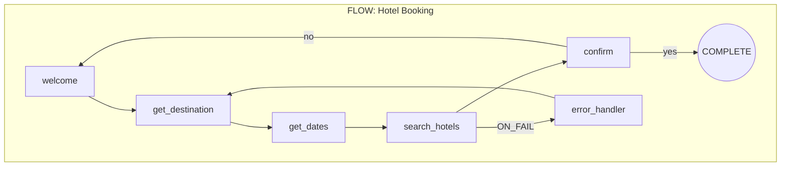
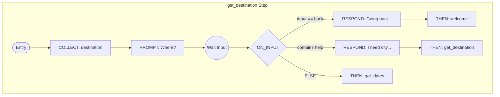
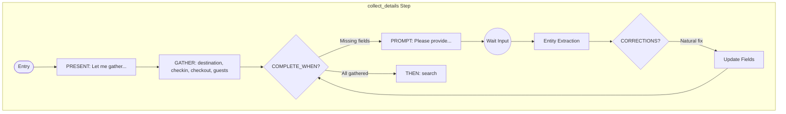
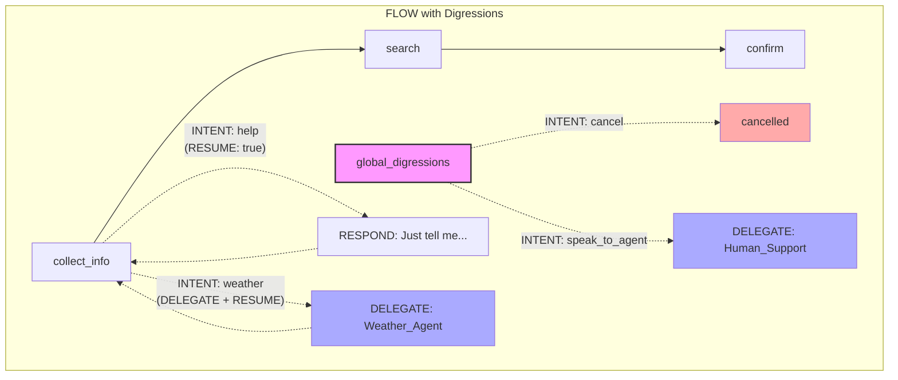

# Agent Blueprint Language (ABL) - Comprehensive Design Document

## Table of Contents

1. [System Overview](#1-system-overview)
2. [ABL Constructs Reference](#2-abl-constructs-reference)
3. [IR Schema](#3-ir-schema)
4. [Implementation Status](#4-implementation-status)
5. [Test Coverage](#5-test-coverage)
6. [Open Items & Gaps](#6-open-items--gaps)
7. [Appendices](#7-appendices)

---

## 1. System Overview

### 1.1 What is Agent Blueprint Language (ABL)?

Agent Blueprint Language (ABL) is a declarative language for defining AI agents — conversational, system-driven, or hybrid. It provides a declarative way to specify:

- Agent identity and behavior
- Information gathering
- Tool usage
- Multi-agent coordination
- Constraints and guardrails
- Error handling

### 1.2 Architecture

```
┌─────────────────────────────────────────────────────────────────┐
│                         ABL Source (.agent.abl)                  │
│   AGENT: Travel_Booking                                          │
│   MODE: reasoning                                                │
│   GOAL: "Help users book travel"                                 │
│   TOOLS: search_hotels(...) -> Hotel[]                          │
│   GATHER: destination, checkin, checkout                        │
└─────────────────────────────────────────────────────────────────┘
                              │
                              ▼
┌─────────────────────────────────────────────────────────────────┐
│                    Parser (@abl/core)                      │
│   • parseAgentBasedDSL() - Main entry point                     │
│   • Tokenizer/Lexer                                              │
│   • Expression parser                                            │
│   • Outputs: AgentBasedDocument                                  │
└─────────────────────────────────────────────────────────────────┘
                              │
                              ▼
┌─────────────────────────────────────────────────────────────────┐
│                   Compiler (@abl/compiler)                 │
│   • compileDSLtoIR() - ABL → IR transformation                  │
│   • compileAgentToIR() - Single agent compilation               │
│   • compileSupervisorToIR() - Supervisor compilation            │
│   • Outputs: CompilationOutput (AgentIR | SupervisorIR)         │
└─────────────────────────────────────────────────────────────────┘
                              │
                              ▼
┌─────────────────────────────────────────────────────────────────┐
│                       Runtime Executors                          │
├───────────────────────┬─────────────────────────────────────────┤
│   Reasoning Mode      │        Scripted/Flow Mode               │
│   (LLM-driven)        │        (State machine)                  │
├───────────────────────┼─────────────────────────────────────────┤
│   • buildSystemPrompt │   • executeFlowStep()                   │
│   • buildTools()      │   • extractEntities()                   │
│   • LLM conversation  │   • evaluateOnInput()                   │
│   • Tool execution    │   • Template interpolation              │
└───────────────────────┴─────────────────────────────────────────┘
```

### 1.3 Execution Modes

| Aspect             | Reasoning Mode            | Scripted/Flow Mode          |
| ------------------ | ------------------------- | --------------------------- |
| **Execution**      | LLM-driven conversation   | Deterministic state machine |
| **Latency**        | ~1000-2000ms (LLM calls)  | < 500ms (pattern matching)  |
| **Predictability** | Flexible, context-aware   | 100% scripted paths         |
| **Use Cases**      | Complex reasoning, advice | Voice IVR, forms, surveys   |
| **LLM Usage**      | Full conversation         | Entity extraction only      |

---

## 2. ABL Constructs Reference

### 2.1 AGENT / SUPERVISOR

**Purpose**: Define the agent type and name.

```dsl
AGENT: Travel_Booking_Agent    # Regular agent

SUPERVISOR: Orchestrator       # Supervisor/router agent
```

**IR Mapping**: `metadata.name`, `metadata.type`

---

### 2.2 MODE

**Purpose**: Specify execution mode.

```dsl
MODE: reasoning   # LLM-driven with flexible conversation
MODE: scripted    # Deterministic state machine (requires FLOW)
```

**Options**:

- `reasoning` - Full LLM conversation loop
- `scripted` - Flow-based execution

**IR Mapping**: `execution.mode`

---

### 2.3 GOAL

**Purpose**: Define the agent's primary objective.

```dsl
GOAL: "Help users find and book hotels for their travel needs"
```

**IR Mapping**: `identity.goal`

---

### 2.4 PERSONA

**Purpose**: Define the agent's personality and communication style.

```dsl
PERSONA: |
  Friendly and knowledgeable travel expert.
  Speaks in a warm, professional tone.
  Always suggests relevant deals and upgrades.
```

**IR Mapping**: `identity.persona`

---

### 2.5 LIMITATIONS

**Purpose**: Hard constraints the agent must never violate.

```dsl
LIMITATIONS:
  - Cannot process payments directly
  - Cannot guarantee availability until confirmed
  - Must verify user identity before showing booking details
```

**IR Mapping**: `identity.limitations[]`

---

### 2.6 IDENTITY

**Purpose**: Alternative structured identity definition.

```dsl
IDENTITY:
  role: "Customer Experience Closer"
  persona: "Warm and appreciative"
  expertise: ["conversation closing", "satisfaction check"]
  limitations: ["cannot process new requests"]
```

**IR Mapping**: `identity.goal`, `identity.persona`, `identity.limitations`

---

### 2.7 TOOLS

**Purpose**: Define external functions the agent can call.

```dsl
TOOLS:
  search_hotels(destination: string, checkin: date, checkout: date, guests: number) -> Hotel[]
  get_hotel_details(hotel_id: string) -> HotelDetails
  check_availability(hotel_id: string, dates: DateRange) -> {available: boolean, price: number}
  book_hotel(hotel_id: string, guest_info: GuestInfo) -> BookingConfirmation
```

**Parameters**:

- `name: type` - Parameter with type
- `-> ReturnType` - Return type specification

**Type Options**: `string`, `number`, `date`, `boolean`, `object`, `array`, `Hotel[]`, custom types

**IR Mapping**: `tools[]`

**Implementation Status**:
| Feature | Status | Notes |
|---------|--------|-------|
| Tool definition parsing | ✅ Complete | Full type support |
| Tool schema generation | ✅ Complete | Anthropic format |
| Tool execution | 🔶 Mocked | 25+ mock tools |
| Real tool integration | ❌ Not implemented | Requires adapter |

---

### 2.8 GATHER

**Purpose**: Define information to collect from the user.

```dsl
GATHER:
  destination:
    prompt: "Where would you like to stay?"
    type: string
    required: true

  checkin:
    prompt: "What's your check-in date?"
    type: date
    required: true

  guests:
    prompt: "How many guests?"
    type: number
    required: false
    default: 2
    validate: "1 <= value <= 10"
```

**Field Properties**:

- `prompt` - Question to ask user
- `type` - Data type (string, number, date, email, phone)
- `required` - Whether field is mandatory
- `default` - Default value if not provided
- `validate` - Validation expression

**IR Mapping**: `gather.fields[]`

**Implementation Status**:
| Feature | Status | Notes |
|---------|--------|-------|
| Field definition | ✅ Complete | All properties |
| Prompt generation | ✅ Complete | In system prompt |
| Entity extraction (LLM) | ✅ Complete | Reasoning mode |
| Entity extraction (Pattern) | ✅ Complete | Flow mode |
| Validation | 🔶 Partial | Basic type validation |

---

### 2.9 MEMORY

**Purpose**: Define persistent and session-scoped memory access.

```dsl
MEMORY:
  READS:                          # Persistent memory (read)
    - user.name
    - user.loyalty_tier
    - user.preferences.language

  WRITES:                         # Session memory (write)
    - session.case_id
    - session.booking_reference

  REMEMBER:                       # Auto-store triggers
    - WHEN: booking_confirmed
      STORE: confirmation_number -> user.last_booking
      TTL: "30d"

  RECALL:                         # Auto-recall instructions
    - ON: session_start
      INSTRUCTION: "Greet returning users by name"
```

**IR Mapping**: `memory.persistent[]`, `memory.session[]`, `memory.remember[]`, `memory.recall[]`

**Implementation Status**:
| Feature | Status | Notes |
|---------|--------|-------|
| READS parsing | ✅ Complete | Persistent paths |
| WRITES parsing | ✅ Complete | Session variables |
| REMEMBER triggers | 🔶 Parsed | Not executed |
| RECALL instructions | 🔶 Parsed | In system prompt |
| Actual persistence | ❌ Stubbed | Needs store adapter |

---

### 2.10 CONSTRAINTS / GUARDRAILS

**Purpose**: Define runtime constraints and safety guardrails.

```dsl
CONSTRAINTS:
  booking_requirements: # label only; use WHEN / BEFORE for runtime scoping
    - REQUIRE user.authenticated == true
      ON_FAIL: HANDOFF Authentication

    - REQUIRE destination IS SET BEFORE calling search_inventory
      ON_FAIL: "Please share a destination before I search."

GUARDRAILS:
  empathy_required:
    kind: output
    check: "shows_empathy"
    action: warn
    msg: "Acknowledge customer frustration"

  accurate_timelines:
    kind: output
    check: "use_system_timelines"
    action: ensure
    msg: "Only quote times from system"
```

**Constraint Actions**:

- `"message"` - Respond with message
- `ESCALATE reason` - Transfer to human
- `HANDOFF Agent` - Route to another agent through the shared runtime violation handler
- `BLOCK` - Prevent action

**IR Mapping**: `constraints.constraints[]`, `constraints.guardrails[]`

**Implementation Status**:
| Feature | Status | Notes |
|---------|--------|-------|
| CONSTRAINTS parsing | ✅ Complete | `REQUIRE`/`WARN`/`LIMIT`/`RESTRICT`, `WHEN`, structural `BEFORE`, `ON_FAIL` |
| GUARDRAILS parsing | ✅ Complete | kind/check/action |
| Runtime evaluation | 🔶 Partial | Active in flow/reasoning; legacy cleanup continues |
| Output guardrails | ✅ Implemented | Evaluated before history commit on active runtime paths |

---

### 2.11 FLOW (Scripted Mode)

**Purpose**: Define deterministic interaction flow for scripted agents.

#### 2.11.1 Basic FLOW Syntax

```dsl
FLOW:
  welcome -> get_destination -> get_dates -> search_hotels -> confirm

  welcome:
    RESPOND: "Hello! I'll help you find a hotel."
    THEN: get_destination

  get_destination:
    COLLECT: destination
    PROMPT: "Where would you like to stay?"
    ON_INPUT:
      - IF: input == "back"
        RESPOND: "Going back..."
        THEN: welcome
      - IF: input contains "help"
        RESPOND: "I need to know your destination city."
        THEN: get_destination
      - ELSE:
        THEN: get_dates

  get_dates:
    COLLECT: checkin, checkout
    PROMPT: "What are your check-in and check-out dates?"
    ON_INPUT:
      - IF: input == "back"
        THEN: get_destination
      - ELSE:
        THEN: search_hotels

  search_hotels:
    CALL: search_hotels(destination, checkin, checkout, 2)
    RESPOND: "I found {{result.total}} hotels for you."
    ON_FAIL: error_handler
    THEN: confirm

  confirm:
    RESPOND: "Would you like to book one of these hotels?"
    ON_INPUT:
      - IF: yes
        THEN: COMPLETE
      - IF: no
        THEN: welcome
      - ELSE:
        THEN: confirm

  error_handler:
    RESPOND: "Sorry, I couldn't search for hotels. Let's try again."
    THEN: get_destination
```

#### 2.11.2 Enhanced FLOW with GATHER

FLOW steps can include GATHER for multi-field collection with LLM-based extraction:

```dsl
FLOW:
  welcome -> collect_details -> search -> confirm

  collect_details:
    PRESENT: "Let me collect your booking details."
    GATHER:
      - destination: required
      - checkin:
          TYPE: date
          REQUIRED: true
          PROMPT: "When do you want to check in?"
      - checkout:
          TYPE: date
          REQUIRED: true
      - guests:
          TYPE: number
          DEFAULT: 2
      STRATEGY: hybrid
      PROMPT: "Please provide your destination, dates, and number of guests."
    CORRECTIONS: true
    COMPLETE_WHEN: destination AND checkin AND checkout
    THEN: search
```

**GATHER within FLOW Properties**:
| Property | Purpose |
|----------|---------|
| `fields` | List of fields to collect (name, type, required, default, prompt, validation) |
| `strategy` | Extraction method: `llm`, `pattern`, or `hybrid` |
| `prompt` | Template prompt for collecting (supports `{{field}}` placeholders) |

#### 2.11.3 DIGRESSIONS (Intent-Based Escapes)

Digressions allow users to escape from the current step based on detected intents:

```dsl
FLOW:
  get_info -> confirm

  get_info:
    GATHER: destination, checkin, checkout
    DIGRESSIONS:
      - INTENT: "cancel"
        RESPOND: "No problem, canceling your request."
        GOTO: cancelled
      - INTENT: "help"
        RESPOND: "I'm here to help you book a hotel. Just tell me your destination and dates."
        RESUME: true
      - INTENT: "weather"
        DELEGATE: Weather_Agent
        RESUME: true
        CLEAR: [destination]
    THEN: confirm

  global_digressions:
    - INTENT: "emergency"
      RESPOND: "Connecting you to emergency services."
      GOTO: emergency_handler
    - INTENT: "speak_to_agent"
      RESPOND: "Let me connect you with a human agent."
      DELEGATE: Human_Support
```

**Digression Properties**:
| Property | Purpose |
|----------|---------|
| `intent` | Intent pattern to match |
| `condition` | Optional additional condition |
| `respond` | Response message before handling |
| `goto` | Target step to transition to |
| `delegate` | Agent to delegate to |
| `call` | Tool to call |
| `resume` | Whether to resume current step after handling (default: false) |
| `clear` | Variables to clear before resuming |

#### 2.11.4 SUB_INTENTS (Scoped Intents)

Sub-intents are scoped to a specific step and allow local intent handling without leaving the step:

```dsl
FLOW:
  select_room:
    PRESENT: "Here are the available rooms:"
    GATHER: room_selection
    SUB_INTENTS:
      - INTENT: "change destination"
        RESPOND: "Sure, let's update your destination."
        CLEAR: [destination, room_selection]
      - INTENT: "more options"
        CALL: get_more_rooms()
        RESPOND: "Here are more options."
      - INTENT: "price details"
        RESPOND: "{{room_selection.price}} per night, {{room_selection.total}} total."
    THEN: confirm
```

**Sub-Intent Properties**:
| Property | Purpose |
|----------|---------|
| `intent` | Intent pattern to match |
| `respond` | Response message |
| `clear` | Variables to clear (triggers re-collection) |
| `set` | Variables to set |
| `call` | Tool to call |
| `resume` | Stay in current step (default: true) |

#### 2.11.5 ON_SUCCESS / ON_FAILURE Blocks

For CALL steps, you can define separate handling for success and failure:

```dsl
FLOW:
  book_hotel:
    CALL: create_booking(hotel_id, guest_info)
    ON_SUCCESS:
      RESPOND: "Great! Your booking is confirmed. Reference: {{result.confirmation_id}}"
      THEN: send_confirmation
    ON_FAIL:
      RESPOND: "I'm sorry, the booking couldn't be completed. {{result.error}}"
      THEN: retry_or_cancel
```

#### 2.11.6 Step Properties Reference

| Property                 | Purpose                                                     |
| ------------------------ | ----------------------------------------------------------- |
| `COLLECT`                | Fields to gather from user (legacy single-field)            |
| `GATHER`                 | Multi-field collection with LLM extraction                  |
| `PROMPT`                 | Message shown before input                                  |
| `PRESENT`                | Presentation template shown before collection               |
| `RESPOND`                | Message shown after action                                  |
| `CALL`                   | Tool execution                                              |
| `CHECK`                  | Constraint evaluation                                       |
| `ON_INPUT`               | Conditional branching based on user input                   |
| `ON_SUCCESS`             | Success branch for CALL steps                               |
| `ON_FAIL` / `ON_FAILURE` | Error handling branch                                       |
| `THEN`                   | Next step transition                                        |
| `DIGRESSIONS`            | Intent-based escapes                                        |
| `SUB_INTENTS`            | Scoped intents within the step                              |
| `CORRECTIONS`            | Allow natural corrections (e.g., "actually 4 guests not 3") |
| `COMPLETE_WHEN`          | Condition for step completion                               |

#### 2.11.7 ON_INPUT Conditions

| Pattern  | Example                       | Description                    |
| -------- | ----------------------------- | ------------------------------ |
| Equality | `input == "back"`             | Exact match (case-insensitive) |
| Contains | `input contains "help"`       | Substring match                |
| Regex    | `input matches /\d+/`         | Regular expression             |
| Variable | `count >= 5`                  | Context variable               |
| Intent   | `back`, `cancel`, `yes`, `no` | Keyword intents                |

**IR Mapping**: `flow.steps[]`, `flow.definitions{}`, `flow.global_digressions[]`

#### 2.11.8 FLOW IR Diagrams

**Basic FLOW Step Transitions:**



**FLOW with ON_INPUT Branching:**



**Enhanced FLOW with GATHER:**



**FLOW with Digressions:**



**ON_SUCCESS / ON_FAILURE Branches:**

```mermaid
flowchart TD
    subgraph CallStep["book_hotel Step with Result Branches"]
        entry([Entry]) --> call["CALL: create_booking(...)"]
        call --> result{Result?}

        result -->|SUCCESS| success_respond["RESPOND: Booking confirmed!"]
        success_respond --> success_then[THEN: send_confirmation]

        result -->|FAILURE| fail_respond["RESPOND: Sorry, booking failed"]
        fail_respond --> fail_then[THEN: retry_or_cancel]
    end

    style success_respond fill:#afa
    style fail_respond fill:#faa
```

**Implementation Status**:
| Feature | Status | Notes |
|---------|--------|-------|
| Flow parsing | ✅ Complete | All properties |
| Step execution | ✅ Complete | Sequential flow |
| ON_INPUT | ✅ Complete | IF/ELSE branches |
| Entity extraction | ✅ Complete | Pattern-based |
| Template interpolation | ✅ Complete | `{{variable}}` |
| GATHER within FLOW | ✅ Complete | Multi-field collection |
| DIGRESSIONS | ✅ Complete | Intent-based escapes |
| SUB_INTENTS | ✅ Complete | Scoped intents |
| ON_SUCCESS/ON_FAILURE | ✅ Complete | CALL result branches |
| global_digressions | ✅ Complete | Flow-level digressions |
| CALL execution | 🔶 Mocked | Tool mocks only |

---

### 2.12 HANDOFF

**Purpose**: Route conversation to another agent (permanent or temporary).

```dsl
HANDOFF:
  - TO: Hotel_Search
    WHEN: intent contains "hotel" OR intent contains "room"
    CONTEXT:
      pass: [destination, checkin, checkout, guests]
      summary: "User needs hotel booking"
    RETURN: true              # Return control after completion
    ON_RETURN: continue_flow  # Step to resume

  - TO: Support_Agent
    WHEN: intent contains "problem" OR intent contains "issue"
    CONTEXT:
      pass: [booking_reference]
      summary: "User has an issue"
      grantMemory: [user.preferences]
    RETURN: false             # Permanent handoff
```

**Properties**:

- `TO` - Target agent name
- `WHEN` - Condition for handoff
- `CONTEXT.pass` - Variables to pass
- `CONTEXT.summary` - Context summary for target
- `CONTEXT.grantMemory` - Memory access grants
- `RETURN` - Whether control returns to caller
- `ON_RETURN` - Step/action on return

**IR Mapping**: `coordination.handoffs[]`

**Implementation Status**:
| Feature | Status | Notes |
|---------|--------|-------|
| HANDOFF parsing | ✅ Complete | All properties |
| IR compilation | ✅ Complete | coordination.handoffs |
| Tool generation | ✅ Complete | `__handoff__` tool |
| Runtime execution | ✅ Complete | Session management |
| Context passing | ✅ Complete | State transfer |
| RETURN flow | 🔶 Partial | Basic support |

---

### 2.13 DELEGATE

**Purpose**: Call another agent synchronously and use its result.

```dsl
DELEGATE:
  - AGENT: Price_Calculator
    WHEN: need_price_calculation
    PURPOSE: "Calculate total booking price"
    INPUT:
      room_rate: selected_hotel.price
      nights: num_nights
      taxes: 0.12
    RETURNS:
      total_price: result.total
      breakdown: result.breakdown
    USE_RESULT: "Show price to user: {{total_price}}"
    TIMEOUT: "30s"
    ON_FAILURE: CONTINUE
    FAILURE_MSG: "Could not calculate price"
```

**Properties**:

- `AGENT` - Target agent name
- `WHEN` - Condition for delegation
- `PURPOSE` - Description for context
- `INPUT` - Variables to pass
- `RETURNS` - Result mapping
- `USE_RESULT` - Template for using result
- `TIMEOUT` - Maximum wait time
- `ON_FAILURE` - Error handling (`CONTINUE`, `ESCALATE`, `RESPOND`)

**IR Mapping**: `coordination.delegates[]`

**Implementation Status**:
| Feature | Status | Notes |
|---------|--------|-------|
| DELEGATE parsing | ✅ Complete | All properties |
| IR compilation | ✅ Complete | coordination.delegates |
| Tool generation | ✅ Complete | `__delegate__` tool |
| Runtime execution | 🔶 Partial | Basic flow |
| Result mapping | 🔶 Partial | Simple cases |

---

### 2.14 COMPLETE

**Purpose**: Define conversation completion conditions.

```dsl
COMPLETE:
  - WHEN: booking_confirmed == true
    RESPOND: "Your booking is confirmed! Reference: {{confirmation}}"
    STORE: confirmation -> user.last_booking

  - WHEN: all_fields_gathered == true
    RESPOND: "I have all the information I need."

  - WHEN: user_says_goodbye
    RESPOND: "Thank you for using our service!"
```

**Properties**:

- `WHEN` - Completion condition
- `RESPOND` - Final message
- `STORE` - Memory storage on complete

**IR Mapping**: `completion.conditions[]`

**Implementation Status**:
| Feature | Status | Notes |
|---------|--------|-------|
| COMPLETE parsing | ✅ Complete | All properties |
| IR compilation | ✅ Complete | completion.conditions |
| Tool generation | ✅ Complete | `__complete__` tool |
| Runtime execution | ✅ Complete | Session termination |
| STORE execution | ❌ Not implemented | Needs persistence |

---

### 2.15 ESCALATE

**Purpose**: Define conditions for human agent transfer.

```dsl
ESCALATE:
  triggers:
    - WHEN: user.requests_human == true
      REASON: "User explicitly requested human agent"
      PRIORITY: high
      TAGS: [manual_request]

    - WHEN: frustration_detected == true
      REASON: "User appears frustrated"
      PRIORITY: medium
      TAGS: [sentiment]

    - WHEN: attempts > 3 AND issue.unresolved
      REASON: "Multiple failed resolution attempts"
      PRIORITY: high
      TAGS: [resolution_failure]

  CONTEXT_FOR_HUMAN:
    - conversation_summary
    - booking_details
    - attempted_solutions

  ON_HUMAN_COMPLETE:
    - IF: resolution == "resolved"
      THEN: complete_with_survey
    - IF: resolution == "escalated_further"
      THEN: notify_manager
```

**Properties**:

- `triggers[]` - Conditions that trigger escalation
  - `WHEN` - Condition
  - `REASON` - Human-readable reason
  - `PRIORITY` - `low`, `medium`, `high`, `critical`
  - `TAGS` - Routing tags
- `CONTEXT_FOR_HUMAN` - Info to pass to human
- `ON_HUMAN_COMPLETE` - Actions after human completes

**IR Mapping**: `coordination.escalation`

**Implementation Status**:
| Feature | Status | Notes |
|---------|--------|-------|
| ESCALATE parsing | ✅ Complete | All properties |
| IR compilation | ✅ Complete | coordination.escalation |
| Tool generation | ✅ Complete | `__escalate__` tool |
| Runtime execution | 🔶 Echo mode | Echoes messages |
| Real human routing | ❌ Not implemented | Needs queue integration |

---

### 2.16 ON_ERROR

**Purpose**: Define error handling strategies.

```dsl
ON_ERROR:
  - TYPE: tool_timeout
    RESPOND: "The operation is taking longer than expected. Please wait..."
    RETRY: 2
    THEN: CONTINUE

  - TYPE: tool_failure
    RESPOND: "I encountered an issue. Let me try a different approach."
    THEN: HANDOFF Fallback_Agent

  - TYPE: validation_error
    RESPOND: "That doesn't look quite right. {{error.message}}"
    THEN: CONTINUE

  - DEFAULT:
    RESPOND: "I'm sorry, something went wrong. Let me connect you with support."
    THEN: ESCALATE
```

**Properties**:

- `TYPE` - Error type to handle
- `RESPOND` - Error message
- `RETRY` - Number of retries
- `THEN` - Action (`CONTINUE`, `ESCALATE`, `HANDOFF agent`, `COMPLETE`)

**IR Mapping**: `error_handling.handlers[]`

**Implementation Status**:
| Feature | Status | Notes |
|---------|--------|-------|
| ON_ERROR parsing | ✅ Complete | All properties |
| IR compilation | ✅ Complete | error_handling |
| Runtime execution | 🔶 Partial | Basic fallback |

---

### 2.17 Supervisor-Specific Constructs

Supervisors extend regular agents with routing capabilities.

```dsl
SUPERVISOR: Orchestrator

MODE: reasoning

GOAL: "Route user requests to appropriate specialists"

PERSONA: |
  Friendly assistant that understands needs
  and connects users with the right specialist.

HANDOFF:
  - TO: Hotel_Search
    WHEN: intent contains "hotel"
    CONTEXT:
      summary: "Hotel booking request"
    RETURN: true

  - TO: Flight_Search
    WHEN: intent contains "flight"
    CONTEXT:
      summary: "Flight booking request"
    RETURN: true

  - TO: Support
    WHEN: intent contains "help" OR intent contains "problem"
    CONTEXT:
      summary: "Support request"
    RETURN: false
```

**Unified AgentIR with Routing** (Supervisor Unification):

Supervisors are not a separate type — they are regular `AgentIR` instances with optional routing fields populated. Detection is config-driven: `ir.routing?.rules?.length > 0`.

```typescript
// AgentIR has optional routing fields:
interface AgentIR {
  // ... all standard agent fields ...
  routing?: RoutingConfig; // Present only on supervisors
  available_agents?: string[]; // Routable agent names
}

// RoutingConfig structure:
interface RoutingConfig {
  rules: RoutingRule[]; // Priority-ordered routing
  default_agent: string; // Fallback agent
  intent_classification: {
    use_llm: boolean;
    categories: string[];
    min_confidence: number;
  };
}

// SupervisorIR is a narrowing type alias (backward-compatible):
type SupervisorIR = AgentIR & {
  routing: RoutingConfig;
  available_agents: string[];
};
```

All agents — including supervisors — live in a single `CompilationOutput.agents` map. The entry supervisor is identified by `CompilationOutput.entry_agent`. This unified registry enables hierarchical supervisor-to-supervisor delegation (e.g., `Travel_Supervisor → Hotel_Supervisor → Hotel_Search_Agent`).

**Implementation Status**:
| Feature | Status | Notes |
|---------|--------|-------|
| SUPERVISOR parsing | ✅ Complete | Treated as agent |
| Routing rules | ✅ Complete | From HANDOFF |
| Intent classification | 🔶 LLM-based | No dedicated classifier |
| Agent orchestration | ✅ Complete | Session management |

---

## 3. IR Schema

### 3.1 Complete AgentIR Structure

```typescript
interface AgentIR {
  ir_version: '1.0';

  metadata: {
    name: string;
    version: string;
    type: 'agent' | 'supervisor';
    compiled_at: string;
    source_hash: string;
    compiler_version: string;
  };

  execution: {
    mode: 'reasoning' | 'scripted';
    hints: {
      voice_optimized: boolean;
      requires_persistence: boolean;
      supports_hitl: boolean;
      parallel_tools: boolean;
      complexity: 'simple' | 'moderate' | 'complex';
    };
    timeouts: {
      tool_timeout_ms: number;
      llm_timeout_ms: number;
      session_timeout_ms: number;
      voice_latency_target_ms?: number;
    };
  };

  identity: {
    goal: string;
    persona: string;
    limitations: string[];
    system_prompt: {
      template: string;
      sections: { context?; tools?; constraints?; history? };
    };
  };

  tools: ToolDefinition[];
  gather: GatherConfig;
  memory: MemoryConfig;
  constraints: ConstraintConfig;
  coordination: CoordinationConfig;
  completion: CompletionConfig;
  error_handling: ErrorHandlingConfig;
  flow?: FlowConfig;
}
```

### 3.2 Key IR Interfaces

| Interface            | Purpose                  | Key Fields                                                          |
| -------------------- | ------------------------ | ------------------------------------------------------------------- |
| `ToolDefinition`     | External function        | name, parameters, returns, hints                                    |
| `GatherConfig`       | Info collection          | fields[], strategy                                                  |
| `MemoryConfig`       | State management         | session[], persistent[], remember[], recall[]                       |
| `ConstraintConfig`   | Constraints + guardrails | constraints[], guardrails[]                                         |
| `CoordinationConfig` | Multi-agent              | delegates[], handoffs[], escalation                                 |
| `CompletionConfig`   | End conditions           | conditions[]                                                        |
| `FlowConfig`         | Scripted steps           | steps[], definitions{}, global_digressions[]                        |
| `FlowStep`           | Step definition          | name, gather?, digressions?, sub_intents?, on_success?, on_failure? |
| `FlowGatherConfig`   | GATHER in FLOW           | fields[], strategy?, prompt?                                        |
| `Digression`         | Intent escape            | intent, condition?, respond?, goto?, delegate?, resume?, clear?     |
| `SubIntent`          | Scoped intent            | intent, respond?, clear?, set?, call?, resume?                      |

### 3.3 FlowStep IR Schema

```typescript
interface FlowStep {
  name: string;

  // Legacy single-field collection
  collect?: string[];
  prompt?: string;

  // Enhanced multi-field collection
  gather?: FlowGatherConfig;
  present?: string; // Presentation template
  corrections?: boolean; // Allow natural corrections
  complete_when?: string; // Completion condition

  // Actions
  call?: string;
  check?: string;
  respond?: string;
  on_fail?: string; // Simple failure step (legacy)
  then?: string;

  // Call result branches
  on_success?: {
    respond?: string;
    then?: string;
  };
  on_failure?: {
    respond?: string;
    then?: string;
  };

  // Branching
  on_input?: InputBranch[];

  // Intent handling
  digressions?: Digression[];
  sub_intents?: SubIntent[];
}

interface FlowGatherConfig {
  fields: FlowGatherField[];
  strategy?: 'llm' | 'pattern' | 'hybrid';
  prompt?: string;
}

interface Digression {
  intent: string;
  condition?: string;
  respond?: string;
  goto?: string;
  delegate?: string;
  call?: string;
  resume?: boolean;
  clear?: string[];
}

interface SubIntent {
  intent: string;
  respond?: string;
  clear?: string[];
  set?: Record<string, string>;
  call?: string;
  resume?: boolean;
}
```

---

## 4. Implementation Status

### 4.1 Overall Status Matrix

| Construct             | Parsing | IR Compile | Runtime         | Tests |
| --------------------- | ------- | ---------- | --------------- | ----- |
| AGENT/SUPERVISOR      | ✅      | ✅         | ✅              | ✅    |
| MODE                  | ✅      | ✅         | ✅              | ✅    |
| GOAL                  | ✅      | ✅         | ✅              | ✅    |
| PERSONA               | ✅      | ✅         | ✅              | ✅    |
| LIMITATIONS           | ✅      | ✅         | ✅              | ✅    |
| IDENTITY              | ✅      | ✅         | ✅              | ✅    |
| TOOLS                 | ✅      | ✅         | 🔶 Mocked       | ✅    |
| GATHER                | ✅      | ✅         | ✅              | ✅    |
| MEMORY                | ✅      | ✅         | 🔶 Session only | 🔶    |
| CONSTRAINTS           | ✅      | ✅         | 🔶 Basic        | 🔶    |
| GUARDRAILS            | ✅      | ✅         | ❌              | ❌    |
| FLOW                  | ✅      | ✅         | ✅              | ✅    |
| ON_INPUT              | ✅      | ✅         | ✅              | ✅    |
| GATHER in FLOW        | ✅      | ✅         | ✅              | ✅    |
| DIGRESSIONS           | ✅      | ✅         | ✅              | 🔶    |
| SUB_INTENTS           | ✅      | ✅         | ✅              | 🔶    |
| ON_SUCCESS/ON_FAILURE | ✅      | ✅         | ✅              | 🔶    |
| global_digressions    | ✅      | ✅         | ✅              | 🔶    |
| HANDOFF               | ✅      | ✅         | ✅              | ✅    |
| DELEGATE              | ✅      | ✅         | 🔶 Basic        | 🔶    |
| COMPLETE              | ✅      | ✅         | ✅              | ✅    |
| ESCALATE              | ✅      | ✅         | 🔶 Echo         | ✅    |
| ON_ERROR              | ✅      | ✅         | 🔶 Basic        | 🔶    |

**Legend**: ✅ Complete | 🔶 Partial | ❌ Not implemented

### 4.2 Component Breakdown

#### Parser (@abl/core)

| Component          | Status | Lines     | Tests  |
| ------------------ | ------ | --------- | ------ |
| Lexer/Tokenizer    | ✅     | 450       | 21     |
| Expression Parser  | ✅     | 380       | 25     |
| Agent-Based Parser | ✅     | 600       | 15     |
| **Total**          |        | **1,430** | **61** |

#### Compiler (@abl/compiler)

| Component          | Status | Lines     | Tests   |
| ------------------ | ------ | --------- | ------- |
| IR Schema          | ✅     | 535       | -       |
| ABL-to-IR Compiler | ✅     | 576       | 8       |
| Evaluator          | ✅     | 280       | 45      |
| Fact Store         | ✅     | 450       | 40      |
| Gather Executor    | ✅     | 180       | 15      |
| **Total**          |        | **2,021** | **108** |

#### Runtime (apps/runtime)

| Component          | Status | Lines      | Tests  |
| ------------------ | ------ | ---------- | ------ |
| Runtime Executor   | ✅     | 1,800      | 45     |
| Reasoning Executor | ✅     | -          | -      |
| Flow Step Executor | ✅     | -          | -      |
| Routing Executor   | ✅     | -          | -      |
| Constraint Checker | ✅     | -          | -      |
| Session Management | ✅     | 200        | -      |
| Tool Mocks         | 🔶     | 150        | -      |
| **Total**          |        | **2,150+** | **45** |

### 4.3 Mock Tool Inventory

The test server includes mocks for 25+ tools:

| Category       | Tools                                                                                                                                    |
| -------------- | ---------------------------------------------------------------------------------------------------------------------------------------- |
| **Travel**     | search_hotels, get_hotel_details, check_availability, search_flights, book_hotel, book_flight, create_booking, get_deals, lookup_booking |
| **Healthcare** | check_symptoms, schedule_appointment, get_medication_info                                                                                |
| **Generic**    | greet_user, web_search, send_email, get_weather                                                                                          |
| **System**     | **handoff**, **delegate**, **complete**, **escalate**                                                                                    |

---

## 5. Test Coverage

### 5.1 Test File Inventory

| Package   | File                       | Tests   | Category    |
| --------- | -------------------------- | ------- | ----------- |
| core      | lexer.test.ts              | 21      | Unit        |
| core      | expression-parser.test.ts  | 25      | Unit        |
| core      | agent-based-parser.test.ts | 15      | Unit        |
| compiler  | types.test.ts              | 40      | Unit        |
| compiler  | evaluator.test.ts          | 45      | Unit        |
| compiler  | executor.test.ts           | 15      | Unit        |
| compiler  | fact-store.test.ts         | 40      | Unit        |
| compiler  | gather-executor.test.ts    | 15      | Unit        |
| compiler  | integration.test.ts        | 8       | Integration |
| compiler  | e2e.test.ts                | 50+     | E2E         |
| compiler  | traveldesk.e2e.test.ts     | 30+     | E2E         |
| server    | runtime-executor.test.ts   | 45      | Runtime     |
| analyzer  | analyzer.test.ts           | 12      | Unit        |
| **Total** |                            | **249** |             |

### 5.2 Test Coverage by Construct

| Construct    | Parser Tests | Compiler Tests | Runtime Tests | E2E Tests |
| ------------ | ------------ | -------------- | ------------- | --------- |
| AGENT        | ✅ 3         | ✅ 2           | -             | ✅ 10+    |
| MODE         | ✅ 2         | ✅ 1           | ✅ 2          | ✅ 5+     |
| GOAL/PERSONA | ✅ 2         | ✅ 1           | -             | ✅ 5+     |
| TOOLS        | ✅ 1         | ✅ 3           | ✅ 5          | ✅ 10+    |
| GATHER       | ✅ 1         | ✅ 5           | ✅ 17         | ✅ 10+    |
| MEMORY       | ✅ 1         | ✅ 2           | -             | 🔶 2      |
| CONSTRAINTS  | ✅ 1         | ✅ 3           | -             | ✅ 5+     |
| FLOW         | ✅ 6         | ✅ 2           | ✅ 5          | 🔶 2      |
| ON_INPUT     | ✅ 6         | ✅ 1           | ✅ 18         | 🔶 2      |
| HANDOFF      | ✅ 1         | ✅ 2           | ✅ 3          | ✅ 10+    |
| DELEGATE     | ✅ 1         | ✅ 2           | 🔶 1          | 🔶 2      |
| COMPLETE     | ✅ 1         | ✅ 2           | ✅ 2          | ✅ 5+     |
| ESCALATE     | ✅ 1         | ✅ 2           | ✅ 2          | ✅ 5+     |

### 5.3 E2E Test Categories

From `e2e.test.ts`:

1. **Compilation** - All DSLs compile correctly
2. **Routing** - Intent detection and agent routing
3. **Gather** - Information collection flows
4. **Constraints** - Guardrail enforcement
5. **Escalation** - Human transfer triggers
6. **Multi-turn** - Long conversations with context
7. **Digressions** - Off-topic handling
8. **Edge Cases** - Error handling, special characters
9. **Runtime Comparison** - Voice vs Digital
10. **Multi-Agent** - Different agent types

---

## 6. Open Items & Gaps

### 6.1 Implementation Gaps

| Gap                         | Priority | Description               | Workaround              |
| --------------------------- | -------- | ------------------------- | ----------------------- |
| **Real Tool Integration**   | High     | All tools are mocked      | Implement tool adapters |
| **Output Guardrails**       | High     | No post-LLM checks        | Manual review           |
| **Persistent Memory**       | Medium   | Only session memory works | Use external store      |
| **DELEGATE Result Mapping** | Medium   | Complex mappings fail     | Simplify structure      |
| **Human Escalation**        | Medium   | Echo mode only            | External queue          |
| **Intent Classifier**       | Low      | LLM-based only            | Train dedicated model   |

### 6.2 Test Gaps

| Gap                     | Priority | Description                     |
| ----------------------- | -------- | ------------------------------- |
| **Coverage Metrics**    | High     | No automated coverage reporting |
| **MEMORY Integration**  | High     | No persistent memory tests      |
| **GUARDRAILS Runtime**  | High     | No output validation tests      |
| **Performance Tests**   | Medium   | No latency benchmarks           |
| **Error Path Tests**    | Medium   | Limited error scenarios         |
| **Concurrent Sessions** | Low      | No stress tests                 |

### 6.3 Known Limitations

1. **Single-threaded Execution**: Flow steps execute sequentially
2. **No Parallel Branches**: Cannot execute multiple branches simultaneously
3. **Session-bound State**: Flow state not persisted across sessions
4. **Mock-only Tools**: Real tool integration requires custom implementation
5. **Pattern-based Extraction**: Complex entities may need LLM assistance
6. **No Streaming in Flow Mode**: Responses are sent complete, not streamed

---

## 7. Appendices

### 7.1 File Locations

#### Core Implementation

| Component          | Path                                                        |
| ------------------ | ----------------------------------------------------------- |
| Parser             | `packages/core/src/parser/agent-based-parser.ts`            |
| Lexer              | `packages/core/src/parser/lexer.ts`                         |
| Expression Parser  | `packages/core/src/parser/expression-parser.ts`             |
| Types              | `packages/core/src/types/agent-based.ts`                    |
| IR Schema          | `packages/compiler/src/platform/ir/schema.ts`               |
| IR Compiler        | `packages/compiler/src/platform/ir/compiler.ts`             |
| Evaluator          | `packages/compiler/src/platform/constructs/evaluator.ts`    |
| Fact Store         | `packages/compiler/src/platform/stores/fact-store.ts`       |
| Runtime Executor   | `apps/runtime/src/services/runtime-executor.ts`             |
| Reasoning Executor | `apps/runtime/src/services/execution/reasoning-executor.ts` |
| Flow Step Executor | `apps/runtime/src/services/execution/flow-step-executor.ts` |
| Routing Executor   | `apps/runtime/src/services/execution/routing-executor.ts`   |
| Constraint Checker | `apps/runtime/src/services/execution/constraint-checker.ts` |
| Prompt Builder     | `apps/runtime/src/services/execution/prompt-builder.ts`     |

#### Test Files

| Test Suite      | Path                                                           |
| --------------- | -------------------------------------------------------------- |
| Lexer Tests     | `packages/core/src/__tests__/lexer.test.ts`                    |
| Parser Tests    | `packages/core/src/__tests__/agent-based-parser.test.ts`       |
| Evaluator Tests | `packages/compiler/src/__tests__/constructs/evaluator.test.ts` |
| Runtime Tests   | `apps/runtime/src/__tests__/runtime-executor.test.ts`          |
| E2E Tests       | `packages/compiler/src/__tests__/e2e/e2e.test.ts`              |

#### Example ABL Files

| Example        | Path                                                     |
| -------------- | -------------------------------------------------------- |
| Travel Booking | `examples/generic/agents/travel_booking_agent.agent.dsl` |
| Hotel Search   | `examples/unified/agents/hotel_search.agent.dsl`         |
| Support Agent  | `examples/unified/agents/support.agent.dsl`              |
| Supervisor     | `examples/unified/supervisor.agent.dsl`                  |
| Flow Test      | `examples/flow-test/on_input_test.agent.dsl`             |
| Saludsa        | `examples/saludsa/`                                      |

### 7.2 ABL Quick Reference

```dsl
# Agent Definition
AGENT: Agent_Name
MODE: reasoning | scripted
GOAL: "Primary objective"
PERSONA: "Personality description"

LIMITATIONS:
  - Cannot do X
  - Must verify Y

# Tools
TOOLS:
  tool_name(param: type) -> ReturnType

# Information Gathering
GATHER:
  field_name:
    prompt: "Question"
    type: string | number | date | email | phone
    required: true | false
    default: value

# Memory
MEMORY:
  READS:
    - path.to.value
  WRITES:
    - session.variable

# Multi-Agent Coordination
HANDOFF:
  - TO: Target_Agent
    WHEN: condition
    CONTEXT:
      pass: [vars]
      summary: "Context"
    RETURN: true | false

DELEGATE:
  - AGENT: Target_Agent
    WHEN: condition
    INPUT: { mapping }
    RETURNS: { mapping }

# Completion
COMPLETE:
  - WHEN: condition
    RESPOND: "Message"

# Escalation
ESCALATE:
  triggers:
    - WHEN: condition
      REASON: "Description"
      PRIORITY: low | medium | high | critical

# Flow (Scripted Mode)
FLOW:
  step1 -> step2 -> step3

  step1:
    COLLECT: field
    PROMPT: "Question"
    ON_INPUT:
      - IF: condition
        THEN: target_step
      - ELSE:
        THEN: default_step
    THEN: next_step
```

### 7.3 Test Summary Statistics

```
┌──────────────────────────────────────────────────────────────┐
│                    TEST SUMMARY                               │
├──────────────────────────────────────────────────────────────┤
│  Total Test Files:     13 active                              │
│  Total Test Cases:     249                                    │
│                                                               │
│  By Package:                                                  │
│  ├── @abl/core:      3 files (61 tests)                │
│  ├── @abl/compiler:  5 files (131 tests)               │
│  ├── @abl/analyzer:  1 file (12 tests)                 │
│  └── runtime:         1 file (45 tests)                 │
│                                                               │
│  Test Commands:                                               │
│  ├── npm test (in packages/core)                             │
│  ├── npm test (in packages/compiler)                         │
│  ├── npm test (in apps/runtime)                              │
│  └── npm test (in packages/analyzer)                         │
└──────────────────────────────────────────────────────────────┘
```

---

## 8. Agent Observatory (Remote Debugging)

The Agent Observatory package (`@agent-platform/observatory`) provides remote debugging capabilities for agent execution.

### 8.1 Overview

```
┌─────────────────────────────────────────────────────────────────┐
│                      Agent Runtime                                │
│   • Emits trace events                                           │
│   • Reports spans (step execution, tool calls)                   │
│   • Supports breakpoints                                         │
└─────────────────────────────────────────────────────────────────┘
                              │ WebSocket
                              ▼
┌─────────────────────────────────────────────────────────────────┐
│                    Observatory Server                            │
│   • debug-server.ts - WebSocket-based debugging server           │
│   • session-manager.ts - Session tracking                        │
│   • breakpoints.ts - Breakpoint management                       │
└─────────────────────────────────────────────────────────────────┘
                              │
                              ▼
┌─────────────────────────────────────────────────────────────────┐
│                     Observatory CLI / UI                         │
│   • Real-time execution monitoring                               │
│   • Breakpoint inspection                                        │
│   • Trace event visualization                                    │
└─────────────────────────────────────────────────────────────────┘
```

### 8.2 Key Components

| Component       | Location                                               | Purpose                        |
| --------------- | ------------------------------------------------------ | ------------------------------ |
| Debug Server    | `packages/observatory/src/protocol/debug-server.ts`    | WebSocket server for debugging |
| Session Manager | `packages/observatory/src/protocol/session-manager.ts` | Session tracking               |
| Breakpoints     | `packages/observatory/src/protocol/breakpoints.ts`     | Breakpoint management          |
| Trace Events    | `packages/observatory/src/schema/trace-events.ts`      | Event tracing schema           |
| Spans           | `packages/observatory/src/schema/spans.ts`             | Execution span definitions     |

### 8.3 Trace Events

The observatory captures various trace events during agent execution:

- Step entry/exit
- Tool calls and results
- Entity extraction
- Handoff/delegate operations
- Error conditions

---

## Related Documentation

| Document                                     | Description                           |
| -------------------------------------------- | ------------------------------------- |
| [FLOW_MODE.md](./FLOW_MODE_DESIGN.md)        | Detailed flow/scripted mode execution |
| [MULTI_AGENT.md](./MULTI_AGENT.md)           | Supervisor, HANDOFF, DELEGATE         |
| [TOOLS_AND_GATHER.md](./TOOLS_AND_GATHER.md) | Tools and information gathering       |
| [CONSTRAINTS.md](./CONSTRAINTS.md)           | Constraints, guardrails, limitations  |
| [MEMORY.md](./MEMORY.md)                     | Session and persistent memory         |
| [ERROR_HANDLING.md](./ERROR_HANDLING.md)     | ON_ERROR, ESCALATE, COMPLETE          |

---

_Document Version: 1.1_
_Last Updated: February 2026_
