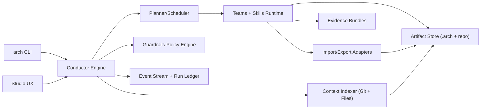

# Arch Conductor System Design

Status: Draft v1  
Date: March 6, 2026  
Audience: Agent Builders, Platform Engineering, Runtime Engineering, Product

---

## 1) Purpose

Design a production-grade system (`Arch`) that helps builders go from rough objectives/files to enterprise-ready multi-agent systems, then continue development with continuous context updates from Git and project artifacts.

This design intentionally uses product-native terms:

- Conductor
- Teams
- Skills
- Workstreams
- Checkpoints
- Evidence Bundles
- Guardrails

No external framework terminology is required in product UX.

---

## 2) Scope

### In Scope

- UX lifecycle (from objective intake to release and learning).
- CLI lifecycle (interactive + non-interactive CI mode).
- Execution lifecycle (orchestration state machine and reliability model).
- Resume lifecycle (crash-safe continuation and deterministic replay).
- Multi-agent coordination model (team topology, scheduling, conflict handling).
- Git continuous context sync and repository/file taxonomy.
- Import/export mapping for source formats and target deployment formats.
- Enterprise controls (policy gates, auditability, security, tenancy, i18n quality).

### Out of Scope (v1)

- Training/fine-tuning base models.
- Full cloud control plane (v1 can run local-first with optional services).
- Fully autonomous production deploy without policy or human gate.

---

## 3) Product Objectives

1. Turn rough objectives or imported assets into a structured blueprint in minutes.
2. Support enterprise complexity: multi-agent, integrations, i18n, compliance, testability, observability.
3. Keep context continuously fresh from Git + filesystem changes.
4. Allow safe pause/resume across local/dev/CI interruptions.
5. Preserve full provenance for every generated artifact and decision.

---

## 4) Core Concepts

### 4.1 Workstream

A workstream is one end-to-end effort with durable state:

- Input objective and source artifacts.
- Blueprint versions.
- Planned and executed tasks.
- Checkpoint decisions.
- Evidence bundles.

### 4.2 Team

A team is a logical group of specialist workers:

- Intake Team
- Spec Team
- Build Team
- QA Team
- Release Team
- Learning Team

### 4.3 Skill

A skill is an atomic executable capability with clear contracts:

- Inputs schema
- Outputs schema
- Preconditions
- Side effects
- Retry/idempotency behavior

### 4.4 Conductor

The Conductor is the orchestration engine that:

- Plans and routes tasks to teams/skills.
- Enforces guardrails and checkpoints.
- Tracks lifecycle state transitions.
- Ensures resume/replay safety.

### 4.5 Evidence Bundle

Immutable bundle attached to each major stage:

- Produced artifacts
- Validation results
- Metrics (quality, cost, latency)
- Provenance (who/what/when)
- Confidence/risk scores

---

## 5) System Architecture



### 5.1 Runtime Components

1. `arch-core` (TypeScript library)

- Domain model + orchestration state machine.
- Planner/scheduler.
- Resume/replay engine.

2. `arch-cli`

- Primary entrypoint for builders and CI.
- Interactive prompts and non-interactive flags.
- Structured JSON outputs for automation.

3. `arch-studio` (optional UI)

- Workstream dashboard.
- Blueprint editor and checkpoint UX.
- Diff/review and evidence visualization.

4. `context-indexer`

- Git pull/fetch metadata.
- Filesystem change watch.
- Semantic and structural context index refresh.

5. `skill-runtime`

- Executes skills in sandboxed workers.
- Handles retries, backoff, timeouts, budgets.

6. `policy-engine`

- Pre- and post-step guardrails.
- Compliance/security/release gates.

7. `artifact store`

- Local repo-backed `.arch/` + project folders.
- Optional remote backing later.

8. `event stream + ledger`

- Append-only run events and checkpoints.
- Required for resume and audit.

---

## 6) Canonical Repository Layout

```text
<repo>/
  .arch/
    arch.yaml
    workstreams/
      <workstream-id>/
        manifest.yaml
        run-ledger.jsonl
        checkpoints/
        evidence/
        snapshots/
        task-graph.json
    context/
      index/
      git/
      digests/
    policies/
      default.yaml
      enterprise.yaml
    adapters/
      import/
      export/
  specs/
    blueprints/
    decisions/
  agents/
  tools/
  flows/
  i18n/
    locales/
    glossary/
    message-catalogs/
  tests/
    unit/
    integration/
    e2e/
  imports/
  exports/
```

### 6.1 File Type Separation Rules

1. `specs/` is source of truth for intent and architecture.
2. `agents/`, `tools/`, `flows/` are generated/curated runtime assets.
3. `i18n/` stores locale catalogs and glossary contracts only.
4. `tests/` stores generated and manually curated test assets.
5. `.arch/` stores orchestration metadata, never runtime business logic.

---

## 7) UX Lifecycle

### 7.1 Stage Map

1. Intake

- Builder enters objective, constraints, and desired outcomes.
- Optional imports uploaded or linked from repo paths.

2. Ingest + Normalize

- Parse inputs into canonical capability model.
- Detect missing information and produce questions.

3. Blueprint Draft

- Generate structured blueprint:
  - Problem framing
  - Domain/capability map
  - Agent/team topology
  - Tool and data integration plan
  - i18n/test/security requirements

4. Checkpoint: Blueprint Approval

- Human accepts, edits, or requests alternatives.

5. Build Plan

- Conductor produces execution plan and estimates.

6. Develop Iterations

- Teams execute in loops with evidence bundles.
- Builder can intervene with constraints/patches.

7. Verify + Release Gate

- QA + guardrails + i18n + policy checks.
- Promote to release candidate on pass.

8. Release + Export

- Export package(s), update manifests, optional deploy handoff.

9. Learn

- Capture patterns and deltas into reusable skills/templates.

### 7.2 UX Checkpoint Rules

- Checkpoint A (Blueprint): mandatory.
- Checkpoint B (High-risk design decisions): conditional.
- Checkpoint C (Release Gate): mandatory for production profile.

---

## 8) CLI Lifecycle

### 8.1 Command Surface (v1)

```bash
arch init
arch intake --objective "<text>" [--profile enterprise]
arch ingest --files imports/** --format auto
arch spec draft [--workstream <id>] [--from latest]
arch spec review [--workstream <id>] [--approve|--request-changes]
arch plan build [--workstream <id>]
arch develop run [--workstream <id>] [--checkpoint auto|manual]
arch sync --git-pull --context-update
arch verify [--workstream <id>] [--gate release]
arch release [--workstream <id>] [--export-format abl|json|bundle]
arch resume [--workstream <id>] [--from-checkpoint <name>]
arch learn [--workstream <id>]
arch runs ls
arch runs show --workstream <id>
```

### 8.2 CLI Modes

1. Interactive mode

- Prompts for missing inputs.
- Shows human-readable diffs and choices.

2. Non-interactive mode

- `--json` output.
- Strict exit codes for CI/CD.

### 8.3 Exit Codes

- `0`: success
- `10`: validation failures
- `20`: checkpoint approval required
- `30`: policy gate failed
- `40`: adapter mapping failure
- `50`: recoverable runtime interruption (resume available)
- `70`: unrecoverable system error

---

## 9) Execution Lifecycle

### 9.1 Workstream State Machine

```text
CREATED
 -> INTAKE_READY
 -> INGESTING
 -> BLUEPRINT_DRAFTED
 -> BLUEPRINT_REVIEW
 -> BUILD_PLANNED
 -> EXECUTING
 -> VERIFYING
 -> RELEASE_CANDIDATE
 -> RELEASED
 -> LEARNING_CAPTURED
 -> CLOSED
```

Failure and branch states:

- `BLOCKED_CHECKPOINT`
- `BLOCKED_POLICY`
- `FAILED_RECOVERABLE`
- `FAILED_TERMINAL`
- `PAUSED`

### 9.2 Step Execution Contract

Every step must include:

- `step_id`
- `workstream_id`
- `team`
- `skill`
- `input_digest`
- `idempotency_key`
- `timeout_ms`
- `retry_policy`
- `budget_limits`

Every step emits:

- `start`, `heartbeat`, `result`, `error`, `evidence_ref`.

### 9.3 Reliability

1. At-least-once execution with idempotent step contracts.
2. Deterministic retries via fixed idempotency keys.
3. Checkpoint barriers before irreversible actions.
4. Bounded retries with exponential backoff and jitter.

---

## 10) Resume Lifecycle

### 10.1 Resume Triggers

- Process crash
- Host restart
- Network/model provider outage
- Policy gate block resolved
- Human checkpoint decision received

### 10.2 Persisted State

1. Run ledger (`jsonl` append-only)
2. Task graph + step statuses
3. Snapshot references for inputs/artifacts/context digest
4. Last stable checkpoint

### 10.3 Resume Algorithm

1. Load latest consistent checkpoint.
2. Reconstruct task graph from ledger + manifest.
3. Mark completed idempotent steps as terminal-success.
4. Requeue only incomplete/retryable steps.
5. Re-evaluate policy preconditions if stale.
6. Continue from `PAUSED` or `FAILED_RECOVERABLE`.

### 10.4 Resume CLI Semantics

- `arch resume` without args resumes newest recoverable workstream.
- `arch resume --from-checkpoint blueprint_review` rewinds to barrier.
- Rewind requires explicit confirmation in interactive mode.

---

## 11) Multi-Agent (Teams + Skills) Lifecycle

### 11.1 Team Topology (v1)

1. Intake Team

- `objective-normalizer`
- `constraint-extractor`
- `source-classifier`

2. Spec Team

- `capability-mapper`
- `architecture-drafter`
- `decision-writer`

3. Build Team

- `agent-generator`
- `tool-generator`
- `flow-generator`
- `i18n-scaffolder`

4. QA Team

- `schema-validator`
- `test-generator`
- `safety-validator`
- `i18n-completeness-checker`

5. Release Team

- `package-builder`
- `export-mapper`
- `release-manifest-writer`

6. Learning Team

- `pattern-detector`
- `skill-proposer`
- `template-updater`

### 11.2 Scheduling Strategy

1. Critical-path-first scheduling.
2. Parallelize independent skills within budget.
3. Route by proficiency score and historical success.
4. Hard cap on concurrent expensive reasoning tasks.

### 11.3 Conflict Resolution

When team outputs disagree:

1. Request a synthesis step from Spec Team.
2. If conflict score exceeds threshold, create checkpoint.
3. Persist both alternatives in evidence for traceability.

---

## 12) Git Continuous Context Update

### 12.1 Sync Modes

1. `manual`: explicit `arch sync`
2. `assisted`: sync on stage boundaries
3. `continuous`: periodic background sync (configurable interval)

### 12.2 Sync Pipeline

1. Fetch/pull from configured remote branch.
2. Detect changed files and classify by type.
3. Refresh context index only for changed scopes.
4. Update workstream context digest.
5. Trigger selective re-planning if affected artifacts changed.

### 12.3 Context Freshness Rules

1. Blueprint generation requires context freshness under max age threshold.
2. Release gate fails if context digest is stale beyond policy.

---

## 13) Import/Export Mapping Architecture

### 13.1 Adapter Contracts

Each adapter exposes:

- `detect(input) -> confidence`
- `import(input) -> canonical model`
- `validate(model) -> diagnostics`
- `export(model, target_format) -> artifacts`

### 13.2 Canonical Model Segments

- Capabilities
- Intents/flows
- Entities/data contracts
- Integrations/tools
- Policies/constraints
- Localization resources

### 13.3 Supported v1 Targets

- ABL project bundle
- Structured JSON package
- Repo folder scaffold with manifests

---

## 14) Guardrails, Compliance, and Security

### 14.1 Guardrail Types

1. Input guardrails (PII, forbidden domains, missing required fields).
2. Process guardrails (budget, tool allowlists, tenancy isolation).
3. Output guardrails (schema, policy, security, legal text checks).
4. Release guardrails (test pass, vuln scan, i18n coverage).

### 14.2 Enterprise Controls

- Tenant-scoped artifact paths and metadata.
- Secrets never persisted in evidence bundles.
- Signed release manifests.
- Full audit trail for checkpoint decisions.

---

## 15) Observability and Audit

### 15.1 Event Types

- `workstream.created`
- `stage.changed`
- `step.started`
- `step.completed`
- `step.failed`
- `checkpoint.requested`
- `checkpoint.approved`
- `checkpoint.rejected`
- `policy.failed`
- `resume.started`
- `resume.completed`
- `release.published`

### 15.2 Required Metrics

- Blueprint draft latency
- Build throughput (artifacts/hour)
- Verification pass rate
- Resume success rate
- Rework rate after sync updates
- i18n completeness by locale
- Cost per workstream and per stage

---

## 16) Minimal Schemas

### 16.1 `.arch/arch.yaml`

```yaml
version: 1
profile: enterprise
defaultBranch: main
sync:
  mode: assisted
  intervalMinutes: 15
  requireFreshContextForRelease: true
policies:
  active: [default, enterprise]
checkpoints:
  blueprint: required
  release: required
teams:
  intake: enabled
  spec: enabled
  build: enabled
  qa: enabled
  release: enabled
  learning: enabled
budgets:
  maxParallelReasoning: 6
  maxWorkstreamCostUsd: 300
```

### 16.2 Workstream Manifest

```yaml
workstreamId: ws_2026_03_06_001
objective: 'Build enterprise support assistant with CRM + billing integrations'
status: EXECUTING
currentStage: BUILD
contextDigest: sha256:...
checkpointState:
  blueprint: approved
  release: pending
artifacts:
  blueprint: specs/blueprints/ws_2026_03_06_001.md
  topology: specs/blueprints/ws_2026_03_06_001.topology.yaml
lastResumePoint: cp_build_03
```

---

## 17) UX Flow Summary (Builder View)

1. Start with objective or upload files.
2. Review generated blueprint and decision log.
3. Approve blueprint.
4. Run build and observe live task graph.
5. Resolve any blocked checkpoints/policy failures.
6. Review evidence bundle and verification report.
7. Approve release and export/deploy package.
8. Continue iterative development with `sync + resume` cycles.

---

## 18) Phased Delivery Plan

### Phase 1 (4-6 weeks): Foundation

- `arch init/intake/ingest/spec draft`
- Workstream model + ledger
- Basic context indexing and adapter API

### Phase 2 (4-6 weeks): Build + Verify

- `plan build/develop run/verify`
- Team runtime with parallel scheduling
- Evidence bundles and checkpoint engine

### Phase 3 (3-4 weeks): Resume + Git Sync

- Full resume/replay semantics
- Continuous context sync and selective re-planning

### Phase 4 (3-4 weeks): Enterprise Release

- Policy engine hardening
- Signed manifests
- i18n and compliance release gates

### Phase 5 (3-4 weeks): Learning Loop

- `learn` workflow
- Pattern extraction and skill proposal pipeline

---

## 19) Acceptance Criteria

1. A builder can go from rough objective to approved blueprint in one guided workflow.
2. Build stage produces separated assets (`specs/agents/tools/flows/i18n/tests`) with validation evidence.
3. Interrupted runs can resume without duplicated side effects.
4. Git/context changes trigger selective re-planning, not full restarts.
5. Release is blocked if policy/i18n/test gates fail.
6. Every major decision has a traceable evidence bundle.

---

## 20) Immediate Next Implementation Artifacts

1. `packages/arch-core/src/domain/*` (workstream, step, evidence models).
2. `packages/arch-core/src/state-machine/*`.
3. `packages/arch-core/src/resume/*`.
4. `packages/cli/src/commands/arch/*`.
5. `packages/arch-core/src/adapters/*`.
6. `packages/arch-core/src/policy/*`.
7. `docs/arch/CLI_REFERENCE.md` and `docs/arch/WORKSTREAM_SCHEMA.md`.
