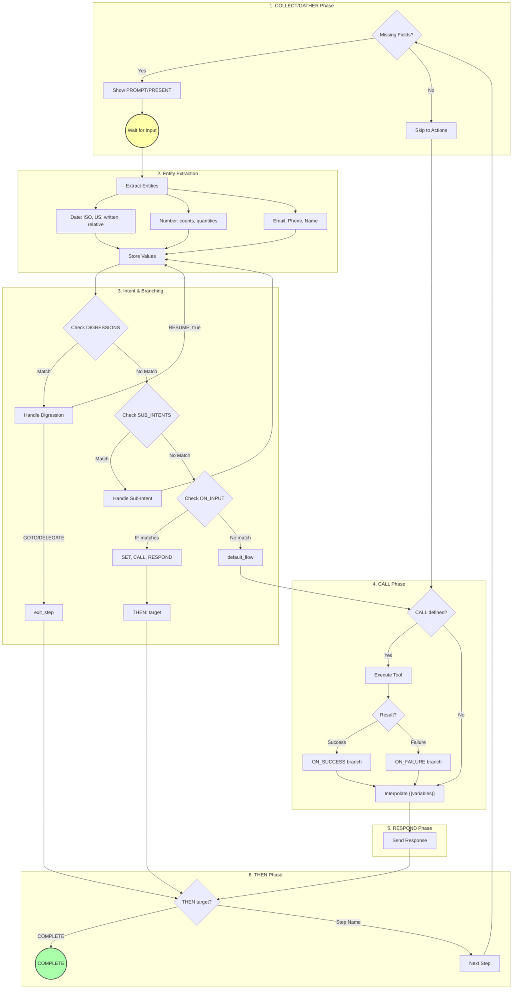
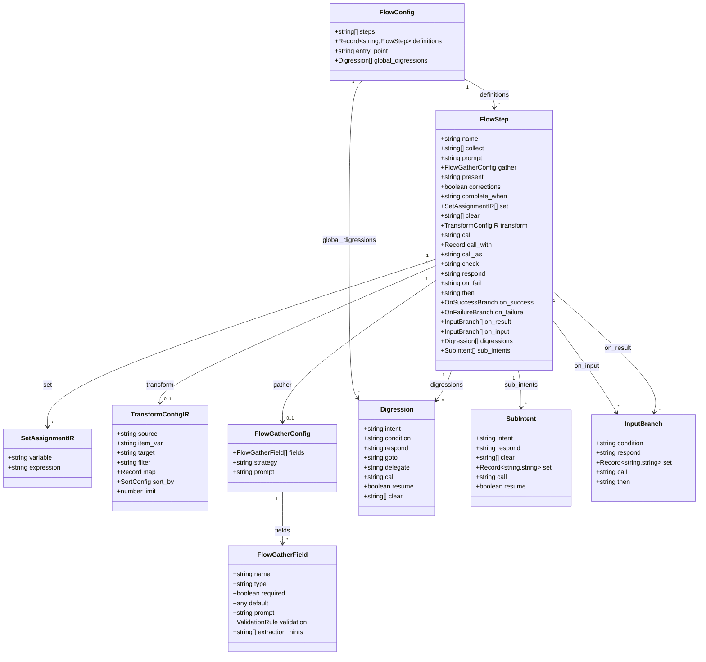
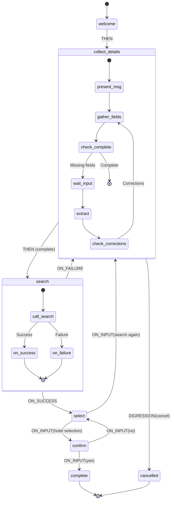

# FLOW Mode (Scripted Mode) - Comprehensive Design Document

## Table of Contents

1. [Architecture Overview](#1-architecture-overview)
2. [Design Details](#2-design-details)
3. [Product Aspects Coverage](#3-product-aspects-coverage)
4. [Test Engine Coverage](#4-test-engine-coverage)
5. [Test Case Categories](#5-test-case-categories)
6. [Open Items & Gaps](#6-open-items--gaps)
7. [Recommendations](#7-recommendations)

---

## 1. Architecture Overview

### 1.1 System Context

FLOW mode (scripted mode) is one of two execution modes in the Agent Blueprint Language (ABL):

| Aspect              | FLOW (Scripted)             | Reasoning                   |
| ------------------- | --------------------------- | --------------------------- |
| **Execution Model** | Deterministic state machine | LLM-driven with constraints |
| **Latency Target**  | < 500ms                     | ~1000ms                     |
| **Predictability**  | 100% scripted paths         | Flexible reasoning          |
| **Use Cases**       | Voice IVR, forms, surveys   | Complex reasoning tasks     |
| **LLM Usage**       | Entity extraction only      | Full conversation           |

### 1.2 Component Architecture

```
┌─────────────────────────────────────────────────────────────────┐
│                         DSL Source                               │
│   FLOW: step1 -> step2 -> step3                                 │
│     step1:                                                       │
│       COLLECT: field                                             │
│       ON_INPUT: ...                                              │
└─────────────────────────────────────────────────────────────────┘
                              │
                              ▼
┌─────────────────────────────────────────────────────────────────┐
│                    Parser (agent-based-parser.ts)                │
│   • parseFlow() - Flow section parsing                          │
│   • parseOnInput() - Conditional branch parsing                 │
│   • Step property parsing (COLLECT, PROMPT, RESPOND, etc.)      │
└─────────────────────────────────────────────────────────────────┘
                              │
                              ▼
┌─────────────────────────────────────────────────────────────────┐
│                   Compiler (compiler.ts)                         │
│   • compileFlow() - DSL FlowStep → IR FlowStep                  │
│   • Maps onInput → on_input (snake_case)                        │
│   • Produces framework-agnostic IR                              │
└─────────────────────────────────────────────────────────────────┘
                              │
                              ▼
┌─────────────────────────────────────────────────────────────────┐
│                    IR Schema (schema.ts)                         │
│   • FlowConfig interface                                        │
│   • FlowStep interface                                          │
│   • InputBranch interface                                       │
└─────────────────────────────────────────────────────────────────┘
                              │
                              ▼
┌─────────────────────────────────────────────────────────────────┐
│                Runtime Executors                                 │
├─────────────────────┬───────────────────┬───────────────────────┤
│  FlowExecutor       │  RuntimeExecutor  │  Runtimes             │
│  (compiler pkg)     │  (server)    │  (voice/digital/wf)   │
│  • execute()        │  • executeFlowStep│  • processFlowStep()  │
│  • executeStep()    │  • extractEntities│                       │
│  • executeToolCall()│  • evaluateOnInput│                       │
└─────────────────────┴───────────────────┴───────────────────────┘
```

### 1.3 Data Flow

```
User Input → Session → Flow State → Step Execution → Response
     ↑                     │
     └─────────────────────┘ (loop until COMPLETE)
```

---

## 2. Design Details

### 2.1 IR Schema

**Location:** `packages/compiler/src/platform/ir/schema.ts`

```typescript
interface FlowConfig {
  steps: string[]; // Execution order
  definitions: Record<string, FlowStep>; // Step definitions
  entry_point?: string; // Default: first step
  global_digressions?: Digression[]; // Digressions available in all steps
}

/** SET assignment — variable = expression, resolved at execution time */
interface SetAssignmentIR {
  variable: string;
  expression: string;
}

/** TRANSFORM pipeline configuration */
interface TransformConfigIR {
  source: string; // Source array path
  item_var: string; // Iterator variable name
  target: string; // Output variable name
  filter?: string; // Boolean filter expression
  map?: Record<string, string>; // Field → expression mappings
  sort_by?: { field: string; order: 'asc' | 'desc' };
  limit?: number; // Max items to keep
}

interface FlowStep {
  name: string;

  // --- Legacy single-field collection ---
  collect?: string[]; // Fields to gather
  prompt?: string; // Pre-collection prompt

  // --- Enhanced multi-field collection (GATHER within FLOW) ---
  gather?: FlowGatherConfig; // GATHER-style flexible collection
  present?: string; // Presentation template before collection
  corrections?: boolean; // Allow natural corrections
  complete_when?: string; // Condition for step completion

  // --- Computed assignments ---
  set?: SetAssignmentIR[]; // SET variable = expression
  clear?: string[]; // CLEAR session variables

  // --- Data transformation ---
  transform?: TransformConfigIR; // TRANSFORM array pipeline

  // --- Actions ---
  call?: string; // Tool expression
  call_with?: Record<string, string>; // Explicit CALL params (WITH: block)
  call_as?: string; // Result variable binding (AS:)
  check?: string; // Constraint phase
  respond?: string; // Post-action response
  on_fail?: string; // Simple failure branch (legacy)
  then?: string; // Success branch

  // --- Call result branches ---
  on_success?: {
    respond?: string; // Response on success
    then?: string; // Next step on success
  };
  on_failure?: {
    respond?: string; // Response on failure
    then?: string; // Next step on failure
  };

  // --- Multi-way result branching ---
  on_result?: InputBranch[]; // ON_RESULT: multi-way branches

  // --- Branching ---
  on_input?: InputBranch[]; // Conditional routing

  // --- Intent handling ---
  digressions?: Digression[]; // Intent-based escapes
  sub_intents?: SubIntent[]; // Scoped intents within this step
}

interface FlowGatherConfig {
  fields: FlowGatherField[]; // Fields to collect
  strategy?: 'llm' | 'pattern' | 'hybrid'; // Extraction strategy
  prompt?: string; // Prompt template for collecting
}

interface FlowGatherField {
  name: string;
  type?: string; // string, number, date, email, phone
  required?: boolean; // default: true
  default?: unknown;
  prompt?: string; // Individual prompt for this field
  validation?: ValidationRule;
  extraction_hints?: string[]; // Hints for LLM extraction
}

interface Digression {
  intent: string; // Intent pattern to match
  condition?: string; // Optional condition
  respond?: string; // Response before handling
  goto?: string; // Target step
  delegate?: string; // Agent to delegate to
  call?: string; // Tool to call
  resume?: boolean; // Resume current step after handling
  clear?: string[]; // Variables to clear before resuming
}

interface SubIntent {
  intent: string; // Intent pattern
  respond?: string; // Response message
  clear?: string[]; // Variables to clear
  set?: Record<string, string>; // Variables to set
  call?: string; // Tool to call
  resume?: boolean; // Stay in current step (default: true)
}

interface InputBranch {
  condition?: string; // IF condition (null = ELSE)
  respond?: string; // Branch response
  set?: Record<string, string>; // Variable assignments
  call?: string; // Branch tool call
  then: string; // Target step
}
```

### 2.2 Parser Design

**Location:** `packages/core/src/parser/agent-based-parser.ts`

#### Flow Section Grammar:

```
FLOW:
  step1 -> step2 -> step3          # Step sequence (or YAML-style steps: list)

  global_digressions:              # Digressions available in all steps
    - INTENT: "emergency"
      GOTO: emergency_handler

  step1:                           # Step definition
    # Legacy single-field collection
    COLLECT: field1, field2        # Fields to gather
    PROMPT: "prompt text"          # Collection prompt

    # Enhanced multi-field collection
    PRESENT: "Let me help you..."  # Presentation before collection
    GATHER:                        # GATHER block
      - field1: required
      - field2:
          TYPE: date
          REQUIRED: true
          PROMPT: "When?"
      STRATEGY: hybrid
      PROMPT: "Please provide details"
    CORRECTIONS: true              # Allow natural corrections
    COMPLETE_WHEN: condition       # When step is complete

    # Actions
    CALL: tool_name(args)          # Tool execution
    CHECK: condition               # Inline boolean guard
    RESPOND: "response text"       # Response message

    # Call result branches
    ON_SUCCESS:
      RESPOND: "Success message"
      THEN: next_step
    ON_FAIL:                       # (or ON_FAILURE for block syntax)
      RESPOND: "Error message"
      THEN: error_step

    THEN: next_step                # Default success branch

    # Conditional branching
    ON_INPUT:                      # Conditional branches
      - IF: condition              # IF branch
        RESPOND: "message"
        SET: var = value
        CALL: tool()
        THEN: target
      - ELSE:                      # ELSE branch
        THEN: default_target

    # Intent handling
    DIGRESSIONS:                   # Intent-based escapes
      - INTENT: "cancel"
        RESPOND: "Canceling..."
        GOTO: cancelled
      - INTENT: "help"
        RESPOND: "Let me help..."
        RESUME: true

    SUB_INTENTS:                   # Scoped intents
      - INTENT: "change"
        RESPOND: "Sure, let's change that."
        CLEAR: [field1]
      - INTENT: "more options"
        CALL: get_more()
        RESPOND: "Here are more options."
```

#### Parser Functions:

| Function                 | Purpose                                                                   |
| ------------------------ | ------------------------------------------------------------------------- |
| `parseFlow()`            | Parse FLOW section including step sequence and definitions                |
| `parseOnInput()`         | Parse ON_INPUT branches with IF/ELSE conditions                           |
| `parseOnSuccessBlock()`  | Parse ON_SUCCESS block for CALL steps                                     |
| `parseOnFailBlock()`     | Parse ON_FAIL/ON_FAILURE block for CALL steps                             |
| `parseDigressionsList()` | Parse DIGRESSIONS block (global or step-level)                            |
| Step property handling   | COLLECT, GATHER, PROMPT, PRESENT, RESPOND, DIGRESSIONS, SUB_INTENTS, etc. |

### 2.3 Execution Model

#### Step Execution Phases (Mermaid Diagram):



#### Step Execution Phases (Text):

```
┌─────────────────────────────────────────────────────────────────┐
│ 1. COLLECT/GATHER Phase                                          │
│    • Check for missing required fields                          │
│    • Show PROMPT/PRESENT to user                                │
│    • Wait for input (pause flow)                                │
└─────────────────────────────────────────────────────────────────┘
                              │ User provides input
                              ▼
┌─────────────────────────────────────────────────────────────────┐
│ 2. Entity Extraction                                             │
│    • Extract typed values from input                            │
│    • Date parsing (ISO, US, written, relative)                  │
│    • Number parsing (counts, quantities)                        │
│    • Email, phone, name extraction                              │
└─────────────────────────────────────────────────────────────────┘
                              │
                              ▼
┌─────────────────────────────────────────────────────────────────┐
│ 3. Intent & Branching                                            │
│    • Check DIGRESSIONS (step-level, then global)                │
│    • Check SUB_INTENTS (scoped to step)                         │
│    • Evaluate ON_INPUT IF conditions in order                   │
│    • Execute SET assignments                                    │
│    • Show branch RESPOND                                        │
│    • Execute branch CALL                                        │
│    • Transition via branch THEN                                 │
└─────────────────────────────────────────────────────────────────┘
                              │ If no branch matches
                              ▼
┌─────────────────────────────────────────────────────────────────┐
│ 4. CALL Phase                                                    │
│    • Parse tool expression: tool_name(arg1, arg2)               │
│    • Resolve arguments from context                             │
│    • Execute via tool executor                                  │
│    • Handle ON_SUCCESS or ON_FAILURE branches                   │
└─────────────────────────────────────────────────────────────────┘
                              │
                              ▼
┌─────────────────────────────────────────────────────────────────┐
│ 5. RESPOND Phase                                                 │
│    • Interpolate {{variables}}                                  │
│    • Send response to user                                      │
└─────────────────────────────────────────────────────────────────┘
                              │
                              ▼
┌─────────────────────────────────────────────────────────────────┐
│ 6. THEN Phase                                                    │
│    • Transition to next step                                    │
│    • Handle COMPLETE keyword                                    │
│    • Loop back to step 1 for next step                         │
└─────────────────────────────────────────────────────────────────┘
```

### 2.4 IR Structure Diagram

The compiled IR for a FLOW looks like this:



**Example Flow IR State Machine:**



### 2.5 Condition Evaluation

**Location:** `apps/runtime/src/services/execution/` (evaluateCondition)

| Pattern    | Example                   | Description                 |
| ---------- | ------------------------- | --------------------------- |
| Equality   | `input == "back"`         | Case-insensitive match      |
| Inequality | `input != "skip"`         | Not equal                   |
| Contains   | `input contains "help"`   | Substring match             |
| StartsWith | `input startsWith "hi"`   | Prefix match                |
| EndsWith   | `input endsWith "please"` | Suffix match                |
| Regex      | `input matches /\d+/`     | Regular expression          |
| Variable   | `count >= 5`              | Context variable comparison |
| Boolean    | `is_authenticated`        | Truthy check                |
| Intent     | `back`                    | Keyword intent matching     |

#### Intent Keywords:

| Intent   | Matching Keywords                                       |
| -------- | ------------------------------------------------------- |
| `back`   | back, go back, previous, return                         |
| `cancel` | cancel, nevermind, forget it, stop                      |
| `change` | change, modify, update, edit, different                 |
| `help`   | help, assist, support, confused, assistance             |
| `yes`    | yes, yeah, yep, sure, ok, okay, correct, right, confirm |
| `no`     | no, nope, nah, not, wrong, incorrect                    |

---

## 3. Product Aspects Coverage

### 3.1 Fully Implemented Features

| Feature                     | Status      | Location                | Notes                                                  |
| --------------------------- | ----------- | ----------------------- | ------------------------------------------------------ |
| **Flow Parsing**            | ✅ Complete | `agent-based-parser.ts` | Full ABL syntax support                                |
| **ON_INPUT Branches**       | ✅ Complete | Parser + Runtime        | IF/ELSE conditions                                     |
| **SET Assignments**         | ✅ Complete | Runtime                 | Variable manipulation                                  |
| **COLLECT Fields**          | ✅ Complete | Runtime                 | Multi-field collection                                 |
| **PROMPT/RESPOND**          | ✅ Complete | Runtime                 | Separate prompts and responses                         |
| **CALL Tool Execution**     | ✅ Complete | Runtime                 | Tool expression parsing                                |
| **Entity Extraction**       | ✅ Complete | Runtime                 | Date, number, email, phone, name                       |
| **Template Interpolation**  | ✅ Complete | Runtime                 | `{{variable}}` substitution                            |
| **Step Navigation**         | ✅ Complete | Runtime                 | Back, forward, conditional                             |
| **COMPLETE Handling**       | ✅ Complete | Runtime                 | Flow termination                                       |
| **ON_FAIL Branching**       | ✅ Complete | FlowExecutor            | Error recovery paths                                   |
| **Flow State Persistence**  | ✅ Complete | RuntimeSession          | Session-based state                                    |
| **GATHER within FLOW**      | ✅ Complete | Parser + IR             | Multi-field LLM collection                             |
| **DIGRESSIONS**             | ✅ Complete | Parser + IR             | Intent-based escapes                                   |
| **SUB_INTENTS**             | ✅ Complete | Parser + IR             | Scoped intents within steps                            |
| **ON_SUCCESS/ON_FAILURE**   | ✅ Complete | Parser + IR             | CALL result branches                                   |
| **global_digressions**      | ✅ Complete | Parser + IR             | Flow-level digressions                                 |
| **PRESENT**                 | ✅ Complete | Parser + IR             | Presentation templates                                 |
| **CORRECTIONS**             | ✅ Complete | Parser + IR             | Natural correction support                             |
| **COMPLETE_WHEN**           | ✅ Complete | Parser + IR             | Step completion conditions                             |
| **SET (block form)**        | ✅ Complete | Parser + IR + Runtime   | Variable assignment with expressions                   |
| **CLEAR**                   | ✅ Complete | Parser + IR + Runtime   | Delete session variables                               |
| **CALL WITH/AS**            | ✅ Complete | Parser + IR + Runtime   | Explicit params + result binding                       |
| **ON_RESULT**               | ✅ Complete | Parser + IR + Runtime   | Multi-way tool result branching                        |
| **TRANSFORM**               | ✅ Complete | Parser + IR + Runtime   | Array pipeline: FILTER/MAP/SORT_BY/LIMIT               |
| **Built-in Functions (35)** | ✅ Complete | Evaluator               | Math, string, formatting, type, array, object, utility |

### 3.2 Mocked/Stubbed Components

| Component            | Status       | Location              | Notes                           |
| -------------------- | ------------ | --------------------- | ------------------------------- |
| **Tool Responses**   | 🔶 Mocked    | `MOCK_TOOL_RESPONSES` | 25+ travel/booking tools mocked |
| **LLM Client**       | 🔶 Optional  | `AnthropicClient`     | Only for reasoning mode         |
| **Human Escalation** | 🔶 Echo Mode | `handleEscalate()`    | Echoes user messages back       |

#### Mock Tool Inventory:

```typescript
MOCK_TOOL_RESPONSES = {
  // Greeting
  greet_user: (params) => ({ greeting: "Hello, {name}!" }),

  // Travel/Booking
  search_hotels: (params) => ({ hotels: [...], total: 3 }),
  get_hotel_details: (params) => ({ name, rooms, amenities }),
  check_availability: (params) => ({ available: true, price }),
  search_flights: (params) => ({ flights: [...] }),
  book_hotel: (params) => ({ confirmation: "HTL-..." }),
  book_flight: (params) => ({ confirmation: "FLT-..." }),
  create_booking: (params) => ({ booking_id: "BK-..." }),
  get_deals: () => ({ deals: [...] }),
  lookup_booking: (params) => ({ found: true, reference }),

  // Healthcare
  check_symptoms: (params) => ({ possibleConditions, urgency }),
  schedule_appointment: (params) => ({ appointmentId }),
  get_medication_info: (params) => ({ dosage, sideEffects }),

  // Generic
  web_search: (params) => ({ results: [...] }),
  send_email: (params) => ({ sent: true, messageId }),
  get_weather: (params) => ({ temperature, condition }),
}
```

### 3.3 Not Yet Implemented

| Feature                 | Priority | Notes                                             |
| ----------------------- | -------- | ------------------------------------------------- |
| **ON_SUCCESS Handler**  | Medium   | Explicit success branching (workaround: use THEN) |
| **Nested CALL Results** | Low      | Access call results via `{{result.field}}` works  |
| **Parallel COLLECT**    | Low      | Collect multiple fields simultaneously            |
| **GOTO Arbitrary**      | Low      | Jump to any step (currently uses THEN)            |
| **Flow Versioning**     | Low      | Version tracking for flow definitions             |

---

## 4. Test Engine Coverage

### 4.1 Test Framework

| Aspect                | Details                  |
| --------------------- | ------------------------ |
| **Framework**         | Vitest 1.6.1             |
| **Language**          | TypeScript               |
| **Coverage Tool**     | @vitest/coverage-v8      |
| **Assertion Library** | Vitest built-in (expect) |
| **Mocking**           | Vitest vi.fn()           |

### 4.2 Test File Inventory

| Package             | Test Files | Test Count | Lines     |
| ------------------- | ---------- | ---------- | --------- |
| `packages/core`     | 3          | 61         | 898       |
| `packages/compiler` | 8          | 284+       | 1,640     |
| `packages/analyzer` | 1          | 79+        | 229       |
| `apps/runtime`      | 1          | 43         | 462       |
| **Total Active**    | **13**     | **467+**   | **3,229** |
| **Archived**        | 4          | -          | 4,169     |

### 4.3 Test Execution Commands

```bash
# Run all tests in a package
cd packages/core && npm test

# Run specific test file
npx vitest run src/__tests__/agent-based-parser.test.ts

# Run with verbose output
npm test -- --reporter=verbose

# Run in watch mode
npm test -- --watch

# Run with coverage
npm test -- --coverage
```

---

## 5. Test Case Categories

### 5.1 Parser Tests (packages/core)

#### lexer.test.ts (21 tests)

- Keyword tokenization (SUPERVISOR, AGENT, STATE, etc.)
- Action keywords (RESPOND, WAIT_INPUT, CALL, etc.)
- Operators (==, !=, >=, AND, OR, NOT)
- String/number literals
- Comment handling
- Variable references

#### expression-parser.test.ts (25 tests)

- Variable reference parsing
- Literal parsing (string, number, boolean)
- Comparison/equality operators
- Logical operators (AND, OR, NOT)
- IS SET / IS NOT SET
- Complex nested expressions
- Expression-to-string conversion

#### agent-based-parser.test.ts (15 tests)

- Basic agent with MODE
- Scripted mode parsing
- IDENTITY section
- MEMORY (READS/WRITES)
- TOOLS section
- STEPS section
- GUARDRAILS
- Comment handling
- **FLOW with ON_INPUT (6 tests):**
  - Step sequence parsing
  - IF/ELSE conditions
  - SET assignments
  - CALL in branches
  - Complex navigation
  - ON_INPUT vs step definition

### 5.2 Compiler Tests (packages/compiler)

#### constructs/types.test.ts

- Initial state creation
- State context merging
- Action creators (continue, respond, escalate, handoff, complete, block, collect)
- Memory initialization

#### constructs/evaluator.test.ts

- Comparison operators
- Boolean operators
- Nested value access
- Variable resolution
- Array operations
- String interpolation
- Fallback interpolation

#### constructs/executor.test.ts

- Factory functions
- Singleton pattern
- Terminal action detection
- Action response requirements

#### constructs/fact-store.test.ts

- Basic CRUD operations
- TTL expiration
- Batch operations
- Namespacing
- CAS operations
- Statistics tracking

#### constructs/gather-executor.test.ts

- LLM-based extraction
- Email/phone extraction
- Date/number extraction
- Multiple field extraction
- Validation and confidence

#### integration.test.ts

- Full DSL → Parse → Compile pipeline
- Example agent loading
- Scripted/reasoning mode compilation
- IR compilation and validation

#### e2e/e2e.test.ts

- Multi-agent scenarios
- Intent routing
- Information gathering
- Guardrail enforcement
- Escalation scenarios
- Multi-turn conversations
- Edge cases

#### e2e/traveldesk.e2e.test.ts

- Authentication flows
- Booking management
- Modification workflows
- Cancellation flows
- Live agent transfer
- Multi-agent handoffs

### 5.3 Runtime Tests (apps/runtime)

#### runtime-executor.test.ts (43 tests)

**Entity Extraction (17 tests):**

- Date: ISO, US, written, relative (tomorrow, today)
- Numbers: nights, guests, rooms, plain
- Email: direct, in-text
- Phone: international formats
- Name: full names
- Destination/city
- Default extraction

**Condition Evaluation (13 tests):**

- Equality (case-insensitive)
- Inequality
- Contains
- StartsWith/EndsWith
- Regex matching
- Variable comparisons (==, !=, >, <, >=, <=)
- Nested paths
- Boolean context
- Intent keywords (back, cancel, yes/no, help)

**ON_INPUT Branch Evaluation (5 tests):**

- First matching IF
- ELSE fallback
- Null when no match
- Respond and SET inclusion
- Contains condition

**Flow Session Execution (5 tests):**

- Session creation (scripted mode)
- No session (reasoning mode)
- Flow initialization
- ON_INPUT navigation
- Entity interpolation

### 5.4 Test Coverage Matrix

| Feature                 | Parser | Compiler | Runtime | E2E |
| ----------------------- | ------ | -------- | ------- | --- |
| FLOW parsing            | ✅     | -        | -       | -   |
| ON_INPUT parsing        | ✅     | -        | -       | -   |
| GATHER within FLOW      | ✅     | ✅       | 🔶      | -   |
| DIGRESSIONS             | ✅     | ✅       | 🔶      | -   |
| SUB_INTENTS             | ✅     | ✅       | 🔶      | -   |
| ON_SUCCESS/ON_FAILURE   | ✅     | ✅       | 🔶      | -   |
| global_digressions      | ✅     | ✅       | 🔶      | -   |
| SET (block form)        | ✅     | ✅       | ✅      | ✅  |
| CLEAR                   | ✅     | ✅       | ✅      | ✅  |
| CALL WITH/AS            | ✅     | ✅       | ✅      | ✅  |
| ON_RESULT               | ✅     | ✅       | ✅      | ✅  |
| TRANSFORM               | ✅     | ✅       | ✅      | ✅  |
| Built-in Functions (35) | -      | ✅       | ✅      | ✅  |
| IR compilation          | -      | ✅       | -       | -   |
| Entity extraction       | -      | ✅       | ✅      | -   |
| Condition evaluation    | -      | ✅       | ✅      | -   |
| Step execution          | -      | -        | ✅      | ✅  |
| Navigation              | -      | -        | ✅      | ✅  |
| Tool calls              | -      | -        | 🔶      | ✅  |
| Multi-agent             | -      | -        | -       | ✅  |

Legend: ✅ Tested | 🔶 Mocked/Partial | - Not applicable

**BankNexus E2E Tests** (`banknexus-pipeline.test.ts`): 36 tests covering all DSL extensions across 3 scripted agents (Get_Balance, Fund_Transfer, Transaction_History) + 1 supervisor. Tests compilation, IR structure, multi-turn flow execution, and built-in function evaluation without requiring an LLM API key.

---

## 6. Open Items & Gaps

### 6.1 Implementation Gaps

| Gap                       | Severity | Description                     | Workaround                          |
| ------------------------- | -------- | ------------------------------- | ----------------------------------- |
| **Real Tool Integration** | Medium   | All tools are mocked            | Implement real tool adapters        |
| **LLM Entity Extraction** | Low      | Pattern-based extraction only   | Add LLM fallback for complex inputs |
| **Validation Rules**      | Low      | No field validation beyond type | Add validation patterns             |
| **Digression Handling**   | Medium   | No explicit digression control  | Use ON_INPUT ELSE branch            |
| **Error Recovery**        | Low      | Basic ON_FAIL only              | Add retry logic                     |

### 6.2 Test Gaps

| Gap                   | Priority | Description                     |
| --------------------- | -------- | ------------------------------- |
| **Coverage Metrics**  | High     | No automated coverage reporting |
| **Performance Tests** | Medium   | No latency benchmarks           |
| **Stress Tests**      | Low      | No high-volume tests            |
| **Browser Tests**     | Medium   | No UI integration tests         |
| **Error Path Tests**  | Medium   | Limited error scenario coverage |

### 6.3 Documentation Gaps

| Gap                 | Priority | Description                   |
| ------------------- | -------- | ----------------------------- |
| **API Reference**   | High     | No generated API docs         |
| **Migration Guide** | Medium   | No upgrade path documentation |
| **Best Practices**  | Medium   | No flow design patterns guide |

### 6.4 Known Limitations

1. **Single-threaded Execution**: Flow steps execute sequentially
2. **No Parallel Branches**: Cannot execute multiple branches simultaneously
3. **Session-bound State**: Flow state not persisted across sessions
4. **Mock-only Tools**: Real tool integration requires custom implementation
5. **Pattern-based Extraction**: Complex entities may need LLM assistance

---

## 7. Recommendations

### 7.1 Short-term (1-2 sprints)

1. **Add Coverage Reporting**

   ```bash
   npm test -- --coverage
   ```

   Configure vitest.config.ts with coverage thresholds

2. **Implement Real Tool Adapter**
   Create interface for pluggable tool implementations

3. **Add Error Path Tests**
   Test ON_FAIL branches, invalid inputs, timeouts

### 7.2 Medium-term (3-4 sprints)

1. **LLM-assisted Entity Extraction**
   Fallback to LLM for ambiguous inputs

2. **Digression Control**
   Add explicit DIGRESSION DSL construct

3. **Flow Analytics**
   Track step completion rates, drop-off points

### 7.3 Long-term

1. **Visual Flow Builder**
   GUI for designing flows

2. **A/B Testing Support**
   Variant flows for experimentation

3. **Flow Debugging**
   Step-through debugger for development

---

## Appendix A: File Locations

### Core Implementation

| Component     | Path                                                                   |
| ------------- | ---------------------------------------------------------------------- |
| Parser        | `packages/core/src/parser/agent-based-parser.ts`                       |
| Types         | `packages/core/src/types/agent-based.ts`                               |
| IR Schema     | `packages/compiler/src/platform/ir/schema.ts`                          |
| Compiler      | `packages/compiler/src/platform/ir/compiler.ts`                        |
| Flow Executor | `packages/compiler/src/platform/constructs/executors/flow-executor.ts` |
| Evaluator     | `packages/compiler/src/platform/constructs/evaluator.ts`               |
| Runtime       | `apps/runtime/src/services/execution/`                                 |

### Test Files

| Test Suite     | Path                                                     |
| -------------- | -------------------------------------------------------- |
| Parser Tests   | `packages/core/src/__tests__/agent-based-parser.test.ts` |
| Compiler Tests | `packages/compiler/src/__tests__/`                       |
| Runtime Tests  | `apps/runtime/src/__tests__/`                            |
| E2E Tests      | `packages/compiler/src/__tests__/e2e/`                   |

### Example DSL Files

| Example                       | Path                                                      |
| ----------------------------- | --------------------------------------------------------- |
| ON_INPUT Test                 | `examples/flow-test/on_input_test.agent.dsl`              |
| Simple Booking                | `examples/flow-test/simple_booking.agent.dsl`             |
| Advanced Booking              | `examples/flow-test/hotel_booking_advanced.agent.dsl`     |
| BankNexus Supervisor          | `examples/banknexus/supervisor.agent.abl`                 |
| BankNexus Get Balance         | `examples/banknexus/agents/get_balance.agent.abl`         |
| BankNexus Fund Transfer       | `examples/banknexus/agents/fund_transfer.agent.abl`       |
| BankNexus Transaction History | `examples/banknexus/agents/transaction_history.agent.abl` |

---

## Appendix B: Test Summary Statistics

```
┌──────────────────────────────────────────────────────────────┐
│                    TEST SUMMARY                               │
├──────────────────────────────────────────────────────────────┤
│  Total Test Files:     13 active (+ 4 archived)              │
│  Total Test Cases:     467+                                   │
│  Total Lines of Test:  3,229 (active)                        │
│                                                               │
│  By Category:                                                 │
│  ├── Unit Tests:       7 files (324 tests)                   │
│  ├── Integration:      2 files (50+ tests)                   │
│  ├── E2E Tests:        2 files (50+ tests)                   │
│  └── Runtime Tests:    1 file (43 tests)                     │
│                                                               │
│  FLOW-Specific Tests:                                         │
│  ├── Parser:           6 tests (ON_INPUT, SET, CALL)         │
│  ├── Entity Extract:   17 tests (dates, numbers, etc.)       │
│  ├── Conditions:       13 tests (operators, intents)         │
│  ├── Branches:         5 tests (IF/ELSE evaluation)          │
│  └── Execution:        5 tests (session, navigation)         │
│                                                               │
│  Total FLOW Tests:     46 tests                               │
└──────────────────────────────────────────────────────────────┘
```

---

_Document Version: 1.1_
_Last Updated: February 2026_
