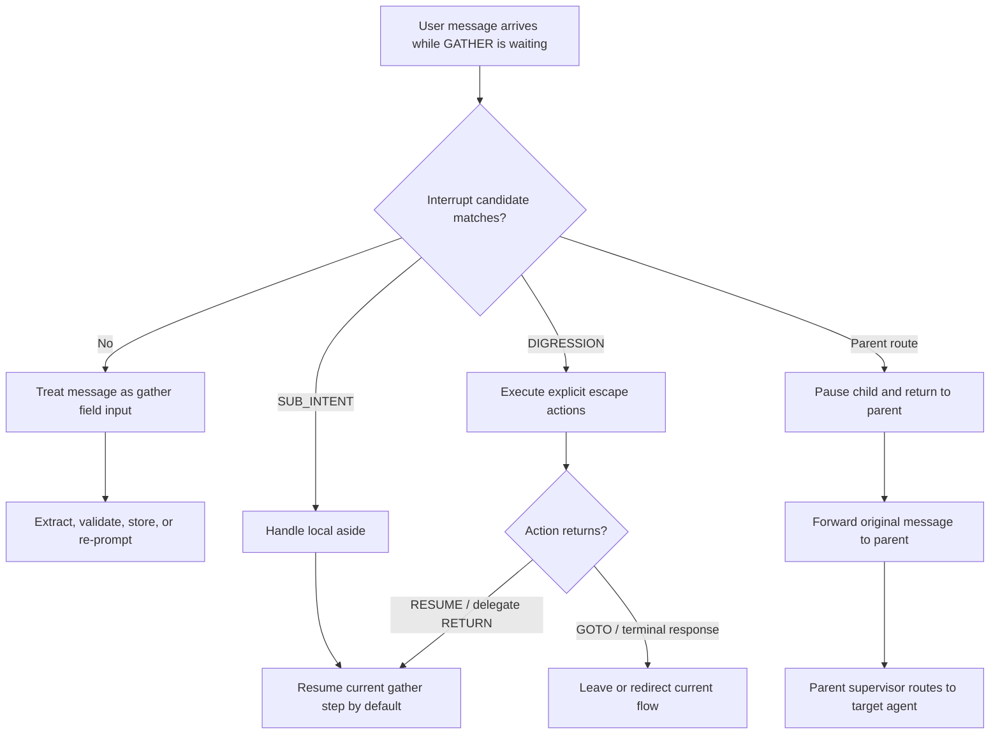
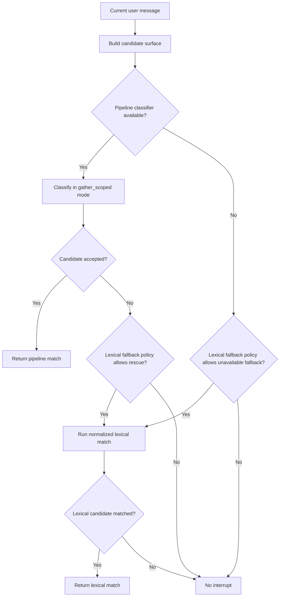
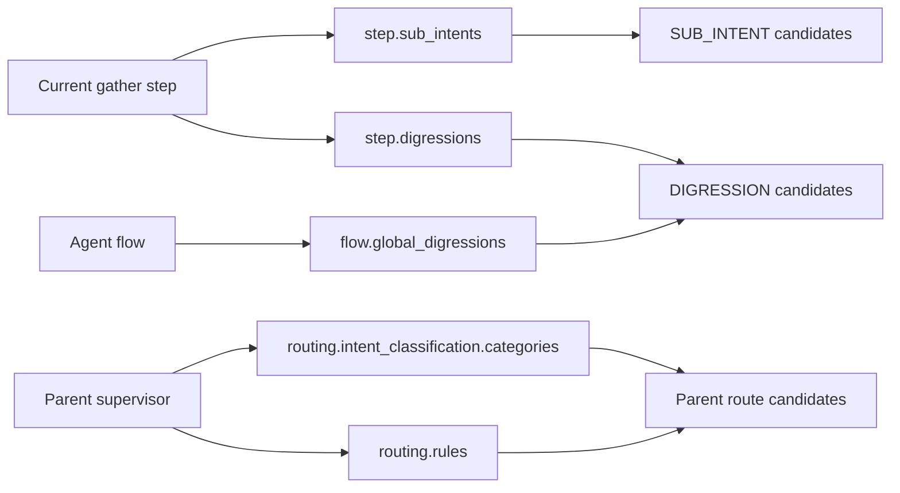
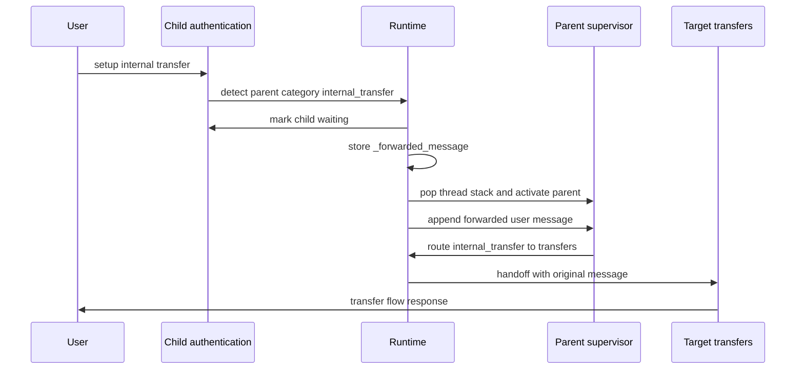
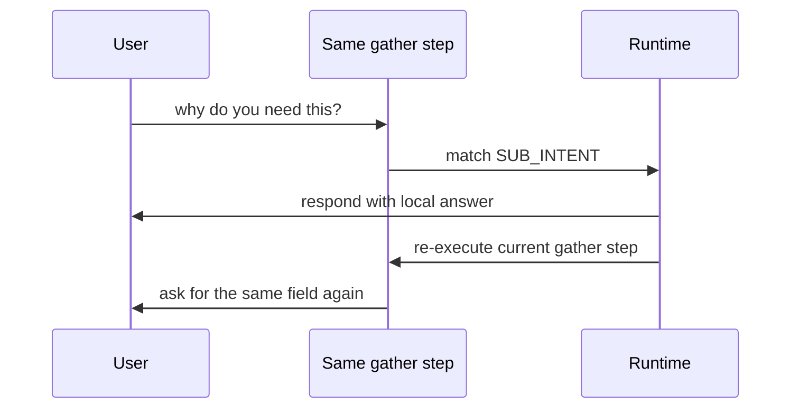
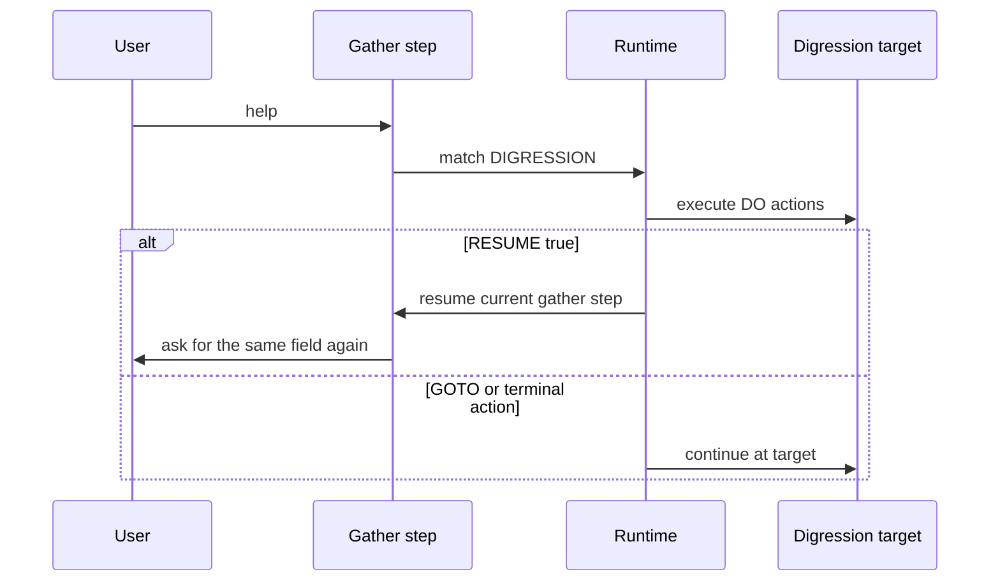
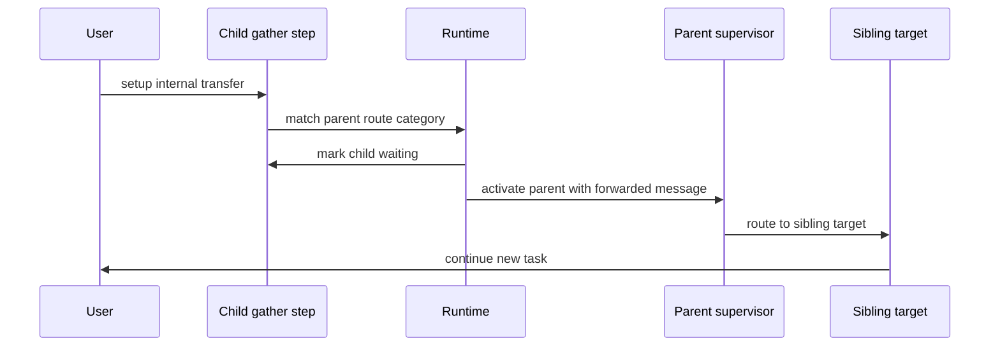
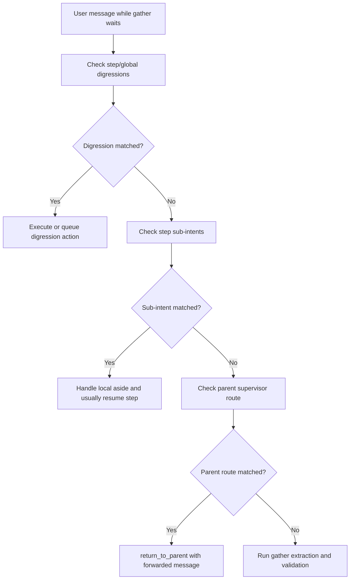
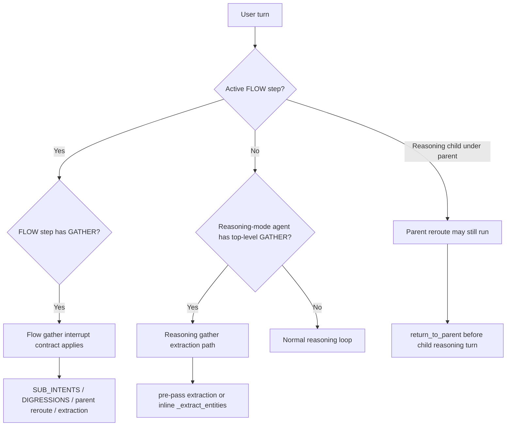

# Gather Interrupt Routing

## Purpose

This document explains how the runtime handles user intent changes while a `GATHER` step is waiting for input. It focuses on the three interrupt surfaces that can run before the user message is treated as field data:

- `SUB_INTENTS`
- `DIGRESSIONS`
- parent-supervisor reroute

It also explains how these differ from `ON_INPUT`, how intent recognition works, and what "return" means for each path.

---

## 1. Mental Model

`GATHER` means the current agent is collecting one or more fields. A user response can be either:

1. field data for the active gather prompt, such as `12345` for `phone_id`
2. a local aside, such as `why do you need this?`
3. an explicit escape, such as `talk to a human`
4. a different parent-level task, such as `setup internal transfer`

The interrupt routing layer exists so cases 2 through 4 are not swallowed as invalid field input.

The most important distinction is support surface:

| Question                                           | Short answer                                                                                                          |
| -------------------------------------------------- | --------------------------------------------------------------------------------------------------------------------- |
| Is interruption supported during `GATHER`?         | Yes, through `SUB_INTENTS`, `DIGRESSIONS`, and parent-supervisor reroute.                                             |
| Is normal `ON_INPUT` the supported interrupt path? | No. `ON_INPUT` mixed with `GATHER` is order-ambiguous and should not be used as the primary interruption mechanism.   |
| Are `SUB_INTENTS` and `DIGRESSIONS` redundant?     | No. They overlap in capability, but differ in authoring intent, scope, and default return behavior.                   |
| Does parent reroute replace digressions?           | No. Parent reroute avoids duplicating parent/sibling routes inside every child flow.                                  |
| Is there a return path?                            | Yes for sub-intents by default, explicit for digressions, and "pause child then return to parent" for parent reroute. |



---

## 2. Normal Gather

A normal gather turn treats the message as data for the field being collected.

```yaml
authentication:
  FLOW:
    ask_phone_id:
      GATHER:
        phone_id:
          TYPE: string
          PROMPT: 'Please enter your Phone ID.'
```

Example:

```text
Bot: Please enter your Phone ID.
User: 12345
Runtime: stores phone_id = 12345
```

This is not an interrupt. The active step remains responsible for extracting and validating the value.

---

## 3. Why ON_INPUT Is Not The Interrupt Mechanism

`ON_INPUT` is legacy branch handling on the same flow step. When a step mixes `GATHER` and `ON_INPUT`, authors must not assume that branch matching runs before gather extraction. The compiler warns about this because branch evaluation and collection share the same step boundary.

Unreliable pattern:

```yaml
ask_phone_id:
  GATHER:
    phone_id:
      TYPE: string
      PROMPT: 'Please enter your Phone ID.'

  ON_INPUT:
    - IF: input contains "branch"
      THEN:
        GOTO: branch_locator
```

Expected by the author:

```text
Bot: Please enter your Phone ID.
User: show me branches near me
Runtime: routes to branch_locator
```

Observed risk:

```text
Bot: Please enter your Phone ID.
User: show me branches near me
Runtime: treats the text as attempted phone_id input
Bot: Please enter your Phone ID.
```

Use `SUB_INTENTS`, `DIGRESSIONS`, or parent-supervisor reroute for gather interruption.

---

## 4. Supported Versus Unsupported During Gather

The following examples show the difference between supported gather interruption and unsupported or unreliable same-step branch handling.

### Supported: Local Aside With SUB_INTENTS

```yaml
ask_phone_id:
  GATHER:
    phone_id:
      TYPE: string
      PROMPT: 'Please enter your Phone ID.'

  SUB_INTENTS:
    - INTENT: why_phone_id
      KEYWORDS: ['why', 'why do you need this']
      RESPOND: 'We use your Phone ID to verify your account.'
```

This is supported because the runtime treats `SUB_INTENTS` as gather escape candidates before field extraction owns the turn.

```text
Bot: Please enter your Phone ID.
User: why do you need this?
Runtime: sub_intent matched
Bot: We use your Phone ID to verify your account.
Bot: Please enter your Phone ID.
```

### Supported: Explicit Escape With DIGRESSIONS

```yaml
ask_phone_id:
  GATHER:
    phone_id:
      TYPE: string
      PROMPT: 'Please enter your Phone ID.'

  DIGRESSIONS:
    - INTENT: cancel_authentication
      KEYWORDS: ['cancel', 'stop']
      DO:
        - GOTO: cancel_flow
```

This is supported because the current flow explicitly declares an escape path.

```text
Bot: Please enter your Phone ID.
User: cancel
Runtime: digression matched
Runtime: moves to cancel_flow
```

### Supported: Top-Level Switch With Parent Reroute

```text
bank_supervisor
  balance_inquiry -> authentication
  internal_transfer -> transfers

authentication
  ask_phone_id GATHER
```

```text
Bot: Please enter your Phone ID.
User: setup internal transfer
Runtime: parent supervisor category internal_transfer matched
Runtime: child returns to parent
Runtime: parent routes to transfers
```

This is supported because the user is not asking authentication for a local aside. They are asking for a sibling task owned by the parent.

### Not Reliable: GATHER Plus ON_INPUT

```yaml
ask_phone_id:
  GATHER:
    phone_id:
      TYPE: string
      PROMPT: 'Please enter your Phone ID.'

  ON_INPUT:
    - IF: input contains "transfer"
      THEN:
        GOTO: transfer_flow
```

This is not the recommended interrupt mechanism because gather extraction and branch evaluation share the same step boundary. The input can be consumed as attempted field data before the branch behaves as the author expected.

---

## 5. Intent Recognition Flow

`SUB_INTENTS` and `DIGRESSIONS` use the same flow-escape matcher. Parent-supervisor reroute uses a sibling matcher that resolves against the parent supervisor's intent categories and routing rules.



Recognition outputs include:

- matched intent or category
- `detectionMode`, usually `pipeline` or `lexical`
- `lexicalMatchType` when lexical fallback wins
- candidate surface kind, such as `sub_intent`, `digression`, or `parent_supervisor_route`
- optional classifier confidence

Lexical fallback is gather-specific and normalized for common variants. For example, an interrupt keyword like `atm` can match `atms` during gather interruption without loosening the shared global intent matcher.

### Candidate Construction By Path



| Path                    | What is classified                         | Where candidates come from                                   | How final target is chosen                                      |
| ----------------------- | ------------------------------------------ | ------------------------------------------------------------ | --------------------------------------------------------------- |
| `SUB_INTENTS`           | step-local side intents                    | current step `SUB_INTENTS`                                   | sub-intent action fields on the same step                       |
| `DIGRESSIONS`           | current-flow escape intents                | current step `DIGRESSIONS` plus `flow.global_digressions`    | explicit digression `DO`, `GOTO`, `DELEGATE`, `CALL`, `RESPOND` |
| Parent-supervisor route | parent-level categories for sibling routes | parent supervisor `INTENTS` categories plus routing `ROUTES` | parent supervisor routing rules                                 |

### Recognition Outcomes

```text
pipeline match:
  semantic classifier accepted a candidate

lexical match:
  normalized gather-only lexical fallback matched a candidate

no match:
  gather extraction proceeds normally

blocked parent route:
  parent category matched, but the target handoff/routing path was not valid
```

---

## 6. SUB_INTENTS

### Purpose

`SUB_INTENTS` are step-scoped local side intents. They are best for an aside that should be handled while staying in the same gather step.

Good examples:

- `why do you need this?`
- `where do I find my Phone ID?`
- `repeat that`
- `I forgot it`
- `what format should I use?`

### Example

```yaml
ask_phone_id:
  GATHER:
    phone_id:
      TYPE: string
      PROMPT: 'Please enter your Phone ID.'

  SUB_INTENTS:
    - INTENT: why_phone_id
      KEYWORDS: ['why', 'why do you need this']
      RESPOND: 'We use your Phone ID to verify your account.'
```

Conversation:

```text
Bot: Please enter your Phone ID.
User: why do you need this?
Runtime: matches sub_intent why_phone_id
Bot: We use your Phone ID to verify your account.
Bot: Please enter your Phone ID.
User: 12345
Runtime: stores phone_id = 12345
```

### Return Behavior

Sub-intents stay in the current step by default. After applying `clear`, `set`, `call`, or `respond`, the runtime re-executes the current gather step unless the authored action produces a terminal result.

Use `SUB_INTENTS` when the user has not really changed tasks. They are asking a local question or making a local correction inside the current step.

---

## 7. DIGRESSIONS

### Purpose

`DIGRESSIONS` are explicit escape hatches owned by the current flow or by global flow configuration. They are best for a known route-level interruption.

Good examples:

- `cancel`
- `start over`
- `talk to an agent`
- `go back`
- `change appointment`
- a known local jump to another step

### Example: Non-returning Digression

```yaml
ask_phone_id:
  GATHER:
    phone_id:
      TYPE: string
      PROMPT: 'Please enter your Phone ID.'

  DIGRESSIONS:
    - INTENT: talk_to_agent
      KEYWORDS: ['agent', 'human', 'representative']
      DO:
        - GOTO: handoff_to_agent
```

Conversation:

```text
Bot: Please enter your Phone ID.
User: talk to a human
Runtime: matches digression talk_to_agent
Runtime: moves currentFlowStep to handoff_to_agent
Bot: Connecting you with an agent.
```

There is no automatic return to `ask_phone_id`.

### Example: Returning Digression

```yaml
ask_phone_id:
  GATHER:
    phone_id:
      TYPE: string
      PROMPT: 'Please enter your Phone ID.'

  DIGRESSIONS:
    - INTENT: help_phone_id
      KEYWORDS: ['help', 'what is this']
      DO:
        - RESPOND: 'Your Phone ID is the 4 to 15 digit identifier on your account.'
        - RESUME: true
```

Conversation:

```text
Bot: Please enter your Phone ID.
User: help
Runtime: matches digression help_phone_id
Bot: Your Phone ID is the 4 to 15 digit identifier on your account.
Bot: Please enter your Phone ID.
```

### Example: Delegating Digression With Return

```yaml
ask_phone_id:
  GATHER:
    phone_id:
      TYPE: string
      PROMPT: 'Please enter your Phone ID.'

  DIGRESSIONS:
    - INTENT: find_branch
      KEYWORDS: ['branch', 'atm', 'near me']
      DO:
        - DELEGATE: branch_locator
          RETURN: true
        - RESUME: true
```

Conversation:

```text
Bot: Please enter your Phone ID.
User: find an ATM near me
Runtime: delegates to branch_locator with RETURN true
Branch Locator: What ZIP code or city should I search near?
User: 33003
Branch Locator: I found the nearest locations...
Runtime: resumes authentication ask_phone_id
Bot: Please enter your Phone ID.
```

### Return Behavior

Digressions return only when the author makes them return. Common return mechanisms are:

- `RESUME: true`
- `DELEGATE ... RETURN: true`
- a `DO` sequence that performs a side effect and then resumes

If the digression uses `GOTO`, it redirects the current flow step. If it delegates without supported return semantics, the runtime treats that as invalid for gather-locked digression handling.

Use `DIGRESSIONS` when the current flow owns the escape rule and the target behavior is explicit.

---

## 8. Are SUB_INTENTS And DIGRESSIONS Redundant?

They are intentionally close, but not redundant.

Both can:

- match user input while `GATHER` is active
- respond to the user
- set or clear values
- call tools
- stop the current message from being treated as field data

They differ in the meaning authors should attach to them.

### SUB_INTENT Means "Handle An Aside Here"

Use a sub-intent when the active gather step still owns the user's task.

```text
Bot: Please enter your Phone ID.
User: where do I find that?
Runtime: this is about the current Phone ID question
Runtime: answer locally and ask for Phone ID again
```

The user has not changed from balance/authentication to a new task. They are still in the same step and need help completing it.

### DIGRESSION Means "Escape Or Redirect From Here"

Use a digression when the current flow owns an explicit interruption path.

```text
Bot: Please enter your Phone ID.
User: talk to a human
Runtime: this is not a Phone ID aside
Runtime: move to handoff_to_agent
```

The user is no longer trying to answer the current gather question.

### Why Not Use SUB_INTENT For Everything?

Sub-intents stay in the current step by default. If authors use sub-intents for route-level task switching, the flow can become misleading: a construct that usually means "resume this step" now means "leave the step." That makes authoring and debugging harder.

### Why Not Use DIGRESSION For Every Aside?

Digressions do not return by default. If authors use digressions for small local help text, they must remember to add `RESUME` or equivalent return semantics. Sub-intents encode that local-aside expectation more clearly.

### Decision Rule

```text
If the user is still trying to complete this gather step:
  use SUB_INTENT

If the user wants to escape this flow or execute a known local route:
  use DIGRESSION

If the user wants a sibling/top-level task owned by the parent:
  use parent-supervisor reroute
```

---

## 9. Is Parent Reroute Redundant With DIGRESSIONS?

No. Parent reroute removes route duplication from child agents.

Without parent reroute, every child gather flow would need to duplicate every sibling intent:

```yaml
authentication:
  FLOW:
    ask_phone_id:
      GATHER:
        phone_id:
          PROMPT: 'Please enter your Phone ID.'

      DIGRESSIONS:
        - INTENT: internal_transfer
          DO:
            - DELEGATE: transfers
              RETURN: false
        - INTENT: branch_locator
          DO:
            - DELEGATE: branch_locator
              RETURN: false
        - INTENT: loan_payment
          DO:
            - DELEGATE: loan_payment
              RETURN: false
```

That is brittle because every child must be updated whenever the supervisor gets a new route.

With parent reroute, the child only needs to recognize that the user's message belongs to the parent. The final route stays centralized in the supervisor:

```text
authentication child:
  "this looks like a parent-level request"

bank_supervisor parent:
  "internal_transfer routes to transfers"
```

That keeps the supervisor as the owner of sibling routing.

---

## 10. Parent-Supervisor Reroute

### Purpose

Parent-supervisor reroute handles a different class of interruption: the user asks for a sibling or top-level task while a child agent is gathering input.

The child should not need to duplicate every parent route as local digressions. Instead, the child pauses and returns the message to the parent supervisor.

### Example Topology

```text
bank_supervisor
  balance_inquiry -> authentication
  branch_locator -> branch_locator
  internal_transfer -> transfers

authentication
  ask_phone_id GATHER
```

Conceptual authoring:

```yaml
bank_supervisor:
  INTENTS:
    CATEGORIES:
      - balance_inquiry
      - branch_locator
      - internal_transfer
    ROUTES:
      balance_inquiry: authentication
      branch_locator: branch_locator
      internal_transfer: transfers

authentication:
  FLOW:
    ask_phone_id:
      GATHER:
        phone_id:
          TYPE: string
          PROMPT: 'Please enter your Phone ID.'
```

Conversation:

```text
User: get balance
bank_supervisor: routes to authentication
authentication: Please enter your Phone ID.
User: setup internal transfer
```

Without parent-supervisor reroute:

```text
authentication: Please enter your Phone ID.
```

With parent-supervisor reroute:

```text
Runtime: authentication detects parent category internal_transfer
Runtime: authentication returns to bank_supervisor
Runtime: forwards "setup internal transfer" to bank_supervisor
bank_supervisor: routes to transfers
transfers: I can help set up an internal transfer. Which account should the money come from?
```

### Return Mechanism

Parent-supervisor reroute uses `return_to_parent`.

The runtime does the following:

1. verifies that the active child thread has `returnExpected` and a parent in `threadStack`
2. marks the child thread as `waiting`, not completed
3. stores the original user message as `_forwarded_message`
4. emits a `return_to_parent` trace
5. pops the parent thread from the stack
6. makes the parent thread active
7. appends the forwarded message to the parent conversation history
8. either reruns parent routing with the forwarded message or directly hands off to the resolved target



### Does It Return To The Child?

Not automatically.

Parent reroute pauses the child so it can be resumed later, but the immediate action is to switch control back to the parent and then to the target route. If the user later returns to the original task, the supervisor must route them back or resume the waiting child through normal orchestration.

Use parent-supervisor reroute when the input belongs to a sibling or top-level supervisor intent, not to the current child flow.

---

## 11. Return Semantics Across All Paths

The word "return" means different things depending on the path.

| Path                    | What returns?                                        | Default behavior                       | How to change it                                              |
| ----------------------- | ---------------------------------------------------- | -------------------------------------- | ------------------------------------------------------------- |
| `SUB_INTENTS`           | control returns to the same gather step              | resumes current step                   | author terminal response or action if the step should stop    |
| `DIGRESSIONS`           | control may return to the same flow step             | no automatic return                    | add `RESUME`, delegate with `RETURN`, or explicit flow action |
| Parent-supervisor route | child returns control to parent; parent routes again | child is paused, parent becomes active | supervisor later routes back/resumes child if needed          |
| `ON_INPUT`              | no special gather return contract                    | same-step branch behavior is ambiguous | use interrupt surfaces instead                                |

### Sub-Intent Return Flow



### Digression Return Flow



### Parent Route Return Flow



The child is resumable, but the parent route does not automatically come back to it.

---

## 12. Recognition Candidate Sources

| Path                     | Candidate source                                              | Candidate surface kind       | Typical action                         | Default return behavior                  |
| ------------------------ | ------------------------------------------------------------- | ---------------------------- | -------------------------------------- | ---------------------------------------- |
| `SUB_INTENTS`            | `step.sub_intents`                                            | `sub_intent`                 | `respond`, `set`, `clear`, `call`      | Resume current gather step               |
| `DIGRESSIONS`            | `step.digressions` plus `flow.global_digressions`             | `digression`                 | `respond`, `goto`, `delegate`, `call`  | No automatic return unless authored      |
| Parent-supervisor route  | parent `routing.intent_classification.categories` and `rules` | `parent_supervisor_route`    | `return_to_parent`, then parent route  | Pauses child; no automatic child resume  |
| `ON_INPUT` with `GATHER` | current step `on_input` branches                              | not the gather interrupt API | branch if evaluated at the right point | Ambiguous; avoid for gather interruption |

---

## 13. Routing Order In A Gather Turn

The runtime has multiple gather execution modes, including immediate and deferred interrupt handling. The conceptual order is:



Some deferred gather paths queue digressions or parent routes as pending intents so the runtime can preserve gather-lock semantics and process the interrupt after the current step boundary. In both immediate and deferred paths, the matched intent and original user message are preserved.

---

## 14. End-To-End Scenario Matrix

### Scenario A: Valid Gather Input

```text
Bot: Please enter your Phone ID.
User: 12345
Recognition: no interrupt candidate matches
Routing: gather extraction
Return: not applicable
Result: phone_id stored
```

### Scenario B: Local Help During Gather

```text
Bot: Please enter your Phone ID.
User: where do I find it?
Recognition: SUB_INTENT why_phone_id / find_phone_id
Routing: same gather step handles response
Return: automatic same-step resume
Result: bot answers help text, then asks for Phone ID again
```

### Scenario C: Explicit Escape From Current Flow

```text
Bot: Please enter your Phone ID.
User: talk to an agent
Recognition: DIGRESSION talk_to_agent
Routing: digression DO action, such as GOTO handoff_to_agent
Return: none unless RESUME or delegate RETURN is authored
Result: flow moves to handoff
```

### Scenario D: Temporary Side Task, Then Resume

```text
Bot: Please enter your Phone ID.
User: find a nearby branch first
Recognition: DIGRESSION find_branch
Routing: delegate branch_locator with RETURN true, then RESUME
Return: explicit
Result: branch lookup completes, then Phone ID gather resumes
```

### Scenario E: Sibling Task Owned By Parent

```text
Bot: Please enter your Phone ID.
User: setup internal transfer
Recognition: parent-supervisor route internal_transfer
Routing: return_to_parent, parent routes to transfers
Return: child paused, parent active; no automatic child resume
Result: transfer agent owns the next turn
```

### Scenario F: ON_INPUT Attempt Inside Gather

```text
Bot: Please enter your Phone ID.
User: setup internal transfer
Recognition: ON_INPUT may not run before gather extraction
Routing: ambiguous same-step behavior
Return: no special interrupt return
Result: avoid this pattern; use parent-supervisor reroute or digression
```

---

## 15. Choosing The Right Mechanism

Use `SUB_INTENTS` for local side questions that should keep the user in the same gather step.

```text
why do you need this?
where do I find it?
repeat that
what format should I use?
```

Use `DIGRESSIONS` for explicit current-flow escape behavior.

```text
cancel
start over
talk to an agent
go back
find a branch, then resume authentication
```

Use parent-supervisor reroute for a sibling or top-level task owned by the parent.

```text
setup internal transfer
find atm branches near me
open a new account
make a loan payment
```

Avoid using `ON_INPUT` as the main interruption mechanism inside `GATHER`.

---

## 16. Debugging And Trace Expectations

Useful trace event types:

- `digression`
- `sub_intent`
- `return_to_parent`
- pipeline classifier events
- warning events for duplicate sub-intent labels or routing failures

Useful fields:

- `agentName`
- `stepName`
- `intent`
- `matched`
- `action`
- `target`
- `detectionMode`
- `lexicalMatchType`
- `classifierConfidence`
- `rerouteError`

Example trace shape for parent reroute:

```json
{
  "type": "digression",
  "data": {
    "agentName": "authentication",
    "stepName": "ask_phone_id",
    "intent": "internal_transfer",
    "matched": "setup internal transfer",
    "detectionMode": "pipeline",
    "action": "return_to_parent",
    "target": "transfers"
  }
}
```

Example trace shape for sub-intent:

```json
{
  "type": "sub_intent",
  "data": {
    "agentName": "authentication",
    "stepName": "ask_phone_id",
    "intent": "why_phone_id",
    "matched": "why do you need this?",
    "detectionMode": "lexical",
    "lexicalMatchType": "normalized"
  }
}
```

---

## 17. Question Checklist

This section maps the recurring design questions to the expected answer.

### Is Interruption Handling Supported In Gather?

Yes, but only through the gather interrupt contract:

- `SUB_INTENTS`
- `DIGRESSIONS`
- parent-supervisor reroute

Do not treat plain `ON_INPUT` as the reliable gather-interrupt path.

### Is Sub-Intent Supported In Gather?

Yes. `SUB_INTENTS` are explicitly scoped to the current step and are evaluated as gather escape candidates. They are intended for local side handling that usually returns to the same gather step.

### How Is Parent Reroute Different From Digression?

Digression is authored by the current child flow. Parent reroute is resolved by the parent supervisor's intent categories and routing rules.

```text
digression:
  child says "for this local escape, go here"

parent reroute:
  child says "this belongs to my parent"
  parent says "this category routes to that sibling"
```

### How Is Sub-Intent Different From Digression?

Sub-intent means "handle this local aside here and resume." Digression means "escape or redirect from here." Both can technically perform overlapping actions, but they communicate different authoring intent and have different default return behavior.

### Is Parent Reroute Redundant?

No. It prevents every child gather flow from duplicating the parent's sibling route table.

### What Is The Parent Return Mechanism?

The child calls `return_to_parent`. Runtime marks the child thread `waiting`, stores `_forwarded_message`, pops the parent from `threadStack`, activates the parent, appends the forwarded message to parent history, and routes from the parent.

### What Recognizes Intent From The Input?

`SUB_INTENTS` and `DIGRESSIONS` use the flow-escape matcher over step/global candidates. Parent reroute uses parent supervisor categories and routing rules. Both prefer the pipeline classifier when available and fall back to normalized lexical matching according to `LEXICAL_FALLBACK` policy.

---

## 18. Practical Summary

`SUB_INTENT` is a local aside. It returns to the same gather step by default.

`DIGRESSION` is an explicit escape hatch. It returns only if the author adds return semantics such as `RESUME` or delegate `RETURN`.

Parent-supervisor reroute is a parent-level task switch. It pauses the child, forwards the original message to the parent, and lets the parent route to the correct target. It does not automatically resume the child afterward.

`ON_INPUT` is not the reliable tool for gather interruption because it shares the step boundary with field collection.

---

## 19. Scope By Execution Mode

The gather interrupt contract in this document is primarily a **flow-step gather** contract. Do not apply every section to reasoning-mode gather without checking which executor owns the turn.



### Flow-Step Gather

This is the main scope of this document.

```yaml
authentication:
  FLOW:
    ask_phone_id:
      GATHER:
        phone_id:
          PROMPT: 'Please enter your Phone ID.'
      SUB_INTENTS:
        - INTENT: why_phone_id
          RESPOND: 'We use it to verify your account.'
      DIGRESSIONS:
        - INTENT: talk_to_agent
          DO:
            - GOTO: handoff_to_agent
```

While this step is waiting for input, the runtime can evaluate:

1. step and global `DIGRESSIONS`
2. step `SUB_INTENTS`
3. parent-supervisor reroute
4. gather extraction and validation

This applies to non-reasoning scripted flow agents because they use the flow-step executor for `FLOW` execution.

### Flow Step With reasoning_zone

A flow step may also contain a `reasoning_zone`. If that same step has `GATHER`, the gather turn still owns collection first. The flow-step gather interrupt contract applies while gather is active, and reasoning-zone work should run only after gather no longer owns the turn.

Conceptually:

```text
user message
-> flow gather interrupt checks
-> gather extraction / validation
-> reasoning_zone only when gather is no longer waiting on that turn
```

### Top-Level Reasoning Gather

Top-level reasoning gather is different. It is not a flow step with `SUB_INTENTS` or step-local `DIGRESSIONS`.

Reasoning gather uses the reasoning executor:

```text
user message
-> non-inline pre-pass extraction
or
-> inline _extract_entities tool inside reasoning loop
-> normal reasoning loop
```

Example:

```yaml
travel_agent:
  GATHER:
    destination:
      TYPE: string
      PROMPT: 'Where do you want to go?'
  SETTINGS:
    INLINE_GATHER: true
```

In this mode:

- `SUB_INTENTS` from a flow step do not apply because there is no current flow step.
- step `DIGRESSIONS` do not apply because there is no flow step.
- interruption behavior must be modeled through reasoning tools, prompt behavior, top-level routing, or parent-supervisor orchestration.

### Active Reasoning Child Under A Parent Supervisor

A reasoning child can still participate in parent-supervisor reroute.

Example:

```text
bank_supervisor -> reasoning_child_agent

User: setup internal transfer
Runtime: detects parent category before the child reasoning turn
Runtime: return_to_parent
Runtime: parent routes to transfers
```

This is only the parent reroute portion of the contract. It does not make flow-only constructs such as `step.sub_intents` or step `DIGRESSIONS` available to a reasoning child.

### Mode Matrix

| Mode / active owner                        | `SUB_INTENTS` | `DIGRESSIONS` | Parent reroute | Gather extraction style                         |
| ------------------------------------------ | ------------- | ------------- | -------------- | ----------------------------------------------- |
| Flow-step `GATHER`                         | Yes           | Yes           | Yes            | flow-step extraction and validation             |
| Non-reasoning scripted flow                | Yes           | Yes           | Yes            | flow-step extraction and validation             |
| Flow step with `reasoning_zone` and GATHER | Yes           | Yes           | Yes            | gather owns the turn before reasoning-zone work |
| Top-level reasoning `GATHER`, non-inline   | No            | No            | Parent only    | pre-pass extraction before reasoning loop       |
| Top-level reasoning `GATHER`, inline       | No            | No            | Parent only    | `_extract_entities` tool inside reasoning loop  |
| Active reasoning child under parent        | No            | No            | Yes            | reasoning loop unless parent reroute wins first |
| Normal reasoning loop without gather       | No            | No            | Possible child | no gather extraction                            |

### Practical Rule

If the current turn is owned by `FlowStepExecutor` and the active `FLOW` step has `GATHER`, use this document's full interrupt model.

If the current turn is owned by `ReasoningExecutor`, use reasoning gather semantics. Parent reroute may still happen, but `SUB_INTENTS` and step `DIGRESSIONS` are not the mechanism unless the agent is actually executing a flow step.
