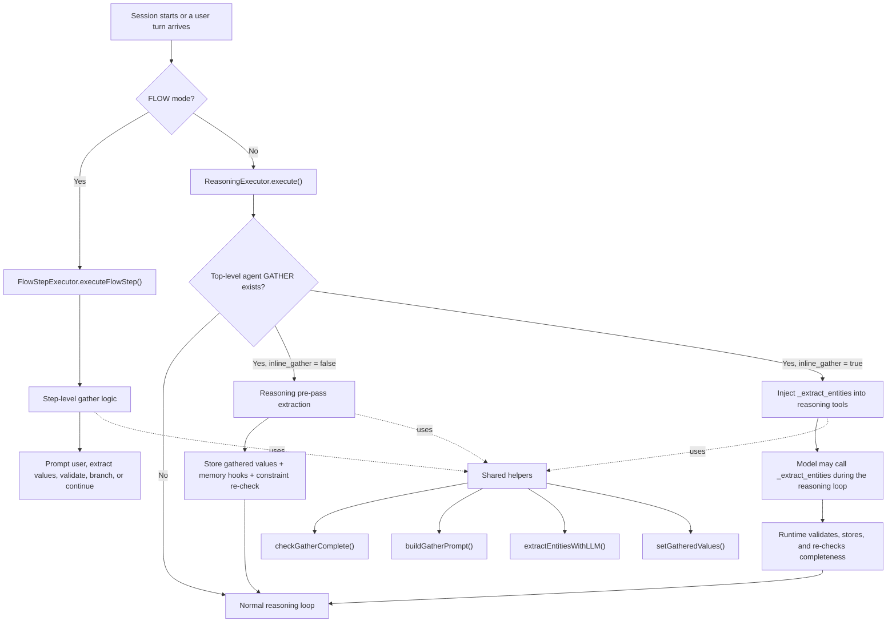
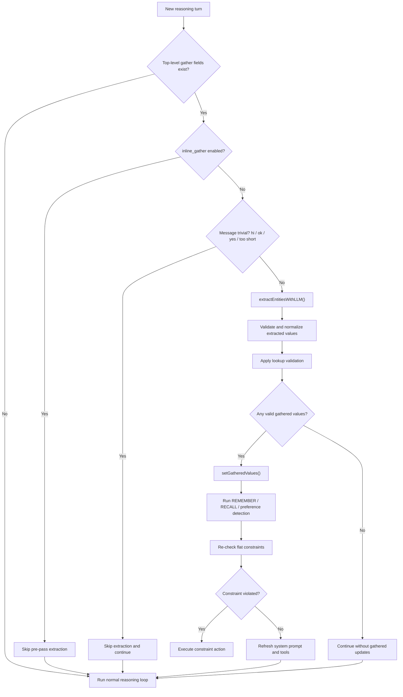
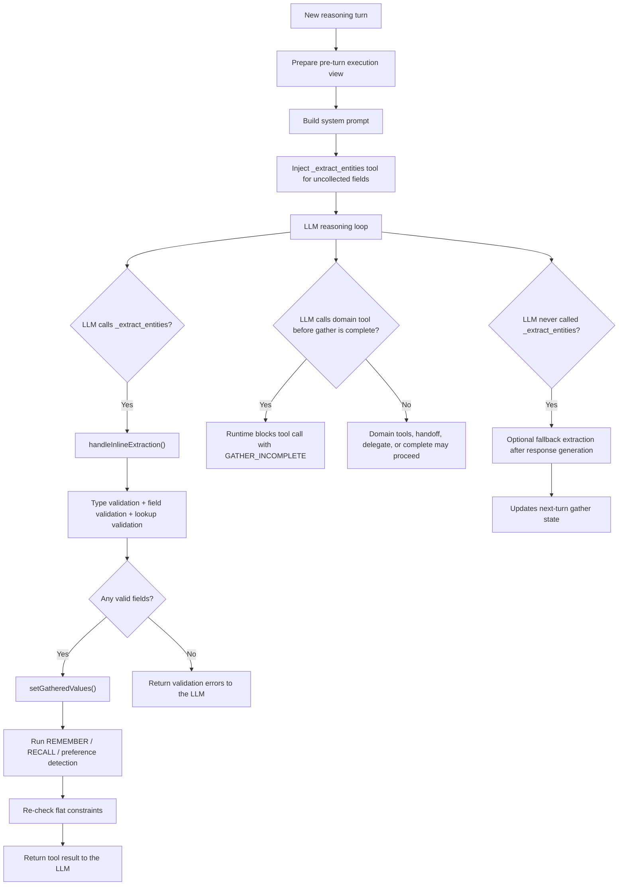
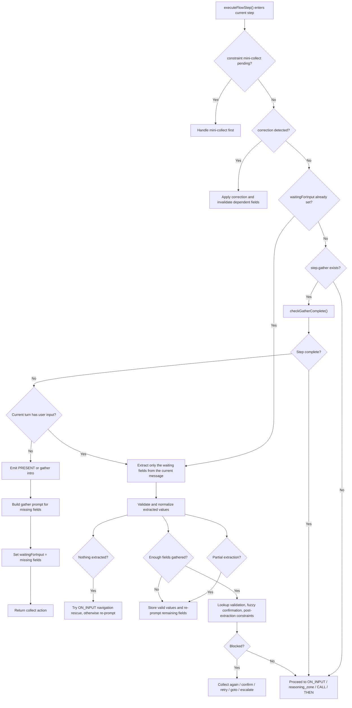
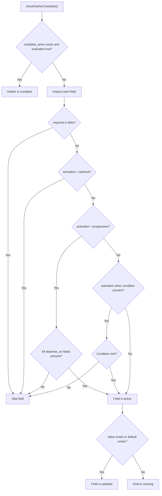
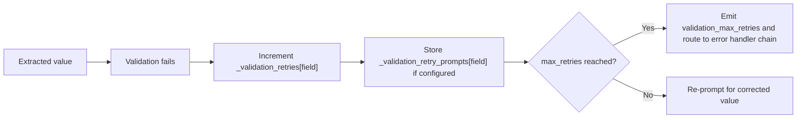
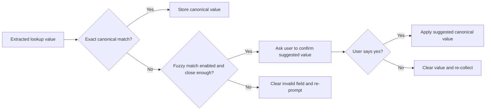
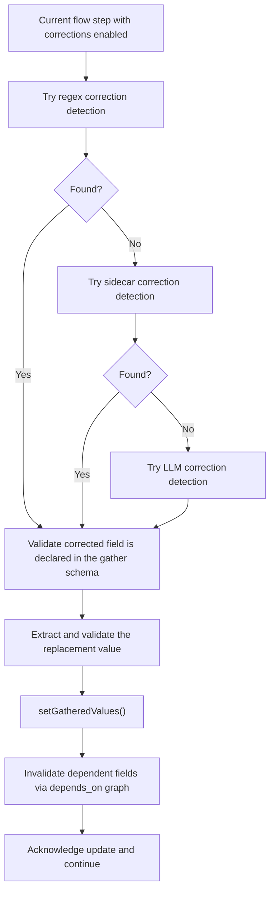
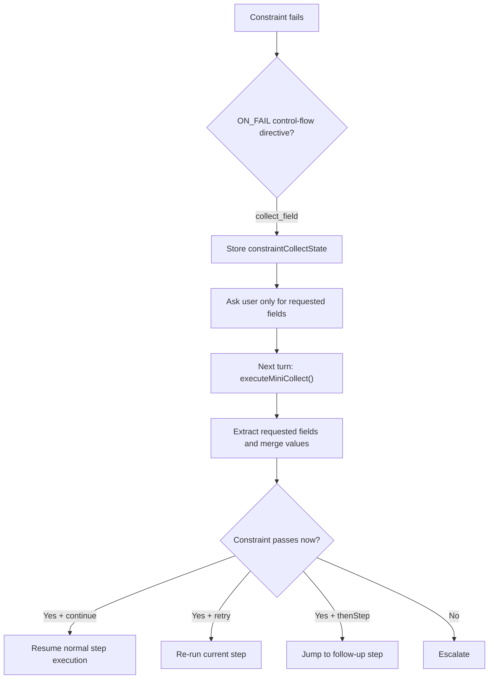

# Gather Trigger Flow

## Purpose

This document explains how Gather is triggered in the runtime, what happens after it starts, and how the major branches differ between reasoning-mode agents and flow-mode agents.

For the separate interrupt-routing contract that runs while a flow `GATHER` step is waiting for input, including the differences from reasoning-mode gather, see [Gather Interrupt Routing](GATHER_INTERRUPT_ROUTING.md).

It covers:

- top-level reasoning gather
- inline gather via `_extract_entities`
- flow-step gather inside `FLOW` steps
- validation retry loops
- lookup-table validation and fuzzy confirmation
- correction handling
- constraint-driven mini-collect
- the shared completeness rules that decide whether Gather is done

---

## 1. System Context

Gather is not one single executor in production. It is a set of runtime paths that share extraction, completeness, validation, and prompt-building helpers.

### Main runtime owners

- `apps/runtime/src/services/runtime-executor.ts`
- `apps/runtime/src/services/execution/reasoning-executor.ts`
- `apps/runtime/src/services/execution/flow-step-executor.ts`
- `packages/compiler/src/platform/constructs/utils.ts`
- `packages/compiler/src/platform/constructs/executors/gather-executor.ts`

---

## 2. Trigger Matrix

| Trigger surface                                         | When it fires                               | Owner                                                                         | What it does                                                                      |
| ------------------------------------------------------- | ------------------------------------------- | ----------------------------------------------------------------------------- | --------------------------------------------------------------------------------- |
| Session initialization into a flow entry step           | Before the user answers anything            | `RuntimeExecutor.initializeSession()` -> `FlowStepExecutor.executeFlowStep()` | Emits the first gather prompt for the entry step if the step is incomplete        |
| New user turn in reasoning mode with top-level `GATHER` | Every reasoning turn                        | `ReasoningExecutor.execute()`                                                 | Either runs pre-pass extraction or injects inline extraction tooling              |
| New user turn while a flow step is waiting for fields   | On the next turn after a gather prompt      | `FlowStepExecutor.executeFlowStep()`                                          | Extracts the specific waiting fields and decides whether to re-prompt or continue |
| Constraint violation with `collect_field` directive     | After a constraint fails                    | `FlowStepExecutor.handleConstraintControlFlow()`                              | Starts a mini-collect cycle for just the requested fields                         |
| Correction utterance like "actually Paris"              | During a flow step with `corrections: true` | `FlowStepExecutor.executeFlowStep()`                                          | Rewrites a previously gathered field and may invalidate dependent fields          |
| Lookup fuzzy confirmation                               | After lookup validation finds a near match  | `FlowStepExecutor.executeFlowStep()`                                          | Asks the user to confirm the suggested canonical value                            |

---

## 3. Reasoning Gather

### 3.1 Non-inline reasoning gather

When an agent has top-level `GATHER` fields and `inline_gather` is not enabled, the runtime does a pre-pass extraction from the latest user message before the main reasoning loop starts.

### What the model sees

In non-inline mode the system prompt still tells the model which fields exist and includes gathered progress, but the model is not forced to call a special gather tool. The runtime has already attempted extraction before the reasoning loop begins.

### Example

User says:

> I want to fly to Paris on March 15th.

Possible runtime result before reasoning begins:

- `destination = "Paris"`
- `travel_date = "2026-03-15"`

Then the reasoning agent continues with the main task, such as searching flights or asking for still-missing fields.

---

## 4. Inline Gather

When `inline_gather` is enabled, the runtime exposes `_extract_entities` as a real tool during the reasoning loop and updates the prompt with a live "already collected / still needed" block.

### Important behavior

- `_extract_entities` marks every field optional in the tool schema. Completeness is checked by runtime code, not by the tool schema itself.
- The runtime removes `_extract_entities` from the tool list once every gather field is collected.
- If the model tries to call a normal domain tool before required fields are complete, the runtime returns a `GATHER_INCOMPLETE` error and tells the model to gather first.

### Example

User says:

> Leaving from lax.

If the field is tied to a lookup table containing `LAX` and `JFK`, inline gather can:

- expose those canonical values in the `_extract_entities` schema
- accept `lax`
- canonicalize it to `LAX`
- keep asking for the next required field if origin alone is not enough

---

## 5. Flow-Step Gather

Flow-step gather is the strongest and most explicit gather path. It parks the session on a step until the step is complete.

### First-entry behavior

If initialization lands on a flow step with incomplete gather fields, the runtime can trigger Gather before the user says anything. It emits the intro and gather prompt during session initialization.

### Example

Step:

- `name`
- `address`
- `city`

Turn flow:

1. Session enters the step.
2. Runtime emits: "Please provide your name, address, and city."
3. User replies: "221B Baker Street."
4. Runtime extracts `address` only.
5. Runtime stores `address` and re-prompts only for `name` and `city`.

---

## 6. Shared Completeness Rules

All gather paths ultimately rely on the same completeness logic.

### Hidden but important rules

- `required` defaults to `true`.
- A field with `default` does not count as missing.
- `activation: optional` means "never block completion."
- `activation: progressive` means "only become required after dependencies are present."
- `activation: { when: ... }` means "become required only when that condition evaluates true."
- `complete_when` can short-circuit normal per-field checking.

### Example

If:

- `trip_type` is required
- `return_date` has `activation: { when: "trip_type == 'roundtrip'" }`

Then:

- one-way travel skips `return_date`
- roundtrip travel activates `return_date` and makes it required

---

## 7. Special Branches

### 7.1 Validation retry

When extracted values fail validation, the runtime records retry metadata and re-prompts the user with the field-specific retry prompt if available.

Example:

- field: `email`
- invalid input: `not-an-email`
- retry prompt: `Please enter a valid email address like user@example.com`

The next gather prompt uses the retry prompt instead of a generic "Please provide email."

### 7.2 Lookup validation and fuzzy confirmation

After extraction, lookup-backed fields are validated against merged agent-level and project-level lookup tables.

Example:

- user says `laxx`
- lookup table knows `LAX`
- runtime asks: `Did you mean "LAX" for origin?`

### 7.3 Correction handling

Flow steps with `corrections: true` can reinterpret the user's message as an update to a previously gathered field.

Example:

- stored value: `destination = London`
- user says: `actually Paris`
- runtime updates `destination = Paris`
- if `hotel_region` depends on `destination`, it is cleared and must be recollected

### 7.4 Constraint-driven mini-collect

Constraints can temporarily trigger a focused gather cycle even outside the normal gather prompt flow.

Example:

- constraint: `num_guests <= 10`
- violation action: `collect_field: num_guests`
- runtime asks only for `num_guests`
- user says `15 guests`
- constraint still fails
- runtime escalates

---

## 8. Extraction Strategy Details

The shared extractor can take different paths depending on field strategy and project runtime configuration.

| Strategy                 | What happens                                                                       |
| ------------------------ | ---------------------------------------------------------------------------------- |
| `pattern`                | Regex-only extraction for the field                                                |
| `hybrid`                 | JS libs, optional NLU sidecar, then LLM, with regex fallback if the LLM call fails |
| `llm`                    | Skip pre-LLM helpers and use only the LLM path                                     |
| Project `ml` mode        | Use JS libs and sidecar tiers only, no LLM extraction                              |
| No `llmClient` available | Use JS libs and regex fallback only                                                |

### Why this matters

This is why two gather fields in the same step can behave differently:

- `date` may be resolved by chrono-style JS parsing
- `airport` may be canonicalized by lookup-table guidance in the LLM tool schema
- a pattern-only OTP field may never touch the LLM at all

---

## 9. Prompt-Shaping Effects

Gather changes the prompt even when it does not directly emit a user-visible collect action.

### Non-inline reasoning mode

The system prompt can include:

- declared gather fields
- current gather progress
- validation errors from previous failed attempts

This nudges the LLM to keep collecting missing information naturally.

### Inline gather mode

The system prompt additionally includes:

- instructions to call `_extract_entities`
- `Already collected`
- `Still needed`

This gives the LLM an explicit gather tool and a live gather state snapshot.

---

## 10. End-to-End Examples

### Example A: Reasoning gather, non-inline

User:

> I want to visit Rome next Tuesday.

Flow:

1. Pre-pass extraction runs before reasoning.
2. Runtime stores `destination = Rome`.
3. Runtime normalizes `travel_date` if it can.
4. Main reasoning loop continues with search or follow-up questions.

### Example B: Inline gather with domain tool gating

User:

> Show me hotels in Tokyo.

Flow:

1. Runtime injects `_extract_entities`.
2. LLM extracts `destination = Tokyo`.
3. If `check_in_date` is still required, the runtime blocks hotel search until it is gathered.
4. Once the date is collected, the hotel tool can run.

### Example C: Flow-step gather across multiple turns

Step requires:

- `first_name`
- `last_name`
- `email`

Conversation:

1. Runtime prompts for all three.
2. User says: `John Smith`.
3. Runtime stores `first_name` and `last_name`.
4. Runtime re-prompts only for `email`.
5. User says: `john@company.com`.
6. Step becomes complete and continues.

### Example D: Flow correction with dependency invalidation

State:

- `destination = London`
- `hotel_region = Central London`

Conversation:

1. User says: `actually Paris`
2. Runtime updates `destination`
3. Runtime clears `hotel_region` because it depends on `destination`
4. Runtime asks for the region again

### Example E: Constraint mini-collect

State:

- card replacement flow requires a verification code before continuing

Conversation:

1. Constraint fails because `verification_code` is not set
2. Runtime stores `constraintCollectState.fields = ['verification_code']`
3. Runtime asks only for the code
4. User replies with the code
5. Constraint passes and the runtime jumps to the verification step

---

## 11. Source Map

Use these files when changing gather behavior:

- `apps/runtime/src/services/runtime-executor.ts`
- `apps/runtime/src/services/execution/reasoning-executor.ts`
- `apps/runtime/src/services/execution/flow-step-executor.ts`
- `apps/runtime/src/services/execution/prompt-builder.ts`
- `apps/runtime/src/services/execution/gather-utils.ts`
- `apps/runtime/src/services/execution/constraint-checker.ts`
- `apps/runtime/src/services/execution/types.ts`
- `packages/compiler/src/platform/constructs/utils.ts`
- `packages/compiler/src/platform/constructs/executors/gather-executor.ts`
- `packages/shared/src/prompts/prompt-catalog.ts`

Representative tests:

- `apps/runtime/src/__tests__/execution/reasoning-gather-handoff.test.ts`
- `apps/runtime/src/__tests__/execution/gather-parity.test.ts`
- `apps/runtime/src/__tests__/execution/flow-gather-oninput.test.ts`
- `apps/runtime/src/__tests__/execution/validation-retry.test.ts`
- `apps/runtime/src/__tests__/execution/flow-constraint-minicollect.test.ts`
- `apps/runtime/src/__tests__/execution/flow-correction-chain.test.ts`

---

## 12. Takeaways

- Gather is triggered from both reasoning mode and flow mode, but the control style is different.
- Inline gather is a live tool-mediated loop; flow gather is a state-machine stop-and-collect loop.
- Validation, lookup normalization, fuzzy confirmation, corrections, and constraint mini-collect can all make Gather "wake up" even when the agent is already mid-conversation.
- The shared completeness rules are the hidden center of the whole system.
