# Attachment Pipeline & Search AI Integration Design

**Date**: 2026-02-21
**Status**: Draft
**Authors**: Prasanna Arikala, Claude
**Scope**: Runtime attachment handling, multimodal LLM support, Search AI integration, KB source extensions
**Related**: [Centralized Auth Design](2026-02-22-centralized-auth-design.md) — discriminated auth context, session ownership middleware, user-level data isolation

---

## Table of Contents

1. [Overview](#1-overview)
2. [Requirements](#2-requirements)
3. [Architecture Overview](#3-architecture-overview)
4. [Data Models](#4-data-models)
5. [Storage Provider Layer](#5-storage-provider-layer)
6. [Security Layer](#6-security-layer)
7. [Processing Pipeline](#7-processing-pipeline)
8. [Engine Integration](#8-engine-integration)
9. [Search AI Integration](#9-search-ai-integration)
10. [Knowledge Base Source Extensions](#10-knowledge-base-source-extensions)
11. [API Endpoints](#11-api-endpoints)
12. [Channel Integration](#12-channel-integration)
13. [Integration Points & Boundaries](#13-integration-points--boundaries)
14. [Library & Service Evaluation](#14-library--service-evaluation)
15. [Codebase Structure](#15-codebase-structure)
16. [Testing Strategy](#16-testing-strategy)
17. [Deployment & Configuration](#17-deployment--configuration)
18. [Migration & Rollout](#18-migration--rollout)

---

## 1. Overview

### Problem

The ABL platform currently handles text-only messages. Users cannot send images, documents, audio, or video through any channel. The runtime engine, message storage, and LLM integration all treat `content` as a plain string. The existing REST chat endpoint has a partially-defined multimodal schema (`image_url` in content blocks) but it's converted to `JSON.stringify()` before processing, losing type information.

### Solution

Build an **Attachment Service** that handles the full lifecycle of file attachments (upload, store, scan, transform, index) across all channels, and integrates with both the runtime engine (for multimodal LLM calls) and the existing Search AI platform (for semantic retrieval).

### Design Principles

1. **Engine stays lean** — The runtime engine learns about `ImageContent` blocks only. All other attachment types are pre-processed to text before reaching the engine.
2. **Feed into existing Search AI** — Attachment content enters the existing `apps/search-ai/` ingestion pipeline. No parallel search infrastructure.
3. **Pluggable providers** — Every external dependency (storage, scanning, parsing, transcription, video) is behind an interface with multiple implementations.
4. **Async processing** — Uploads return immediately. Scanning, transformation, and indexing happen asynchronously via BullMQ jobs.
5. **Tenant isolation** — Every attachment, storage path, and search query is tenant-scoped at the query level.
6. **Shared processing, separate models** — Session attachments (`Attachment` model) and KB file uploads (`SearchDocument` model) are separate domain concepts with different lifecycles, but share the same `StorageProvider`, `ScanProvider`, `DocumentParser`, and processing infrastructure. No duplicate file-handling code.

### Current State: Search AI File Upload Gap

The existing Search AI system (`apps/search-ai/`) has **no real file upload capability**:

- The Studio UI only accepts **pasted text** (no file picker)
- The ingestion endpoint receives JSON `{ title, rawText }`, not binary files
- `SearchDocument.extractedText` stores pre-extracted text directly
- The extraction worker is a stub — it reads already-provided text
- PDF and DOCX extractors throw "not implemented" errors
- There is **zero file storage** (no S3, filesystem, or blob references)

This design closes that gap by making the attachment pipeline's file handling infrastructure reusable for KB file uploads. The `SearchDocument` model is extended with optional file storage references, and the same `StorageProvider` → `ScanProvider` → `DocumentParser` chain serves both session attachments and KB uploads.

### Key Constraints

- Maximum file size: configurable per tenant (default 25 MB, ceiling 100 MB)
- Supported categories: images, documents, audio, video
- Storage: pluggable (S3, GCS, Azure Blob, MinIO, GridFS, local)
- Search: pluggable via existing `VectorStoreProvider` and `EmbeddingProvider` interfaces
- Zero changes to the existing Search AI pipeline core — only extend provider implementations and add a new source type

---

## 2. Requirements

### Functional

| ID  | Requirement                                                                                             |
| --- | ------------------------------------------------------------------------------------------------------- |
| F1  | Users can upload files (images, documents, audio, video) via any channel                                |
| F2  | Files are stored securely in pluggable object storage                                                   |
| F3  | Files are virus-scanned before processing                                                               |
| F4  | Images are passed as native vision content blocks to LLMs                                               |
| F5  | Documents are parsed to text (PDF, DOCX, XLSX, TXT, CSV, HTML)                                          |
| F6  | Audio is transcribed to text                                                                            |
| F7  | Video is decomposed to audio transcript + key frame descriptions                                        |
| F8  | Processed content is indexed in the existing Search AI pipeline for semantic retrieval                  |
| F9  | Agents can search attachments via existing `search_vector`/`search_structured` tools                    |
| F10 | Agents can retrieve attachment metadata and content via `get_attachment` / `list_attachments` tools     |
| F11 | Two upload flows: pre-upload (separate endpoint) and inline (multipart with message)                    |
| F12 | Retention is configurable per attachment category                                                       |
| F13 | Session deletion cascades to attachment deletion (files + metadata + search vectors)                    |
| F14 | KB admins can configure sources: uploads, web crawling, connectors (Confluence, Notion, etc.), API push |

### Non-Functional

| ID  | Requirement                                                      |
| --- | ---------------------------------------------------------------- |
| NF1 | Uploads must not block message processing (async pipeline)       |
| NF2 | Files are streamed to storage (never fully buffered in memory)   |
| NF3 | Per-tenant rate limiting on uploads (rate, count, total storage) |
| NF4 | Encryption at rest for stored files (tenant-scoped DEK)          |
| NF5 | SSRF protection on URL-referenced attachments                    |
| NF6 | EXIF metadata stripped from images on upload                     |
| NF7 | Content deduplication within tenant via SHA-256 hash             |
| NF8 | Presigned URLs for download (short-lived, tenant-scoped)         |
| NF9 | Images resized before LLM submission (cap at 2048px)             |

---

## 3. Architecture Overview

### System Context Diagram

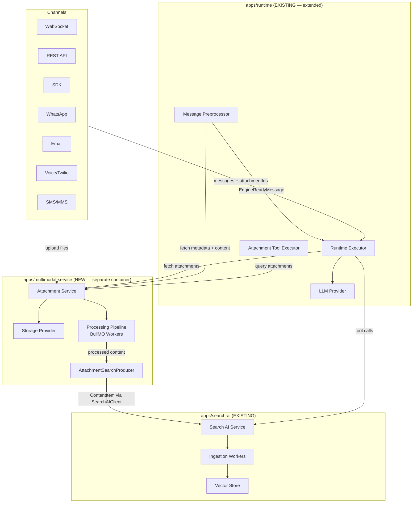

### Separate Service Rationale

The attachment service runs as `apps/multimodal-service/` — a separate container following the `apps/search-ai/` precedent:

| Factor               | Embed in runtime                                                       | Separate service                     |
| -------------------- | ---------------------------------------------------------------------- | ------------------------------------ |
| Memory               | +300-500 MB per pod (sharp, Tika, FFmpeg) × 30 pods = 9-15 GB wasted   | Isolated, scales independently       |
| Failure blast radius | OOM from image processing kills sessions                               | Only file processing restarts        |
| Scaling              | Runtime pods scale for WebSocket concurrency, not CPU-heavy transforms | File processing pods scale on CPU/IO |
| Container image      | Runtime image bloated with native binaries                             | Focused, smaller images              |
| Deployment cadence   | Attachment changes require runtime deploy                              | Independent release cycle            |

**Communication:** Runtime ↔ Attachment Service via internal HTTP REST (same Kubernetes cluster, no public exposure). The attachment service exposes:

- `POST /internal/attachments` — upload
- `GET /internal/attachments/:id` — metadata + presigned URL
- `GET /internal/attachments/session/:sessionId` — list by session
- `DELETE /internal/attachments/:id` — delete
- `DELETE /internal/attachments/session/:sessionId` — cascade delete

### High-Level Flow

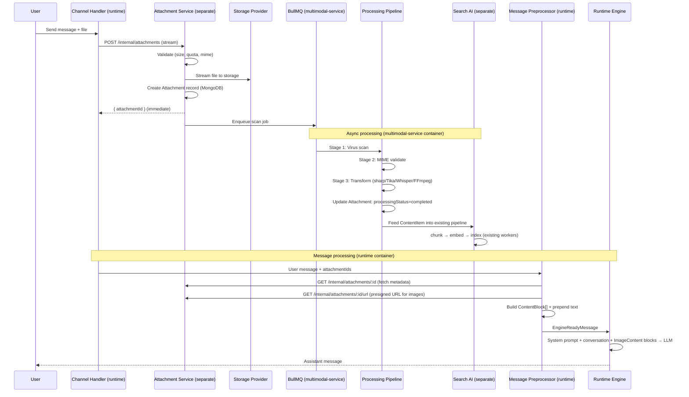

### Text Diagram: Boundary Overview

```
┌──────────────────────────────────────────────────────────────────────┐
│ BOUNDARY 1: INGESTION (apps/runtime — channel handlers)              │
│ Channel adapters normalize raw input → AttachmentInput               │
│ Owner: Channel-specific handlers in runtime                          │
└─────────────────────────────┬────────────────────────────────────────┘
                              │ HTTP POST to multimodal-service
                              ▼
┌──────────────────────────────────────────────────────────────────────┐
│ BOUNDARY 2: ATTACHMENT SERVICE (apps/multimodal-service — separate)   │
│ Validate → Store → Enqueue                                           │
│ Owner: AttachmentService                                             │
│ Creates: Attachment MongoDB record + file in StorageProvider         │
│ Returns: attachmentId (immediate, non-blocking)                      │
│ Container: Independent Express app, own BullMQ workers               │
└─────────────────────────────┬────────────────────────────────────────┘
                              │
                              ▼
┌──────────────────────────────────────────────────────────────────────┐
│ BOUNDARY 3: PROCESSING PIPELINE (apps/multimodal-service — workers)   │
│ Scan → Validate MIME → Transform (category-specific)                 │
│ Owner: BullMQ job handlers (inline in multimodal-service container)   │
│ Output: processedContent, resized images, thumbnails                 │
│ Heavy deps: sharp, Tika client, Whisper client, FFmpeg               │
└──────────────┬──────────────────────────────────┬────────────────────┘
               │                                  │
      (for engine via                       (for Search AI)
       internal API)                              │
               │                                  │
               ▼                                  ▼
┌──────────────────────────┐    ┌──────────────────────────────────────┐
│ BOUNDARY 4: ENGINE       │    │ BOUNDARY 5: EXISTING SEARCH AI       │
│ (apps/runtime)           │    │ apps/search-ai/ (NO CORE CHANGES)    │
│ MessagePreprocessor      │    │                                      │
│ fetches attachment data  │    │ Attachment content enters via         │
│ from multimodal-service  │    │ SearchAIClient → existing ingestion   │
│ via internal HTTP API    │    │ workers (extract → map → enrich →    │
│                          │    │ embed)                               │
│ Converts to ContentBlock │    │                                      │
│ for engine               │    │                                      │
│ NEW: ImageContent type   │    │                                      │
│ NEW: prepended text      │    │                                      │
└──────────────────────────┘    └──────────────────────────────────────┘
                                                  │
                                                  ▼
                                ┌──────────────────────────────────────┐
                                │ BOUNDARY 6: AGENT TOOLS               │
                                │ (apps/runtime — tool executors)       │
                                │ EXISTING: search_vector,              │
                                │   search_structured, search_hybrid    │
                                │ NEW: get_attachment, list_attachments  │
                                │ (queries multimodal-service via HTTP)  │
                                └──────────────────────────────────────┘
```

### Deployment Topology

```
┌─────────────────────────────────────────────────────────────┐
│  Kubernetes Cluster                                         │
│                                                             │
│  ┌─────────────┐  ┌──────────────────┐  ┌───────────────┐  │
│  │ runtime     │  │ attachment-svc   │  │ search-ai     │  │
│  │ (30 pods)   │  │ (3-5 pods)       │  │ (3-5 pods)    │  │
│  │ ~500MB each │  │ ~600MB each      │  │ ~400MB each   │  │
│  │ WS + REST   │  │ REST + BullMQ    │  │ REST + BullMQ │  │
│  └──────┬──────┘  └────────┬─────────┘  └───────┬───────┘  │
│         │  internal HTTP   │                     │          │
│         ├─────────────────►│                     │          │
│         │                  │  internal HTTP      │          │
│         │                  ├────────────────────►│          │
│         │                  │                     │          │
│  ┌──────┴──────────────────┴─────────────────────┴───────┐  │
│  │ Shared Infrastructure: Redis, MongoDB, MinIO, ClamAV  │  │
│  └───────────────────────────────────────────────────────┘  │
└─────────────────────────────────────────────────────────────┘
```

---

## 4. Data Models

### 4.1 Attachment Model (NEW)

```typescript
// packages/database/src/models/attachment.model.ts

interface IAttachment {
  _id: string;
  tenantId: string;
  projectId: string;
  sessionId: string;
  messageId: string | null; // null for pre-upload flow

  // File metadata
  originalFilename: string; // display only, NEVER used in storage paths
  mimeType: string; // server-validated via magic bytes
  detectedMimeType: string; // actual detected MIME from file content
  category: 'image' | 'document' | 'audio' | 'video';
  sizeBytes: number;
  contentHash: string; // SHA-256 — dedup + integrity

  // Storage reference
  storageProvider: string; // 's3' | 'gcs' | 'azure_blob' | 'minio' | 'gridfs' | 'local'
  storageKey: string; // server-generated: '{tenantId}/{projectId}/{sessionId}/{attachmentId}'
  storageBucket: string;
  encrypted: boolean;
  encryptionKeyVersion: number;

  // Security
  scanStatus: 'pending' | 'clean' | 'infected' | 'error';
  scanEngine: string | null; // e.g., 'clamav', 'virustotal'
  scannedAt: Date | null;
  hasPII: boolean;
  exifStripped: boolean;

  // Processing state
  processingStatus: 'pending' | 'processing' | 'completed' | 'failed' | 'skipped';
  processedContent: string | null; // extracted text, transcript
  processedContentHash: string | null;
  processingError: string | null;
  processingEngine: string | null; // e.g., 'tika', 'whisper', 'sharp'
  processedAt: Date | null;

  // Image-specific (LLM + UI)
  resizedStorageKey: string | null;
  resizedSizeBytes: number | null;
  thumbnailStorageKey: string | null;

  // Image description (for search via vision LLM)
  imageDescription: string | null;
  imageDescriptionModel: string | null;

  // Search AI integration
  searchIndexId: string | null; // FK to existing SearchIndex
  searchDocumentId: string | null; // FK to existing SearchDocument (created by ingestion)
  embeddingStatus: 'pending' | 'processing' | 'completed' | 'failed' | 'skipped';
  embeddedAt: Date | null;

  // Lifecycle
  expiresAt: Date | null; // TTL — configurable per category
  createdAt: Date;
  updatedAt: Date;
  _v: number;
}
```

**Indexes:**

```typescript
// Query patterns and their indexes
{ tenantId: 1, sessionId: 1, createdAt: -1 }         // list attachments for session
{ tenantId: 1, projectId: 1, messageId: 1 }           // lookup by message
{ tenantId: 1, contentHash: 1 }                        // dedup within tenant
{ expiresAt: 1 }                                        // TTL auto-cleanup (sparse)
{ scanStatus: 1, createdAt: 1 }                        // find unscanned files
{ processingStatus: 1, createdAt: 1 }                  // find unprocessed files
{ embeddingStatus: 1, createdAt: 1 }                   // find un-embedded files
{ tenantId: 1, projectId: 1, category: 1, createdAt: -1 } // filtered listing
```

**Mermaid: Attachment Model ERD**

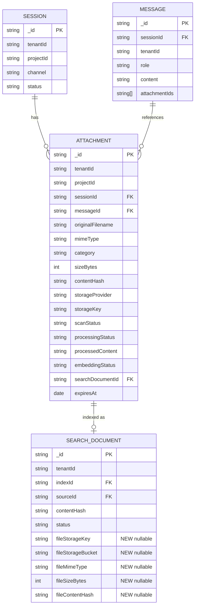

### 4.2 Message Model Extension

Add an optional `attachmentIds` field to the existing `IMessage` interface:

```typescript
// packages/database/src/models/message.model.ts — EXTEND
interface IMessage {
  // ... existing fields ...
  attachmentIds: string[]; // NEW — references to Attachment._id
}
```

### 4.3 Tenant Attachment Config

```typescript
// Part of tenant or project configuration
interface AttachmentConfig {
  enabled: boolean; // default: true
  maxFileSizeBytes: number; // default: 25 * 1024 * 1024 (25 MB)
  maxAttachmentsPerMessage: number; // default: 5
  maxAttachmentsPerSession: number; // default: 50
  maxTotalStorageBytesPerTenant: number; // default: 5 * 1024 * 1024 * 1024 (5 GB)

  allowedCategories: ('image' | 'document' | 'audio' | 'video')[];

  retentionDays: {
    image: number; // default: 90
    document: number; // default: 180
    audio: number; // default: 90
    video: number; // default: 30
  };

  allowedMimeTypes: string[]; // e.g., ['image/png', 'image/jpeg', 'application/pdf']

  quotas: {
    maxUploadsPerMinute: number; // default: 10
    maxConcurrentProcessingJobs: number; // default: 5
  };
}
```

### 4.4 SearchDocument Model Extension (KB File Uploads)

The existing `SearchDocument` model (`packages/database/src/models/search-document.model.ts`) stores only pre-extracted text with no file storage references. To support real KB file uploads (PDF, DOCX, etc.), we extend the model with optional file storage fields:

```typescript
// packages/database/src/models/search-document.model.ts — EXTEND

interface ISearchDocument {
  // ... existing fields (indexId, sourceId, contentHash, extractedText, status, etc.) ...

  // File storage references (NEW — all optional, null for text-pasted documents)
  fileStorageKey: string | null; // '{tenantId}/{projectId}/kb/{indexId}/{docId}/original'
  fileStorageBucket: string | null; // same bucket as attachment storage
  fileMimeType: string | null; // detected MIME type (magic-byte validated)
  fileSizeBytes: number | null; // original file size
  fileContentHash: string | null; // SHA-256 of original file (dedup key)
  fileUploadedAt: Date | null; // when the file was uploaded (vs. when text was pasted)
}
```

**Key differences from Attachment model:**

| Aspect            | Attachment (session)                                   | SearchDocument (KB)                                     |
| ----------------- | ------------------------------------------------------ | ------------------------------------------------------- |
| **Lifecycle**     | Tied to session — deleted when session expires         | Tied to KB index — deleted when source/index is removed |
| **Use by engine** | MessagePreprocessor builds ContentBlocks for LLM       | Not used directly by engine — only via search tools     |
| **Processing**    | Full pipeline: scan → transform → index                | Scan → parse → ingest (existing 5-stage pipeline)       |
| **Real-time?**    | Yes — user uploads during conversation                 | No — admin configures sources, batch processing         |
| **Model**         | `Attachment` (new collection)                          | `SearchDocument` (existing collection, extended)        |
| **Storage key**   | `{tenant}/{project}/{session}/{attachmentId}/original` | `{tenant}/{project}/kb/{indexId}/{docId}/original`      |

**Unified file processing diagram:**

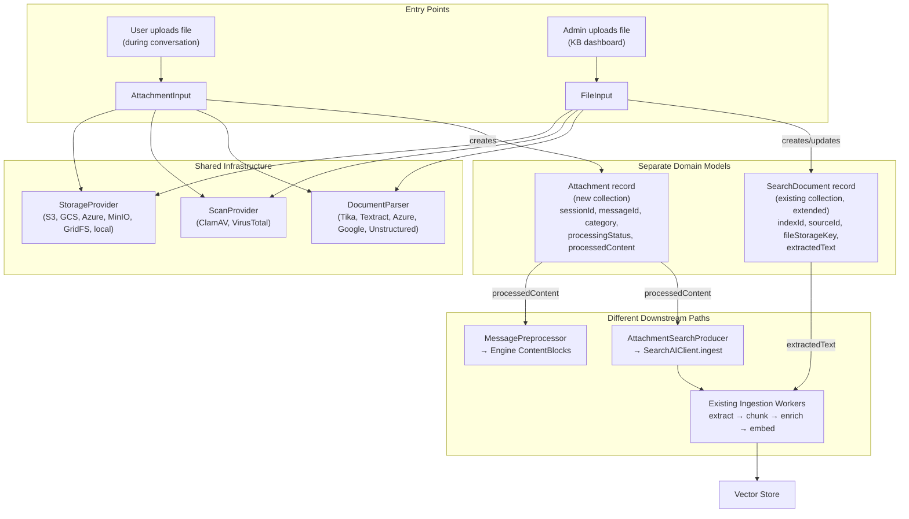

```
Session Attachment Flow:                KB File Upload Flow:
═════════════════════                   ═══════════════════
User → Channel →                        Admin → Studio UI →
  AttachmentInput →                       FileInput →
  ┌───────────────────────────────────────────────────────────────┐
  │  SHARED: StorageProvider → ScanProvider → DocumentParser      │
  └───────────────────────────────────────────────────────────────┘
  Attachment record (NEW model)           SearchDocument record (EXTENDED)
        │                                        │
        ├→ MessagePreprocessor → Engine          │
        └→ AttachmentSearchProducer ─────┐       │
                                          ▼       ▼
                                ┌─────────────────────┐
                                │ Search AI Ingestion  │
                                │ (existing pipeline)  │
                                └─────────────────────┘
```

### 4.5 ContentBlock Extension

Extend the existing `ContentBlock` union in the compiler's LLM types:

```typescript
// packages/compiler/src/platform/llm/types.ts — EXTEND

type ContentBlock =
  | TextContent
  | ImageContent // NEW
  | ToolUseContent
  | ToolResultContent;

interface ImageContent {
  type: 'image';
  source: { type: 'base64'; media_type: string; data: string } | { type: 'url'; url: string };
  attachmentId: string; // reference back to Attachment model
}
```

---

## 5. Storage Provider Layer

### 5.1 Interface

```typescript
// packages/shared/src/attachments/interfaces/storage-provider.ts

import { Readable } from 'stream';

interface StorageProvider {
  readonly name: string; // 's3' | 'gcs' | 'azure_blob' | 'minio' | 'gridfs' | 'local'

  upload(params: {
    key: string;
    body: Readable; // stream, never full buffer
    contentType: string;
    sizeBytes: number;
    metadata: Record<string, string>;
    encryption?: { algorithm: string; keyId: string };
  }): Promise<{ storageKey: string; etag: string }>;

  download(key: string): Promise<{
    body: Readable;
    contentType: string;
    sizeBytes: number;
  }>;

  getSignedUrl(
    key: string,
    opts: {
      expiresInSeconds: number; // max: 900 (15 minutes)
      disposition?: 'inline' | 'attachment';
      filename?: string;
    },
  ): Promise<string>;

  delete(key: string): Promise<void>;

  deleteMany(prefix: string): Promise<{ deletedCount: number }>;

  exists(key: string): Promise<boolean>;

  copy(sourceKey: string, destKey: string): Promise<void>;

  healthCheck(): Promise<{ ok: boolean; latencyMs: number }>;
}
```

### 5.2 Storage Key Convention

All keys are server-generated from validated IDs. No user-supplied strings in paths.

```
{tenantId}/{projectId}/{sessionId}/{attachmentId}/{purpose}
```

Where `purpose` is one of: `original`, `resized`, `thumbnail`.

Example: `tenant_abc/proj_123/sess_456/att_789/original`

### 5.3 Implementations

| Implementation             | Backend               | Config Key   | Notes                                                                  |
| -------------------------- | --------------------- | ------------ | ---------------------------------------------------------------------- |
| `S3StorageProvider`        | AWS S3                | `s3`         | `@aws-sdk/client-s3` v3, SSE-S3/SSE-KMS encryption, lifecycle policies |
| `GCSStorageProvider`       | Google Cloud Storage  | `gcs`        | `@google-cloud/storage`, CMEK encryption                               |
| `AzureBlobStorageProvider` | Azure Blob Storage    | `azure_blob` | `@azure/storage-blob`, CMK encryption                                  |
| `MinIOStorageProvider`     | MinIO (S3-compatible) | `minio`      | `minio` npm or `@aws-sdk/client-s3` with custom endpoint               |
| `GridFSStorageProvider`    | MongoDB GridFS        | `gridfs`     | `mongoose` GridFS bucket, tenant-prefixed filenames                    |
| `LocalStorageProvider`     | Local filesystem      | `local`      | `fs.promises`, dev/testing only                                        |

### 5.4 Factory

```typescript
// apps/runtime/src/attachments/storage/storage-factory.ts

interface StorageProviderConfig {
  provider: 's3' | 'gcs' | 'azure_blob' | 'minio' | 'gridfs' | 'local';
  bucket: string;
  region?: string;
  endpoint?: string; // for MinIO or S3-compatible
  accessKeyId?: string;
  secretAccessKey?: string;
  connectionString?: string; // for Azure
  basePath?: string; // for local
}

function createStorageProvider(config: StorageProviderConfig): StorageProvider;
```

**Mermaid: Storage Provider Class Diagram**

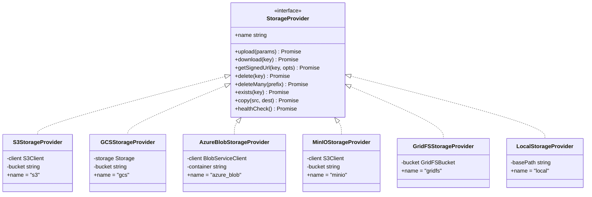

---

## 6. Security Layer

### 6.1 Virus Scanning

```typescript
// packages/shared/src/attachments/interfaces/scan-provider.ts

interface ScanProvider {
  readonly name: string;

  scan(params: { fileStream: Readable; filename: string; sizeBytes: number }): Promise<{
    status: 'clean' | 'infected' | 'error';
    engine: string;
    threats?: string[]; // e.g., ['Trojan.PDF-1234']
    scannedAt: Date;
  }>;

  healthCheck(): Promise<{ ok: boolean; latencyMs: number }>;
}
```

**Implementations:**

| Implementation      | Backend                     | Notes                                                       |
| ------------------- | --------------------------- | ----------------------------------------------------------- |
| `ClamAVScanner`     | ClamAV daemon (`clamdscan`) | `clamscan` npm, self-hosted, zero per-scan cost, ~1 GB RSS  |
| `VirusTotalScanner` | VirusTotal API              | 70+ engines, files sent to third-party (compliance concern) |
| `GuardDutyScanner`  | AWS S3 Malware Protection   | Native S3 integration via EventBridge, AWS-only             |

**Pipeline rule:** Files with `scanStatus !== 'clean'` are never served to the engine, never downloadable, and never indexed.

### 6.2 MIME Validation

Server-side magic-byte detection using `file-type` npm package. Reject if detected MIME doesn't match the declared category:

```typescript
import { fileTypeFromBuffer } from 'file-type';

async function validateMime(
  buffer: Buffer, // first 4100 bytes are sufficient
  declaredMimeType: string,
): Promise<{ valid: boolean; detectedMimeType: string }>;
```

Rejection examples:

- Declared `image/png` but detected `application/x-executable` → reject
- Declared `application/pdf` but detected `application/zip` → reject (polyglot file)

### 6.3 SSRF Protection

URL-referenced attachments (from `image_url`, WhatsApp media URLs, etc.) must pass SSRF validation before download:

```typescript
// Reuse existing SSRF protection from tool HTTP executor
function validateUrl(url: string): { safe: boolean; reason?: string };
```

Blocked:

- Private IP ranges: `10.0.0.0/8`, `172.16.0.0/12`, `192.168.0.0/16`
- Link-local: `169.254.0.0/16` (AWS metadata endpoint)
- Loopback: `127.0.0.0/8`
- IPv6 equivalents

### 6.4 EXIF Stripping

All uploaded images have EXIF metadata stripped on upload using `sharp`:

```typescript
// sharp removes EXIF by default when processing
const processedBuffer = await sharp(inputStream)
  .rotate() // auto-rotate based on EXIF orientation before stripping
  .toBuffer();
```

This removes: GPS coordinates, device info, timestamps, camera settings.

### 6.5 Presigned URL Security

- Maximum TTL: 15 minutes (900 seconds)
- Scoped to specific tenant + session (verified before generating)
- **Session ownership verified before URL generation** — for SDK auth, `requireSessionOwnership()` confirms the requesting end-user owns the session that owns the attachment (see [Centralized Auth Design §8](2026-02-22-centralized-auth-design.md#8-presigned-url-security))
- `Content-Disposition: attachment` header to prevent inline rendering of potentially dangerous files
- No CDN caching without tenant verification layer
- For SDK auth: presigned URLs are only generated after session ownership is confirmed — a valid SDK token alone is not sufficient

### 6.6 Access Control

Access control varies by auth type. All paths verify tenant + project at the query level. SDK auth additionally requires session ownership — the requesting end-user must own the session that owns the attachment. See [Centralized Auth Design §5](2026-02-22-centralized-auth-design.md#5-three-layer-access-control) for the full three-layer model.

```typescript
// Layer 1: DB-level tenant + project isolation (all auth types)
const attachment = await Attachment.findOne({
  _id: attachmentId,
  tenantId: req.tenantContext.tenantId,
  projectId: req.params.projectId,
});
// Returns 404 (not 403) if not found — no existence leakage

// Layer 2: Auth-type-specific access
// - User JWT: requireProjectPermission('attachment:read') — RBAC via ProjectMember
// - SDK token: requireSessionOwnership() — verifies end-user owns the session
//   that owns the attachment (CallerIdentity match against session.callerContext)
// - API key: requireProjectScope() — key must be scoped to this project
```

**Session-as-gateway model for SDK auth:** Attachments belong to sessions. Session ownership transitively protects attachments — if the SDK user doesn't own the session, they can't access any of its attachments. This avoids per-record `userId` columns on the attachment model.

### 6.7 Rate Limiting

Per-tenant upload rate limiting using `rate-limiter-flexible` with Redis backend:

```typescript
const uploadLimiter = new RateLimiterRedis({
  storeClient: redisClient,
  keyPrefix: 'attachment_upload',
  points: config.quotas.maxUploadsPerMinute, // default: 10
  duration: 60,
});

// Key: tenantId — limits apply per tenant, not per user
await uploadLimiter.consume(tenantId);
```

### 6.8 Session Ownership as Attachment Gateway

> **Cross-reference:** [Centralized Auth Design](2026-02-22-centralized-auth-design.md) — full architecture for discriminated auth context and session ownership middleware.

For SDK auth (end-users via channels), attachments are protected by **session ownership**:

1. Every attachment belongs to a session (`attachment.sessionId`)
2. Every session records caller identity (`session.callerContext: { customerId, anonymousId, channelArtifact, identityTier }`)
3. `requireSessionOwnership()` middleware compares the requesting SDK user's identity against the session's `callerContext`
4. If the identity doesn't match, return 404 (not 403) — don't leak existence

```typescript
// Middleware composition for attachment routes (SDK auth path)
router.use(
  createUnifiedAuthMiddleware(), // Parse SDK token → TenantContextData
  requireSessionOwnership(), // Verify end-user owns :sessionId
);

// requireSessionOwnership() uses matchesSessionOwner():
function matchesSessionOwner(session: SessionDoc, caller: CallerIdentity): boolean {
  // Tier 2: customerId match (strongest)
  if (caller.customerId && session.callerContext?.customerId === caller.customerId) return true;
  // Tier 1: channelArtifact match (phone, email)
  if (caller.channelArtifact && session.callerContext?.channelArtifact === caller.channelArtifact)
    return true;
  // Tier 0: anonymousId match (weakest, same session only)
  if (caller.anonymousId && session.callerContext?.anonymousId === caller.anonymousId) return true;
  return false;
}
```

**Why session-as-gateway, not per-record userId:** Adding `userId` to every attachment record would require: (a) migrating existing records, (b) handling identity tier transitions (anonymous → verified), (c) duplicating ownership checks across tables. Instead, session ownership is the single gate — attachments, messages, and traces are all transitively protected by session ownership. This follows the FactStore's `ownerFilter()` pattern where ownership dimensions are set once at creation and spread into every query.

---

## 7. Processing Pipeline

### 7.1 Pipeline Architecture

The processing pipeline runs as BullMQ jobs, fully decoupled from the upload request path.

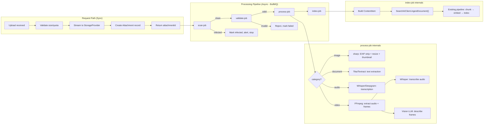

### 7.2 Job Definitions

```typescript
// apps/multimodal-service/src/jobs/

// Stage 1: Virus scan
interface ScanJobData {
  attachmentId: string;
  tenantId: string;
}

// Stage 2: MIME validation
interface ValidateJobData {
  attachmentId: string;
  tenantId: string;
}

// Stage 3: Transform (category-specific)
interface ProcessJobData {
  attachmentId: string;
  tenantId: string;
  category: 'image' | 'document' | 'audio' | 'video';
}

// Stage 4: Feed into Search AI
interface IndexJobData {
  attachmentId: string;
  tenantId: string;
  searchIndexId: string;
}

// Cleanup: Delete files + metadata + vectors
interface CleanupJobData {
  attachmentId: string;
  tenantId: string;
  storageKeys: string[]; // all keys to delete (original, resized, thumbnail)
  searchDocumentId: string | null; // cascade delete from Search AI
}
```

**Job dependencies (BullMQ flow):**

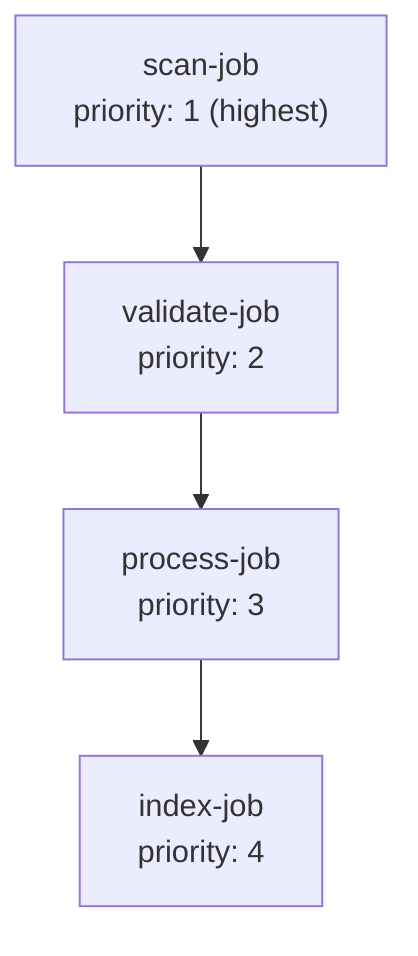

Each job has: 3 retries with exponential backoff (1s, 4s, 16s), timeout per category (images: 30s, documents: 120s, audio: 300s, video: 600s).

### 7.3 Image Processing

Library: **sharp** (Apache-2.0, libvips-based, fastest Node.js image processor)

```typescript
// apps/runtime/src/attachments/processing/image-processor.ts

interface ImageProcessingResult {
  exifStripped: boolean;
  resizedStorageKey: string;
  resizedSizeBytes: number;
  thumbnailStorageKey: string;
  originalWidth: number;
  originalHeight: number;
  resizedWidth: number;
  resizedHeight: number;
}

async function processImage(
  inputStream: Readable,
  attachmentId: string,
  storageProvider: StorageProvider,
  storageKeyPrefix: string,
): Promise<ImageProcessingResult> {
  const pipeline = sharp();

  // 1. Auto-rotate from EXIF, then strip EXIF
  pipeline.rotate();

  // 2. Resize for LLM (cap at 2048px, preserve aspect ratio)
  pipeline.resize(2048, 2048, { fit: 'inside', withoutEnlargement: true });

  // 3. Output as WebP (smaller than JPEG, widely supported by LLMs)
  pipeline.webp({ quality: 85 });

  // Stream to storage
  const resizedStream = inputStream.pipe(pipeline);
  await storageProvider.upload({
    key: `${storageKeyPrefix}/resized`,
    body: resizedStream,
    contentType: 'image/webp',
    // ...
  });

  // 4. Generate thumbnail (256px)
  // ... similar pipeline with .resize(256, 256, { fit: 'cover' })
}
```

### 7.4 Document Parsing

Interface:

```typescript
// packages/shared/src/attachments/interfaces/document-parser.ts

interface DocumentParser {
  readonly name: string;

  parse(params: {
    fileStream: Readable;
    mimeType: string;
    filename: string;
    options?: { ocrEnabled?: boolean; language?: string };
  }): Promise<{
    text: string;
    pageCount?: number;
    language?: string;
    metadata?: Record<string, string>; // author, title, creation date
    engine: string;
  }>;

  supportedMimeTypes(): string[];
}
```

**Implementations:**

| Implementation        | Backend                        | Formats                              | Notes                                                               |
| --------------------- | ------------------------------ | ------------------------------------ | ------------------------------------------------------------------- |
| `TikaParser`          | Apache Tika (HTTP server)      | 1000+ formats                        | Most comprehensive, JVM-based (~500 MB), includes OCR via Tesseract |
| `TextractParser`      | AWS Textract                   | PDF, images, forms, tables           | OCR + table extraction, AWS-only, ~$1.50/1000 pages                 |
| `GoogleDocAIParser`   | Google Document AI             | PDF, images, forms, invoices         | OCR + entity extraction, GCP-only, ~$1.50/1000 pages                |
| `AzureDocIntelParser` | Azure AI Document Intelligence | PDF, images, forms                   | OCR + prebuilt models, Azure-only, ~$1.00/1000 pages                |
| `UnstructuredParser`  | Unstructured.io                | PDF, DOCX, PPTX, HTML, images, email | Element-aware parsing, chunking-ready output, self-hosted or SaaS   |

**Integration with existing Search AI extraction service:**

The existing `apps/search-ai/src/services/extraction/index.ts` has stub methods for PDF and DOCX. These implementations complete those stubs — the same parsers are reusable by both the attachment pipeline and the KB ingestion pipeline.

### 7.5 Audio Transcription

Interface:

```typescript
// packages/shared/src/attachments/interfaces/transcription-provider.ts

interface TranscriptionProvider {
  readonly name: string;

  transcribe(params: {
    audioStream: Readable;
    mimeType: string;
    language?: string; // ISO 639-1 or 'auto'
    options?: {
      diarization?: boolean;
      punctuation?: boolean;
      wordTimestamps?: boolean;
    };
  }): Promise<{
    text: string;
    language: string;
    durationSeconds: number;
    segments?: Array<{
      start: number;
      end: number;
      text: string;
      speaker?: string;
    }>;
    engine: string;
  }>;

  supportedFormats(): string[];
}
```

**Implementations:**

| Implementation             | Backend                                   | Notes                                                            |
| -------------------------- | ----------------------------------------- | ---------------------------------------------------------------- |
| `WhisperTranscriber`       | faster-whisper (self-hosted HTTP service) | Best open-source accuracy, 99 languages, needs GPU for real-time |
| `DeepgramTranscriber`      | Deepgram API                              | Fastest API (~0.5x real-time), streaming + batch, ~$0.0043/min   |
| `GoogleSTTTranscriber`     | Google Speech-to-Text v2                  | 125+ languages, medical/telephony models, ~$0.016/min            |
| `AWSTranscribeTranscriber` | AWS Transcribe                            | Batch + streaming, PII redaction built-in, ~$0.024/min           |
| `AzureSpeechTranscriber`   | Azure Speech Services                     | Real-time + batch, custom models, ~$0.016/min                    |
| `AssemblyAITranscriber`    | AssemblyAI                                | LLM-powered, summarization + sentiment, ~$0.0037/min             |

### 7.6 Video Processing

Interface:

```typescript
// packages/shared/src/attachments/interfaces/video-processor.ts

interface VideoProcessor {
  extractAudio(params: {
    videoStream: Readable;
    outputFormat: 'wav' | 'mp3' | 'ogg';
  }): Promise<{ audioStream: Readable; durationSeconds: number }>;

  extractKeyFrames(params: {
    videoStream: Readable;
    strategy: 'interval' | 'scene_change';
    maxFrames: number; // cap frames sent to LLM (e.g., 10)
    intervalSeconds?: number; // for 'interval' strategy
  }): Promise<{ frames: Buffer[]; timestamps: number[] }>;
}
```

**Implementation:** FFmpeg via `fluent-ffmpeg` npm (industry standard, handles all codecs).

**Video processing flow:**

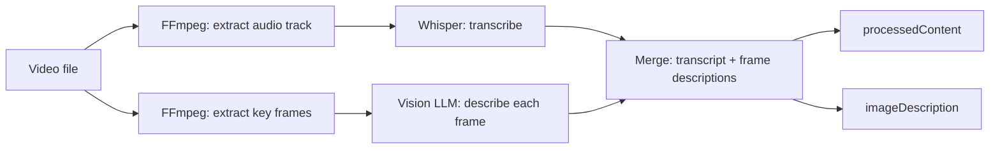

---

## 8. Engine Integration

### 8.1 MessagePreprocessor

The adapter between the Attachment Service and the runtime engine. Called **before** `engine.processMessage()`.

```typescript
// apps/runtime/src/attachments/message-preprocessor.ts

interface MessagePreprocessor {
  preprocess(params: {
    message: RawIncomingMessage;
    attachments: IAttachment[];
    tenantId: string;
  }): Promise<EngineReadyMessage>;
}

interface RawIncomingMessage {
  content: string;
  attachmentIds: string[];
  channel: string;
}

interface EngineReadyMessage {
  content: string; // original text + prepended attachment text
  contentBlocks: ContentBlock[]; // includes ImageContent for images
  metadata: {
    attachmentIds: string[]; // preserved for tracing
    attachmentSummary: string; // "2 images, 1 PDF" — for trace events
  };
}
```

### 8.2 Content Transformation Rules

| Category     | What the engine sees                                 | How it's built                                                                                                                                 |
| ------------ | ---------------------------------------------------- | ---------------------------------------------------------------------------------------------------------------------------------------------- |
| **Image**    | `ImageContent` block with presigned URL or base64    | Presigned URL preferred (avoid 33% base64 bloat). Fall back to base64 if LLM provider doesn't support URLs.                                    |
| **Document** | Text prepended to user message                       | `"[Attached document: {filename}]\n{extracted text}\n\n{user's actual message}"`                                                               |
| **Audio**    | Text prepended to user message                       | `"[Attached audio: {filename} ({duration}s)]\n{transcript}\n\n{user's message}"`                                                               |
| **Video**    | Text prepended + key frames as `ImageContent` blocks | `"[Attached video: {filename} ({duration}s)]\n{transcript}\n{frame descriptions}\n\n{user's message}"` + up to `maxFrames` ImageContent blocks |

### 8.3 Processing Status Handling

The `MessagePreprocessor` waits for attachments to reach `processingStatus: 'completed'` before the message enters the engine:

```typescript
async function waitForProcessing(
  attachmentIds: string[],
  timeoutMs: number = 30_000, // configurable, default 30s
  pollIntervalMs: number = 500,
): Promise<IAttachment[]> {
  const deadline = Date.now() + timeoutMs;

  while (Date.now() < deadline) {
    const attachments = await Attachment.find({
      _id: { $in: attachmentIds },
      tenantId,
    });

    const allReady = attachments.every(
      (a) => a.processingStatus === 'completed' || a.processingStatus === 'failed',
    );

    if (allReady) return attachments;
    await sleep(pollIntervalMs);
  }

  // Timeout: proceed with available content, mark pending ones as skipped
  return attachments;
}
```

**Behavior on timeout:**

- Images still processing → omit (don't send broken references to LLM)
- Documents/audio still processing → send message without, append `"[File still processing: {filename}]"`
- Failed processing → include error in message: `"[Failed to process: {filename}]"`

### 8.4 Trace Events

New trace event types for observability:

```typescript
type TraceEventType =
  | /* ... existing types ... */
  | 'attachment_upload'        // file received
  | 'attachment_scan'          // scan result
  | 'attachment_process'       // transformation result
  | 'attachment_index'         // Search AI indexing result
  | 'attachment_search';       // agent search tool invocation
```

---

## 9. Search AI Integration

### 9.1 Integration Strategy

Attachment content is fed into the **existing** Search AI ingestion pipeline via `SearchAIClient`. The existing 5-stage pipeline (ingest → extract → canonical-map → enrich → embed) handles chunking, embedding, and indexing.

For attachments, content is **already extracted** by the attachment processing pipeline. The ingestion enters at a point that allows skipping the extraction stage.

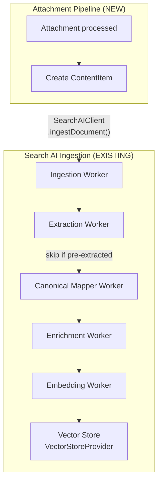

### 9.2 Attachment Search Producer

```typescript
// apps/runtime/src/attachments/attachment-search-producer.ts

class AttachmentSearchProducer {
  constructor(
    private searchAIClient: SearchAIClient,
    private searchIndexResolver: SearchIndexResolver,
  ) {}

  async indexAttachment(attachment: IAttachment): Promise<void> {
    // 1. Resolve which SearchIndex this attachment should be indexed in
    const indexId = await this.searchIndexResolver.resolveForProject(
      attachment.tenantId,
      attachment.projectId,
    );

    if (!indexId) return; // no search index configured for this project

    // 2. Build the content to index
    const content = [attachment.processedContent, attachment.imageDescription]
      .filter(Boolean)
      .join('\n\n');

    if (!content) return; // nothing to index (e.g., image without description)

    // 3. Ingest via existing SearchAIClient
    // The existing ingestion pipeline handles: chunk → enrich → embed
    await this.searchAIClient.ingestDocument(indexId, {
      title: attachment.originalFilename,
      content,
      contentType: attachment.mimeType,
      metadata: {
        sourceType: 'attachment',
        attachmentId: attachment._id,
        sessionId: attachment.sessionId,
        projectId: attachment.projectId,
        category: attachment.category,
        mimeType: attachment.mimeType,
        channel: attachment.channel,
      },
    });

    // 4. Update attachment with search references
    await Attachment.findOneAndUpdate(
      { _id: attachment._id, tenantId: attachment.tenantId },
      {
        searchIndexId: indexId,
        embeddingStatus: 'processing',
      },
    );
  }
}
```

### 9.3 Search AI Provider Extensions

Extend the existing factory patterns in `packages/search-ai-sdk/`:

#### VectorStoreProvider Extensions

The existing `VectorStoreProvider` interface (`packages/search-ai-sdk/src/vector-store/interface.ts`) and factory (`factory.ts`) support `'qdrant' | 'pinecone' | 'pgvector'`. We extend with:

```typescript
// packages/search-ai-sdk/src/vector-store/factory.ts — EXTEND

type VectorStoreProviderType =
  | 'qdrant' // existing (implemented)
  | 'pinecone' // existing (stub → implement)
  | 'pgvector' // existing (stub → implement)
  | 'opensearch' // NEW
  | 'azure_ai_search' // NEW
  | 'elasticsearch' // NEW
  | 'weaviate' // NEW
  | 'milvus' // NEW
  | 'mongodb_atlas' // NEW
  | 'chromadb'; // NEW

function createVectorStore(config: VectorStoreFactoryConfig): VectorStoreProvider;
```

Each new implementation implements the existing `VectorStoreProvider` interface with its full contract: `createCollection`, `deleteCollection`, `upsert`, `search`, `delete`, `deleteByFilter`, `getByIds`, `count`, `healthCheck`, `close`.

**Provider specifics:**

| Provider            | Hybrid Search                            | Tenant Isolation                            | Notes                                               |
| ------------------- | ---------------------------------------- | ------------------------------------------- | --------------------------------------------------- |
| **AWS OpenSearch**  | `search_pipeline` with RRF (k-NN + BM25) | Index-per-tenant or filtered aliases        | Fine-grained access control, ISM lifecycle policies |
| **Azure AI Search** | Native hybrid + semantic re-ranker       | Index-per-tenant or security filters        | Built-in vectorizers, skillsets for doc cracking    |
| **Elasticsearch**   | RRF in 8.x+ (`knn` + `query`)            | Index-per-tenant or document-level security | Most mature full-text engine, Kibana dashboards     |
| **Weaviate**        | `hybridSearch(query, alpha)`             | Multi-tenant class or filtered              | Built-in vectorizers, GraphQL + REST                |
| **Milvus**          | Sparse + dense fusion                    | Partition key or filtered                   | GPU-accelerated, billions of vectors                |
| **MongoDB Atlas**   | `$vectorSearch` + `$search` pipeline     | Filter by `tenantId` field                  | Zero extra infra for Atlas users                    |
| **ChromaDB**        | Vector only (no BM25)                    | Collection-per-tenant                       | Dev/testing only                                    |

#### EmbeddingProvider Extensions

The existing `EmbeddingProvider` interface and factory support `'openai' | 'cohere'`. We extend:

```typescript
// packages/search-ai-sdk/src/embedding/factory.ts — EXTEND

type EmbeddingProviderType =
  | 'openai' // existing (implemented)
  | 'cohere' // existing (stub → implement)
  | 'voyage' // NEW
  | 'google' // NEW
  | 'aws_titan' // NEW
  | 'fastembed' // NEW
  | 'ollama'; // NEW

function createEmbeddingProvider(config: EmbeddingFactoryConfig): EmbeddingProvider;
```

Each implements the existing `EmbeddingProvider` interface: `embed(text)`, `embedBatch(texts)`, `estimateTokens(text)`, `healthCheck()`.

#### Reranker (NEW)

The existing `SearchDefaults.reranker` config field supports `provider: 'cohere' | 'cross-encoder'` but has no implementation. We add:

```typescript
// packages/search-ai-sdk/src/reranking/interface.ts — NEW

interface RerankerProvider {
  readonly name: string;

  rerank(params: {
    query: string;
    documents: Array<{ id: string; text: string }>;
    topK: number;
    model?: string;
  }): Promise<
    Array<{
      id: string;
      relevanceScore: number; // 0.0 to 1.0
      index: number; // original position
    }>
  >;

  healthCheck(): Promise<{ ok: boolean; latencyMs: number }>;
}
```

**Implementations:** `CohereReranker`, `VoyageReranker`, `JinaReranker`.

#### Extraction Stubs

The existing `ExtractionService` (`apps/search-ai/src/services/extraction/index.ts`) has `extractPdf()` and `extractDocx()` methods that throw "not implemented". We implement them using the same `DocumentParser` interface from the attachment pipeline:

```typescript
// apps/search-ai/src/services/extraction/pdf-extractor.ts — NEW
// Uses TikaParser or TextractParser from attachment pipeline

// apps/search-ai/src/services/extraction/docx-extractor.ts — NEW
// Uses TikaParser or mammoth from attachment pipeline
```

This means the same parsing code is shared between attachment processing and KB document ingestion.

### 9.4 Agent Tool Integration

Attachment content indexed in Search AI is automatically discoverable via existing agent tools:

```
Agent calls search_vector({ query: "refund policy", indexId: "..." })
  ↓
SearchAIToolHandler → SearchAIClient.vectorSearch()
  ↓
Existing pipeline queries VectorStoreProvider
  ↓
Returns results including attachment-sourced chunks
  ↓
SearchResult includes:
  - content: "Section 8.2: The cancellation policy requires..."
  - metadata.sourceType: "attachment"
  - metadata.attachmentId: "att_789"
  - source.sourceType: "attachment"
  - source.sourceName: "contract.pdf"
```

**New attachment-specific tools** (for direct access without search):

```typescript
// Registered as system tools alongside search_vector, search_structured

const getAttachmentTool: LLMToolDefinition = {
  name: 'get_attachment',
  description: 'Get details and extracted content of a specific attachment by ID.',
  parameters: {
    type: 'object',
    properties: {
      attachmentId: { type: 'string', description: 'The attachment ID' },
      includeContent: {
        type: 'boolean',
        description: 'Include full extracted text/transcript',
        default: true,
      },
    },
    required: ['attachmentId'],
  },
};

const listAttachmentsTool: LLMToolDefinition = {
  name: 'list_attachments',
  description: 'List all attachments in the current session or project.',
  parameters: {
    type: 'object',
    properties: {
      scope: {
        type: 'string',
        enum: ['session', 'project'],
        default: 'session',
      },
      category: {
        type: 'string',
        enum: ['image', 'document', 'audio', 'video'],
      },
    },
  },
};
```

**Tool executor:**

```typescript
// apps/runtime/src/tools/attachment-tool-executor.ts

class AttachmentToolExecutor {
  async execute(
    toolName: string,
    params: Record<string, unknown>,
    context: CallerContext,
  ): Promise<unknown> {
    switch (toolName) {
      case 'get_attachment': {
        const attachment = await Attachment.findOne({
          _id: params.attachmentId,
          tenantId: context.tenantId,
        });
        if (!attachment) return { error: 'Attachment not found' };

        return {
          id: attachment._id,
          filename: attachment.originalFilename,
          category: attachment.category,
          mimeType: attachment.mimeType,
          sizeBytes: attachment.sizeBytes,
          processingStatus: attachment.processingStatus,
          content: params.includeContent ? attachment.processedContent : undefined,
          imageDescription: attachment.imageDescription,
          createdAt: attachment.createdAt,
        };
      }

      case 'list_attachments': {
        const filter: Record<string, unknown> = {
          tenantId: context.tenantId,
          processingStatus: 'completed',
        };
        if (params.scope === 'session') filter.sessionId = context.sessionId;
        else filter.projectId = context.projectId;
        if (params.category) filter.category = params.category;

        const attachments = await Attachment.find(filter)
          .sort({ createdAt: -1 })
          .limit(50)
          .select('originalFilename category mimeType sizeBytes createdAt');

        return { attachments, count: attachments.length };
      }
    }
  }
}
```

---

## 10. Knowledge Base Source Extensions

### 10.1 Overview

The existing Search AI platform has a source management system (`SearchSource` model, `sources.ts` routes). KB admins can already add sources to indexes. We extend this with new source types and their implementations.

### 10.2 New Source Types

Extend the existing `SourceType` in `packages/search-ai-sdk/src/types/source.ts`:

```typescript
// Existing source types:
// 'file_upload' | 'web_crawl' | 'api_connector' | 'database' | 'jira' |
// 'salesforce' | 'hubspot' | 'confluence' | 'notion' | 'google_drive' |
// 'sharepoint' | 's3' | 'custom'

// NEW source types to add:
// 'zendesk' | 'gitbook' | 'intercom' | 'api_push' | 'session_attachment'
```

### 10.3 Content Source Connector Interface

```typescript
// packages/shared/src/search-ai/interfaces/content-source-connector.ts

interface ContentSourceConnector {
  readonly sourceType: string;

  listDocuments(params: {
    config: Record<string, unknown>;
    credentials: DecryptedCredentials;
    since?: Date; // incremental sync
    cursor?: string; // pagination
  }): AsyncGenerator<RawDocument>;

  fetchDocument(params: {
    config: Record<string, unknown>;
    credentials: DecryptedCredentials;
    externalId: string;
  }): Promise<RawDocument>;

  testConnection(params: {
    config: Record<string, unknown>;
    credentials: DecryptedCredentials;
  }): Promise<{ success: boolean; error?: string; documentCount?: number }>;
}

interface RawDocument {
  externalId: string;
  title: string;
  content: string;
  contentHash: string;
  url: string | null;
  mimeType: string;
  sizeBytes: number;
  lastModifiedAt: Date;
  metadata: Record<string, unknown>;
}
```

### 10.4 Connector Implementations

| Connector              | Library               | Auth                              | Scope                              |
| ---------------------- | --------------------- | --------------------------------- | ---------------------------------- |
| `ConfluenceConnector`  | Atlassian REST API v2 | OAuth 2.0, API token              | Spaces, pages, blogs               |
| `NotionConnector`      | `@notionhq/client`    | OAuth 2.0, integration token      | Databases, pages                   |
| `SharePointConnector`  | Microsoft Graph API   | Azure AD OAuth 2.0                | Sites, drives, list items          |
| `GoogleDriveConnector` | `googleapis`          | Google OAuth 2.0, service account | Files, export Docs/Sheets to text  |
| `ZendeskConnector`     | Zendesk REST API      | API token, OAuth                  | Help center articles               |
| `SalesforceConnector`  | `jsforce`             | OAuth 2.0                         | Knowledge articles, custom objects |
| `GitBookConnector`     | GitBook REST API      | API token                         | Spaces, pages                      |
| `IntercomConnector`    | Intercom REST API     | OAuth 2.0, access token           | Articles, help center              |

### 10.5 Web Crawler

```typescript
// apps/search-ai/src/crawlers/web-crawler.ts

interface WebCrawlConfig {
  urls: string[];
  sitemapUrls?: string[];
  maxDepth: number; // default: 3
  maxPages: number; // default: 500
  includePatterns: string[]; // glob: '/docs/**'
  excludePatterns: string[]; // '/login', '/admin/**'
  respectRobotsTxt: boolean; // default: true
  rateLimit: { requestsPerSecond: number };
  extractionRules?: {
    contentSelector?: string; // CSS selector
    titleSelector?: string;
    removeSelectors?: string[]; // ['nav', 'footer', '.sidebar']
  };
}
```

**Library:** Crawlee (`crawlee` npm, Apache-2.0) — TypeScript-native, Cheerio mode for static sites, Playwright mode for JS-rendered pages.

### 10.6 KB File Upload Upgrade

The existing `POST /:indexId/documents/ingest` endpoint only accepts `{ title, rawText }`. We upgrade it to accept real file uploads:

```typescript
// apps/search-ai/src/routes/documents.ts — EXTEND

// NEW: multipart file upload alongside existing JSON text ingest
POST /:indexId/documents/ingest
  Content-Type: multipart/form-data
  Body: file (binary), metadata (JSON: { title?, sourceId? })

  Flow:
  1. Receive file via multer (stream mode)
  2. Validate: size, MIME (same ScanProvider + file-type as attachments)
  3. Store: StorageProvider.upload() → fileStorageKey
  4. Scan: ScanProvider.scan() → reject if infected
  5. Parse: DocumentParser.parse() → extractedText
  6. Create/update SearchDocument:
     - fileStorageKey, fileStorageBucket, fileMimeType, fileSizeBytes, fileContentHash
     - extractedText from parser
  7. Run existing 5-stage pipeline (extraction stage skips since text is pre-extracted)

// EXISTING: JSON text paste still works unchanged
POST /:indexId/documents/ingest
  Content-Type: application/json
  Body: { title, rawText }
```

**Studio UI change:**

The existing KB document ingestion UI in Studio (`apps/studio/`) currently renders a text area for pasting content. Replace with:

```
┌──────────────────────────────────────┐
│  Add Document                        │
│                                      │
│  ○ Upload file                       │
│    ┌──────────────────────────────┐  │
│    │  Drop file here or click to  │  │
│    │  browse                       │  │
│    │  PDF, DOCX, TXT, CSV, HTML   │  │
│    │  Max: 25 MB                   │  │
│    └──────────────────────────────┘  │
│                                      │
│  ○ Paste text (existing)             │
│    ┌──────────────────────────────┐  │
│    │  Title: ________________     │  │
│    │  Content:                     │  │
│    │  ________________________    │  │
│    │  ________________________    │  │
│    └──────────────────────────────┘  │
│                                      │
│           [Cancel]  [Add Document]   │
└──────────────────────────────────────┘
```

### 10.7 API Push Endpoint

For customers who push content programmatically:

```typescript
// POST /api/projects/:projectId/knowledge-bases/:kbId/push
// Auth: dedicated API key scoped to this KB

interface PushDocumentRequest {
  documents: Array<{
    id: string; // customer's document ID (dedup key)
    title: string;
    content: string;
    url?: string;
    metadata?: Record<string, unknown>;
  }>;
}
```

### 10.8 Sync Engine

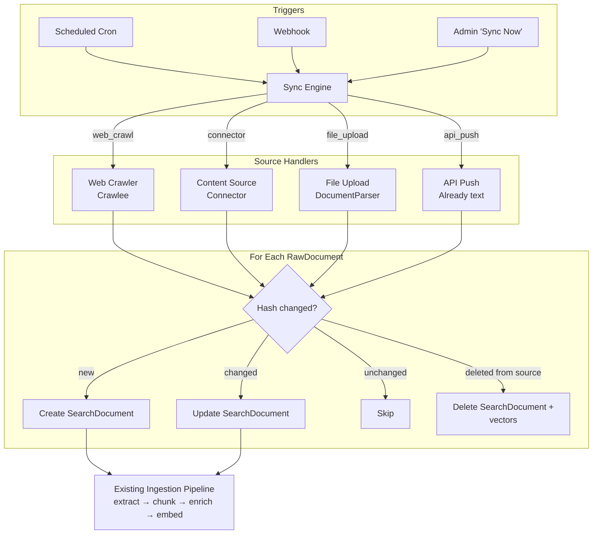

---

## 11. API Endpoints

### 11.1 Attachment Routes

All routes mounted under `/api/projects/:projectId/sessions/:sessionId/attachments`.

**Middleware by auth type** (see [Centralized Auth Design §9](2026-02-22-centralized-auth-design.md#9-route-middleware-composition)):

| Auth Type | Middleware Chain                                                                               |
| --------- | ---------------------------------------------------------------------------------------------- |
| User JWT  | `createUnifiedAuthMiddleware()` → `requireProjectPermission('attachment:read\|write\|delete')` |
| SDK Token | `createUnifiedAuthMiddleware()` → `requireSessionOwnership()`                                  |
| API Key   | `createUnifiedAuthMiddleware()` → `requireProjectScope()`                                      |

```typescript
// apps/runtime/src/routes/attachments.ts

// Pre-upload (separate from message)
POST   /api/projects/:projectId/sessions/:sessionId/attachments
       Content-Type: multipart/form-data
       Body: file (binary), metadata (JSON)
       Response: { attachmentId, status: 'accepted', scanStatus: 'pending', processingStatus: 'pending' }

// Inline upload (with message) — extends existing chat endpoint
POST   /api/projects/:projectId/sessions/:sessionId/messages
       Content-Type: multipart/form-data
       Body: message (JSON), files[] (binary)

// Download
GET    /api/projects/:projectId/attachments/:attachmentId/download
       Response: 302 redirect to presigned URL
       Query: ?variant=original|resized|thumbnail (default: original)

// Get attachment metadata + processed content
GET    /api/projects/:projectId/attachments/:attachmentId
       Response: { id, filename, category, mimeType, sizeBytes, processingStatus, processedContent, ... }

// List attachments for session
GET    /api/projects/:projectId/sessions/:sessionId/attachments
       Query: ?category=image&status=completed&limit=50&offset=0
       Response: { attachments: [...], total: number }

// Delete attachment
DELETE /api/projects/:projectId/attachments/:attachmentId
       Response: 204 (cascades: file + metadata + search vectors)

// Get processing status
GET    /api/projects/:projectId/attachments/:attachmentId/status
       Response: { scanStatus, processingStatus, embeddingStatus, processingError }
```

### 11.2 KB Push Route

```typescript
// apps/search-ai/src/routes/push.ts — NEW

// Push documents to a KB source
POST   /api/projects/:projectId/knowledge-bases/:kbId/push
       Auth: KB-scoped API key
       Body: { documents: [{ id, title, content, url?, metadata? }] }
       Response: { accepted: number, rejected: number, errors: [...] }
```

### 11.3 Endpoint Flow Diagrams

**Pre-upload flow:**

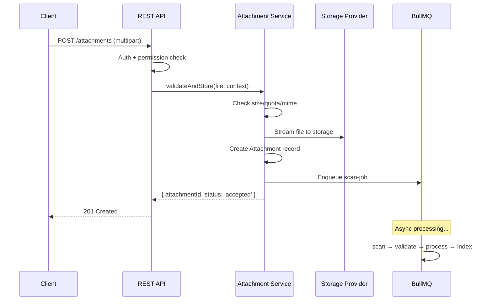

**Inline upload flow:**

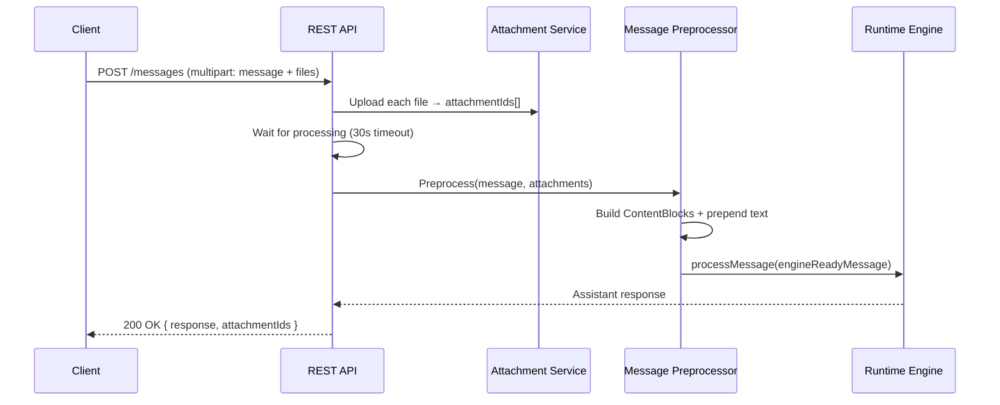

---

## 12. Channel Integration

### 12.1 Ingestion Contract

Every channel normalizes its input to a common `AttachmentInput`:

```typescript
// packages/shared/src/attachments/types.ts

interface AttachmentInput {
  source:
    | { type: 'stream'; stream: Readable; filename: string; mimeType: string; sizeBytes: number }
    | { type: 'base64'; data: string; filename: string; mimeType: string }
    | { type: 'url'; url: string; filename?: string };

  tenantId: string;
  projectId: string;
  sessionId: string;
  messageId?: string;
  channel: string;
}
```

### 12.2 Channel-Specific Normalization

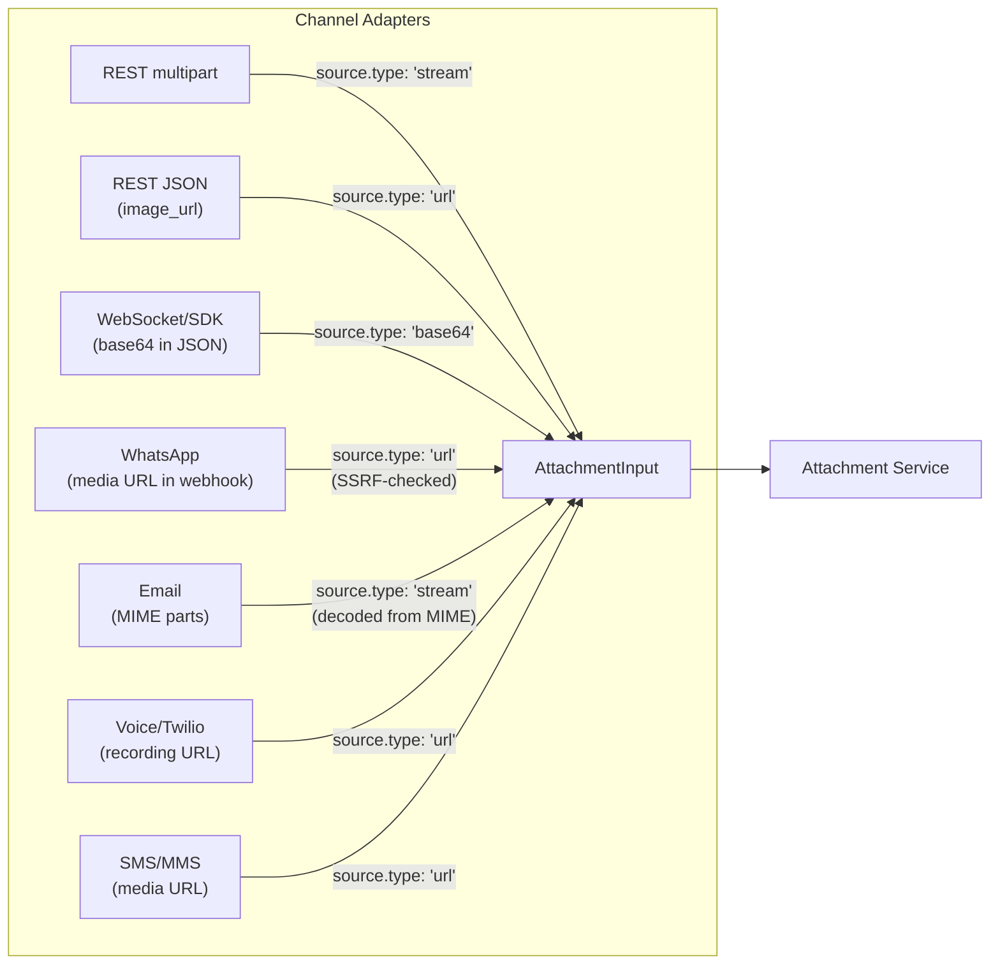

| Channel        | Attachment arrives as            | Normalized to           | Notes                                                |
| -------------- | -------------------------------- | ----------------------- | ---------------------------------------------------- |
| REST multipart | `multipart/form-data` file parts | `source.type: 'stream'` | Direct stream from multer                            |
| REST JSON      | `image_url` in content blocks    | `source.type: 'url'`    | SSRF-checked before download                         |
| WebSocket/SDK  | Base64 string in JSON message    | `source.type: 'base64'` | Decoded to buffer, then streamed                     |
| WhatsApp       | Media URL from webhook           | `source.type: 'url'`    | Downloaded server-side with auth header + SSRF check |
| Email          | MIME attachment parts            | `source.type: 'stream'` | Decoded from base64/quoted-printable MIME            |
| Voice (Twilio) | Recording URL in callback        | `source.type: 'url'`    | Downloaded from Twilio's recording storage           |
| SMS (MMS)      | Media URL in webhook             | `source.type: 'url'`    | Downloaded from carrier's MMS storage                |

**Rule:** Channel adapters ONLY normalize format. They do NOT validate, scan, store, or process. That's the Attachment Service's job.

### 12.3 WebSocket Message Extension

```typescript
// Extend existing WebSocket message format for SDK channel
interface WSMessage {
  type: 'message';
  content: string;
  attachments?: Array<{
    filename: string;
    mimeType: string;
    data: string; // base64
  }>;
}
```

---

## 13. Integration Points & Boundaries

### 13.1 Complete Data Flow Map

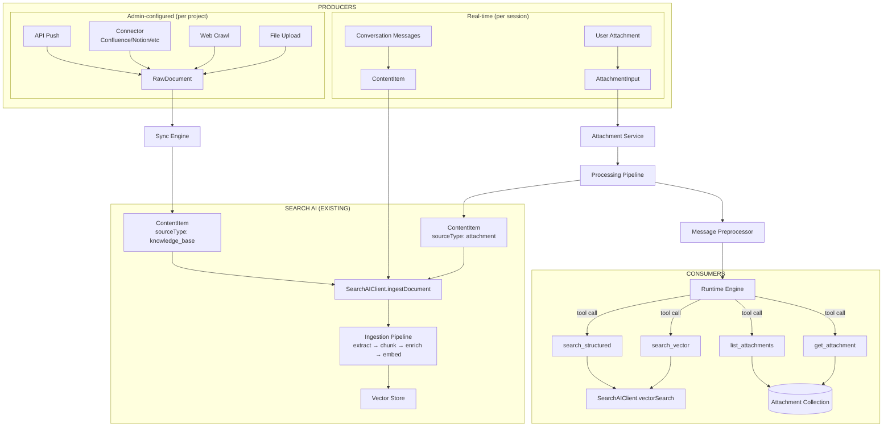

### 13.2 Interaction Map

```
Attachment Pipeline ──produces──▶ ContentItem ──ingests──▶ Search AI
Conversation Store  ──produces──▶ ContentItem ──ingests──▶ Search AI (future)
KB Sync Engine      ──produces──▶ ContentItem ──ingests──▶ Search AI

════════════════════════════════════════════════════════

Agent (LLM) ──tool call──▶ search_vector       ──queries──▶ Search AI
Agent (LLM) ──tool call──▶ search_structured   ──queries──▶ Search AI
Agent (LLM) ──tool call──▶ get_attachment      ──queries──▶ MongoDB
Agent (LLM) ──tool call──▶ list_attachments    ──queries──▶ MongoDB

════════════════════════════════════════════════════════

User message + attachments ──preprocess──▶ MessagePreprocessor
MessagePreprocessor ──reads──▶ Attachment (MongoDB)
MessagePreprocessor ──reads──▶ StorageProvider (presigned URLs)
MessagePreprocessor ──produces──▶ EngineReadyMessage ──enters──▶ Engine

MessagePreprocessor NEVER calls Search AI

════════════════════════════════════════════════════════

Session deletion cascades:
  → AttachmentService.deleteBySession(sessionId)
      → StorageProvider.deleteMany(prefix)
      → Attachment.deleteMany({ sessionId })
  → SearchAIClient (delete documents with sourceType: 'attachment', sessionId)
  → MessageStore.deleteBySession(sessionId)
```

### 13.3 Boundary Ownership Matrix

| Boundary                   | Owner                      | Knows About                                        | Does NOT Know About                   |
| -------------------------- | -------------------------- | -------------------------------------------------- | ------------------------------------- |
| **Channel adapters**       | Per-channel code           | Raw input format, auth, normalization              | Storage, scanning, processing, engine |
| **Attachment Service**     | `AttachmentService`        | Validation, dedup, storage, job enqueueing         | LLM, engine, search queries           |
| **Processing Pipeline**    | BullMQ jobs                | File transformation (sharp, Tika, Whisper, FFmpeg) | Engine, channels, search              |
| **MessagePreprocessor**    | Adapter                    | Attachment records, ContentBlock construction      | Storage internals, embedding          |
| **Engine**                 | RuntimeExecutor            | `ContentBlock[]`, tool definitions, tool results   | Files, storage, scanning, embedding   |
| **AttachmentToolExecutor** | Tool executor              | Attachment metadata, MongoDB queries               | Engine internals, search internals    |
| **Search AI**              | Existing `apps/search-ai/` | Ingestion, chunking, embedding, indexing           | Attachment processing, channels       |

### 13.4 Dependency Direction

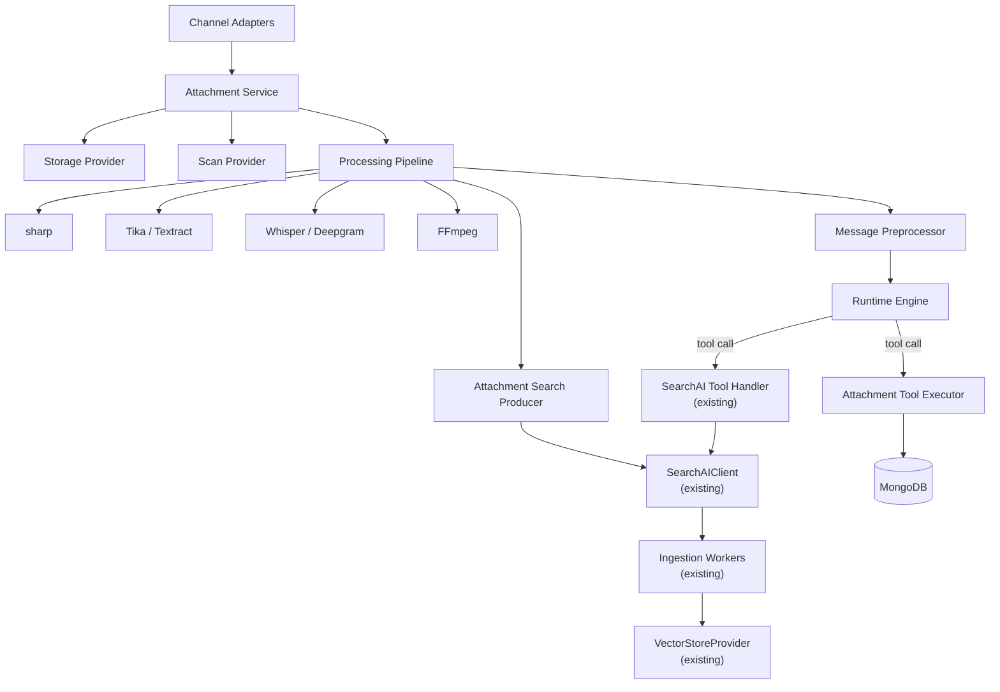

**No component points upward.** Clean unidirectional dependency flow.

---

## 14. Library & Service Evaluation

### 14.1 Complete Evaluation Matrix

#### Storage

| Option                                         | Type        | License     | Best For                   |
| ---------------------------------------------- | ----------- | ----------- | -------------------------- |
| AWS S3 (`@aws-sdk/client-s3` v3)               | Commercial  | Proprietary | AWS production             |
| Google Cloud Storage (`@google-cloud/storage`) | Commercial  | Proprietary | GCP production             |
| Azure Blob Storage (`@azure/storage-blob`)     | Commercial  | Proprietary | Azure production           |
| MinIO (`minio` npm or `@aws-sdk/client-s3`)    | Open source | AGPL-3.0    | Self-hosted / multi-cloud  |
| MongoDB GridFS (`mongoose` GridFS bucket)      | Built-in    | Apache-2.0  | Small deployments, testing |
| Local filesystem (`fs.promises`)               | Built-in    | —           | Development only           |

#### Virus Scanning

| Option                      | Type        | License     | Cost                        | Notes                                   |
| --------------------------- | ----------- | ----------- | --------------------------- | --------------------------------------- |
| ClamAV (`clamscan` npm)     | Open source | GPL-2.0     | Free                        | Self-hosted, ~1 GB RSS, signature-based |
| VirusTotal API              | Commercial  | Proprietary | Free tier limited; $10k+/yr | 70+ engines, files leave infra          |
| AWS GuardDuty S3 Protection | Commercial  | Proprietary | ~$0.60/GB                   | AWS-only, EventBridge integration       |

#### Image Processing

| Option     | Type        | License     | Notes                                                                     |
| ---------- | ----------- | ----------- | ------------------------------------------------------------------------- |
| **sharp**  | Open source | Apache-2.0  | **Selected.** Fastest (libvips), EXIF strip, resize, WebP/AVIF, streaming |
| Jimp       | Open source | MIT         | Pure JS, 10-50x slower                                                    |
| Cloudinary | Commercial  | Proprietary | SaaS, per-transform pricing                                               |

#### Document Parsing

| Option                         | Type                     | License     | Formats               | Cost               |
| ------------------------------ | ------------------------ | ----------- | --------------------- | ------------------ |
| Apache Tika                    | Open source              | Apache-2.0  | 1000+                 | Free (JVM ~500 MB) |
| AWS Textract                   | Commercial               | Proprietary | PDF, images, forms    | ~$1.50/1000 pages  |
| Google Document AI             | Commercial               | Proprietary | PDF, images, forms    | ~$1.50/1000 pages  |
| Azure AI Document Intelligence | Commercial               | Proprietary | PDF, images, forms    | ~$1.00/1000 pages  |
| Unstructured.io                | Open source + Commercial | Apache-2.0  | PDF, DOCX, PPTX, HTML | Free (self-hosted) |

#### Audio Transcription

| Option                | Type        | License     | Cost         | Notes                          |
| --------------------- | ----------- | ----------- | ------------ | ------------------------------ |
| faster-whisper        | Open source | MIT         | Free (+GPU)  | Best open-source, 99 languages |
| Deepgram              | Commercial  | Proprietary | ~$0.0043/min | Fastest API                    |
| Google Speech-to-Text | Commercial  | Proprietary | ~$0.016/min  | 125+ languages                 |
| AWS Transcribe        | Commercial  | Proprietary | ~$0.024/min  | PII redaction built-in         |
| Azure Speech Services | Commercial  | Proprietary | ~$0.016/min  | Custom models                  |
| AssemblyAI            | Commercial  | Proprietary | ~$0.0037/min | LLM-powered                    |

#### Video Processing

| Option                       | Type        | License  | Notes                                       |
| ---------------------------- | ----------- | -------- | ------------------------------------------- |
| **FFmpeg** (`fluent-ffmpeg`) | Open source | LGPL/GPL | **Selected.** Industry standard, all codecs |

#### Web Crawling

| Option      | Type                     | License     | Notes                                                       |
| ----------- | ------------------------ | ----------- | ----------------------------------------------------------- |
| **Crawlee** | Open source              | Apache-2.0  | **Selected.** TypeScript-native, Cheerio + Playwright modes |
| Firecrawl   | Open source + Commercial | AGPL-3.0    | Clean markdown output, self-hostable                        |
| Jina Reader | Commercial               | Proprietary | URL → markdown API                                          |

#### Vector Store (Search AI SDK extensions)

| Option          | Type                  | License      | Hybrid                | Notes                         |
| --------------- | --------------------- | ------------ | --------------------- | ----------------------------- |
| Qdrant          | Open source           | Apache-2.0   | Sparse+dense          | **Existing.** Implemented.    |
| AWS OpenSearch  | Open source + Managed | Apache-2.0   | Native RRF            | **New.** Enterprise standard. |
| Azure AI Search | Commercial            | Proprietary  | Native + re-rank      | **New.** Best hybrid quality. |
| Elasticsearch   | Open source           | SSPL/Elastic | RRF 8.x+              | **New.** Largest ecosystem.   |
| Weaviate        | Open source           | BSD-3        | Native hybrid         | **New.** Simple API.          |
| Milvus / Zilliz | Open source           | Apache-2.0   | Sparse+dense          | **New.** GPU-accelerated.     |
| MongoDB Atlas   | Commercial            | Proprietary  | $vectorSearch+$search | **New.** Zero extra infra.    |
| ChromaDB        | Open source           | Apache-2.0   | Vector only           | **New.** Dev/testing.         |

#### Embedding (Search AI SDK extensions)

| Option                        | Type        | License     | Dimensions | Cost              |
| ----------------------------- | ----------- | ----------- | ---------- | ----------------- |
| OpenAI text-embedding-3-small | Commercial  | Proprietary | 1536       | ~$0.02/1M tokens  |
| **Existing.** Implemented.    |             |             |            |                   |
| Voyage voyage-3               | Commercial  | Proprietary | 1024       | ~$0.06/1M tokens  |
| Cohere embed-v4               | Commercial  | Proprietary | 1024       | ~$0.10/1M tokens  |
| Google text-embedding-005     | Commercial  | Proprietary | 768        | ~$0.025/1M tokens |
| AWS Titan Embeddings          | Commercial  | Proprietary | 1024/1536  | ~$0.02/1M tokens  |
| fastembed (Qdrant)            | Open source | Apache-2.0  | Varies     | Free              |
| Ollama                        | Open source | MIT         | Varies     | Free (+hardware)  |

#### Re-ranking

| Option             | Type       | License     | Cost                |
| ------------------ | ---------- | ----------- | ------------------- |
| Cohere Rerank v3.5 | Commercial | Proprietary | ~$2/1000 searches   |
| Voyage Rerank      | Commercial | Proprietary | ~$0.05/1M tokens    |
| Jina Reranker      | Commercial | Proprietary | ~$0.02/1000 queries |

#### Connectors

| Provider     | Library               | Auth                               |
| ------------ | --------------------- | ---------------------------------- |
| Confluence   | Atlassian REST API v2 | OAuth 2.0 / API token              |
| Notion       | `@notionhq/client`    | OAuth 2.0 / integration token      |
| SharePoint   | Microsoft Graph API   | Azure AD OAuth 2.0                 |
| Google Drive | `googleapis`          | Google OAuth 2.0 / service account |
| Zendesk      | Zendesk REST API      | API token / OAuth                  |
| Salesforce   | `jsforce`             | OAuth 2.0                          |
| GitBook      | GitBook REST API      | API token                          |
| Intercom     | Intercom REST API     | OAuth 2.0                          |

Optional middleware: **Nango** (ELv2) for unified OAuth management + 250+ connectors.

---

## 15. Codebase Structure

### 15.1 New App: `apps/multimodal-service/` (Separate Container)

Follows the `apps/search-ai/` pattern: Express app with inline BullMQ workers, own `package.json`, own Dockerfile.

```
apps/multimodal-service/
  package.json                             # @agent-platform/multimodal-service
  tsconfig.json
  vitest.config.ts
  Dockerfile

  src/
    index.ts                               # Entry point
    server.ts                              # Express app + BullMQ workers init
    config.ts                              # Environment config

    services/
      multimodal-service.ts                # Lifecycle orchestrator (Boundary 2)
      attachment-search-producer.ts        # Feeds into existing Search AI

    storage/
      storage-factory.ts                   # Factory
      s3-storage.ts                        # AWS S3
      gcs-storage.ts                       # Google Cloud Storage
      azure-blob-storage.ts               # Azure Blob
      minio-storage.ts                     # MinIO (S3-compatible)
      gridfs-storage.ts                    # MongoDB GridFS
      local-storage.ts                     # Local FS (dev only)

    scanning/
      clamav-scanner.ts                    # ClamAV daemon
      virustotal-scanner.ts                # VirusTotal API

    processing/
      image-processor.ts                   # sharp: EXIF strip, resize, thumbnail
      document-parser-tika.ts              # Apache Tika HTTP
      document-parser-textract.ts          # AWS Textract
      document-parser-azure.ts             # Azure Document Intelligence
      document-parser-google.ts            # Google Document AI
      document-parser-unstructured.ts      # Unstructured.io
      transcriber-whisper.ts               # faster-whisper HTTP
      transcriber-deepgram.ts              # Deepgram API
      transcriber-google.ts                # Google STT
      transcriber-aws.ts                   # AWS Transcribe
      transcriber-azure.ts                 # Azure Speech
      transcriber-assemblyai.ts            # AssemblyAI
      video-processor-ffmpeg.ts            # FFmpeg implementation

    security/
      mime-validator.ts                    # Magic-byte MIME detection
      ssrf-validator.ts                    # URL safety for URL-referenced attachments
      upload-rate-limiter.ts               # Per-tenant rate limiting

    jobs/
      queues.ts                            # BullMQ queue definitions
      scan-job.ts                          # BullMQ: virus scan
      validate-job.ts                      # BullMQ: MIME validation
      process-job.ts                       # BullMQ: category-specific transform
      index-job.ts                         # BullMQ: feed into Search AI
      cleanup-job.ts                       # BullMQ: cascade delete

    routes/
      attachments.ts                       # Internal REST: upload, download, status, list, delete
      health.ts                            # Health check endpoint

    __tests__/                             # All unit tests colocated
```

### 15.2 Shared Packages (NEW)

```
packages/database/src/models/
  attachment.model.ts                      # Attachment MongoDB model

packages/shared/src/attachments/
  types.ts                                 # AttachmentInput, AttachmentConfig, etc.
  interfaces/
    storage-provider.ts                    # StorageProvider interface
    scan-provider.ts                       # ScanProvider interface
    document-parser.ts                     # DocumentParser interface
    transcription-provider.ts              # TranscriptionProvider interface
    video-processor.ts                     # VideoProcessor interface
  interfaces.ts                            # Re-exports all interfaces
  index.ts                                 # Barrel re-export
```

### 15.3 Runtime Extensions (EXTEND existing `apps/runtime/`)

Files that remain in the runtime because they interact with the engine:

```
apps/runtime/src/
  attachments/
    message-preprocessor.ts                # Boundary 4: fetches data from multimodal-service,
                                           # converts to ContentBlock[] for engine
    multimodal-service-client.ts           # HTTP client for multimodal-service internal API

  tools/
    attachment-tool-executor.ts            # get_attachment, list_attachments agent tools
                                           # (queries multimodal-service via HTTP client)

  services/search-ai/
    search-ai-tool-handler.ts              # EXTEND: register get_attachment, list_attachments
    search-ai-tool-executor.ts             # EXTEND: route new tools
```

### 15.4 Extended Files

```
# Search AI SDK extensions (EXTEND existing)
packages/search-ai-sdk/src/
  vector-store/
    factory.ts                             # EXTEND: register new providers
    opensearch.ts                          # NEW implementation
    azure-ai-search.ts                     # NEW implementation
    elasticsearch.ts                       # NEW implementation
    weaviate.ts                            # NEW implementation
    milvus.ts                              # NEW implementation
    mongodb-atlas.ts                       # NEW implementation
    chromadb.ts                            # NEW implementation

  embedding/
    factory.ts                             # EXTEND: register new providers
    cohere.ts                              # NEW (implement existing stub)
    voyage.ts                              # NEW implementation
    google.ts                              # NEW implementation
    aws-titan.ts                           # NEW implementation
    fastembed.ts                           # NEW implementation
    ollama.ts                              # NEW implementation

  reranking/                               # NEW directory
    interface.ts                           # RerankerProvider interface
    cohere-reranker.ts                     # Cohere Rerank
    voyage-reranker.ts                     # Voyage Rerank
    jina-reranker.ts                       # Jina Reranker

# Search AI app extensions (EXTEND existing)
apps/search-ai/src/
  services/extraction/
    pdf-extractor.ts                       # NEW (implement existing stub)
    docx-extractor.ts                      # NEW (implement existing stub)

  crawlers/                                # NEW directory
    web-crawler.ts                         # Crawlee-based

  connectors/                              # NEW directory
    connector-factory.ts
    confluence-connector.ts
    notion-connector.ts
    sharepoint-connector.ts
    google-drive-connector.ts
    zendesk-connector.ts
    salesforce-connector.ts
    gitbook-connector.ts
    intercom-connector.ts

  sync/                                    # NEW directory
    sync-engine.ts
    sync-scheduler.ts                      # BullMQ repeatable jobs

  routes/
    documents.ts                           # EXTEND: add multipart file upload to existing text ingest
    push.ts                                # NEW: API push endpoint

# Compiler extensions (EXTEND existing)
packages/compiler/src/platform/llm/
  types.ts                                 # EXTEND: add ImageContent to ContentBlock union

# SearchDocument model extension
packages/database/src/models/
  search-document.model.ts                 # EXTEND: add file storage reference fields

# Message model extension
packages/database/src/models/
  message.model.ts                         # EXTEND: add attachmentIds field
```

---

## 16. Testing Strategy

### 16.1 Unit Tests

| Component                    | Test File                            | Coverage                                                   |
| ---------------------------- | ------------------------------------ | ---------------------------------------------------------- |
| `AttachmentService`          | `multimodal-service.test.ts`         | Validate, dedup, quota enforcement, lifecycle              |
| `MessagePreprocessor`        | `message-preprocessor.test.ts`       | ContentBlock construction, timeout handling, fallback text |
| `ImageProcessor`             | `image-processor.test.ts`            | EXIF strip, resize dimensions, thumbnail generation        |
| Each `StorageProvider`       | `{provider}-storage.test.ts`         | Upload/download/delete/signedUrl with mocked clients       |
| Each `ScanProvider`          | `{provider}-scanner.test.ts`         | Clean/infected/error responses                             |
| Each `DocumentParser`        | `{provider}-parser.test.ts`          | Text extraction accuracy                                   |
| Each `TranscriptionProvider` | `{provider}-transcriber.test.ts`     | Transcript output format                                   |
| `AttachmentToolExecutor`     | `attachment-tool-executor.test.ts`   | Tool call routing, tenant isolation                        |
| `AttachmentSearchProducer`   | `attachment-search-producer.test.ts` | ContentItem construction, SearchAIClient calls             |

### 16.2 Authorization Tests

Every ID-based attachment route needs authz tests following the pattern in `apps/runtime/src/__tests__/*-authz.test.ts`. Tests must cover all three auth types and user-level isolation for SDK auth. See [Centralized Auth Design §11](2026-02-22-centralized-auth-design.md#11-testing-strategy) for the full testing matrix.

```typescript
// apps/runtime/src/__tests__/attachment-authz.test.ts

describe('Attachment Authorization — User JWT (Studio)', () => {
  // For each endpoint:
  it('returns 401 for unauthenticated requests');
  it('returns 404 for cross-tenant access'); // NOT 403
  it('returns 404 for cross-project access');
  it('requires correct project permission');
  it('allows tenant owner/admin bypass');
  it('allows project owner');
  it('allows project member with correct permission');
  it('denies project viewer for write operations');
});

describe('Attachment Authorization — SDK Token (End-User)', () => {
  // Session ownership enforcement:
  it("returns 404 when SDK user accesses attachment in another user's session");
  it('allows SDK user to access attachment in their own session');
  it('returns 404 for cross-tenant access via SDK token');
  it('matches session by customerId (tier 2) for verified users');
  it('matches session by channelArtifact (tier 1) for phone/email');
  it('matches session by anonymousId (tier 0) for anonymous users');
  it("SDK user cannot list attachments from other users' sessions");
  it('presigned URL generation requires session ownership');
});

describe('Attachment Authorization — API Key', () => {
  it('requires project-scoped API key');
  it('returns 404 for cross-project access');
  it('API key with project scope can access all sessions in project');
});
```

### 16.3 Integration Tests

| Test                           | What It Validates                                                                                          |
| ------------------------------ | ---------------------------------------------------------------------------------------------------------- |
| Upload → process → engine flow | Full pipeline: upload image → scan → resize → MessagePreprocessor builds ImageContent → engine receives it |
| Upload → process → search flow | Full pipeline: upload PDF → scan → parse → index in Search AI → agent searches and finds it                |
| Session deletion cascade       | Delete session → files removed from storage → attachment records deleted → search vectors deleted          |
| Multi-tenant isolation         | Tenant A uploads file → Tenant B cannot access via any path (download, search, tool)                       |
| Cross-user SDK isolation       | SDK user A uploads attachment → SDK user B (same tenant+project, different session) cannot access it       |
| Rate limiting                  | Exceed upload rate → 429 response                                                                          |
| Virus scan rejection           | Upload infected file → scan catches it → file never available                                              |
| Channel normalization          | Each channel adapter correctly normalizes to AttachmentInput                                               |

---

## 17. Deployment & Configuration

### 17.1 Environment Variables

```bash
# Storage
ATTACHMENT_STORAGE_PROVIDER=minio           # s3 | gcs | azure_blob | minio | gridfs | local
ATTACHMENT_STORAGE_BUCKET=attachments
ATTACHMENT_STORAGE_ENDPOINT=http://minio:9000
ATTACHMENT_STORAGE_ACCESS_KEY=...
ATTACHMENT_STORAGE_SECRET_KEY=...
ATTACHMENT_STORAGE_REGION=us-east-1

# Scanning
ATTACHMENT_SCAN_PROVIDER=clamav             # clamav | virustotal | guardduty
CLAMAV_HOST=clamav
CLAMAV_PORT=3310

# Document parsing
ATTACHMENT_PARSER_PROVIDER=tika             # tika | textract | google_doc_ai | azure_doc_intel
TIKA_URL=http://tika:9998

# Audio transcription
ATTACHMENT_TRANSCRIPTION_PROVIDER=whisper   # whisper | deepgram | google_stt | aws_transcribe | azure_speech | assemblyai
WHISPER_URL=http://whisper:8080

# Processing
ATTACHMENT_MAX_FILE_SIZE_BYTES=26214400     # 25 MB default
ATTACHMENT_MAX_PROCESSING_TIMEOUT_MS=300000 # 5 min
ATTACHMENT_IMAGE_MAX_DIMENSION=2048
ATTACHMENT_VIDEO_MAX_FRAMES=10
```

### 17.2 Infrastructure Requirements

| Component          | Required       | Notes                                                          |
| ------------------ | -------------- | -------------------------------------------------------------- |
| Redis              | Yes (existing) | BullMQ job queue for processing pipeline                       |
| MongoDB            | Yes (existing) | Attachment model, existing Search AI models                    |
| Object Storage     | Yes (new)      | MinIO (default) or cloud provider                              |
| ClamAV             | Yes (new)      | Docker: `clamav/clamav:stable`, sidecar or service             |
| Apache Tika        | Optional (new) | Docker: `apache/tika:latest`, HTTP service                     |
| faster-whisper     | Optional (new) | Docker with GPU, HTTP service                                  |
| FFmpeg             | Optional (new) | Installed in multimodal-service container for video processing |
| multimodal-service | Yes (new)      | New container: `apps/multimodal-service/`                      |

### 17.3 Docker Compose Addition

```yaml
services:
  multimodal-service:
    build:
      context: .
      dockerfile: apps/multimodal-service/Dockerfile
    ports:
      - '3006:3006'
    environment:
      PORT: 3006
      MONGODB_URI: mongodb://mongo:27017/abl-platform
      REDIS_URL: redis://redis:6379
      ATTACHMENT_STORAGE_PROVIDER: minio
      ATTACHMENT_STORAGE_BUCKET: attachments
      ATTACHMENT_STORAGE_ENDPOINT: http://minio:9000
      ATTACHMENT_STORAGE_ACCESS_KEY: minioadmin
      ATTACHMENT_STORAGE_SECRET_KEY: minioadmin
      ATTACHMENT_SCAN_PROVIDER: clamav
      CLAMAV_HOST: clamav
      CLAMAV_PORT: 3310
      TIKA_URL: http://tika:9998
    depends_on:
      - mongo
      - redis
      - minio
      - clamav

  minio:
    image: minio/minio:latest
    command: server /data --console-address ":9001"
    ports:
      - '9000:9000'
      - '9001:9001'
    environment:
      MINIO_ROOT_USER: minioadmin
      MINIO_ROOT_PASSWORD: minioadmin
    volumes:
      - minio_data:/data

  clamav:
    image: clamav/clamav:stable
    ports:
      - '3310:3310'
    volumes:
      - clamav_data:/var/lib/clamav

  tika:
    image: apache/tika:latest
    ports:
      - '9998:9998'
```

### 17.4 Runtime Environment Additions

The runtime needs to know where the attachment service lives:

```bash
# Attachment service URL (internal, same cluster)
MULTIMODAL_SERVICE_URL=http://multimodal-service:3006
```

---

## 18. Migration & Rollout

### 18.1 Phases

**Phase 1: Foundation (Storage + Security)**

- Attachment model + migration
- StorageProvider interface + MinIO, S3, GCS, Azure, GridFS, local implementations
- ScanProvider interface + ClamAV
- MIME validation with `file-type`
- Upload/download/list API endpoints
- Rate limiting

**Phase 2: Processing Pipeline**

- BullMQ job setup (scan → validate → process → index)
- Image processing with sharp (EXIF strip, resize, thumbnail)
- Document parsing with Tika (implement PDF/DOCX extraction stubs)
- MessagePreprocessor (images as ContentBlocks, text prepend for docs)
- Trace events for attachment lifecycle

**Phase 3: Audio + Video**

- TranscriptionProvider + Whisper implementation
- VideoProcessor + FFmpeg implementation
- Commercial transcription providers (Deepgram, Google, AWS, Azure, AssemblyAI)

**Phase 4: Search AI Integration**

- AttachmentSearchProducer → existing ingestion pipeline
- Index attachments as SearchDocuments
- Attachment content findable via existing search_vector/search_structured tools
- get_attachment + list_attachments agent tools
- Session deletion cascade to search vectors

**Phase 5: Search AI Provider Extensions**

- VectorStoreProvider: OpenSearch, Azure AI Search, Elasticsearch, Weaviate, Milvus, MongoDB Atlas, ChromaDB
- EmbeddingProvider: Voyage, Cohere, Google, AWS Titan, fastembed, Ollama
- RerankerProvider: Cohere, Voyage, Jina
- Additional DocumentParser providers (Textract, Google, Azure, Unstructured)

**Phase 6: KB Source Extensions**

- SearchDocument model extension (file storage reference fields)
- KB file upload upgrade: multipart ingestion endpoint + Studio UI file picker
- ContentSourceConnector interface + implementations (Confluence, Notion, SharePoint, Google Drive, Zendesk, Salesforce, GitBook, Intercom)
- Web crawler with Crawlee
- API push endpoint
- Sync engine with scheduling (BullMQ repeatable jobs)

**Phase 7: Channel Integration**

- WebSocket/SDK attachment support
- WhatsApp media handling
- Email attachment handling
- Voice recording handling
- SMS/MMS media handling

### 18.2 Database Migration

```typescript
// Add attachmentIds to Message model
db.messages.updateMany({}, { $set: { attachmentIds: [] } });

// Create Attachment collection with indexes
// (handled by Mongoose model registration)

// Create TTL index for auto-cleanup
db.attachments.createIndex({ expiresAt: 1 }, { expireAfterSeconds: 0, sparse: true });

// Add file storage fields to existing SearchDocument collection
// (no data migration needed — all new fields are nullable, null for existing text-pasted docs)
db.searchdocuments.updateMany(
  { fileStorageKey: { $exists: false } },
  {
    $set: {
      fileStorageKey: null,
      fileStorageBucket: null,
      fileMimeType: null,
      fileSizeBytes: null,
      fileContentHash: null,
      fileUploadedAt: null,
    },
  },
);
// Dedup index for file uploads within an index
db.searchdocuments.createIndex({ tenantId: 1, indexId: 1, fileContentHash: 1 }, { sparse: true });
```

### 18.3 Backward Compatibility

- Existing messages without `attachmentIds` field default to `[]`
- Existing `image_url` content blocks in REST chat endpoint continue to work (normalized to `source.type: 'url'` AttachmentInput)
- Existing SearchDocuments without file storage fields default to `null` — text-pasted documents continue to work unchanged
- Existing text-paste ingestion endpoint (`POST /:indexId/documents/ingest` with JSON body) continues to work alongside new multipart upload
- No changes to existing Search AI pipeline core — new content enters through existing ingestion API
- No changes to existing agent tools — attachment content found via existing search tools
- Engine continues to work with text-only messages unchanged

---

## Appendix A: Complete Component Summary

| Layer          | Component        | Status                | Default                          | Deployed In          | Interface                        |
| -------------- | ---------------- | --------------------- | -------------------------------- | -------------------- | -------------------------------- |
| **Storage**    | File storage     | NEW                   | MinIO                            | `multimodal-service` | `StorageProvider`                |
| **Security**   | Virus scan       | NEW                   | ClamAV                           | `multimodal-service` | `ScanProvider`                   |
| **Security**   | MIME detection   | NEW                   | `file-type`                      | `multimodal-service` | Direct                           |
| **Security**   | Rate limiting    | NEW                   | `rate-limiter-flexible`          | `multimodal-service` | Direct                           |
| **Processing** | Image            | NEW                   | `sharp`                          | `multimodal-service` | Direct                           |
| **Processing** | Document         | NEW + EXTEND stubs    | Apache Tika                      | `multimodal-service` | `DocumentParser`                 |
| **Processing** | Audio            | NEW                   | faster-whisper                   | `multimodal-service` | `TranscriptionProvider`          |
| **Processing** | Video            | NEW                   | FFmpeg                           | `multimodal-service` | `VideoProcessor`                 |
| **Engine**     | ContentBlock     | EXTEND                | +`ImageContent`                  | `runtime`            | Existing union type              |
| **Engine**     | Preprocessor     | NEW                   | `MessagePreprocessor`            | `runtime`            | `MessagePreprocessor`            |
| **Engine**     | Attachment tools | NEW                   | get_attachment, list_attachments | `runtime`            | `AttachmentToolExecutor`         |
| **Engine**     | Service client   | NEW                   | HTTP client                      | `runtime`            | `MultimodalServiceClient`        |
| **Search AI**  | Vector store     | EXTEND factory        | Qdrant (exists)                  | `search-ai`          | `VectorStoreProvider` (existing) |
| **Search AI**  | Embedding        | EXTEND factory        | OpenAI (exists)                  | `search-ai`          | `EmbeddingProvider` (existing)   |
| **Search AI**  | Re-ranking       | NEW                   | None                             | `search-ai`          | `RerankerProvider`               |
| **Search AI**  | Chunking         | EXISTS                | Fixed + semantic + sliding       | `search-ai`          | `ChunkingService` (existing)     |
| **Search AI**  | Ingestion        | EXISTS (minor extend) | 5-stage BullMQ                   | `search-ai`          | Existing workers                 |
| **KB**         | Web crawling     | NEW                   | Crawlee                          | `search-ai`          | Direct                           |
| **KB**         | Connectors       | NEW                   | Native (top 8)                   | `search-ai`          | `ContentSourceConnector`         |
| **KB**         | API push         | NEW                   | —                                | `search-ai`          | REST endpoint                    |
| **KB**         | Sync             | NEW                   | BullMQ repeatable                | `search-ai`          | `SyncEngine`                     |
| **KB**         | File uploads     | EXTEND                | Multipart upload endpoint        | `search-ai`          | REST endpoint (extend existing)  |
| **Infra**      | Job queue        | EXISTS                | BullMQ                           | `multimodal-service` | Direct                           |
| **Data**       | Attachment model | NEW                   | Mongoose                         | `packages/database`  | Existing Mongoose model          |
| **Data**       | SearchDocument   | EXTEND                | +file storage ref fields         | `packages/database`  | Existing Mongoose model          |

---

## Implementation Plan

> **For Claude:** REQUIRED SUB-SKILL: Use superpowers:executing-plans to implement this plan task-by-task.

**Goal:** Build a multimodal attachment pipeline that handles file uploads across all channels, processes them (scan, parse, transcribe), integrates with the runtime engine (ImageContent blocks), and feeds content into the existing Search AI platform for semantic retrieval.

**Architecture:** A **separate Attachment Service** (`apps/multimodal-service/`) handles file lifecycle (upload → store → scan → transform → index) as an independent container, following the `apps/search-ai/` precedent. The runtime communicates with it via internal HTTP REST. The engine only learns about `ImageContent` blocks — all other file types are pre-processed to text. Processed content enters the existing `apps/search-ai/` ingestion pipeline via `SearchAIClient`. Session attachments and KB file uploads share infrastructure (`StorageProvider`, `ScanProvider`, `DocumentParser`) but use separate domain models.

**Why separate?** Runtime is ~500MB with 30 pods; adding sharp+FFmpeg+Tika would add 300-500MB per pod = 9-15GB wasted cluster memory. Independent scaling, failure isolation, focused container images.

**Tech Stack:** TypeScript, Mongoose (MongoDB), BullMQ (Redis), Express (HTTP API), sharp (images), Apache Tika (docs), faster-whisper (audio), FFmpeg (video), multer (uploads), file-type (MIME detection), clamscan (virus scanning), rate-limiter-flexible (rate limiting)

**Design Doc:** `docs/plans/2026-02-21-attachment-pipeline-design.md` — contains all interfaces, data models, diagrams, and evaluation tables.

---

## Phase 0: Service Scaffolding

### Task 0: Scaffold `apps/multimodal-service/` App

**Files:**

- Create: `apps/multimodal-service/package.json`
- Create: `apps/multimodal-service/tsconfig.json`
- Create: `apps/multimodal-service/vitest.config.ts`
- Create: `apps/multimodal-service/src/index.ts`
- Create: `apps/multimodal-service/src/server.ts`
- Create: `apps/multimodal-service/src/config.ts`
- Create: `apps/multimodal-service/Dockerfile`

**Context:** Follow the `apps/search-ai/` pattern exactly: Express app with CORS, compression, helmet, auth middleware from `@agent-platform/shared`. Uses same Redis, MongoDB, shared database models. BullMQ workers init inline in server.ts. Port: 3006.

**Step 1: Create package.json**

```json
{
  "name": "@agent-platform/multimodal-service",
  "version": "1.0.0",
  "private": true,
  "type": "module",
  "description": "Attachment Service - file upload, storage, scanning, processing pipeline",
  "main": "dist/index.js",
  "scripts": {
    "dev": "NODE_ENV=development tsx watch src/index.ts",
    "build": "tsc",
    "start": "node dist/index.js",
    "typecheck": "tsc --noEmit",
    "test": "vitest run",
    "test:watch": "vitest",
    "test:coverage": "vitest run --coverage"
  },
  "dependencies": {
    "@agent-platform/config": "workspace:*",
    "@agent-platform/database": "workspace:*",
    "@agent-platform/shared": "workspace:*",
    "bullmq": "^5.0.0",
    "compression": "^1.8.1",
    "cors": "^2.8.5",
    "dotenv": "^17.2.3",
    "express": "^4.18.2",
    "helmet": "^8.1.0",
    "ioredis": "^5.7.0",
    "multer": "^1.4.5-lts.1",
    "zod": "^3.25.76"
  },
  "devDependencies": {
    "@types/compression": "^1.8.1",
    "@types/cors": "^2.8.17",
    "@types/express": "^4.17.21",
    "@types/multer": "^1.4.11",
    "@vitest/coverage-v8": "^4.0.18",
    "mongodb-memory-server": "^10.4.0",
    "mongoose": "^8.23.0",
    "tsx": "^4.7.0",
    "typescript": "^5.3.0",
    "vitest": "^4.0.18"
  }
}
```

**Step 2: Create tsconfig.json** — copy from `apps/search-ai/tsconfig.json`, adjust paths

**Step 3: Create vitest.config.ts** — copy from `apps/search-ai/vitest.config.ts`

**Step 4: Create minimal server.ts**

```typescript
// apps/multimodal-service/src/server.ts
import express from 'express';
import cors from 'cors';
import compression from 'compression';
import helmet from 'helmet';
import { config } from './config.js';

const app = express();
app.use(helmet());
app.use(cors());
app.use(compression());
app.use(express.json());

// Health check
app.get('/health', (_req, res) => res.json({ ok: true, service: 'multimodal-service' }));

export { app };
```

**Step 5: Create config.ts** — load env vars for storage, scanning, processing

**Step 6: Create index.ts entry point** — connect MongoDB, Redis, start server on PORT (default 3006)

**Step 7: Create Dockerfile** — multi-stage build following runtime Dockerfile pattern

**Step 8: Install dependencies and verify build**

Run: `pnpm install && pnpm build --filter @agent-platform/multimodal-service`

**Step 9: Commit**

```bash
git add apps/multimodal-service/
git commit -m "[ABLP-2] feat(runtime): scaffold multimodal-service app with Express, BullMQ, Docker"
```

---

## Phase 1: Foundation — Data Models, Storage & Security

### Task 1: Attachment Mongoose Model

**Files:**

- Create: `packages/database/src/models/attachment.model.ts`
- Create: `packages/database/src/__tests__/attachment-model.test.ts`
- Modify: `packages/database/src/index.ts` (add export)

**Context:** Follow the exact pattern from `packages/database/src/models/message.model.ts`: interface → Schema with `uuidv7` `_id` → `tenantIsolationPlugin` → indexes → `model()` export. See design doc §4.1 for the full `IAttachment` interface.

**Step 1: Write the failing test**

```typescript
// packages/database/src/__tests__/attachment-model.test.ts
import { describe, it, expect, beforeAll, afterAll } from 'vitest';
import mongoose from 'mongoose';
import { MongoMemoryServer } from 'mongodb-memory-server';

let mongoServer: MongoMemoryServer;

beforeAll(async () => {
  mongoServer = await MongoMemoryServer.create();
  await mongoose.connect(mongoServer.getUri());
});

afterAll(async () => {
  await mongoose.disconnect();
  await mongoServer.stop();
});

describe('Attachment Model', () => {
  it('creates an attachment with all required fields', async () => {
    const { Attachment } = await import('../models/attachment.model.js');

    const doc = await Attachment.create({
      tenantId: 'tenant-1',
      projectId: 'proj-1',
      sessionId: 'sess-1',
      originalFilename: 'report.pdf',
      mimeType: 'application/pdf',
      detectedMimeType: 'application/pdf',
      category: 'document',
      sizeBytes: 1024,
      contentHash: 'abc123',
      storageProvider: 's3',
      storageKey: 'tenant-1/proj-1/sess-1/att-1/original',
      storageBucket: 'attachments',
    });

    expect(doc._id).toBeDefined();
    expect(doc.tenantId).toBe('tenant-1');
    expect(doc.scanStatus).toBe('pending');
    expect(doc.processingStatus).toBe('pending');
    expect(doc.embeddingStatus).toBe('pending');
    expect(doc.encrypted).toBe(false);
    expect(doc.hasPII).toBe(false);
    expect(doc.exifStripped).toBe(false);
    expect(doc._v).toBe(1);
  });

  it('enforces required fields', async () => {
    const { Attachment } = await import('../models/attachment.model.js');

    await expect(Attachment.create({ tenantId: 'tenant-1' })).rejects.toThrow();
  });

  it('validates category enum', async () => {
    const { Attachment } = await import('../models/attachment.model.js');

    await expect(
      Attachment.create({
        tenantId: 'tenant-1',
        projectId: 'proj-1',
        sessionId: 'sess-1',
        originalFilename: 'test.txt',
        mimeType: 'text/plain',
        detectedMimeType: 'text/plain',
        category: 'invalid_category',
        sizeBytes: 100,
        contentHash: 'hash',
        storageProvider: 's3',
        storageKey: 'key',
        storageBucket: 'bucket',
      }),
    ).rejects.toThrow();
  });

  it('sets TTL index via expiresAt', async () => {
    const { Attachment } = await import('../models/attachment.model.js');

    const doc = await Attachment.create({
      tenantId: 'tenant-1',
      projectId: 'proj-1',
      sessionId: 'sess-1',
      originalFilename: 'photo.jpg',
      mimeType: 'image/jpeg',
      detectedMimeType: 'image/jpeg',
      category: 'image',
      sizeBytes: 5000,
      contentHash: 'img-hash',
      storageProvider: 'local',
      storageKey: 'key',
      storageBucket: 'bucket',
      expiresAt: new Date(Date.now() + 86400000),
    });

    expect(doc.expiresAt).toBeInstanceOf(Date);
  });
});
```

**Step 2: Run test to verify it fails**

Run: `cd packages/database && pnpm vitest run src/__tests__/attachment-model.test.ts`
Expected: FAIL — `Cannot find module '../models/attachment.model.js'`

**Step 3: Implement the Attachment model**

Create `packages/database/src/models/attachment.model.ts` following the interface in design doc §4.1 exactly. Use:

- `_id: { type: String, default: uuidv7 }` (import from `../mongo/base-document.js`)
- `tenantIsolationPlugin` (import from `../mongo/plugins/tenant-isolation.plugin.js`)
- All fields from `IAttachment` with correct types, defaults, and enums
- All 8 indexes from design doc §4.1
- `{ timestamps: true, collection: 'attachments' }`

**Step 4: Add export to package index**

Add `export { Attachment, type IAttachment } from './models/attachment.model.js';` to `packages/database/src/index.ts`.

**Step 5: Run test to verify it passes**

Run: `cd packages/database && pnpm vitest run src/__tests__/attachment-model.test.ts`
Expected: PASS (3 tests)

**Step 6: Commit**

```bash
git add packages/database/src/models/attachment.model.ts packages/database/src/__tests__/attachment-model.test.ts packages/database/src/index.ts
git commit -m "[ABLP-2] feat(runtime): add Attachment Mongoose model with indexes and tenant isolation"
```

---

### Task 2: Shared Attachment Types & Interfaces

**Files:**

- Create: `packages/shared/src/attachments/types.ts`
- Create: `packages/shared/src/attachments/interfaces/storage-provider.ts`
- Create: `packages/shared/src/attachments/interfaces/scan-provider.ts`
- Create: `packages/shared/src/attachments/interfaces/document-parser.ts`
- Create: `packages/shared/src/attachments/interfaces/transcription-provider.ts`
- Create: `packages/shared/src/attachments/interfaces/video-processor.ts`
- Create: `packages/shared/src/attachments/interfaces.ts` (barrel re-export)
- Create: `packages/shared/src/attachments/index.ts` (barrel re-export)
- Modify: `packages/shared/src/index.ts` (add export)

**Context:** These are pure type definitions — no logic, no tests needed. See design doc §5.1, §6.1, §7.4, §7.5, §7.6 for all interfaces, and §12.1 for `AttachmentInput`/`AttachmentConfig`.

**Step 1: Create the type definitions**

Create `packages/shared/src/attachments/types.ts` with:

- `AttachmentInput` (design doc §12.1) — source: stream | base64 | url
- `AttachmentConfig` (design doc §4.3) — per-tenant config
- `AttachmentCategory` type: `'image' | 'document' | 'audio' | 'video'`
- `ScanStatus`, `ProcessingStatus`, `EmbeddingStatus` type literals

Create each interface file with the full interface from the design doc:

- `StorageProvider` (§5.1): upload, download, getSignedUrl, delete, deleteMany, exists, copy, healthCheck
- `ScanProvider` (§6.1): scan, healthCheck
- `DocumentParser` (§7.4): parse, supportedMimeTypes
- `TranscriptionProvider` (§7.5): transcribe, supportedFormats
- `VideoProcessor` (§7.6): extractAudio, extractKeyFrames

Create barrel exports in `interfaces.ts` and `index.ts`.

**Step 2: Add export to shared package**

Add `export * from './attachments/index.js';` to `packages/shared/src/index.ts`.

**Step 3: Verify build**

Run: `pnpm build --filter @agent-platform/shared`
Expected: Build succeeds with no type errors

**Step 4: Commit**

```bash
git add packages/shared/src/attachments/
git commit -m "[ABLP-2] feat(shared): add attachment type definitions and provider interfaces"
```

---

### Task 3: LocalStorageProvider (Dev/Test)

**Files:**

- Create: `apps/multimodal-service/src/storage/storage-provider.ts` (re-export from shared)
- Create: `apps/multimodal-service/src/storage/local-storage.ts`
- Create: `apps/multimodal-service/src/storage/__tests__/local-storage.test.ts`

**Context:** Implement the simplest storage provider first for local dev and tests. Uses `fs.promises` (async only — never sync). All other providers follow this same test pattern.

**Step 1: Write the failing test**

```typescript
// apps/multimodal-service/src/storage/__tests__/local-storage.test.ts
import { describe, it, expect, beforeEach, afterEach } from 'vitest';
import { Readable } from 'stream';
import fs from 'fs/promises';
import path from 'path';
import os from 'os';

describe('LocalStorageProvider', () => {
  let provider: any;
  let tmpDir: string;

  beforeEach(async () => {
    tmpDir = await fs.mkdtemp(path.join(os.tmpdir(), 'att-test-'));
    const { LocalStorageProvider } = await import('../local-storage.js');
    provider = new LocalStorageProvider({ basePath: tmpDir });
  });

  afterEach(async () => {
    await fs.rm(tmpDir, { recursive: true, force: true });
  });

  it('uploads and downloads a file via streams', async () => {
    const content = 'hello world';
    const stream = Readable.from([Buffer.from(content)]);

    const result = await provider.upload({
      key: 'tenant-1/proj-1/sess-1/att-1/original',
      body: stream,
      contentType: 'text/plain',
      sizeBytes: Buffer.byteLength(content),
      metadata: {},
    });

    expect(result.storageKey).toBe('tenant-1/proj-1/sess-1/att-1/original');
    expect(result.etag).toBeDefined();

    const downloaded = await provider.download('tenant-1/proj-1/sess-1/att-1/original');
    expect(downloaded.contentType).toBe('text/plain');

    const chunks: Buffer[] = [];
    for await (const chunk of downloaded.body) {
      chunks.push(Buffer.from(chunk));
    }
    expect(Buffer.concat(chunks).toString()).toBe(content);
  });

  it('deletes a file', async () => {
    const stream = Readable.from([Buffer.from('data')]);
    await provider.upload({
      key: 'test/file',
      body: stream,
      contentType: 'text/plain',
      sizeBytes: 4,
      metadata: {},
    });

    await provider.delete('test/file');
    expect(await provider.exists('test/file')).toBe(false);
  });

  it('checks existence', async () => {
    expect(await provider.exists('nonexistent')).toBe(false);

    const stream = Readable.from([Buffer.from('data')]);
    await provider.upload({
      key: 'exists-test',
      body: stream,
      contentType: 'text/plain',
      sizeBytes: 4,
      metadata: {},
    });

    expect(await provider.exists('exists-test')).toBe(true);
  });

  it('deletes many by prefix', async () => {
    for (const name of ['a/1', 'a/2', 'a/3', 'b/1']) {
      const s = Readable.from([Buffer.from('x')]);
      await provider.upload({
        key: name,
        body: s,
        contentType: 'text/plain',
        sizeBytes: 1,
        metadata: {},
      });
    }

    const result = await provider.deleteMany('a/');
    expect(result.deletedCount).toBe(3);
    expect(await provider.exists('b/1')).toBe(true);
  });

  it('reports health', async () => {
    const health = await provider.healthCheck();
    expect(health.ok).toBe(true);
    expect(health.latencyMs).toBeGreaterThanOrEqual(0);
  });
});
```

**Step 2: Run test to verify it fails**

Run: `cd apps/multimodal-service && pnpm vitest run src/storage/__tests__/local-storage.test.ts`
Expected: FAIL — `Cannot find module '../local-storage.js'`

**Step 3: Implement LocalStorageProvider**

Create `apps/multimodal-service/src/storage/local-storage.ts`:

- Implements `StorageProvider` from `@agent-platform/shared`
- `name = 'local'`
- Uses `fs.promises` exclusively (mkdir -p for nested paths, createReadStream/createWriteStream via pipeline)
- `getSignedUrl()` returns a `file://` path (dev only)
- `deleteMany()` walks directory tree matching prefix
- `healthCheck()` checks basePath is writable
- SHA-256 hash of content for etag

**Step 4: Run tests**

Run: `cd apps/multimodal-service && pnpm vitest run src/storage/__tests__/local-storage.test.ts`
Expected: PASS (5 tests)

**Step 5: Commit**

```bash
git add apps/multimodal-service/src/storage/
git commit -m "[ABLP-2] feat(runtime): add LocalStorageProvider for dev/test file storage"
```

---

### Task 4: S3StorageProvider

**Files:**

- Create: `apps/multimodal-service/src/storage/s3-storage.ts`
- Create: `apps/multimodal-service/src/storage/__tests__/s3-storage.test.ts`

**Context:** AWS S3 implementation using `@aws-sdk/client-s3` v3 and `@aws-sdk/s3-request-presigner`. Mock the AWS SDK in tests. Follow the same test structure as LocalStorageProvider.

**Step 1: Write the failing test**

Tests should mock `@aws-sdk/client-s3` and `@aws-sdk/s3-request-presigner` using `vi.mock()` with `vi.hoisted()`. Test:

- `upload()` calls `PutObjectCommand` with correct params (key, body, content-type, metadata, SSE)
- `download()` calls `GetObjectCommand` and returns stream + metadata
- `getSignedUrl()` calls `getSignedUrl` from presigner with max TTL 900s
- `delete()` calls `DeleteObjectCommand`
- `deleteMany()` calls `ListObjectsV2Command` then `DeleteObjectsCommand`
- `exists()` calls `HeadObjectCommand` (returns true) or catches `NotFound` (returns false)
- `healthCheck()` calls `HeadBucketCommand`

**Step 2: Run test to verify it fails**

Run: `cd apps/multimodal-service && pnpm vitest run src/storage/__tests__/s3-storage.test.ts`
Expected: FAIL

**Step 3: Implement S3StorageProvider**

- Constructor takes `{ bucket, region, accessKeyId?, secretAccessKey?, endpoint? }`
- Creates `S3Client` with provided or default credentials
- Upload uses `Upload` from `@aws-sdk/lib-storage` for multipart streaming
- SSE-S3 encryption by default, SSE-KMS when `encryption.keyId` provided
- `getSignedUrl` clamps `expiresInSeconds` to max 900
- `deleteMany` paginates `ListObjectsV2` then batch-deletes

**Step 4: Run tests**

Expected: PASS

**Step 5: Commit**

```bash
git add apps/multimodal-service/src/storage/s3-storage.ts apps/multimodal-service/src/storage/__tests__/s3-storage.test.ts
git commit -m "[ABLP-2] feat(runtime): add S3StorageProvider with SSE encryption and presigned URLs"
```

---

### Task 5: Storage Provider Factory

**Files:**

- Create: `apps/multimodal-service/src/storage/storage-factory.ts`
- Create: `apps/multimodal-service/src/storage/__tests__/storage-factory.test.ts`

**Context:** Factory function `createStorageProvider(config)` that returns the correct implementation. See design doc §5.4. For now, supports `'local'` and `'s3'`. Other providers added in later tasks.

**Step 1: Write the failing test**

```typescript
// Test that factory returns correct provider type based on config.provider
// Test that factory throws for unknown provider type
// Test that factory passes config correctly to constructor
```

**Step 2: Run test to verify it fails**

**Step 3: Implement factory**

```typescript
import type { StorageProvider } from '@agent-platform/shared';
import { LocalStorageProvider } from './local-storage.js';
import { S3StorageProvider } from './s3-storage.js';

export interface StorageProviderConfig {
  provider: 's3' | 'gcs' | 'azure_blob' | 'minio' | 'gridfs' | 'local';
  bucket: string;
  region?: string;
  endpoint?: string;
  accessKeyId?: string;
  secretAccessKey?: string;
  connectionString?: string;
  basePath?: string;
}

export function createStorageProvider(config: StorageProviderConfig): StorageProvider {
  switch (config.provider) {
    case 'local':
      return new LocalStorageProvider({ basePath: config.basePath ?? './attachments' });
    case 's3':
    case 'minio':
      return new S3StorageProvider({
        bucket: config.bucket,
        region: config.region,
        endpoint: config.endpoint,
        accessKeyId: config.accessKeyId,
        secretAccessKey: config.secretAccessKey,
      });
    default:
      throw new Error(
        `Unsupported storage provider: ${config.provider}. Supported: local, s3, minio`,
      );
  }
}
```

**Step 4: Run tests, verify pass**

**Step 5: Commit**

```bash
git add apps/multimodal-service/src/storage/storage-factory.ts apps/multimodal-service/src/storage/__tests__/storage-factory.test.ts
git commit -m "[ABLP-2] feat(runtime): add StorageProvider factory with local and S3 support"
```

---

### Task 6: MIME Validation Utility

**Files:**

- Create: `apps/multimodal-service/src/security/mime-validator.ts`
- Create: `apps/multimodal-service/src/security/__tests__/mime-validator.test.ts`

**Context:** Server-side magic-byte MIME detection using `file-type` npm. See design doc §6.2. Detects actual file type from buffer and compares against declared MIME. Install: `pnpm add file-type --filter @agent-platform/multimodal-service`

**Step 1: Write the failing test**

```typescript
describe('MIME Validator', () => {
  it('validates a real PNG file', async () => {
    // Create a minimal valid PNG (8-byte header)
    const pngHeader = Buffer.from([0x89, 0x50, 0x4e, 0x47, 0x0d, 0x0a, 0x1a, 0x0a]);
    const result = await validateMime(pngHeader, 'image/png');
    expect(result.valid).toBe(true);
    expect(result.detectedMimeType).toBe('image/png');
  });

  it('rejects MIME spoofing (declared PNG, actually executable)', async () => {
    // ELF header
    const elfHeader = Buffer.from([0x7f, 0x45, 0x4c, 0x46, 0x00, 0x00, 0x00, 0x00]);
    const result = await validateMime(elfHeader, 'image/png');
    expect(result.valid).toBe(false);
  });

  it('maps MIME to attachment category', () => {
    expect(mimeToCategory('image/png')).toBe('image');
    expect(mimeToCategory('application/pdf')).toBe('document');
    expect(mimeToCategory('audio/mpeg')).toBe('audio');
    expect(mimeToCategory('video/mp4')).toBe('video');
    expect(mimeToCategory('application/octet-stream')).toBeNull();
  });
});
```

**Step 2: Implement**

```typescript
import { fileTypeFromBuffer } from 'file-type';

export async function validateMime(
  buffer: Buffer,
  declaredMimeType: string,
): Promise<{ valid: boolean; detectedMimeType: string }> {
  const detected = await fileTypeFromBuffer(buffer);
  if (!detected) {
    // Plain text files have no magic bytes — allow text/* declarations
    if (declaredMimeType.startsWith('text/')) {
      return { valid: true, detectedMimeType: declaredMimeType };
    }
    return { valid: false, detectedMimeType: 'unknown' };
  }

  const declaredCategory = mimeToCategory(declaredMimeType);
  const detectedCategory = mimeToCategory(detected.mime);

  return {
    valid: declaredCategory !== null && declaredCategory === detectedCategory,
    detectedMimeType: detected.mime,
  };
}

export function mimeToCategory(mime: string): 'image' | 'document' | 'audio' | 'video' | null {
  if (mime.startsWith('image/')) return 'image';
  if (mime.startsWith('audio/')) return 'audio';
  if (mime.startsWith('video/')) return 'video';
  if (DOCUMENT_MIMES.has(mime) || mime.startsWith('text/')) return 'document';
  return null;
}

const DOCUMENT_MIMES = new Set([
  'application/pdf',
  'application/msword',
  'application/vnd.openxmlformats-officedocument.wordprocessingml.document',
  'application/vnd.openxmlformats-officedocument.spreadsheetml.sheet',
  'application/vnd.ms-excel',
  'application/vnd.openxmlformats-officedocument.presentationml.presentation',
  'text/csv',
  'text/html',
  'text/plain',
  'text/markdown',
]);
```

**Step 3: Run tests, verify pass**

**Step 4: Commit**

```bash
git add apps/multimodal-service/src/security/
git commit -m "[ABLP-2] feat(runtime): add MIME validation with magic-byte detection via file-type"
```

---

### Task 7: ClamAV Scanner

**Files:**

- Create: `apps/multimodal-service/src/security/clamav-scanner.ts`
- Create: `apps/multimodal-service/src/security/__tests__/clamav-scanner.test.ts`

**Context:** Implements `ScanProvider` using `clamscan` npm. See design doc §6.1. Install: `pnpm add clamscan --filter @agent-platform/multimodal-service`. Mock `clamscan` in tests.

**Step 1: Write the failing test**

Test three scenarios:

- Clean file → `{ status: 'clean', engine: 'clamav' }`
- Infected file → `{ status: 'infected', threats: ['...'] }`
- Scanner unreachable → `{ status: 'error' }`

**Step 2: Implement ClamAVScanner**

- Constructor takes `{ host: string, port: number }` (defaults from env: `CLAMAV_HOST`, `CLAMAV_PORT`)
- `scan()` creates `clamscan` instance with `clamdscan` mode, pipes file stream
- `healthCheck()` pings the ClamAV daemon

**Step 3: Run tests, verify pass**

**Step 4: Commit**

```bash
git add apps/multimodal-service/src/security/clamav-scanner.ts apps/multimodal-service/src/security/__tests__/clamav-scanner.test.ts
git commit -m "[ABLP-2] feat(runtime): add ClamAV virus scanner implementing ScanProvider"
```

---

### Task 8: SSRF Protection Utility

**Files:**

- Create: `apps/multimodal-service/src/security/ssrf-validator.ts`
- Create: `apps/multimodal-service/src/security/__tests__/ssrf-validator.test.ts`

**Context:** URL validation for URL-referenced attachments (WhatsApp media URLs, `image_url` blocks). See design doc §6.3. Check if `packages/shared/src/security/ip-validator.ts` already has SSRF protection and reuse it.

**Step 1: Write the failing test**

```typescript
describe('SSRF Validator', () => {
  it('allows public URLs', () => {
    expect(validateUrl('https://example.com/image.png').safe).toBe(true);
  });

  it('blocks private IP ranges', () => {
    expect(validateUrl('http://10.0.0.1/secret').safe).toBe(false);
    expect(validateUrl('http://172.16.0.1/secret').safe).toBe(false);
    expect(validateUrl('http://192.168.1.1/secret').safe).toBe(false);
  });

  it('blocks link-local (AWS metadata)', () => {
    expect(validateUrl('http://169.254.169.254/latest/meta-data/').safe).toBe(false);
  });

  it('blocks loopback', () => {
    expect(validateUrl('http://127.0.0.1/').safe).toBe(false);
    expect(validateUrl('http://localhost/').safe).toBe(false);
  });

  it('blocks non-http schemes', () => {
    expect(validateUrl('file:///etc/passwd').safe).toBe(false);
    expect(validateUrl('ftp://evil.com/payload').safe).toBe(false);
  });
});
```

**Step 2: Implement — check for existing code in `packages/shared/src/security/ip-validator.ts` first, reuse if possible**

**Step 3: Run tests, commit**

```bash
git commit -m "[ABLP-2] feat(runtime): add SSRF protection for URL-referenced attachments"
```

---

### Task 9: Rate Limiting Middleware

**Files:**

- Create: `apps/multimodal-service/src/security/upload-rate-limiter.ts`
- Create: `apps/multimodal-service/src/security/__tests__/upload-rate-limiter.test.ts`

**Context:** Per-tenant upload rate limiting using `rate-limiter-flexible`. See design doc §6.7. Check `apps/runtime/src/middleware/rate-limiter.ts` for existing rate limiting pattern and follow it.

**Step 1: Write the failing test**

Test:

- Allows requests under the limit
- Returns 429 when exceeded with `retryAfterMs`
- Limits are per-tenant (different tenants have independent limits)
- Storage quota check (optional — can defer to Task 11)

**Step 2: Implement following existing `tenantRateLimit()` pattern**

**Step 3: Run tests, commit**

```bash
git commit -m "[ABLP-2] feat(runtime): add per-tenant upload rate limiting"
```

---

### Task 10: AttachmentService Core

**Files:**

- Create: `apps/multimodal-service/src/services/multimodal-service.ts`
- Create: `apps/multimodal-service/src/__tests__/multimodal-service.test.ts`

**Context:** The lifecycle orchestrator. Validates input, checks quotas, streams to storage, creates Attachment record, enqueues scan job. Does NOT process files — that's the async pipeline (Task 14). See design doc §3 (boundary 2).

**Step 1: Write the failing test**

```typescript
describe('AttachmentService', () => {
  it('validates and stores an attachment, returns attachmentId', async () => {
    const service = new AttachmentService({
      storageProvider: mockStorageProvider,
      attachmentModel: mockAttachmentModel,
      jobQueue: mockJobQueue,
    });

    const result = await service.upload({
      source: {
        type: 'stream',
        stream: Readable.from(['data']),
        filename: 'test.pdf',
        mimeType: 'application/pdf',
        sizeBytes: 4,
      },
      tenantId: 'tenant-1',
      projectId: 'proj-1',
      sessionId: 'sess-1',
      channel: 'web',
    });

    expect(result.attachmentId).toBeDefined();
    expect(result.status).toBe('accepted');
    expect(mockStorageProvider.upload).toHaveBeenCalledOnce();
    expect(mockJobQueue.add).toHaveBeenCalledWith(
      'scan-job',
      expect.objectContaining({ attachmentId: result.attachmentId }),
    );
  });

  it('rejects files exceeding max size', async () => {
    // ...
  });

  it('rejects files with disallowed MIME types', async () => {
    // ...
  });

  it('deduplicates by content hash within tenant', async () => {
    // ...
  });

  it('checks tenant storage quota', async () => {
    // ...
  });

  it('generates server-side storage key (never uses user-supplied filename)', async () => {
    // Verify storageKey format: {tenantId}/{projectId}/{sessionId}/{attachmentId}/original
  });
});
```

**Step 2: Implement AttachmentService**

Key methods:

- `upload(input: AttachmentInput, config: AttachmentConfig): Promise<{ attachmentId, status }>`
- `getAttachment(id, tenantId): Promise<IAttachment | null>` — tenant-scoped query
- `listBySession(sessionId, tenantId, options): Promise<IAttachment[]>`
- `deleteAttachment(id, tenantId): Promise<void>` — cascade: storage + record + search
- `deleteBySession(sessionId, tenantId): Promise<void>` — bulk cascade

**Step 3: Run tests, commit**

```bash
git commit -m "[ABLP-2] feat(runtime): add AttachmentService lifecycle orchestrator"
```

---

### Task 11: Message Model Extension

**Files:**

- Modify: `packages/database/src/models/message.model.ts`
- Create: `packages/database/src/__tests__/message-model-attachments.test.ts`

**Context:** Add `attachmentIds: string[]` field to the existing `IMessage` interface. See design doc §4.2. Default to `[]` for backward compatibility.

**Step 1: Write the failing test**

```typescript
describe('Message Model — attachmentIds', () => {
  it('creates a message with attachmentIds', async () => {
    const msg = await Message.create({
      sessionId: 'sess-1',
      tenantId: 'tenant-1',
      role: 'user',
      content: 'Check this file',
      channel: 'web',
      attachmentIds: ['att-1', 'att-2'],
    });

    expect(msg.attachmentIds).toEqual(['att-1', 'att-2']);
  });

  it('defaults attachmentIds to empty array', async () => {
    const msg = await Message.create({
      sessionId: 'sess-1',
      tenantId: 'tenant-1',
      role: 'user',
      content: 'Hello',
      channel: 'web',
    });

    expect(msg.attachmentIds).toEqual([]);
  });
});
```

**Step 2: Modify message model** — add `attachmentIds: { type: [String], default: [] }` to schema and interface

**Step 3: Run tests, commit**

```bash
git commit -m "[ABLP-2] feat(runtime): add attachmentIds field to Message model"
```

---

### Task 12: ContentBlock Extension (ImageContent)

**Files:**

- Modify: `packages/compiler/src/platform/llm/types.ts`
- Create: `packages/compiler/src/platform/llm/__tests__/content-block.test.ts`

**Context:** Add `ImageContent` to the `ContentBlock` union. See design doc §4.5.

**Step 1: Write the failing test**

```typescript
describe('ContentBlock types', () => {
  it('accepts ImageContent with base64 source', () => {
    const block: ContentBlock = {
      type: 'image',
      source: { type: 'base64', media_type: 'image/png', data: 'iVBOR...' },
      attachmentId: 'att-1',
    };

    expect(block.type).toBe('image');
  });

  it('accepts ImageContent with URL source', () => {
    const block: ContentBlock = {
      type: 'image',
      source: { type: 'url', url: 'https://example.com/img.png' },
      attachmentId: 'att-2',
    };

    expect(block.type).toBe('image');
  });

  it('type guard correctly identifies ImageContent', () => {
    const block: ContentBlock = {
      type: 'image',
      source: { type: 'url', url: 'https://example.com/img.png' },
      attachmentId: 'att-1',
    };

    expect(isImageContent(block)).toBe(true);
    expect(isImageContent({ type: 'text', text: 'hello' })).toBe(false);
  });
});
```

**Step 2: Modify types.ts**

Add `ImageContent` interface and type guard. Add to `ContentBlock` union.

**Step 3: Build and run tests**

Run: `pnpm build --filter @agent-platform/compiler && pnpm vitest run --filter @agent-platform/compiler`

**Step 4: Commit**

```bash
git commit -m "[ABLP-2] feat(runtime): add ImageContent to ContentBlock union type"
```

---

### Task 13: Attachment Internal API Routes

**Files:**

- Create: `apps/multimodal-service/src/routes/attachments.ts`
- Create: `apps/multimodal-service/src/__tests__/attachment-routes.test.ts`
- Modify: `apps/multimodal-service/src/server.ts` (register new routes)

**Context:** Internal REST endpoints for upload, download, list, delete, status. See design doc §11.1. Follow the route pattern from `apps/search-ai/src/routes/` — use auth middleware, return `{ success, data, error }`. Use `multer` for multipart uploads (stream mode, not disk). Multer already added in Task 0's `package.json`.

**Important:** These are _internal_ routes (called by runtime via `MultimodalServiceClient`), not public-facing. Public-facing attachment upload goes through runtime's chat endpoint (Task 44) which proxies to this service.

**Step 1: Write the failing test**

Test each internal endpoint:

- `POST /internal/attachments` — 201 with `attachmentId` (multipart upload)
- `GET /internal/attachments/:attachmentId` — 200 with metadata
- `GET /internal/attachments/session/:sessionId` — 200 with list
- `GET /internal/attachments/:attachmentId/url` — 200 with presigned URL
- `DELETE /internal/attachments/:attachmentId` — 204
- `DELETE /internal/attachments/session/:sessionId` — 204 (cascade)
- `GET /internal/attachments/:attachmentId/status` — 200 with status fields

**Step 2: Implement routes using multer + AttachmentService**

**Step 3: Write authorization tests** — internal routes validate tenant context from auth middleware. Public-facing routes (proxied via runtime) enforce session ownership for SDK auth — see [Centralized Auth Design](2026-02-22-centralized-auth-design.md):

- 401 for unauthenticated
- 404 for cross-tenant (not 403)
- Correct tenant ownership verified
- For SDK auth paths (end-user facing): session ownership must be verified before attachment access (enforced at the runtime proxy layer, not here)

**Step 4: Run tests, commit**

```bash
git commit -m "[ABLP-2] feat(runtime): add multimodal-service internal REST endpoints"
```

---

### Task 13b: MultimodalServiceClient (Runtime HTTP Client)

**Files:**

- Create: `apps/runtime/src/attachments/multimodal-service-client.ts`
- Create: `apps/runtime/src/attachments/__tests__/multimodal-service-client.test.ts`

**Context:** The runtime needs an HTTP client to communicate with the attachment service. This client wraps all internal API calls. Uses `fetch()` (Node 18+). Read `MULTIMODAL_SERVICE_URL` from env (default: `http://multimodal-service:3006`).

**Step 1: Write the failing test**

```typescript
describe('MultimodalServiceClient', () => {
  it('uploads an attachment via multipart POST', async () => {
    // Mock fetch
    const client = new MultimodalServiceClient('http://localhost:3006');
    const result = await client.upload({
      stream: Readable.from(['data']),
      filename: 'test.pdf',
      mimeType: 'application/pdf',
      sizeBytes: 4,
      tenantId: 'tenant-1',
      projectId: 'proj-1',
      sessionId: 'sess-1',
    });
    expect(result.attachmentId).toBeDefined();
  });

  it('fetches attachment metadata', async () => {
    const client = new MultimodalServiceClient('http://localhost:3006');
    const result = await client.getAttachment('att-1', 'tenant-1');
    expect(result).toMatchObject({ _id: 'att-1' });
  });

  it('lists attachments by session', async () => {
    const client = new MultimodalServiceClient('http://localhost:3006');
    const result = await client.listBySession('sess-1', 'tenant-1');
    expect(Array.isArray(result)).toBe(true);
  });

  it('gets presigned download URL', async () => {
    const client = new MultimodalServiceClient('http://localhost:3006');
    const url = await client.getDownloadUrl('att-1', 'tenant-1');
    expect(url).toContain('http');
  });

  it('deletes by session (cascade)', async () => {
    const client = new MultimodalServiceClient('http://localhost:3006');
    await client.deleteBySession('sess-1', 'tenant-1');
    // Verify DELETE was called
  });
});
```

**Step 2: Implement MultimodalServiceClient**

```typescript
export class MultimodalServiceClient {
  constructor(private baseUrl: string) {}

  async upload(params: {
    stream;
    filename;
    mimeType;
    sizeBytes;
    tenantId;
    projectId;
    sessionId;
  }): Promise<{ attachmentId: string }>;
  async getAttachment(id: string, tenantId: string): Promise<IAttachment | null>;
  async listBySession(sessionId: string, tenantId: string): Promise<IAttachment[]>;
  async getDownloadUrl(id: string, tenantId: string): Promise<string>;
  async deleteAttachment(id: string, tenantId: string): Promise<void>;
  async deleteBySession(sessionId: string, tenantId: string): Promise<void>;
}
```

Each method calls the corresponding `/internal/attachments/*` endpoint, passing `tenantId` via header (`X-Tenant-Id`).

**Step 3: Run tests, commit**

```bash
git commit -m "[ABLP-2] feat(runtime): add MultimodalServiceClient HTTP client for multimodal-service"
```

---

## Phase 2: Processing Pipeline

### Task 14: BullMQ Job Infrastructure

**Files:**

- Create: `apps/multimodal-service/src/jobs/queues.ts`
- Create: `apps/multimodal-service/src/jobs/scan-job.ts`
- Create: `apps/multimodal-service/src/jobs/validate-job.ts`
- Create: `apps/multimodal-service/src/jobs/process-job.ts`
- Create: `apps/multimodal-service/src/jobs/index-job.ts`
- Create: `apps/multimodal-service/src/jobs/cleanup-job.ts`
- Create: `apps/multimodal-service/src/jobs/__tests__/scan-job.test.ts`
- Create: `apps/multimodal-service/src/jobs/__tests__/validate-job.test.ts`

**Context:** BullMQ job pipeline: scan → validate → process → index. Follow the pattern from `apps/search-ai/src/workers/shared.ts` — use `createQueue(name)` and `createWorkerOptions()`. See design doc §7.1 and §7.2 for job definitions and flow.

**Step 1: Create queue definitions**

```typescript
// apps/multimodal-service/src/jobs/queues.ts
import { Queue, Worker } from 'bullmq';
// Use same Redis connection pattern as apps/search-ai/src/workers/shared.ts

export const QUEUE_NAMES = {
  SCAN: 'attachment-scan',
  VALIDATE: 'attachment-validate',
  PROCESS: 'attachment-process',
  INDEX: 'attachment-index',
  CLEANUP: 'attachment-cleanup',
} as const;
```

**Step 2: Implement scan-job worker**

The scan worker:

1. Loads Attachment by ID (tenant-scoped query)
2. Downloads file from StorageProvider
3. Passes to ScanProvider
4. Updates `scanStatus` on Attachment record
5. If clean → enqueue validate-job
6. If infected → mark infected, stop

**Step 3: Implement validate-job worker**

1. Loads Attachment
2. Downloads first 4100 bytes
3. Calls `validateMime()` from Task 6
4. Updates `detectedMimeType`
5. If valid → enqueue process-job
6. If invalid → mark failed

**Step 4: Write tests for scan-job and validate-job**

Mock: ScanProvider, StorageProvider, Attachment model. Test all branches (clean, infected, error, valid, invalid).

**Step 5: Run tests, commit**

```bash
git commit -m "[ABLP-2] feat(runtime): add BullMQ attachment processing pipeline (scan, validate jobs)"
```

---

### Task 15: Image Processing (sharp)

**Files:**

- Create: `apps/multimodal-service/src/processing/image-processor.ts`
- Create: `apps/multimodal-service/src/processing/__tests__/image-processor.test.ts`

**Context:** Image transformation: EXIF strip, resize (cap 2048px), thumbnail (256px), convert to WebP. See design doc §7.3. Install: `pnpm add sharp --filter @agent-platform/multimodal-service`

**Step 1: Write the failing test**

```typescript
describe('ImageProcessor', () => {
  it('strips EXIF metadata', async () => {
    // Create a test image with sharp, add EXIF, process, verify EXIF removed
  });

  it('resizes to max 2048px preserving aspect ratio', async () => {
    // Create 4000x3000 image, process, verify output is 2048x1536
  });

  it('does not enlarge small images', async () => {
    // Create 100x100 image, process, verify still 100x100
  });

  it('generates a 256px thumbnail', async () => {
    // Process image, verify thumbnail dimensions
  });

  it('outputs WebP format', async () => {
    // Process PNG input, verify output is WebP
  });
});
```

**Step 2: Implement following design doc §7.3**

**Step 3: Run tests, commit**

```bash
git commit -m "[ABLP-2] feat(runtime): add image processor with EXIF strip, resize, thumbnail via sharp"
```

---

### Task 16: Document Parser — Tika Implementation

**Files:**

- Create: `apps/multimodal-service/src/processing/document-parser-tika.ts`
- Create: `apps/multimodal-service/src/processing/__tests__/document-parser-tika.test.ts`

**Context:** Apache Tika HTTP mode. Sends file to Tika server, receives extracted text. See design doc §7.4. Uses `fetch()` (Node 18+) or `node-fetch` to send file stream to Tika's `/tika` endpoint.

**Step 1: Write the failing test**

Mock HTTP calls to Tika. Test:

- PDF → text extraction
- DOCX → text extraction
- Unsupported format → error
- Tika server down → error with context

**Step 2: Implement**

```typescript
class TikaParser implements DocumentParser {
  readonly name = 'tika';
  private readonly tikaUrl: string; // from env TIKA_URL

  async parse({ fileStream, mimeType, filename }) {
    const response = await fetch(`${this.tikaUrl}/tika`, {
      method: 'PUT',
      headers: { 'Content-Type': mimeType, Accept: 'text/plain' },
      body: fileStream,
    });
    // ...
  }

  supportedMimeTypes() {
    return [
      'application/pdf',
      'application/msword',
      'application/vnd.openxmlformats-officedocument.wordprocessingml.document' /* ... */,
    ];
  }
}
```

**Step 3: Run tests, commit**

```bash
git commit -m "[ABLP-2] feat(runtime): add TikaParser for document text extraction"
```

---

### Task 17: Process Job Worker

**Files:**

- Modify: `apps/multimodal-service/src/jobs/process-job.ts`
- Create: `apps/multimodal-service/src/jobs/__tests__/process-job.test.ts`

**Context:** Category-specific transformation dispatcher. See design doc §7.1 `process-job internals`. Routes to ImageProcessor (image), TikaParser (document). Audio/video added in Phase 3.

**Step 1: Write the failing test**

Test:

- Image category → calls ImageProcessor, stores resized/thumbnail keys
- Document category → calls TikaParser, stores processedContent
- Unknown category → marks failed with error
- Parser failure → marks failed, does not crash worker

**Step 2: Implement process-job**

1. Load Attachment by ID
2. Download file from StorageProvider
3. Branch on `category`:
   - `image` → ImageProcessor → update resized/thumbnail keys + EXIF stripped flag
   - `document` → TikaParser → update processedContent
   - `audio` → skip (Phase 3)
   - `video` → skip (Phase 3)
4. Update `processingStatus` to `completed` or `failed`
5. If completed → enqueue index-job (Task 21)

**Step 3: Run tests, commit**

```bash
git commit -m "[ABLP-2] feat(runtime): add process-job worker with image and document processing"
```

---

### Task 18: MessagePreprocessor

**Files:**

- Create: `apps/runtime/src/attachments/message-preprocessor.ts` _(stays in runtime — needs engine access)_
- Create: `apps/runtime/src/attachments/__tests__/message-preprocessor.test.ts`

**Context:** The adapter between attachments and the engine. Called before `engine.processMessage()`. See design doc §8.1–§8.3. Transforms attachments into `ContentBlock[]` and prepended text.

Uses `MultimodalServiceClient` (from Task 13b) to fetch attachment metadata and presigned URLs from the attachment service. Does NOT access the Attachment model directly — all data flows through the HTTP client.

**Step 1: Write the failing test**

```typescript
describe('MessagePreprocessor', () => {
  it('converts image attachment to ImageContent block with presigned URL', async () => {
    const result = await preprocessor.preprocess({
      message: { content: 'What is this?', attachmentIds: ['att-1'], channel: 'web' },
      attachments: [makeImageAttachment({ processingStatus: 'completed' })],
      tenantId: 'tenant-1',
    });

    expect(result.contentBlocks).toHaveLength(2); // ImageContent + TextContent
    expect(result.contentBlocks[0].type).toBe('image');
    expect(result.contentBlocks[1].type).toBe('text');
  });

  it('prepends document text to user message', async () => {
    const result = await preprocessor.preprocess({
      message: { content: 'Summarize this', attachmentIds: ['att-2'], channel: 'web' },
      attachments: [makeDocAttachment({ processedContent: 'Document text...' })],
      tenantId: 'tenant-1',
    });

    expect(result.content).toContain('[Attached document:');
    expect(result.content).toContain('Document text...');
    expect(result.content).toContain('Summarize this');
  });

  it('handles mixed attachments (image + document)', async () => {
    // ...
  });

  it('skips attachments still processing with fallback text', async () => {
    const result = await preprocessor.preprocess({
      message: { content: 'Check this', attachmentIds: ['att-3'], channel: 'web' },
      attachments: [makeDocAttachment({ processingStatus: 'processing' })],
      tenantId: 'tenant-1',
    });

    expect(result.content).toContain('[File still processing:');
  });

  it('includes error message for failed processing', async () => {
    const result = await preprocessor.preprocess({
      message: { content: 'Check', attachmentIds: ['att-4'], channel: 'web' },
      attachments: [
        makeDocAttachment({ processingStatus: 'failed', processingError: 'Corrupt PDF' }),
      ],
      tenantId: 'tenant-1',
    });

    expect(result.content).toContain('[Failed to process:');
  });

  it('waits for processing with configurable timeout', async () => {
    // Test polling behavior
  });
});
```

**Step 2: Implement following design doc §8.1–§8.3 transformation rules table**

**Step 3: Run tests, commit**

```bash
git commit -m "[ABLP-2] feat(runtime): add MessagePreprocessor converting attachments to ContentBlocks"
```

---

### Task 19: Trace Events for Attachments

**Files:**

- Modify: `packages/core/src/types/agent-based.ts` or wherever `TraceEventType` is defined
- Create: `apps/multimodal-service/src/__tests__/trace-events.test.ts`

**Context:** Add new trace event types: `attachment_upload`, `attachment_scan`, `attachment_process`, `attachment_index`, `attachment_search`. See design doc §8.4. Find the existing `TraceEventType` definition first.

**Step 1: Find existing TraceEventType**

Run: `grep -r "TraceEventType" packages/ apps/ --include="*.ts" -l` to locate

**Step 2: Extend the union type with new attachment events**

**Step 3: Add trace emission calls to AttachmentService and job workers**

**Step 4: Write test verifying trace events are emitted**

**Step 5: Commit**

```bash
git commit -m "[ABLP-2] feat(runtime): add attachment lifecycle trace events"
```

---

## Phase 3: Audio & Video Processing

### Task 20: TranscriptionProvider — Whisper Implementation

**Files:**

- Create: `apps/multimodal-service/src/processing/transcriber-whisper.ts`
- Create: `apps/multimodal-service/src/processing/__tests__/transcriber-whisper.test.ts`

**Context:** faster-whisper HTTP server. See design doc §7.5. Mock HTTP calls in tests. The `transcribe()` method sends audio to a self-hosted faster-whisper HTTP service.

**Step 1: Write failing test, implement, run, commit**

```bash
git commit -m "[ABLP-2] feat(runtime): add Whisper transcription provider for audio processing"
```

---

### Task 21: VideoProcessor — FFmpeg Implementation

**Files:**

- Create: `apps/multimodal-service/src/processing/video-processor-ffmpeg.ts`
- Create: `apps/multimodal-service/src/processing/__tests__/video-processor-ffmpeg.test.ts`

**Context:** Uses `fluent-ffmpeg` npm. See design doc §7.6. Install: `pnpm add fluent-ffmpeg @types/fluent-ffmpeg --filter @agent-platform/multimodal-service`. `extractAudio()` extracts audio track. `extractKeyFrames()` extracts N key frames.

**Step 1: Write failing test, implement, run, commit**

```bash
git commit -m "[ABLP-2] feat(runtime): add FFmpeg video processor for audio extraction and key frames"
```

---

### Task 22: Extend Process Job for Audio/Video

**Files:**

- Modify: `apps/multimodal-service/src/jobs/process-job.ts`
- Modify: `apps/multimodal-service/src/jobs/__tests__/process-job.test.ts`

**Context:** Add audio and video branches to process-job. Audio: transcribe → store transcript as processedContent. Video: extract audio → transcribe + extract frames → describe via vision LLM → merge into processedContent.

**Step 1: Add tests for audio and video categories**

**Step 2: Implement audio/video branches in process-job**

**Step 3: Run tests, commit**

```bash
git commit -m "[ABLP-2] feat(runtime): extend process-job with audio transcription and video decomposition"
```

---

## Phase 4: Search AI Integration

### Task 23: AttachmentSearchProducer

**Files:**

- Create: `apps/multimodal-service/src/services/attachment-search-producer.ts`
- Create: `apps/multimodal-service/src/__tests__/attachment-search-producer.test.ts`

**Context:** Feeds processed attachment content into the existing Search AI ingestion pipeline via `SearchAIClient.ingestDocument()`. See design doc §9.2.

**Step 1: Write the failing test**

```typescript
describe('AttachmentSearchProducer', () => {
  it('ingests document content into Search AI', async () => {
    const producer = new AttachmentSearchProducer(mockSearchAIClient, mockIndexResolver);
    mockIndexResolver.resolveForProject.mockResolvedValue('index-1');

    await producer.indexAttachment(
      makeDocAttachment({
        processedContent: 'Extracted text from PDF',
        originalFilename: 'report.pdf',
      }),
    );

    expect(mockSearchAIClient.ingestDocument).toHaveBeenCalledWith('index-1', {
      title: 'report.pdf',
      content: 'Extracted text from PDF',
      contentType: 'application/pdf',
      metadata: expect.objectContaining({
        sourceType: 'attachment',
        category: 'document',
      }),
    });
  });

  it('skips indexing when no search index configured for project', async () => {
    mockIndexResolver.resolveForProject.mockResolvedValue(null);

    await producer.indexAttachment(makeDocAttachment());

    expect(mockSearchAIClient.ingestDocument).not.toHaveBeenCalled();
  });

  it('skips indexing when no processedContent', async () => {
    await producer.indexAttachment(
      makeImageAttachment({ processedContent: null, imageDescription: null }),
    );
    expect(mockSearchAIClient.ingestDocument).not.toHaveBeenCalled();
  });

  it('updates attachment with searchIndexId after indexing', async () => {
    // Verify Attachment.findOneAndUpdate is called with searchIndexId
  });
});
```

**Step 2: Implement following design doc §9.2**

**Step 3: Run tests, commit**

```bash
git commit -m "[ABLP-2] feat(runtime): add AttachmentSearchProducer feeding into existing Search AI pipeline"
```

---

### Task 24: Index Job Worker

**Files:**

- Modify: `apps/multimodal-service/src/jobs/index-job.ts`
- Create: `apps/multimodal-service/src/jobs/__tests__/index-job.test.ts`

**Context:** The index-job worker calls `AttachmentSearchProducer.indexAttachment()`. This is the final stage of the async pipeline.

**Step 1: Write failing test, implement, run, commit**

```bash
git commit -m "[ABLP-2] feat(runtime): add index-job worker wiring to AttachmentSearchProducer"
```

---

### Task 25: Attachment Tool Executor

**Files:**

- Create: `apps/runtime/src/tools/attachment-tool-executor.ts`
- Create: `apps/runtime/src/tools/__tests__/attachment-tool-executor.test.ts`

**Context:** Handles `get_attachment` and `list_attachments` agent tools. See design doc §9.4. Follow the pattern from `SearchAIToolHandler` — switch on tool name. Uses `MultimodalServiceClient` (from Task 13b) to query the attachment service via HTTP — does NOT query the Attachment model directly.

**Step 1: Write the failing test**

```typescript
describe('AttachmentToolExecutor', () => {
  it('get_attachment returns metadata and content', async () => {
    mockServiceClient.getAttachment.mockResolvedValue(
      makeDocAttachment({
        processedContent: 'Full text',
        originalFilename: 'report.pdf',
      }),
    );

    const result = await executor.execute('get_attachment', { attachmentId: 'att-1' }, mockContext);

    expect(result).toMatchObject({
      id: 'att-1',
      filename: 'report.pdf',
      content: 'Full text',
    });
    expect(mockServiceClient.getAttachment).toHaveBeenCalledWith('att-1', mockContext.tenantId);
  });

  it('get_attachment returns error for missing attachment', async () => {
    mockServiceClient.getAttachment.mockResolvedValue(null);

    const result = await executor.execute(
      'get_attachment',
      { attachmentId: 'missing' },
      mockContext,
    );

    expect(result).toMatchObject({ error: 'Attachment not found' });
  });

  it('list_attachments filters by session scope', async () => {
    // ...
  });

  it('list_attachments filters by category', async () => {
    // ...
  });
});
```

**Step 2: Implement following design doc §9.4**

**Step 3: Run tests, commit**

```bash
git commit -m "[ABLP-2] feat(runtime): add AttachmentToolExecutor for get_attachment and list_attachments"
```

---

### Task 26: Wire Attachment Tools into SearchAIAwareToolExecutor

**Files:**

- Modify: `apps/runtime/src/services/search-ai/search-ai-tool-executor.ts`
- Modify: `apps/runtime/src/services/search-ai/search-ai-tool-handler.ts`
- Modify: `apps/runtime/src/services/search-ai/__tests__/search-ai-tool-executor.test.ts` (or create)

**Context:** Register `get_attachment` and `list_attachments` in the tool dispatch. The `SearchAIAwareToolExecutor` already splits search vs non-search calls — add attachment tools to this split.

**Step 1: Extend `SEARCH_AI_TOOL_NAMES` array** to include the new tools, or create a separate `ATTACHMENT_TOOL_NAMES` constant and a parallel `isAttachmentTool()` guard.

**Step 2: In `execute()` method**, add `if (isAttachmentTool(toolName))` branch that delegates to `AttachmentToolExecutor`.

**Step 3: Write tests**

**Step 4: Run tests, commit**

```bash
git commit -m "[ABLP-2] feat(runtime): wire attachment tools into SearchAIAwareToolExecutor"
```

---

### Task 27: Session Deletion Cascade

**Files:**

- Modify: wherever session deletion logic lives (find via `grep -r 'deleteSession' apps/runtime/`)
- Create: `apps/multimodal-service/src/__tests__/cascade-delete.test.ts`

**Context:** When a session is deleted, cascade to: delete storage files, delete Attachment records, delete associated SearchDocuments and vectors. See design doc §13.2 cascade section.

**Step 1: Find the existing session deletion code**

Run: `grep -rn "deleteSession\|endSession\|session.*delete" apps/runtime/src/ --include="*.ts" -l`

**Step 2: Write failing test**

```typescript
describe('Session deletion cascade', () => {
  it('deletes all attachments when session is deleted', async () => {
    // Setup: create 3 attachments for session
    // Act: delete session
    // Assert: StorageProvider.deleteMany called with session prefix
    // Assert: Attachment.deleteMany called with { sessionId, tenantId }
    // Assert: SearchAIClient delete called for attachment source docs
  });
});
```

**Step 3: Implement cascade by calling `MultimodalServiceClient.deleteBySession()`** — the runtime calls the attachment service via HTTP, which handles file + record + search deletion internally

**Step 4: Run tests, commit**

```bash
git commit -m "[ABLP-2] feat(runtime): add session deletion cascade for attachments and search vectors"
```

---

### Task 28: Cleanup Job Worker

**Files:**

- Modify: `apps/multimodal-service/src/jobs/cleanup-job.ts`
- Create: `apps/multimodal-service/src/jobs/__tests__/cleanup-job.test.ts`

**Context:** Handles cascading cleanup: delete files from storage, delete Attachment record, delete SearchDocument references. Can be triggered by session deletion or individual attachment deletion.

**Step 1: Write failing test, implement, run, commit**

```bash
git commit -m "[ABLP-2] feat(runtime): add cleanup-job worker for cascading attachment deletion"
```

---

## Phase 5: Search AI Provider Extensions

### Task 29: OpenSearch VectorStoreProvider

**Files:**

- Create: `packages/search-ai-sdk/src/vector-store/opensearch.ts`
- Create: `packages/search-ai-sdk/src/vector-store/__tests__/opensearch.test.ts`
- Modify: `packages/search-ai-sdk/src/vector-store/factory.ts`

**Context:** Implements existing `VectorStoreProvider` interface for AWS OpenSearch. Uses `@opensearch-project/opensearch` npm. Supports hybrid search via `search_pipeline` with RRF. See design doc §9.3.

**Step 1: Write failing test** — mock OpenSearch client. Test all interface methods: createCollection (create index + k-NN settings + BM25 field), upsert, search (hybrid RRF), delete, healthCheck.

**Step 2: Implement**

**Step 3: Register in factory** — add `'opensearch'` case to `createVectorStore()`

**Step 4: Run tests, commit**

```bash
git commit -m "[ABLP-2] feat(runtime): add OpenSearch VectorStoreProvider with hybrid RRF search"
```

---

### Task 30: Azure AI Search VectorStoreProvider

**Files:**

- Create: `packages/search-ai-sdk/src/vector-store/azure-ai-search.ts`
- Create: `packages/search-ai-sdk/src/vector-store/__tests__/azure-ai-search.test.ts`
- Modify: `packages/search-ai-sdk/src/vector-store/factory.ts`

**Context:** Same pattern as Task 29 but for Azure. Uses `@azure/search-documents` npm. Native hybrid + semantic re-ranker.

**Step 1: Write failing test, implement, register in factory, commit**

```bash
git commit -m "[ABLP-2] feat(runtime): add Azure AI Search VectorStoreProvider with native hybrid search"
```

---

### Task 31: Elasticsearch VectorStoreProvider

**Files:**

- Create: `packages/search-ai-sdk/src/vector-store/elasticsearch.ts`
- Create: `packages/search-ai-sdk/src/vector-store/__tests__/elasticsearch.test.ts`
- Modify: `packages/search-ai-sdk/src/vector-store/factory.ts`

**Context:** Uses `@elastic/elasticsearch` npm. RRF in 8.x+ with `knn` + `query`.

**Step 1: Write failing test, implement, register in factory, commit**

```bash
git commit -m "[ABLP-2] feat(runtime): add Elasticsearch VectorStoreProvider with RRF hybrid search"
```

---

### Task 32: Remaining VectorStoreProviders (Weaviate, Milvus, MongoDB Atlas, ChromaDB)

**Files:** One implementation file + test file per provider in `packages/search-ai-sdk/src/vector-store/`

**Context:** Same interface, different clients. Implement one at a time. Weaviate (`weaviate-client` npm), Milvus (`@zilliz/milvus2-sdk-node`), MongoDB Atlas (mongoose `$vectorSearch`), ChromaDB (`chromadb` npm — dev/test only).

**Step 1: For each provider: write failing test, implement, register in factory, commit**

```bash
git commit -m "[ABLP-2] feat(runtime): add Weaviate VectorStoreProvider"
git commit -m "[ABLP-2] feat(runtime): add Milvus VectorStoreProvider"
git commit -m "[ABLP-2] feat(runtime): add MongoDB Atlas VectorStoreProvider"
git commit -m "[ABLP-2] feat(runtime): add ChromaDB VectorStoreProvider (dev/test)"
```

---

### Task 33: EmbeddingProvider Extensions

**Files:** One file + test per provider in `packages/search-ai-sdk/src/embedding/`

**Context:** Implement missing providers from design doc §9.3. All implement existing `EmbeddingProvider` interface: `embed()`, `embedBatch()`, `estimateTokens()`, `healthCheck()`.

Providers: Cohere (implement existing stub), Voyage, Google, AWS Titan, fastembed, Ollama.

**Step 1: For each provider: write failing test, implement, register in factory, commit**

```bash
git commit -m "[ABLP-2] feat(runtime): implement Cohere EmbeddingProvider (existing stub)"
git commit -m "[ABLP-2] feat(runtime): add Voyage EmbeddingProvider"
git commit -m "[ABLP-2] feat(runtime): add Google EmbeddingProvider"
git commit -m "[ABLP-2] feat(runtime): add AWS Titan EmbeddingProvider"
git commit -m "[ABLP-2] feat(runtime): add fastembed EmbeddingProvider"
git commit -m "[ABLP-2] feat(runtime): add Ollama EmbeddingProvider"
```

---

### Task 34: RerankerProvider Interface + Implementations

**Files:**

- Create: `packages/search-ai-sdk/src/reranking/interface.ts`
- Create: `packages/search-ai-sdk/src/reranking/cohere-reranker.ts`
- Create: `packages/search-ai-sdk/src/reranking/voyage-reranker.ts`
- Create: `packages/search-ai-sdk/src/reranking/jina-reranker.ts`
- Create: `packages/search-ai-sdk/src/reranking/factory.ts`
- Create: `packages/search-ai-sdk/src/reranking/__tests__/` (one test per provider)

**Context:** New provider category. See design doc §9.3 Reranker section. Interface: `rerank(query, documents, topK) → scored results`.

**Step 1: Create interface, implement each provider, write tests, commit**

```bash
git commit -m "[ABLP-2] feat(runtime): add RerankerProvider interface with Cohere, Voyage, and Jina implementations"
```

---

### Task 35: Search AI Extraction Stubs (PDF, DOCX)

**Files:**

- Create: `apps/search-ai/src/services/extraction/pdf-extractor.ts`
- Create: `apps/search-ai/src/services/extraction/docx-extractor.ts`
- Modify: `apps/search-ai/src/services/extraction/index.ts`
- Create: `apps/search-ai/src/services/extraction/__tests__/pdf-extractor.test.ts`
- Create: `apps/search-ai/src/services/extraction/__tests__/docx-extractor.test.ts`

**Context:** The existing `ExtractionService.extractPdf()` and `extractDocx()` throw "not implemented". Replace with real implementations using the same `DocumentParser` interface from the attachment pipeline (Tika). See design doc §9.3 Extraction Stubs.

**Step 1: Write failing test for PDF extraction**

**Step 2: Implement using TikaParser (shared with attachment pipeline)**

**Step 3: Same for DOCX**

**Step 4: Update ExtractionService to use new extractors instead of throwing**

**Step 5: Run tests, commit**

```bash
git commit -m "[ABLP-2] feat(runtime): implement PDF and DOCX extraction stubs in Search AI using shared DocumentParser"
```

---

## Phase 6: Knowledge Base Source Extensions

### Task 36: SearchDocument Model Extension

**Files:**

- Modify: `packages/database/src/models/search-document.model.ts`
- Create: `packages/database/src/__tests__/search-document-file-ext.test.ts`

**Context:** Add optional file storage fields to existing SearchDocument. See design doc §4.4. All new fields nullable (existing text-pasted docs unaffected).

**Step 1: Write the failing test**

```typescript
describe('SearchDocument — file storage extension', () => {
  it('creates a document with file storage references', async () => {
    const doc = await SearchDocument.create({
      indexId: 'idx-1',
      tenantId: 'tenant-1',
      // ... existing required fields ...
      fileStorageKey: 'tenant-1/proj-1/kb/idx-1/doc-1/original',
      fileStorageBucket: 'attachments',
      fileMimeType: 'application/pdf',
      fileSizeBytes: 1048576,
      fileContentHash: 'sha256-abc123',
      fileUploadedAt: new Date(),
    });

    expect(doc.fileStorageKey).toBe('tenant-1/proj-1/kb/idx-1/doc-1/original');
  });

  it('defaults file fields to null for text-pasted documents', async () => {
    const doc = await SearchDocument.create({
      indexId: 'idx-1',
      tenantId: 'tenant-1',
      // ... existing required fields, no file fields ...
    });

    expect(doc.fileStorageKey).toBeNull();
    expect(doc.fileMimeType).toBeNull();
  });
});
```

**Step 2: Add fields to schema and interface**

**Step 3: Add dedup index: `{ tenantId: 1, indexId: 1, fileContentHash: 1 }` (sparse)**

**Step 4: Run tests, commit**

```bash
git commit -m "[ABLP-2] feat(runtime): extend SearchDocument model with file storage reference fields"
```

---

### Task 37: KB File Upload Endpoint Upgrade

**Files:**

- Modify: `apps/search-ai/src/routes/documents.ts`
- Create: `apps/search-ai/src/routes/__tests__/documents-upload.test.ts`

**Context:** Upgrade existing `POST /:indexId/documents/ingest` to accept multipart file uploads alongside existing JSON text paste. See design doc §10.6. Uses the same `StorageProvider`, `ScanProvider`, `DocumentParser` infrastructure.

**Step 1: Write the failing test**

Test:

- Existing JSON text ingest still works unchanged
- New multipart file upload: receive PDF → store → scan → parse → create SearchDocument with file fields → run pipeline

**Step 2: Add multer middleware to the route (alongside existing JSON body parser)**

**Step 3: Implement file upload branch**

**Step 4: Run tests, commit**

```bash
git commit -m "[ABLP-2] feat(runtime): upgrade KB ingestion endpoint to accept real file uploads"
```

---

### Task 38: ContentSourceConnector Interface + Confluence Connector

**Files:**

- Create: `packages/shared/src/search-ai/interfaces/content-source-connector.ts`
- Create: `apps/search-ai/src/connectors/connector-factory.ts`
- Create: `apps/search-ai/src/connectors/confluence-connector.ts`
- Create: `apps/search-ai/src/connectors/__tests__/confluence-connector.test.ts`

**Context:** First connector implementation. See design doc §10.3–§10.4. AsyncGenerator-based `listDocuments()` for incremental sync.

**Step 1: Create interface, implement Confluence connector, test, commit**

```bash
git commit -m "[ABLP-2] feat(runtime): add ContentSourceConnector interface and Confluence connector"
```

---

### Task 39: Remaining Connectors

**Files:** One file + test per connector in `apps/search-ai/src/connectors/`

**Context:** Notion, SharePoint, Google Drive, Zendesk, Salesforce, GitBook, Intercom. Same interface, different APIs. See design doc §10.4.

**Step 1: Implement each, test, commit separately**

```bash
git commit -m "[ABLP-2] feat(runtime): add Notion ContentSourceConnector"
git commit -m "[ABLP-2] feat(runtime): add SharePoint ContentSourceConnector"
# ... etc
```

---

### Task 40: Web Crawler

**Files:**

- Create: `apps/search-ai/src/crawlers/web-crawler.ts`
- Create: `apps/search-ai/src/crawlers/__tests__/web-crawler.test.ts`

**Context:** Crawlee-based web crawler. See design doc §10.5. Install: `pnpm add crawlee cheerio --filter @agent-platform/search-ai`

**Step 1: Write failing test, implement, commit**

```bash
git commit -m "[ABLP-2] feat(runtime): add Crawlee-based web crawler for KB source ingestion"
```

---

### Task 41: API Push Endpoint

**Files:**

- Create: `apps/search-ai/src/routes/push.ts`
- Create: `apps/search-ai/src/routes/__tests__/push.test.ts`

**Context:** `POST /api/projects/:projectId/knowledge-bases/:kbId/push` for programmatic document push. See design doc §10.7.

**Step 1: Write failing test, implement, commit**

```bash
git commit -m "[ABLP-2] feat(runtime): add API push endpoint for programmatic KB document ingestion"
```

---

### Task 42: Sync Engine

**Files:**

- Create: `apps/search-ai/src/sync/sync-engine.ts`
- Create: `apps/search-ai/src/sync/sync-scheduler.ts`
- Create: `apps/search-ai/src/sync/__tests__/sync-engine.test.ts`

**Context:** Orchestrates source syncing: scheduled cron, webhook trigger, manual trigger. Uses BullMQ repeatable jobs. Content-hash-based change detection: new → create, changed → update, deleted → remove. See design doc §10.8.

**Step 1: Write failing test, implement, commit**

```bash
git commit -m "[ABLP-2] feat(runtime): add Sync Engine with scheduled and manual source synchronization"
```

---

## Phase 7: Channel Integration

### Task 43: Channel Normalization Types

**Files:**

- Already created in Task 2: `packages/shared/src/attachments/types.ts` (has `AttachmentInput`)

**Context:** Ensure `AttachmentInput` is complete with all three source types. This was done in Task 2.

---

### Task 44: REST Multipart Channel Adapter

**Files:**

- Modify: `apps/runtime/src/routes/chat.ts` (the existing chat endpoint)
- Create: `apps/runtime/src/__tests__/chat-multipart.test.ts`

**Context:** Extend the existing REST chat endpoint to accept multipart form data with files alongside message JSON. See design doc §12.2 (REST multipart row) and §11.1 (inline upload flow). For SDK auth, session ownership is enforced by `requireSessionOwnership()` middleware before attachment upload — see [Centralized Auth Design §6](2026-02-22-centralized-auth-design.md#6-session-ownership-middleware).

**Step 1: Write failing test**

Test: POST `/api/projects/:projectId/sessions/:sessionId/messages` with `Content-Type: multipart/form-data`, body contains `message` JSON field + `files[]` binary fields.

**Step 2: Add multer middleware conditionally (only for multipart requests)**

**Step 3: Normalize files to `AttachmentInput` → call `AttachmentService.upload()` for each → pass attachmentIds to message processing**

**Step 4: Run tests, commit**

```bash
git commit -m "[ABLP-2] feat(runtime): add multipart file upload support to REST chat endpoint"
```

---

### Task 45: WebSocket/SDK Channel Adapter

**Files:**

- Modify: wherever WebSocket message handling lives (find via `grep -rn "ws.*message\|onmessage\|WebSocket" apps/runtime/src/`)
- Create: `apps/runtime/src/__tests__/ws-attachments.test.ts`

**Context:** Accept base64-encoded attachments in WebSocket JSON messages. See design doc §12.2–§12.3.

**Step 1: Find WebSocket handler code**

**Step 2: Extend WebSocket message schema to accept `attachments[]` array with `{ filename, mimeType, data }` (base64)**

**Step 3: Normalize to `AttachmentInput` with `source.type: 'base64'`**

**Step 4: Write tests, commit**

```bash
git commit -m "[ABLP-2] feat(runtime): add WebSocket/SDK attachment support via base64 encoding"
```

---

### Task 46: URL-Based Channel Adapters (WhatsApp, Voice, SMS)

**Files:**

- Create/modify channel-specific handlers for WhatsApp, Twilio Voice, SMS/MMS
- Create tests for each

**Context:** These channels provide media URLs in webhooks. Normalize to `AttachmentInput` with `source.type: 'url'`. Always SSRF-validate before download. See design doc §12.2.

**Step 1: For each channel: find handler, extend to extract media URLs, normalize, SSRF validate, commit**

```bash
git commit -m "[ABLP-2] feat(runtime): add WhatsApp media attachment support"
git commit -m "[ABLP-2] feat(runtime): add Twilio Voice recording attachment support"
git commit -m "[ABLP-2] feat(runtime): add SMS/MMS media attachment support"
```

---

### Task 47: Email Channel Adapter

**Files:**

- Create/modify email channel handler
- Create tests

**Context:** Email MIME parts decoded to streams. See design doc §12.2.

```bash
git commit -m "[ABLP-2] feat(runtime): add Email MIME attachment support"
```

---

## Phase 8: Additional Storage Providers

### Task 48: GCS, Azure Blob, MinIO, GridFS StorageProviders

**Files:** One implementation + test per provider in `apps/multimodal-service/src/storage/`

**Context:** Same `StorageProvider` interface, different SDKs. GCS: `@google-cloud/storage`. Azure: `@azure/storage-blob`. MinIO: reuse S3StorageProvider with custom endpoint. GridFS: mongoose GridFS bucket.

**Step 1: For each: write failing test, implement, register in factory, commit**

```bash
git commit -m "[ABLP-2] feat(runtime): add GCS StorageProvider"
git commit -m "[ABLP-2] feat(runtime): add Azure Blob StorageProvider"
git commit -m "[ABLP-2] feat(runtime): add GridFS StorageProvider"
```

---

## Phase 9: Integration Testing & Docker

### Task 49: Docker Compose Infrastructure

**Files:**

- Modify: `docker-compose.yml` (or `docker-compose.dev.yml`)

**Context:** Add multimodal-service, MinIO, ClamAV, Tika containers. See design doc §17.3.

**Step 1: Add service definitions**

**Step 2: Add environment variables**

**Step 3: Test `docker compose up` and verify health checks**

**Step 4: Commit**

```bash
git commit -m "[ABLP-2] feat(runtime): add MinIO, ClamAV, and Tika to Docker Compose"
```

---

### Task 50: End-to-End Integration Tests

**Files:**

- Create: `apps/runtime/src/__tests__/attachment-integration.test.ts`

**Context:** Full pipeline tests with real (or testcontainer) services. See design doc §16.3.

Test scenarios:

1. Upload image → scan → resize → MessagePreprocessor builds ImageContent → engine receives it
2. Upload PDF → scan → parse → index in Search AI → agent searches and finds it
3. Session deletion → cascade to files, records, vectors
4. Multi-tenant isolation: Tenant A uploads → Tenant B cannot access
5. Cross-user SDK isolation: SDK user A uploads attachment → SDK user B (same tenant+project, different session) cannot access it — see [Centralized Auth Design §11](2026-02-22-centralized-auth-design.md#11-testing-strategy)
6. Rate limiting: exceed → 429
7. Virus scan rejection: infected file never available

**Step 1: Write integration tests**

**Step 2: Run with Docker Compose services**

**Step 3: Commit**

```bash
git commit -m "[ABLP-2] test(runtime): add end-to-end attachment pipeline integration tests"
```

---

## Summary: Task Dependency Graph

```
Phase 0: Scaffolding
  Task 0 (Scaffold multimodal-service) ── prerequisite for all multimodal-service tasks

Phase 1: Foundation
  Task 1 (Attachment Model) ──┐
  Task 2 (Types/Interfaces) ──┤
  Task 3 (LocalStorage) ──────┤── depends on 0
  Task 4 (S3Storage) ─────────┤── depends on 0
  Task 5 (StorageFactory) ─── depends on 0,3,4
  Task 6 (MIME Validator) ────┤── depends on 0
  Task 7 (ClamAV Scanner) ───┤── depends on 0
  Task 8 (SSRF Validator) ───┤── depends on 0
  Task 9 (Rate Limiter) ─────┤── depends on 0
  Task 10 (AttachmentService) depends on 0,1,5,6,7
  Task 11 (Message Ext) ─────┤
  Task 12 (ContentBlock Ext) ─┤
  Task 13 (Internal API Routes) depends on 0,9,10
  Task 13b (ServiceClient) ── depends on 13 (runtime-side HTTP client)

Phase 2: Processing
  Task 14 (BullMQ Jobs) ───── depends on 0,7,10
  Task 15 (ImageProcessor) ──┤── depends on 0
  Task 16 (TikaParser) ──────┤── depends on 0
  Task 17 (ProcessJob) ────── depends on 14,15,16
  Task 18 (Preprocessor) ──── depends on 12,13b (runtime, uses HTTP client)
  Task 19 (TraceEvents) ─────┤

Phase 3: Audio/Video
  Task 20-22 ──────────────── depends on 0,14

Phase 4: Search AI
  Task 23-28 ──────────────── depends on 17

Phase 5: Provider Extensions
  Task 29-35 ──────────────── independent of Phases 0-4

Phase 6: KB Extensions
  Task 36-42 ──────────────── depends on 5,7,16

Phase 7: Channel Integration
  Task 43-47 ──────────────── depends on 10,13b,18

Phase 8: Additional Storage
  Task 48 ─────────────────── depends on 0,5

Phase 9: Docker & Integration Tests
  Task 49-50 ──────────────── depends on all above
```

---

## Quick Reference: All New npm Dependencies

```bash
# Attachment Service (NEW app)
pnpm add sharp file-type clamscan multer @types/multer rate-limiter-flexible fluent-ffmpeg @types/fluent-ffmpeg --filter @agent-platform/multimodal-service
pnpm add @aws-sdk/client-s3 @aws-sdk/s3-request-presigner @aws-sdk/lib-storage --filter @agent-platform/multimodal-service

# Cloud storage providers (when needed)
pnpm add @google-cloud/storage --filter @agent-platform/multimodal-service
pnpm add @azure/storage-blob --filter @agent-platform/multimodal-service

# Search AI SDK (vector stores)
pnpm add @opensearch-project/opensearch @azure/search-documents @elastic/elasticsearch weaviate-client @zilliz/milvus2-sdk-node chromadb --filter @agent-platform/search-ai-sdk

# Search AI (crawling)
pnpm add crawlee cheerio --filter @agent-platform/search-ai

# Search AI SDK (embedding)
pnpm add cohere-ai voyageai --filter @agent-platform/search-ai-sdk
```
