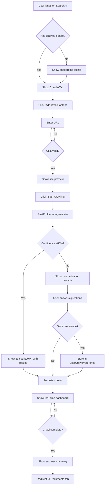
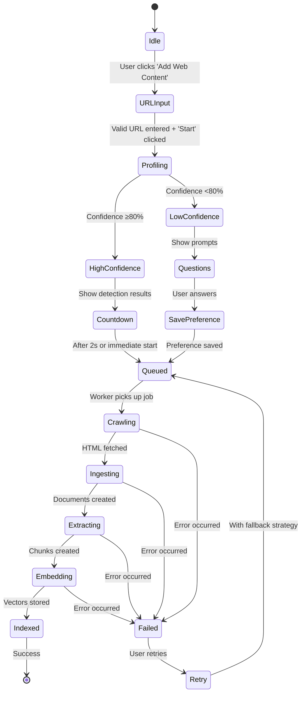

# Web Crawler UI - User Flows & Wireframes

## Flow Diagram: Main User Journeys



## State Machine: Crawl Job Lifecycle



## Component Architecture

```mermaid
graph TB
    subgraph "CrawlerTab (Main Container)"
        A[CrawlJobForm]
        B[CrawlJobProgress]
        C[CrawlJobHistory]
        D[CrawlPreferences]
    end

    subgraph "CrawlJobForm (URL Input)"
        E[URLInput Component]
        F[SitePreviewCard]
        G[StrategySelector]
        H[AdvancedOptions Panel]
    end

    subgraph "CrawlJobProgress (Dashboard)"
        I[PhaseIndicator]
        J[ProgressBar]
        K[TimelineDisplay]
        L[QualityMetrics]
        M[ErrorList]
    end

    subgraph "API Layer"
        N[/api/crawl/batch]
        O[/api/crawl/status]
        P[/api/crawl/dashboard]
        Q[WebSocket /ws/crawl]
    end

    A --> E
    E --> F
    E --> G
    G --> H

    B --> I
    B --> J
    B --> K
    B --> L
    B --> M

    A --> N
    B --> O
    B --> P
    B --> Q
```

## Screen Wireframes

### 1. Initial State (Empty)

```
┌─────────────────────────────────────────────────────────────────────┐
│ SearchAI > Knowledge Base > Web Crawler                            │
├─────────────────────────────────────────────────────────────────────┤
│                                                                      │
│  📚 Web Content Crawler                                             │
│  Automatically discover and index web pages                         │
│                                                                      │
│  ┌──────────────────────────────────────────────────────────────┐  │
│  │                                                               │  │
│  │              🌐                                               │  │
│  │                                                               │  │
│  │         No crawl jobs yet                                    │  │
│  │                                                               │  │
│  │    Add a website to start building your knowledge base      │  │
│  │                                                               │  │
│  │            [+ Add Web Content]                               │  │
│  │                                                               │  │
│  └──────────────────────────────────────────────────────────────┘  │
│                                                                      │
│  💡 Tip: Try adding a documentation site like docs.anthropic.com   │
│                                                                      │
└─────────────────────────────────────────────────────────────────────┘
```

### 2. URL Input Dialog (Simple Mode)

```
┌─────────────────────────────────────────────────────────────────────┐
│  🔍 Add Web Content                                         [×]     │
├─────────────────────────────────────────────────────────────────────┤
│                                                                      │
│  Enter website URL                                                   │
│  ┌──────────────────────────────────────────────────────────────┐  │
│  │ https://docs.example.com                                    ✓│  │
│  └──────────────────────────────────────────────────────────────┘  │
│                                                                      │
│  ┌──────────────────────────────────────────────────────────────┐  │
│  │  📄 Site Preview                                             │  │
│  │  ────────────────────────────────────────────────────────    │  │
│  │  🌐  Example Documentation                                   │  │
│  │  📊  ~250 pages detected via sitemap                        │  │
│  │  🏷️  Static HTML site (fast crawl)                          │  │
│  │  ⏱️  Est. 2-3 minutes                                        │  │
│  │                                                               │  │
│  │  💡 We can auto-discover all pages via sitemap!             │  │
│  └──────────────────────────────────────────────────────────────┘  │
│                                                                      │
│  [✓] Auto-detect best crawl strategy (Recommended)                 │
│                                                                      │
│  [Advanced Options ▼]                                               │
│                                                                      │
│  ──────────────────────────────────────────────────────────────    │
│                   [Cancel]              [Start Crawling]            │
│                                                                      │
└─────────────────────────────────────────────────────────────────────┘
```

### 3. Profiling Overlay (2-3 seconds)

```
┌─────────────────────────────────────────────────────────────────────┐
│  🧠 Analyzing Website...                                    [×]     │
├─────────────────────────────────────────────────────────────────────┤
│                                                                      │
│  ┌──────────────────────────────────────────────────────────────┐  │
│  │  ✓  Site profiled                 1.2s                       │  │
│  │  ✓  Structure analyzed            0.8s                       │  │
│  │  ✓  Strategy selected             0.3s                       │  │
│  │  ⏳  Preparing crawl...                                      │  │
│  └──────────────────────────────────────────────────────────────┘  │
│                                                                      │
│  📊 Detection Results                                                │
│  ───────────────────────────────────────────────────────────────    │
│                                                                      │
│  Site Type:      📚 Documentation (98% confidence)                  │
│  Structure:      Hierarchical with sitemap.xml                      │
│  Pages Found:    ~250 pages                                         │
│  JS Required:    No (static HTML)                                   │
│                                                                      │
│  Recommended Strategy:                                               │
│  🗺️  Sitemap Discovery - Fast, comprehensive                       │
│                                                                      │
│  Settings:                                                           │
│  • Max Pages:     250                                               │
│  • Max Depth:     Unlimited (via sitemap)                           │
│  • Follow Links:  Yes                                               │
│                                                                      │
│  ──────────────────────────────────────────────────────────────    │
│                                                                      │
│  💡 This looks great! Starting in 2 seconds...                      │
│                                                                      │
│  [Customize First ▼]                   [Start Now →]                │
│                                                                      │
└─────────────────────────────────────────────────────────────────────┘
```

### 4. Low Confidence - Customization Prompts

```
┌─────────────────────────────────────────────────────────────────────┐
│  🤔 Help Us Crawl Better                                    [×]     │
├─────────────────────────────────────────────────────────────────────┤
│                                                                      │
│  We detected: Mixed content site                                     │
│  Confidence: 62% (Medium)                                            │
│                                                                      │
│  ━━━━━━━━━━━━━━━━━━━━━━━━━━━━━━━━━━━━━━━━━━━━━━━━━━━━━━━━━━━━━━  │
│                                                                      │
│  ❓ What type of content do you want to capture?                    │
│                                                                      │
│  ┌──────────────────────────────────────────────────────────────┐  │
│  │  ○  Product pages and descriptions                           │  │
│  │  ○  Blog posts and articles                                  │  │
│  │  ○  Documentation and help pages                             │  │
│  │  ●  Everything (comprehensive crawl)                         │  │
│  └──────────────────────────────────────────────────────────────┘  │
│                                                                      │
│  ❓ How many pages should we crawl?                                 │
│                                                                      │
│  ┌──────────────────────────────────────────────────────────────┐  │
│  │                                                               │  │
│  │  ──────────────●────────────────────  250 pages              │  │
│  │  50          250          500          1000                  │  │
│  │                                                               │  │
│  │  ⏱️  Est. time: 2-3 minutes                                  │  │
│  │                                                               │  │
│  └──────────────────────────────────────────────────────────────┘  │
│                                                                      │
│  ❓ Does this site need JavaScript to render?                       │
│                                                                      │
│  ┌──────────────────────────────────────────────────────────────┐  │
│  │  ●  Let system detect (Recommended)                          │  │
│  │  ○  Yes, use browser rendering                               │  │
│  │  ○  No, simple HTML crawl                                    │  │
│  └──────────────────────────────────────────────────────────────┘  │
│                                                                      │
│  [✓] Remember my preference for example.com                         │
│                                                                      │
│  ──────────────────────────────────────────────────────────────    │
│                   [Cancel]              [Start Crawling]            │
│                                                                      │
└─────────────────────────────────────────────────────────────────────┘
```

### 5. Advanced Options (Expanded)

```
┌─────────────────────────────────────────────────────────────────────┐
│  ⚙️ Crawl Configuration                                     [×]     │
├─────────────────────────────────────────────────────────────────────┤
│                                                                      │
│  URL                                                                 │
│  https://docs.example.com                                          ✓│
│                                                                      │
│  ━━━━━━━━━━━━━━━━━━━━━━━━━━━━━━━━━━━━━━━━━━━━━━━━━━━━━━━━━━━━━━  │
│                                                                      │
│  Crawl Strategy                                                      │
│  ┌──────────────────────────────────────────────────────────────┐  │
│  │                                                               │  │
│  │  ┌──────────┐  ┌──────────┐  ┌──────────┐  ┌──────────┐    │  │
│  │  │ 📄       │  │ 🗺️      │  │ 🧠       │  │ 🌐       │    │  │
│  │  │ Single   │  │ Sitemap  │  │ Smart    │  │ Full     │    │  │
│  │  │ Page     │  │ Discovery│  │ Crawl    │  │ Site     │    │  │
│  │  └──────────┘  └──────────┘  └──────────┘  └──────────┘    │  │
│  │                               ↑ Selected                     │  │
│  │                                                               │  │
│  └──────────────────────────────────────────────────────────────┘  │
│                                                                      │
│  Limits                                                              │
│  ┌─────────────────────────┬──────────────────────────────────┐    │
│  │ Max Pages               │ [   250  ▼] (1-1000)            │    │
│  │ Max Crawl Depth         │ [     3  ▼] (1-10)              │    │
│  │ Max Duration (minutes)  │ [    30  ▼] (5-120)             │    │
│  └─────────────────────────┴──────────────────────────────────┘    │
│                                                                      │
│  Discovery Options                                                   │
│  ┌──────────────────────────────────────────────────────────────┐  │
│  │  [✓] Use sitemap.xml for URL expansion                       │  │
│  │  [✓] Follow internal links                                   │  │
│  │  [✓] Respect robots.txt rules                                │  │
│  │  [ ] Extract structured metadata (schema.org)                │  │
│  └──────────────────────────────────────────────────────────────┘  │
│                                                                      │
│  Content Processing                                                  │
│  ┌──────────────────────────────────────────────────────────────┐  │
│  │  Readability Cleanup:  ● Standard  ○ Aggressive  ○ Off      │  │
│  │  JavaScript Handling:  ● Auto-detect  ○ Browser  ○ None     │  │
│  └──────────────────────────────────────────────────────────────┘  │
│                                                                      │
│  Performance                                                         │
│  ┌─────────────────────────┬──────────────────────────────────┐    │
│  │ Concurrency (parallel)  │ [     5  ▼] (1-20)              │    │
│  │ Batch Size              │ [    10  ▼] (1-50)              │    │
│  │ Request Timeout (sec)   │ [    30  ▼] (10-120)            │    │
│  └─────────────────────────┴──────────────────────────────────┘    │
│                                                                      │
│  ──────────────────────────────────────────────────────────────    │
│                [Reset to Defaults]       [Start Crawling]           │
│                                                                      │
└─────────────────────────────────────────────────────────────────────┘
```

### 6. Real-Time Progress Dashboard

```
┌─────────────────────────────────────────────────────────────────────┐
│  🚀 Crawling: docs.example.com                          [Cancel]    │
├─────────────────────────────────────────────────────────────────────┤
│                                                                      │
│  Overall Progress                                                    │
│  ████████████████████████░░░░░░░░  65% Complete                    │
│  Phase: Ingesting content                                            │
│                                                                      │
│  ━━━━━━━━━━━━━━━━━━━━━━━━━━━━━━━━━━━━━━━━━━━━━━━━━━━━━━━━━━━━━━  │
│                                                                      │
│  Pipeline Stages                                                     │
│  ┌──────────────────┬──────────────────┬──────────────────────┐    │
│  │  📥 Crawling     │  📝 Ingesting    │  🧩 Extracting       │    │
│  │                  │                  │                      │    │
│  │  152 / 250       │  98 / 152        │  45 / 98            │    │
│  │  61%             │  64%             │  46%                │    │
│  │  ✓ Complete      │  ⏳ Active       │  ⏸️ Pending         │    │
│  └──────────────────┴──────────────────┴──────────────────────┘    │
│                                                                      │
│  ┌──────────────────┬──────────────────┬──────────────────────┐    │
│  │  🧠 Embedding    │  📊 Indexing     │  ✅ Complete        │    │
│  │                  │                  │                      │    │
│  │  12 / 45         │  0 / 12          │  0                  │    │
│  │  27%             │  —               │  —                  │    │
│  │  ⏳ Active       │  ⏸️ Pending      │  ⏸️ Pending         │    │
│  └──────────────────┴──────────────────┴──────────────────────┘    │
│                                                                      │
│  ━━━━━━━━━━━━━━━━━━━━━━━━━━━━━━━━━━━━━━━━━━━━━━━━━━━━━━━━━━━━━━  │
│                                                                      │
│  Timeline                                                            │
│  Started:    2:45 PM  (3 min ago)                                   │
│  Current:    2:48 PM                                                 │
│  Est. End:   2:52 PM  (4 min remaining)                             │
│                                                                      │
│  Quality Metrics                                                     │
│  ┌──────────────────────────────────────────────────────────────┐  │
│  │  Avg Quality Score:    92/100  🟢 Excellent                  │  │
│  │  Success Rate:         97% (146/152)                         │  │
│  │  Avg Chunks per Doc:   8.5 chunks                            │  │
│  │  Content Preserved:    94%                                   │  │
│  └──────────────────────────────────────────────────────────────┘  │
│                                                                      │
│  ━━━━━━━━━━━━━━━━━━━━━━━━━━━━━━━━━━━━━━━━━━━━━━━━━━━━━━━━━━━━━━  │
│                                                                      │
│  ⚠️ Issues (3)                                    [Show All ▼]      │
│  • 2 pages failed (timeout) - /api/docs/v2, /api/docs/v3           │
│  • 1 page blocked by robots.txt - /admin                            │
│                                                                      │
│  Recent Activity                                                     │
│  ┌──────────────────────────────────────────────────────────────┐  │
│  │  2:48:23  ✓  Embedded: "Getting Started Guide"               │  │
│  │  2:48:21  ✓  Extracted: "API Reference"                      │  │
│  │  2:48:19  ✓  Ingested: "Installation Guide"                  │  │
│  │  2:48:17  ✓  Crawled: /docs/quickstart                       │  │
│  │  2:48:15  ✓  Crawled: /docs/installation                     │  │
│  └──────────────────────────────────────────────────────────────┘  │
│                                                                      │
│  ──────────────────────────────────────────────────────────────    │
│               [View Full Logs]                  [Cancel Crawl]      │
│                                                                      │
└─────────────────────────────────────────────────────────────────────┘
```

### 7. Completion Summary

```
┌─────────────────────────────────────────────────────────────────────┐
│  ✅ Crawl Complete!                                         [×]     │
├─────────────────────────────────────────────────────────────────────┤
│                                                                      │
│  Successfully crawled docs.example.com                               │
│                                                                      │
│  ━━━━━━━━━━━━━━━━━━━━━━━━━━━━━━━━━━━━━━━━━━━━━━━━━━━━━━━━━━━━━━  │
│                                                                      │
│  Results Summary                                                     │
│  ┌──────────────────────────────────────────────────────────────┐  │
│  │                                                               │  │
│  │  📄 Pages Crawled:     250                                   │  │
│  │  ✅ Successfully:       246 (98%)                            │  │
│  │  ❌ Failed:             4 (2%)                               │  │
│  │                                                               │  │
│  │  📝 Documents Created:  246                                  │  │
│  │  🧩 Chunks Generated:   2,091 (8.5 avg)                     │  │
│  │                                                               │  │
│  │  🎯 Quality Score:      92/100  🟢 Excellent                │  │
│  │                                                               │  │
│  │  ⏱️  Total Time:        4 min 32 sec                        │  │
│  │                                                               │  │
│  └──────────────────────────────────────────────────────────────┘  │
│                                                                      │
│  Content Breakdown                                                   │
│  ┌──────────────────────────────────────────────────────────────┐  │
│  │  Documentation:   180 pages  (73%)                           │  │
│  │  API Reference:    45 pages  (18%)                           │  │
│  │  Tutorials:        21 pages  (9%)                            │  │
│  └──────────────────────────────────────────────────────────────┘  │
│                                                                      │
│  Next Steps                                                          │
│  • Content is now searchable in your knowledge base                 │
│  • Try asking questions about the docs!                             │
│                                                                      │
│  ──────────────────────────────────────────────────────────────    │
│                                                                      │
│  [View Documents]  [Crawl Another Site]  [Schedule Re-crawl]        │
│                                                                      │
└─────────────────────────────────────────────────────────────────────┘
```

### 8. Crawl History List

```
┌─────────────────────────────────────────────────────────────────────┐
│  📜 Crawl History                                                   │
├─────────────────────────────────────────────────────────────────────┤
│                                                                      │
│  Filters:  [All ▼]  [Last 30 days ▼]  [All strategies ▼]         │
│                                                                      │
│  ━━━━━━━━━━━━━━━━━━━━━━━━━━━━━━━━━━━━━━━━━━━━━━━━━━━━━━━━━━━━━━  │
│                                                                      │
│  ┌──────────────────────────────────────────────────────────────┐  │
│  │  ✅  docs.example.com                           Today, 2:49 PM│  │
│  │  246 pages • 92/100 quality • Sitemap Discovery              │  │
│  │  [View Details]  [Re-crawl]  [Delete]                        │  │
│  └──────────────────────────────────────────────────────────────┘  │
│                                                                      │
│  ┌──────────────────────────────────────────────────────────────┐  │
│  │  ✅  blog.acme.com                         Yesterday, 4:23 PM │  │
│  │  45 pages • 88/100 quality • Smart Crawl                     │  │
│  │  [View Details]  [Re-crawl]  [Delete]                        │  │
│  └──────────────────────────────────────────────────────────────┘  │
│                                                                      │
│  ┌──────────────────────────────────────────────────────────────┐  │
│  │  ⚠️  shop.example.com                      2 days ago, 9:15 AM│  │
│  │  12/500 pages • Failed after 12 pages • Full Site            │  │
│  │  Error: Timeout (too many pages)                             │  │
│  │  [View Details]  [Retry with limits]  [Delete]               │  │
│  └──────────────────────────────────────────────────────────────┘  │
│                                                                      │
│  ┌──────────────────────────────────────────────────────────────┐  │
│  │  ⏳  news.tech.com                         5 days ago, 10:30 AM│  │
│  │  In Progress: 34/100 pages (34%)                             │  │
│  │  [View Progress]  [Cancel]                                   │  │
│  └──────────────────────────────────────────────────────────────┘  │
│                                                                      │
│  [Load More...]                                                      │
│                                                                      │
└─────────────────────────────────────────────────────────────────────┘
```

### 9. Saved Preferences

```
┌─────────────────────────────────────────────────────────────────────┐
│  🧠 Your Crawl Preferences                                  [×]     │
├─────────────────────────────────────────────────────────────────────┤
│                                                                      │
│  Learn from your past crawls to speed up future ones                │
│                                                                      │
│  ━━━━━━━━━━━━━━━━━━━━━━━━━━━━━━━━━━━━━━━━━━━━━━━━━━━━━━━━━━━━━━  │
│                                                                      │
│  ┌──────────────────────────────────────────────────────────────┐  │
│  │  docs.example.com                                            │  │
│  │  ───────────────────────────────────────────────────────────│  │
│  │  Strategy:      Sitemap Discovery                            │  │
│  │  Max Pages:     500                                          │  │
│  │  Auto-decide:   Yes (no prompts)                             │  │
│  │  Used:          3 times                                      │  │
│  │                                                               │  │
│  │  [Edit]  [Delete]                         Last used: Today   │  │
│  └──────────────────────────────────────────────────────────────┘  │
│                                                                      │
│  ┌──────────────────────────────────────────────────────────────┐  │
│  │  *.wikipedia.org                                             │  │
│  │  ───────────────────────────────────────────────────────────│  │
│  │  Strategy:      Single Page Only                             │  │
│  │  Auto-decide:   Yes                                          │  │
│  │  Used:          12 times                                     │  │
│  │                                                               │  │
│  │  [Edit]  [Delete]                   Last used: 2 days ago    │  │
│  └──────────────────────────────────────────────────────────────┘  │
│                                                                      │
│  ┌──────────────────────────────────────────────────────────────┐  │
│  │  blog.*.com                                                  │  │
│  │  ───────────────────────────────────────────────────────────│  │
│  │  Strategy:      Smart Crawl                                  │  │
│  │  Max Pages:     100                                          │  │
│  │  Max Depth:     2                                            │  │
│  │  Auto-decide:   No (ask before crawl)                        │  │
│  │  Used:          5 times                                      │  │
│  │                                                               │  │
│  │  [Edit]  [Delete]                   Last used: 1 week ago    │  │
│  └──────────────────────────────────────────────────────────────┘  │
│                                                                      │
│  ──────────────────────────────────────────────────────────────    │
│                                                                      │
│  [+ Add New Preference]                      [Clear All]            │
│                                                                      │
└─────────────────────────────────────────────────────────────────────┘
```

## Mobile Responsive Views

### Mobile: URL Input (Portrait)

```
┌───────────────────────┐
│ Add Web Content   [×] │
├───────────────────────┤
│                       │
│ Enter URL             │
│ ┌───────────────────┐ │
│ │ docs.example.com ✓│ │
│ └───────────────────┘ │
│                       │
│ Site Preview          │
│ ┌───────────────────┐ │
│ │ 📚 Example Docs   │ │
│ │ ~250 pages        │ │
│ │ ⏱️ 2-3 min        │ │
│ └───────────────────┘ │
│                       │
│ [✓] Auto-detect       │
│                       │
│ [Advanced ▼]          │
│                       │
│ ──────────────────    │
│                       │
│ [Cancel] [Start]      │
│                       │
└───────────────────────┘
```

### Mobile: Progress (Portrait)

```
┌───────────────────────┐
│ Crawling          [×] │
├───────────────────────┤
│                       │
│ docs.example.com      │
│                       │
│ ███████████░░░  65%   │
│ Phase: Ingesting      │
│                       │
│ 📥 152/250 Crawled    │
│ 📝 98/152 Ingested    │
│ 🧩 45/98 Extracted    │
│                       │
│ ⏱️ 3 min elapsed      │
│ ⏱️ 4 min remaining    │
│                       │
│ 🎯 Quality: 92/100    │
│ ✅ Success: 97%       │
│                       │
│ ⚠️ 3 issues           │
│ [Show ▼]              │
│                       │
│ [View Logs]           │
│ [Cancel Crawl]        │
│                       │
└───────────────────────┘
```

## Interaction Patterns

### URL Input Validation States

```typescript
enum ValidationState {
  IDLE = 'idle', // Not yet typed
  TYPING = 'typing', // Debouncing input
  VALIDATING = 'validating', // Checking URL format
  VALID = 'valid', // ✓ Valid URL
  INVALID = 'invalid', // ✗ Invalid format
  CHECKING = 'checking', // Fetching site preview
  READY = 'ready', // ✓ Preview loaded
  ERROR = 'error', // ⚠️ Site unreachable
}
```

### Progress Animation Timing

```
Frame 0ms:   ░░░░░░░░░░░░░░░░░░░░ 0%
Frame 100ms: █░░░░░░░░░░░░░░░░░░░ 5%
Frame 200ms: ██░░░░░░░░░░░░░░░░░░ 10%
...
Frame 2000ms: ████████████████████ 100% → Fade to success ✓
```

### Error Recovery Flows

```
Error Detected → Show inline warning
              → Suggest fix (if known)
              → [Retry] [Customize] [Cancel]
```

## Keyboard Shortcuts

| Shortcut           | Action                        |
| ------------------ | ----------------------------- |
| `Cmd/Ctrl + K`     | Open "Add Web Content" dialog |
| `Enter`            | Submit URL (if valid)         |
| `Escape`           | Close dialog / Cancel         |
| `Tab`              | Navigate form fields          |
| `Cmd/Ctrl + Enter` | Force start (skip countdown)  |
| `Cmd/Ctrl + ,`     | Open preferences              |

## Accessibility Features

- **ARIA labels** on all inputs
- **Focus indicators** (2px blue outline)
- **Screen reader** announcements for status changes
- **Keyboard navigation** for all interactions
- **Color contrast** WCAG AA (4.5:1 minimum)
- **Motion reduction** respect `prefers-reduced-motion`

---

**Note**: These wireframes are ASCII representations. For production, use:

- Figma/Sketch for high-fidelity mockups
- Tailwind CSS + shadcn/ui components (already in Studio)
- Framer Motion for animations
- React Hook Form for form validation
