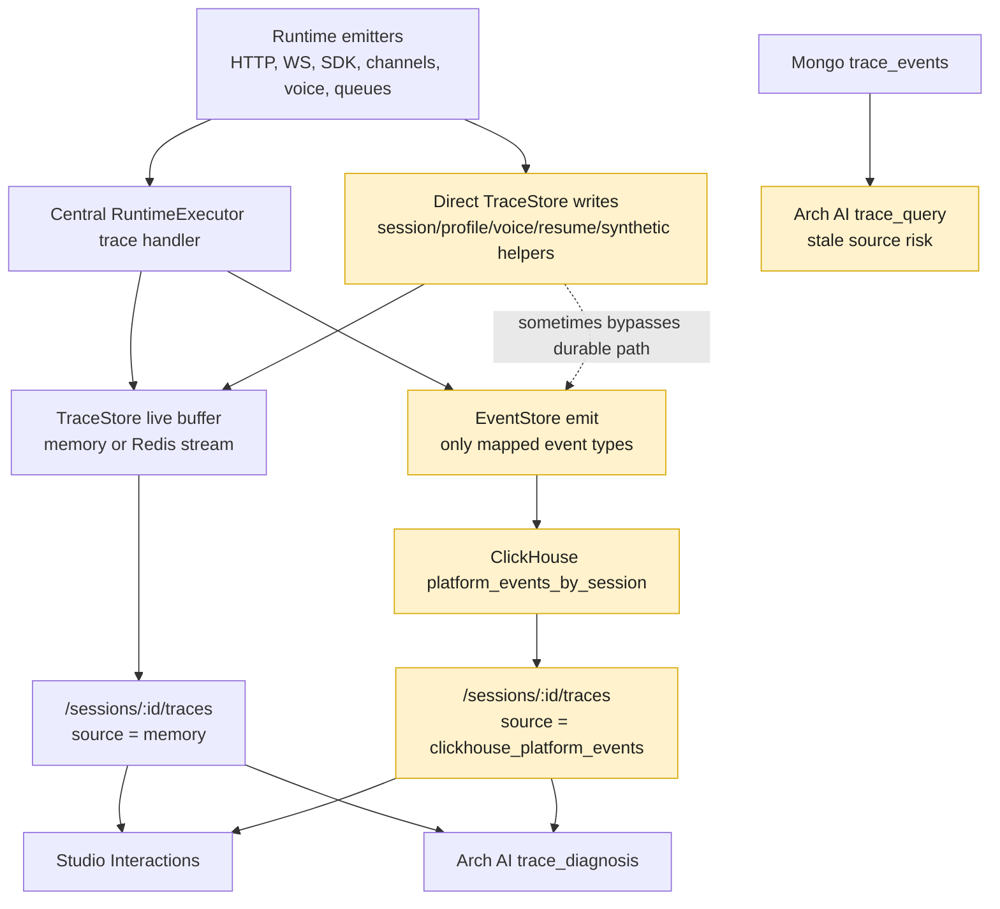
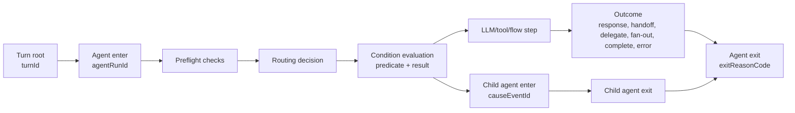
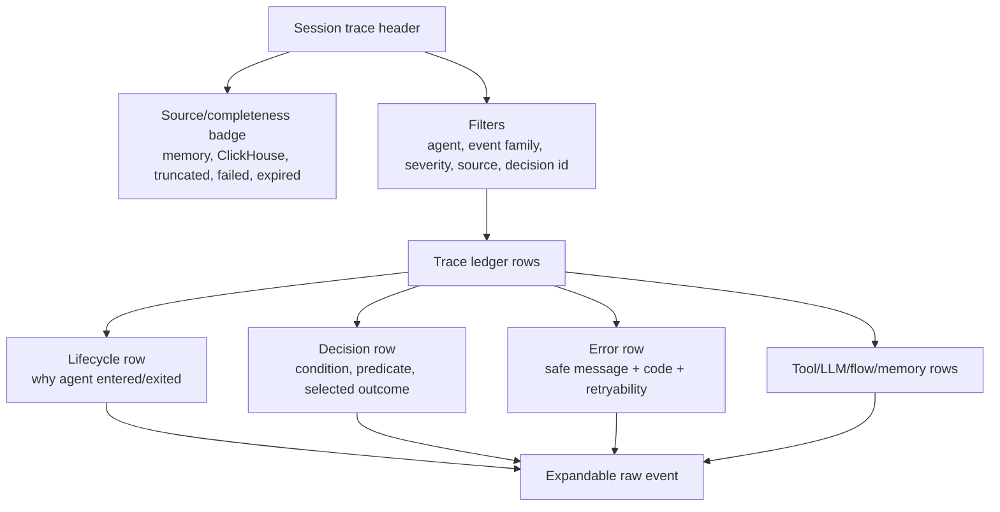
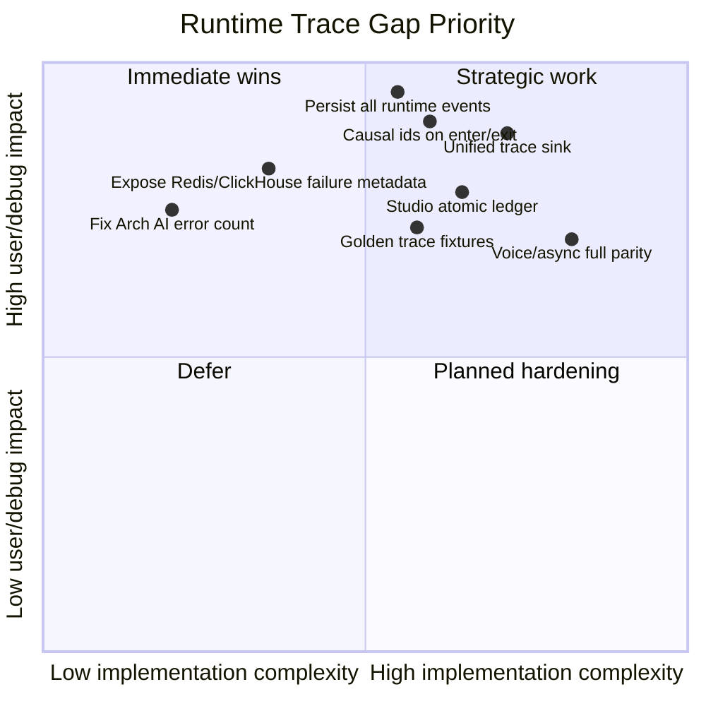

# Runtime Trace Source-Of-Truth Audit

Date: 2026-05-12
Audience: Engineering, Product, Support, SRE, QA, Security, Leadership
Scope: Runtime sessions, traces, agent lifecycle, decision trees, errors,
Redis, ClickHouse, Studio debug, and Arch AI diagnostic surfaces

## Executive Summary

Runtime debug is **not yet a 100% callstack-grade source of truth**.

The platform has a strong observability foundation: centralized runtime trace
handling, distributed TraceStore, EventStore/ClickHouse persistence, Studio
interaction rendering, and Arch AI diagnostic tools. The issue is not that
runtime is blind. The issue is that the layers do not preserve the same truth
from live execution to durable replay to user-facing debug.

Today, live traces often contain the answer while the session is fresh. But
historical replay and stakeholder-facing views can miss atomic decisions,
condition results, Redis/ClickHouse failures, and error cases. That makes it
unsafe to claim that debug is the full source of truth in the same way a JS
callstack is.

## Implementation Status

This development pass closes the first P0 durability and visibility gap:

| Area                                     | Status after this pass                                                                                                                                         |
| ---------------------------------------- | -------------------------------------------------------------------------------------------------------------------------------------------------------------- |
| Unmapped runtime events                  | Persist through a generic `system.runtime_trace` EventStore envelope instead of disappearing from historical ClickHouse replay.                                |
| Original runtime event type              | Preserved in durable payload metadata so historical replay restores `completion_check`, `gather_field_activation`, `span_end`, and other atomic runtime types. |
| `/sessions/:id/traces` source visibility | Response metadata now exposes source, source chain, loaded/available counts, truncation, warnings, and errors.                                                 |
| Redis/ClickHouse ambiguity               | Live buffer failures surface as trace warnings instead of looking like "no traces." ClickHouse query failures surface as trace errors.                         |
| Studio session detail                    | Header now shows a compact trace source/completeness badge such as `Trace: history / partial`, with diagnostics in the tooltip.                                |
| Regression coverage                      | Added runtime mapping/replay/API tests and a Studio UI visibility test for historical partial trace metadata.                                                  |

Remaining work is primarily about richer causal semantics and UI readability:
`turnId`, `agentRunId`, `causeEventId`, normalized reason codes, golden scenario
fixtures, and a full ledger-style trace UI.

## North Star

The goal is simple:

1. **Full traces:** every runtime path, condition, transition, decision, error,
   skip, retry, fallback, and infrastructure failure is captured with causal
   metadata and can be replayed historically.
2. **Best user visibility:** users can understand those traces without reading
   raw JSON, while engineers and operators can still inspect the complete raw
   ledger when needed.

| Track                     | Definition of done                                                                                                                                                                                                  |
| ------------------------- | ------------------------------------------------------------------------------------------------------------------------------------------------------------------------------------------------------------------- |
| Full trace fidelity       | Every runtime event has a canonical type, durable persistence, causal ids, source metadata, normalized error semantics, payload-size controls, and replay parity between live TraceStore and historical ClickHouse. |
| User trace visibility     | Studio shows a compact trace ledger with plain-language reasons, filters, severity/source badges, lifecycle rows, decision rows, error rows, and expandable raw details.                                            |
| Operator/debug visibility | Raw traces remain complete, queryable, exportable, and correlated by `turnId`, `agentRunId`, `decisionId`, `spanId`, `parentSpanId`, `causeEventId`, session, tenant, project, and channel.                         |
| Safety                    | User-facing trace summaries are sanitized; raw trace access stays permissioned and preserves security/compliance boundaries.                                                                                        |

## Bottom Line Rating

| Capability                            |                      Today | Realistic target after fixes | Why it improves                                                                                                                          |
| ------------------------------------- | -------------------------: | ---------------------------: | ---------------------------------------------------------------------------------------------------------------------------------------- |
| Live runtime trace richness           |                       7/10 |                         9/10 | Core execution already emits many events. Needs unified sink and fewer bypasses.                                                         |
| Historical ClickHouse replay          |                       4/10 |                         9/10 | Only mapped events persist today. Persist every runtime event or use a generic atomic event.                                             |
| Agent enter/exit explainability       |                       4/10 |                         9/10 | `agent_enter`/`agent_exit` exist, but need causal ids, matched conditions, and exit reason codes.                                        |
| Atomic decision-tree visibility       | 5/10 live, 3/10 historical |                         9/10 | Registered decision events render as separate steps, but many emitted event types are unclassified and ClickHouse loses unmapped events. |
| Error-case capture                    |                       5/10 |                         9/10 | Core execution errors are traced, but infra, async, voice, queue, and diagnostic paths have gaps.                                        |
| Redis/ClickHouse failure transparency |                       4/10 |                       8.5/10 | Current APIs can collapse outage into empty traces. Need explicit completeness metadata.                                                 |
| Studio user debug experience          |                       5/10 |                         9/10 | Good narrative surface, but not yet an audit ledger.                                                                                     |
| "Debug as source of truth" confidence |                       5/10 |                     9-9.5/10 | Achievable if trace persistence and causal metadata become runtime contracts.                                                            |

## Stakeholder Readout

| Stakeholder         | What they need                                                           | Current risk                                                                           | Required outcome                                                                                                                           |
| ------------------- | ------------------------------------------------------------------------ | -------------------------------------------------------------------------------------- | ------------------------------------------------------------------------------------------------------------------------------------------ |
| Product and Support | Explain why an agent entered, exited, escalated, handed off, or stopped. | UI can show what happened but not always the exact condition or causal edge.           | A user-facing decision ledger with plain reason summaries.                                                                                 |
| Engineering         | Reconstruct every execution path and failure in order.                   | Direct trace writes, unmapped events, and partial span hierarchy break reconstruction. | Every runtime event gets a causal envelope and durable persistence.                                                                        |
| SRE                 | Know whether missing traces mean no events or infra failure.             | Redis/ClickHouse failures can return empty-looking results.                            | Trace API reports source, truncation, Redis status, ClickHouse status, and mapping gaps.                                                   |
| QA                  | Prove no construct path is missed.                                       | No single scenario matrix enforced by tests.                                           | Golden trace fixtures across HTTP, WS, channel, voice, handoff, delegate, fan-out, flow, tools, guardrails, memory, Redis, and ClickHouse. |
| Security/Compliance | Know what happened without leaking sensitive internals to users.         | Logs may contain raw context while user surfaces need sanitized explanations.          | Raw trace for authorized operators, sanitized reason summaries for user-visible surfaces.                                                  |
| Leadership          | Confidence score and investment path.                                    | Today is roughly 5/10 for callstack-grade truth.                                       | 9+ is realistic with event mapping, causal ids, unified sink, and UI/API completeness work.                                                |

## Source-Of-Truth Diagram



Core issue: a trace event can be visible live, then disappear historically, then
be summarized, downgraded, or hidden behind non-ledger UI treatment in Studio.
That is the opposite of a reliable callstack.

## Desired Callstack Shape

Every runtime action should have a parent, cause, predicate, and outcome.



Required causal fields:

| Field                             | Purpose                                                                                                    |
| --------------------------------- | ---------------------------------------------------------------------------------------------------------- |
| `turnId`                          | Groups all events for one inbound user/channel/voice turn.                                                 |
| `executionId`                     | Connects queue/coordinator lifecycle to runtime execution.                                                 |
| `agentRunId`                      | Distinguishes repeated entries into the same agent in one session.                                         |
| `spanId` / `parentSpanId`         | Builds the call tree.                                                                                      |
| `decisionId` / `parentDecisionId` | Builds the decision tree.                                                                                  |
| `causeEventId`                    | Explains why this event happened next.                                                                     |
| `phase`                           | Normalized phase such as routing, condition_eval, tool, guardrail, handoff, delegate, fan_out, agent_exit. |
| `predicate`                       | Expression/evaluator/input/result for condition and completion decisions.                                  |
| `outcome.reasonCode`              | Stable machine-readable reason.                                                                            |
| `outcome.summary`                 | Safe human-readable explanation.                                                                           |
| `error`                           | Normalized error type, message, retryability, and sanitized user-facing message.                           |

## Current Pipeline Map

| Layer                          | Current behavior                                                                                                      | Atomicity risk                                                                                                                                                                                   |
| ------------------------------ | --------------------------------------------------------------------------------------------------------------------- | ------------------------------------------------------------------------------------------------------------------------------------------------------------------------------------------------ |
| Runtime `onTraceEvent` wrapper | `RuntimeExecutor.createCentralizedTraceHandler()` adds ids, writes TraceStore, and emits mapped events to EventStore. | Events emitted before the wrapper, direct `TraceStore.addEvent()` calls, or realtime tool calls can bypass the unified path.                                                                     |
| In-memory TraceStore           | Keeps recent local trace events with default `2000` events/session and `120` minute age.                              | Ring buffer drops oldest events. Cross-pod visibility depends on distributed store.                                                                                                              |
| Redis TraceStore               | Keeps streams with default `2000` events/session and `15` minute TTL, plus Pub/Sub live delivery.                     | Under Redis memory pressure it skips stream writes and only publishes live. `readSince()` catches Redis errors and returns empty events.                                                         |
| EventStore/ClickHouse          | Durable path for mapped events through `TRACE_TO_PLATFORM_TYPE`.                                                      | Only 36 of 114 runtime event types currently map through to EventStore. Fire-and-forget emit failures are not surfaced as trace events.                                                          |
| `/sessions/:id/traces`         | Prefers buffered TraceStore; falls back to ClickHouse.                                                                | ClickHouse errors are logged, then the API returns an empty ClickHouse-sourced response. Historical full fetch is capped at 1000 events.                                                         |
| `/sessions/:id/analysis`       | Reads active local session and TraceStore events.                                                                     | Returns 404 for historical or non-local sessions; no ClickHouse fallback.                                                                                                                        |
| Studio Interactions            | Groups events into user-facing steps, banners, and footer state.                                                      | Registered decision events are preserved as separate steps, but lifecycle/session events are not visible as full atomic rows and unclassified event types can be folded into nearby raw details. |
| Arch AI tools                  | `trace_diagnosis` summarizes runtime traces; `trace_query` queries Mongo `trace_events`.                              | Error counting misses live `type: 'error'`; Mongo source can drift from runtime TraceStore/ClickHouse truth.                                                                                     |

## Event Coverage Findings

### EventStore mapping coverage

| Metric                                                  | Count |
| ------------------------------------------------------- | ----: |
| Runtime event types in `RUNTIME_EVENT_TYPES`            |   114 |
| Keys in `TRACE_TO_PLATFORM_TYPE`                        |    49 |
| Runtime event types mapped to EventStore/ClickHouse     |    36 |
| Runtime event types not mapped to EventStore/ClickHouse |    78 |

High-risk runtime events that do not durably persist through the shared
EventStore mapping:

```text
completion_check, warning, constraint_violation, dsl_collect, dsl_prompt,
dsl_respond, dsl_set, dsl_on_input, dsl_call, dsl_await_attachment,
correction, session_resolution, memory_init, memory_remember, memory_recall,
memory_error, memory_preferences, memory_dedup_skipped,
handoff_condition_check, thread_return, data_stored, digression, sub_intent,
pipeline_intent_bridge, pipeline_tiered_action, pipeline_out_of_scope_decline,
extraction_strategy_resolved, extraction_attempt, extraction_parse_fallback,
extraction_fallback, memory_trigger_evaluated, memory_recall_result,
memory_unavailable, preference_detected, constraint_backtrack,
constraint_backtrack_limit, constraint_directive, constraint_mini_collect,
gather_field_activation, gather_complete_reason, correction_invalidation,
validation_fail_open, engine_decision, entity_extraction,
extraction_tier_selected, tool_call_start, tool_call_error, fan_out_start,
fan_out_task_start, fan_out_task_complete, fan_out_complete,
fan_out_child_created, fan_out_child_completed, guardrail_check,
guardrail_violation, guardrail_warning, guardrail_fix, guardrail_reask,
guardrail_pipeline_complete, guardrail_pipeline_error,
guardrail_input_blocked, guardrail_output_blocked, guardrail_tool_blocked,
guardrail_tool_output_blocked, guardrail_handoff_blocked, guardrail_cost,
guardrail_circuit_breaker, guardrail_cache_hit, guardrail_cache_miss,
guardrail_provider_error, agent_assist.received,
agent_assist.binding_resolved, agent_assist.delegated,
agent_assist.translated_response, agent_assist.error,
agent_assist.callback_scheduled, agent_assist.callback_delivered,
agent_assist.callback_failed
```

Important note: before this development pass,
`apps/runtime/src/__tests__/infrastructure-regression.test.ts` asserted that
some decision events such as `completion_check`,
`extraction_strategy_resolved`, and `gather_field_activation` were unmapped and
skipped for EventStore. This pass flips that contract: unmapped runtime events
now persist through the generic durable runtime-trace envelope.

### Emitted event taxonomy drift

High-confidence emitted runtime literals not in the shared registry include:

```text
a2a_async_suspend, a2a_call, agent_transfer_initiated,
attachment_preprocess_start, auto_compact, constraint_guard_skipped,
deterministic_handoff, deterministic_routing, dsl_on_start_skipped,
dsl_transform, execution.cancelled, execution.completed, execution.failed,
execution.queued, execution.started, fan_out_async_started,
fan_out_barrier_progress, fan_out_branch_dispatched, fan_out_branch_registered,
fan_out_branch_resumed, fan_out_parent_resumed, fan_out_parent_suspended,
feedback.submitted, gather_locked_intent_queued,
handoff_auth_preflight_blocked, handoff_authority_denied, handoff_failure,
handoff_return_handler, handoff_timeout, identity_verified,
lookup_validation_failed, omnichannel_recall_complete,
omnichannel_recall_skipped, pipeline_classify, pipeline_filter,
pipeline_merge, pipeline_routing_resolve, queue_backpressure,
reasoning_zone_enter, reasoning_zone_exit, resume_intent, return_to_parent,
routing_capabilities_resolved, thread_resume, tool_confirmation_approved,
tool_confirmation_immutability_violation, tool_confirmation_rejected,
tool_confirmation_requested, tool_mock_hit, tool_result_summarized,
tool_result_truncated
```

Registered globally but not in `RUNTIME_EVENT_TYPES`:

```text
agent_lifecycle, agent_switch, attachment_preprocess, dsl_on_start,
error_handler_resolved, error_handler_response, execution_suspended,
guardrail_reask_skipped_streaming, handoff_progress, inference_accepted,
inference_rejected, lookup_fuzzy_accepted,
lookup_fuzzy_confirmation_requested, lookup_fuzzy_rejected,
multi_intent_disambiguate_choice, multi_intent_queue_accepted,
multi_intent_queue_declined, multi_intent_queue_surfaced,
profile_resolution, status_clear, status_update, step_thought,
tool_auth_resolved, tool_call_retry, tool_result, tool_thought,
validation_max_retries, voice_realtime_turn_end
```

Until this taxonomy drift is fixed, a "not even one path missed" guarantee is
not defensible.

## Development Readiness Risks

Development can proceed, but it should start with the trace contract and sink
before broad feature patching. The highest risk is adding more ad-hoc events
without fixing the taxonomy, persistence, and causal envelope first.

| Risk                                                   | Why it matters                                                                                                                    | Mitigation before/during development                                                                                                      |
| ------------------------------------------------------ | --------------------------------------------------------------------------------------------------------------------------------- | ----------------------------------------------------------------------------------------------------------------------------------------- |
| Event drift gets worse                                 | Runtime already emits event literals outside the registry. More events without a registry guard will create more invisible paths. | Add a CI guard that every production trace literal is registered, runtime-marked, Studio-classified, and durable or explicitly transient. |
| Historical replay remains incomplete                   | Adding live events will not help old-session debug if EventStore/ClickHouse mappings are still partial.                           | Persist every runtime event through exact mappings or a generic `runtime.atomic` durable event.                                           |
| Agent lifecycle stays ambiguous                        | `agent_enter` and `agent_exit` exist but do not carry enough causal data.                                                         | Enrich existing lifecycle events before adding many parallel lifecycle variants.                                                          |
| Direct write paths bypass the contract                 | Some runtime, SDK, voice, resume, and synthetic helpers write directly to TraceStore.                                             | Introduce one trace sink and migrate direct write paths behind it.                                                                        |
| Infra failures remain indistinguishable from no events | Redis and ClickHouse failures can look like empty trace results.                                                                  | Add replay/source completeness metadata and trace sink health events.                                                                     |
| Event volume and ClickHouse cost increase              | Persisting every atomic event can materially increase write volume.                                                               | Add event verbosity, payload size budgets, sampling only for non-critical debug noise, and compression/scrubbing at the sink.             |
| PII/internal detail leaks                              | More atomic data means more chance of exposing tenant/model/credential/internal details to user-facing surfaces.                  | Separate raw operator trace from sanitized user summary fields. Use existing sanitizers before rendering.                                 |
| Studio becomes noisy                                   | A full ledger can overwhelm users if every event is rendered equally.                                                             | Render a compact audit ledger with filters, grouping, and severity/source badges while preserving raw completeness.                       |
| Compatibility breaks dashboards                        | Renaming dotted `execution.*` events or changing platform mappings can break consumers.                                           | Add compatibility aliases and keep old names readable during rollout.                                                                     |

## Required Runtime Event Additions And Enrichments

We do need more runtime trace coverage, but the first move should be to enrich
and persist existing decision events. New events should be added only where
there is no existing event that can carry the causal data cleanly.

| Area                  | Add or enrich                                                                                                                                                                                                     | Why it is needed                                                          | Priority |
| --------------------- | ----------------------------------------------------------------------------------------------------------------------------------------------------------------------------------------------------------------- | ------------------------------------------------------------------------- | -------- |
| Turn root             | Add `turn_start` / `turn_end` or equivalent normalized runtime turn events for HTTP, WS, SDK, channel, queue, resume, and voice turns.                                                                            | Provides the root frame for the callstack.                                | P0       |
| Agent enter           | Enrich `agent_enter` with `turnId`, `agentRunId`, `causeEventId`, `sourceAgent`, `targetAgent`, `sourceStep`, `trigger`, `matchedCondition`, and `parentAgentRunId`.                                              | Explains why the agent entered.                                           | P0       |
| Agent exit            | Enrich `agent_exit` with `exitReasonCode`, `terminalAction`, `nextAgent`, `completionCondition`, `handoffReturnBehavior`, `responseDisposition`, and normalized `error`.                                          | Explains why the agent exited.                                            | P0       |
| Trace sink health     | Add `trace_sink_write_failed`, `trace_sink_write_shed`, `trace_replay_source_selected`, and `trace_replay_failed` or equivalent sink-health events.                                                               | Makes Redis/EventStore/ClickHouse issues visible in debug, not only logs. | P0       |
| Queue/coordinator     | Register and persist `execution.queued`, `execution.started`, `execution.completed`, `execution.failed`, `execution.cancelled`, `execution_suspended`, and `queue_backpressure` with normalized names or aliases. | Queue and backpressure are major "why did it not run" paths.              | P0       |
| Deterministic routing | Register and persist `deterministic_routing` and `deterministic_handoff`, or fold their detail into durable `decision` events.                                                                                    | Deterministic branches should be as explainable as LLM branches.          | P0       |
| Completion            | Persist `completion_check` with predicate, result, source step, collected fields, missing fields, and completion source.                                                                                          | Explains why the agent stopped or continued.                              | P0       |
| Handoff conditions    | Persist `routing_capabilities_resolved`, `handoff_condition_check`, `handoff_return_handler`, `resume_intent`, and `thread_resume` or equivalent durable decision events.                                         | Explains why control moved between agents and why it returned.            | P1       |
| Delegate              | Enrich `delegate_start` / `delegate_complete` and persist `agent_lifecycle` / `thread_return` or fold them into durable delegate events.                                                                          | Explains child execution and return behavior.                             | P1       |
| Fan-out               | Persist `fan_out_*`, branch dispatched/registered/resumed, parent suspended/resumed, and partial failure details.                                                                                                 | Fan-out is otherwise impossible to reconstruct historically.              | P1       |
| Flow/DSL              | Persist DSL events, `dsl_on_start`, `dsl_on_start_skipped`, `dsl_transform`, and `tool_result`.                                                                                                                   | Explains flow execution, skipped starts, transforms, and tool outputs.    | P1       |
| Gather/extraction     | Persist `gather_field_activation`, `gather_complete_reason`, `extraction_*`, lookup fuzzy, validation, and multi-intent events.                                                                                   | These are core "why did this step ask this" events.                       | P1       |
| Guardrails            | Persist guardrail check/block/fix/reask/cache/provider/circuit-breaker events and streaming skip/fail-open events.                                                                                                | Explains safety blocks, rewrites, and skipped responses.                  | P1       |
| Tools                 | Persist `tool_call_start`, `tool_call_error`, `tool_auth_resolved`, confirmation requested/approved/rejected, truncation, and summarization events.                                                               | Explains why a tool did, did not, or partially ran.                       | P1       |
| Memory                | Persist memory trigger, recall, remember, unavailable, preference, and omnichannel recall events.                                                                                                                 | Memory can change routing and response behavior.                          | P2       |
| Voice/realtime        | Persist realtime turn start/end, realtime tool call, SDK fallback, KoreVG/Jambonz parse/provider errors.                                                                                                          | Voice paths currently have bespoke direct writes and log-only failures.   | P2       |
| Arch/user diagnostics | Normalize error semantics for `type: 'error'`, `has_error`, `data.error`, `data.errorType`, blocks, cancels, and warnings.                                                                                        | Keeps user/debug summaries aligned with raw trace truth.                  | P0       |

Development recommendation:

1. Do **not** start by sprinkling new trace events throughout runtime.
2. First add the registry/mapping/CI guard and the causal envelope.
3. Then migrate direct writes to a unified trace sink.
4. Then add or enrich events by scenario family, with golden trace fixtures for
   each family.

## UI Trace Visibility Audit

The UI audit answers a different question from the runtime audit:

> If the runtime captures the truth, can a user actually see and understand it?

Current answer: **partially**. Studio has a solid interaction timeline, raw
event expansion, span tree, errors tab, and older waterfall view. But it is not
yet a complete trace ledger for user visibility.

### Current UI Surface Map

| UI surface                        | Current behavior                                                                                                                        | Visibility strength                                                                             | Gap                                                                                                                                                                                |
| --------------------------------- | --------------------------------------------------------------------------------------------------------------------------------------- | ----------------------------------------------------------------------------------------------- | ---------------------------------------------------------------------------------------------------------------------------------------------------------------------------------- |
| `DebugTabs`                       | Exposes Overview, new `interactions` Traces tab, Errors, Data, Conversation, Performance, IR, Voice, and deprecated waterfall `traces`. | Good discoverability, but two trace tabs can confuse users.                                     | Need one primary trace ledger and a clearly secondary raw/span view.                                                                                                               |
| `InteractionsTab`                 | Reads `useObservatoryStore.events`, processes them with `processEventsToInteractions()`, and renders grouped interaction cards.         | Best user-facing narrative today.                                                               | No filters/search/source-completeness banner; empty state cannot distinguish no traces from failed/expired trace source.                                                           |
| `event-processor.ts`              | Sorts events, groups by `user_message`, maps events to step types, lifecycle banners, and session footer.                               | `RUNTIME_EVENT_TYPES` are all classified today. Decision steps are no longer merged by default. | 83 high-confidence emitted runtime literals are not classified/labeled, so new or drifted events can be folded into raw details instead of visible rows.                           |
| `InteractionStep`                 | Renders typed content for user input, LLM, tool, response, decision, errors, guardrails, gather, flow, memory, parallel tools, retry.   | Good compact rendering for known events.                                                        | Non-self-expanding steps have raw toggle; self-expanding steps need consistent full raw access and causal metadata display.                                                        |
| `DecisionContent`                 | Humanizes decisions, handoff checks, completion checks, engine decisions, conditions, targets, reasons, and extra metadata.             | Strong base for decision visibility.                                                            | Needs first-class fields for `decisionId`, `causeEventId`, `parentDecisionId`, predicate/result, selected/rejected candidates, and safe explanation summary.                       |
| `LifecycleBanner`                 | Renders `agent_enter`, `agent_exit`, delegate, and thread return as thin inline banners.                                                | Helpful context marker.                                                                         | Not enough for audit: lifecycle events need full rows with cause, trigger, source/target agent, parent run, exit reason, and raw details.                                          |
| `SessionResolutionFooter`         | Shows session outcome, final agent, duration, and reason.                                                                               | Useful terminal state.                                                                          | Session events are skipped from the main ledger and source completeness is not shown.                                                                                              |
| `ErrorsTab`                       | Extracts `error`, `warning`, severity metadata, failed constraints, and tool failures.                                                  | Useful focused view.                                                                            | Does not include all error-ish events: guardrail tool/handoff blocks, memory unavailable/error, validation fail-open, agent-assist failures, queue/backpressure/cancel once added. |
| Deprecated waterfall `traces` tab | Builds span tree and node details from observatory spans.                                                                               | Useful for engineering.                                                                         | Span hierarchy is partial and may synthesize spans, so it is not authoritative until runtime emits full causal spans.                                                              |
| `NodeDetailPanel`                 | Shows events inside selected span and raw span JSON.                                                                                    | Good raw inspection.                                                                            | Events outside spans, unclassified events, or synthetic spans can mislead unless source/completeness is surfaced.                                                                  |
| `TracesPage`                      | Agent-grouped session browser with event counts.                                                                                        | Good navigation entry point.                                                                    | Does not expose trace source, completeness, failures, or issue severity at list level.                                                                                             |
| Arch AI diagnosis/query           | Summarizes traces and supports query tools.                                                                                             | Promising assistant layer.                                                                      | Must use same trace API source and normalized error semantics as Studio; `trace_query` currently points at stale Mongo source.                                                     |

### Event-To-UI Propagation Matrix

| Layer                                   | What is preserved                                                                                                    | What is lost or hidden                                                                                                                                                      |
| --------------------------------------- | -------------------------------------------------------------------------------------------------------------------- | --------------------------------------------------------------------------------------------------------------------------------------------------------------------------- |
| Runtime `/sessions/:id/traces` response | `traces[]` and `_meta` with source/count/truncation from runtime.                                                    | Studio `fetchTraceEventsForSession()` currently returns only normalized trace events and drops `_meta`, so UI cannot display source/completeness.                           |
| Studio proxy route                      | Forwards runtime traces response and status.                                                                         | Proxy timeout/failure is returned to hook as an error, but the trace UI has no dedicated completeness/error panel.                                                          |
| `useSessionDetail()`                    | Fetches traces in background when session detail excludes traces, normalizes events, replays into observatory store. | Trace fetch failure becomes `backgroundTraceEvents = []`; downstream UI sees empty interactions rather than "trace fetch failed."                                           |
| `toExtendedTraceEvent()`                | Preserves ids, normalized timestamps, agent, span, parent span, duration, and data.                                  | No field for API `_meta`, source, truncation, replay health, decision id, cause id, or raw platform event type.                                                             |
| `useObservatoryStore.addEvent()`        | Deduplicates by id, normalizes dotted event types, builds spans/flow/metrics.                                        | Bounded to 5000 events and 200 events/span; dropped UI events are not signaled. Unknown event types may attach to a fallback span but not become visible interaction steps. |
| `processEventsToInteractions()`         | Classifies all canonical runtime event types into steps, banners, or session footer.                                 | Unclassified emitted literals are attached to current step raw events or omitted from visible steps; lifecycle/session events are not first-class ledger rows.              |
| `InteractionStep` / `DecisionContent`   | Human-readable rendering plus raw expansion for known steps.                                                         | Missing causal model fields means users still infer "why" from loose metadata.                                                                                              |

### UI Coverage Metrics

| Metric                                                                               | Current result |
| ------------------------------------------------------------------------------------ | -------------: |
| Runtime registry event types classified in Interactions UI                           |      114 / 114 |
| Runtime registry event types labeled in Interactions UI                              |      114 / 114 |
| High-confidence emitted runtime literals found by AST pass                           |            150 |
| Emitted literals not classified/labeled in Interactions UI                           |             83 |
| Runtime registry error-ish types not in `ERROR_EVENT_TYPES` or `WARNING_EVENT_TYPES` |             10 |

The good news: the UI already covers the canonical runtime registry. The bad
news: runtime emitters have drifted beyond that registry, and the UI only
protects the registry.

### UI Gaps To Fix Before "Best Visibility"

| Gap                                              | User impact                                                                                                                                                              | Fix                                                                                                                                                 |
| ------------------------------------------------ | ------------------------------------------------------------------------------------------------------------------------------------------------------------------------ | --------------------------------------------------------------------------------------------------------------------------------------------------- |
| No trace source/completeness banner              | Users cannot tell live memory replay from ClickHouse fallback, truncation, Redis failure, ClickHouse failure, or trace fetch timeout.                                    | Preserve runtime `_meta` in Studio hook/store and show a source badge/banner in Interactions and TracesPage.                                        |
| Empty state hides failure                        | "No interactions recorded" can mean no events, trace fetch failed, buffer expired, or ClickHouse returned empty.                                                         | Split empty states: no events, loading, failed fetch, expired buffer, ClickHouse unavailable, filtered out.                                         |
| Lifecycle events are thin banners                | Agent enter/exit remains visually secondary and lacks details.                                                                                                           | Render lifecycle as full ledger rows with compact default and expandable raw/causal details.                                                        |
| Unclassified emitted events are not visible rows | Important runtime events such as queue/backpressure, deterministic routing, resume, handoff return, tool confirmation, status updates, and voice turn end can be hidden. | Add UI classification/labels for every emitted event after registry cleanup; CI should fail when UI mapping is missing.                             |
| Error tab misses error-ish events                | Some blocks, fail-open, memory failures, agent-assist failures, queue failures, cancels, and infra failures may not appear in Errors.                                    | Normalize severity from runtime, then make ErrorsTab rely on normalized severity/reason codes instead of a local partial list.                      |
| No search/filter ledger                          | Users cannot filter by agent, event type, severity, decision id, cause id, source, span, or raw text.                                                                    | Add controls to Interactions tab: search, agent filter, severity filter, source filter, event family filter, show raw-only toggle.                  |
| No causal columns                                | Users cannot scan cause/effect like a callstack.                                                                                                                         | Add visible chips for `turnId`, `agentRunId`, `decisionId`, `causeEventId`, parent/child relation, and selected outcome once runtime provides them. |
| Two trace tabs                                   | The new Interactions tab and deprecated waterfall tab both say Traces.                                                                                                   | Rename primary tab to "Trace Ledger" or "Timeline"; keep waterfall as "Spans" or "Raw Spans."                                                       |
| No UI contract tests for visibility              | A runtime event can be added without a visible UI row.                                                                                                                   | Add unit tests for `processEventsToInteractions()` and component snapshots for the golden trace fixtures.                                           |
| Admin Session Inspector is separate              | It has a callstack-like admin UI, but it reads Arch inspector/audit data, not the same runtime trace API.                                                                | Decide whether to merge concepts or keep it admin-only; do not treat it as proof that Studio trace UI is complete.                                  |

### Target User Trace Experience



### UI Development Readiness

UI development can proceed in parallel with runtime contract work, but it should
start with pass-through and rendering infrastructure rather than final
copy/design:

1. Preserve trace response `_meta` from the Studio proxy through
   `useSessionDetail()` into the observatory store.
2. Add source/completeness UI in the Interactions tab and session traces list.
3. Convert lifecycle banners into expandable lifecycle ledger rows.
4. Add classification/labels for emitted runtime literals once they are
   canonicalized.
5. Update ErrorsTab to consume normalized severity from runtime.
6. Add search/filter controls to the Interactions ledger.
7. Add golden trace UI tests that assert each required runtime event is visible,
   labeled, expandable, and counted correctly.

## Live-Historical Parity And Data Sync Risks

The requirement is:

> Historical sessions and traces must have the same level of detail, causality,
> readability, and debug confidence as live traces.

Today that is **not guaranteed**. Live and historical views share some code, but
they do not share one end-to-end source-of-truth contract.

### Live vs Historical Stack Map

| Data path             | Live behavior                                                                                                                                                                                           | Historical behavior                                                                                        | Parity risk                                                                                                                                              |
| --------------------- | ------------------------------------------------------------------------------------------------------------------------------------------------------------------------------------------------------- | ---------------------------------------------------------------------------------------------------------- | -------------------------------------------------------------------------------------------------------------------------------------------------------- |
| Session list          | DB sessions are listed; active runtime details may overlay counts such as live trace count. Runtime-only sessions are intentionally excluded to avoid multipod flicker.                                 | DB aggregate fields such as `traceEventCount`, `messageCount`, `tokenCount`, and `estimatedCost` are used. | List count can differ from actual `/traces` detail because live TraceStore count, DB aggregate count, and ClickHouse replay count are different sources. |
| Session detail route  | Active `RuntimeExecutor` session detail is preferred. Messages may be merged from runtime and persisted DB messages. Trace events come from active detail or TraceStore if inline traces are requested. | DB session/messages are loaded. Trace events prefer Redis/TraceStore buffer, then ClickHouse fallback.     | Message ordering/content and trace event ordering can diverge between active memory, DB messages, Redis traces, and ClickHouse traces.                   |
| Studio session detail | Uses `includeTraces=false` for faster detail, then fetches `/traces` in background.                                                                                                                     | Same hook path fetches traces separately after detail load.                                                | The detail page can first render messages/state without traces, then later replay traces. If fetch fails, UI stores `[]` and looks like no traces.       |
| Trace endpoint        | `/sessions/:id/traces` returns TraceStore events with `_meta.source = memory` when buffer exists.                                                                                                       | Falls back to ClickHouse with `_meta.source = clickhouse_platform_events`.                                 | Studio currently discards `_meta`, so users cannot tell which level of truth they are seeing.                                                            |
| UI replay             | `replayTraceEventsIntoObservatory()` replays fetched events and synthesizes missing turn spans when lifecycle is incomplete.                                                                            | Same replay path for historical traces.                                                                    | Synthetic spans help readability but can hide the fact that historical traces are missing real lifecycle/span data.                                      |
| Span tree             | Live runtime spans may exist when events carry span ids.                                                                                                                                                | Historical ClickHouse replay may carry fewer span/parent span ids; Studio may synthesize spans.            | Historical call tree can look structurally different from live, even for the same session.                                                               |
| Error count           | Live raw events can include `type: 'error'`, warnings, blocks, tool errors, metadata severity.                                                                                                          | ClickHouse has `has_error` only for mapped events that set error flags.                                    | Historical errors can be undercounted if the error event was unmapped or if Studio/Arch AI only checks a subset of error signals.                        |
| Raw event detail      | Live TraceStore events preserve runtime-style payloads.                                                                                                                                                 | ClickHouse replay reconstructs runtime-style events from platform events.                                  | Field names, event types, ids, span fields, and payload shape can differ unless normalized and tested.                                                   |

### Specific Data Sync Issues Found

| Issue                                                  | Evidence path                                                                                                                                         | Impact                                                                                            | Required fix                                                                                                        |
| ------------------------------------------------------ | ----------------------------------------------------------------------------------------------------------------------------------------------------- | ------------------------------------------------------------------------------------------------- | ------------------------------------------------------------------------------------------------------------------- |
| Studio drops trace `_meta`                             | `useSessionDetail.fetchTraceEventsForSession()` parses `traces[]` but does not preserve `_meta.source`, `_meta.event_count`, or `_meta.is_truncated`. | Users cannot know memory vs ClickHouse vs truncated replay.                                       | Return `{ traces, meta }` from trace fetch and store it in observatory/session trace state.                         |
| Trace fetch failure becomes empty traces               | `useSessionDetail()` catches trace fetch failure and sets `backgroundTraceEvents` to `[]`.                                                            | Failed trace fetch looks like "no trace events."                                                  | Store trace load status: `idle/loading/loaded/failed`, error code, and source metadata.                             |
| Detail route and traces route duplicate fallback logic | Session detail can inline traces from active detail, TraceStore, or ClickHouse; `/traces` route has its own TraceStore/ClickHouse logic.              | Same session may show different trace sets depending on which API path loaded it.                 | Make both routes use one shared trace read service and response envelope.                                           |
| Historical ClickHouse loses unmapped events            | Pre-fix EventStore mapping persisted only 36/114 runtime event types.                                                                                 | Historical views missed decision/gather/guardrail/fan-out/memory/tool-detail events visible live. | Addressed for durability by generic runtime-trace persistence; semantic taxonomy mapping remains follow-up work.    |
| Session list trace count can disagree with detail      | List uses DB `traceEventCount` plus live TraceStore count overlay; detail may fetch Redis or ClickHouse.                                              | A session can show N traces in list but a different number in detail.                             | Define count semantics: live buffered count, durable count, visible count, and total emitted count. Display source. |
| Synthetic spans can mask missing runtime spans         | `replayTraceEventsIntoObservatory()` injects synthetic `agent_enter`/`agent_exit` spans for turns missing lifecycle.                                  | Historical UI may look healthier than raw evidence.                                               | Label synthetic spans clearly and make missing real lifecycle a completeness warning.                               |
| UI event bounds are silent                             | Observatory store caps events at 5000 and span events at 200.                                                                                         | Long sessions can lose visible UI events without warning.                                         | Add UI truncation/completeness warnings and server-side pagination/virtualized ledger.                              |
| Error semantics split across layers                    | Runtime uses `type`, `data.error`, `errorType`, platform `has_error`; Studio ErrorsTab has local checks; Arch AI has another normalization.           | Different surfaces disagree about whether a session has errors.                                   | Define one normalized severity/error contract and reuse it in Runtime, Studio, Arch AI, and ClickHouse replay.      |
| Message and trace correlation is heuristic             | Studio enriches `agent_response` from session messages by timestamp proximity.                                                                        | Historical message/trace mismatches can show wrong response content or hide provenance.           | Persist response message id / trace id links and use them instead of timestamp matching.                            |
| Compatibility ids complicate trace lookup              | Runtime uses `traceQuerySessionId` and `liveTraceSessionIds` for stored/live compatibility.                                                           | Cross-pod or migrated sessions can query different ids across DB, Redis, and ClickHouse.          | Persist a canonical `traceRootId`/`sessionId` mapping and use it uniformly across all stores.                       |

### Parity Contract

Historical trace parity requires these guarantees:

| Contract                 | Required behavior                                                                                                                                      |
| ------------------------ | ------------------------------------------------------------------------------------------------------------------------------------------------------ |
| Same event set           | Every non-transient event visible live must be visible from historical replay.                                                                         |
| Same causal graph        | `turnId`, `agentRunId`, `decisionId`, `spanId`, `parentSpanId`, and `causeEventId` must survive persistence and replay.                                |
| Same ordering            | Live, Redis replay, and ClickHouse replay must sort by a stable event timestamp plus sequence/tie-breaker.                                             |
| Same severity            | Errors, warnings, blocks, cancels, retries, skips, fail-open paths, and infra failures must classify the same way across Runtime, Studio, and Arch AI. |
| Same source envelope     | All trace reads return source, count, truncation, fetch health, replay health, and known mapping/transient gaps.                                       |
| Same message correlation | User messages, agent responses, tool calls, decisions, and lifecycle rows must link by ids, not timestamp guesses.                                     |
| Same raw detail          | Engineers can expand the historical event and see the same causal fields available live.                                                               |
| Same user summary        | Product/support users get the same plain-language reason for live and historical sessions.                                                             |

### Readability Contract

The trace UI should expose the same ledger through layered views instead of
forcing every stakeholder to read raw event JSON.

| Audience              | Default view                                                                                                   | Drill-down view                                                                                 |
| --------------------- | -------------------------------------------------------------------------------------------------------------- | ----------------------------------------------------------------------------------------------- |
| Non-technical user    | Plain-language timeline: user asked, agent entered, decision made, tool called, result returned, agent exited. | Sanitized reason, status, and next action for each step.                                        |
| Support / QA          | Timeline grouped by turn, agent, tool, and error severity.                                                     | Source metadata, retry details, user-visible message, and safe internal reason code.            |
| Developer             | Atomic ledger with `eventType`, `turnId`, `agentRunId`, `decisionId`, `spanId`, `parentId`, and `sequence`.    | Raw payload, normalized payload, storage source, causal parent, and stack/callsite hints.       |
| Platform / data owner | Completeness dashboard across Redis, ClickHouse, Mongo, queue, and UI ingestion.                               | Per-source counts, dropped/unmapped event counts, sink errors, replay warnings, and drift rows. |

### Stack-Level Fix Order For Live-Historical Parity

1. Create a shared runtime trace read service used by both session detail and
   `/sessions/:id/traces`.
2. Preserve and expose trace response metadata in Studio.
3. Persist all runtime events to ClickHouse with the same canonical payload
   envelope as live TraceStore.
4. Add causal ids and message ids at emit time, not during UI replay.
5. Add explicit synthetic/completeness markers when Studio has to synthesize
   spans or infer response content.
6. Normalize severity once and reuse it everywhere.
7. Add parity tests that compare live TraceStore fixtures against ClickHouse
   replay fixtures for the same synthetic session.

## Jira Ticket Review

Reviewed live Jira metadata on 2026-05-12 for the current session/trace cluster.
The tickets are directionally correct, but they need consolidation and dependency
ordering. Several are symptoms of the same source-of-truth gap.

### Ticket Cluster Map

| Ticket    | Jira status           | Scope from ticket                                                                | Audit classification                      | Review verdict                                                                                                                                          |
| --------- | --------------------- | -------------------------------------------------------------------------------- | ----------------------------------------- | ------------------------------------------------------------------------------------------------------------------------------------------------------- |
| ABLP-989  | To Do                 | Historical debug trace loses tool calls and most non-LLM events after live TTL   | P0 backend source-of-truth                | This is the core backend ticket. It should anchor the trace parity work and explicitly require zero silent drops from runtime events to ClickHouse.     |
| ABLP-1001 | To Do                 | Staging traces missing actions, including missing LLM call trace                 | Environment-specific symptom of P0 gap    | Treat as staging evidence for ABLP-989 plus UI visibility checks. Do not fix as a one-off without durable event parity.                                 |
| ABLP-1002 | To Do                 | Dev traces show only decision traces for a session                               | Environment-specific symptom of P0 gap    | Same as ABLP-1001. Use as a regression fixture across Dev and Staging after the durable mapping fix.                                                    |
| ABLP-991  | To Do                 | Debug trace panel mislabels ON_RESULT as GATHER, hides tool output, noisy memory | P0 UI readability / event semantics       | Valid UI ticket. It depends on trace metadata clarity and should require first-class decision rows plus synthetic/reconstructed labels.                 |
| ABLP-977  | To Do                 | Parallel fan-out nodes render "No parallel tool data" despite branch activity    | P1 UI branch/fan-out rendering            | Valid, but likely already addressed locally per proof matrix. Reconcile Jira status with implementation/test status before duplicate development.       |
| ABLP-1004 | To Do                 | Session details page UX and data accuracy problems                               | Broad umbrella: UI + data correctness     | Too broad for one implementation ticket. Split into turn/trace correlation, right-panel detail rendering, metrics correctness, and tab IA.              |
| ABLP-1005 | To Do                 | Traces listing page conflates sessions with traces and navigates to session rows | Product IA / trace object model           | Needs product decision: either rename page to session trace browser or implement true trace-record listing. Do not build both concepts ambiguously.     |
| ABLP-1003 | To Do                 | Sessions and traces listing pages missing v2 features                            | Umbrella discoverability ticket           | Overlaps with ABLP-1004, ABLP-1005, ABLP-957, ABLP-948, and ABLP-956. Should be epic-level or split into smaller tickets with clear owners.             |
| ABLP-925  | To Do                 | Session duration displays impossible multi-hour/minute values                    | P0/P1 metric aggregation correctness      | Related to session lifecycle and duration derivation. Should share the same session metric contract as ABLP-956.                                        |
| ABLP-955  | To Do                 | Old sessions still marked Active                                                 | P0/P1 lifecycle state correctness         | Separate but important. Active/completed state must be derived from explicit terminal/lifecycle events or timeout policy, not stale creation state.     |
| ABLP-956  | To Do                 | Session with traces shows 0ms duration, 0 tokens, 0 cost                         | P0/P1 trace-to-session rollup correctness | Strong evidence that trace metrics are not reliably rolling up to session records. Must be solved with source/count semantics, not a display-only fix.  |
| ABLP-957  | To Do                 | Environment column is blank despite environment filter                           | Session metadata propagation gap          | Ties to `source`/environment tagging. Needs write-time propagation plus read/query contract and UI fallback behavior.                                   |
| ABLP-948  | To Do                 | Analytics overview session count differs from sessions explorer                  | Analytics source/query drift              | Count definitions must be centralized. This should not be fixed separately from the session list source-of-truth contract.                              |
| ABLP-820  | In Review             | Session ID display inconsistencies                                               | Small UI consistency                      | Good isolated UI fix. Keep separate from trace source-of-truth work.                                                                                    |
| ABLP-864  | Development Completed | Debug logs do not accurately capture multi-agent execution flow                  | Prior multi-agent trace correctness       | Completion should be revalidated against historical replay, not only live logs. It overlaps with ABLP-989 if ClickHouse still loses multi-agent paths.  |
| ABLP-849  | To Do                 | Scripted flow responses concatenate across authored steps                        | Session message/frame boundary            | Local proof matrix says fixed with WS/SDK regressions, but Jira remains To Do. Reconcile status/deployment before reworking.                            |
| ABLP-867  | To Do                 | Reasoning model second LLM call fails because reasoning item is not replayed     | Session history fidelity                  | Local proof matrix says fixed with structured content regressions, but Jira remains To Do. Reconcile status and ensure historical message replay tests. |
| ABLP-889  | To Do                 | DSL save/compile allows stored name vs DSL declaration mismatch                  | Agent source-of-truth identity            | Local proof matrix says fixed; not trace-specific, but important because identity drift pollutes session/trace attribution. Reconcile Jira status.      |
| ABLP-947  | To Do                 | Add `synthetic` and `eval` session source values                                 | Session source taxonomy                   | Relevant to filters, billing, analytics, and retention. Should feed ABLP-957 and listing/source filter work.                                            |
| ABLP-999  | To Do                 | Eval transcript TTL, synthetic retention, symmetric cleanup, docs                | Historical retention / cleanup            | Adjacent to trace history. Must not delete or archive sessions/traces in a way that makes trace completeness unknowable.                                |

### Consolidation Recommendation

Use four implementation tracks rather than treating every ticket as an
independent bug:

| Track                              | Tickets                                                       | Outcome                                                                                                                                              |
| ---------------------------------- | ------------------------------------------------------------- | ---------------------------------------------------------------------------------------------------------------------------------------------------- |
| P0 Trace durability/parity         | ABLP-989, ABLP-1001, ABLP-1002, ABLP-864                      | Live and historical traces expose the same event families, with no silent ClickHouse drops and explicit source/completeness metadata.                |
| P0 Session/detail data correctness | ABLP-925, ABLP-955, ABLP-956, ABLP-948, ABLP-957, ABLP-947    | Session status, duration, token/cost, count, source, and environment fields have one write/read/query contract.                                      |
| P1 Trace UX/readability            | ABLP-991, ABLP-977, ABLP-1004, ABLP-1005, ABLP-1003, ABLP-820 | Studio presents one trace ledger with simple narrative mode and developer drill-down mode, plus consistent navigation and session/trace terminology. |
| Status/deployment reconciliation   | ABLP-849, ABLP-867, ABLP-889, ABLP-977, ABLP-991              | Confirm whether local fixes are merged/deployed; update Jira status or reopen with exact remaining gaps.                                             |

### Ticket Gaps To Add Before Development

| Missing explicit ticket / acceptance criteria              | Why it is needed                                                                                                            |
| ---------------------------------------------------------- | --------------------------------------------------------------------------------------------------------------------------- |
| Shared trace read service for session detail and `/traces` | Prevents different API paths from returning different trace sets for the same session.                                      |
| Trace response metadata propagation into Studio            | Makes Redis/ClickHouse/source/truncation/fetch errors visible instead of hidden.                                            |
| Generic durable runtime event envelope                     | Prevents future runtime event types from being silently dropped when a mapping is missing.                                  |
| Stable causal ids and sequence ids                         | Lets historical replay preserve the same call graph and ordering as live traces.                                            |
| Synthetic/reconstructed event labeling                     | Keeps UI readability helpers honest and prevents reconstructed spans from being mistaken for raw runtime truth.             |
| Golden live-vs-historical parity fixtures                  | Proves each runtime scenario has equivalent live TraceStore and ClickHouse replay coverage.                                 |
| Central session metric/source contract                     | Prevents count, duration, token, cost, active-state, source, and environment values from drifting across analytics screens. |

## Runtime Scenario Matrix

Legend:

- `Live`: visible while TraceStore/Redis buffer is present.
- `Durable`: visible after replay from EventStore/ClickHouse.
- `Gap`: missing, lossy, coarse, or not guaranteed.

| Scenario / construct                 | Main events observed                                                                                             | Live coverage | Durable coverage | Error coverage | Audit verdict                                                                                                                                                       |
| ------------------------------------ | ---------------------------------------------------------------------------------------------------------------- | ------------- | ---------------- | -------------- | ------------------------------------------------------------------------------------------------------------------------------------------------------------------- |
| Session creation                     | `session_created`, direct `profile_resolution`                                                                   | Gap           | Gap              | Gap            | `session_created` is emitted directly to EventStore, while `profile_resolution` is direct TraceStore-only. Session creation is not a single causal root span.       |
| Session resolution / auth context    | `session_resolution`, channel synthetic auth traces                                                              | Live          | Gap              | Gap            | Several route and SDK resolution traces are direct TraceStore writes or synthetic channel events. Historical replay can miss the start of the call.                 |
| HTTP chat turn                       | `user_message`, `agent_enter`, reasoning/flow traces, `agent_response`, `agent_exit`                             | Live          | Partial          | Partial        | Core path is centralized, but queue full/timeout paths use synthetic traces and some event names are unmapped.                                                      |
| Debug WebSocket turn                 | `trace_event` frames plus centralized runtime events                                                             | Live          | Partial          | Partial        | WS sends live frames but does not itself persist; persistence depends on runtime central handler. Auth lifecycle traces are direct TraceStore-only.                 |
| SDK WebSocket turn                   | `session_resolution`, realtime/voice events, runtime events                                                      | Live          | Partial          | Partial        | Some SDK and voice turn traces are direct TraceStore writes; `voice_realtime_turn_end` is registered globally but not in runtime EventStore mapping.                |
| Channel pipeline turn                | Accumulator sees runtime events, response persistence traces                                                     | Live          | Partial          | Gap            | Metrics count only `event.type === 'error'`; guardrail/tool failed events can be missed as errors.                                                                  |
| LLM queue execution                  | `execution.queued`, `execution.started`, `execution.completed`, `execution.failed`, `queue_backpressure`         | Live          | Gap              | Gap            | `execution.*` and `queue_backpressure` are not canonical runtime mapped events. Backpressure is crucial but not durable.                                            |
| Empty input / preflight rejection    | error or validation response, sometimes before central lifecycle                                                 | Gap           | Gap              | Gap            | Pre-wrapper failures, missing session, or validation exits cannot always emit a session-scoped trace.                                                               |
| Active escalation pause              | `agent_response` with escalation-blocked data                                                                    | Partial       | Partial          | Gap            | This returns before `agent_enter`, so lifecycle is intentionally absent. Useful for UX, but incomplete as execution callstack.                                      |
| Agent enter                          | `agent_enter`                                                                                                    | Live          | Durable          | N/A            | Centralized and durable, but causal data is only broad `trigger`. Needs `causeEventId`, matched condition, source agent, source step, target, and parent run.       |
| Agent exit                           | `agent_exit`                                                                                                     | Live          | Durable          | Partial        | Centralized in `finally`, but result is coarse. It does not carry exact completion condition, handoff return reason, or final response disposition.                 |
| Final response                       | `agent_response` from `finalizeExecutionResult`                                                                  | Live          | Durable          | Partial        | Good for answer visibility. It is not enough to prove why the response was selected.                                                                                |
| Deterministic routing                | `deterministic_routing`, `deterministic_handoff`                                                                 | Live          | Gap              | Gap            | Both are emitted but not registered/mapped, so durable history loses deterministic branch selection.                                                                |
| LLM routing / decision               | `decision`, `engine_decision`, pipeline events                                                                   | Live          | Partial          | Partial        | `decision` is durable and Studio keeps decision steps separate. `engine_decision` and pipeline detail events are not durable.                                       |
| Handoff condition evaluation         | `routing_capabilities_resolved`, `handoff_condition_check`, `decision`, `handoff`                                | Live          | Partial          | Partial        | `handoff` and generic `decision` are durable. Capability and condition-check detail are not durable; one emitted type is unregistered.                              |
| Handoff execution                    | `handoff`, child `agent_enter`, child `agent_exit`, return/resume traces                                         | Live          | Partial          | Partial        | Entry/exit exists, but parent-child edge is implicit. `resume_intent`, `handoff_return_handler`, and `thread_resume` are not durable.                               |
| Remote/A2A handoff                   | `a2a_call`, async suspend/resume traces, handoff events                                                          | Live          | Gap              | Partial        | Several A2A/suspension literals are unregistered or unmapped. Remote agent callstack cannot be reconstructed from durable traces alone.                             |
| Delegate execution                   | `delegate_start`, `agent_lifecycle`, child execution events, `thread_return`, `delegate_complete`                | Live          | Partial          | Partial        | `delegate_start`/`delegate_complete` are durable; `agent_lifecycle` and `thread_return` are not runtime EventStore mapped.                                          |
| Delegate failure                     | `delegate_complete` with failure, possible `error`                                                               | Live          | Partial          | Partial        | Failures are present in some branches, but timeout/cancel/error taxonomy is not normalized across delegate forms.                                                   |
| Fan-out execution                    | `fan_out_start`, task/child start/complete, `fan_out_complete`, branch/parent resume                             | Live          | Gap              | Partial        | Fan-out event family is in runtime registry but has no EventStore mapping. Branch resume events are emitted under unregistered names.                               |
| Completion check                     | `completion_check`, `decision` auto-complete                                                                     | Live          | Generic durable  | Partial        | This pass preserves `completion_check` in durable history through `system.runtime_trace`; richer predicate/reason rendering remains follow-up work.                 |
| Flow step enter/exit                 | `flow_step_enter`, `flow_step_exit`, `flow_transition`                                                           | Live          | Durable          | Partial        | Core step movement is durable, but not every sub-decision inside the step is.                                                                                       |
| DSL respond/set/call/prompt/collect  | `dsl_respond`, `dsl_set`, `dsl_call`, `dsl_prompt`, `dsl_collect`, `tool_call`, `tool_result`                    | Live          | Gap/partial      | Partial        | `tool_call` is durable. DSL events and `tool_result` are not durable through the runtime mapping.                                                                   |
| DSL on-start                         | `dsl_on_start`, `dsl_on_start_skipped`                                                                           | Live          | Gap              | Gap            | `dsl_on_start` is globally registered but not runtime mapped; skipped variant is unregistered.                                                                      |
| Await attachment                     | `dsl_await_attachment`, attachment preprocess/upload/process traces                                              | Live          | Partial          | Partial        | Attachment upload/process have mappings; DSL await and preprocess-start detail have gaps.                                                                           |
| Gather / extraction                  | `gather_field_activation`, `gather_complete_reason`, `extraction_*`, `entity_extraction`, lookup fuzzy events    | Live          | Gap              | Partial        | These are exactly the "why did this field/step happen" traces, but most are not EventStore mapped.                                                                  |
| Multi-intent                         | queue accepted/declined/surfaced, disambiguation choice, target resolved                                         | Live          | Gap              | Partial        | Several are registered globally but not runtime mapped; target-resolution literals are unregistered.                                                                |
| Lookup / validation                  | `lookup_validation_failed`, lookup fuzzy events                                                                  | Live          | Gap              | Partial        | Important failure causes are not durable.                                                                                                                           |
| Constraint guard                     | `constraint_check`, `constraint_violation`, backtrack/directive/mini-collect, skipped guard                      | Live          | Partial          | Partial        | `constraint_check` is durable. The violation and recovery details are not. `constraint_guard_skipped` is unregistered.                                              |
| Guardrail pipeline                   | `guardrail_check`, block/warn/fix/reask/cache/provider events                                                    | Live          | Gap              | Partial        | Runtime registry contains many guardrail events, but EventStore mapping does not. Streaming guardrail errors can fail open and log only.                            |
| Tool call start                      | `tool_call_start`                                                                                                | Live          | Generic durable  | Partial        | This pass stops dropping unmapped runtime events, so start events can persist generically; semantic tool lifecycle rendering remains follow-up work.                |
| Tool call result/error               | `tool_call`, `tool_call_error`, `tool_result`, truncation/summarization traces                                   | Live          | Partial          | Partial        | `tool_call` is durable and can become failed if error flags are set. `tool_call_error`, `tool_result`, and truncation/summarization are not.                        |
| Tool auth / confirmation             | `tool_auth_resolved`, confirmation requested/approved/rejected/immutability violation                            | Live          | Gap              | Partial        | These explain why a tool did or did not run, but are not runtime EventStore mapped.                                                                                 |
| Reasoning guard / KB fast path       | `llm_call`, `warning`, `kb_fast_path`, `guardrail_*`                                                             | Live          | Partial          | Partial        | `llm_call` is durable. Warnings, KB fast path, and guardrail specifics are not.                                                                                     |
| Memory integration                   | `memory_*`, `memory_trigger_evaluated`, `memory_recall_result`, `preference_detected`, omnichannel recall traces | Live          | Gap              | Partial        | Memory is key context for decisions but is not durable in runtime EventStore mapping.                                                                               |
| Hook and action handler              | `hook_executed`, `action_handler_executed`, action-specific result traces                                        | Live          | Partial          | Partial        | Top-level hook/action mappings exist. Some action result literals are unregistered.                                                                                 |
| Error handler behavior               | `error_handler_resolved`, `error_handler_response`, `agent_error_handled`                                        | Live          | Partial          | Partial        | Some error-handler events are globally registered but not runtime mapped. `agent_error_handled` is mapped.                                                          |
| Execution coordinator cancel/suspend | `execution.cancelled`, `execution_suspended`                                                                     | Live          | Gap              | Partial        | Dotted `execution.*` literals are unregistered; `execution_suspended` is registered globally but not runtime mapped.                                                |
| Resumption service                   | direct `decision` events for branch/parent resumed, logs for claim/tenant errors                                 | Partial       | Gap              | Gap            | Some resume decisions are direct TraceStore-only; lock/claim/tenant mismatch failures are mostly log-only.                                                          |
| Voice realtime tool call             | `voice_realtime_tool_call`, tool traces from `executeRealtimeToolCall`                                           | Partial       | Partial          | Partial        | Realtime tool call path does not itself wrap with the centralized runtime handler; caller must provide a trace sink.                                                |
| LiveKit / SDK realtime turn          | `voice_realtime_turn_end`, direct TraceStore fallback                                                            | Live          | Gap              | Partial        | Turn-end event is not runtime EventStore mapped. Fallback direct writes bypass EventStore.                                                                          |
| KoreVG / Jambonz voice               | voice session/stt/tts/barge/turn events                                                                          | Live          | Partial          | Gap            | Some voice events use bespoke direct TraceStore/EventStore paths. JSON/provider handler errors are often logs only.                                                 |
| Redis trace stream                   | stream xadd, expire, Pub/Sub                                                                                     | Live          | N/A              | Gap            | Memory-pressure shedding preserves live Pub/Sub but loses Redis replay for unmapped events. Read failures return empty results.                                     |
| ClickHouse replay                    | mapped platform events, 90-day default lookback, 1000 full-fetch limit                                           | N/A           | Partial          | Gap            | Unmapped runtime events never arrive. Query failures return an empty success response from the traces API.                                                          |
| Studio interactions                  | user-message grouping, step mapping, lifecycle banners                                                           | Display only  | Display only     | Partial        | Great narrative surface, but not raw truth. Lifecycle/session events are not full atomic rows and unclassified event types can be hidden inside nearby raw details. |
| Arch AI diagnosis                    | session detail, `/traces`, `/analysis`, raw summaries                                                            | Display only  | Display only     | Gap            | Error count uses `has_error`; live memory events with `type: 'error'` can be undercounted.                                                                          |
| Arch AI query                        | Mongo `trace_events`                                                                                             | Gap           | Gap              | Gap            | This source does not match current runtime TraceStore/ClickHouse pipeline.                                                                                          |

## Priority Gap Map



## Remediation Roadmap

| Phase | Goal                              | Work                                                                                                                                                                                                            | Exit criteria                                                                                                 |
| ----- | --------------------------------- | --------------------------------------------------------------------------------------------------------------------------------------------------------------------------------------------------------------- | ------------------------------------------------------------------------------------------------------------- |
| P0    | Stop losing durable truth         | Register emitted runtime literals. Persist every runtime event via exact platform mapping or generic `runtime.atomic`. Fix Arch AI error counting. Expose Redis/ClickHouse failure state in trace API metadata. | Historical replay can no longer silently drop decision-tree events without an explicit transient declaration. |
| P1    | Make agent lifecycle causal       | Add turn root, `agentRunId`, `decisionId`, `causeEventId`, parent span, matched condition, source/target agent, and exit reason fields.                                                                         | Every `agent_enter` and `agent_exit` can answer "why this agent, why now, why this result."                   |
| P2    | Route all writes through one sink | Replace direct `TraceStore.addEvent()` paths with a shared sink that writes live store, durable store, broadcast, and sink-health events.                                                                       | Trace infrastructure failure is itself traceable, and no production emit path bypasses the contract.          |
| P3    | Make Studio an audit ledger       | Preserve atomic decisions as visible rows. Show lifecycle rows with causal details. Show source completeness badge.                                                                                             | A support or product user can inspect a session without opening raw JSON for normal cases.                    |
| P4    | Prove no path is missed           | Add black-box golden trace fixtures across all runtime constructs and infra failure modes.                                                                                                                      | CI fails when a new runtime event is unregistered, unmapped, hidden from UI, or missing causal ids.           |

## Golden Trace Fixture Set

These fixtures are required before claiming debug is a complete source of truth:

| Fixture family    | Required paths                                                                                                                   |
| ----------------- | -------------------------------------------------------------------------------------------------------------------------------- |
| Entry points      | HTTP chat, debug WS, SDK WS, channel pipeline, inbound worker, voice realtime.                                                   |
| Lifecycle         | session create, session resolution, agent enter, final response, agent exit, terminal session.                                   |
| Routing           | deterministic routing, LLM routing, condition pass/fail, handoff, handoff return, resume intent.                                 |
| Delegation        | delegate success, delegate failure, system-agent delegate, timeout/cancel.                                                       |
| Fan-out           | all success, partial failure, async branch resume, parent resume.                                                                |
| Flow/DSL          | step enter/exit, prompt, collect, respond, set, call, await attachment, on-start skip.                                           |
| Gather/extraction | field activation, completion reason, parse fallback, validation fail-open, lookup fuzzy, multi-intent.                           |
| Tools             | start, auth, confirmation, success, error, retry, truncation, summarization.                                                     |
| Guardrails        | input block, output block, tool block, handoff block, provider error, cache hit/miss, reask skip.                                |
| Memory            | trigger evaluation, recall result, remember, preference detection, unavailable/error.                                            |
| Infrastructure    | queue full, backpressure, execution cancel, suspended/resumed, Redis unavailable, Redis memory pressure, ClickHouse unavailable. |
| User surfaces     | Studio ledger rows, Arch AI diagnosis, sanitized user-facing error message.                                                      |

Each fixture should assert:

1. Live `/sessions/:id/traces` contains every required atomic event.
2. Historical ClickHouse fallback contains the same event or marks it explicitly
   transient.
3. Studio renders each required decision as a visible row.
4. Arch AI diagnosis counts errors consistently with raw traces.
5. Every event has `turnId`, `agentRunId`, `spanId`, `decisionId`, and a causal
   parent where applicable.

## Acceptance Criteria For 9/10 Confidence

| Criterion              | Required state                                                                                                                  |
| ---------------------- | ------------------------------------------------------------------------------------------------------------------------------- |
| Event taxonomy         | No production runtime trace literal exists outside the shared registry.                                                         |
| Durable persistence    | Every runtime event is persisted or explicitly declared transient with tests.                                                   |
| Lifecycle causality    | Every `agent_enter` and `agent_exit` has causal metadata and parent-child linkage.                                              |
| Error fidelity         | All errors, warnings, blocks, cancellations, queue failures, Redis failures, and ClickHouse failures are represented in traces. |
| Trace API completeness | `/sessions/:id/traces` reports source, truncation, Redis status, ClickHouse status, and mapping/transient status.               |
| Historical parity      | ClickHouse replay can answer the same "why" questions as the live buffer for non-transient events.                              |
| Studio ledger          | Atomic decisions are visible as rows, not only raw JSON.                                                                        |
| Arch AI alignment      | Diagnostic tools query the same trace source as runtime APIs and compute errors from normalized trace semantics.                |
| Regression tests       | Golden trace fixtures cover all major runtime constructs and infra failure modes.                                               |

## Final Recommendation

Keep one stakeholder-grade audit document, not two.

The previous split was useful during exploration:

- One document captured initial explainability findings.
- One document captured the deeper callstack coverage matrix.

For stakeholder sharing, a single document is better because it has one verdict,
one rating, one source-of-truth map, one scenario matrix, and one remediation
roadmap. That avoids people quoting different documents and reaching different
conclusions.

Current confidence statement:

> Runtime debug is approximately 5/10 today for callstack-grade truth. With
> full event persistence, causal ids, a unified trace sink, explicit infra
> completeness metadata, Studio ledger rendering, and golden trace tests, the
> system can realistically reach 9-9.5/10.
