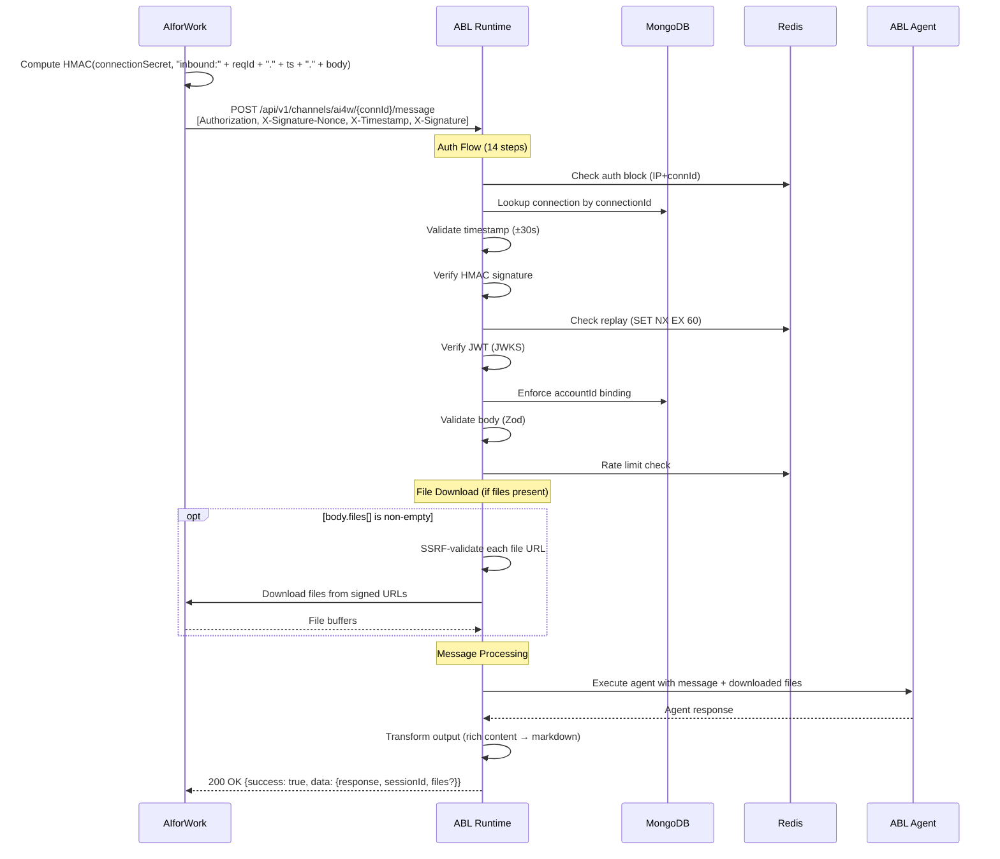
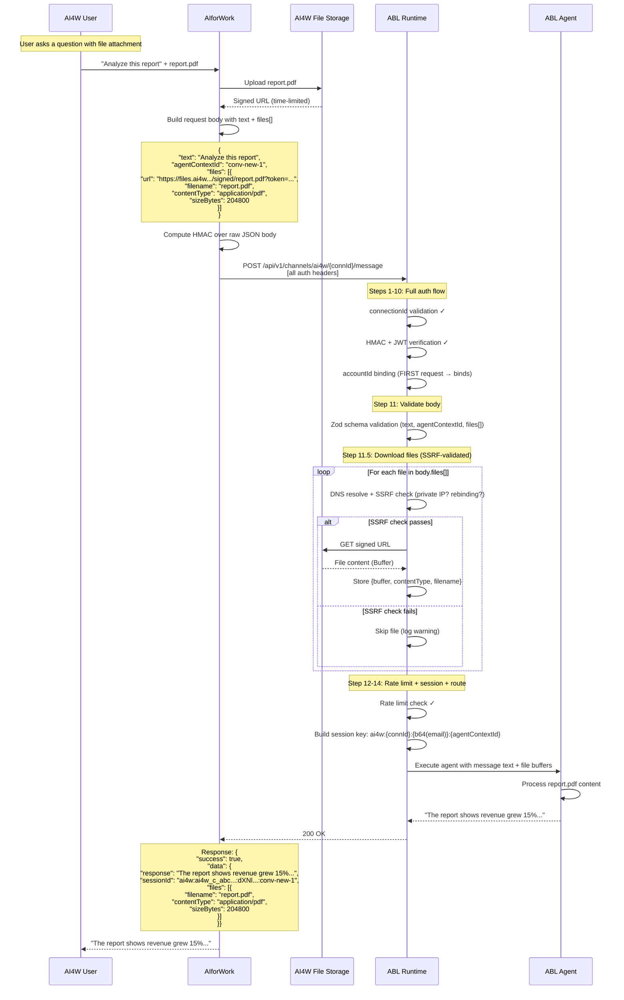
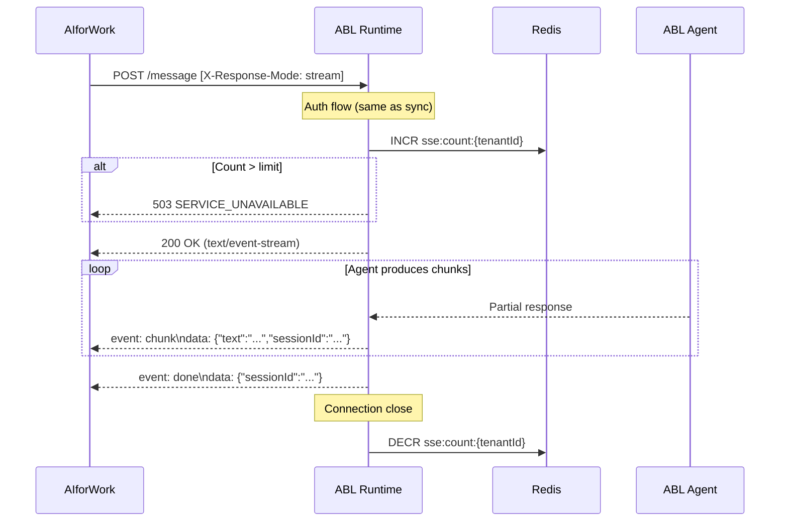
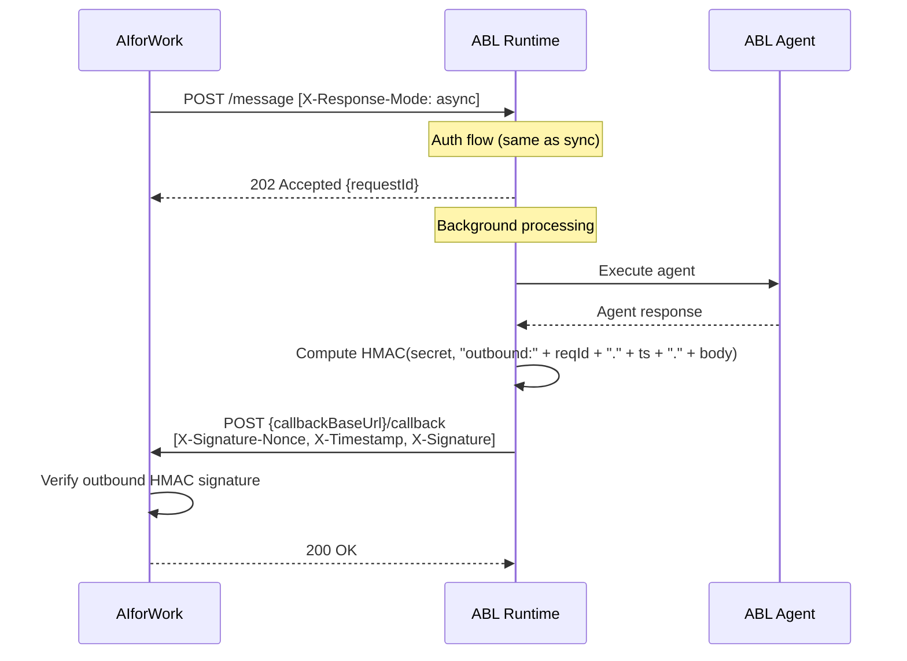
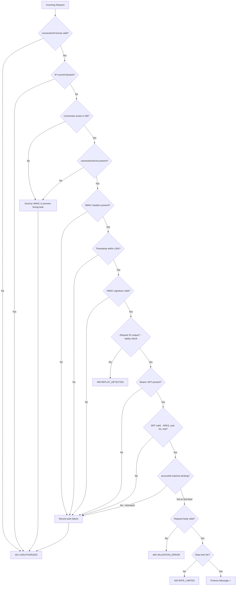

# AI4W ↔ ABL Platform Integration Guide

**Version**: 1.0
**Date**: 2026-04-19
**Status**: P0 (Foundation) + P1 (Streaming/Async) + P2 (Rich Content/Files) + P4 (Discovery/Provisioning) implemented
**Audience**: AI4W developers integrating ABL agents

---

## Table of Contents

1. [Architecture Overview](#1-architecture-overview)
2. [Authentication](#2-authentication)
3. [Messaging API](#3-messaging-api)
4. [Response Modes](#4-response-modes)
5. [Discovery & Provisioning API](#5-discovery--provisioning-api)
6. [File Exchange](#6-file-exchange)
7. [Session Management](#7-session-management)
8. [Error Handling](#8-error-handling)
9. [Rate Limiting & Resilience](#9-rate-limiting--resilience)
10. [Configuration Reference](#10-configuration-reference)
11. [Flow Diagrams](#11-flow-diagrams)
12. [Integration Checklist](#12-integration-checklist)
13. [Future Phases](#13-future-phases)

---

## 1. Architecture Overview

ABL Platform exposes an `ai4w` channel type that allows AIforWork to invoke ABL agents as workers. AI4W orchestrates conversations and routes messages to ABL, which executes the agent and returns results.

```
┌─────────────────────┐         ┌─────────────────────────┐
│                     │         │                         │
│    AIforWork        │  HTTP   │    ABL Platform          │
│    (KoreServer)     │────────▶│    (Runtime)             │
│                     │         │                         │
│  ┌───────────────┐  │         │  ┌───────────────────┐  │
│  │ ABLGateway    │──┼────────▶│  │ ai4w-channel.ts   │  │
│  │ Service       │  │  msg    │  │ (route handler)   │  │
│  └───────────────┘  │         │  └────────┬──────────┘  │
│                     │         │           │              │
│  ┌───────────────┐  │         │  ┌────────▼──────────┐  │
│  │ AgentsService │  │         │  │ ai4w-adapter.ts   │  │
│  │ (ablAgent)   │  │         │  │ (channel adapter) │  │
│  └───────────────┘  │         │  └────────┬──────────┘  │
│                     │         │           │              │
│  ┌───────────────┐  │         │  ┌────────▼──────────┐  │
│  │ Discovery UI  │──┼────────▶│  │ internal-discovery │  │
│  │ (browse+      │  │  prov   │  │ (provisioning API)│  │
│  │  provision)   │  │         │  └───────────────────┘  │
│  └───────────────┘  │         │                         │
└─────────────────────┘         └─────────────────────────┘
```

### Key Concepts

| Concept              | Description                                                                                        |
| -------------------- | -------------------------------------------------------------------------------------------------- |
| **Connection**       | A provisioned link between an AI4W account and a specific ABL agent. Identified by `connectionId`. |
| **connectionId**     | Unique identifier (`ai4w_c_` + 32 hex chars). Used in URL path for message routing.                |
| **connectionSecret** | Shared secret for HMAC signing. Revealed once at provisioning time.                                |
| **Response Mode**    | How ABL returns results: `sync`, `stream` (SSE), or `async` (callback).                            |
| **Session**          | ABL maintains conversation state. Session key derived from connectionId + email + agentContextId.  |

### Feature Flags

The messaging API at `/api/v1/channels/ai4w` is always mounted — no flag required.
The internal discovery/provisioning API is opt-in because it carries a different
auth surface (service token) intended only for back-office provisioning.

| Flag                        | Default | Purpose                                                    |
| --------------------------- | ------- | ---------------------------------------------------------- |
| `AI4W_INTERNAL_API_ENABLED` | `false` | Gates the discovery/provisioning API at `/api/internal/v1` |

---

## 2. Authentication

ABL uses **dual-layer authentication** for all messaging requests:

1. **HMAC-SHA256** — proves payload integrity and connection authorization
2. **JWT (JWKS-backed)** — proves end-user identity (email, accountId)

### 2.1 HMAC Signature

Every request from AI4W to ABL must include an HMAC signature computed over the request body.

#### Required Headers

| Header              | Format         | Example                                |
| ------------------- | -------------- | -------------------------------------- |
| `X-Signature-Nonce` | UUID v4        | `550e8400-e29b-41d4-a716-446655440000` |
| `X-Timestamp`       | ISO 8601       | `2026-04-19T10:30:00.000Z`             |
| `X-Signature`       | `sha256={hex}` | `sha256=a1b2c3d4...`                   |

#### Signature Computation

```
direction = "inbound"   // AI4W → ABL
payload   = direction + ":" + requestId + "." + timestamp + "." + rawBody
signature = HMAC-SHA256(connectionSecret, payload)
header    = "sha256=" + hex(signature)
```

**Example (pseudocode):**

```javascript
const requestId = crypto.randomUUID();
const timestamp = new Date().toISOString();
const rawBody = JSON.stringify(messageBody);

const payload = `inbound:${requestId}.${timestamp}.${rawBody}`;
const signature = crypto.createHmac('sha256', connectionSecret).update(payload).digest('hex');

// Set headers
headers['X-Signature-Nonce'] = requestId;
headers['X-Timestamp'] = timestamp;
headers['X-Signature'] = `sha256=${signature}`;
```

#### Timestamp Tolerance

Timestamps must be within **±30 seconds** of ABL server time. Both ISO 8601 strings and Unix epoch seconds are accepted.

#### Replay Protection

Each `X-Signature-Nonce` is stored in Redis with a 60-second TTL. Duplicate request IDs within that window return `409 Conflict`.

### 2.2 JWT Authentication

In addition to HMAC, every request must include a Bearer JWT in the `Authorization` header.

#### Required Header

```
Authorization: Bearer <jwt-token>
```

#### JWT Requirements

| Field       | Required | Description                                                                                                       |
| ----------- | -------- | ----------------------------------------------------------------------------------------------------------------- |
| `sub`       | Yes      | Subject identifier                                                                                                |
| `email`     | Yes      | User's email address (used for session binding)                                                                   |
| `accountId` | Yes      | AI4W account ID (used for connection binding)                                                                     |
| `iss`       | Yes      | Must appear in `AI4W_TRUSTED_ISSUERS` (comma-separated list, e.g. `https://work.kore.ai,https://work-qa.kore.ai`) |
| `aud`       | Yes      | Must match `AI4W_JWT_AUDIENCE` (default: `urn:kore:agentic`)                                                      |
| `iat`       | Yes      | Issued-at timestamp                                                                                               |
| `exp`       | Yes      | Expiration timestamp                                                                                              |
| `scope`     | No       | Optional scope string                                                                                             |
| `product`   | No       | Optional product identifier                                                                                       |

ABL verifies the JWT using the issuer's JWKS. At startup, each trusted
issuer's JWKS URI is discovered from `{iss}/.well-known/openid-configuration`
and pre-warmed; the discovery doc's own `issuer` field must match the
configured URL (self-consistency check). JWKS rotation is handled
automatically — an unknown `kid` triggers a background re-fetch. Multiple
issuers can be trusted simultaneously to support SaaS (QA/SIT/prod) alongside
on-prem deployments.

### 2.3 Account ID Binding

On the **first request** to a connection, ABL binds the JWT's `accountId` to that connection. All subsequent requests must use the same `accountId`. A mismatch returns `401 Unauthorized`.

This prevents connection credential theft — even if a connectionSecret is compromised, it cannot be used from a different AI4W account.

### 2.4 Auth Failure Rate Limiting

ABL tracks authentication failures per source IP + connectionId pair:

- After **10 failures** within 60 seconds → IP+connection is **blocked for 5 minutes**
- Blocked requests receive `401` immediately (no HMAC/JWT processing)

### 2.5 Complete Auth Header Set

Every messaging request requires ALL of these headers:

```http
POST /api/v1/channels/ai4w/{connectionId}/message HTTP/1.1
Content-Type: application/json
Authorization: Bearer <jwt-token>
X-Signature-Nonce: <uuid>
X-Timestamp: <iso-8601>
X-Signature: sha256=<hex-signature>
X-Response-Mode: sync|stream|async   (optional, overrides connection default)
```

---

## 3. Messaging API

### 3.1 Send Message

**Endpoint**: `POST /api/v1/channels/ai4w/{connectionId}/message`

**connectionId format**: `ai4w_c_` followed by exactly 32 lowercase hex characters.
Example: `ai4w_c_a1b2c3d4e5f6a7b8c9d0e1f2a3b4c5d6`

Invalid connectionId format returns `401` (not `400`) to avoid leaking validation details.

#### Request Body

```json
{
  "text": "What is the status of project Alpha?",
  "agentContextId": "conv-12345",
  "conversationHistory": [
    {
      "role": "user",
      "content": "Tell me about project Alpha"
    },
    {
      "role": "assistant",
      "content": "Project Alpha is a data pipeline initiative..."
    }
  ],
  "files": [
    {
      "url": "https://ai4w-files.example.com/signed/report.pdf",
      "filename": "report.pdf",
      "contentType": "application/pdf",
      "sizeBytes": 204800
    }
  ],
  "metadata": {
    "locale": "en-US",
    "timezone": "America/New_York"
  }
}
```

#### Body Schema

| Field                 | Type   | Required | Description                                                                                 |
| --------------------- | ------ | -------- | ------------------------------------------------------------------------------------------- |
| `text`                | string | Yes      | The user's message text                                                                     |
| `agentContextId`      | string | Yes      | AI4W conversation/context ID. Used in session key derivation.                               |
| `conversationHistory` | array  | No       | Previous messages for context. Each entry has `role` (user/assistant/system) and `content`. |
| `files`               | array  | No       | Files to send with the message. See [File Exchange](#6-file-exchange).                      |
| `metadata`            | object | No       | Arbitrary key-value metadata (locale, timezone, etc.)                                       |

### 3.2 Auth Flow (14 Steps)

ABL processes each request through this exact sequence. A failure at any step returns immediately.

```
 1. Validate connectionId format (regex: /^ai4w_c_[0-9a-f]{32}$/)
 2. Check auth block (is this IP+connection blocked?)
 3. Lookup connection in database
 4. Extract connectionSecret from connection credentials
 5. Extract HMAC headers (X-Signature-Nonce, X-Timestamp, X-Signature)
 6. Validate timestamp (±30s tolerance)
 7. Verify HMAC signature
 8. Check replay (X-Signature-Nonce uniqueness in 60s window)
 9. Verify JWT (JWKS, audience, issuer)
10. Enforce accountId binding (first-request binds, subsequent must match)
11. Validate request body (Zod schema)
11.5. Download files from signed URLs (SSRF-validated)
12. Rate limit check (per-tenant)
13. Build session key
14. Route by response mode (sync/stream/async)
```

Steps 1-10 all return `401` with a uniform error body to prevent information leakage:

```json
{
  "success": false,
  "error": {
    "code": "UNAUTHORIZED",
    "message": "Authentication failed"
  }
}
```

---

## 4. Response Modes

The response mode determines how ABL returns the agent's output. Set via:

1. `X-Response-Mode` request header (per-request override)
2. Connection's configured `responseMode` (set at provisioning)
3. Default: `sync`

### 4.1 Sync Mode

Standard request-response. ABL processes the message and returns the result in the HTTP response.

**Response** (`200 OK`):

```json
{
  "success": true,
  "data": {
    "response": "Project Alpha is on track. The data pipeline...",
    "sessionId": "ai4w:ai4w_c_abc123:dXNlckBleGFtcGxlLmNvbQ:conv-12345",
    "files": [
      {
        "filename": "report.pdf",
        "contentType": "application/pdf",
        "sizeBytes": 204800
      }
    ]
  }
}
```

**Headers**:

```
X-Response-Mode-Used: sync
```

### 4.2 Stream Mode (SSE)

Server-Sent Events for real-time streaming of agent output.

**Response** (`200 OK` with `Content-Type: text/event-stream`):

```
event: chunk
data: {"text":"Project Alpha is ","sessionId":"ai4w:..."}

event: chunk
data: {"text":"on track. The data pipeline...","sessionId":"ai4w:..."}

event: done
data: {"sessionId":"ai4w:..."}
```

**Headers**:

```
Content-Type: text/event-stream
Cache-Control: no-cache
Connection: keep-alive
X-Accel-Buffering: no
X-Response-Mode-Used: stream
```

**SSE Events**:

| Event         | Description                                          |
| ------------- | ---------------------------------------------------- |
| `chunk`       | Partial response text with `text` and `sessionId`    |
| `done`        | Stream complete with `sessionId`                     |
| `error`       | Error occurred: `{"error": "message"}`               |
| `: heartbeat` | Comment-line heartbeat every 15 seconds (keep-alive) |

**Client implementation notes**:

- Use `EventSource` or equivalent SSE client
- Handle heartbeat comments (lines starting with `:`) as keep-alive signals
- The connection will be closed by ABL after `done` or `error` event
- If the connection drops unexpectedly, retry with a new `X-Signature-Nonce`

**Concurrent SSE limit**: Maximum 50 concurrent SSE connections per tenant (configurable via `AI4W_MAX_SSE_CONNECTIONS_PER_TENANT`). Exceeding this returns:

```json
{
  "success": false,
  "error": {
    "code": "SERVICE_UNAVAILABLE",
    "message": "Too many concurrent streaming connections"
  }
}
```

### 4.3 Async Mode

ABL accepts the message immediately and delivers the result via a callback URL.

**Immediate Response** (`202 Accepted`):

```json
{
  "success": true,
  "data": {
    "requestId": "550e8400-e29b-41d4-a716-446655440000"
  }
}
```

**Headers**:

```
X-Response-Mode-Used: async
```

**Callback delivery** (ABL → AI4W):

ABL will POST the result to the connection's `callbackBaseUrl` with HMAC-signed headers using the `outbound:` direction prefix:

```
Signature payload = "outbound:" + requestId + "." + timestamp + "." + rawBody
```

The callback request includes:

```http
POST {callbackBaseUrl}/callback HTTP/1.1
Content-Type: application/json
X-Signature-Nonce: <uuid>
X-Timestamp: <iso-8601>
X-Signature: sha256=<hex-signature>
```

AI4W should verify the outbound signature using the same `connectionSecret` but with the `outbound:` direction prefix.

---

## 5. Discovery & Provisioning API

These endpoints enable AI4W to discover ABL tenants/agents and auto-provision connections. All are protected by **dual-layer service auth**: `X-Service-Token` + JWT.

**Base URL**: `/api/internal/v1`
**Feature Flag**: `AI4W_INTERNAL_API_ENABLED=true`

### 5.1 Service Authentication

Every discovery/provisioning request requires:

| Header            | Description                                                           |
| ----------------- | --------------------------------------------------------------------- |
| `X-Service-Token` | Shared secret (`AI4W_SERVICE_TOKEN` env var). Timing-safe comparison. |
| `Authorization`   | `Bearer <jwt-token>` — same JWT as messaging requests                 |

### 5.2 Discover Tenants

Find tenants accessible to a user by their email.

**Endpoint**: `GET /api/internal/v1/tenants/by-membership?email={email}`

**Response** (`200 OK`):

```json
{
  "success": true,
  "data": {
    "tenants": [
      { "id": "tenant-uuid-1", "name": "Acme Corp" },
      { "id": "tenant-uuid-2", "name": "Beta Inc" }
    ]
  }
}
```

Returns empty array (not 403) if user not found — prevents email enumeration.

### 5.3 Discover Projects

Find projects within a tenant that the user can access. **This replaces the previous `/agents/discoverable` endpoint** — AI4W's V2 product model maps one AI4W "agent" to one ABL project.

**Endpoint**: `GET /api/internal/v1/tenants/{tenantId}/projects/discoverable`

**Query params**:

| Param    | Type   | Description                                                 |
| -------- | ------ | ----------------------------------------------------------- |
| `limit`  | int    | Page size. Default 50, max 200                              |
| `cursor` | string | Opaque cursor for keyset pagination on `(name, _id)`        |
| `q`      | string | Case-insensitive substring filter on `name` / `description` |
| `sort`   | enum   | `name` (default) or `recent` (maps to `updatedAt desc`)     |

**Response** (`200 OK`):

```json
{
  "success": true,
  "data": {
    "projects": [
      {
        "id": "project-uuid-1",
        "name": "Customer Support",
        "description": "Production support agents",
        "agentCount": 3
      },
      {
        "id": "project-uuid-2",
        "name": "Analytics Workspace",
        "description": "Reporting & data agents",
        "agentCount": 1
      }
    ],
    "nextCursor": null
  }
}
```

- `agentCount` = live count of active deployments in the project.
- `nextCursor` is `null` when there are no further pages.

**RBAC rules**:

- Tenant `ADMIN`/`OWNER` see all projects in the tenant
- Regular members see only projects they have `ProjectMember` membership in
- No membership → empty array (not 403) — prevents enumeration

**Ordering contract**: projects are sorted by `name` ascending by default. Both sides of the integration can rely on this ordering for UI rendering.

### 5.4 Provision Connection

Create a new channel connection **bound to an ABL project** (not to a specific agent or deployment). The admin tunes the pinned `environment` or `deploymentId` afterwards via the ABL channel-customization UI — exactly like peer channels (Genesys, VXML, Audiocodes).

**Endpoint**: `POST /api/internal/v1/channel-connections/provision`

**Request Body**:

```json
{
  "tenantId": "tenant-uuid-1",
  "projectId": "project-uuid-1",
  "connectionName": "Support Bot Link",
  "environment": "production",
  "callbackBaseUrl": "https://work.kore.ai/api/public/agents/:agentId",
  "responseMode": "stream"
}
```

| Field             | Type   | Required | Description                                                                 |
| ----------------- | ------ | -------- | --------------------------------------------------------------------------- |
| `tenantId`        | string | Yes      | Target ABL tenant                                                           |
| `projectId`       | string | Yes      | Target ABL project (the binding — ai4w connections are project-scoped)      |
| `connectionName`  | string | No       | Display name. Defaults to `Connection N+1` per project when omitted         |
| `environment`     | string | No       | Environment pin (e.g. `production`). Mutually exclusive with `deploymentId` |
| `deploymentId`    | string | No       | Specific deployment pin. Mutually exclusive with `environment`              |
| `callbackBaseUrl` | URL    | Yes      | Base URL for async callbacks (SSRF-validated)                               |
| `responseMode`    | enum   | No       | Default response mode: `sync`, `stream`, or `async`                         |

> **Not accepted**: `agentId`, `agentName`, `deploymentId` + `environment` together. Unknown or deprecated fields cause a 400 validation error.

**Response** (`201 Created`):

```json
{
  "success": true,
  "data": {
    "connectionId": "ai4w_c_a1b2c3d4e5f6a7b8c9d0e1f2a3b4c5d6",
    "connectionSecret": "ai4w_s_e7f8a9b0c1d2e3f4a5b6c7d8e9f0a1b2"
  }
}
```

**IMPORTANT**: The `connectionSecret` is returned **only once** at provisioning time. Store it securely. It cannot be retrieved again.

**Validations**:

- `environment` and `deploymentId` are mutually exclusive — both set → 400
- `callbackBaseUrl` is validated against SSRF policy (no private IPs, DNS rebinding protection)
- User must have active membership in the specified tenant
- Credentials are encrypted at rest (when tenant encryption is configured)

**Runtime resolution**: At message time, ABL resolves the live deployment from the connection's `environment` (latest active deployment in that environment) or `deploymentId` (pinned) via the shared `DeploymentResolver`. If both are null the resolver falls back to dev-mode working copy.

### 5.5 Get Connection Info (channel namespace — no service token)

Retrieve metadata about an existing connection. This endpoint lives under the **public channel namespace** and uses the same HMAC + JWT auth chain as `/message`, so callers that hold the connection credentials do not need the internal service token. It also replaces the former standalone `/ping` — running the full auth chain doubles as the "Test & Continue" health check, and the response carries the metadata needed to render the linked-app banner in a single round-trip.

**Endpoint**: `GET /api/v1/channels/ai4w/{connectionId}/info`

**Headers** (identical to `/message`):

```
Authorization: Bearer <AI4W JWT>
X-Signature-Nonce:  <UUID>
X-Timestamp:   <ISO 8601>
X-Signature:   sha256=<hex>
```

**HMAC signing** — the body is empty on GET, so the signing input contains an empty string:

```
payload   = "inbound:" + requestId + "." + timestamp + "." + ""
signature = HMAC-SHA256(connectionSecret, payload)
```

**Side-effect profile**:

- full auth chain (HMAC, timestamp ±30s, replay check, JWT, accountId binding)
- **no** session resolution, **no** agent execution, **no** trace events
- **no** tenant rate-limit consumption
- the auth-failure counter still increments on failure so brute-forced bad creds remain blocked

**Response** (`200 OK`):

```json
{
  "success": true,
  "data": {
    "connectionId": "ai4w_c_a1b2c3d4e5f6a7b8c9d0e1f2a3b4c5d6",
    "channelType": "ai4w",
    "status": "active",
    "displayName": "Support Bot Link",
    "tenantId": "tenant-uuid-1",
    "tenantName": "Acme Corp",
    "projectId": "project-uuid-1",
    "projectName": "Customer Support",
    "agentCount": 3,
    "config": {
      "callbackBaseUrl": "https://work.kore.ai/api/public/agents/:agentId",
      "responseMode": "stream"
    },
    "pinning": {
      "deploymentId": null,
      "environment": "production"
    },
    "currentDeployment": {
      "deploymentId": "dep-uuid-42",
      "entryAgentName": "SupportAgent",
      "label": "v2.1",
      "createdAt": "2026-04-20T08:12:15Z"
    }
  }
}
```

On bad auth the response is a uniform 401 with the same body as a failed `/message` request — preserving the no-existence-oracle property.

**Field notes**:

- `agentCount` — live count of active deployments in the bound project
- `pinning` — exactly one of `deploymentId` / `environment` is non-null (or both null → working-copy dev mode)
- `currentDeployment` — resolved live at call time via the same query path as `DeploymentResolver`; reflects what would run **right now** for this connection. `null` when the project has no resolvable active deployment
- `connectionSecret` is **never** returned

**Rate-limit**: policy is an open item pending product review. Default until decided: `/info` does **not** consume tenant rate-limit quota.

### 5.6 Deactivate Connection

Soft-disable an ai4w connection. Reversible via the existing ABL channel-customization UI.

**Endpoint**: `POST /api/internal/v1/channel-connections/{connectionId}/deactivate`

- Sets `status='inactive'` on the row (retained, not deleted)
- In-flight sessions drain naturally; new `/message` and `/info` requests return uniform 401
- Scoped to `channelType='ai4w'` — other channel types return 404

**Response** (`200 OK`):

```json
{ "success": true, "data": { "status": "inactive" } }
```

Idempotent: deactivating an already-inactive connection returns 200.

### 5.7 Unlink (Delete) Connection

Hard-remove an ai4w connection. Intended for AI4W's orphan-reaper job.

**Endpoint**: `DELETE /api/internal/v1/channel-connections/{connectionId}`

- Removes the row entirely
- Scoped to `channelType='ai4w'` — other channel types return 404
- Does **not** cascade to sessions — sessions TTL naturally per existing policy

**Response** (`200 OK`):

```json
{ "success": true, "data": { "deleted": true } }
```

---

## 6. File Exchange

AI4W can send files to ABL agents via signed URLs. Files are downloaded by ABL at message ingestion time with SSRF protection.

### 6.1 Sending Files (AI4W → ABL)

Files can be sent with **any message**, including the very first message to a new connection. ABL downloads all files at ingestion time (step 11.5 of the auth flow) — before the agent executes.

Include files in the message body's `files` array:

```json
{
  "text": "Analyze this report",
  "agentContextId": "conv-123",
  "files": [
    {
      "url": "https://ai4w-files.example.com/signed/report.pdf?token=abc123",
      "filename": "report.pdf",
      "contentType": "application/pdf",
      "sizeBytes": 204800
    }
  ]
}
```

| Field         | Type         | Required | Description         |
| ------------- | ------------ | -------- | ------------------- |
| `url`         | string (URL) | Yes      | Signed download URL |
| `filename`    | string       | Yes      | Original filename   |
| `contentType` | string       | Yes      | MIME type           |
| `sizeBytes`   | number       | No       | File size in bytes  |

### 6.2 SSRF Protection

ABL validates all file URLs before downloading:

- **Private IP blocking**: `10.x.x.x`, `172.16-31.x.x`, `192.168.x.x`, `127.x.x.x`, `::1`, link-local addresses are blocked
- **DNS rebinding mitigation**: DNS resolution is checked before connecting
- **Trusted CIDR allowlist**: Same-VPC addresses can be allowlisted via `AI4W_TRUSTED_CALLBACK_CIDRS`

If a URL fails SSRF validation, the file is skipped (not the entire request).

### 6.3 File Download Timing & Behavior

- Files are downloaded **synchronously at ingestion time** (step 11.5), before the agent executes
- **Signed URLs must be valid at request time** — ABL does not retry or defer file downloads
- **Multiple files** are downloaded sequentially; all successfully downloaded files are passed to the agent
- **File download failures are non-fatal** — a failed download skips that file, the message is still processed with remaining files
- **Downloaded file buffers** are held in memory for the agent execution lifetime, then discarded
- The sync response echoes metadata for files that were **successfully downloaded** (not the original request list)

### 6.4 Receiving Files (ABL → AI4W)

When ABL agent output includes files, the sync response includes file metadata:

```json
{
  "success": true,
  "data": {
    "response": "Here is the analysis...",
    "sessionId": "ai4w:...",
    "files": [
      {
        "filename": "analysis-output.csv",
        "contentType": "text/csv",
        "sizeBytes": 15360
      }
    ]
  }
}
```

### 6.5 Rich Content

ABL transforms structured agent output (carousels, quick replies, tables, KPIs, etc.) into markdown for AI4W rendering. The `response` field in the API output contains the rendered markdown.

Supported rich content types: carousel, quick_replies, list, table, image, video, audio, file, kpi, progress, form, feedback.

---

## 7. Session Management

ABL maintains conversation sessions automatically. AI4W controls session continuity via the `agentContextId` field.

### 7.1 Session Key Format

```
ai4w:{connectionId}:{base64url(email)}:{agentContextId}
```

Example:

```
ai4w:ai4w_c_abc123def456:dXNlckBleGFtcGxlLmNvbQ:conv-12345
```

### 7.2 Session Continuity

- **Same session**: Use the same `agentContextId` across messages. ABL maintains conversation history and agent state.
- **New session**: Use a different `agentContextId`. ABL starts a fresh conversation.
- **User isolation**: Sessions are scoped to the JWT email. Different users on the same connection get separate sessions.

### 7.3 Conversation History

You may optionally pass `conversationHistory` in the request body to provide additional context. ABL uses its own session state as the primary history source — the provided history serves as supplementary context.

---

## 8. Error Handling

### 8.1 Error Response Format

All errors follow this envelope:

```json
{
  "success": false,
  "error": {
    "code": "ERROR_CODE",
    "message": "Human-readable description",
    "details": []
  }
}
```

### 8.2 Error Codes

| HTTP Status | Code                  | Meaning                               | AI4W Action                              |
| ----------- | --------------------- | ------------------------------------- | ---------------------------------------- |
| `400`       | `VALIDATION_ERROR`    | Invalid request body or parameters    | Fix request and retry                    |
| `401`       | `UNAUTHORIZED`        | Authentication failed (any auth step) | Check credentials, token expiry          |
| `404`       | `NOT_FOUND`           | Connection not found (discovery API)  | Re-provision connection                  |
| `403`       | `FORBIDDEN`           | User lacks access to resource         | Check tenant/project membership          |
| `409`       | `REPLAY_DETECTED`     | Duplicate `X-Signature-Nonce`         | Generate new request ID and retry        |
| `429`       | `RATE_LIMITED`        | Too many requests                     | Wait for `Retry-After` header (seconds)  |
| `500`       | `EXECUTION_ERROR`     | Internal server error                 | Retry with backoff                       |
| `500`       | `INTERNAL_ERROR`      | Service configuration error           | Contact ABL admin                        |
| `503`       | `SERVICE_UNAVAILABLE` | SSE connection limit exceeded         | Reduce concurrent streams or retry later |

### 8.3 Auth Failure Handling

All authentication failures (steps 1-10) return the **same** 401 response to prevent information leakage:

```json
{
  "success": false,
  "error": {
    "code": "UNAUTHORIZED",
    "message": "Authentication failed"
  }
}
```

AI4W should NOT attempt to distinguish between different auth failure types based on the response. Instead:

1. **Check credentials** — is the connectionSecret correct?
2. **Check JWT** — is it expired? Does `iss` appear in `AI4W_TRUSTED_ISSUERS`? Does `aud` match `AI4W_JWT_AUDIENCE` (default `urn:kore:agentic`)?
3. **Check timestamp** — is the server clock synchronized? (±30s tolerance)
4. **Check accountId** — is this the same AI4W account that first used this connection?
5. **Check IP blocking** — have there been >10 auth failures recently?

### 8.4 Retry Strategy

| Error                     | Retry? | Strategy                                                       |
| ------------------------- | ------ | -------------------------------------------------------------- |
| `401 UNAUTHORIZED`        | No     | Fix credentials, do not retry blindly (triggers rate limiting) |
| `409 REPLAY_DETECTED`     | Yes    | New `X-Signature-Nonce`, immediate retry                       |
| `429 RATE_LIMITED`        | Yes    | Wait `Retry-After` seconds                                     |
| `500 EXECUTION_ERROR`     | Yes    | Exponential backoff (1s, 2s, 4s, max 30s)                      |
| `503 SERVICE_UNAVAILABLE` | Yes    | Backoff, reduce concurrent connections                         |

---

## 9. Rate Limiting & Resilience

### 9.1 Per-Tenant Rate Limits

| Limit                   | Default    | Env Var                        |
| ----------------------- | ---------- | ------------------------------ |
| Max requests per window | 100        | `AI4W_RATE_LIMIT_MAX_REQUESTS` |
| Window duration         | 60 seconds | `AI4W_RATE_LIMIT_WINDOW_MS`    |

When rate limited, the response includes:

```
Retry-After: <seconds>
```

### 9.2 SSE Connection Limits

| Limit                         | Default | Env Var                               |
| ----------------------------- | ------- | ------------------------------------- |
| Max concurrent SSE per tenant | 50      | `AI4W_MAX_SSE_CONNECTIONS_PER_TENANT` |

### 9.3 Auth Failure Limits

| Limit                  | Default   | Env Var                       |
| ---------------------- | --------- | ----------------------------- |
| Auth failure threshold | 10        | `AI4W_AUTH_BLOCK_THRESHOLD`   |
| Block duration         | 5 minutes | `AI4W_AUTH_BLOCK_DURATION_MS` |

### 9.4 Request Size

Maximum request body size: **1 MB** (enforced by JSON body parser).

---

## 10. Configuration Reference

### 10.1 ABL Environment Variables

| Variable                              | Default                     | Description                                                                                                           |
| ------------------------------------- | --------------------------- | --------------------------------------------------------------------------------------------------------------------- |
| `AI4W_INTERNAL_API_ENABLED`           | `false`                     | Enable discovery/provisioning API (channel `/api/v1/channels/ai4w` is always mounted)                                 |
| `AI4W_TRUSTED_ISSUERS`                | `https://work.kore.ai/oidc` | Comma-separated list of trusted issuer URLs. JWKS discovered via `{iss}/.well-known/openid-configuration` at startup. |
| `AI4W_JWT_AUDIENCE`                   | `urn:kore:agentic`          | Single audience all issuers must use (ABL-controlled). AI4W must mint with this exact value.                          |
| `AI4W_OIDC_DISCOVERY_TIMEOUT_MS`      | `5000`                      | OIDC discovery fetch timeout at startup                                                                               |
| `AI4W_JWKS_FETCH_TIMEOUT_MS`          | `5000`                      | Per-key JWKS fetch timeout                                                                                            |
| `AI4W_JWKS_COOLDOWN_MS`               | `30000`                     | Cooldown for jose's kid-miss JWKS re-fetch                                                                            |
| `AI4W_ALLOW_HTTP_ISSUERS`             | `false`                     | Dev only — prod must be https                                                                                         |
| `AI4W_ISSUER_JWKS_OVERRIDES`          | —                           | JSON map `{iss → jwks_uri}` bypassing discovery (for issuers that don't publish OIDC discovery)                       |
| `AI4W_SERVICE_TOKEN`                  | —                           | Shared secret for internal API auth                                                                                   |
| `AI4W_HMAC_TIMESTAMP_TOLERANCE_MS`    | `30000`                     | Timestamp tolerance (ms)                                                                                              |
| `AI4W_AUTH_BLOCK_THRESHOLD`           | `10`                        | Auth failures before blocking                                                                                         |
| `AI4W_AUTH_BLOCK_DURATION_MS`         | `300000`                    | Block duration (ms)                                                                                                   |
| `AI4W_RATE_LIMIT_MAX_REQUESTS`        | `100`                       | Max requests per tenant per window                                                                                    |
| `AI4W_RATE_LIMIT_WINDOW_MS`           | `60000`                     | Rate limit window (ms)                                                                                                |
| `AI4W_MAX_SSE_CONNECTIONS_PER_TENANT` | `50`                        | Max concurrent SSE streams per tenant                                                                                 |
| `AI4W_TRUSTED_CALLBACK_CIDRS`         | —                           | Comma-separated CIDRs for SSRF allowlist                                                                              |

---

## 11. Flow Diagrams

### 11.1 Sync Message Flow



### 11.2 Message with Files Flow (First Question + Attachments)

This diagram shows the complete flow when AI4W sends a message with file attachments — including the very first message to a new connection.



**Key points for first-message-with-files:**

1. **accountId binding happens on the first request** — the JWT's `accountId` is permanently bound to this connection
2. **Files are downloaded AFTER body validation but BEFORE rate limiting** — invalid file URLs don't consume rate limit quota
3. **SSRF validation is per-file** — a failing URL skips that file but doesn't reject the entire request
4. **Signed URLs must be fresh** — ABL downloads immediately at ingestion time, not lazily
5. **File metadata echoed in response** — `files[]` in the response confirms which files were received with size info
6. **Session is created on first message** — the `agentContextId` establishes the session key for follow-up messages

### 11.3 SSE Streaming Flow (with optional files)



### 11.4 Async Callback Flow



### 11.5 Discovery & Provisioning Flow

```mermaid
sequenceDiagram
    participant UI as AI4W Discovery UI
    participant AI4W as AI4W Backend
    participant ABL as ABL Internal API

    Note over UI: User wants to add an ABL agent

    UI->>AI4W: Browse available projects
    AI4W->>ABL: GET /api/internal/v1/tenants/by-membership?email={email}<br/>[X-Service-Token, Authorization]
    ABL-->>AI4W: {tenants: [{id, name}, ...]}  (sorted by name asc)

    AI4W->>UI: Show tenant list
    UI->>AI4W: Select tenant

    AI4W->>ABL: GET /api/internal/v1/tenants/{tenantId}/projects/discoverable<br/>[?limit, ?cursor, ?q, ?sort]
    ABL-->>AI4W: {projects: [{id, name, description, agentCount}, ...], nextCursor}

    AI4W->>UI: Show paginated project list
    UI->>AI4W: Select project → Link

    AI4W->>ABL: POST /api/internal/v1/channel-connections/provision<br/>{tenantId, projectId, connectionName?, environment?, deploymentId?, callbackBaseUrl, responseMode?}
    ABL-->>AI4W: 201 {connectionId, connectionSecret}

    AI4W->>AI4W: Store connectionId + connectionSecret on the ablAgent record

    opt Render linked-app banner / "Test & Continue"
        AI4W->>ABL: GET /api/v1/channels/ai4w/{connectionId}/info<br/>[HMAC-signed over empty body + JWT; no service token needed]
        ABL-->>AI4W: meta + pinning + live currentDeployment
    end

    Note over UI: Project-bound connection now invocable;<br/>admin can later pin environment/deployment via ABL UI
```

### 11.6 Complete Auth Decision Tree



---

## 12. Integration Checklist

### 12.1 Before You Start

- [ ] ABL environment has `AI4W_INTERNAL_API_ENABLED=true` (for discovery; the channel itself is always mounted)
- [ ] ABL has `AI4W_SERVICE_TOKEN` configured (for internal API)
- [ ] AI4W issuer's OIDC discovery endpoint (`{iss}/.well-known/openid-configuration`) is reachable from ABL runtime
- [ ] Each trusted issuer is listed in `AI4W_TRUSTED_ISSUERS` (comma-separated)
- [ ] AI4W JWT includes required claims (`sub`, `email`, `accountId`, `iss`, `aud`)
- [ ] JWT audience matches `AI4W_JWT_AUDIENCE` config (default `urn:kore:agentic`)
- [ ] JWT issuer appears in `AI4W_TRUSTED_ISSUERS` (case-insensitive host, trailing slash ignored)

### 12.2 Provisioning

- [ ] Use discovery API to find tenants and agents
- [ ] Provision connection via POST `/channel-connections/provision`
- [ ] Store `connectionId` and `connectionSecret` securely
- [ ] `connectionSecret` is stored once — it cannot be retrieved again

### 12.3 Messaging Implementation

- [ ] HMAC signature uses `inbound:` direction prefix
- [ ] HMAC payload format: `inbound:{requestId}.{timestamp}.{rawBody}`
- [ ] `X-Signature-Nonce` is a unique UUID per request (not reused within 60s)
- [ ] `X-Timestamp` is ISO 8601 format, within ±30s of ABL server time
- [ ] `X-Signature` starts with `sha256=` prefix
- [ ] JWT is fresh (not expired) for every request
- [ ] `agentContextId` is consistent for messages in the same conversation

### 12.4 Response Mode Handling

- [ ] Sync: parse `{"success": true, "data": {"response": "..."}}` envelope
- [ ] Stream: handle SSE events (`chunk`, `done`, `error`, heartbeat comments)
- [ ] Async: handle `202 Accepted` and implement callback endpoint
- [ ] Callback verification: verify outbound HMAC with `outbound:` direction prefix

### 12.5 Error Handling

- [ ] Handle uniform 401 without trying to distinguish auth failure types
- [ ] Respect `Retry-After` header on 429 responses
- [ ] Implement exponential backoff for 500 errors
- [ ] Do NOT retry 401 blindly (triggers auth blocking after 10 failures)
- [ ] Handle 409 REPLAY_DETECTED by generating new request ID

### 12.6 Security

- [ ] `connectionSecret` stored encrypted at rest
- [ ] File URLs use signed/expiring tokens
- [ ] Server clock synchronized (NTP) for timestamp validation
- [ ] Callback endpoint validates outbound HMAC signatures from ABL

---

## 13. Future Phases

The following capabilities are planned but not yet implemented:

### P3 — Proactive Notifications & Human Approval (Deferred)

ABL will push notifications to AI4W when agent tasks require human approval. AI4W will deliver these via KANotificationService (push + bell + presence).

### P5 — Auth Challenge (Deferred)

ABL agents that require OAuth will suspend execution and push a challenge to AI4W. The user completes the OAuth flow in AI4W UI, and ABL resumes execution.

### P6 — Cross-Environment Support (Deferred)

OAuth2 client-credentials flow for cross-VPC deployments (replacing same-VPC JWT/JWKS with full OAuth2 token exchange).

---

## Appendix A: Code Reference

| Component              | File Path                                                        |
| ---------------------- | ---------------------------------------------------------------- |
| Channel route handler  | `apps/runtime/src/routes/ai4w-channel.ts`                        |
| Channel adapter        | `apps/runtime/src/channels/adapters/ai4w-adapter.ts`             |
| Auth module            | `apps/runtime/src/channels/adapters/ai4w-auth.ts`                |
| Type definitions       | `apps/runtime/src/channels/adapters/ai4w-types.ts`               |
| SSRF protection        | `apps/runtime/src/channels/adapters/ai4w-ssrf.ts`                |
| Content transformer    | `apps/runtime/src/channels/adapters/ai4w-content-transformer.ts` |
| Discovery/provisioning | `apps/runtime/src/routes/internal-discovery.ts`                  |
| Server mount points    | `apps/runtime/src/server.ts`                                     |
| Connection model       | `packages/database/src/models/channel-connection.model.ts`       |
