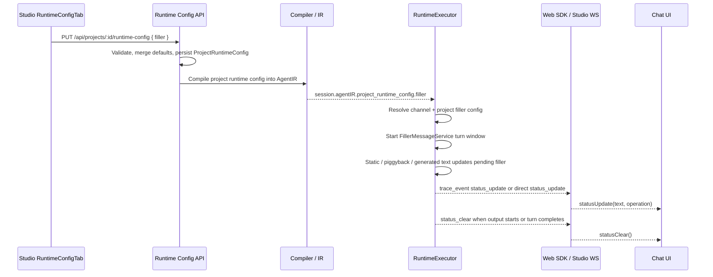
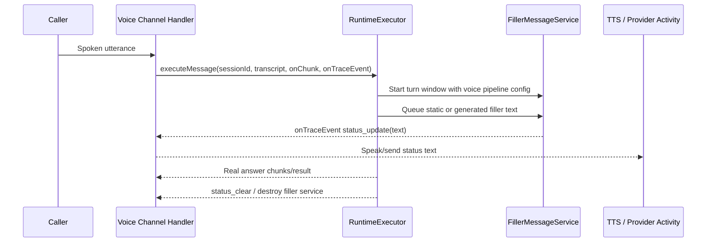

# Filler Messages Configuration and Technical Guide

This guide explains how filler messages are configured, persisted, compiled into runtime IR, emitted during LLM execution, and rendered across chat and voice channels. It is grounded in the current implementation paths so future changes can be traced end to end.

## Audience

- **Studio operators and solution builders** configuring perceived latency behavior for chat and voice agents.
- **Runtime engineers** debugging `status_update` / `status_clear` behavior.
- **Channel engineers** integrating filler status events into chat UI, TTS, or provider-specific activity streams.

## What Filler Messages Are

Filler messages are transient status updates shown or spoken while runtime work is in progress. They are not persisted as assistant messages. The runtime emits them as `status_update` trace-style events and clears them with `status_clear`.

Examples:

- `Working on that...`
- `Searching for products...`
- `Checking the policy details...`
- A contextual generated message such as `Looking into refund options...`

## Configuration Surface

Studio exposes filler settings in:

- `apps/studio/src/components/settings/RuntimeConfigTab.tsx`

The shared runtime-config validation schema is:

- `packages/shared/src/validation/project-runtime-config.ts`

The persisted runtime model is:

- `packages/database/src/models/project-runtime-config.model.ts`

### Fields

| Field                       | Type      | Default  | Purpose                                                                                      |
| --------------------------- | --------- | -------- | -------------------------------------------------------------------------------------------- |
| `enabled`                   | `boolean` | `true`   | Global filler switch.                                                                        |
| `chatEnabled`               | `boolean` | `true`   | Enables fillers for non-voice chat channels.                                                 |
| `voiceEnabled`              | `boolean` | `true`   | Enables fillers for voice pipeline channels.                                                 |
| `chatDelayMs`               | `number`  | `1200`   | Delay before static chat fillers are emitted.                                                |
| `voiceDelayMs`              | `number`  | `500`    | Delay before static voice fillers are emitted. Missing/undefined means use channel defaults. |
| `cooldownMs`                | `number`  | `3000`   | Minimum interval between emitted fillers.                                                    |
| `maxPerTurn`                | `number`  | `5`      | Maximum fillers emitted during one user-message turn.                                        |
| `piggybackEnabled`          | `boolean` | `true`   | Allows LLM `<status>...</status>` tags to become filler text.                                |
| `pipelineGenerationEnabled` | `boolean` | `true`   | Allows a parallel short LLM call to generate a contextual filler.                            |
| `modelSource`               | `string`  | `system` | Filler generation model source: `system`, `project`, `tenant`, or legacy `default`.          |
| `modelId`                   | `string`  | unset    | Project model override when `modelSource` is `project`.                                      |
| `tenantModelId`             | `string`  | unset    | Tenant model override when `modelSource` is `tenant`.                                        |
| `promptRef`                 | `object`  | unset    | Prompt-library override for generated filler prompt.                                         |

Validation lives in `fillerConfigSchema` and enforces:

- `tenantModelId` or `tenantModelRef` when `modelSource === 'tenant'`.
- `modelId` when `modelSource === 'project'`.
- Chat delay/cooldown bounds of `0..60000`; voice delay bounds of `1..60000`.
- `maxPerTurn` bounds of `0..20`.

Existing project runtime configs that stored the previous `voiceDelayMs: 0` schema default are backfilled to `500` by migration `20260513_034_backfill_voice_filler_delay`; runtime no longer treats `0` as an unset sentinel.

## Recommended Configuration

### Default Chat

Use the defaults for most web chat and SDK chat experiences:

```json
{
  "filler": {
    "enabled": true,
    "chatEnabled": true,
    "chatDelayMs": 1200,
    "cooldownMs": 3000,
    "maxPerTurn": 5,
    "piggybackEnabled": true,
    "pipelineGenerationEnabled": true,
    "modelSource": "system"
  }
}
```

This gives a filler after roughly 1.2 seconds of silence, updates the pending filler with contextual text when available, and clears the status as soon as real output streams.

### Default Voice Pipeline

Voice pipeline channels use channel defaults from `apps/runtime/src/services/filler/types.ts`:

```ts
DEFAULT_VOICE_PIPELINE_FILLER_CONFIG = {
  enabled: true,
  chatDelayMs: 1200,
  voiceDelayMs: 500,
  cooldownMs: 5000,
  maxPerTurn: 3,
};
```

This emits earlier than chat to keep voice turns responsive, while the longer cooldown and lower per-turn limit prevent TTS chatter.

### Disable Generated Fillers Only

Use this when a customer wants predictable static wording:

```json
{
  "filler": {
    "pipelineGenerationEnabled": false,
    "piggybackEnabled": true
  }
}
```

Static operation messages and response-model `<status>` tags can still produce fillers.

### Disable LLM Status Tags Only

Use this when response models emit awkward or unwanted `<status>` text:

```json
{
  "filler": {
    "piggybackEnabled": false,
    "pipelineGenerationEnabled": true
  }
}
```

The runtime can still use generated and static fallback fillers.

### Disable Fillers For A Project

```json
{
  "filler": {
    "enabled": false
  }
}
```

This disables both chat and voice filler emission for channels that would otherwise support it.

## Configuration Save Path

1. Studio loads and saves runtime config from `RuntimeConfigTab`.
   - Load: `apps/studio/src/components/settings/RuntimeConfigTab.tsx`
   - Save body includes `filler: config.filler`

2. Studio proxies the request to runtime.
   - `apps/studio/src/app/api/projects/[id]/runtime-config/route.ts`
   - Adds `X-Tenant-Id`
   - Requires `runtime_config:read` or `runtime_config:write`

3. Runtime validates and merges with platform defaults.
   - `apps/runtime/src/routes/project-runtime-config.ts`
   - `buildFinalRuntimeConfigCandidate()`
   - `normalizeMergedModelBinding()`

4. Runtime persists the project-scoped config.
   - `ProjectRuntimeConfig.findOneAndUpdate({ tenantId, projectId }, ...)`
   - Model: `packages/database/src/models/project-runtime-config.model.ts`

5. Runtime invalidates relevant model-resolution caches when `filler` changes.
   - `apps/runtime/src/routes/project-runtime-config.ts`
   - `shouldInvalidateModelResolutionCaches`

## IR and Session Resolution Path

Project runtime config is compiled into AgentIR by:

- `packages/compiler/src/platform/ir/project-runtime-config.ts`
- `mapFillerConfig()`

The IR type is:

- `packages/compiler/src/platform/ir/schema.ts`
- `RuntimeFillerConfigIR`
- `ProjectRuntimeConfigIR.filler`

The runtime session resolver includes `filler.promptRef` in prompt-library reference collection:

- `apps/runtime/src/channels/session-resolver.ts`
- `normalizeRuntimeConfigPromptRef()`

This means changes to the filler prompt reference participate in working-copy compilation identity.

## Channel Policy

Channel filler behavior is declared centrally in:

- `apps/runtime/src/channels/manifest.ts`

`ChannelFillerMode` has three modes:

| Mode             | Behavior                                                                                       |
| ---------------- | ---------------------------------------------------------------------------------------------- |
| `chat`           | Uses chat delay and emits status events for chat/websocket consumers.                          |
| `voice_pipeline` | Uses voice defaults: shorter initial delay, longer cooldown, lower max per turn, TTS-friendly. |
| `none`           | Disables fillers because mid-flight injection is unsupported or harmful.                       |

Examples:

| Channel                 | Filler mode      |
| ----------------------- | ---------------- |
| Web/chat style channels | `chat`           |
| `korevg`                | `voice_pipeline` |
| `audiocodes`            | `voice_pipeline` |
| `voice_pipeline`        | `voice_pipeline` |
| `voice_livekit`         | `voice_pipeline` |
| `voice_realtime`        | `none`           |
| `voice_vxml`            | `none`           |

Resolution happens in:

- `apps/runtime/src/services/filler/config-resolver.ts`
- `apps/runtime/src/services/filler/config.ts`

The runtime first resolves channel defaults from the manifest, then overlays project filler config from `session.agentIR?.project_runtime_config?.filler`.

## Execution Architecture

The central execution path is:

- `apps/runtime/src/services/runtime-executor.ts`
- `RuntimeExecutor.executeMessage()`

At the start of a message turn, runtime:

1. Determines the channel type.
2. Resolves channel filler defaults.
3. Merges project-level filler overrides.
4. Applies `none` mode by forcing `serviceConfig.enabled = false`.
5. Creates `FillerMessageService` when enabled.
6. Starts a turn-level silence window with a reasoning fallback.
7. Wires status-tag parsing into `onChunk`.
8. Starts a parallel generated-filler model call when enabled.
9. Wraps `onTraceEvent` so operation traces can update pending filler text.
10. Emits `status_clear` and destroys the service at completion.

### Core Service

`FillerMessageService` lives in:

- `apps/runtime/src/services/filler/filler-service.ts`

It owns:

- Turn start/close lifecycle.
- Pending filler timer.
- `cooldownMs` enforcement.
- `maxPerTurn` enforcement.
- Immediate emission when delay is `0`.
- Emitting transient `StatusEvent` objects.

Important behavior:

- The delay timer starts at the user-message boundary.
- Later contextual text updates the pending filler without restarting the timer.
- Real output closes the filler window so late async filler work cannot leak into the answer.

## Filler Sources

The runtime has three input sources for filler text.

### 1. Static Operation Messages

Static pools live in:

- `apps/runtime/src/services/filler/message-pools.ts`

Operation mapping lives in:

- `apps/runtime/src/services/runtime-executor.ts`
- `traceToFillerOperation()`

Trace events map to operations:

| Trace event                           | Filler operation   |
| ------------------------------------- | ------------------ |
| `tool_call_start`, active `tool_call` | `tool_call`        |
| `handoff`, `handoff_progress`         | `handoff`          |
| `delegate_start`, `fan_out_start`     | `delegation`       |
| `dsl_collect`                         | `extraction`       |
| `constraint_check`                    | `constraint_check` |
| Startup / generic pending work        | `reasoning`        |

Static messages are the fallback when generated or piggybacked text does not arrive first.

### 2. Piggybacked LLM Status Tags

For non-voice channels, the prompt builder appends an instruction asking the response model to emit short status messages before tool calls:

- `apps/runtime/src/services/execution/prompt-builder.ts`
- `STATUS_TAG_INSTRUCTION`

The parser lives in:

- `apps/runtime/src/services/filler/status-tag-parser.ts`

It:

- Handles `<status>...</status>` tags split across streaming chunks.
- Strips status tags from user-visible output.
- Returns extracted status text to the filler service.

Voice channels do not receive the status-tag instruction because spoken models should not produce literal status tags.

### 3. Parallel Generated Filler

Generated fillers live in:

- `apps/runtime/src/services/filler/pipeline-filler.ts`

Runtime starts this as a parallel short LLM call:

- `apps/runtime/src/services/runtime-executor.ts`
- `resolveFillerModel(...).then(...generatePipelineFiller...)`

The call:

- Uses `generateText()`.
- Has a 2 second timeout.
- Uses `maxOutputTokens: 30`.
- Uses `temperature: 0`.
- Returns `null` for empty output, overlong output, `NONE`, or failure.
- Normalizes successful text to end with `...`.

Model resolution lives in:

- `apps/runtime/src/services/filler/model-resolver.ts`

Model source behavior:

| Source    | Behavior                                                                |
| --------- | ----------------------------------------------------------------------- |
| `system`  | Uses `session.llmClient.resolveLanguageModel('tool_selection')`.        |
| `project` | Uses `resolveLanguageModelForModelOverride(modelId, 'tool_selection')`. |
| `tenant`  | Reuses pipeline model resolution with the tenant model id.              |
| `default` | Legacy alias normalized to `system`.                                    |

## Event Contract

Filler emission uses:

- `apps/runtime/src/services/filler/types.ts`
- `StatusEvent`

Runtime emits the event through `onTraceEvent` as:

```ts
{
  type: 'status_update',
  data: {
    text,
    operation,
    index,
    transient: true
  }
}
```

When real output starts or the execution exits with a visible filler, runtime emits:

```ts
{
  type: 'status_clear',
  data: {}
}
```

## Chat Flow



Chat rendering paths:

- Web SDK transport normalization: `packages/web-sdk/src/transport/DefaultTransport.ts`
- Chat client events: `packages/web-sdk/src/chat/ChatClient.ts`
- Studio WebSocket handling: `apps/studio/src/contexts/WebSocketContext.tsx`
- Studio transient state: `apps/studio/src/store/session-store.ts`
- Studio inline rendering: `apps/studio/src/app/arch/page.tsx`

Studio stores only the latest transient filler in `statusMessage` and clears it on `status_clear` or response end.

## Voice Flow

Voice channels use the same `status_update` event contract, but handlers convert status text into speech or provider activities.



Voice delivery paths:

| Channel / integration | Path                                                                                           | Behavior                                                                  |
| --------------------- | ---------------------------------------------------------------------------------------------- | ------------------------------------------------------------------------- |
| LiveKit               | `apps/runtime/src/services/voice/livekit/runtime-llm-adapter.ts`                               | Forwards `status_update` text into `onChunk`, which feeds the TTS stream. |
| KoreVG                | `apps/runtime/src/services/voice/korevg/korevg-session.ts`                                     | Sends filler text with `sendAgentMessage()` unless the turn is barge-in.  |
| AudioCodes            | `apps/runtime/src/routes/channel-audiocodes.ts`                                                | Sends filler text as a mid-turn message activity for provider TTS.        |
| Generic voice turn    | `apps/runtime/src/services/voice/voice-turn-coordinator.ts`                                    | Passes `onTraceEvent` into `executeMessage()`.                            |
| Realtime S2S / VXML   | `apps/runtime/src/channels/manifest.ts`, `apps/runtime/src/services/filler/config-resolver.ts` | Disabled with `fillerMode: 'none'`.                                       |

## Parallelism and Race Behavior

Generated filler is intentionally parallel to the main LLM/tool execution. It improves the pending filler text if it arrives before the turn closes.

Priority in practice:

1. A generated filler can update the pending message if it resolves before emission or before real output starts.
2. A piggybacked `<status>` tag can update the pending message as chunks stream.
3. Operation traces keep a static fallback available.

The timer remains anchored to user-message start. This avoids a common latency bug where fillers wait for tool execution to begin before starting their delay.

Late generated filler is ignored if:

- The filler service has been destroyed.
- Real output already closed the turn.
- The channel does not support fillers.

## Suppression Rules

Fillers do not emit when:

- `filler.enabled === false`.
- The current channel-specific toggle is disabled (`chatEnabled` or `voiceEnabled`).
- The channel manifest resolves to `fillerMode: 'none'`.
- `onTraceEvent` is unavailable.
- `maxPerTurn` has been reached.
- The pending turn has been closed by real output.
- The cooldown window has not elapsed.
- The generated filler returns `NONE`, times out, fails, or is too long.
- KoreVG detected barge-in for the current turn.

## Debugging Checklist

1. Confirm the project config saved:
   - `apps/runtime/src/routes/project-runtime-config.ts`
   - Mongo collection: `project_runtime_configs`

2. Confirm the config reached AgentIR:
   - `packages/compiler/src/platform/ir/project-runtime-config.ts`
   - Look for `project_runtime_config.filler`.

3. Confirm channel mode:
   - `apps/runtime/src/channels/manifest.ts`
   - `fillerMode` should be `chat`, `voice_pipeline`, or `none`.

4. Confirm runtime resolution:
   - `apps/runtime/src/services/filler/config-resolver.ts`
   - `apps/runtime/src/services/filler/config.ts`

5. Confirm `RuntimeExecutor` created the filler service:
   - `apps/runtime/src/services/runtime-executor.ts`
   - Look for `resolvedFillerConfig.serviceConfig.enabled`.

6. Confirm events are emitted:
   - `status_update`
   - `status_clear`

7. For chat, confirm SDK/UI consumption:
   - `packages/web-sdk/src/transport/DefaultTransport.ts`
   - `packages/web-sdk/src/chat/ChatClient.ts`
   - `apps/studio/src/contexts/WebSocketContext.tsx`
   - `apps/studio/src/app/arch/page.tsx`

8. For voice, confirm channel handler consumption:
   - LiveKit: `runtime-llm-adapter.ts`
   - KoreVG: `korevg-session.ts`
   - AudioCodes: `channel-audiocodes.ts`

## Testing Pointers

Primary test guide:

- `docs/testing/filler-messages.md`

Important test areas:

- Core service timing, cooldown, and max-per-turn.
- Status tag parsing across chunk boundaries.
- Channel config resolution for `chat`, `voice_pipeline`, and `none`.
- Runtime propagation from project config into service behavior.
- SDK handling of `status_update` and `status_clear`.
- Voice suppression during barge-in.

Useful test files are under:

- `apps/runtime/src/__tests__/channels/`
- `apps/runtime/src/__tests__/extraction/filler-config-propagation.test.ts`
- `apps/runtime/src/__tests__/thoughts-status-ws.e2e.test.ts`
- `packages/web-sdk/src/__tests__/chat-client-status.test.ts`
- `packages/web-sdk/src/__tests__/voice-client-thoughts.test.ts`

## Implementation Invariants

- Filler messages are transient and must not be persisted as assistant conversation messages.
- User-visible status text must not expose internal tenant IDs, model IDs, credential hints, or remediation details.
- Voice channels must not receive literal `<status>` tag prompt instructions.
- Channel support is determined by `ChannelManifestEntry.fillerMode`, not by scattered channel-name checks.
- The generated-filler LLM call must remain best-effort and bounded by timeout.
- Real output must close the filler window and clear visible status.
- Realtime S2S and sync VXML channels must remain `fillerMode: 'none'` unless the transport gains safe mid-flight injection.
