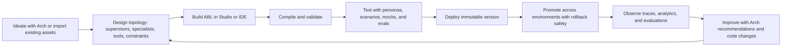

# Introducing the New Agent Platform

**Subtitle:** Why ABL, what Arch does, and why this platform is faster and more future-ready than XO / Agent Platform v1

**Audience:** Leadership, product, field, solution engineering, and customer-facing introduction sessions

Use this as either a talk-track document or a slide outline. Each slide section includes a headline, key points, and a short presenter note. This version stays close to platform language already used in the repo and avoids speculative roadmap claims.

## 30-second opening

"You already know agents can create value. The next question is whether the platform can scale speed, quality, governance, and cost at the same time. The new Agent Platform is Kore.ai's move from bot configuration to a programmable agent system: ABL gives teams a structured language to build with, Arch gives them an AI architect to accelerate the lifecycle, and the runtime gives them deployment control, observability, and continuous improvement."

## Slide 1: Why a new Agent Platform?

**Headline:** This is not a feature refresh. It is an operating-model upgrade.

- XO and earlier agent platforms proved demand, but scale exposed delivery friction.
- Teams now need reasoning agents, scripted flows, and hybrid journeys in one system.
- They also need governance, rollback, observability, and AI-assisted development.

**Talk track:** The story is not "old platform bad, new platform new." The story is that the market moved from intent-driven bots to multi-agent systems, and the platform had to evolve with it.

## Slide 2: Why ABL?

**Headline:** ABL is the programmable foundation of the platform.

- ABL, the Agent Blueprint Language, is a compilable, Git-friendly DSL for defining agents.
- Agent definitions are readable, diffable, versionable, and validated before deployment.
- Compile-time validation catches bad handoffs, invalid tool references, unreachable flow steps, and type mismatches before they become production incidents.
- One language spans reasoning, scripted, and hybrid execution.

**Talk track:** ABL matters because it turns platform configuration into code with structure. That gives teams speed, control, and repeatability.

## Slide 3: What ABL unlocks

**Headline:** The platform ships agent primitives instead of forcing teams to invent them.

- Multi-mode execution: reasoning, scripted, and hybrid.
- First-class orchestration: supervisor routing, delegation, handoff, escalation, and A2A federation.
- Structured data collection with `GATHER`, typed state and memory, expressions, and deterministic constraint handling.
- The platform provides the runtime, session management, and orchestration machinery so teams focus on business logic.

**Talk track:** This is why ABL is not just another DSL. It encodes the patterns production agent systems actually need.

## Slide 4: What is Arch?

**Headline:** Arch is the AI solution architect for the whole lifecycle.

- Arch understands the project context: agents, tools, routing rules, constraints, and topology.
- It works across six stages: ideate, design, build, test, deploy, and improve.
- It can propose topologies, generate ABL, surface diffs, run validation, generate test scenarios, and suggest post-production improvements.
- It supports guided and pro modes so both domain experts and developers can use it.

**Talk track:** Arch is not just a chatbot in the UI. It is the AI layer that programs against platform abstractions instead of working around them.

## Slide 5: ABL feature introduction

**Headline:** ABL gives the platform its core building blocks.

- A compilable, diffable DSL for agent definitions instead of opaque platform state.
- Three execution modes in one system: reasoning, scripted, and hybrid.
- First-class orchestration primitives: supervisor routing, delegation, handoff, escalation, and A2A federation.
- Structured collection and state management through `GATHER`, typed variables, and memory.
- Deterministic constraint handling and expression support for business rules and control logic.
- Tool binding and output flexibility for real-world agent journeys.

**Talk track:** ABL is where the platform becomes programmable. It gives teams named constructs for common agent behaviors instead of making them reinvent patterns in prompts or glue code.

## Slide 6: Studio feature introduction

**Headline:** Studio is the control center for designing, debugging, and operating agents.

- Monaco-based ABL editor with syntax highlighting and real-time validation.
- Interactive topology canvas for supervisors, specialists, handoffs, delegations, and escalation paths.
- Session playback and trace timeline to inspect what happened step by step.
- Observatory views for state, flow, span trees, event timelines, and execution diagnostics.
- Project dashboard and analytics surfaces for monitoring agent performance.
- Command palette and web IDE workflows that make the platform navigable for both builders and operators.

**Talk track:** Studio is not just a builder UI. It is where authoring, debugging, observability, and operational review come together.

## Slide 7: Development lifecycle feature introduction

**Headline:** The platform is built around the full lifecycle, not only agent creation.

- Ideate from prompts, documents, APIs, or imported XO / Agent Platform assets.
- Design topologies with Arch-guided workflows and project-aware context.
- Build in Studio or in an IDE through CLI and MCP workflows.
- Validate continuously with compiler feedback before deployment.
- Test with personas, scenarios, mock tools, and evaluation runs.
- Deploy immutable versions, promote across environments, and roll back safely.
- Observe production behavior through traces and analytics, then improve with data-backed changes.

**Talk track:** This is one of the biggest differences from older platforms. The lifecycle is connected end to end, so teams can move from idea to production and back into optimization without changing systems.

## Slide 8: Enterprise feature introduction

**Headline:** Enterprise controls are built into the platform, not bolted on later.

- Tenant isolation across data paths, storage, and runtime access patterns.
- Unified authentication for user JWTs, SDK session tokens, and API keys.
- SSO, OIDC, SAML, MFA, and project-scoped RBAC for enterprise access control.
- Encryption at rest and in transit, encrypted secrets, audit logging, and right-to-erasure workflows.
- Environment-scoped configuration, deployment governance, and version lineage.
- Data sovereignty and self-hosted deployment options for regulated environments.
- Stateless distributed runtime, rate limiting, and resilience controls for scale.

**Talk track:** The platform is designed for enterprises that need speed and control together. Governance is part of the operating model, not a tax added after the build.

## Slide 9: Key platform features

**Headline:** Build, deploy, operate, and extend in one system.

- Build in Studio or in an IDE through CLI and MCP workflows.
- Stay model-agnostic: use frontier models where needed and lower-cost models where possible.
- Use versioned deployments, environment-scoped settings, promotion, draining, and rollback for release control.
- Debug through traces, state inspection, session playback, and decision explanation.
- Extend through HTTP, MCP, sandbox, connector, and workflow execution patterns.

**Talk track:** The platform is not only about authoring agents. It covers the full operational surface around them.

## Slide 10: Agent lifecycle

**Headline:** From idea to production is a closed-loop system.

- Ideate from a prompt, documents, APIs, or imported XO / Agent Platform exports.
- Design the topology and the execution mode per agent.
- Build ABL, bind tools, and validate continuously.
- Test with generated scenarios, mock tools, and evaluation runs.
- Deploy immutable versions, then promote safely across environments.
- Observe, debug, and improve based on traces and analytics.

**Talk track:** The key idea is that build, deploy, debug, and improve all live on one platform. That is what compresses iteration time.

## Slide 11: Why it is faster than XO or Agent Platform v1

**Headline:** The new platform removes the slow parts of the old operating model.

| XO / v1 pattern                             | New Agent Platform pattern                                            |
| ------------------------------------------- | --------------------------------------------------------------------- |
| Visual state spread across multiple screens | ABL files with readable diffs and Git workflows                       |
| "Save and pray" iteration                   | Compile-time validation before deployment                             |
| Manual export/import between environments   | Versioned deployments with promotion, rollback, and draining          |
| Fragmented debugging across multiple pages  | Unified observability, session replay, trace trees, and MCP debugging |
| Monolithic extension model                  | Open tool execution patterns and AI-friendly interfaces               |
| Last-save-wins team workflows               | Locks, versioning, and Git-based collaboration                        |

- The new loop is: generate -> validate -> fix -> test -> deploy.
- The old loop was: configure -> save -> test in UI -> debug late -> manually move between environments.

**Talk track:** Speed here is not only coding speed. It is total cycle time: build speed, release speed, and recovery speed.

## Slide 12: Why it is AI-programmable

**Headline:** AI works better when it programs a platform, not raw glue code.

- ABL gives AI a structured target: named constructs, clear grammar, compile-time feedback, and deterministic runtime semantics.
- Arch can design and generate agents natively.
- MCP, CLI, and SDK interfaces let outside AI tools work with the same platform abstractions.
- This makes AI-assisted development more reliable than asking AI to invent orchestration code from scratch.

**Talk track:** The future-proof point is simple: AI should spend its intelligence on the agent design problem, not on rebuilding infrastructure every time.

## Slide 13: Why it is AI-debuggable

**Headline:** The platform makes agent behavior inspectable by both humans and AI.

- The runtime emits structured traces for tool calls, handoffs, constraints, flow steps, LLM calls, and session state.
- Developers can inspect spans, state snapshots, errors, and recent traces from Studio or MCP tools.
- AI assistants can explain decisions, analyze sessions, detect loops and failures, and suggest targeted fixes.
- The result is lower MTTR and faster learning after each release.

**Talk track:** Traditional logs tell you that something happened. Agent debugging needs to explain why the system chose that path. This platform is built for that.

## Slide 14: Why it is future-proof

**Headline:** The platform is open, model-agnostic, and built for continuous change.

- Model-agnostic execution reduces lock-in at the intelligence layer.
- Git-native definitions and environment-scoped deployment artifacts reduce lock-in at the platform layer.
- AI-programmable and AI-debuggable workflows mean the platform gets more valuable as coding agents improve.
- The same foundation supports customer service, employee productivity, and process automation use cases.

**Talk track:** Future-proof does not mean predicting one model vendor or one interface. It means choosing an architecture that gets stronger as models, tools, and teams evolve.

## Slide 15: Executive close

**Headline:** ABL is the foundation, Arch is the accelerator, and the platform is the operating system for enterprise agents.

- ABL gives teams a programmable foundation.
- Arch makes the lifecycle AI-assisted end to end.
- Versioned deployments and observability make the system safer to scale.
- Compared with XO and v1, the platform is faster to build on, easier to debug, and better prepared for AI-native development.

**Talk track:** If XO helped prove that bots could work, the new Agent Platform is how teams operationalize the next generation of agents.

## Appendix A: Feature summary by category

**Use when someone asks for a one-slide feature map.**

| Category              | Feature themes                                                                                          |
| --------------------- | ------------------------------------------------------------------------------------------------------- |
| ABL                   | Reasoning, scripted, hybrid, orchestration primitives, gather, memory, constraints, expressions         |
| Studio                | ABL editor, topology canvas, observability, session playback, project dashboard, command palette        |
| Development lifecycle | Arch-guided ideation, design, build, validation, testing, deployment, promotion, rollback, optimization |
| Enterprise            | Tenant isolation, auth, SSO, MFA, RBAC, encryption, audit, sovereignty, resilience, scaling             |

## Appendix B: One-slide comparison

**Use when the audience asks, "What changed?"**

- From intent-centric configuration to a compilable agent language.
- From UI-only building to Studio plus IDE plus AI-assisted workflows.
- From manual export/import to immutable deployments, promotion, and rollback.
- From fragmented test/debug tools to trace-native observability and AI diagnostics.
- From closed platform workflows to model-agnostic, MCP-friendly development.

## Appendix C: Short close for leadership

"Agent Platform V2 moves us from building isolated bots to operating programmable agent systems. ABL is the leverage point, Arch is the force multiplier, and the result is a platform that is faster to build on today and better aligned with AI-assisted development tomorrow."
