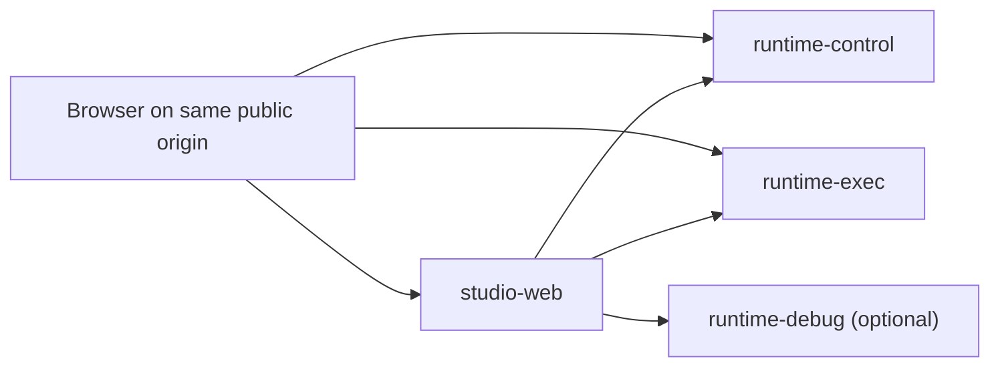

# Runtime URL and Plane Routing Plan

**Date**: 2026-04-13
**Status**: Draft
**Related Docs**:

- `docs/plans/2026-03-14-studio-runtime-isolation.md`
- `docs/features/sdk.md`
- `docs/features/channels.md`
- `docs/features/unified-deployment-endpoints.md`

---

## 1. Problem Statement

The platform currently mixes four different concerns across too many URLs and too few routing rules:

1. browser-visible vs server-only addresses
2. Studio UI/BFF traffic vs Runtime traffic
3. control-plane traffic vs execution-plane traffic
4. HTTP base URLs vs derived WebSocket/media endpoints

This shows up in two places:

- Studio still uses a single `getRuntimeUrl()` for both management and execution flows in `apps/studio/src/config/runtime.server.ts`, `apps/studio/src/proxy.ts`, and multiple Studio proxy routes.
- Runtime mounts several control-style APIs under the `/api/v1/*` block in `apps/runtime/src/server.ts`, even though `/api/v1/*` is described there as the execution plane.

The result is architectural ambiguity:

- `NEXT_PUBLIC_RUNTIME_URL` and `RUNTIME_URL` are easy to misconfigure because they are carrying both visibility and workload intent.
- A naive ingress rule such as "`/api/v1/**` -> runtime-exec" would break OAuth setup, HTTP Async subscription management, and some voice operator APIs.
- Studio page traffic can stay on the same public origin, but the backend workloads are not yet clearly separated.

---

## 2. Goals

- Keep a single public origin when desired, for example `https://agents-dev.kore.ai`.
- Separate backend workloads into explicit planes:
  - `studio-web`
  - `runtime-control`
  - `runtime-exec`
  - `runtime-debug` optional
- Cover all externally important surfaces:
  - public SDK
  - Studio preview/share exchange
  - OAuth and channel OAuth
  - channel integrations and webhook ingress
  - HTTP Async/API channel
  - voice and telephony
  - generic callback resume endpoints
- Reduce authored env vars to one canonical base URL per service per visibility plane.
- Preserve current public webhook and SDK URLs during migration.

## 3. Non-Goals

- Rewriting all Runtime route paths in a single phase.
- Breaking existing public URLs such as `/api/v1/channels/.../webhook/...`.
- Introducing a separate public host unless an operator wants one.
- Replacing the existing Studio BFF pattern in one pass.

---

## 4. Target Plane Model



### 4.1 Plane Definitions

| Plane             | Responsibility                                          | Typical traffic                                             |
| ----------------- | ------------------------------------------------------- | ----------------------------------------------------------- |
| `studio-web`      | Next.js pages, Studio auth, Studio-owned BFF routes     | `/projects/**`, `/api/sdk/**`, `/api/auth/**`               |
| `runtime-control` | operator/admin/config/integration management            | deployments, env vars, OAuth setup, analytics, channel CRUD |
| `runtime-exec`    | live customer/provider execution and callback traffic   | chat, SDK init/refresh, websockets, webhooks, voice connect |
| `runtime-debug`   | developer-only execution isolated from customer traffic | Studio debug chat, test execution, optional debug voice     |

### 4.2 Routing Principle

Route by **request semantics**, not by which screen initiated the request.

- If the request mutates config, credentials, or deployment state, it is `runtime-control`.
- If the request participates in live sessions, message execution, provider callback handling, or websocket/media streaming, it is `runtime-exec`.
- If the request only exists to support Studio debug execution, it is `runtime-debug`.
- If the request is Studio UI or a Studio-owned BFF endpoint, it stays on `studio-web`.

---

## 5. Canonical URL and Env Contract

### 5.1 Canonical Env Vars

| Variable                  | Plane / visibility   | Purpose                                          |
| ------------------------- | -------------------- | ------------------------------------------------ |
| `FRONTEND_URL`            | public               | Canonical Studio/public app origin               |
| `RUNTIME_PUBLIC_BASE_URL` | public               | Canonical browser/provider-facing Runtime origin |
| `RUNTIME_CONTROL_URL`     | server-only          | Internal Studio -> Runtime control-plane base    |
| `RUNTIME_EXEC_URL`        | server-only          | Internal Studio -> Runtime execution-plane base  |
| `RUNTIME_DEBUG_URL`       | server-only optional | Internal Studio -> Runtime debug-plane base      |
| `LIVEKIT_URL`             | public               | Separate public LiveKit endpoint when used       |

### 5.2 Derived, Not Authored

| Value                                         | Derivation                                                       |
| --------------------------------------------- | ---------------------------------------------------------------- |
| public Runtime WS                             | `RUNTIME_PUBLIC_BASE_URL` with `http -> ws`, path `/ws`          |
| public SDK WS                                 | `RUNTIME_PUBLIC_BASE_URL` with `http -> ws`, path `/ws/sdk`      |
| public Twilio/KoreVG/AudioCodes/custom-TTS WS | `RUNTIME_PUBLIC_BASE_URL` with `http -> ws`, route-specific path |

### 5.3 Legacy Compatibility During Migration

| Legacy variable           | Migration meaning                                              |
| ------------------------- | -------------------------------------------------------------- |
| `RUNTIME_URL`             | alias of `RUNTIME_CONTROL_URL`                                 |
| `NEXT_PUBLIC_RUNTIME_URL` | alias of `RUNTIME_PUBLIC_BASE_URL`; not independently authored |
| `NEXT_PUBLIC_APP_URL`     | alias of `FRONTEND_URL`; remove after migration                |
| `RUNTIME_BASE_URL`        | alias of `RUNTIME_PUBLIC_BASE_URL`; remove after migration     |
| `RUNTIME_WS_URL`          | override-only, not primary config                              |
| `RUNTIME_SDK_WS_URL`      | override-only, not primary config                              |

### 5.4 Recommended Deployment Shapes

Same public host:

```env
FRONTEND_URL=https://agents-dev.kore.ai
RUNTIME_PUBLIC_BASE_URL=https://agents-dev.kore.ai

RUNTIME_CONTROL_URL=http://runtime-control.abl-platform.svc.cluster.local:3112
RUNTIME_EXEC_URL=http://runtime-exec.abl-platform.svc.cluster.local:3112
RUNTIME_DEBUG_URL=http://runtime-debug.abl-platform.svc.cluster.local:3112
```

Split public hosts:

```env
FRONTEND_URL=https://studio.example.com
RUNTIME_PUBLIC_BASE_URL=https://agents.example.com

RUNTIME_CONTROL_URL=http://runtime-control.abl-platform.svc.cluster.local:3112
RUNTIME_EXEC_URL=http://runtime-exec.abl-platform.svc.cluster.local:3112
```

---

## 6. Public Edge Routing Matrix

### 6.1 `studio-web`

| Public family             | Examples                                                                                                                                             | Why                                  |
| ------------------------- | ---------------------------------------------------------------------------------------------------------------------------------------------------- | ------------------------------------ |
| Studio pages and assets   | `/`, `/projects/**`, `/preview/**`, `/auth/**`, `/_next/**`                                                                                          | Pure Next.js UI                      |
| Studio auth and BFF       | `/api/auth/**`, `/api/sdk/**`, `/api/admin/**`                                                                                                       | Implemented in Studio                |
| Studio-owned project APIs | Studio route handlers under `apps/studio/src/app/api/projects/**` such as agents, tools, git, export, workflows, topology, bundle, module, approvals | These are not direct Runtime ingress |

### 6.2 `runtime-exec`

| Public family                                                         | Examples                                                                                                                                                                         | Why                                                  |
| --------------------------------------------------------------------- | -------------------------------------------------------------------------------------------------------------------------------------------------------------------------------- | ---------------------------------------------------- |
| Chat and conversational execution                                     | `/api/v1/chat/**`                                                                                                                                                                | Live execution path                                  |
| Public SDK bootstrap and config                                       | `/api/v1/sdk/init`, `/api/v1/sdk/refresh`, `/api/v1/sdk/config/:projectId`                                                                                                       | Browser/customer session bootstrap and widget config |
| Runtime websocket and media upgrades                                  | `/ws`, `/ws/sdk`, `/voice/media`, `/ws/audiocodes/**`, `/ws/korevg/**`, `/ws/custom-tts/orpheus`                                                                                 | Long-lived execution channels                        |
| Provider and channel ingress                                          | `/api/v1/channels/**`, `/api/v1/agent-transfer/webhooks/**`, `/api/v1/callbacks/**`, `/api/v1/channels/vxml/**`, `/api/v1/channels/genesys/**`, `/api/v1/channels/audiocodes/**` | External systems calling into Runtime                |
| Voice live session ingress                                            | `/api/v1/voice/connect`, `/api/v1/voice/status`, `/api/v1/voice/token`, `/api/v1/voice/softphone/**`                                                                             | Call/session bootstrap and provider callbacks        |
| Browser attachment upload                                             | `/api/projects/:projectId/sessions/:sessionId/attachments/**`                                                                                                                    | Explicit browser SDK route                           |
| Session-adjacent runtime surfaces that depend on live execution state | `/api/projects/:projectId/sessions/**`, `/api/v1/transcripts/**`, `/api/v1/feedback/**`, `/api/v1/livekit/**`                                                                    | Keep close to execution plane initially              |

### 6.3 `runtime-control`

| Public family                      | Examples                                                                                                                                                                                                             | Why                                     |
| ---------------------------------- | -------------------------------------------------------------------------------------------------------------------------------------------------------------------------------------------------------------------- | --------------------------------------- |
| Project-scoped Runtime management  | `/api/projects/:projectId/deployments/**`, `/sdk-channels/**`, `/channel-connections/**`, `/env-vars/**`, `/voice-analytics/**`, `/pipeline-config/**`, `/runtime-config/**`, `/session-lifecycle/**`, `/billing/**` | Project/operator management             |
| Tenant and platform control        | `/api/tenants/**`, `/api/platform/admin/**`                                                                                                                                                                          | Tenant and super-admin control surfaces |
| Shared Runtime management prefixes | `/api/tool-secrets/**`, `/api/proxy-configs/**`, `/api/auth/device/**`, `/api/auth-profiles/**`, `/api/model-capabilities/**`                                                                                        | Runtime-owned control/config APIs       |
| OAuth and channel OAuth            | see Section 7                                                                                                                                                                                                        | Credential setup and mutation           |

### 6.4 `runtime-debug` Optional

| Public family   | Examples                                                                        | Why                                                              |
| --------------- | ------------------------------------------------------------------------------- | ---------------------------------------------------------------- |
| Debug execution | new Studio BFF path such as `/api/runtime-debug/**` or a dedicated debug WS URL | Prevent Studio debug load from competing with customer execution |

---

## 7. Exact Exceptions for Mixed `/api/v1/*` Families

Do **not** implement ingress as "`/api/v1/**` -> runtime-exec" without the following exceptions.

### 7.1 OAuth and Channel OAuth

| Route                                          | Plane             | Reason                                                  |
| ---------------------------------------------- | ----------------- | ------------------------------------------------------- |
| `/api/v1/oauth/authorize/:provider`            | `runtime-control` | authenticated credential setup                          |
| `/api/v1/oauth/tokens`                         | `runtime-control` | list authorized providers                               |
| `/api/v1/oauth/tokens/:provider`               | `runtime-control` | revoke stored grant                                     |
| `/api/v1/oauth/callback/:provider`             | `runtime-control` | public callback, but it mutates stored credentials      |
| `/api/v1/channel-oauth/:channelType/authorize` | `runtime-control` | authenticated channel credential setup                  |
| `/api/v1/channel-oauth/:channelType/callback`  | `runtime-control` | public callback, but same credential mutation ownership |

Rationale:

- These endpoints are public in parts, but they are not customer conversation load.
- They should use `RUNTIME_PUBLIC_BASE_URL` for externally reachable callback URLs.

### 7.2 HTTP Async / API Channel

| Route                                                                | Plane             | Reason                               |
| -------------------------------------------------------------------- | ----------------- | ------------------------------------ |
| `/api/v1/channels/http-async/subscribe`                              | `runtime-control` | subscription creation                |
| `/api/v1/channels/http-async/subscriptions` and `/subscriptions/:id` | `runtime-control` | subscription CRUD                    |
| `/api/v1/channels/http-async/subscriptions/:id/deliveries`           | `runtime-control` | operator delivery inspection         |
| `/api/v1/channels/http-async/deliveries/:id`                         | `runtime-control` | operator delivery inspection         |
| `/api/v1/channels/http-async/message`                                | `runtime-exec`    | async message ingress into execution |

### 7.3 Voice

| Route                                          | Plane                                               | Reason                                 |
| ---------------------------------------------- | --------------------------------------------------- | -------------------------------------- |
| `/api/v1/voice/capabilities`                   | `runtime-control`                                   | operator configuration check           |
| `/api/v1/voice/twilio/phone-numbers`           | `runtime-control`                                   | phone-number inventory management      |
| `/api/v1/voice/twilio/available-numbers`       | `runtime-control`                                   | number search                          |
| `/api/v1/voice/twilio/purchase-number`         | `runtime-control`                                   | number purchase                        |
| `/api/v1/voice/speech-options`                 | `runtime-control`                                   | operator speech vendor config UI       |
| `/api/v1/voice/softphone-config`               | `runtime-control`                                   | operator/device configuration          |
| `/api/v1/voice/softphone-numbers/:projectId`   | `runtime-control`                                   | operator project config read           |
| `/api/v1/voice/e2e/caller-audio`               | `runtime-debug` when available, else `runtime-exec` | testing support, not customer workload |
| `/api/v1/voice/token`                          | `runtime-exec`                                      | live voice session bootstrap           |
| `/api/v1/voice/connect`                        | `runtime-exec`                                      | Twilio call ingress                    |
| `/api/v1/voice/status`                         | `runtime-exec`                                      | Twilio status callback                 |
| `/api/v1/voice/softphone/register` and `/call` | `runtime-exec`                                      | provider/webhook ingress               |

### 7.4 Remaining `/api/v1/*` Policy

If a remaining `/api/v1/*` route is:

- provider-initiated or customer-initiated execution traffic -> `runtime-exec`
- authenticated operator/config/admin traffic -> `runtime-control`

Do not rely on the current mount location in `apps/runtime/src/server.ts` as the long-term source of truth, because that file still mixes both categories under the execution section.

---

## 8. Studio Internal Routing Contract

Studio should stop using one ambiguous Runtime helper for all calls.

### 8.1 Helper APIs

`apps/studio/src/config/runtime.server.ts` should expose:

- `getRuntimeControlUrl()`
- `getRuntimeExecUrl()`
- `getRuntimePublicBaseUrl()`
- `getRuntimeDebugUrl()` optional

`getRuntimeUrl()` becomes a deprecated compatibility helper.

### 8.2 Caller Mapping

| Studio caller                                                                | Target helper               | Why                                                        |
| ---------------------------------------------------------------------------- | --------------------------- | ---------------------------------------------------------- |
| `apps/studio/src/lib/runtime-sdk-session.ts`                                 | `getRuntimeExecUrl()`       | preview/share exchange ultimately calls `/api/v1/sdk/init` |
| `apps/studio/src/app/api/runtime/sessions/**`                                | `getRuntimeExecUrl()`       | Runtime is authoritative for live session state            |
| `apps/studio/src/app/api/runtime/analytics/**` and similar operational reads | `getRuntimeControlUrl()`    | management/analytics plane                                 |
| `apps/studio/src/app/api/sdk/embed/[projectId]/route.ts`                     | `getRuntimePublicBaseUrl()` | emitted to third-party websites                            |
| webhook/oAuth quick-start UI output                                          | `getRuntimePublicBaseUrl()` | browser/provider-visible links                             |
| future debug chat and testing tools                                          | `getRuntimeDebugUrl()`      | isolate developer execution                                |

### 8.3 Browser Config Contract

- Browser-visible Runtime config should come from request-time injected config, not build-time `NEXT_PUBLIC_RUNTIME_URL`.
- `apps/studio/next.config.mjs` currently exposes `RUNTIME_URL` as `NEXT_PUBLIC_RUNTIME_URL`; this should be removed after migration.
- `apps/studio/Dockerfile` already points in the right direction by setting `NEXT_PUBLIC_RUNTIME_URL=\"\"` so browser code can prefer relative/request-time behavior.

---

## 9. Public SDK, OAuth, Channels, Webhooks, and Voice Coverage

This contract covers the major externally visible surfaces as follows:

| Surface                                 | Public URL owner               | Internal owner                                    |
| --------------------------------------- | ------------------------------ | ------------------------------------------------- |
| SDK embed snippet generation            | `studio-web`                   | emits `RUNTIME_PUBLIC_BASE_URL`                   |
| SDK init/refresh/config and `/ws/sdk`   | `runtime-exec`                 | customer/browser session bootstrap                |
| Studio preview token and share exchange | `studio-web` -> `runtime-exec` | Studio validates and Runtime issues session token |
| OAuth callback URLs                     | `RUNTIME_PUBLIC_BASE_URL`      | `runtime-control`                                 |
| Channel OAuth callback URLs             | `RUNTIME_PUBLIC_BASE_URL`      | `runtime-control`                                 |
| Channel connection CRUD                 | `runtime-control`              | operator setup                                    |
| Channel webhook ingress                 | `RUNTIME_PUBLIC_BASE_URL`      | `runtime-exec`                                    |
| HTTP Async subscription CRUD            | `runtime-control`              | operator setup                                    |
| HTTP Async message ingress              | `RUNTIME_PUBLIC_BASE_URL`      | `runtime-exec`                                    |
| Voice live ingress and media            | `RUNTIME_PUBLIC_BASE_URL`      | `runtime-exec`                                    |
| Voice inventory/config/admin            | `runtime-control`              | operator setup                                    |
| Generic callback resume                 | `RUNTIME_PUBLIC_BASE_URL`      | `runtime-exec`                                    |

---

## 10. Migration Plan

## Phase 1: Introduce Canonical Env Names and Helpers

### Tasks

1. Add `RUNTIME_CONTROL_URL`, `RUNTIME_EXEC_URL`, `RUNTIME_PUBLIC_BASE_URL`, and optional `RUNTIME_DEBUG_URL`.
2. Add Studio helper functions for control, exec, public, and debug URLs.
3. Keep `RUNTIME_URL` and `NEXT_PUBLIC_RUNTIME_URL` as compatibility aliases.

### Exit Criteria

- Studio can resolve all four helper functions in tests.
- No existing route behavior changes yet.

## Phase 2: Split Studio Internal Callers

### Tasks

1. Move preview/share exchange and session explorer callers to `getRuntimeExecUrl()`.
2. Move analytics/config/admin callers to `getRuntimeControlUrl()`.
3. Move embed/webhook/OAuth URL generation to `getRuntimePublicBaseUrl()`.

### Exit Criteria

- No Studio caller uses `getRuntimeUrl()` except compatibility paths.
- SDK embed snippets always emit the public Runtime base, not a private service URL.

## Phase 3: Split Ingress by Explicit Route Allowlist

### Tasks

1. Update ingress to route explicit exec families to `runtime-exec`.
2. Route explicit control families and exact `/api/v1/*` exceptions to `runtime-control`.
3. Keep Studio pages/BFF on `studio-web`.

### Exit Criteria

- Ingress does not use a blanket `/api/v1/** -> runtime-exec` rule.
- OAuth callbacks, HTTP Async subscription CRUD, and voice operator APIs continue to work.

## Phase 4: Add Optional Debug Plane

### Tasks

1. Move Studio debug execution to `runtime-debug`.
2. Keep a fallback to `runtime-exec` until debug infra is live in every environment.

### Exit Criteria

- Studio debug traffic can be isolated without changing customer-facing URLs.

## Phase 5: Remove Legacy Config

### Tasks

1. Remove authored `NEXT_PUBLIC_RUNTIME_URL`.
2. Remove `NEXT_PUBLIC_APP_URL` and `RUNTIME_BASE_URL`.
3. Keep WS vars as override-only.

### Exit Criteria

- One canonical public Runtime base remains.
- Private server URLs are never exposed to browser config by default.

---

## 11. Validation Checklist

- SDK embed snippet uses `RUNTIME_PUBLIC_BASE_URL` and works on a third-party site.
- Studio preview token and share exchange still issue valid Runtime SDK tokens.
- OAuth and channel OAuth callbacks work without routing through `runtime-exec`.
- Existing channel webhook URLs remain unchanged.
- HTTP Async subscriptions are managed on control pods while `/message` runs on exec pods.
- Twilio connect/status, softphone hooks, and runtime websocket upgrades land on exec pods.
- Session explorer still reflects live in-memory sessions.
- Same-origin deployment works when `FRONTEND_URL` and `RUNTIME_PUBLIC_BASE_URL` are identical.

---

## 12. Open Questions

1. Whether to introduce new explicit control-plane aliases for the mixed `/api/v1/*` control routes in a later cleanup, so ingress can become simpler over time.
2. Whether `transcripts` should remain adjacent to execution or move to control after traffic and dependency analysis.
3. Whether `voice/token` should remain on exec long term or move to a dedicated voice-session bootstrap slice.

---

## 13. Recommendation

Adopt the canonical env contract in Section 5 and the routing matrix in Sections 6 and 7 as the source of truth.

The key architectural decision is:

- keep one public origin if desired
- split backends by control vs execution semantics
- treat mixed `/api/v1/*` families as exact-path exceptions, not as evidence that the whole prefix belongs to one plane

This gives the platform a clear contract for public SDK, OAuth, channel integrations, webhooks, and voice without forcing a breaking URL migration.
