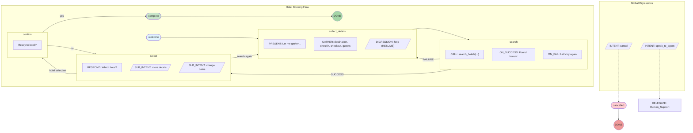
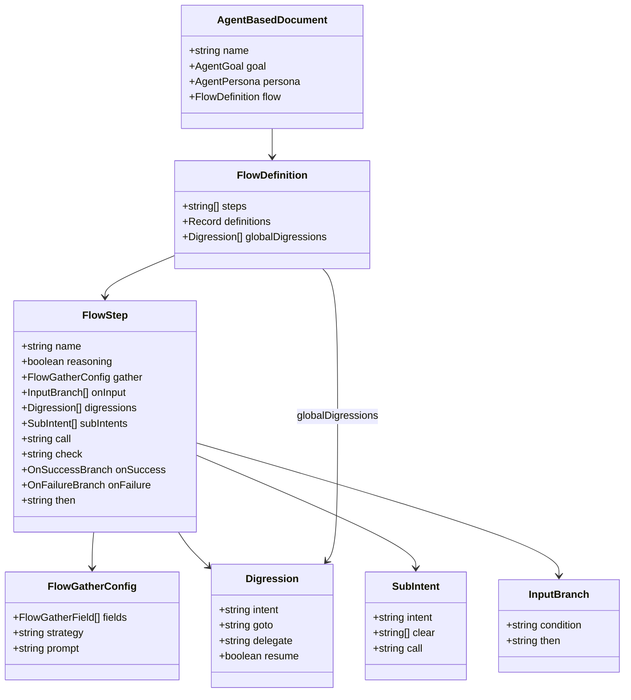

# Unified Agent Blueprint Language (ABL) - Quick Reference

> **Note**: This is a condensed reference. For the authoritative specification with full details and validated examples, see [ABL_SPEC.md](./ABL_SPEC.md).

## Table of Contents

- [Overview](#overview)
- [Core Syntax](#core-syntax)
- [Execution Style](#execution-style)
- [FLOW Example](#flow-example)
- [Type Definitions](#type-definitions)
- [ON_INPUT Conditions](#on_input-conditions)
- [Intent Keywords](#intent-keywords)
- [Built-in Functions](#built-in-functions)
- [GATHER Field Properties](#gather-field-properties)
- [Step-Level ON_ERROR](#step-level-on_error)
- [HANDOFF Shorthand](#handoff-shorthand)
- [Constraint ON_FAIL Control Flow](#constraint-on_fail-control-flow)
- [GUARDRAILS](#guardrails)
- [TEMPLATES](#templates)
- [BEHAVIOR_PROFILE](#behavior_profile)
- [Voice Configuration](#voice-configuration)
- [Attachments & File Collection](#attachments--file-collection)
- [Interactive Actions](#interactive-actions)
- [Condition Syntax](#condition-syntax)

---

## Overview

A single DSL that supports two execution styles, **derived automatically from your agent definition**:

- **reasoning**: LLM-driven with prompt-guided limitations and runtime constraints (agents without FLOW)
- **scripted**: Deterministic state machine with optional LLM reasoning per step (agents with FLOW)

> **Execution style is derived from FLOW presence**: If your agent has a FLOW section, it follows scripted execution. If not, it uses reasoning mode. You can also enable LLM reasoning on specific steps using `REASONING: true`.

## Core Syntax

> **Dual Format**: ABL supports both `.agent.abl` (uppercase keywords) and `.agent.yaml` (lowercase keywords). Keywords are NOT interchangeable between formats — `.abl` files require UPPERCASE, `.yaml` files use lowercase.

```
AGENT: <Name>

  # === IDENTITY ===
  GOAL: "<what the agent achieves>"

  PERSONA: |
    <personality and behavior guidelines>

  LIMITATIONS:
    - <what the agent cannot do>

  # === CAPABILITIES ===
  TOOLS:
    <name>(<params>) -> <return_type>
      description: "<what it does>"
      side_effects: true | false
      confirm: always | never | when_side_effects  # recommended when side_effects: true

  # Tool implementation note (.tools.abl / Tool Library HTTP binding):
  #   body: |
  #     {"static": "payload"}
  #   body_template: |
  #     {"customerId": "{{session.customerId}}"}

  GATHER:
    <field>:
      prompt: "<how to ask>"
      type: <string | number | date | boolean>
      required: <true | false>
      validate: "<optional validation rule>"

  # === BUSINESS RULES ===
  CONSTRAINTS:
    <label>:                     # Optional readability label; phases are label-only today
      - REQUIRE|WARN|LIMIT|RESTRICT <condition> # Conditions may use IMPLIES; optional inline: BEFORE calling <tool> / BEFORE returning results
        WHEN: <condition>        # Optional applicability gate
        ON_FAIL: "<message or action>"

  # === SCRIPTED EXECUTION (FLOW required) ===
  FLOW:
    <step1> -> <step2> -> <step3>

    global_digressions:           # Digressions available in all steps
      - INTENT: "<pattern>"
        GOTO: <step>

    <step>:
      # REASONING is mandatory for every FLOW step
      REASONING: true | false

      # Multi-field collection within FLOW steps
      PRESENT: "<presentation>"   # Shown before GATHER
      GATHER:                     # Multi-field collection
        - field1: required
        - field2:
            TYPE: date
            REQUIRED: true
            PROMPT: "When?"
        STRATEGY: llm | pattern | hybrid
      CORRECTIONS: true           # Allow natural corrections
      COMPLETE_WHEN: <condition>  # Step completion condition

      # Variable assignment
      SET:                          # Block form (multiple)
        var1 = EXPRESSION
        var2 = EXPRESSION
      SET: var = EXPRESSION         # Inline form (in branches)

      # Variable deletion
      CLEAR: var1, var2, var3       # Remove from session

      # Actions
      CALL: <tool>                # Execute a tool
      CHECK: <condition>          # Evaluate inline boolean guard before continuing
      RESPOND: "<message>"        # Send response

      # Enhanced CALL with explicit params + result binding
      CALL: <tool>
        WITH:
          param1: expression
          param2: expression
        AS: resultVar

      # Multi-way result branching (for CALL WITH/AS)
      ON_RESULT:
        - IF: resultVar.field == "value"
          SET: var = expression
          RESPOND: "<message>"
          THEN: <step>
        - ELSE:
          THEN: <step>

      # Legacy result branches (for simple CALL steps)
      ON_SUCCESS:
        RESPOND: "<message>"
        THEN: <step>
      ON_FAIL:
        RESPOND: "<message>"
        THEN: <step>

      # Array data pipeline
      TRANSFORM: source AS item INTO target
        FILTER: <condition>
        MAP:
          field1: expression
          field2: expression
        SORT_BY: field ASC|DESC
        LIMIT: <number>

      THEN: <step>                # Default next step

      # Conditional branching
      ON_INPUT:
        - IF: <condition>
          RESPOND: "<message>"
          SET: var = value
          CALL: <tool>
          THEN: <step>
        - ELSE:
          THEN: <step>

      # Intent handling
      DIGRESSIONS:
        - INTENT: "<pattern>"
          RESPOND: "<message>"
          GOTO: <step>            # Go to step
          DELEGATE: <agent>       # Or delegate to agent
          CALL: <tool>            # Or call tool
          RESUME: true            # Return to current step
          CLEAR: [<fields>]       # Clear fields before resume

      SUB_INTENTS:                # Scoped intents (stay in step)
        - INTENT: "<pattern>"
          RESPOND: "<message>"
          CLEAR: [<fields>]
          SET: { key: value }
          CALL: <tool>

  # === MULTI-AGENT (both modes) ===
  DELEGATE:
    - AGENT: <name>
      WHEN: "<condition>"
      PURPOSE: "<description>"
      INPUT: { <field mappings> }
      RETURNS: { <field mappings> }
      USE_RESULT: "<template>"

  HANDOFF:
    - TO: <agent>
      WHEN: "<condition>"
      CONTEXT:
        pass: [<fields>]
        summary: "<context summary>"
        history: auto            # default when omitted; prefers summary, falls back to bounded raw history
        # bounded recent history:
        # history:
        #   mode: last_n
        #   count: 10
        memory_grants:
          - path: workflow.auth_token
            access: readwrite
      EXPECT_RETURN: true | false  # preferred; RETURN also accepted
      ON_FAILURE: CONTINUE | ESCALATE | RESPOND "message"
      ON_RETURN:
        action: continue | resume_intent
        # or:
        handler: <handler_name>
        map:
          field1: <expression>
          field2: <expression>

  RETURN_HANDLERS:
    <handler_name>:
      RESPOND: "<optional follow-up>"
      CLEAR: [<fields>]
      CONTINUE: true
      RESUME_INTENT: false

  ESCALATE:
    triggers:
      - WHEN: <condition>
        REASON: "<description>"
        PRIORITY: low | medium | high | critical
        TAGS: [<tags>]
    context_for_human:
      - <item>
    on_human_complete:
      - IF <condition>: <action>

  # === STATE MANAGEMENT (both modes) ===
  MEMORY:
    session:
      - <field>
    persistent:
      - PATH: <field>
        SCOPE: user | project | execution_tree
        ACCESS: read | write | readwrite
    remember:
      - WHEN: <condition>
        STORE: <value> -> <target>
        TTL: "<duration>"
    recall:
      - ON: session:start
        ACTION: inject_context | load_memory | prompt_llm

  # === COMPLETION (both modes) ===
  COMPLETE:
    - WHEN: "<condition>"
      RESPOND: "<final message>"
      STORE: <memory update>

  ON_ERROR:
    <error_type>:
      RESPOND: "<message>"
      RETRY: <count>
      THEN: CONTINUE | ESCALATE | HANDOFF <agent> | COMPLETE
```

## Execution Style

> **Important**: Execution style is **derived from structure**, not declared. An agent with a `FLOW:` section uses flow-based execution. An agent without `FLOW:` uses reasoning-only execution.

> **Recommended default**: Use **reasoning mode** (no FLOW) for most agents. Reasoning agents are more flexible, handle edge cases naturally, and require less upfront design. Only use FLOW for well-defined deterministic processes where cost, speed, or strict compliance require a scripted state machine.

### Reasoning-Only Agents (No FLOW) — Recommended

Agents without a FLOW section use LLM reasoning:

- LLM decides what action to take next based on GOAL and conversation context
- GATHER fields are collected conversationally (LLM asks naturally)
- CONSTRAINTS are evaluated as runtime checks before/after relevant actions
- Tools are called when LLM decides they're needed
- Handles unexpected inputs, multi-topic conversations, and edge cases gracefully

**Example — Customer Support Agent (Reasoning)**:

```
AGENT: Customer_Support

  GOAL: "Help customers with order issues, returns, and product questions"

  PERSONA: |
    You are a friendly, empathetic customer service representative.
    You listen carefully, confirm understanding before acting,
    and proactively suggest helpful alternatives.

  LIMITATIONS:
    - Cannot process refunds over $500 without supervisor approval
    - Cannot access payment card details
    - Cannot make promises about delivery dates

  TOOLS:
    lookup_customer(email: string) -> {customer_id: string, name: string, loyalty_tier: string}
      description: "Find customer by email"
    get_orders(customer_id: string, limit: number) -> {orders: object[]}
      description: "Get recent orders"
    check_return_eligibility(order_id: string, item_id: string) -> {eligible: boolean, reason: string, refund_amount: number}
      description: "Check if item can be returned"
    initiate_return(order_id: string, item_id: string, reason: string) -> {return_id: string, label_url: string}
      description: "Start a return and generate shipping label"

  GATHER:
    customer_email:
      prompt: "Could you share the email address on your account?"
      type: string
      required: true
    return_reason:
      prompt: "What's the reason for the return?"
      type: string
      required: false

  CONSTRAINTS:
    - REQUIRE check_return_eligibility.eligible == true
      ON_FAIL: "This item isn't eligible for return: {{check_return_eligibility.reason}}"
    - LIMIT refund_amount <= 500
      ON_FAIL: "Refunds over $500 require supervisor approval. Let me connect you."

  MEMORY:
    session:
      - customer_profile
      - current_order
      - return_details

  ESCALATE:
    triggers:
      - WHEN: refund_amount > 500
        REASON: "High-value refund requires supervisor"
        PRIORITY: high

  COMPLETE:
    - WHEN: return_id IS SET
      RESPOND: "Your return has been processed. Check your email for the shipping label."
    - WHEN: customer.question_answered == true
      RESPOND: "Glad I could help! Anything else?"
```

### Flow-Based Agents (With FLOW) — Use When Determinism Required

Agents with a FLOW section follow a deterministic state machine:

- Follows FLOW exactly as defined — predictable, auditable
- GATHER fields collected via explicit prompts (pattern or LLM extraction)
- CONSTRAINTS checked at explicit CHECK steps
- Fast, cheap, deterministic
- Best for: regulatory compliance, strict sequential forms, high-volume cost-sensitive flows

**Example — simple flow agent**:

```
AGENT: Hotel_Booking_Flow

  GOAL: "Help user book a hotel through a guided flow"

  FLOW:
    welcome -> collect_details -> search -> select -> confirm

    # Use REASONING: true to enable LLM reasoning on specific steps
    collect_details:
      REASONING: true    # LLM decides how to collect fields
      GATHER:
        - destination
        - checkin
        - checkout
```

> **Removed**: `MODE:` declaration produces a parser error. Execution style is derived from FLOW presence. Remove any `MODE:` lines from your agents.

### Design Guidance

1. **Start with reasoning** (no FLOW) — it handles most use cases with less code and more flexibility
2. **Add FLOW only when needed** — strict compliance workflows, cost-sensitive high-volume flows, or when you need exact step-by-step auditability
3. **Mix in multi-agent** — orchestrator/supervisor uses reasoning, specialized workers may use FLOW for deterministic subtasks

---

## FLOW Example

### Flow Diagram



### DSL Code

```
AGENT: Hotel_Booking_Flow

  # Has FLOW section → flow-based execution (no MODE needed)

  GOAL: "Help user book a hotel through a guided flow"

  FLOW:
    welcome -> collect_details -> search -> select -> confirm

    global_digressions:
      - INTENT: "cancel"
        RESPOND: "Canceling your booking request."
        GOTO: cancelled
      - INTENT: "speak_to_agent"
        DELEGATE: Human_Support

    welcome:
      REASONING: false
      RESPOND: "Welcome! I'll help you find a hotel."
      THEN: collect_details

    collect_details:
      REASONING: true
      PRESENT: "Let me gather your trip details."
      GATHER:
        - destination: required
        - checkin:
            TYPE: date
            REQUIRED: true
        - checkout:
            TYPE: date
            REQUIRED: true
        - guests:
            TYPE: number
            DEFAULT: 2
        STRATEGY: hybrid
        PROMPT: "Please tell me where, when, and how many guests."
      CORRECTIONS: true
      COMPLETE_WHEN: destination AND checkin AND checkout
      DIGRESSIONS:
        - INTENT: "help"
          RESPOND: "Just tell me your destination city and travel dates."
          RESUME: true
      THEN: search

    search:
      REASONING: false
      CALL: search_hotels(destination, checkin, checkout, guests)
      ON_SUCCESS:
        RESPOND: "Found {{result.total}} hotels for you!"
        THEN: select
      ON_FAIL:
        RESPOND: "Sorry, I couldn't search. Let's try again."
        THEN: collect_details

    select:
      REASONING: false
      RESPOND: "Which hotel would you like to book?"
      ON_INPUT:
        - IF: input matches /hotel\s*\d+/
          SET: selected_hotel = extracted_hotel_id
          THEN: confirm
        - IF: input contains "search again"
          THEN: collect_details
        - ELSE:
          RESPOND: "Please select a hotel by number (e.g., 'hotel 1')."
          THEN: select
      SUB_INTENTS:
        - INTENT: "more details"
          CALL: get_hotel_details(hover_hotel_id)
          RESPOND: "{{result.description}}"
        - INTENT: "change dates"
          CLEAR: [checkin, checkout]
          RESPOND: "Let's update your dates."

    confirm:
      REASONING: false
      RESPOND: "Ready to book {{selected_hotel.name}}. Confirm?"
      ON_INPUT:
        - IF: yes
          CALL: create_booking(selected_hotel.id, guest_info)
          THEN: complete
        - IF: no
          THEN: select

    complete:
      REASONING: false
      RESPOND: "Booking confirmed! Reference: {{result.confirmation_id}}"

    cancelled:
      REASONING: false
      RESPOND: "Your request has been cancelled. Come back anytime!"

  COMPLETE:
    - WHEN: booking_confirmed == true
      RESPOND: "Thank you for booking with us!"
```

## Type Definitions

### Class Diagram



### TypeScript Interfaces

```typescript
interface AgentBasedDocument {
  name: string;
  // mode is derived from FLOW presence, not declared
  goal: AgentGoal;
  persona: AgentPersona;
  limitations: AgentLimitation[];
  tools: AgentTool[];
  gather: GatherField[];
  constraints: Constraint[]; // flat list, checked every turn (no phases in IR)
  flow?: FlowDefinition;
  delegate: DelegateConfig[];
  handoff: HandoffConfig[];
  escalate?: EscalateConfig;
  memory: MemoryConfig;
  complete: CompleteCondition[];
  onError: ErrorHandler[];
}

interface FlowDefinition {
  steps: string[];
  definitions: Record<string, FlowStep>;
  globalDigressions?: Digression[];
}

interface FlowStep {
  name: string;
  reasoning: boolean; // REASONING: true | false (mandatory)

  // Multi-field collection
  gather?: FlowGatherConfig;
  present?: string;
  corrections?: boolean;
  completeWhen?: string;

  // Computed assignments
  set?: SetAssignmentIR[]; // SET variable = expression
  clear?: string[]; // CLEAR session variables

  // Data transformation
  transform?: TransformConfigIR; // TRANSFORM array pipeline

  // Actions
  call?: string;
  callWith?: Record<string, string>; // CALL WITH: explicit params
  callAs?: string; // CALL AS: result binding
  check?: string;
  respond?: string;
  onFail?: string;
  then?: string;

  // Call result branches
  onSuccess?: { respond?: string; then?: string };
  onFailure?: { respond?: string; then?: string };

  // Multi-way result branching
  onResult?: InputBranch[]; // ON_RESULT: branches

  // Branching
  onInput?: InputBranch[];

  // Intent handling
  digressions?: Digression[];
  subIntents?: SubIntent[];
}

interface SetAssignmentIR {
  variable: string; // Left-hand side
  expression: string; // Right-hand side (may contain built-in functions)
}

interface TransformConfigIR {
  source: string; // Source array path (e.g., "txnResult.transactions")
  item_var: string; // Iterator variable name (e.g., "txn")
  target: string; // Output variable name
  filter?: string; // Boolean expression
  map?: Record<string, string>; // Field → expression mappings
  sort_by?: { field: string; order: 'asc' | 'desc' };
  limit?: number; // Max items
}

interface FlowGatherConfig {
  fields: FlowGatherField[];
  strategy?: 'llm' | 'pattern' | 'hybrid';
  prompt?: string;
}

interface FlowGatherField {
  name: string;
  type?: string;
  required?: boolean;
  default?: unknown;
  prompt?: string;
  validation?: string;
  extractionHints?: string[];
}

interface Digression {
  intent: string;
  condition?: string;
  respond?: string;
  goto?: string;
  delegate?: string;
  call?: string;
  resume?: boolean;
  clear?: string[];
}

interface SubIntent {
  intent: string;
  respond?: string;
  clear?: string[];
  set?: Record<string, string>;
  call?: string;
  resume?: boolean;
}

interface InputBranch {
  condition?: string;
  respond?: string;
  set?: Record<string, string>;
  call?: string;
  then: string;
}
```

## ON_INPUT Conditions

| Pattern  | Example                 | Description                 |
| -------- | ----------------------- | --------------------------- |
| Equality | `input == "back"`       | Case-insensitive match      |
| Contains | `input contains "help"` | Substring match             |
| Regex    | `input matches /\d+/`   | Regular expression          |
| Variable | `count >= 5`            | Context variable comparison |
| Intent   | `yes`, `no`, `back`     | Keyword intent              |

## Intent Keywords

| Intent   | Keywords                           |
| -------- | ---------------------------------- |
| `back`   | back, go back, previous, return    |
| `cancel` | cancel, nevermind, forget it, stop |
| `change` | change, modify, update, edit       |
| `help`   | help, assist, support, confused    |
| `yes`    | yes, yeah, yep, sure, ok, confirm  |
| `no`     | no, nope, nah, not, wrong          |

## Built-in Functions

Available in SET expressions, TRANSFORM MAP/FILTER, CALL WITH values, and RESPOND templates.

| Category       | Functions                                                                                                                                                                     |
| -------------- | ----------------------------------------------------------------------------------------------------------------------------------------------------------------------------- |
| **Math**       | `ADD(a,b)` `SUB(a,b)` `MUL(a,b)` `DIV(a,b)` `ROUND(n,dec?)` `ABS(n)` `MIN(a,b)` `MAX(a,b)`                                                                                    |
| **String**     | `UPPER(s)` `LOWER(s)` `TRIM(s)` `SUBSTRING(s,start,end?)` `REPLACE(s,find,repl)` `SPLIT(s,delim)` `JOIN(arr,delim)` `PAD_START(s,len,ch?)` `PAD_END(s,len,ch?)` `REPEAT(s,n)` |
| **Formatting** | `MASK(s,pattern,ch?)` `FORMAT_CURRENCY(n,cur,locale?)` `FORMAT_DATE(d,fmt,tz?)` `ORDINAL(n)`                                                                                  |
| **Type**       | `IS_ARRAY(x)` `IS_NUMBER(x)` `IS_STRING(x)` `TO_NUMBER(x)` `TO_STRING(x)`                                                                                                     |
| **Array**      | `LENGTH(x)` `ARRAY_FIND(arr,field,val)` `ARRAY_FIND_INDEX(arr,field,val)`                                                                                                     |
| **Object**     | `OBJECT_KEYS(obj)` `OBJECT_VALUES(obj)` `OBJECT_MERGE(...objs)`                                                                                                               |
| **Utility**    | `COALESCE(...args)` `NOW()` `UNIQUE_ID(len?)`                                                                                                                                 |

**Examples:**

```dsl
SET:
  formatted_amount = FORMAT_CURRENCY(transfer_amount, "USD")
  masked_account = MASK(account_number, "last4")
  daily_remaining = SUB(daily_limit, daily_used)
  transfer_id = UNIQUE_ID(10)
  clean_amount = TO_NUMBER(REPLACE(REPLACE(raw, "$", ""), ",", ""))
```

## GATHER Field Properties

Advanced field properties for semantic typing, activation control, range/list collection, and validation.

```yaml
GATHER:
  destination:
    PROMPT: 'Where would you like to go?'
    TYPE: string
    SEMANTICS:
      FORMAT: airport_code
      LOOKUP: iata_codes
    ACTIVATION: required
    PROMPT_MODE: ask

  budget:
    PROMPT: 'Budget range?'
    TYPE: number
    RANGE: true
    VALIDATION_PROCESS: LLM
    RETRY_PROMPT: 'Please provide a valid budget.'

  activities:
    PROMPT: 'What activities interest you?'
    TYPE: string
    LIST: true
    PREFERENCES: true
    ACTIVATION: optional

  room_type:
    PROMPT: 'Room type?'
    TYPE: string
    ACTIVATION: progressive
    DEPENDS_ON: [destination, budget]

  military_id:
    PROMPT: 'Military ID?'
    TYPE: string
    ACTIVATION:
      WHEN: "search_results contains 'Hale Koa'"
```

### Property Reference

| Property           | Values                                          | Description                                |
| ------------------ | ----------------------------------------------- | ------------------------------------------ |
| SEMANTICS          | Sub-block with FORMAT, LOOKUP, COMPONENTS, UNIT | Supplemental metadata for entity types     |
| RANGE              | true/false                                      | Collect as {low, high} range               |
| LIST               | true/false                                      | Collect as array                           |
| PREFERENCES        | true/false                                      | Categorize into accept/desire/avoid/refuse |
| ACTIVATION         | required/optional/progressive/{WHEN: expr}      | When field becomes active                  |
| DEPENDS_ON         | [field1, field2]                                | Fields that must be collected first        |
| PROMPT_MODE        | ask/extract_only                                | Whether to prompt user or just extract     |
| VALIDATION_PROCESS | LLM/REGEX/CODE                                  | How validation is performed                |
| RETRY_PROMPT       | string                                          | Custom message on validation failure       |

---

## Step-Level ON_ERROR

Error handlers can be defined at the flow step level with specific subtypes and retry backoff strategies.

```yaml
FLOW:
  book_hotel:
    REASONING: false
    CALL: book_room(hotel_id, guest_info)
    ON_ERROR:
      - TYPE: tool_failure
        SUBTYPE: credit_card_declined
        RESPOND: 'Payment declined.'
        THEN: collect_payment
      - TYPE: tool_timeout
        RETRY: 2
        RETRY_DELAY: 2000
        RETRY_BACKOFF: exponential
        THEN: continue
```

### Handler Properties

| Property      | Description                                                         |
| ------------- | ------------------------------------------------------------------- |
| TYPE          | Error category (tool_failure, tool_timeout, validation_error, etc.) |
| SUBTYPE       | Specific error code for fine-grained matching                       |
| RESPOND       | Message to show the user                                            |
| RETRY         | Number of retry attempts                                            |
| RETRY_DELAY   | Delay in ms before retry                                            |
| RETRY_BACKOFF | Backoff strategy: `fixed`, `exponential`, `linear`                  |
| THEN          | Next action: step name, `continue`, `escalate`, `complete`          |
| BACKTRACK_TO  | Go to a different step on failure                                   |

---

## HANDOFF Shorthand

`EXPECT_RETURN` and `RETURN` are both accepted in `HANDOFF`. Prefer `EXPECT_RETURN` in new authoring because it makes the handoff intent clearer. `SUMMARY` and `PASS` can be used as shorthand outside of a `CONTEXT:` block. `ON_RETURN` should be authored as a structured block with `action:` or `handler:` plus optional `map:` entries, and `memory_grants` is the canonical way to expose durable memory paths. For bounded raw history, prefer the structured form `history: { mode: last_n, count: <n> }`; the legacy shorthand `history: last_<n>` remains compatibility-only. `ON_FAILURE` is handoff-specific: it applies to setup and dispatch failures before the target accepts the transfer, not to downstream child execution failures after the handoff is already underway.

```yaml
HANDOFF:
  - TO: billing_agent
    EXPECT_RETURN: true
    CONTEXT:
      pass: [customer_id, invoice_id]
      summary: 'Handling payment'
      history: auto
```

> Both `EXPECT_RETURN:` and `RETURN:` are accepted by the parser. Prefer `EXPECT_RETURN:` in new authored examples, and prefer named `RETURN_HANDLERS` when return-to-parent behavior needs reusable post-return handling. Top-level `SUMMARY:` / `PASS:` are also accepted as shorthand. `ON_FAILURE:` covers pre-acceptance setup or dispatch failures; accepted-handoff timeout handling stays on the separate handoff timeout path.

---

## Constraint ON_FAIL Control Flow

Constraint ON_FAIL supports structured control flow directives including inline field collection.

```yaml
CONSTRAINTS:
  booking_rules:
    - REQUIRE user.email IS SET
      ON_FAIL:
        COLLECT: [email]
        THEN: continue
    - REQUIRE rooms_available > 0
      ON_FAIL:
        RESPOND: "No rooms. Let me find alternatives."
        GOTO: search_step
```

### ON_FAIL Directives

| Directive | Description                                                          |
| --------- | -------------------------------------------------------------------- |
| COLLECT   | Gather missing fields inline before continuing (ON_FAIL blocks only) |
| GOTO      | Jump to a different flow step                                        |
| RETRY     | Retry current step                                                   |
| THEN      | What to do after COLLECT (`continue` or `retry`)                     |
| RESPOND   | Message to show the user                                             |

---

## GUARDRAILS

Content validation rules checked at various execution points. Unlike CONSTRAINTS (business logic against session data), GUARDRAILS validate content — inputs, outputs, tool params, tool results, and handoff context.

**Kinds:** `input`, `output`, `tool_input`, `tool_output`, `handoff`, `both` (expands to input + output)

**3-Tier Evaluation:**

| Tier          | Method                   | Latency   |
| ------------- | ------------------------ | --------- |
| Tier 1: Local | CEL expressions, regex   | <5ms      |
| Tier 2: Model | External classifier APIs | 10-200ms  |
| Tier 3: LLM   | LLM-as-judge evaluation  | 100-500ms |

```
GUARDRAILS:
  no_pii_output:
    kind: output
    check: "contains_pii(content)"
    action: redact
    msg: "PII detected in response"

  abusive_input_review:
    kind: input
    llm_check: "Does this input contain abusive language?"
    action: block
    msg: "Inappropriate content detected"
```

**Actions:** `block` (reject), `redact` (mask sensitive data), `filter` (remove content), `flag` (log warning)

> See [ABL_SPEC.md §3.9](./ABL_SPEC.md#39-guardrails) for full details.

---

## TEMPLATES

Named response templates with channel-specific format variants and variable interpolation.

```
TEMPLATES:
  greeting:
    DEFAULT: "Welcome, {{user.name}}!"
    MARKDOWN: "# Welcome, **{{user.name}}**!"
    VOICE INSTRUCTIONS: "Speak warmly with a slight pause after 'Welcome'."

# Usage in flow steps, ON_START, or COMPLETE:
RESPOND: TEMPLATE(greeting)
```

**Supported formats:** `DEFAULT`, `MARKDOWN`, `HTML`, `VOICE INSTRUCTIONS`, `ADAPTIVE_CARD`, `SLACK`, `WHATSAPP`, `AG_UI`

**Interpolation:** `{{variable}}`, `{{#each items}}...{{/each}}`, `{{#if condition}}...{{/if}}`

**Current model:** `TEMPLATE(name)` is compile-time only. The compiler inlines matching template definitions into executable response fields. Runtime and channel code do not later resolve template names from a runtime registry.

**Planned `RENDERABLES` extension (draft, not implemented):**

```abl
TEMPLATES:
  account_summary:
    DEFAULT: "Here is your account summary."
    RENDERABLES:
      - NAME: "com.bank.account_summary.v1"
        TARGETS: ["api", "sdk_websocket", "http_async"]
        FALLBACK_TEXT: "Here is your account summary."
        PAYLOAD_JSON: |
          {
            "balance": "{{account.balance}}",
            "currency": "{{account.currency}}"
          }

RESPOND: TEMPLATE(account_summary)
```

`account_summary` is the internal template key; `com.bank.account_summary.v1` is the external client/rendering name.

> See [ABL_SPEC.md §3.15](./ABL_SPEC.md#315-templates-named-response-templates) for full details.

---

## BEHAVIOR_PROFILE

Context-dependent behavior overlays that activate based on runtime conditions. Must be defined as **standalone documents** (separate from agents).

```
BEHAVIOR_PROFILE: voice-optimized
PRIORITY: 10
WHEN: context.channel == "voice"
INSTRUCTIONS: "Keep responses under 3 sentences."

# In agent files, reference with:
USE BEHAVIOR_PROFILE: voice-optimized
```

> **Note:** `BEHAVIOR_PROFILES:` (plural) is NOT supported — produces a parser error. Use `BEHAVIOR_PROFILE:` in standalone files and `USE BEHAVIOR_PROFILE:` / `USE_BEHAVIOR_PROFILE:` in agents.

> See [ABL_SPEC.md §3.16](./ABL_SPEC.md#316-behavior_profile-context-dependent-behavior) for full details.

---

## Voice Configuration

Voice properties for TTS rendering on voice channels. Set at agent, template, or step level.

```
# Agent-level (in EXECUTION block)
EXECUTION:
  voice:
    provider: elevenlabs
    voice_id: aria
    speed: 1.0

# Per-step override
confirm_booking:
  REASONING: false
  RESPOND: "Your booking is confirmed."
  VOICE:
    ssml: "<speak><prosody rate='slow'>Your booking is confirmed.</prosody></speak>"
```

**VoiceConfigIR fields:** `provider`, `voice_id`, `speed`, `ssml`, `instructions`, `plain_text`

> See [ABL_SPEC.md §3.17](./ABL_SPEC.md#317-voice-configuration) for full details including voice channel agent transfer.

---

## Attachments & File Collection

Collect file attachments from users as GATHER fields with type validation, size limits, and processing.

```
GATHER:
  - damage_photo: required
    type: attachment
    category: image
    prompt: "Please upload a photo of the damage."
    allowed_mime_types: [image/jpeg, image/png]
    max_file_size: 10485760  # 10MB
    processing:
      ocr_enabled: true
```

**Categories:** `image`, `document`, `audio`, `video`
**Processing:** `ocr_enabled`, `transcription_enabled`, `key_frame_extraction`

> Partial implementation — attachment upload and processing work via system tools, but declarative GATHER-level `AttachmentFieldIR` is not yet wired.

> See [ABL_SPEC.md §3.18](./ABL_SPEC.md#318-attachments--file-collection) for full details.

---

## Interactive Actions

Interactive elements (buttons, dropdowns, inputs) in responses with handler logic.

```
RESPOND: "Choose your option:"
  ACTIONS:
    - BUTTON: "Option A"
      ID: option_a
      VALUE: "a"
    - SELECT: "City"
      ID: city
      OPTIONS:
        - { id: "NYC", label: "New York" }
        - { id: "LAX", label: "Los Angeles" }

ACTION_HANDLERS:
  option_a:
    DO:
      - SET: choice = "a"
      - RESPOND: "You chose Option A."
      - GOTO: next_step
  agent_a:
    DO:
      - RESPOND: "Routing to Agent A."
      - HANDOFF: Agent_A
```

**Action types:** `BUTTON`, `SELECT`, `INPUT`
**Handler directives:** `SET`, `CLEAR`, `RESPOND`, `CALL`, `GOTO`/`TRANSITION`/`THEN`, `HANDOFF`, `DELEGATE`, `COMPLETE`, `CONDITION` (conditional dispatch)

Prefer `DO:` for multi-action handlers. `HANDOFF` and `DELEGATE` targets must also be declared in the agent's normal coordination blocks. For empty button/select payload text, action handlers forward the action value or action id to the target agent. Rich content rendered before a terminal action is carried as a fallback final payload unless the terminal target returns its own rich payload.

> See [ABL_SPEC.md §3.19](./ABL_SPEC.md#319-interactive-actions) for full details.

---

## Condition Syntax

All conditions in ON_INPUT, CONSTRAINTS, ACTIVATION, and branching support the following operators:

| Category   | Operators                                       |
| ---------- | ----------------------------------------------- |
| Comparison | `==`, `!=`, `>`, `<`, `>=`, `<=`                |
| Logical    | `AND`, `OR`, `NOT`                              |
| Existence  | `IS SET`, `IS NOT SET`                          |
| String     | `contains`, `startsWith`, `endsWith`, `matches` |
| Grouping   | Parenthetical nesting: `(A OR B) AND C`         |

---

_Version: 1.6_
_Last Updated: March 2026_
