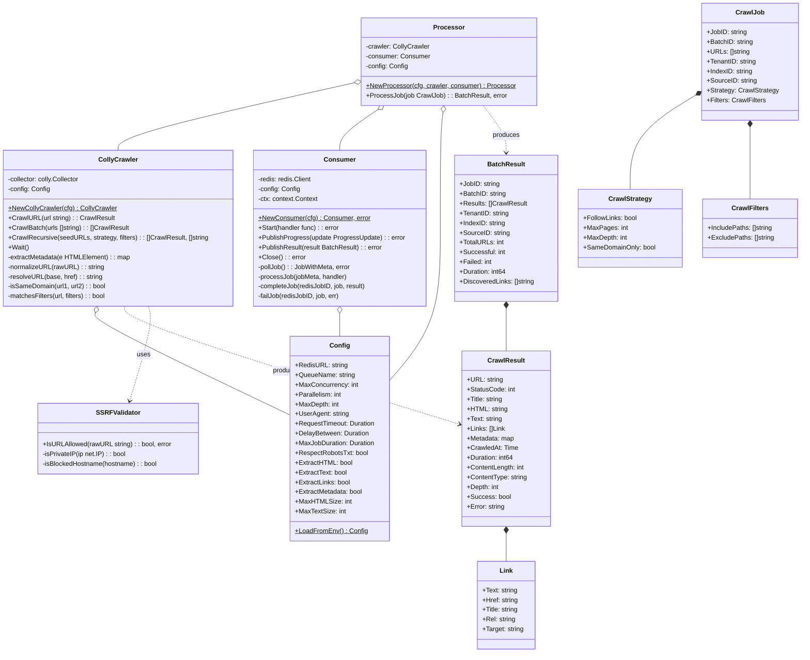
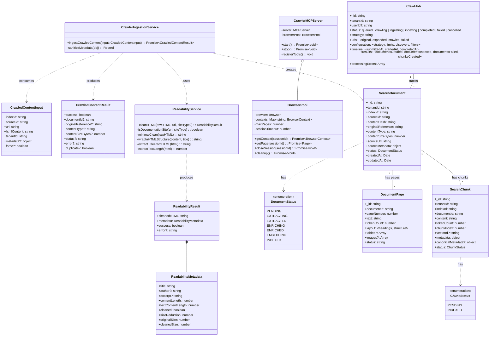
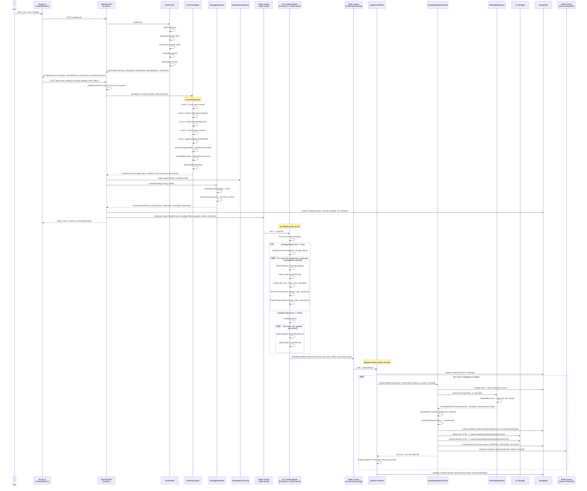
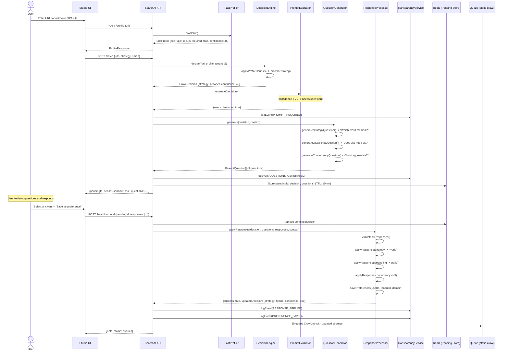
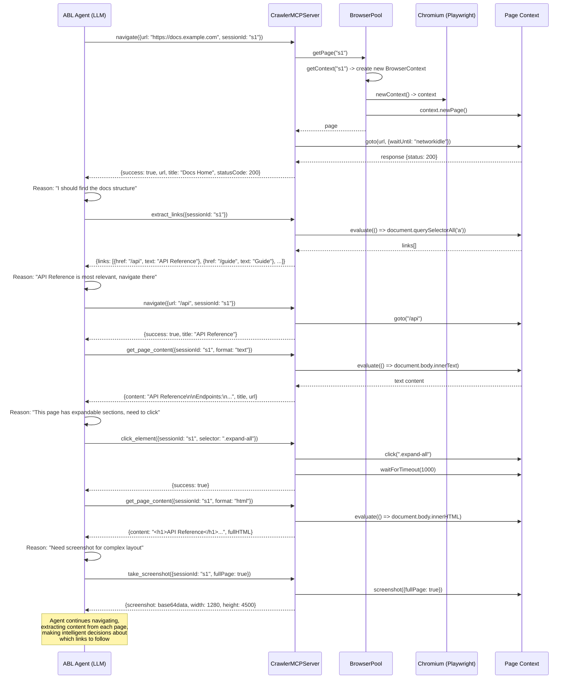
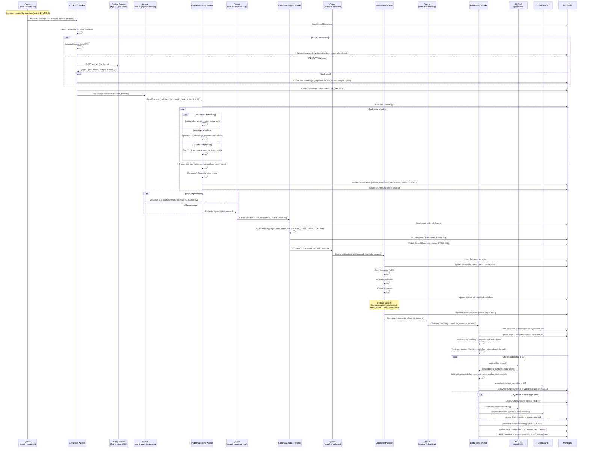

# Crawling System — Class & Sequence Diagrams

Comprehensive UML diagrams for the crawling and ingestion pipeline architecture.

> **Rendering:** These diagrams use Mermaid syntax. View them in:
>
> - GitHub (renders natively in `.md` files)
> - VS Code with [Mermaid Preview](https://marketplace.visualstudio.com/items?itemName=bierner.markdown-mermaid) extension
> - [mermaid.live](https://mermaid.live) (paste any code block)

---

## Table of Contents

- [Class Diagrams](#class-diagrams)
  - [1. Strategy & Decision Layer](#1-strategy--decision-layer)
  - [2. Disclosure & Transparency Layer](#2-disclosure--transparency-layer)
  - [3. Go Crawler Worker](#3-go-crawler-worker)
  - [4. Ingestion Service & Data Models](#4-ingestion-service--data-models)
- [Sequence Diagrams](#sequence-diagrams)
  - [1. Full Crawl Flow (Happy Path)](#1-full-crawl-flow-happy-path)
  - [2. Decision with User Interaction (Low Confidence)](#2-decision-with-user-interaction-low-confidence)
  - [3. MCP-Based Agent Crawling](#3-mcp-based-agent-crawling)
  - [4. Post-Crawl Ingestion Pipeline](#4-post-crawl-ingestion-pipeline)

---

## Class Diagrams

### 1. Strategy & Decision Layer

Maps user intent to internal crawl parameters and makes autonomous strategy decisions.

- **StrategyResolver** — converts user-facing strategies (`smart`, `single-page`, etc.) into internal params (`bulk`, `browser`, `hybrid`)
- **DecisionEngine** — 5-level hierarchy: user override > user preference > tenant policy > learned pattern > profile heuristic
- **FastProfiler / CachedProfiler** — analyzes target sites (siteType, jsRequired, sitemap, framework detection)

```mermaid
classDiagram
    direction TB

    class UserCrawlStrategy {
        <<enumeration>>
        single-page
        sitemap
        smart
        limited
        full-site
    }

    class InternalCrawlStrategy {
        <<enumeration>>
        browser
        bulk
        hybrid
    }

    class StrategyConfig {
        +strategy?: UserCrawlStrategy
        +limits?: ~maxPages, maxDurationMinutes, maxDepth~
        +fallbackStrategy?: UserCrawlStrategy
        +filters?: CrawlFilters
        +options?: ~legacy~
    }

    class CrawlFilters {
        +includePaths?: string[]
        +excludePaths?: string[]
        +contentKeywords?: string[]
    }

    class ResolvedCrawlParams {
        +internalStrategy: InternalCrawlStrategy
        +batchSize: number
        +concurrency: number
        +jsHandling: none | static | dynamic
        +discovery: ~useSitemap, followLinks, maxPages, maxDepth~
        +limits: ~maxPages, maxDurationMs, maxDepth~
        +requestedStrategy: UserCrawlStrategy
        +fallbackApplied: boolean
        +reasoning: string
    }

    class StrategyResolver {
        +resolve(config, profile): Promise~StrategyResolutionResult~
        +getStrategyMetadata(): StrategyMetadata[]
        -mapLegacyOptionsToStrategy(options): UserCrawlStrategy
        -validateStrategy(strategy, config, profile): errors, warnings
        -resolveParams(strategy, config, profile, fallback): ResolvedCrawlParams
        -selectInternalStrategy(userStrategy, profile): InternalCrawlStrategy
        -getBatchSize(strategy): number
        -getConcurrency(strategy, profile): number
        -getJsHandling(strategy, profile): string
    }

    class ISiteProfiler {
        <<interface>>
        +profile(url, options?): Promise~SiteProfile~
        +getName(): string
        +getCapabilities(): ProfilerCapabilities
    }

    class SiteProfile {
        +domain: string
        +profiledAt: Date
        +siteType: static | spa | hybrid | unknown
        +framework?: string
        +jsRequired: boolean
        +linkDensity: number
        +estimatedSize: number
        +avgResponseTime: number
        +rateLimitDetected: boolean
        +maxConcurrency: number
        +confidence: number
        +metadata: ~hasRobotsTxt, hasSitemap, htmlSize, ...~
    }

    class FastProfiler {
        +getName(): string
        +getCapabilities(): ProfilerCapabilities
        +profile(url, options?): Promise~SiteProfile~
        +extractSitemapUrls(url, maxUrls?, timeout?): Promise~string[]~
        -detectSiteType($, html): SiteType
        -detectFramework($, html): string
        -calculateLinkDensity($, domain): number
        -estimateSizeFromLinks($, linkDensity): number
        -fetchHTML(url, timeout): Promise~string~
        -checkSitemap(url): Promise~boolean~
        -fetchRobotsTxt(url): Promise~string~
    }

    class CachedProfiler {
        -profiler: ISiteProfiler
        -cache: Map~string, CacheEntry~
        -maxSize: number
        -ttlMs: number
        +getName(): string
        +getCapabilities(): ProfilerCapabilities
        +profile(url, options?): Promise~SiteProfile~
        +getStats(): CacheStats
        +clear(): void
        +invalidate(url): boolean
        -isValid(entry): boolean
        -evictOldest(): void
    }

    class IDecisionEngine {
        <<interface>>
        +decide(context: DecisionContext): Promise~CrawlDecision~
        +recordOutcome(outcome: CrawlOutcome): void
        +explain(decision: CrawlDecision): string
    }

    class DecisionContext {
        +url: string
        +tenantId: string
        +userId?: string
        +profile: SiteProfile
        +userOverride?: object
        +estimatedUrlCount?: number
        +autoDecide?: boolean
        +previousCrawl?: object
    }

    class CrawlDecision {
        +strategy: InternalCrawlStrategy
        +batchSize: number
        +concurrency: number
        +jsHandling: none | static | dynamic
        +waitForJs?: number
        +confidence: number
        +reasoning: string
        +source: string
        +alternatives?: Alternative[]
    }

    class DecisionEngine {
        -userPreferenceStore?: IUserPreferenceStore
        -tenantPolicyStore?: ITenantPolicyStore
        -patternLearner?: IPatternLearner
        -defaultBatchSizes: Record
        -defaultConcurrency: Record
        +decide(context): Promise~CrawlDecision~
        +recordOutcome(outcome): Promise~void~
        +explain(decision): string
        -applyUserOverride(context): CrawlDecision
        -applyUserPreference(context, pref): CrawlDecision
        -applyTenantPolicy(context, policy): CrawlDecision
        -applyLearnedPattern(context, pattern): CrawlDecision
        -applyProfileHeuristic(context): CrawlDecision
        -selectStrategy(profile): CrawlStrategy
        -calculateBatchSize(strategy, profile): number
        -calculateConcurrency(strategy, profile): number
        -generateAlternatives(strategy, profile): Alternative[]
    }

    class IUserPreferenceStore {
        <<interface>>
        +getPreference(userId, tenantId, domain): Promise
        +savePreference(pref): Promise
        +deletePreference(id): Promise
        +trackUsage(id): Promise
    }

    class ITenantPolicyStore {
        <<interface>>
        +getPolicy(tenantId, domain): Promise
        +createPolicy(policy): Promise
        +updatePolicy(id, updates): Promise
        +listPolicies(tenantId): Promise
    }

    class IPatternLearner {
        <<interface>>
        +learn(outcome, profile): Promise
        +getPattern(tenantId, domain): Promise
        +listPatterns(tenantId): Promise
        +decayPatterns(): Promise
    }

    ISiteProfiler <|.. FastProfiler
    ISiteProfiler <|.. CachedProfiler
    CachedProfiler o-- ISiteProfiler : wraps
    IDecisionEngine <|.. DecisionEngine
    DecisionEngine o-- IUserPreferenceStore
    DecisionEngine o-- ITenantPolicyStore
    DecisionEngine o-- IPatternLearner
    StrategyResolver ..> SiteProfile : uses
    StrategyResolver ..> ResolvedCrawlParams : produces
    StrategyConfig *-- CrawlFilters
    DecisionEngine ..> DecisionContext : consumes
    DecisionEngine ..> CrawlDecision : produces
    DecisionContext *-- SiteProfile
```

---

### 2. Disclosure & Transparency Layer

Handles user interaction when the system has low confidence, and provides a full audit trail.

- **QuestionGenerator** — creates questions for the user when decision confidence is low
- **ResponseProcessor** — applies user answers and optionally saves preferences
- **TransparencyService** — logs every decision event for auditing and timeline reconstruction
- **MongoPatternStore** — stores learned crawl patterns per domain

```mermaid
classDiagram
    direction TB

    class QuestionGenerator {
        +generate(decision, context): PromptQuestion[]
        -generateStrategyQuestion(decision, context): PromptQuestion?
        -generateBatchSizeQuestion(decision, context): PromptQuestion?
        -generateJavaScriptQuestion(decision, context): PromptQuestion?
        -generateConcurrencyQuestion(decision, context): PromptQuestion?
        -buildStrategyOptions(decision, profile): QuestionOption[]
    }

    class PromptQuestion {
        +id: string
        +type: string
        +question: string
        +context: string
        +options?: QuestionOption[]
        +defaultValue?: any
        +range?: object
        +priority: number
    }

    class QuestionOption {
        +value: string
        +label: string
        +description: string
        +recommended?: boolean
        +expectedOutcome?: object
    }

    class ResponseProcessor {
        +applyResponses(decision, questions, responses, context): Promise~ResponseApplicationResult~
        -validateInputs(questions, responses): void
        -validateAllResponses(questions, responses): object?
        -validateResponse(question, value): string?
        -applyResponse(decision, question, response): string?
        -savePreferences(responses, context): Promise~boolean~
    }

    class QuestionResponse {
        +questionId: string
        +value: any
        +saveAsPreference?: boolean
    }

    class ResponseApplicationResult {
        +success: boolean
        +updatedDecision?: CrawlDecision
        +preferencesSaved?: boolean
        +error?: string
    }

    class TransparencyService {
        -eventStore: IEventStore
        -eventEmitter: IEventEmitter
        -handlers: Map
        +logEvent(event): Promise~void~
        +getTimeline(jobId): Promise~DecisionTimeline~
        +onEvent(eventType, handler): unsubscribe
        +onAllEvents(handler): unsubscribe
        +getEventsByTenant(tenantId, options?): Promise~DecisionEvent[]~
        +getEventsByDomain(tenantId, domain): Promise~DecisionEvent[]~
        -buildPhases(events): TimelinePhase[]
        -buildSummary(events): TimelineSummary
    }

    class DecisionEvent {
        +id: string
        +type: DecisionEventType
        +timestamp: Date
        +tenantId: string
        +jobId?: string
        +domain?: string
        +data: object
        +durationMs?: number
        +success: boolean
        +error?: string
    }

    class DecisionTimeline {
        +jobId: string
        +tenantId: string
        +events: DecisionEvent[]
        +phases: TimelinePhase[]
        +summary: TimelineSummary
        +totalDuration?: number
    }

    class IPatternStore {
        <<interface>>
        +storePattern(input): Promise~StoredPattern~
        +getPattern(tenantId, domain): Promise~StoredPattern?~
        +findPatterns(query): Promise~StoredPattern[]~
        +updateCrawlMetrics(update): Promise~void~
        +deletePattern(tenantId, domain): Promise~boolean~
        +getStats(tenantId): Promise~PatternStoreStats~
    }

    class MongoPatternStore {
        +storePattern(input): Promise~StoredPattern~
        +getPattern(tenantId, domain, options?): Promise~StoredPattern?~
        +findPatterns(query): Promise~StoredPattern[]~
        +updateCrawlMetrics(update): Promise~void~
        +deletePattern(tenantId, domain): Promise~boolean~
        +getStats(tenantId): Promise~PatternStoreStats~
        +clearTenant(tenantId): Promise~number~
    }

    QuestionGenerator ..> PromptQuestion : produces
    PromptQuestion *-- QuestionOption
    ResponseProcessor ..> QuestionResponse : consumes
    ResponseProcessor ..> ResponseApplicationResult : produces
    TransparencyService ..> DecisionEvent : logs
    TransparencyService ..> DecisionTimeline : builds
    IPatternStore <|.. MongoPatternStore
```

---

### 3. Go Crawler Worker

The high-performance crawling engine written in Go, using Colly for HTTP-based HTML fetching.

- **CollyCrawler** — wraps gocolly/colly with SSRF protection, rate limiting, and metadata extraction
- **Consumer** — polls Redis for BullMQ-compatible jobs and publishes results back
- **Processor** — orchestrates job execution (batch vs recursive crawl)

---

### 4. Ingestion Service & Data Models

Node.js services that clean, store, and track crawled content through the pipeline.

- **CrawlerIngestionService** — orchestrates HTML cleaning, dedup, S3 upload, and document creation
- **ReadabilityService** — strips noise from HTML using Mozilla Readability
- **CrawlerMCPServer / BrowserPool** — Playwright-based browser automation for agent-driven crawling
- **SearchDocument / SearchChunk** — MongoDB models tracking pipeline state

---

## Sequence Diagrams

### 1. Full Crawl Flow (Happy Path)

User submits a URL through Studio UI, the system profiles the site, makes a strategy decision, dispatches to the Go crawler, and ingests the results.

---

### 2. Decision with User Interaction (Low Confidence)

When the profiler has low confidence about the site type, the system asks the user clarifying questions before proceeding.

---

### 3. MCP-Based Agent Crawling

An AI agent uses browser automation tools (via MCP protocol) to intelligently navigate and extract content from JavaScript-heavy sites.

---

### 4. Post-Crawl Ingestion Pipeline

The full journey of a document through 6 pipeline stages: extraction, chunking, canonical mapping, enrichment, and embedding into OpenSearch.

---

## Key Files Reference

| Component            | File                                                         |
| -------------------- | ------------------------------------------------------------ |
| Strategy types       | `packages/crawler/src/strategy/types.ts`                     |
| Strategy resolver    | `packages/crawler/src/strategy/resolver.ts`                  |
| Decision engine      | `packages/crawler/src/decision/decision-engine.ts`           |
| Decision interfaces  | `packages/crawler/src/decision/interfaces.ts`                |
| Fast profiler        | `packages/crawler/src/profiler/fast-profiler.ts`             |
| Cached profiler      | `packages/crawler/src/profiler/cached-profiler.ts`           |
| Question generator   | `packages/crawler/src/disclosure/question-generator.ts`      |
| Response processor   | `packages/crawler/src/disclosure/response-processor.ts`      |
| Transparency service | `packages/crawler/src/transparency/transparency-service.ts`  |
| Pattern store        | `packages/crawler/src/pattern-store/mongo-pattern-store.ts`  |
| Go crawler (Colly)   | `apps/crawler-go-worker/internal/crawler/colly.go`           |
| Go queue consumer    | `apps/crawler-go-worker/internal/queue/consumer.go`          |
| Go processor         | `apps/crawler-go-worker/internal/processor/processor.go`     |
| Go job types         | `apps/crawler-go-worker/pkg/types/job.go`                    |
| Go SSRF validator    | `apps/crawler-go-worker/internal/ssrf/validator.go`          |
| Ingestion service    | `apps/search-ai/src/services/ingestion/crawler-ingestion.ts` |
| Readability service  | `apps/search-ai/src/services/readability/index.ts`           |
| Ingestion worker     | `apps/search-ai/src/workers/crawler-ingestion-worker.ts`     |
| Embedding worker     | `apps/search-ai/src/workers/embedding-worker.ts`             |
| MCP server           | `apps/crawler-mcp-server/src/server.ts`                      |
| Browser pool         | `apps/crawler-mcp-server/src/browser/pool.ts`                |
| API routes           | `apps/search-ai/src/routes/crawl.ts`                         |
| Queue constants      | `packages/search-ai-sdk/src/constants.ts`                    |
