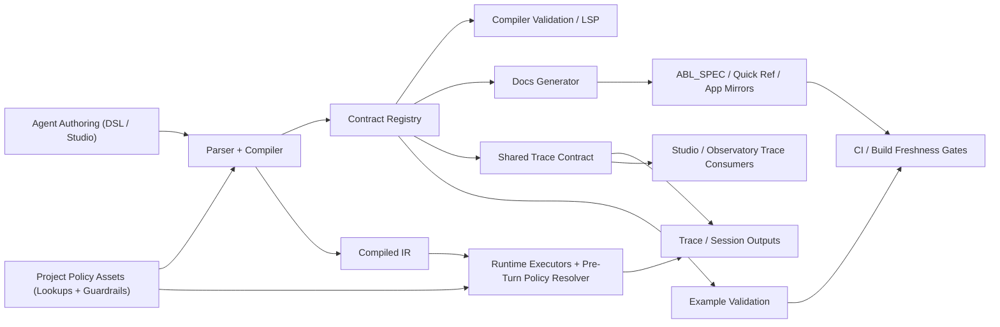

# HLD: ABL Contract Hardening

**Feature Spec**: `docs/features/abl-contract-hardening.md`
**Test Spec**: `docs/testing/abl-contract-hardening.md`
**Status**: IMPLEMENTED
**Last Updated**: 2026-04-19

---

## 1. Problem Statement

ABL lacks a single authoritative public contract. The parser, compiler IR, runtime, Studio, docs, and examples all describe overlapping but non-identical versions of the language. This creates exactly the class of regressions called out in the change-review rubric: reasoning-vs-flow divergence, implemented-but-unwired features, duplicate sources of truth, docs/examples that lie about the real product, and tests that validate helpers while missing the public boundary.

The approved direction is to solve this as one architecture program, not as isolated fixes.

---

## 2. Decision Summary

The selected architecture is:

1. **One canonical contract registry** in the compiler layer for public ABL metadata.
2. **Project-wide guardrails as first-class project policy assets**, with canonical bundle round-trip and optional authoring projections that compile to the same persisted asset.
3. **Unified semantic model** for state/result/action behavior across reasoning and FLOW where parity is promised.
4. **Named return handlers** as the canonical `ON_RETURN` shape, with a compatibility lane for safe shorthand.
5. **Explicit cross-agent memory grants**, with legacy `grant_memory` lowering into a typed grant model.
6. **Agent-local enums + project-owned shared lookup tables**, with explicit references and fail-fast conflicts.
7. **Public stability tiers** (`core`, `beta`, `experimental`) for every construct carried by the contract registry.
8. **Expanded memory model** with an `execution_tree` scope between session and user/project, canonical recall-event syntax, and reserved system identifiers.
9. **Machine `HANDOFF` only, human/system `ESCALATE` only**, with `auto` as the safe history default and deterministic fallback to bounded raw history when summary-only would be lossy.
10. **Pre-turn context projection and dynamic tool/prompt shaping** before each LLM turn.
11. **First-class async handoff/background completion** with durable suspend/resume behavior.
12. **Versioned FLOW execution-order contract plus canonical trace-event contract**, backed by lints, parity tests, and downstream type safety.
13. **Generated docs facts + validated examples**, including BankNexus as a reference-quality example.
14. **Curated long-form governance** for authored academy, Arch-AI knowledge, and static anatomy surfaces, using contract-backed fact injection where possible and CI validation everywhere else.

---

## 3. Architecture Overview

### 3.1 System Context

### 3.2 Core Components

#### A. Contract Registry

Planned location: `packages/compiler/src/platform/contracts/`

Responsibilities:

- construct inventory and stability metadata
- legal enum/action values
- system variables and canonical event names
- docs-generation metadata
- example-validation metadata
- compatibility/deprecation metadata

The registry does not replace parser or runtime code. It becomes the public metadata layer those components consume.

#### B. Execution-Semantics Layer

Execution semantics remain implemented in the compiler/runtime, but the public behavior is normalized through shared contract definitions:

- reasoning and FLOW share one result/state/action model
- `ON_RETURN` is validated against named handler definitions
- history strategy defaults and legality come from the coordination contract
- `grant_memory` lowers into explicit memory-grant behavior rather than remaining parsed-only metadata
- project-wide guardrails and auth/policy state can shape tools/prompts before each turn
- FLOW ordering is explicitly codified rather than inferred from current executor code

#### C. Docs Generation Layer

Generated outputs derive from the registry:

- quick-reference tables
- system-variable tables
- event-name tables
- support/stability markers
- mirrored app content

Hand-authored prose remains in canonical long-form docs, which embed or link to generated factual sections.

For long-form surfaces that should remain authored, the architecture adds a governance layer rather than forcing full generation:

- Arch-AI knowledge cards embed contract-backed fact sections directly from the compiler registry.
- Academy modules and static anatomy/demo surfaces remain authored, but CI validates them against a curated manifest of canonical terms, forbidden legacy patterns, and parseable ABL snippets.

#### D. Example Validation Layer

Reference examples are promoted into architectural proof:

- canonical spec examples
- quick-reference examples
- BankNexus smoke/example fixtures
- other reference example folders chosen as contract fixtures

#### E. Project Policy Asset Layer

Project-wide policy assets remain distinct from agent DSL:

- shared lookup tables and project-wide guardrails are project-owned artifacts
- import/export persists them as canonical project files
- any future authored ABL projection compiles down to the same canonical guardrail asset
- runtime policy resolution consumes these assets before each turn, not just at compile time

#### F. Pre-Turn Orchestration Layer

Before every LLM turn, the runtime should build one canonical execution view:

- projected session state
- granted cross-agent memory
- current guardrail / auth policy
- filtered toolset
- prompt overlays derived from the same state

This layer is what closes the gap between static start-of-session setup and dynamic orchestration.

#### G. Canonical Trace Contract Layer

Trace typing is treated as part of the product contract:

- shared-kernel owns the canonical event names and type union
- observatory and Studio presentation layers consume the same registry-derived contract
- runtime emitters and downstream consumers stay parity-tested

---

## 4. Key Architectural Flows

### 4.1 Authoring and Validation Flow

1. Agent developer authors DSL or Studio metadata.
2. Parser/compiler read the canonical registry to validate public construct shape and stability tier.
3. Compiler lowers DSL into IR and emits diagnostics for legacy or experimental constructs.
4. Language-service and Studio use the same registry metadata for hover/help/lint surfaces.

### 4.2 Docs & Example Flow

1. Registry is read by generator scripts.
2. Generated manifest and quick-reference artifacts are emitted.
3. Mirrored docs surfaces are updated from generated outputs.
4. `abl:docs:check` fails if checked-in artifacts are stale.
5. Example-validation tests compile docs/examples against the same contract.

### 4.3 Runtime Execution Flow

1. Runtime consumes compiled IR that was validated against the contract registry.
2. A pre-turn policy/context resolver projects session memory, granted memory, guardrail state, and auth/policy into one execution view.
3. Reasoning and FLOW executors use shared semantics for public state/result behavior.
4. Coordination helpers enforce `HANDOFF`, `ESCALATE`, `ON_RETURN`, memory grants, and history legality.
5. Memory, lookup, flow-order, and tool-gating behaviors remain observable and regression-tested.

### 4.4 Project Guardrail Round-Trip Flow

1. Project bundles persist guardrails through one canonical guardrail asset model, with deterministic `guardrails/*.guardrail.json` projection by default and `guardrails/*.guardrail.yaml` as an alternate export/import projection.
2. Import/export validates those bundle projections through project-io schema and rebinding rules.
3. Runtime loads project guardrails into the pre-turn policy layer.
4. Any future authored ABL guardrail projection must compile back to the same canonical asset with no round-trip loss.

### 4.5 Async Handoff & Resume Flow

1. Parent agent issues a machine handoff with explicit return and policy metadata.
2. Runtime persists suspend/resume state, async timeout, and completion-routing metadata.
3. Child/background work completes or times out.
4. Runtime resumes the parent return handler or failure path deterministically.
5. Trace events and session state reflect the full suspend/resume lifecycle.

### 4.6 Trace Contract Flow

1. Canonical trace event names and categories are defined once in shared-kernel.
2. Runtime emitters, observatory schema, and Studio presentation maps import the same contract.
3. Consumer-specific labels/groups derive from the canonical registry, not local string unions.
4. CI parity tests fail when a valid runtime event is missing from downstream consumers.

---

## 5. Change-Review Rubric Mapping

### 5.1 Persona Boundaries & Source of Truth

- **End user lane**: runtime behavior only
- **Agent developer lane**: agent DSL and agent-local enums
- **Project/builder lane**: project runtime config and project policy assets such as shared lookup tables and guardrails
- **Platform lane**: contract registry, validation logic, generated docs metadata

Architectural rule: no lane may silently create a second authority for another lane’s asset.

### 5.2 Primary Concerns for This HLD

- Execution & Orchestration
- Reasoning vs Flow Path Consistency
- Session State, Metadata & Memory
- Import / Export / Round-Trip Fidelity
- Traceability, Audit & Observability

### 5.3 Mandatory Baseline Proof

Even when not listed as a top-five primary lane above, this design still requires explicit proof for:

- Contracts & Compatibility
- Activation, Deployment & Reachability
- Docs, Examples, Cross-Module Consistency & Code Sanity
- Test Integrity, Regression Coverage & Behavior Validation

---

## 6. Twelve Architectural Concerns

### 6.1 Resource Isolation

This feature adds and hardens resource boundaries at multiple layers:

- project-owned lookup tables stay in project runtime config
- project-owned guardrails stay in canonical guardrail assets
- agent-owned enums stay in agent DSL
- execution-tree memory is isolated to one workflow / handoff chain
- platform-owned contract metadata stays in the registry

The compiler/runtime must fail closed on cross-lane conflicts rather than silently merging authority.

### 6.2 Authentication & Authorization

No new auth surface is introduced in the base design. If implementation adds new docs-generation endpoints or admin surfaces, they must continue to use existing centralized auth patterns and explicit scoping. Current plan assumes generation is repo/build-time only.

### 6.3 Data Model & Ownership

New durable data spans several bounded owners:

- file-backed contract metadata in the registry and generated artifacts
- existing project-owned lookup tables
- canonical project guardrail assets
- additive runtime/session state for `execution_tree` scope and async handoff suspension

IR shape changes should be additive and versioned. Contract registry metadata must be typed and exportable for docs/tests.

### 6.4 API / Surface Semantics

This design primarily changes semantics rather than adding public APIs. The important boundaries are design-time vs runtime and project bundle vs runtime application:

- design-time metadata comes from the contract registry
- agent-authored references compile into IR
- project-owned guardrails and lookup assets round-trip through import/export and bind into runtime policy
- runtime executes the IR under the same published contract

If any new endpoint is introduced later, it must be documented as a separate boundary with reachability proof.

### 6.5 Execution & Orchestration

The architecture centralizes public orchestration semantics:

- `HANDOFF` only for machine agents
- `ESCALATE` only for humans/systems
- named return handlers as the canonical return-path behavior
- documented default history strategy
- explicit cross-agent memory grants
- pre-turn tool/prompt shaping from projected policy state
- durable async handoff suspend/resume and completion routing
- frozen FLOW evaluation order

These remain implemented in compiler/runtime executors, but the registry drives what is legal/public.

### 6.6 Reasoning vs Flow Path Consistency

This is a first-class concern, not a side note. The architecture requires:

- shared semantic model where parity is promised
- the same pre-turn state projection rules feeding both reasoning and FLOW paths
- explicit documentation for intentional divergences
- paired tests across reasoning and FLOW for every shared workstream

No future contract change in these areas should land in only one path without an explicit rationale.

### 6.7 Contracts & Compatibility

Compatibility is handled in two layers:

- **registry metadata**: marks legacy aliases and removal targets
- **compiler/runtime validation**: accepts supported legacy forms and emits warnings or errors deterministically

Examples:

- legacy `ON_RETURN` shorthand
- legacy `grant_memory` shorthand
- recall-event aliases
- parsed advanced memory forms not yet fully public
- partial async-handoff settings currently parsed/stored ahead of full runtime completion support
- trace unions currently duplicated across packages during migration to the canonical contract

### 6.8 Import / Export / Round-Trip Fidelity

Round-trip fidelity matters for:

- Studio authoring of lookup references
- import/export of project-wide guardrail assets
- any future ABL guardrail authoring projection
- generated docs mirrors
- example serialization and validation

The architecture therefore requires fixture/snapshot tests around generated artifacts and authoring round trips where ownership boundaries cross the Studio/runtime divide.

### 6.9 Traceability, Audit & Observability

Runtime semantics touched by this feature must continue to emit traceable behavior through existing trace systems. The architecture now also requires:

- one canonical trace registry/type contract in shared-kernel
- parity between runtime emitters, observatory schema, and Studio presentation helpers
- new async handoff, grant-memory, and pre-turn policy events to be introduced through the shared contract rather than ad hoc local unions

### 6.10 Distributed Reliability & Scale

No new distributed service is required. The primary reliability concerns are:

- build determinism for generated docs
- bounded caches if registry metadata is memoized
- race-free history/return behavior in runtime executors
- durable async handoff suspension/resume under reconnects or pod restarts
- concurrency-safe `execution_tree` scope persistence and cleanup

The design intentionally avoids introducing a network-dependent docs generator or pod-local truth for contract metadata.

### 6.11 Security, Privacy & Compliance

- Reserved system identifiers such as `user_id` remain system-owned.
- The handoff/history design keeps `auto` as the safe default so it can reduce oversharing when summary transfer is safe, while still falling back to bounded raw history for scripted or summary-less targets.
- Cross-agent memory grants default to explicit, least-privilege behavior rather than ambient write access.
- Project-wide guardrails remain project-owned policy and must not be bypassed through per-agent hidden config.
- Experimental or hidden memory constructs must not become de facto public without explicit review.
- Human escalation stays distinct from machine handoff to preserve clearer privacy and audit semantics.

### 6.12 Activation, Deployment & Reachability

The architecture is only successful if:

- generator tasks are wired into repo scripts and Turbo/build
- docs-internal and Studio surfaces are actually fed by generated or validated content
- project-io import/export surfaces actually round-trip guardrail assets
- runtime executors consume the finalized contract behavior
- pre-turn policy/tool shaping runs on real execution paths instead of remaining compile-time metadata only
- shared-kernel trace contracts are the source of truth for Studio and observatory consumers
- BankNexus smoke is reachable in CI

“Code exists” is not enough; build and execution reachability are part of the design.

---

## 7. Alternatives Considered

### Alternative A: Keep Fixing Each Surface Independently

Rejected. This is the failure mode that created the current drift.

### Alternative B: Make the Runtime the Only Source of Truth

Rejected. Runtime types alone do not describe author-facing syntax, support tiers, or docs-generation needs clearly enough.

### Alternative C: Generate All Docs and Eliminate Authored Spec Prose

Rejected. Generated facts are useful, but rationale, migration guidance, and curated examples still need authored narrative.

### Alternative D: Allow Both Agent-Level and Project-Level Lookup Configuration as First-Class Authorities

Rejected. This recreates duplicate ownership and silently conflicting behavior.

### Alternative E: Keep Project Guardrails as JSON-Only Implementation Detail with No Public Contract

Rejected. That would preserve the current awkward demo-bundle story and keep cross-agent guardrails outside the author-visible ABL contract.

### Alternative F: Let Runtime Emitters Define Trace Events Independently and Have Studio/Observatory Catch Up Later

Rejected. This is the current failure mode that forces string casts and breaks exhaustiveness downstream.

---

## 8. Migration & Rollout

### 8.1 Order of Operations

1. Land the contract registry and generated-doc pipeline.
2. Freeze compatibility metadata for the legacy forms affected here.
3. Implement runtime/compiler semantic changes in slices.
4. Update Studio/help surfaces and examples.
5. Promote BankNexus and generated docs only after validation gates pass.

### 8.2 Compatibility Window

The HLD assumes at least one migration window for:

- legacy `ON_RETURN` shorthand
- legacy `grant_memory` shorthand
- recall-event aliases
- parsed-but-underdocumented memory forms
- fragmented trace unions in downstream packages

The exact release count can be finalized during LLD/implementation.

### 8.3 Rollback Strategy

If a specific semantic slice regresses:

- generated docs can be reverted independently of prose
- compatibility warnings remain enabled even if a new canonical form is paused
- example promotion is blocked until smoke validation passes

---

## 8.4 Post-Implementation Notes

Implementation closed all planned architecture slices across the compiler, runtime, project-io, shared-kernel, observatory, Studio, docs, and examples surfaces. The major architectural decisions from this HLD now exist as shipped code rather than only planning intent:

- the compiler-owned contract registry and generated-doc freshness gates are live
- project-wide guardrails round-trip as canonical portable bundle assets
- named return handlers, safe handoff-history defaults, and machine-only `HANDOFF` semantics are enforced
- pre-turn context/policy/tool shaping and async resume paths are wired on real runtime execution paths
- explicit memory grants and `execution_tree` scope are durable across handoffs and restore flows
- shared-kernel now owns the canonical trace-event contract consumed by downstream packages
- BankNexus and the authored docs surfaces were repaired to the hardened public contract
- a follow-up runtime/import/compiler cleanup slice hardened the live boundary contracts without changing the architecture: preview now rejects invalid locale asset paths, apply surfaces staged sanitized errors, runtime honors `Project.entryAgentName`, CALL/SET normalization is aligned across compiler/runtime, quoted timeout literals are supported, and filtered templates fail closed

Remaining work is no longer architectural ambiguity; it is promotion work toward BETA/STABLE, mainly broader public E2E coverage, compatibility-lane retirement, and performance guard coverage around dynamic pre-turn shaping. The previously open drift in Arch-AI knowledge, academy modules, and static anatomy surfaces is now covered by the curated long-form governance lane.

---

## 9. Risks

| Risk                                                                            | Mitigation                                                                               |
| ------------------------------------------------------------------------------- | ---------------------------------------------------------------------------------------- |
| Registry becomes a second stale authority instead of the real one               | Make generators and validation consume it from day one; do not leave it unused           |
| Guardrail JSON and future authored projections drift apart                      | Keep one canonical persisted artifact and compile any authored projection into it        |
| Docs generation is wired too late, allowing more drift during implementation    | Land build/check pipeline early in the program                                           |
| Runtime semantics change faster than examples/docs                              | Use feature slices that require docs/example validation before closure                   |
| Legacy compatibility becomes permanent                                          | Track every shim in registry metadata with removal notes and tests                       |
| Pre-turn tool/prompt shaping adds latency or inconsistent behavior              | Introduce one shared pre-turn resolver with bounded inputs and parity tests              |
| Async handoff resume paths stay partial and race-prone                          | Treat suspend/resume as a first-class execution contract with persistence/time-out tests |
| Trace contract unification creates package-dependency churn or stalls consumers | Put the canonical registry in shared-kernel and migrate consumers behind parity tests    |
| BankNexus repair is deferred and examples stay misleading                       | Treat example repair as a required implementation slice, not a follow-up                 |

---

## 10. Decision Log

- **Approved**: unified semantic parity direction for reasoning vs FLOW
- **Approved**: project-wide guardrails remain canonical project assets with round-trip fidelity
- **Approved**: named return handlers as the canonical `ON_RETURN` model
- **Approved**: `grant_memory` becomes a typed cross-agent grant contract with compatibility shorthand
- **Approved**: agent-local enums plus project-level shared lookup tables
- **Approved**: `core` / `beta` / `experimental` contract tiers
- **Approved**: memory model with `execution_tree` scope, canonical recall events, and reserved `user_id`
- **Approved**: `HANDOFF` machine-only, `ESCALATE` human/system-only, `auto` default
- **Approved**: pre-turn context projection plus dynamic tool/prompt shaping
- **Approved**: async handoff/background completion as a first-class suspend/resume contract
- **Approved**: FLOW execution order as a versioned contract
- **Approved**: one canonical trace-event contract across runtime, observatory, and Studio
- **Approved**: supervisor/bootstrap ownership for shared context in BankNexus-style examples
- **Approved**: generated facts and docs freshness checks integrated into build/CI
- **Approved**: curated long-form authored surfaces must either embed registry-backed facts or pass contract-aware CI validation

---

## 11. References

- `docs/features/abl-contract-hardening.md`
- `docs/testing/abl-contract-hardening.md`
- `docs/design/2026-04-07-abl-semantic-constructs-design.md`
- `docs/reviews/enum-lookup-pr-review.md`
- `docs/enterprise/GRAPH_TO_ABL_FEATURE_MAPPING.md`
- `/Users/prasannaarikala/projects/f-1/abl-platform/docs/sdlc/change-review-rubric.md`
