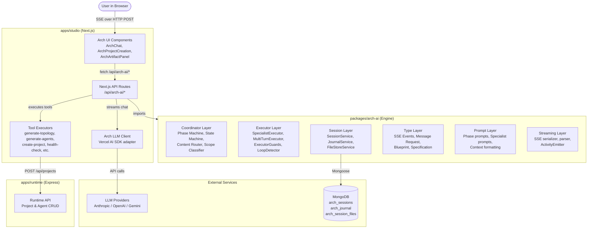
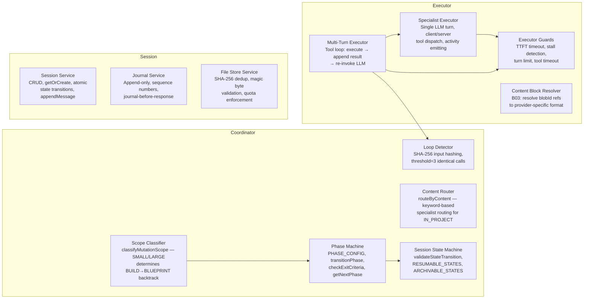
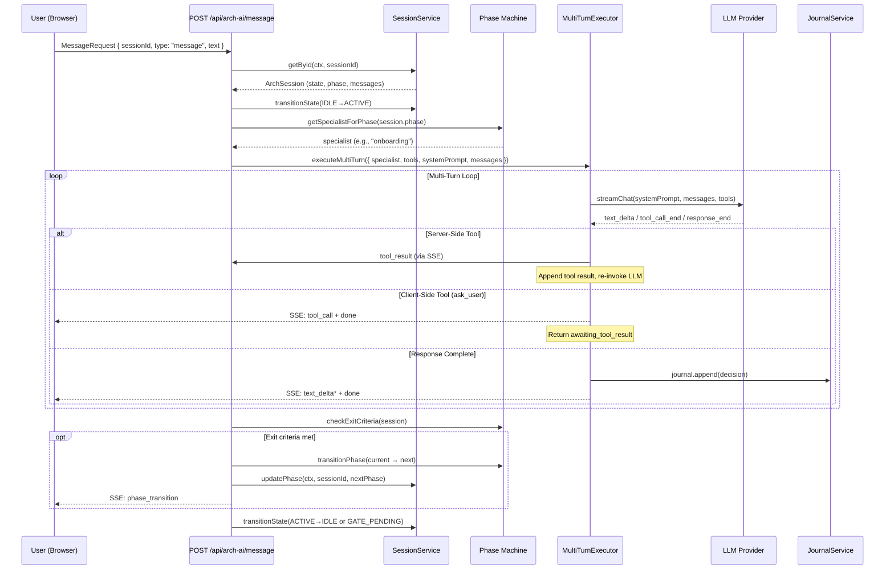
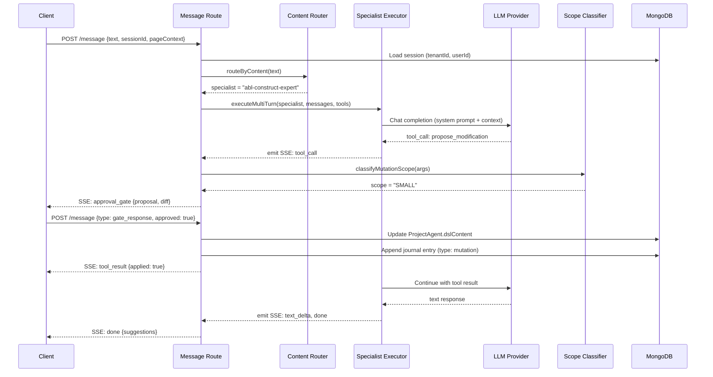

# HLD: Arch AI v0.3

**Feature**: Arch AI -- AI-assisted agent design and project creation
**Status**: APPROVED
**Last Updated**: 2026-04-06

---

## 1. Problem Statement

Building multi-agent systems on the ABL platform requires deep knowledge of ABL DSL constructs (agents, tools, gathers, handoffs, constraints, guardrails), topology design patterns, and platform capabilities. Without Arch AI:

- New users face a steep learning curve: they must manually author agent YAML, understand execution modes, configure handoffs, and set up guardrails -- all before testing a single conversation.
- Experienced users spend repetitive effort on project scaffolding that could be automated.
- Agent topology design (multi-agent routing, delegation, escalation) requires expertise that most users lack.
- There is no structured onboarding flow that progressively captures requirements and translates them into working ABL projects.
- Post-creation, modifying agents requires manual YAML editing with no AI assistance for constraint coverage, model selection, or architecture analysis.

Arch AI v0.3 solves this by providing a conversational AI architect that guides users through a deterministic 4-phase onboarding flow (interview requirements, design topology, generate agent code, create project) and then continues as an in-project assistant for ongoing agent development.

The implementation must preserve the platform's core invariants: tenant isolation at the query level, centralized auth via `requireTenantAuth`, stateless distributed execution, and compliance with data minimization (30-day TTL on session files).

---

## 1a. Feature Spec FR Traceability

| FR    | Name                              | HLD Section      | Notes                                                                                                                                                                                            |
| ----- | --------------------------------- | ---------------- | ------------------------------------------------------------------------------------------------------------------------------------------------------------------------------------------------ |
| FR-1  | Arch Panel                        | UI-only          | Panel lifecycle managed by ArchShell + useArchChat hook. No engine-level architecture.                                                                                                           |
| FR-2  | Assisted/Pro Mode                 | UI-only          | Orthogonal to ONBOARDING/IN_PROJECT session modes. UI chrome differences only.                                                                                                                   |
| FR-3  | Project Creation Wizard           | S3.3, S7.5, S7.6 | Full ONBOARDING phase machine coverage                                                                                                                                                           |
| FR-4  | Conversational Agent Modification | S3.4, S7.4       | propose_modification + scope classifier + approval gate                                                                                                                                          |
| FR-5  | Workflow State Machine            | UI-only          | Client-side workflow state in useArchChat hook. 5 states: idle, contextualizing, responding, confirming, executing. Controls UI loading/streaming indicators. Not an engine-level state machine. |
| FR-6  | Context Awareness                 | S7.2, S7.7       | Page context injection + specialist routing                                                                                                                                                      |
| FR-7  | Suggestion Chips                  | S6 (done event)  | Generated by SuggestionGenerator based on phase + last tool. Phase-aware.                                                                                                                        |
| FR-8  | Conversation Persistence          | S5.1, S4 C9      | 200 message cap, sliding window of 8 for LLM                                                                                                                                                     |
| FR-9  | Configuration & Admin             | S7.1             | 4-tier LLM credential resolution                                                                                                                                                                 |
| FR-10 | Quick Generate Pipeline           | S7.8 (NEW)       | 5-stage pipeline. See addition below.                                                                                                                                                            |

---

## 2. Alternatives Considered

### Alternative A: Wizard-Based Form UI

**Description**: A traditional multi-step form wizard where users fill in project name, select agent count, pick tools from a catalog, and configure each agent via dropdowns and text fields. No LLM involvement.

**Pros**:

- Fully deterministic -- no LLM latency or hallucination risk
- Simpler to test and maintain
- No LLM cost per session

**Cons**:

- Cannot handle ambiguous or natural-language requirements ("I want a customer service bot that escalates billing issues")
- Rigid -- adding new configuration dimensions requires UI changes
- Cannot suggest architectural patterns (e.g., "you need a triage agent for this use case")
- No post-creation AI assistance for modifying agents
- Users must already know what they want in ABL terms

**Effort**: M

### Alternative B: Chat-Only Free-Form Agent (No Phase Machine)

**Description**: A single LLM-powered chat that attempts to gather requirements, design topology, generate code, and create the project in a single unstructured conversation. The LLM decides when each "phase" is complete.

**Pros**:

- Maximum flexibility -- conversation can go in any direction
- Simpler implementation (no phase machine, no exit criteria)
- Users feel less constrained

**Cons**:

- LLM drives flow -- unpredictable behavior (root cause of v0.2 failures)
- No deterministic exit criteria -- LLM can skip requirement gathering
- Tool leak: LLM can call `create_project` during interview phase
- No structured progress indication to users
- Impossible to guarantee all requirements are captured before code generation
- Session state is ambiguous -- hard to resume after interruption

**Effort**: M

### Alternative C: Coordinator/Executor/Specialist with Deterministic Phase Machine (Chosen)

**Description**: A 3-layer architecture where a deterministic Coordinator owns all phase transitions and tool filtering, an Executor handles multi-turn LLM loops with guards, and phase-specific Specialists provide domain expertise via tailored system prompts. The LLM operates within hard constraints set by the Coordinator -- it cannot skip phases, call tools outside its phase allowlist, or decide when to advance.

**Pros**:

- Deterministic flow -- Coordinator evaluates typed exit criteria, not the LLM
- Tool filtering prevents tool leak (e.g., `create_project` only available in CREATE phase)
- Structured progress: clear phase indicators, exit criteria, gate requests
- Resumable: session state machine + pending interactions enable reliable resume
- Surface-agnostic: engine in `packages/arch-ai/`, surface code in `apps/studio/`
- Extensible: IN_PROJECT mode adds freeform specialist routing without changing the phase machine

**Cons**:

- More complex implementation (phase machine, state machine, executor guards, loop detection)
- Two mode implementations to maintain (ONBOARDING + IN_PROJECT)
- Message route is currently 3,093 lines -- needs extraction for portability

**Effort**: L (already implemented)

### Recommendation

**Alternative C** is the chosen and implemented approach. It directly addresses the v0.2 root cause (LLM-driven flow was unpredictable) by making phase transitions fully deterministic. The additional complexity is justified by reliability and the v0.2 failure evidence.

---

## 3. Architecture

### 3.1 System Context Diagram



### 3.2 Component Diagram



### 3.3 Data Flow: ONBOARDING Message



### 3.4 Data Flow: IN_PROJECT Message



---

## 4. Architectural Concerns

| #   | Concern                     | Approach                                                                                                                                                                                                                                                                                                                                                                                                                                                                                                                                                                                                                                     | Status                         |
| --- | --------------------------- | -------------------------------------------------------------------------------------------------------------------------------------------------------------------------------------------------------------------------------------------------------------------------------------------------------------------------------------------------------------------------------------------------------------------------------------------------------------------------------------------------------------------------------------------------------------------------------------------------------------------------------------------- | ------------------------------ |
| C1  | **Tenant Isolation**        | Every MongoDB query includes `tenantId` in the filter. `SessionService`, `JournalService`, and `FileStoreService` all accept `SessionContext { tenantId, userId }` and never use `findById()`. Cross-tenant access returns 404 (not 403). Fixed: all queries now include tenantId (code review finding).                                                                                                                                                                                                                                                                                                                                     | IMPLEMENTED                    |
| C2  | **Authentication**          | All 12 API endpoints use `requireTenantAuth()` from centralized auth middleware. No custom token verification. Fixed: all routes now use `requireTenantAuth` (H2 code review finding).                                                                                                                                                                                                                                                                                                                                                                                                                                                       | IMPLEMENTED                    |
| C3  | **Traceability**            | Journal entries provide structured audit trail (append-only, sequenced, typed). `ActivityEmitter` provides real-time visibility via SSE `activity` events. **Gap: No TraceEvent integration yet** -- journal serves as interim trace store but does not emit `TraceEvent`s to the shared `TraceStore`.                                                                                                                                                                                                                                                                                                                                       | PARTIAL -- TraceEvent deferred |
| C4  | **Message Limits**          | Messages capped at 200 via `$slice: -200` on `appendMessage`. Sliding window of 8 most recent messages sent to LLM. `MAX_MESSAGE_LENGTH: 10,000` characters validated by Zod schema. Fixed: limits enforced (C4 code review finding).                                                                                                                                                                                                                                                                                                                                                                                                        | IMPLEMENTED                    |
| C5  | **Payload Validation**      | `MessageRequestSchema` (Zod discriminated union on `type`) validates all inbound requests. File attachments: max 10 per message, max 20 file refs. File size: 10MB per file, 50MB per session. Magic byte validation for images/PDFs. Fixed: payload validated (C5 code review finding).                                                                                                                                                                                                                                                                                                                                                     | IMPLEMENTED                    |
| C6  | **Session Isolation**       | Arch sessions are completely separate from runtime sessions. Different MongoDB collections (`arch_sessions` vs `sessions`), different state machines (5 states vs runtime's lifecycle), different services. Only shared data: `ProjectAgent` records created during CREATE phase.                                                                                                                                                                                                                                                                                                                                                            | IMPLEMENTED                    |
| C7  | **Loop Prevention**         | `LoopDetector`: SHA-256 hashes tool inputs, trips at 3 identical calls per turn. `ExecutorGuards`: max 10 re-invocations per turn, 120s turn timeout, 10s TTFT timeout, 15s stall detection, 30s tool timeout.                                                                                                                                                                                                                                                                                                                                                                                                                               | IMPLEMENTED                    |
| C8  | **Error Handling**          | 14 typed error classes (`InvalidTransitionError`, `SessionBusyError`, `FileCorruptError`, etc.). SSE `error` event with `{ code, message, retryable }`. Structured API responses `{ success, data?, error?: { code, message } }`.                                                                                                                                                                                                                                                                                                                                                                                                            | IMPLEMENTED                    |
| C9  | **Data Minimization**       | Session files have 30-day TTL (MongoDB TTL index on `arch_session_files`). Archived sessions can be deleted via `DELETE /sessions/:id` with cascade to journal entries. File content is session-scoped, not tenant-global.                                                                                                                                                                                                                                                                                                                                                                                                                   | IMPLEMENTED                    |
| C10 | **Performance**             | SSE streaming (no buffered responses). `force-dynamic` export prevents Next.js buffering. Target: <2s first token. Sliding window (8 messages) limits LLM context size. File dedup via SHA-256 prevents redundant storage.                                                                                                                                                                                                                                                                                                                                                                                                                   | IMPLEMENTED                    |
| C11 | **Concurrency**             | One non-terminal session per (tenantId, userId, mode) enforced by partial unique index. Atomic state transitions via `findOneAndUpdate` with state precondition in filter. `SessionBusyError` prevents concurrent streams to same session. Target: 10 concurrent sessions per tenant.                                                                                                                                                                                                                                                                                                                                                        | IMPLEMENTED                    |
| C12 | **Rollback / Blast Radius** | Route isolation: all routes under `/api/arch-ai/*`. DB isolation: 3 dedicated collections (`arch_sessions`, `arch_journal`, `arch_session_files`). Feature flag (`NEXT_PUBLIC_FEATURE_ARCH_AI`) recommended for production. Blast radius: minimal except CREATE phase (writes `Project`/`ProjectAgent` to runtime collections) and IN_PROJECT mode (modifies agent DSL via `propose_modification`). **Current remediation**: No automatic cleanup for partial CREATE failures. The operator must manually delete the Project record via the admin API, which cascades to ProjectAgent records. Users can retry CREATE from the same session. | IMPLEMENTED                    |

---

## 5. Data Model

### 5.1 `arch_sessions` Collection

```typescript
interface ArchSessionDocument {
  _id: string; // UUID
  tenantId: string; // Tenant isolation
  userId: string; // User isolation
  state: SessionState; // IDLE | ACTIVE | GATE_PENDING | COMPLETE | ARCHIVED
  metadata: {
    phase: ArchPhase; // INTERVIEW | BLUEPRINT | BUILD | CREATE
    mode: ArchMode; // ONBOARDING | IN_PROJECT
    specification: Specification; // Structured requirements (version, projectName, channels, etc.)
    pendingInteraction: PendingInteraction | null; // Widget or gate awaiting user response
    messages: StoredMessage[]; // Capped at 200 via $slice
    projectId?: string; // Set for IN_PROJECT mode

    // BLUEPRINT phase
    topology?: TopologyOutput; // Agents, edges, entryPoint
    blueprintOutput?: BlueprintOutput; // Full blueprint including agent specs, governance
    topologyApproved?: boolean; // Exit criteria gate

    // BUILD phase
    files?: Record<string, unknown>; // Generated agent YAML files
    buildSubPhase?: string; // AGENTS | TOOLS | COMPLETE
    mockServer?: { projectName; endpointCount; files } | null;

    // IN_PROJECT
    activeSpecialist?: string;
    pendingMutation?: { tool; target; scope; before?; after? };
  };
  archivedAt?: Date;
  createdAt: Date;
  updatedAt: Date;
}

// Indexes:
// - Partial unique: { tenantId, userId, 'metadata.mode', 'metadata.projectId' } where state in ['IDLE','ACTIVE','GATE_PENDING']
//   Enables separate ONBOARDING sessions per project.
// - Query: { tenantId, userId, 'metadata.mode', 'metadata.projectId', state }
// - TTL: { archivedAt } expireAfterSeconds 30 days (auto-delete archived sessions)
```

> **Note**: Fields `buildSubPhase`, `activeSpecialist`, and `pendingMutation` are not in the Mongoose schema definition — they pass through via the Mixed type on the metadata field. This means they have no default values, no validation, and no indexing at the database level.

### 5.2 `arch_journal` Collection

```typescript
interface ArchJournalDocument {
  _id: string;
  sessionId: string; // Foreign key to arch_sessions
  projectId?: string; // Set after CREATE (for IN_PROJECT queries)
  tenantId: string; // Tenant isolation
  userId: string; // User isolation
  type: JournalEntryType; // decision | consultation | mutation | validation | analysis
  content: JournalContent; // Discriminated union per type
  specialist: string; // Which specialist created this entry
  phase: string; // Phase when created
  timestamp: string; // ISO 8601, set by coordinator
  status: JournalEntryStatus; // active | superseded | invalidated | archived
  sequence: number; // Monotonically increasing per session
}

// Content union examples:
// - Decision: { type: 'decision', summary, rationale, alternatives? }
// - Mutation: { type: 'mutation', target, operation, scope, before?, after? }
// - Validation: { type: 'validation', agent, status: pass|fail, errors?, warnings? }

// Indexes:
// - { sessionId: 1, sequence: 1 } — primary query ordering
// - { sessionId: 1, phase: 1 } — filter by phase
// - { sessionId: 1, type: 1 } — filter by type
// - { projectId: 1, sequence: 1 } — IN_PROJECT journal lookup
```

### 5.3 `arch_session_files` Collection (B03 Multimodality)

```typescript
interface SessionFileDocument {
  _id: string; // UUID (blobId)
  sessionId: string; // Foreign key to arch_sessions
  tenantId: string; // Tenant isolation
  name: string; // Original filename
  mediaType: string; // MIME type
  size: number; // Actual byte size (after base64 decode)
  hash: string; // SHA-256 for dedup
  content: Buffer; // Raw binary content
  metadata: {
    width?: number; // Images
    height?: number; // Images
    pageCount?: number; // PDFs
    lineCount?: number; // Code/text
    language?: string; // Detected language
    endpointCount?: number; // OpenAPI specs
    columns?: string[]; // CSVs
    rowCount?: number; // CSVs
    tokenEstimate: number; // Estimated LLM token cost
  };
  phase: string; // Phase when uploaded
  status: string; // active | excluded | evicted | deleted | failed

  createdAt: Date; // MongoDB TTL anchor
  // TTL index: expires after 30 days
}

// Indexes:
// - { sessionId: 1, status: 1 } — active file queries
// - { sessionId: 1, hash: 1 } unique — SHA-256 dedup
// - { tenantId: 1, sessionId: 1 } — tenant-scoped queries
// - { createdAt: 1 } TTL 30 days — auto-cleanup

// Constraints:
// - Max file size: 10 MB
// - Max session total: 50 MB
// - SVG rejected (unsanitized script risk)
// - Magic byte validation for PNG, JPEG, GIF, PDF
// - Dedup: same SHA-256 within same session returns existing blobId
```

---

## 6. API Design

All routes are Next.js App Router handlers under `apps/studio/src/app/api/arch-ai/`.

| #   | Method | Path                                 | Description                            | Auth                | Request                                | Response                                                    |
| --- | ------ | ------------------------------------ | -------------------------------------- | ------------------- | -------------------------------------- | ----------------------------------------------------------- |
| 1   | POST   | `/api/arch-ai/sessions`              | Create new session                     | `requireTenantAuth` | `{ projectId?: string }`               | `{ sessionId }` (201) or 409 if non-terminal session exists |
| 2   | GET    | `/api/arch-ai/sessions/current`      | Get resumable session                  | `requireTenantAuth` | Query: `mode?`, `projectId?`           | `ArchSession` or 404                                        |
| 3   | GET    | `/api/arch-ai/sessions/:id`          | Get session by ID                      | `requireTenantAuth` | --                                     | `ArchSession` or 404                                        |
| 4   | DELETE | `/api/arch-ai/sessions/:id`          | Delete session + cascade               | `requireTenantAuth` | --                                     | 204                                                         |
| 5   | POST   | `/api/arch-ai/sessions/:id/archive`  | Archive session                        | `requireTenantAuth` | --                                     | `ArchSession` (archived)                                    |
| 6   | GET    | `/api/arch-ai/sessions/:id/journal`  | Query journal entries                  | `requireTenantAuth` | Query: `phase?`, `type?`               | `JournalEntry[]`                                            |
| 7   | POST   | `/api/arch-ai/message`               | Send message, get SSE stream           | `requireTenantAuth` | `MessageRequest` (discriminated union) | `ReadableStream<ArchSSEEvent>`                              |
| 8   | POST   | `/api/arch-ai/files`                 | Upload file to session                 | `requireTenantAuth` | `{ sessionId, file: FileAttachment }`  | `StoreResult`                                               |
| 9   | GET    | `/api/arch-ai/files/:blobId/content` | Download file content                  | `requireTenantAuth` | Query: `sessionId`                     | Binary content                                              |
| 10  | GET    | `/api/arch-ai/project-summary`       | Get project summary for IN_PROJECT     | `requireTenantAuth` | Query: `projectId`                     | Project + agents summary                                    |
| 11  | GET    | `/api/arch-ai/project-health`        | Get project health metrics             | `requireTenantAuth` | Query: `projectId`                     | Health metrics                                              |
| 12  | POST   | `/api/arch-ai/chat`                  | Legacy v0.2 chat endpoint (DEPRECATED) | `requireTenantAuth` | --                                     | SSE stream                                                  |

> **Route #12 deprecation**: Legacy passthrough to Vercel AI SDK `streamText`. Does NOT use the Coordinator/Executor/Specialist architecture. Planned for removal.

### MessageRequest Discriminated Union

```typescript
type MessageRequest =
  | { sessionId; type: 'message'; text; files?; fileRefs?; pageContext? }
  | { sessionId; type: 'tool_answer'; toolCallId; answer }
  | { sessionId; type: 'gate_response'; gateId; action: accept | modify | reject; feedback? }
  | { sessionId; type: 'continue' }
  | { sessionId; type: 'create' };
```

### SSE Event Types (16 total)

| Event                 | Description                                          | Contract    |
| --------------------- | ---------------------------------------------------- | ----------- |
| `text_delta`          | Streaming text token                                 | Contract 4  |
| `tool_call`           | Client-side tool invocation (ask_user, collect_file) | Contract 8  |
| `tool_result`         | Server-side tool result                              | Contract 13 |
| `specialist`          | Specialist badge (name + icon)                       | Contract 4  |
| `phase_transition`    | Phase change (from, to)                              | Contract 4  |
| `journal_entry`       | Decision/mutation/validation logged                  | CC-F01      |
| `file_changed`        | Agent file created/updated/deleted                   | Contract 4  |
| `compile_result`      | ABL compiler pass/fail per agent                     | Contract 4  |
| `gate_request`        | Approval gate (topology, mutation)                   | Contract 4  |
| `progress`            | Step N of M with label                               | Contract 4  |
| `done`                | Stream complete, optional suggestions                | Contract 4  |
| `error`               | Error with code, message, retryable flag             | Contract 4  |
| `activity`            | Real-time activity feed (B05)                        | B05         |
| `file_processed`      | File upload processed (B03)                          | B03         |
| `file_error`          | File upload error (B03)                              | B03         |
| `file_context_change` | File context budget change (B03)                     | B03         |

---

## 7. Cross-Cutting Concerns

### 7.1 LLM Credential Resolution

4-tier priority chain implemented in `apps/studio/src/lib/arch-llm.ts`:

1. **Model Hub credential**: `tenantModelId` -> `TenantModel` -> `LLMCredential` (per-model credential management)
2. **Tenant API key**: From `ArchWorkspaceConfig`, decrypted by encryption plugin
3. **Platform env key**: `ANTHROPIC_API_KEY` / `OPENAI_API_KEY` / `GEMINI_API_KEY`
4. **Structured error**: No key available -- returns error to user

Supported providers: Anthropic (default: `claude-sonnet-4-20250514`), OpenAI, Gemini.

### 7.2 Specialist Routing

**ONBOARDING mode**: Phase determines specialist (deterministic, one specialist per phase).

| Phase     | Specialist              | Role                                          |
| --------- | ----------------------- | --------------------------------------------- |
| INTERVIEW | `onboarding`            | Requirement gathering, specification building |
| BLUEPRINT | `multi-agent-architect` | Topology design, agent architecture           |
| BUILD     | `abl-construct-expert`  | ABL code generation, compilation              |
| CREATE    | `onboarding`            | Project creation summary (coordinator-driven) |

**IN_PROJECT mode**: Content-based routing via `routeByContent()` with regex pattern matching.

| Pattern                                    | Specialist                  | Example                             |
| ------------------------------------------ | --------------------------- | ----------------------------------- |
| modify/edit/update agent                   | `abl-construct-expert`      | "modify the triage agent's persona" |
| add/remove/new agent, topology             | `multi-agent-architect`     | "add a new billing agent"           |
| test tool, configure endpoint, API/webhook | `integration-methodologist` | "set up the CRM tool endpoint"      |
| trace, debug, observe, analyze             | `observability-analyst`     | "why did the handoff fail?"         |
| test, eval, scenario                       | `testing-eval`              | "run tests on the support agent"    |
| health, status, overview                   | `abl-construct-expert`      | "show project health"               |
| (default)                                  | `abl-construct-expert`      | Any unmatched message               |

**Defined specialists (9 ONBOARDING + 5 IN_PROJECT)**:

- ONBOARDING: `onboarding`, `multi-agent-architect`, `abl-construct-expert`, `governance`, `channel-voice`, `entity-collection`, `integration-methodologist`, `observability-analyst`, `testing-eval`
- IN_PROJECT: `project-architect`, `diagnostician`, `analyst`, `quality-engineer`, `platform-guide`
- **Wired**: 6 of 9 onboarding specialists + content router for IN_PROJECT
- **Stubs**: `governance`, `channel-voice`, `entity-collection` (defined but not routed in ONBOARDING)

### 7.3 Phase Transition Rules

All transitions are deterministic. The Coordinator owns all transitions. The LLM never decides.

```
INTERVIEW ──[projectName non-empty]──> BLUEPRINT
BLUEPRINT ──[topologyApproved=true]──> BUILD
BUILD     ──[all files generated + buildSubPhase=COMPLETE]──> CREATE
CREATE    ──[coordinator-driven]──> (session COMPLETE)

BUILD     ──[LARGE mutation scope]──> BLUEPRINT  (backtrack)
```

Exit criteria are evaluated by `checkExitCriteria()` in the phase machine:

- **INTERVIEW**: `canExitInterview(specification)` -- `projectName.trim().length > 0`
- **BLUEPRINT**: `topologyApproved === true` (user explicitly approves via gate_response)
- **BUILD**: All agent files generated (file count >= topology agent count) AND `buildSubPhase === 'COMPLETE'` when tools exist
- **CREATE**: Coordinator-driven (always returns false -- CREATE is terminal)

### 7.4 Tool Filtering

Hard-filtered per phase by the Coordinator. The LLM only sees tools allowed in the current phase.

| Phase      | Allowed Tools                                                                                                                                                                                            |
| ---------- | -------------------------------------------------------------------------------------------------------------------------------------------------------------------------------------------------------- |
| INTERVIEW  | `ask_user`, `collect_file`, `update_specification`                                                                                                                                                       |
| BLUEPRINT  | `ask_user`, `collect_file`, `generate_topology`, `suggest_guardrails`                                                                                                                                    |
| BUILD      | `ask_user`, `collect_file`, `generate_agent`, `compile_abl`, `propose_modification`                                                                                                                      |
| CREATE     | `ask_user`, `create_project`                                                                                                                                                                             |
| IN_PROJECT | `ask_user`, `collect_file`, `propose_modification`, `query_traces`, `run_test`, `health_check`, `compile_abl`, `generate_agent`, `read_agent`, `read_topology`, `recommend_model`, `analyze_constraints` |

Client-side tools (`ask_user`, `collect_file`): end the SSE stream and wait for user response via `tool_answer`.

### 7.5 Session State Machine

Orthogonal to phase. State controls lifecycle; phase controls specialist and tools.

```
IDLE ──> ACTIVE ──> GATE_PENDING ──> ACTIVE
                ──> COMPLETE ──> ARCHIVED
IDLE ──> ARCHIVED
ACTIVE ──> ARCHIVED
```

- **IDLE**: Session created or last turn completed
- **ACTIVE**: Currently streaming a response
- **GATE_PENDING**: Waiting for user to respond to client-side tool or gate
- **COMPLETE**: All phases finished (onboarding) or explicitly completed
- **ARCHIVED**: Soft-deleted, not shown in session list

Transitions are atomic via `findOneAndUpdate` with state precondition.

### 7.6 Compiler Integration

ABL compiler is invoked on-demand during BUILD phase via the `compile_abl` tool:

1. Agent YAML generated by `generate_agent` tool
2. `compile_abl` runs the compiler on the generated YAML
3. If compilation fails, the LLM receives errors and regenerates (compile-fix loop, max 3 rounds)
4. Compilation is NOT a phase transition gate -- it runs within BUILD phase as a quality check

### 7.7 Multimodality (B03)

- `StoredMessage.content` can be `string` (text-only) or `ArchContentBlock[]` (multimodal)
- `normalizeContent()` extracts display text from either format
- `ContentBlockResolver` resolves `blobId` references to provider-specific format before LLM calls
- Supported file types: images (PNG, JPEG, GIF), PDFs, CSVs, code files, OpenAPI specs
- SVG files rejected (unsanitized script risk)
- Token cost estimation per file type (images: pixels/750, PDFs: pages\*1500, text: bytes/4)

### 7.8. Quick Generate Pipeline (FR-10)

5-stage pipeline executed sequentially during BUILD phase:

1. **Topology generation** — LLM generates agent topology from specification
2. **Agent spec generation** — Per-agent capability specs
3. **ABL generation** — Per-agent DSL with compile-fix loop (max 3 rounds)
4. **OpenAPI extraction** — Extract tool schemas from generated ABL
5. **Mock project generation** — Generate mock server artifacts for testing

Each stage emits `step_progress` SSE events. The pipeline uses the specialist executor with BUILD-phase tools. Review tabs (TopologyGraph, IDEPanel) update progressively as each stage completes.

Orchestration: Sequential, coordinator-driven. If any stage fails, the pipeline halts and the error is surfaced via SSE `error` event with `retryable: true`.

### 7.9. Sub-Feature Architecture Map

| Sub-Feature             | Engine Layer                            | Route Layer                          | UI Layer                                             |
| ----------------------- | --------------------------------------- | ------------------------------------ | ---------------------------------------------------- |
| B03 Multimodality       | FileStoreService, ContentBlockResolver  | /files, /files/[blobId]/content      | ContentBlockRenderer, ImageLightbox, FileContextMenu |
| B02 Page Context        | formatContextSection, PageContextSchema | pageContext in /message              | ContextPill, buildPageContext                        |
| B23 Constraint Coaching | — (helpers in Studio)                   | analyze_constraints tool in /message | ConstraintCoverageWidget                             |
| Tool Lifecycle          | BUILD:TOOLS sub-phase config            | 6 tool ops in /message               | ToolLifecyclePanel (planned)                         |
| B20 Model Selection     | — (helpers in Studio)                   | recommend_model tool in /message     | ModelComparisonWidget                                |
| B05 Live Thinking       | ActivityEmitter                         | activity SSE events                  | ActivitySteps                                        |

---

## 8. Dependencies

### Internal Packages

| Package                                | Usage                                                                                   |
| -------------------------------------- | --------------------------------------------------------------------------------------- |
| `@agent-platform/arch-ai`              | Engine: types, coordinator, executor, session, journal, streaming, prompts              |
| `@agent-platform/database`             | Mongoose models: `ArchSession`, `ArchJournal`, `SessionFile`, `Project`, `ProjectAgent` |
| `@agent-platform/llm`                  | `createVercelProvider` for LLM API calls                                                |
| `@agent-platform/shared-observability` | `createLogger` for structured logging                                                   |
| `@agent-platform/shared-auth`          | `requireTenantAuth`, centralized auth                                                   |
| `@abl/compiler`                        | ABL compiler for agent YAML validation, `createLogger`                                  |

### External Dependencies

| Dependency                           | Usage                                                             |
| ------------------------------------ | ----------------------------------------------------------------- |
| Vercel AI SDK (`ai`)                 | `streamText`, `generateText`, `tool` -- LLM streaming abstraction |
| Zod                                  | Schema validation for all inputs/outputs                          |
| Mongoose                             | MongoDB ODM for all 3 collections                                 |
| LLM APIs (Anthropic, OpenAI, Gemini) | Chat completion with tool use                                     |

### Runtime Dependency

- `apps/runtime` on port 3112 is required for the CREATE phase (`create_project` tool calls Runtime API to persist `Project` and `ProjectAgent` records)

---

## 9. Open Questions

### OQ-1: TraceEvent Integration (C3)

The journal provides a structured audit trail but does not emit `TraceEvent`s to the shared `TraceStore`. This means Arch AI sessions are not visible in the platform's Observatory. Should journal entries be dual-written as `TraceEvent`s, or should a separate adapter translate journal queries to the trace format?

**Impact**: Observability gap -- Arch sessions invisible in Observatory.
**Recommendation**: Adapter approach -- add a `JournalTraceAdapter` that emits `TraceEvent`s when journal entries are appended. Lower risk than dual-write.

### OQ-2: CREATE Phase Transactional Semantics

The CREATE phase writes `Project` + N `ProjectAgent` records via the Runtime API. These are separate HTTP calls, not a database transaction. If the process fails mid-creation (e.g., 3 of 5 agents created), there is no automatic rollback.

**Impact**: Partial project creation leaves orphaned records.
**Recommendation**: Implement a saga pattern: track creation progress in session metadata, add a cleanup endpoint that deletes partially-created projects, and retry from the last successful agent.

### OQ-3: Message Route Extraction for MCP Portability

The message route (`apps/studio/src/app/api/arch-ai/message/route.ts`) is 3,093 lines and contains tool execution logic that is coupled to the Studio surface. For MCP/CLI surface portability (planned v1.1), this logic must be extracted into the engine package.

**Impact**: Cannot add MCP or CLI surfaces without duplicating the message route.
**Recommendation**: Phased extraction:

1. Extract tool executor registry into `packages/arch-ai/src/executor/tool-registry.ts`
2. Extract coordinator orchestration loop into `packages/arch-ai/src/coordinator/orchestrator.ts`
3. Reduce the Studio route to a thin adapter: parse request, call orchestrator, pipe SSE stream

### OQ-4: Rate Limiting

No per-tenant rate limiting on the message endpoint. A single tenant could monopolize LLM capacity. The platform's rate limiting infrastructure exists but is not wired to Arch AI routes.

**Impact**: Noisy-neighbor risk in multi-tenant deployments.
**Recommendation**: Wire `requireRateLimit` middleware to the message route with a per-tenant limit (e.g., 20 requests/minute).

### OQ-5: Stuck ACTIVE Session Cleanup

How should stuck ACTIVE sessions be cleaned up? Currently no TTL or watchdog for sessions that become ACTIVE but never complete (e.g., browser tab closed mid-flow). A session stuck in ACTIVE state blocks the user from creating a new session due to the partial unique index constraint.

**Impact**: Users locked out of Arch AI if a session gets stuck in ACTIVE state.
**Recommendation**: Add a watchdog that transitions ACTIVE sessions to IDLE after 10 minutes of inactivity (no new messages). Alternatively, allow the `POST /sessions` endpoint to force-archive stuck ACTIVE sessions older than a threshold.

### OQ-6: Mixed-Type Passthrough Field Migration Strategy

What is the strategy for handling Mixed-type passthrough fields (`buildSubPhase`, `activeSpecialist`, `pendingMutation`) during future schema migrations? These fields bypass Mongoose validation and have no default values, making it impossible to write safe migration scripts that enumerate all possible shapes.

**Impact**: Schema evolution risk — no way to validate or migrate untyped fields reliably.
**Recommendation**: Promote the 3 passthrough fields to first-class schema fields with explicit types and defaults. Add a one-time migration to backfill existing documents. This enables future migrations to use Mongoose's built-in casting and validation.

---

## 10. References

### Source Code

- Engine package: `packages/arch-ai/src/`
- Studio API routes: `apps/studio/src/app/api/arch-ai/`
- Studio UI components: `apps/studio/src/components/arch-v3/`
- LLM client: `apps/studio/src/lib/arch-llm.ts`
- Tool executors: `apps/studio/src/lib/arch-ai/tools/`
- System prompts: `packages/arch-ai/src/prompts/`

### Design Documents

- `docs/arch/` -- 20+ design documents covering contracts, specifications, and architecture decisions
- `arch03/README.md` -- Current state, what works, what is broken
- `arch03/research/` -- Root cause analysis, session lifecycle, tool leak analysis

### Contract Documents (in engine)

- `session-state-machine.md` -- State transitions, atomic patterns
- `api-index.md` -- API surface definition
- `sse-protocol.md` -- SSE event types and streaming contract
- `tool-registry.md` -- Phase-to-tool mapping, client/server classification
- `execution-model.md` -- Coordinator/Executor/Specialist flow
- `specification-schema.md` -- Specification Zod schema
- `conversation-persistence.md` -- Message storage, sliding window
- `loop-detection.md` -- Loop detection algorithm

### Sub-Feature Status

| ID  | Feature                      | Status  | Notes                                        |
| --- | ---------------------------- | ------- | -------------------------------------------- |
| B02 | Page Context                 | BETA    | Studio page context injected into prompts    |
| B03 | Multimodality                | BETA    | File upload, image/PDF/CSV/code support      |
| B05 | Live Thinking Visibility     | ALPHA   | ActivityEmitter, real-time activity feed     |
| B20 | Model Selection Intelligence | ALPHA   | `recommend_model` tool                       |
| B23 | Constraint Coaching          | BETA    | `analyze_constraints`, coverage analysis     |
| B57 | Quick Actions & Commands     | PLANNED | Slash commands for common operations         |
| --  | Tool Lifecycle               | BETA    | Tool endpoint configuration, health checking |
