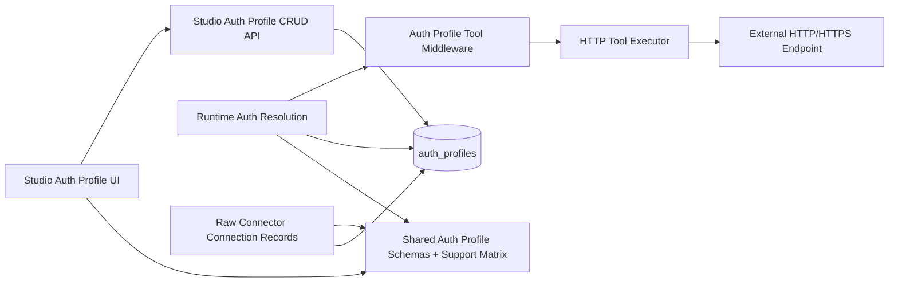
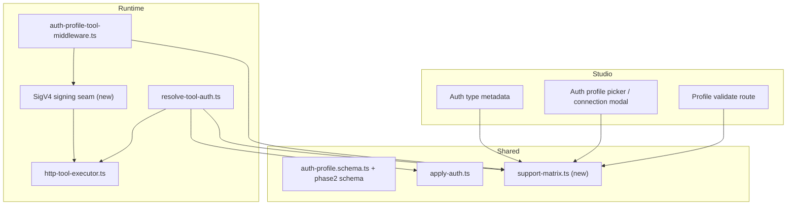
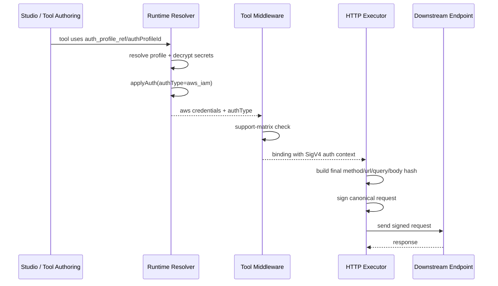

# HLD: Auth Profile Phase 2 Core Auth Types

**Feature Spec**: `docs/features/sub-features/auth-profile-phase2-core-auth-types.md`
**Test Spec**: `docs/testing/sub-features/auth-profile-phase2-core-auth-types.md`
**Status**: APPROVED
**Author**: Codex
**Date**: 2026-04-23

---

## 1. Problem Statement

Auth Profiles Phase 2 was originally framed as a broad enterprise-auth expansion, but the current repository state is uneven. Backend validation and persistence already exist for `basic`, `custom_header`, `aws_iam`, and `mtls`, while Studio still exposes only a Phase 1-oriented selector. Runtime honoring is also asymmetric: `basic` and `custom_header` already materialize into headers, `mtls` is honored on the HTTP tool transport path, and `aws_iam` currently stops at typed credential shaping without a final SigV4 signing seam.

That mismatch creates three concrete risks:

- operators can author or attach profiles without a trustworthy signal of where they are actually honored
- `aws_iam` can look supported while still lacking canonical request signing
- `mtls` can be attached to a record that stores `authProfileId` even when the downstream consumer never applies TLS options

This HLD defines a conservative Phase 2 core slice for the four scoped auth types and makes support a function of a shared consumer-capability contract, not a function of storage alone.

### Terminology

| Term           | Meaning                                                                                          |
| -------------- | ------------------------------------------------------------------------------------------------ |
| Auth profile   | The persisted encrypted credential bundle in `auth_profiles`                                     |
| Consumer       | A runtime or design-time surface that references an auth profile                                 |
| Attachable     | A consumer can store `authProfileId` or `auth_profile_ref`                                       |
| Honored        | The consumer has the execution path needed to actually apply the auth semantics                  |
| Support matrix | The authoritative mapping of auth type x consumer kind -> supported, attach-only, or unsupported |
| Execution seam | The point in execution where the full request shape exists and auth can be applied safely        |

### Threat Model Summary

- Protected assets: usernames/passwords, custom header secrets, AWS access keys, client certificates, private keys
- Abuse paths: cross-tenant/profile access, silent unauthenticated downgrade, secret leakage in errors, raw connections being misread as full support
- Primary mitigations: tenant/project/user scoping, encrypted secrets, redaction, sanitized runtime failures, and fail-closed capability checks before dispatch

---

## 2. Alternatives Considered

### Option A: Studio Exposure Only

- **Description**: Add the four auth types to Studio metadata and selector surfaces, but keep runtime behavior mostly unchanged.
- **Pros**: Lowest short-term effort, no new runtime seam.
- **Cons**: Does not solve the core correctness problem for `aws_iam`; still leaves `mtls` and raw connections ambiguous; increases operator trust risk.
- **Effort**: S

### Option B: Additive Capability Matrix + Executor-Aware Honoring

- **Description**: Keep the existing auth-profile persistence model, add a shared support matrix used by Studio and Runtime, preserve current header and mTLS behavior, and introduce a final-request signing seam for `aws_iam` on the HTTP tool path.
- **Pros**: Aligns design-time and runtime truth, fails closed for unsupported combinations, avoids schema churn, and keeps the implementation scoped to the existing auth-profile stack.
- **Cons**: Requires cross-package wiring between Studio, shared auth logic, runtime middleware, and the HTTP executor.
- **Effort**: M

### Option C: Separate Enterprise Auth Subsystem

- **Description**: Build a new subsystem for enterprise auth types with separate models, routes, and consumer integrations.
- **Pros**: Clean conceptual separation.
- **Cons**: Duplicates storage, redaction, isolation, and lifecycle logic already implemented in Auth Profiles; creates migration and support debt; too large for this scoped Phase 2 slice.
- **Effort**: L

### Recommendation: Option B

**Rationale**: The repository already has the right storage, validation, and most of the resolution plumbing. The missing piece is not a new auth system; it is a trustworthy contract for where each auth type is honored and the final execution seam required for `aws_iam`. Option B fixes the mismatch without reopening persistence, encryption, or migration architecture.

---

## 3. Architecture

### System Context Diagram

### Component Diagram

### Data Flow

#### A. Studio Authoring

1. Studio loads auth-type metadata and the shared support matrix.
2. The create/edit flow exposes exactly `basic`, `custom_header`, `aws_iam`, and `mtls` for this feature slice.
3. Field contracts continue to come from the shared validation schemas.
4. Studio displays consumer-support messaging from the shared matrix so operators can distinguish attachable from honored.

#### B. `basic` and `custom_header` Execution

1. Runtime resolves the auth profile by name or ID under tenant/project/user scope.
2. `applyAuth()` materializes headers.
3. Auth middleware patches those headers into the HTTP binding.
4. The HTTP executor dispatches the request normally.

#### C. `mtls` Execution

1. Runtime resolves the profile and `applyAuth()` produces `tlsOptions`.
2. Capability checks confirm the consumer is the HTTP tool path and the destination is HTTPS.
3. Auth middleware patches `tls_options` onto the HTTP binding.
4. The HTTP executor builds a TLS-capable dispatcher/agent and sends the request.
5. Unsupported paths fail before dispatch with a sanitized auth/configuration error.

#### D. `aws_iam` Execution

1. Runtime resolves the profile and `applyAuth()` produces typed AWS credentials.
2. The shared support matrix confirms the consumer has a final-request signing seam.
3. The HTTP executor computes the final method, URL, query string, headers, and body hash.
4. A dedicated SigV4 signer signs the canonical request.
5. The signed request is dispatched.
6. If the request shape cannot be canonicalized or no signing seam exists, execution fails closed before the outbound request is sent.

### Sequence Diagram: `aws_iam` on the HTTP Tool Path

### Architecture Decisions

- Keep `auth_profiles` as the only persisted credential store.
- Add a shared support-matrix module that both Studio and Runtime import.
- Keep `applyAuth()` as the type-specific credential shaper, not the final signer.
- Perform `aws_iam` signing at the HTTP executor boundary, where the final request exists.
- Treat raw connector connections as binding records only; attachment does not imply support for `aws_iam` or `mtls`.

---

## 4. The 12 Architectural Concerns

### Structural Concerns

| #   | Concern                 | Design Decision                                                                                                                                                                                                                                             |
| --- | ----------------------- | ----------------------------------------------------------------------------------------------------------------------------------------------------------------------------------------------------------------------------------------------------------- |
| 1   | **Tenant Isolation**    | Reuse existing auth-profile and connection isolation rules: all queries stay scoped by `tenantId`, project surfaces include `projectId`, and personal-profile access remains filtered by `createdBy`/`ownerId`; unsupported cross-scope access stays `404`. |
| 2   | **Data Access Pattern** | No new persistence layer. Continue using `auth_profiles` plus existing connection records. Add only shared in-memory capability metadata and runtime signing/TLS application seams.                                                                         |
| 3   | **API Contract**        | Keep existing CRUD routes. Extend Studio/UI and validation surfaces to reflect the support matrix. Continue using the platform error envelope on API routes and structured `TOOL_AUTH_FAILED` runtime failures on execution surfaces.                       |
| 4   | **Security Surface**    | Preserve encrypted secrets, redaction, SSRF validation, and sanitized user-facing errors. Add fail-closed consumer-capability checks so unsupported `aws_iam` and `mtls` paths do not silently downgrade.                                                   |

### Behavioral Concerns

| #   | Concern           | Design Decision                                                                                                                                                                                                                                                                    |
| --- | ----------------- | ---------------------------------------------------------------------------------------------------------------------------------------------------------------------------------------------------------------------------------------------------------------------------------- |
| 5   | **Error Model**   | Schema/config mismatch remains `400` on create/update/validate flows. Unsupported consumer combinations return structured validation or execution errors with stable codes and sanitized messages.                                                                                 |
| 6   | **Failure Modes** | `aws_iam` failure modes: missing service/region, no final signing seam, canonicalization failure, signer library failure. `mtls` failure modes: plain HTTP, invalid cert/key bundle, unsupported transport. All fail before an unsigned or non-mTLS request is intentionally sent. |
| 7   | **Idempotency**   | CRUD semantics stay unchanged. Runtime auth application is request-scoped and retry-safe for `basic`, `custom_header`, and `mtls`. `aws_iam` signing is deterministic for a given canonical request and timestamp source.                                                          |
| 8   | **Observability** | Reuse existing auth-profile/runtime logging and trace surfaces. Add explicit reason codes for unsupported combinations so operators can distinguish validation gaps, capability gaps, and downstream transport/signing failures.                                                   |

### Operational Concerns

| #   | Concern                | Design Decision                                                                                                                                                                                                                               |
| --- | ---------------------- | --------------------------------------------------------------------------------------------------------------------------------------------------------------------------------------------------------------------------------------------- |
| 9   | **Performance Budget** | Header materialization must remain negligible. `mtls` should keep current executor behavior. `aws_iam` signing adds a small per-request cost but must stay within the HTTP tool execution budget and avoid extra network hops.                |
| 10  | **Migration Path**     | No collection migration or backfill. Rollout is additive: support matrix, Studio exposure, executor signing seam, then consumer messaging. Existing profiles remain valid and encrypted.                                                      |
| 11  | **Rollback Plan**      | Roll back in layers: hide types in Studio, disable the executor signer path, and keep current persistence intact. Since no schema migration is required, rollback is code-level only.                                                         |
| 12  | **Test Strategy**      | Keep unit coverage for schema/materialization, extend integration coverage for Studio metadata and runtime capability checks, add real HTTP tool integration/E2E for `aws_iam`, and keep black-box E2E validation for `mtls` and header auth. |

---

## 5. Data Model

### New Collections / Tables

None.

### Modified Collections / Tables

None required for persistence.

### Modified In-Memory / Contract Models

The main design changes are contract-level, not collection-level:

- a new shared support-matrix contract describing which consumer kinds honor which auth types
- Studio metadata updates for the four scoped types
- an executor-visible auth context for `aws_iam` signing
- stronger runtime validation for `mtls` consumer and transport compatibility

### Key Relationships

| Relationship                                 | Design Notes                                                                      |
| -------------------------------------------- | --------------------------------------------------------------------------------- |
| `auth_profiles` -> HTTP tool execution       | Supported honoring path for all four Phase 2 core auth types                      |
| `auth_profiles` -> raw connector connection  | Binding-only relationship; not proof of support for `aws_iam` or `mtls`           |
| `applyAuth()` -> runtime middleware/executor | Shared credential shaping boundary                                                |
| support matrix -> Studio + Runtime           | Single source of truth for authoring guidance and fail-closed execution decisions |

---

## 6. API Design

### New Endpoints

None required.

### Modified Endpoints / Surfaces

| Surface                                     | Change                                                                                                                            |
| ------------------------------------------- | --------------------------------------------------------------------------------------------------------------------------------- |
| Existing Studio auth-profile CRUD routes    | Continue to accept the four auth types through shared validation; no path changes required                                        |
| Existing Studio auth-profile validate route | May reuse the support matrix to report unsupported or incomplete execution compatibility without introducing a new validation API |
| Studio auth-profile create/edit UI          | Must expose the four auth types and render the matching config/secret fields                                                      |
| Auth profile picker / connection modal      | Must annotate or restrict unsupported consumer combinations so raw attachment is not misrepresented as support                    |
| Runtime HTTP tool path                      | Gains a final-request SigV4 signing seam and explicit capability checks                                                           |

### Error Responses

| Scenario                                           | Surface                                  | Response Shape                                                                              |
| -------------------------------------------------- | ---------------------------------------- | ------------------------------------------------------------------------------------------- |
| malformed config/secrets                           | Studio or Runtime create/update/validate | Existing API error envelope with `success: false` and validation code/message               |
| `custom_header` key drift                          | Studio or Runtime create/update/validate | `400` validation error; no partial persistence                                              |
| `mtls` on plain HTTP or unsupported consumer       | Runtime execution or preflight           | sanitized auth/configuration failure; no request intentionally sent as downgraded plaintext |
| `aws_iam` without signing seam or canonical inputs | Runtime execution or preflight           | sanitized unsupported-configuration / auth failure before outbound request                  |

---

## 7. Cross-Cutting Concerns

- **Audit Logging**: Reuse existing auth-profile CRUD auditing and runtime auth/error logging. Add reason codes for support-matrix rejections.
- **Rate Limiting**: No new rate limiter required. Existing auth-profile route limits remain sufficient.
- **Caching**: No new durable cache. The support matrix is static code, and signing is per-request.
- **Encryption**: No changes. Secrets remain encrypted at rest and redacted from responses.
- **Documentation Reachability**: The supported-consumer matrix must be visible in Studio authoring and picker flows, not only in docs.

---

## 8. Dependencies

### Upstream Dependencies

| Dependency                                                                      | Type     | Risk                                                                                              |
| ------------------------------------------------------------------------------- | -------- | ------------------------------------------------------------------------------------------------- |
| shared auth-profile schemas and `applyAuth()`                                   | internal | Low; already authoritative for the four auth types                                                |
| Studio auth-profile metadata and picker components                              | internal | Medium; current UI is Phase 1-oriented and must stop diverging from backend support               |
| runtime resolver and auth middleware                                            | internal | Medium; must carry typed auth context without breaking current OAuth/header flows                 |
| HTTP executor                                                                   | internal | High; this is the required execution seam for `aws_iam` and the current honoring point for `mtls` |
| existing AWS signer dependencies in workspace (`@aws-sdk/signature-v4`, `aws4`) | package  | Low to Medium; choose one implementation path and avoid duplicative signer logic                  |

### Downstream Consumers

| Consumer                                   | Impact                                                                       |
| ------------------------------------------ | ---------------------------------------------------------------------------- |
| Auth Profile create/edit flow              | must expose the four scoped types accurately                                 |
| Auth profile picker / raw connection modal | must differentiate attach-only from honored support                          |
| HTTP tool execution                        | becomes the authoritative supported runtime path for this slice              |
| Test suites                                | need new integration and E2E coverage for signer and support-matrix behavior |

---

## 9. Migration Path

No data migration is required.

### Rollout Shape

1. Add the shared support matrix and wire Studio messaging to it.
2. Expose `basic`, `custom_header`, `aws_iam`, and `mtls` in Studio metadata and selector flows.
3. Keep `basic`, `custom_header`, and existing `mtls` honoring behavior on the HTTP tool path.
4. Add the final-request SigV4 signing seam for `aws_iam`.
5. Enable fail-closed consumer checks on unsupported paths.

### Rollback Shape

1. Hide the four Phase 2 core types from Studio if operator exposure becomes unsafe.
2. Disable or revert the SigV4 signing seam while leaving stored profiles intact.
3. Retain conservative support-matrix messaging so unsupported raw attachments are never promoted as working support.

---

## 10. Post-Implementation Notes

- The shared support matrix landed in `packages/shared/src/validation/auth-profile-support-matrix.ts` and is now consumed by both Studio and Runtime, which closes the original design-time/runtime divergence this HLD was written to address.
- Studio exposes `basic`, `custom_header`, `aws_iam`, and `mtls` through the production authoring flow, while raw-connection picker flows keep `aws_iam` and `mtls` visible but explicitly attach-only.
- The supported honored runtime path for this slice is the HTTP tool execution path only. `resolve-tool-auth.ts` carries transient `sigv4_auth` / `tls_options`, and `http-tool-executor.ts` applies SigV4 and transport TLS at the final request boundary.
- Verification in this pass used affected-package builds plus targeted suites. Browser-level Playwright smoke coverage and the structured review pass remain follow-up items for BETA promotion.

---

## 11. Resolved Implementation Decisions

1. Studio hides `roleArn` and `externalId` for now; the shipped `aws_iam` authoring surface is limited to the fields exercised by the supported SigV4 path.
2. Raw connection pickers keep Phase 2 core auth types visible and use attach-only warnings instead of hiding them entirely.

---

## 12. References

- Feature spec: `docs/features/sub-features/auth-profile-phase2-core-auth-types.md`
- Test spec: `docs/testing/sub-features/auth-profile-phase2-core-auth-types.md`
- Parent HLD: `docs/specs/auth-profiles.hld.md`
- Parent implementation reference: `docs/plans/2026-03-11-auth-profile-phase2-implementation-plan.md`
- Phase 2 consolidation reference: `docs/plans/2026-03-11-auth-profile-phase2-consolidation.md`
