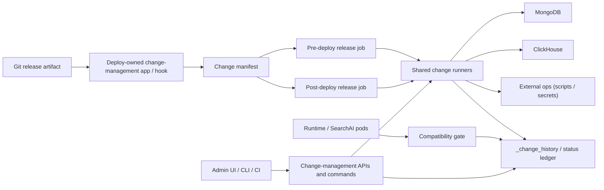
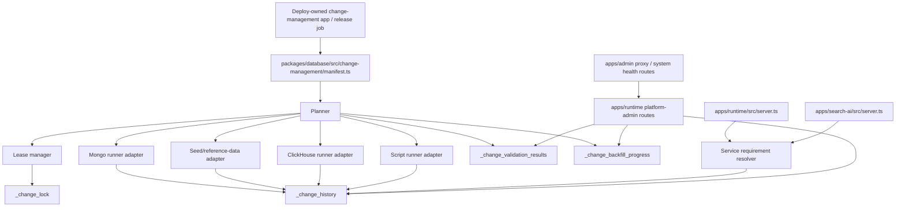
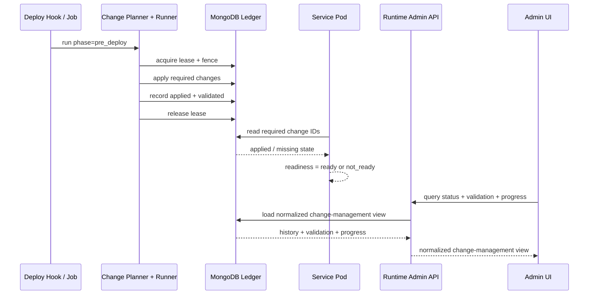

# HLD: Change Management

**Feature Spec**: `docs/features/change-management.md`
**Test Spec**: `docs/testing/change-management.md`
**Status**: APPROVED
**Author**: Codex
**Date**: 2026-04-15

---

## 1. Problem Statement

The platform has enough pieces to execute some migrations and tracked seed flows safely, but not enough architecture to operate them as an enterprise release control plane. MongoDB migrations already have a runner, history, and a lease lock. Seed/reference-data work now has history and validation. But neither path tells Runtime or SearchAI whether required changes are present before they start serving traffic, Admin still only proxies health information, neither path integrates orphaned ClickHouse or script-based changes, the lock model is not yet hardened for long-running clustered execution, and the rollout story is not yet tied to configuration-management evidence or named observability signals.

The current seed model is also intentionally split: the default deploy-time `seed-mongo.ts` path seeds platform-core and RBAC alignment only, while tenant operational defaults are targeted or lifecycle-triggered, and secrets/provider credentials remain separate vault-driven flows. Today there is no unified operator view that says "the platform core is ready, but tenant X still lacks bootstrap defaults" or "secrets completeness is still pending."

There is also no explicit deployment owner for shared-state rollout phases today. In a multi-application Argo or Helm topology, that ambiguity creates a second class of failure: multiple applications can each try to own the same `PreSync` mutation step or ship different manifest versions for the same environment.

The design problem is not "how do we add one more migration command?" It is "how do we make all release-coupled shared-state changes explicit, safe, observable, enforceable, and correlated with config promotion evidence across multi-pod rollouts and multiple environments?"

### Overview / Goal

This HLD defines the target control plane for release-coupled shared-state changes: one manifest contract, one rollout-owner model, one compatibility-gate model, one operator status surface, and one release-evidence story spanning Configuration Management, Health Checks, and Tracing & Observability, while still allowing engine-specific execution adapters underneath.

---

## 2. Alternatives Considered

### Option A: Keep Today’s Mechanisms and Harden Each One In Place

- **Description**: Add a few targeted improvements to the existing Mongo migration runner and seed runner, but keep separate ledgers, separate commands, and ad-hoc script handling.
- **Pros**:
  - Lowest immediate implementation effort.
  - Minimal disruption to the current repo structure.
  - Easy to land incrementally for Mongo-only work.
- **Cons**:
  - Does not solve registry fragmentation.
  - Leaves service compatibility and deployment gating as external convention.
  - Makes operator visibility and CI enforcement inconsistent across engines.
- **Effort**: M

### Option B: Force Every Change Type Into One Monolithic Runner and One Exact Storage Model

- **Description**: Replace current Mongo/seed/clickhouse/script flows with a single new runner that handles all change types identically from day one.
- **Pros**:
  - Conceptually simple end-state.
  - One API, one ledger, one lock abstraction.
- **Cons**:
  - High migration risk.
  - Large blast radius and harder rollback if the new runner is wrong.
  - Not all change kinds have identical semantics, especially secrets and bridges.
- **Effort**: L

### Option C: Shared Manifest + Shared Control Plane Contract + Per-Engine Runners

- **Description**: Introduce one manifest, one shared status contract, one lease model, one rollout-owner model, one execution-trigger model, and one service compatibility model, while adapting existing runners behind engine-specific adapters.
- **Pros**:
  - Preserves working Mongo/seed foundations.
  - Solves fragmentation without a flag-day rewrite.
  - Lets services, admin APIs, CI, and release jobs reason over one contract.
  - Supports gradual migration of orphaned SQL and ad-hoc scripts.
- **Cons**:
  - Requires adapter code and transitional dual-support.
  - Slightly more conceptual complexity than a single monolithic runner.
- **Effort**: M/L

### Recommendation: Option C

**Rationale**: Option C gives the repo a single operational story without forcing a dangerous one-shot rewrite. It lets us keep the working parts of `packages/database/src/migrations/` and `packages/database/src/seed/`, while converging them into a manifest-driven control plane that services and release automation can trust. It also gives the deploy repo a clean way to nominate one rollout-owned artifact per environment rather than letting every application invent its own hook behavior.

**Deployment preference**: The preferred execution path is an ArgoCD `PreSync` or `PostSync` hook owned by one dedicated change-management deployment artifact per environment, launching a dedicated Kubernetes Job for cluster-wide shared-state changes. Init containers are explicitly not the preferred mechanism for migrations or global seed/reference-data work because they run once per pod rather than once per rollout.

---

## 3. Architecture

### System Context Diagram



### Component Diagram



### Data Flow

#### Deploy Path

1. CI validates the manifest, dependency graph, checksums, and change policies, then joins the release plan with configuration-management diff or snapshot evidence for the target environment.
2. The deploy system starts the single change-owner release job using the same image/tag as the application rollout, ideally through an ArgoCD `PreSync` hook or equivalent release hook.
3. The planner filters manifest entries by environment and `phase=pre_deploy`, resolves dependencies, and acquires the shared lease.
4. Engine adapters apply changes and write normalized results to `_change_history`, including release metadata plus references to config snapshot/diff and lower-environment validation evidence where applicable.
5. The planner and runners emit TraceStore events plus OpenTelemetry-friendly metrics keyed by `environment`, `releaseId`, and `changeId`.
6. Runtime and SearchAI pods start and query `_change_history` through local compatibility gates.
7. Runtime and SearchAI remain non-ready until their required change IDs are satisfied, while health/system-health surfaces expose the same blocker state.
8. After rollout, post-deploy jobs run cleanup, non-blocking validation, resumable backfills, and any required re-validation or alerting checks.

The default deploy-time seed path only guarantees global platform-core readiness. It does not imply that tenant-scoped bootstrap defaults, secrets, or vault-backed provider credentials are complete for all tenants.

Admin remains proxy-first in phase 1: its local `/api/health` stays a pod-health probe, while `/api/system-health` and future change-management proxy routes surface Runtime's compatibility blocker state.

Init containers are reserved for pod-local, read-only preparation only. They are not used for shared-state mutation in this design.

#### Tenant Lifecycle Path

1. Workspace creation, dev login, or platform-admin tenant-creation flows invoke tenant bootstrap defaults and tenant pipeline configuration.
2. These runs are classified as tenant-scoped change entries and recorded separately from deploy-time platform-core seeding.
3. Operator status surfaces must distinguish `trigger=deploy` from `trigger=tenant_lifecycle` so a healthy global rollout does not incorrectly imply every tenant is fully bootstrapped.

#### Operator Path

1. Admin UI or CLI requests change status.
2. Runtime admin routes load manifest entries and join them with history, validation, backfill progress, and release/config evidence references.
3. The response surfaces missing, applied, failed, stale-validation, checksum-drift, tenant-bootstrap completeness, and alert-friendly observability summary state in one payload.

#### Operational Experience by Change Kind

| Kind            | Primary owner / trigger                    | Execution path                                                        | Compatibility effect                                                          | Primary operator surface                                                   |
| --------------- | ------------------------------------------ | --------------------------------------------------------------------- | ----------------------------------------------------------------------------- | -------------------------------------------------------------------------- |
| `schema`        | Release owner, `trigger=deploy`            | `PreSync` or equivalent release job under shared lease                | Can block deploy and service readiness if declared required                   | Unified status plus readiness/system-health blocker detail                 |
| `backfill`      | Release owner or manual operator           | Resumable worker with checkpoints and optional tenant targeting       | Usually does not block current rollout, but future changes can depend on it   | Backfill progress, pause/resume, tenant canary, and stalled-job indicators |
| `seed_platform` | Release owner, usually `trigger=deploy`    | Deploy-time platform-core seed or continuous diff-based sync          | Can block if new code depends on global reference data                        | Global platform-core alignment and drift status                            |
| `seed_tenant`   | Tenant-lifecycle caller or manual operator | Workspace/admin bootstrap path writes tenant-scoped change records    | Does not block global rollout by default                                      | Tenant completeness views separate from deploy readiness                   |
| `seed_dev`      | Developer or lower-environment workflow    | Dev-only targeted execution                                           | Never a prod gate                                                             | Lower-environment only status                                              |
| `secret`        | Release owner or secret-ops workflow       | External secret system plus metadata-only status reporting            | Blocks only when environment policy requires secret evidence                  | Secret completeness and missing-reference status without value disclosure  |
| `bridge`        | Release owner plus service code            | Tracked compatibility window alongside code rollout and later cleanup | Usually warn-only during overlap; can become blocking before contract removal | Bridge active/retired state and removal blockers                           |

#### Concern Handling Model

- **Deployment ownership**: one rollout-owned job mutates shared state for the environment; app pods do not compete to run the same change.
- **Readiness**: Runtime and SearchAI read compatibility state locally and stay non-ready until required changes exist; Admin surfaces the same state through proxy/system-health flows.
- **Validation and drift**: apply-time validation and later re-validation both write durable evidence so operators can distinguish "ran once" from "still valid."
- **Configuration-management alignment**: release records carry config snapshot, diff, and promotion evidence refs so config readiness and change readiness tell the same release story.
- **Observability**: TraceStore events, metrics, health summaries, and alert rules all key on the same release, environment, and change identifiers.
- **Rollback and compensation**: the control plane decides whether a change is retryable, compensating, or forward-only before operators are asked to act.

### Sequence Diagram



---

## 4. The 12 Architectural Concerns

### Structural Concerns

| #   | Concern                 | Design Decision                                                                                                                                                                                                                                                                                                |
| --- | ----------------------- | -------------------------------------------------------------------------------------------------------------------------------------------------------------------------------------------------------------------------------------------------------------------------------------------------------------- |
| 1   | **Tenant Isolation**    | Tenant-targeted backfills and seed-tenant changes carry explicit tenant scope and must persist tenant-scoped progress records; tenant lifecycle bootstrap must never be conflated with global platform readiness.                                                                                              |
| 2   | **Data Access Pattern** | Shared manifest and adapters live in `packages/database`; Runtime and SearchAI read compatibility state through a narrow resolver, while Admin reads it via Runtime proxy routes. Configuration Management remains canonical for config values and diffs; change-management stores only release evidence refs. |
| 3   | **API Contract**        | Runtime exposes normalized platform-admin status/control APIs; Runtime and SearchAI readiness surfaces expose blocker reasons; Admin proxies blocker state rather than becoming a second direct DB gate in phase 1.                                                                                            |
| 4   | **Security Surface**    | Platform-admin auth is required for manual execution or status detail; secret values never enter the ledger or admin payloads.                                                                                                                                                                                 |

### Behavioral Concerns

| #   | Concern           | Design Decision                                                                                                                                                                                                          |
| --- | ----------------- | ------------------------------------------------------------------------------------------------------------------------------------------------------------------------------------------------------------------------ |
| 5   | **Error Model**   | Change application is fail-fast for deploy-blocking work, resumable for backfills, and explicitly warn-only for non-blocking entries.                                                                                    |
| 6   | **Failure Modes** | Lease heartbeat loss, stale runners, missing required changes, checksum drift, and stalled backfills are first-class failure states.                                                                                     |
| 7   | **Idempotency**   | Manifest kind drives policy: schema and continuous seed entries must be re-runnable; destructive or forward-only entries must declare compensation policy.                                                               |
| 8   | **Observability** | Status, validation age, checksum drift, backfill progress, blocker counts, and heartbeat age are visible through admin, CLI, and health surfaces with TraceStore events, metric emission, and alert-friendly dimensions. |

### Operational Concerns

| #   | Concern                | Design Decision                                                                                                                                                      |
| --- | ---------------------- | -------------------------------------------------------------------------------------------------------------------------------------------------------------------- |
| 9   | **Performance Budget** | Pods only read compatibility state; long-running writes are offloaded to release jobs or background backfill workers.                                                |
| 10  | **Migration Path**     | Existing Mongo and seed runners are wrapped as adapters first, then orphaned scripts, app-local migration flows, and tenant lifecycle bootstrap paths are folded in. |
| 11  | **Rollback Plan**      | Rollback is best-effort for schema and script entries, compensation-based for data changes, and explicit approval for destructive operations.                        |
| 12  | **Test Strategy**      | Manifest logic, lease behavior, and compatibility gates get unit tests; adapters and readiness get integration/E2E coverage.                                         |

---

## 5. Data Model

### New Collections/Tables

```text
Collection: _change_history
Purpose:
  Normalized shared ledger for change execution and validation metadata, including rollout-owner, artifact provenance, and distinction between deploy-time platform readiness and tenant lifecycle bootstrap.
Indexes:
  - { status: 1, phase: 1, environment: 1 }
  - { engine: 1, kind: 1, environment: 1 }
  - { lastValidatedAt: 1 }
```

```text
Collection: _change_lock
Purpose:
  Shared lease and fence state for clustered correctness.
Indexes:
  - { expiresAt: 1 }
```

```text
Collection: _change_validation_results
Purpose:
  Append-only record of manual or scheduled re-validation.
Indexes:
  - { changeId: 1, validatedAt: -1 }
```

```text
Collection: _change_backfill_progress
Purpose:
  Resumable checkpoint and progress ledger for long-running backfills.
Indexes:
  - { status: 1, environment: 1 }
  - { tenantId: 1, changeId: 1 }
```

### Modified Collections/Tables

- `_migration_history` and `_seed_history` are transitional sources. During migration to the new control plane, they can either be folded into `_change_history` or read through compatibility adapters.
- Existing engine-specific ledgers may remain temporarily while the status API normalizes them.

### Key Relationships

- The manifest defines intended change entries.
- `_change_history` stores actual execution outcomes.
- Service compatibility gates read `_change_history`.
- `_change_backfill_progress` and `_change_validation_results` enrich the operator status view.
- External systems such as AWS Secrets Manager remain the source of truth for secret values; only metadata is mirrored.

---

## 6. API Design

### New Endpoints

| Method | Path                                                     | Purpose                                                                             | Auth           |
| ------ | -------------------------------------------------------- | ----------------------------------------------------------------------------------- | -------------- |
| GET    | `/api/platform/admin/change-management/status`           | List manifest-aware status for all change entries, filterable by scope and trigger. | Platform admin |
| GET    | `/api/platform/admin/change-management/backfills`        | Show active and recent backfill progress.                                           | Platform admin |
| GET    | `/api/platform/admin/change-management/validation`       | Show recent validation results and stale validation.                                | Platform admin |
| POST   | `/api/platform/admin/change-management/run`              | Trigger allowed manual execution.                                                   | Platform admin |
| POST   | `/api/platform/admin/change-management/validate`         | Trigger manual validation.                                                          | Platform admin |
| POST   | `/api/platform/admin/change-management/backfills/pause`  | Pause an active backfill.                                                           | Platform admin |
| POST   | `/api/platform/admin/change-management/backfills/resume` | Resume a paused backfill.                                                           | Platform admin |
| GET    | `/api/change-management/status`                          | Admin proxy for Runtime status, preserving scope and auth filtering.                | Admin viewer+  |
| GET    | `/api/change-management/backfills`                       | Admin proxy for Runtime backfill status.                                            | Admin viewer+  |
| GET    | `/api/change-management/validation`                      | Admin proxy for Runtime validation state.                                           | Admin viewer+  |
| POST   | `/api/change-management/run`                             | Admin proxy for allowed manual execution.                                           | Admin operator |
| POST   | `/api/change-management/validate`                        | Admin proxy for manual validation actions.                                          | Admin operator |
| POST   | `/api/change-management/backfills/pause`                 | Admin proxy for backfill pause control.                                             | Admin operator |
| POST   | `/api/change-management/backfills/resume`                | Admin proxy for backfill resume control.                                            | Admin operator |

### Modified Endpoints

| Endpoint             | Change                                                                                                |
| -------------------- | ----------------------------------------------------------------------------------------------------- |
| `/health/ready`      | Include compatibility blocker state in Runtime and SearchAI readiness logic.                          |
| `/api/health`        | Keep Admin local pod health separate from shared-state compatibility in phase 1.                      |
| `/api/system-health` | Surface Runtime change-management blocker summaries through the existing admin health view and proxy. |

### Error Responses

- `503 not_ready` for missing required change IDs or failed compatibility checks on readiness surfaces.
- `409 conflict` for lock contention or stale-fence execution attempts.
- `400 bad_request` for invalid manifest references, illegal phase/kind combinations, or unsupported manual actions.
- `423 locked` is an acceptable alternative for active exclusive execution if the team prefers lock semantics over generic conflict.

---

## 7. Cross-Cutting Concerns

- **Audit Logging**: Manual operator actions, approvals, and destructive-operation overrides should emit audit events with change IDs, environment, and actor identity.
- **Rate Limiting**: Admin status endpoints can reuse existing platform-admin limits; manual run/validate endpoints should be tightly rate-limited.
- **Caching**: Manifest loading can be cached in-process; status joins against history should remain fresh and uncached or very short-lived.
- **Configuration Management**: Validated config snapshots, diffs, and promotion evidence remain owned by Configuration Management. Change Management stores only references to that evidence in release/status records and must not duplicate raw config state.
- **Platform Validation**: Release promotion requires more than a successful migration run. The target contract is config dry-run or diff validation, change lint/plan validation, rollout execution, readiness compatibility, and post-apply re-validation.
- **TraceStore / Tracing**: Release jobs, manual operator actions, validation runs, and backfill lifecycle transitions should emit `TraceEvent`s via the shared `TraceStore` so rollout state is visible in the same trace tooling as other platform operations.
- **Health / Metrics / Alerts**: Change-management must publish blocker, validation-age, heartbeat-age, and backfill-stall signals into the existing health/system-health and observability stacks so operators can alert on the same dimensions they inspect manually.
- **Encryption**: Secret value material remains outside the ledger. Any compensation snapshots with sensitive content require encryption at rest.

---

## 8. Dependencies

### Upstream (this feature depends on)

| Dependency                                      | Type                                               | Risk   |
| ----------------------------------------------- | -------------------------------------------------- | ------ |
| `packages/database/src/migrations/*`            | Existing implementation foundation                 | Low    |
| `packages/database/src/seed/*`                  | Existing implementation foundation                 | Low    |
| `packages/config/src/loader.ts`                 | Config validation integration point                | Medium |
| `packages/config/src/validation/config-diff.ts` | Config diff / promotion evidence integration point | Medium |
| `packages/config/src/watcher.ts`                | Runtime config propagation boundary                | Medium |
| `apps/runtime/src/server.ts` health model       | Service integration point                          | Medium |
| `apps/search-ai/src/server.ts` health model     | Service integration point                          | Medium |
| `apps/admin/src/app/api/health/route.ts`        | Service integration point                          | Medium |
| Platform release hooks / deploy repo wiring     | External deployment integration                    | High   |

### Downstream (depends on this feature)

| Consumer                 | Impact                                                                       |
| ------------------------ | ---------------------------------------------------------------------------- |
| Runtime                  | Must declare required change IDs and honor compatibility readiness.          |
| SearchAI                 | Must declare required change IDs and honor compatibility readiness.          |
| Admin                    | Must surface blockers and operator controls through existing proxy patterns. |
| SRE / release automation | Gains a single pre/post-deploy orchestration model.                          |

---

## 9. Open Questions & Decisions Needed

1. Should `_change_history` be the long-term single ledger, or should engine-specific ledgers remain canonical with a federated query layer?
2. Should the rollout owner live as a dedicated Argo application long-term, or eventually move into a separate platform control-plane service?
3. Should the first backfill implementation remain strictly sequential, or allow limited tenant-partition parallelism once fencing is proven?
4. Which destructive operations, if any, are allowed in automated release jobs versus manual approval only?
5. Which configuration-management evidence refs should be required in `_change_history` for promoted releases: snapshot IDs, diff IDs, lower-environment promotion records, or some combination?

---

## 10. References

- Feature spec: `docs/features/change-management.md`
- Test spec: `docs/testing/change-management.md`
- Related designs: `docs/features/database-migrations.md`, `docs/features/seed-data.md`
- Related features: `docs/features/configuration-management.md`, `docs/features/health-checks.md`, `docs/features/tracing-observability.md`
- Current runtime health/readiness: `apps/runtime/src/server.ts`
- Current SearchAI health/readiness: `apps/search-ai/src/server.ts`
- Current admin health API: `apps/admin/src/app/api/health/route.ts`
