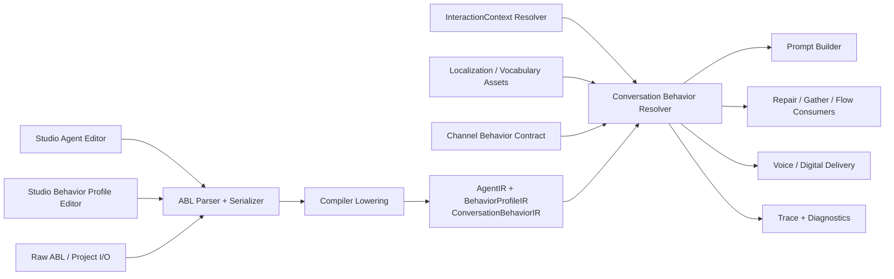
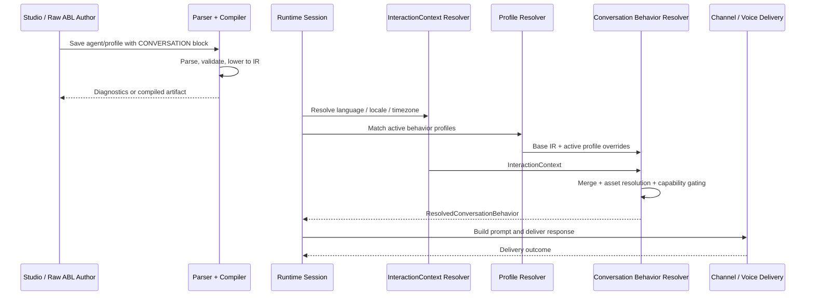

# HLD: Conversation Behavior

**Feature Spec**: [docs/features/sub-features/conversation-behavior.md](../features/sub-features/conversation-behavior.md)
**Test Spec**: [docs/testing/sub-features/conversation-behavior.md](../testing/sub-features/conversation-behavior.md)
**Status**: DRAFT
**Author**: Codex
**Date**: 2026-04-21

---

## 1. Problem Statement

Conversation Behavior gives the platform a single authoring model for conversational style and cooperative turn behavior. The feature must solve a real platform split:

- identity already owns persona and character
- voice config already owns acoustic rendering
- behavior profiles already own conditional overrides
- `InteractionContext` already owns language, locale, and timezone resolution
- project assets already own locale-specific content
- channel behavior contracts already own transport capability limits

The architecture therefore cannot treat Conversation Behavior as a greenfield subsystem with its own truth. It has to act as an ABL-native authoring layer that organizes `speaking`, `listening`, and `interaction`, then lowers that model into the platform seams above.

The design goal is clarity without duplication:

- authors get one stable mental model for conversation design
- runtime still resolves one explainable behavior view per turn
- existing owners keep ownership of persona, localization, acoustic voice, and channel transport

---

## 2. Alternatives Considered

### Option A: Standalone Conversation Sidecar Document

- **Description**: Store Conversation Behavior in a separate persisted document or file next to ABL.
- **Pros**: Preserves a clean conceptual model with minimal parser changes.
- **Cons**: Creates a second source of truth, complicates import/export, duplicates behavior-profile semantics, and increases merge ambiguity with identity, voice, and localization.
- **Effort**: M

### Option B: Keep Using Only Existing Flat Fields

- **Description**: Do not add a new grouping model. Continue expressing all conversational behavior through existing flat fields, voice settings, behavior profiles, and ad hoc instructions.
- **Pros**: Lowest schema change and minimal runtime disruption.
- **Cons**: Preserves the current discoverability problem, leaves Studio fragmented, and keeps ownership boundaries implicit.
- **Effort**: S

### Option C: ABL-Native `CONVERSATION:` Authoring Block Lowered into Canonical Seams (Recommended)

- **Description**: Add a `CONVERSATION:` block with `SPEAKING`, `LISTENING`, and `INTERACTION` groups at agent and behavior-profile scope, then compile it into canonical IR and runtime resolution paths.
- **Pros**: Preserves ABL as the only authoring language, reuses behavior-profile activation, keeps runtime resolution explainable, and fits existing parser/compiler/runtime/Studio seams.
- **Cons**: Requires coordinated changes across parser, compiler, runtime, Studio, and project I/O.
- **Effort**: M

### Recommendation: Option C

Option C is the right architecture because it keeps the user-facing model simple without fragmenting the platform's ownership boundaries. It also matches the repository's current strengths:

- behavior profiles already solve conditional adaptation
- runtime already resolves canonical interaction context
- channel behavior contracts already represent capability differences
- project assets already provide the right ownership surface for locale-specific content

---

## 3. Architecture

### System Context Diagram



### Component Diagram

```text
Authoring layer
  - Agent editor
  - Behavior profile editor
  - Raw ABL serializer
  - Project import/export

Compiler layer
  - Parser -> ConversationBehaviorAST
  - Ownership validation
  - ConversationBehaviorIR lowering
  - Preview diagnostics

Runtime resolution layer
  - InteractionContext input
  - Active behavior profile resolution
  - Conversation Behavior merge
  - Channel capability gating
  - ResolvedConversationBehavior diagnostics

Runtime consumers
  - Prompt builder
  - Repair / clarification / gather
  - Voice and digital response delivery
  - Trace and debug surfaces
```

### Data Flow

1. An author defines base Conversation Behavior on an agent and optional overrides on behavior profiles.
2. The parser reads `CONVERSATION:` blocks and produces AST structures for `speaking`, `listening`, and `interaction`.
3. Compiler lowering validates ownership boundaries and emits `ConversationBehaviorIR` on agent and profile IR.
4. Project I/O records any asset references needed for phrase or pronunciation material.
5. At runtime, the platform resolves canonical `InteractionContext` for the turn.
6. Runtime matches active behavior profiles using existing profile-resolution logic.
7. The Conversation Behavior resolver merges base behavior, active profile overrides, and interaction-context-aware values.
8. The resolver capability-gates voice-only or transport-sensitive policies against the current channel family.
9. Prompt building, repair logic, and output delivery consume the resolved result.
10. Trace/debug surfaces expose the source chain, asset refs, and capability drops.

### Resolution Order

The runtime merge order should be:

1. Platform safety/compliance and tool-specific action guardrails
2. Existing step- or response-local overrides that already have narrower scope
3. Active behavior-profile Conversation Behavior
4. Agent-scoped Conversation Behavior
5. Future project brand defaults when that feature exists
6. Channel/provider fallback defaults

`InteractionContext` is not a competing override layer. It is an execution input used by the resolver for language policy and locale-sensitive asset selection.

### Sequence Diagram



---

## 4. The 12 Architectural Concerns

### Structural Concerns

| #   | Concern                 | Design Decision                                                                                                                                                                                                          |
| --- | ----------------------- | ------------------------------------------------------------------------------------------------------------------------------------------------------------------------------------------------------------------------ |
| 1   | **Tenant Isolation**    | Conversation Behavior reuses existing tenant- and project-scoped authoring artifacts. Project asset references and behavior-profile authoring stay scoped by `tenantId` and `projectId`; cross-scope access remains 404. |
| 2   | **Data Access Pattern** | Design-time state is source-file and asset based. Runtime resolution is in-memory over compiled IR, canonical interaction context, and cached project asset catalogs. No new per-turn database fetch path is required.   |
| 3   | **API Contract**        | The canonical public contract is ABL authoring plus preview diagnostics. Existing Studio and runtime endpoints are extended rather than replaced.                                                                        |
| 4   | **Security Surface**    | Ownership validation, capability gating, and sanitized diagnostics are fail-closed. No authoring field can directly bypass platform-owned voice or transport controls.                                                   |

### Behavioral Concerns

| #   | Concern           | Design Decision                                                                                                                                                                                                                                                              |
| --- | ----------------- | ---------------------------------------------------------------------------------------------------------------------------------------------------------------------------------------------------------------------------------------------------------------------------- |
| 5   | **Error Model**   | Most failures are design-time: ownership conflicts, invalid asset references, unsupported channel-family overrides, or unsupported field combinations. Runtime non-fatal issues appear as explicit capability drops in trace/debug surfaces.                                 |
| 6   | **Failure Modes** | Missing project assets are hard preview/apply failures. Unsupported voice-only behavior on digital channels is a compile error when statically known, otherwise an explicit runtime capability drop. Missing optional future inputs, such as brand defaults, degrade safely. |
| 7   | **Idempotency**   | Parsing, lowering, and runtime resolution must be deterministic for the same authoring input, profile set, interaction context, and channel family.                                                                                                                          |
| 8   | **Observability** | Runtime emits resolved-behavior diagnostics including source chain, active profiles, asset refs, and capability drops. Existing profile traces remain part of the evidence chain.                                                                                            |

### Operational Concerns

| #   | Concern                | Design Decision                                                                                                                                                                                                      |
| --- | ---------------------- | -------------------------------------------------------------------------------------------------------------------------------------------------------------------------------------------------------------------- |
| 9   | **Performance Budget** | Resolution must remain in-memory and bounded. Prompt shaping should use compact compiled instructions and asset references to avoid large prompt inflation.                                                          |
| 10  | **Migration Path**     | The feature is additive. Existing agents and profiles can continue using current flat behavior and voice constructs until they adopt `CONVERSATION:` authoring.                                                      |
| 11  | **Rollback Plan**      | Rollback can disable `CONVERSATION:` parsing/lowering or runtime consumption while leaving existing persona, voice, and behavior-profile constructs intact. No new collection or irreversible migration is required. |
| 12  | **Test Strategy**      | Extend parser, compiler, runtime, Studio, and project-I/O suites. Cover authoring round-trip, interaction-context precedence, channel capability gating, asset references, and resolved-behavior diagnostics.        |

---

## 5. Data Model

### New / Modified Types

```typescript
interface ConversationBehaviorAST {
  speaking?: ConversationSpeakingAST;
  listening?: ConversationListeningAST;
  interaction?: ConversationInteractionAST;
}

interface ConversationBehaviorIR {
  speaking?: ConversationSpeakingIR;
  listening?: ConversationListeningIR;
  interaction?: ConversationInteractionIR;
}

interface ResolvedConversationBehavior {
  source_chain: string[];
  capability_drops: string[];
  asset_refs: string[];
  speaking: Record<string, unknown>;
  listening: Record<string, unknown>;
  interaction: Record<string, unknown>;
}
```

### Modified Existing Types

- `packages/core/src/types/agent-based.ts`
  - add agent-scoped Conversation Behavior AST
  - extend behavior-profile AST with optional `conversation`
- `packages/compiler/src/platform/ir/schema.ts`
  - add `conversation_behavior?: ConversationBehaviorIR` on `AgentIR`
  - add `conversation_behavior?: ConversationBehaviorIR` on `BehaviorProfileIR`
- `apps/runtime/src/services/execution/profile-resolver.ts`
  - extend effective runtime config with `ResolvedConversationBehavior`
- Studio stores / serializers
  - add parsed section state for structured editing and round-trip serialization

### Key Relationships

- `ConversationBehaviorIR` is compiled from ABL and stored on agent/profile IR
- `ResolvedConversationBehavior` is runtime-only and derived from base IR, active profiles, interaction context, asset catalogs, and channel capability contracts
- phrase and pronunciation asset refs remain project-owned, not globally shared across tenants
- acoustic voice config stays separate and is consumed alongside the resolved conversational behavior

---

## 6. API Design

### New Endpoints

No new public runtime endpoint is required in phase 1.

### Modified Endpoints

| Method   | Path                                | Purpose                                                                             | Auth                         |
| -------- | ----------------------------------- | ----------------------------------------------------------------------------------- | ---------------------------- |
| Existing | Studio project preview/apply routes | Validate and persist `CONVERSATION:` authoring                                      | existing project-scoped auth |
| Existing | `/api/projects/:id/localization...` | Manage phrase and pronunciation assets referenced by Conversation Behavior          | existing project-scoped auth |
| Existing | project export / bundle routes      | Preserve Conversation Behavior authoring and asset references in project round-trip | existing project-scoped auth |

### Error Responses

Preview and authoring diagnostics should use the platform's standard error envelope shape and sanitized messages:

```json
{
  "success": false,
  "error": {
    "code": "CONVERSATION_OWNERSHIP_CONFLICT",
    "message": "Conversation Behavior cannot redefine acoustic voice provider settings. Use VOICE: for provider and voice selection."
  }
}
```

Representative error codes:

- `CONVERSATION_OWNERSHIP_CONFLICT`
- `CONVERSATION_UNKNOWN_CHANNEL_FAMILY`
- `CONVERSATION_UNSUPPORTED_CHANNEL_POLICY`
- `CONVERSATION_ASSET_NOT_FOUND`
- `CONVERSATION_INVALID_FIELD_COMBINATION`

---

## 7. Cross-Cutting Concerns

- **Audit Logging**: authoring changes continue to flow through existing project audit surfaces; runtime uses trace events instead of ad hoc logs as the primary explanation path.
- **Rate Limiting**: no new rate-limit surface is required beyond existing authoring and runtime endpoints.
- **Caching**: project asset lookups should reuse existing project-catalog caching and avoid unbounded in-memory maps.
- **Encryption**: no new secret class is introduced. Existing encryption-at-rest and transport encryption rules for project assets and runtime traffic continue to apply.

---

## 8. Dependencies

### Upstream (this feature depends on)

| Dependency                                   | Type                       | Risk   |
| -------------------------------------------- | -------------------------- | ------ |
| ABL parser and AST                           | internal                   | Medium |
| Compiler IR schema and profile compiler      | internal                   | Medium |
| Canonical `InteractionContext` resolution    | internal                   | High   |
| Channel behavior contract                    | internal                   | Medium |
| Localization asset management                | internal                   | Medium |
| Studio raw ABL serializer and profile editor | internal                   | Medium |
| Future project brand voice system            | future internal dependency | Low    |

### Downstream (depends on this feature)

| Consumer                            | Impact                                                        |
| ----------------------------------- | ------------------------------------------------------------- |
| Prompt builder                      | Gains structured conversational behavior input                |
| Runtime repair / gather logic       | Gains explicit clarification, confirmation, and repair policy |
| Voice and digital delivery surfaces | Gain channel-aware conversation behavior resolution           |
| Studio diagnostics                  | Gains explicit ownership and capability explanations          |

---

## 9. Open Questions & Decisions Needed

1. Should pronunciation references reuse localization assets directly or wait for a dedicated vocabulary / lexicon asset type?
2. Should project-level brand defaults participate in phase-1 precedence, or remain a reserved extension point?
3. Which advanced fields should remain design-only until runtime capability support and evaluation coverage exist?

---

## 10. References

- Feature spec: [docs/features/sub-features/conversation-behavior.md](../features/sub-features/conversation-behavior.md)
- Test spec: [docs/testing/sub-features/conversation-behavior.md](../testing/sub-features/conversation-behavior.md)
- Related designs:
  - `docs/specs/localized-interaction-context.hld.md`
  - `docs/design/2026-04-18-localization-ownership-boundaries.md`
  - `docs/features/voice-capabilities.md`
