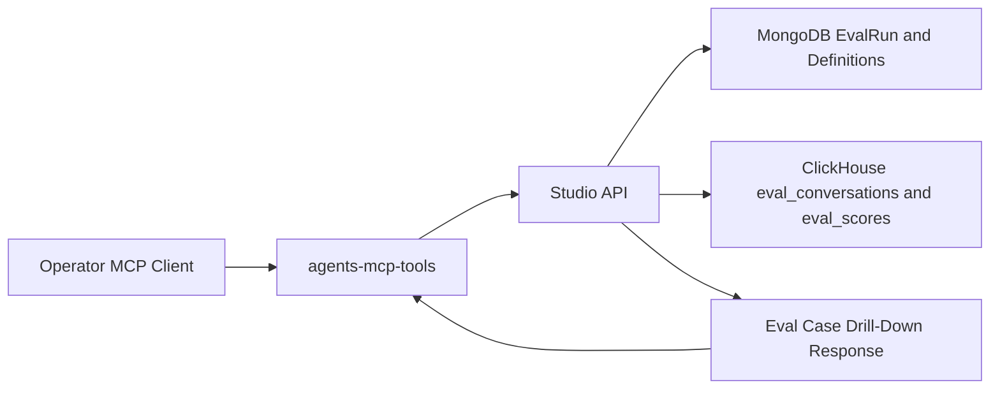
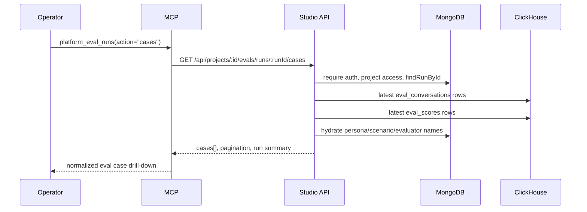
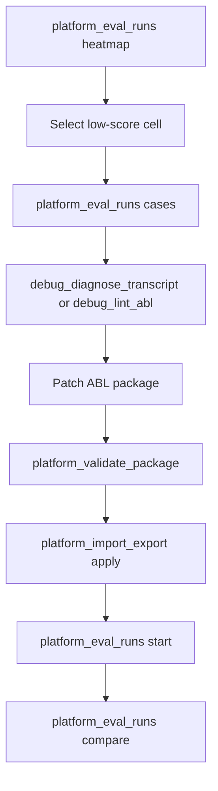

# HLD: Eval Run Case Drill-Down

**Feature Spec**: `docs/features/agent-testing-evals.md`
**Related Spec**: `docs/features/eval-retention.md`
**Status**: DRAFT
**Author**: Platform Team
**Date**: 2026-05-18

---

## 1. Problem Statement

Operators can generate eval personas, scenarios, evaluators, sets, run status, heatmap scores, package validation results, ABL lint results, and manual debug transcripts. The missing link is the stored eval-run diagnostic evidence behind a bad heatmap cell.

Today the heatmap endpoint works, but likely transcript routes such as `/evals/runs/:runId/results`, `/conversations`, and `/transcripts` return 404. That blocks the repair loop:

1. Find failing persona/scenario/evaluator cell.
2. Open the exact simulated conversation and judge rationale.
3. Correlate transcript, trace events, tool calls, ABL lint, and package model.
4. Patch the agent definition.
5. Re-run the eval and compare.

The design adds a Studio API endpoint and MCP action for eval-case drill-down without changing eval execution. It reuses the existing special transcript diagnosis contract behind `POST /api/abl/package/diagnose-transcript`; it does not use the regular runtime transcript feature (`/api/v1/transcripts`) or expose eval rows as saved session transcripts.

## 2. Scope Boundary

### In Scope

- Read stored eval conversations, tool calls, trace events, and evaluator score rows for a run.
- Filter drill-down by persona, scenario, evaluator, variant, score, and failure state.
- Return normalized eval cases with a `diagnosticTranscript` object that can feed `debug_diagnose_transcript` / `debug_why_transcript_failed`.
- Preserve current heatmap, status, compare, and run execution contracts.

### Out of Scope

- Changing how eval runs are executed.
- Replaying conversations from this endpoint.
- Adding new long-lived transcript storage.
- Replacing eval retention, archiving, or ClickHouse TTL policy.
- Building a Studio transcript viewer UI in the first API/MCP slice.
- Reusing the regular runtime saved transcript routes or saved transcript data model.

## 3. Redundancy Cleanup Principles

This feature should remove ambiguity rather than add another transcript surface:

- **One eval drill-down route**: use `/api/projects/:projectId/evals/runs/:runId/cases`. Do not add `/conversations`, `/results`, or `/transcripts` aliases.
- **One MCP action**: use `platform_eval_runs action: "cases"`. Do not add a second `diagnostic_transcripts` action; compact diagnostic output is controlled by `query.view = "diagnostic"`.
- **One diagnosis contract**: reuse the existing `diagnosticTranscript` JSON accepted by `POST /api/abl/package/diagnose-transcript`. Do not introduce a second transcript diagnosis schema.
- **No saved transcript reuse**: runtime `/api/v1/transcripts` remains a separate saved-session prototype and is not part of eval repair.
- **No duplicate storage**: read existing `eval_conversations` and `eval_scores`; do not materialize eval cases into a new transcript collection.

## 4. Alternatives Considered

### Option A: Extend Heatmap With Embedded Results

- **Description**: Add `includeResults=true` or `includeConversations=true` to the heatmap endpoint.
- **Pros**: One round trip from the heatmap UI or MCP client.
- **Cons**: Heatmaps are aggregate views. Embedding full conversations turns a fast summary endpoint into a heavy debug endpoint and complicates pagination.
- **Effort**: Small.

### Option B: New Eval Cases Drill-Down Endpoint

- **Description**: Add `GET /api/projects/:projectId/evals/runs/:runId/cases` with filters for persona, scenario, evaluator, variant, failure state, and payload detail.
- **Pros**: Keeps heatmap fast, supports pagination, maps naturally to MCP `platform_eval_runs action: "cases"`, and gives operators a stable repair contract.
- **Cons**: Requires a small ClickHouse reader and decompression layer.
- **Effort**: Medium.

### Option C: Runtime Debug Replay Only

- **Description**: Use `debug_send_message` transcripts and ignore stored eval conversations.
- **Pros**: No new API.
- **Cons**: Does not explain why an actual eval run failed. Persona simulation, judge score, trace timing, and run snapshot are lost.
- **Effort**: Small, but does not solve the problem.

### Recommendation: Option B

Add a separate eval cases drill-down endpoint and expose it through MCP. This matches the current data model: `eval_conversations` already stores conversation, trace events, tool calls, trajectory, errors, and cost; `eval_scores` already stores evaluator scores, evidence, reasoning, confidence, and trajectory score components. Each case includes a compact `diagnosticTranscript` shaped for the existing transcript diagnosis implementation, not a saved-session transcript.

## 5. Architecture

### System Context



### Data Flow

1. Operator calls `platform_eval_runs` with `action: "cases"`, `projectId`, `runId`, and optional filters.
2. MCP calls `GET /api/projects/:projectId/evals/runs/:runId/cases`.
3. Studio authenticates the user and verifies project access.
4. Studio verifies the run with `findRunById(runId, tenantId, projectId)`.
5. Studio queries ClickHouse for latest conversation rows, deduped by `(run_id, persona_id, scenario_id, variant_index)` using `argMax(..., created_at)`.
6. Studio queries ClickHouse for latest score rows, deduped by `(run_id, persona_id, scenario_id, variant_index, evaluator_id)` using `argMax(..., created_at)`.
7. Studio decompresses `conversation`, `trace_events`, `tool_calls`, `reasoning`, and `evidence`.
8. Studio hydrates persona/scenario/evaluator names from MongoDB when available, falling back to IDs and stored row versions.
9. Studio returns paginated eval cases with conversation turns, diagnostic transcript objects, tool calls, trace events if requested, score details, failure labels, and milestone misses.

### Sequence



## 6. The 12 Architectural Concerns

| #   | Concern                 | Design Decision                                                                                                                                                                                                                         |
| --- | ----------------------- | --------------------------------------------------------------------------------------------------------------------------------------------------------------------------------------------------------------------------------------- |
| 1   | **Tenant Isolation**    | Require `tenantId` from `requireTenantAuth`; Mongo lookups use `{ _id: runId, tenantId, projectId }`; ClickHouse queries include `tenant_id`, `project_id`, and `run_id`. Cross-project or cross-tenant runs return 404.                |
| 2   | **Data Access Pattern** | Add a pure query builder under `apps/studio/src/lib/eval-cases-query.ts`, mirroring `eval-heatmap-query.ts`. Route handler owns auth, hydration, decompression, and response shaping.                                                   |
| 3   | **API Contract**        | New `GET /api/projects/:id/evals/runs/:runId/cases` and MCP `platform_eval_runs action: "cases"`. The endpoint is additive and does not change heatmap semantics.                                                                       |
| 4   | **Security Surface**    | No raw SQL string interpolation for user values. Use ClickHouse query params. Validate IDs with `z.string().min(1)`, bounded pagination, and enum query params.                                                                         |
| 5   | **Error Model**         | `404` for missing/inaccessible run, `410`-style structured body for archived or expired run details, `400` for invalid filters, `503` for ClickHouse unavailable.                                                                       |
| 6   | **Failure Modes**       | If score rows exist but conversation rows expired, return the scores with `diagnosticTranscriptAvailable: false` and `reason: "retention_expired"`. If one payload fails decompression, mark that case with a non-fatal `payloadError`. |
| 7   | **Idempotency**         | Read-only endpoint. Deduplication handles Restate replay by taking latest rows per case and evaluator with `argMax(..., created_at)`.                                                                                                   |
| 8   | **Observability**       | Log query duration, case count, decompression failures, and ClickHouse failures via the Studio logger. Add route-level timing metrics if the existing API metrics layer supports it.                                                    |
| 9   | **Performance Budget**  | Default `limit=20`, max `limit=100`; exclude full trace events by default; cap decompressed payload bytes per case; support cell-specific filters to avoid large run downloads.                                                         |
| 10  | **Migration Path**      | No schema migration for v1. The endpoint reads existing `eval_conversations` and `eval_scores` columns. Optional future migration can add `session_id` if runtime eval session drill-down becomes necessary.                            |
| 11  | **Rollback Plan**       | Remove the new route and MCP action. Existing eval runs, heatmap, status, and compare APIs are unaffected.                                                                                                                              |
| 12  | **Test Strategy**       | Unit test query builders and response normalization. Route tests cover auth, project isolation, pagination, expired rows, duplicate row dedup, and MCP action routing.                                                                  |

## 7. Data Model

No new tables are required for v1.

### Existing ClickHouse Inputs

`eval_conversations` provides:

- `run_id`, `persona_id`, `scenario_id`, `variant_index`
- `conversation`
- `trace_events`
- `tool_calls`
- `turn_count`, `duration_ms`, `token_usage`, cost fields
- `milestones_hit`, `actual_agent_path`, `tool_call_count`
- `has_error`, `error_message`
- `persona_version`, `scenario_version`
- `created_at`

`eval_scores` provides:

- `run_id`, `persona_id`, `scenario_id`, `variant_index`, `evaluator_id`
- `score`, `passed`, `reasoning`, `evidence`, `confidence`
- bias fields: `score_original`, `score_swapped`, `was_position_swapped`
- trajectory fields: `milestone_completion_rate`, `handoff_correctness_rate`, `path_efficiency_score`
- human review fields and judge cost fields
- `evaluator_version`
- `created_at`

### Future Optional Field

`session_id` on `eval_conversations` would allow a follow-on endpoint to join directly into runtime session or trace storage. This is not required for eval-case drill-down because stored conversation and trace event payloads are already sufficient.

## 8. API Design

### New Endpoint

| Method | Path                                               | Purpose                                                                   | Auth           |
| ------ | -------------------------------------------------- | ------------------------------------------------------------------------- | -------------- |
| GET    | `/api/projects/:projectId/evals/runs/:runId/cases` | List eval cases with diagnostic transcript payloads and evaluator results | Project access |

### Query Params

| Param                | Type    | Default | Notes                                                                               |
| -------------------- | ------- | ------- | ----------------------------------------------------------------------------------- |
| `personaId`          | string  | all     | Optional heatmap cell filter                                                        |
| `scenarioId`         | string  | all     | Optional heatmap cell filter                                                        |
| `evaluatorId`        | string  | all     | Optional score filter                                                               |
| `variantIndex`       | number  | all     | Optional case filter                                                                |
| `failedOnly`         | boolean | false   | Includes failed conversations or failed evaluator scores                            |
| `includeTraceEvents` | boolean | false   | Full trace payload can be large                                                     |
| `includeToolCalls`   | boolean | true    | Tool call payload is central for ABL repair                                         |
| `includeScores`      | boolean | true    | Scores and judge rationale                                                          |
| `minScore`           | number  | none    | Filter on latest score rows                                                         |
| `maxScore`           | number  | none    | Useful for low-score drill-down                                                     |
| `view`               | enum    | `full`  | `full` returns case evidence; `diagnostic` returns compact diagnosis-ready payloads |
| `cursor`             | string  | none    | Cursor over persona/scenario/variant tuple                                          |
| `limit`              | number  | 20      | Max 100                                                                             |

### Response Shape

```json
{
  "success": true,
  "run": {
    "id": "run_123",
    "status": "completed",
    "evalSetId": "set_123",
    "summary": {}
  },
  "cases": [
    {
      "caseId": "run_123:persona_1:scenario_2:v0",
      "persona": { "id": "persona_1", "name": "Busy Buyer", "version": 3 },
      "scenario": { "id": "scenario_2", "name": "Refund request", "version": 2 },
      "variantIndex": 0,
      "diagnosticTranscriptAvailable": true,
      "turnCount": 4,
      "durationMs": 12000,
      "conversation": [
        { "role": "user", "content": "I need a refund", "timestamp": "2026-05-18T12:00:00.000Z" },
        {
          "role": "agent",
          "content": "I can help with that.",
          "timestamp": "2026-05-18T12:00:02.000Z",
          "agentName": "support"
        }
      ],
      "diagnosticTranscript": {
        "source": "eval_run_case",
        "runId": "run_123",
        "caseId": "run_123:persona_1:scenario_2:v0",
        "events": [{ "type": "flow_step", "agent": "support", "step": "finalize" }],
        "steps": [{ "type": "finalize", "agent": "support" }],
        "conversation": {
          "turns": [
            { "role": "user", "content": "I need a refund" },
            { "role": "agent", "content": "I can help with that." }
          ]
        }
      },
      "toolCalls": [],
      "traceEvents": null,
      "trajectory": {
        "milestonesHit": ["refund_intent_detected"],
        "expectedMilestones": ["refund_intent_detected", "refund_status_checked"],
        "missedMilestones": ["refund_status_checked"],
        "actualAgentPath": ["triage", "billing"],
        "expectedAgentPath": ["triage", "billing"]
      },
      "scores": [
        {
          "evaluator": { "id": "eval_1", "name": "Task completion", "version": 1 },
          "score": 2.0,
          "passed": false,
          "confidence": 0.82,
          "reasoning": "The agent did not check refund status.",
          "evidence": "No refund lookup tool call occurred.",
          "failureLabels": ["low_score", "missed_milestone", "missing_tool_call"]
        }
      ],
      "failureLabels": ["low_score", "missed_milestone", "missing_tool_call"]
    }
  ],
  "pagination": {
    "limit": 20,
    "nextCursor": null,
    "hasMore": false
  }
}
```

### Error Responses

```json
{ "success": false, "error": { "code": "NOT_FOUND", "message": "Eval run not found" } }
```

```json
{
  "success": false,
  "error": {
    "code": "EVAL_RUN_DETAILS_EXPIRED",
    "message": "Eval run diagnostic details are no longer retained"
  }
}
```

## 9. MCP Tool Design

Extend `platform_eval_runs`:

```ts
action: z.enum([
  'list',
  'get',
  'create',
  'update',
  'start',
  'cancel',
  'status',
  'heatmap',
  'cases',
  'compare',
  'preflight',
  'quick',
]);
```

For `action: "cases"`:

- Require `runId`.
- Forward `query` to `/api/projects/:projectId/evals/runs/:runId/cases`.
- Default MCP query can set `includeToolCalls=true`, `includeScores=true`, and `includeTraceEvents=false`.
- Keep the response server-shaped and sanitized by `sanitizeResponse`.
- Include `diagnosticTranscript` in each case so the MCP client can call `debug_diagnose_transcript` without inventing a new conversion layer.
- Use `query.view = "diagnostic"` when a repair loop wants compact diagnosis-ready payloads and minimal case metadata.

Example MCP call:

```json
{
  "action": "cases",
  "projectId": "proj_123",
  "runId": "run_123",
  "query": {
    "personaId": "persona_1",
    "scenarioId": "scenario_2",
    "failedOnly": true,
    "includeToolCalls": true,
    "includeTraceEvents": false
  }
}
```

Compact diagnostic-only example:

```json
{
  "action": "cases",
  "projectId": "proj_123",
  "runId": "run_123",
  "query": {
    "view": "diagnostic",
    "failedOnly": true,
    "limit": 5
  }
}
```

### Existing Special Transcript Contract

The diagnosis path already accepts arbitrary transcript JSON through `POST /api/abl/package/diagnose-transcript`, and `diagnoseTranscriptFailure()` extracts suspected flow steps from fields whose keys look like `step`, `state`, `node`, or `phase`, plus finalize/complete-like values. Eval drill-down should therefore emit a `diagnosticTranscript` object with explicit step-like fields:

```json
{
  "source": "eval_run_case",
  "runId": "run_123",
  "caseId": "run_123:persona_1:scenario_2:v0",
  "events": [
    { "type": "flow_step", "agent": "SupportAgent", "step": "finalize" },
    { "type": "complete", "agent": "SupportAgent", "state": "COMPLETE" }
  ],
  "steps": [{ "type": "finalize", "agent": "SupportAgent" }],
  "conversation": { "turns": [] },
  "scores": [],
  "failureLabels": []
}
```

This object is not a regular transcript and must not be persisted through runtime transcript routes.

## 10. Root-Cause Repair Loop

The eval cases endpoint should be designed to compose with existing package repair tools:



The endpoint should return enough normalized labels to make this loop cheap:

- `low_score`: latest evaluator score below pass threshold.
- `conversation_error`: `eval_conversations.has_error = 1`.
- `judge_error`: missing score rows for an expected evaluator or failed judge activity if available.
- `missed_milestone`: scenario milestone not present in `milestones_hit`.
- `wrong_handoff_path`: LCS of expected and actual agent path below threshold.
- `missing_tool_call`: evaluator evidence or trace/tool-call absence indicates a tool never ran.
- `needs_human_review`: latest score has `needs_human_review = 1`.

## 11. Cross-Cutting Concerns

- **Audit Logging**: Do not audit every eval case read as a mutation, but log access at debug/info level with tenant, project, run, count, and filters. If compliance requires diagnostic transcript access audit, route through the existing audit logger.
- **Rate Limiting**: Inherit Studio API rate limits. Add per-request `limit` and payload byte caps to prevent eval evidence dumps from becoming an unbounded export path.
- **Caching**: Do not cache v1 responses. Eval runs can be written by buffered ClickHouse writers shortly after status changes, and operators need fresh drill-down.
- **Encryption and PII**: Return only project-authorized data. Respect retention expiration. Do not add new long-lived transcript storage.
- **Docs**: Update MCP docs and testing/evaluation docs to show the heatmap-to-case-to-repair workflow.

## 12. Test Strategy

### Unit Tests

- `buildEvalCasesQuery` adds tenant/project/run filters and uses query params.
- Cursor encoding/decoding is stable and rejects malformed cursors.
- Response normalizer groups score rows under the matching case.
- Failure labels are derived correctly for missed milestones, low score, and conversation errors.
- Decompression handles plain JSON, `gz:` JSON, plain strings, and `gz:` strings.

### Route Tests

- Missing auth returns the existing auth error.
- Cross-project or cross-tenant run returns 404.
- Query includes `projectId` and `tenantId` in Mongo and ClickHouse filters.
- Duplicate replay rows are deduped to latest `created_at`.
- `failedOnly=true` returns cases with conversation errors or failed scores.
- Archived or retention-expired runs return a structured expiry response.

### MCP Tests

- `platform_eval_runs action: "cases"` requires `runId`.
- Query params are forwarded.
- Server error bodies are included through existing `formatStudioFailure`.
- The action remains backward compatible with existing eval actions.

## 13. Open Questions

1. Should the endpoint expose raw `traceEvents` by default for Studio users, or only through explicit `includeTraceEvents=true`?
2. Do we need `session_id` in `eval_conversations` for later runtime trace joins, or are embedded trace events sufficient for the next repair loop?
3. Should failure labels be computed in Studio route code, or should the pipeline store normalized failure labels when writing score/conversation rows?
4. Should diagnostic transcript access be audit-logged as a compliance event for tenants with shorter eval retention settings?

## 14. Implementation Slices

1. **Studio API Foundation**: Add query builder, decompression helpers, response normalizer, and `GET /api/projects/[id]/evals/runs/[runId]/cases/route.ts`.
2. **MCP Surface**: Add `cases` to `platform_eval_runs`, route it to the new endpoint, and document full versus diagnostic views.
3. **Repair Workflow Docs**: Update `debug_docs` fallback docs and Studio testing/evaluation docs with the heatmap-to-case loop.
4. **Verification**: Add unit, route, and MCP tests. Run `pnpm build` before targeted tests.

## 15. References

- `docs/features/agent-testing-evals.md`
- `docs/features/eval-retention.md`
- `docs/specs/agent-testing-evals.hld.md`
- `apps/studio/src/app/api/projects/[id]/evals/runs/[runId]/heatmap/route.ts`
- `apps/studio/src/lib/eval-heatmap-query.ts`
- `packages/mcp-debug/src/tools/platform-evals.ts`
- `packages/pipeline-engine/src/pipeline/schemas/init-eval-tables.ts`
- `packages/pipeline-engine/src/pipeline/services/eval/eval-compression.ts`
