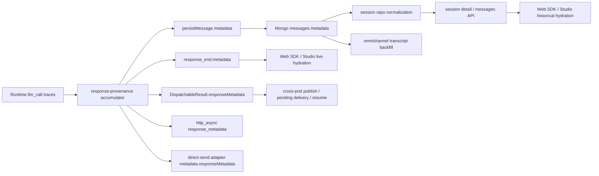

# HLD: LLM Response Provenance End-to-End

**JIRA**: `ABLP-654`
**Status**: `IMPLEMENTED`
**Date**: `2026-05-03`

## 1. Problem

Florida Blue needs a reliable client-visible signal when a response is AI-generated. The runtime already emitted `llm_call` traces, but that signal was not preserved across the delivery graph. The gaps were not limited to the live SDK websocket path; they also existed in persistence, session detail/history readback, Studio trace-only recovery, async resume, direct execution ports, channel webhook delivery, omnichannel transcript hydration, and A2A structured responses.

After the earlier rollout, four last-mile execution gaps still remained:

1. the web debug `ON_START` path still gated `response_end` on streamed text chunks and could drop structured-only or voice-only greetings entirely
2. paginated session history/backfill remained DB-only, so reconnect hydration could miss the freshest runtime tail or 404 while persistence lagged
3. the runtime in-memory message model still preserved only `content` plus metadata, so active session detail and resume rebuilds flattened `contentEnvelope`-only assistant turns
4. remaining voice persistence seams still stored assistant turns without canonical `responseMetadata`, leaving voice history as a disclaimer blind spot

The final end-to-end audit found three additional tail gaps that are addressed by this design update:

1. `session_resumed.conversationHistory` preserved structured envelopes but still dropped per-message provenance metadata between runtime snapshots and Studio hydration
2. realtime S2S voice transcripts in KoreVG persisted assistant turns without canonical metadata on Google and generic S2S transcript paths
3. cursor-paginated message history could truncate long active sessions by loading only a bounded persisted prefix before applying the live runtime tail

## 2. Goals

1. Define one canonical provenance contract for assistant responses.
2. Preserve that contract across all supported delivery paths.
3. Keep the wire format backward compatible for older clients and historical rows.
4. Avoid false compliance positives from internal-only LLM work.

## 3. Non-Goals

1. No automatic disclaimer rendering.
2. No Studio authoring schema, DSL, or Agent IR change.
3. No model-resolution or cache-key contract change.
4. No attempt to retrofit custom metadata into external Slack or Teams provider APIs.

## 4. Canonical Contract

```ts
type ResponseProvenanceKind = 'scripted' | 'llm' | 'mixed';

interface ResponseProvenance {
  schemaVersion: 1;
  kind: ResponseProvenanceKind;
  disclaimerRequired: boolean;
  usedLlmInternally: boolean;
}

interface ResponseMessageMetadata {
  isLlmGenerated: boolean;
  responseProvenance: ResponseProvenance;
}
```

### Semantics

1. `isLlmGenerated` is the compatibility flag that consumers read first.
2. `kind` distinguishes purely scripted, fully LLM-generated, and mixed turns.
3. `usedLlmInternally` captures invisible LLM work without forcing a disclaimer.
4. Customer-visible generation is inferred from explicit provenance tags first, then safe fallbacks.
5. Simulated fallback traces are ignored.

## 5. Provenance Derivation

The system now derives provenance in one runtime helper rather than recomputing it independently in each handler.

### Customer-visible LLM

Triggered by `llm_call` traces tagged with `responseContribution: 'customer_visible'`, or by untagged response-generation calls that are not classified as internal-only.

### Internal-only LLM

Triggered by explicit internal-only markers such as:

1. `responseContribution: 'internal_only'`
2. `purpose: 'entity_extraction' | 'field_validation'`
3. `operationType: 'extraction' | 'kb_classify' | 'kb_classify_vocab'`

### Scripted fallback outcomes

Channel fallbacks such as auth-required or platform-generated error outcomes are surfaced as `scripted`, even when earlier invisible LLM work happened in the same turn.

## 6. Architecture



### Primary live path

`llm_call` traces accumulate into `ResponseMessageMetadata`, and websocket `response_end` emits that metadata to Studio and SDK clients.

### Canonical live forwarding path

Handlers that already receive a canonical `ExecutionResult.responseMetadata` must forward that object unchanged on:

1. web debug live `response_end`
2. SDK websocket live `response_end`
3. ON_START / proactive greeting paths
4. action-submit completions
5. typed-interrupt live assistant replies

Trace accumulators remain useful for metrics and last-resort fallback metadata, but they are no longer treated as the source of truth once execution has already finalized provenance upstream.

### Active session history path

Canonical provenance now reaches active session detail through the runtime writer path, not just through Mongo readback:

1. `RuntimeExecutor.addMessage(...)` accepts optional per-message metadata for live websocket-only assistant writes such as ON_START
2. `executeMessage()` finalization stamps canonical `responseMetadata` onto the latest matching assistant history entry before active session detail is read
3. matching allows exact assistant responses, decorated parent-thread forms such as `[Agent]: response`, and PII-token/redaction variants that differ between delivery text and stored history text
4. when the response surface is structured-only and `response` text is empty, the current-turn fallback stamps the latest assistant message instead of silently dropping provenance

This keeps active Studio session detail and cross-pod session snapshots aligned with the same canonical metadata object that live websocket clients already receive.

### Studio live transcript path

Studio live websocket handling now needs to treat `response_end` as a structured assistant payload, not just a plain-text terminator:

1. live Studio transcript finalization must resolve renderable assistant content from `fullText`, `voiceConfig.plain_text`, or structured payload presence
2. the finalized Studio session-store message must preserve `contentEnvelope` so `richContent`, `actions`, and `voiceConfig` survive live rendering and later transcript replacement
3. empty-response errors should only appear when the runtime delivered neither text nor a renderable structured payload

This keeps Studio's first-party live transcript semantics aligned with preview mode and the public Web SDK client.

### Web debug proactive greeting parity path

The debug websocket `ON_START` path must use the same outcome-shaping semantics as the standard chat path:

1. `initializeSession()` results should be normalized through `buildExecutionOutcome({ channelType: 'web_debug', ... })`
2. `response_start` / `response_end` must still fire when the proactive greeting contains only `voiceConfig`, `richContent`, or `actions`
3. the runtime should persist and store the finalized assistant message even when no text chunk was streamed
4. trace-derived provenance remains fallback-only once canonical `result.responseMetadata` exists

This removes the last special-case proactive greeting path and keeps Studio debug behavior aligned with SDK websocket behavior.

### Active session-detail reconciliation path

Active session detail now needs a freshness-aware merge between runtime-memory history and persisted Mongo history:

1. persisted messages remain authoritative when they are fully caught up
2. when persisted history is only a prefix of the live runtime history, the detail route must preserve the fresher runtime suffix instead of replacing it
3. when the live runtime window overlaps the persisted tail, the detail route should keep the persisted overlap/head and append only the new live suffix
4. the merge should prefer persisted metadata/content envelopes for aligned messages while keeping live-only tail messages visible until persistence catches up

This prevents Studio refreshes from rolling back the latest assistant turn on websocket/debug sessions that still persist asynchronously or with debounce.

### Paginated history parity path

Cursor-paginated session history should preserve the same freshness contract as the main session-detail route:

1. when persisted history is authoritative, pagination should keep the existing DB cursor behavior
2. when the runtime has a fresher visible suffix, the route should merge only that live tail into the paginated result instead of forcing callers to wait for persistence
3. when no persisted DB session exists yet but an active runtime session does, the route should still serve runtime-backed history for bounded reconnect hydration
4. cursor semantics must remain stable across merged pages so Web SDK hydration can continue paging forward without duplicate or missing turns

This keeps reconnect/backfill flows from behaving like a stale secondary path.

### In-memory structured envelope parity path

Runtime session snapshots need the same structured assistant envelope shape that persisted Mongo messages already carry:

1. `ConversationMessage` should allow an optional canonical `contentEnvelope`
2. execution finalization should stamp the latest matching assistant history entry with both canonical provenance metadata and structured envelope content
3. `getSessionDetail()` and websocket resume snapshots should surface that envelope without waiting for Mongo persistence
4. DB rebuild/reconnect paths should restore `contentEnvelope` and metadata back into runtime conversation history instead of flattening to `rawContent ?? content`

This keeps active detail, same-pod resume, and cross-pod rebuilds from silently degrading rich assistant turns.

### Persistence path

The same metadata is persisted once on the assistant message, stored as a Mongo object, and normalized on read for older rows that still contain stringified metadata.

### Async/resume path

Async resume results now carry `responseMetadata` through:

1. `DispatchableResult`
2. `ChannelDispatcher`
3. `PendingDeliveryStore`
4. cross-pod websocket replay
5. reconnect-time pending delivery replay

The final resume seam also prefers executor-supplied canonical metadata over locally rebuilt provenance so suspend/resume does not silently strip future metadata fields.

### Channel worker path

Inbound async/webhook channels compute provenance independently from runtime traces and preserve it in:

1. `http_async` payloads as `response_metadata`
2. direct-send adapter metadata as `responseMetadata`

### Direct execution parity path

Execution ports outside the websocket path preserve provenance in shared outcome/result contracts:

1. direct channel outcome shaping keeps `responseMetadata` attached for AI4W, Genesys, voice, and other `buildExecutionOutcome()` callers
2. A2A structured response payloads include `responseMetadata` so cross-runtime consumers can render disclaimers without custom SDK shims

### Shared semantics path

The provenance classifier and metadata builder now live in a pure shared-kernel helper consumed by runtime and Studio replay. This removes the last duplicated classification table and keeps future semantic changes in one place.

### Studio metadata recovery path

Studio replay now treats provenance recovery as a separate concern from missing-message synthesis:

1. trace replay first enriches existing assistant messages that lack provenance metadata
2. only after enrichment does it decide whether synthetic messages are still needed
3. enrichment preserves the original message id/content and avoids adding `synthetic: true` when the message itself already exists

This lets historical/detail views recover disclaimer state from trace evidence without inventing duplicate assistant messages.

### Client typing parity path

The public Web SDK keeps a publish-safe local `ResponseProvenance` type that is structurally identical to the shared-kernel contract, and Studio reuses that exported shape instead of maintaining its own inline provenance object definition. This keeps separately published client bundles aligned without making the public SDK depend on a private workspace package.

### AI4W outbound path

AI4W is treated as a first-class external client surface rather than an internal-only outcome consumer:

1. sync JSON responses include `responseMetadata`
2. SSE `done` events include `responseMetadata` and final outcome status
3. async callbacks include canonical `responseMetadata` on the signed callback payload
4. transport bookkeeping remains under `metadata` so provenance does not get buried in transport-only fields

### Canonical async forwarding path

Channel workers no longer rebuild provenance opportunistically when a canonical `ExecutionResult.responseMetadata` already exists. Worker-shaped async delivery prefers the runtime-supplied metadata object and only falls back to accumulator-derived scripted metadata when execution did not provide one.

### A2A session-detail parity path

The A2A session-detail contract now allows assistant message provenance metadata so future history/detail consumers do not silently lose disclaimers even when live A2A artifacts already carry the signal.

### Omnichannel path

Transcript items preserve assistant message metadata during backfill so omnichannel consumers do not lose provenance when loading historical recall.

### Voice persistence parity path

Voice channels should persist the same canonical assistant metadata contract as web and async channels:

1. canonical coordinator/adaptor results should surface `responseMetadata` to voice delivery workers
2. LiveKit assistant persistence should pass canonical metadata through `persistMessage(...)`
3. KoreVG greeting and finalized assistant persistence should pass canonical metadata through `persistMessage(...)`
4. voice persistence should keep using the finalized outcome rather than rebuilding provenance heuristically from token counts

This keeps historical voice transcripts eligible for the same customer-side disclaimer logic as web/sdk transcripts.

### Resume metadata parity path

Resume snapshots are a first-class delivery path, not a best-effort reconstruction path:

1. runtime `session_resumed.conversationHistory` should include optional per-message `metadata`
2. runtime snapshots rebuilt from both in-memory sessions and persisted Mongo messages should preserve that metadata unchanged
3. Studio should hydrate resumed messages with the same metadata used by live and history paths
4. backward compatibility is preserved because the field remains optional

This prevents browser refresh, reconnect, and cross-pod resume from losing the disclaimer signal after the original live `response_end`.

### Realtime transcript provenance path

Realtime provider transcripts are already generated by an LLM provider even when the provider does not emit the platform's normal `llm_call` trace shape. The runtime therefore treats finalized assistant realtime transcripts as customer-visible LLM output:

1. assistant transcript writes receive canonical `isLlmGenerated: true` metadata
2. user transcript writes remain metadata-less
3. the metadata is attached to both runtime conversation history and Mongo persistence
4. provider-specific transcript paths use the same helper to avoid divergent semantics

This keeps future realtime providers from creating a new provenance blind spot.

### Active-tail cursor pagination path

The messages API should use the live runtime tail only as an overlay on a cursor window it can faithfully reason about:

1. no-cursor requests continue to merge persisted history with the freshest runtime suffix
2. cursor requests whose cursor is present in the merged active window paginate that merged window
3. cursor requests whose cursor is outside the merged active window fall back to DB cursor pagination instead of silently treating the cursor as absent
4. DB cursor behavior remains the authoritative path for older pages in long active sessions

This avoids duplicate or missing messages when clients page through sessions whose persisted history is longer than the active merge window.

## 7. Compatibility and Migration

1. The wire field remains optional.
2. Historical rows do not require backfill.
3. Reader normalization tolerates legacy stringified metadata.
4. Writers now persist metadata as canonical objects only.

## 8. Risk Management

### Primary risks addressed

1. Semantic drift between handlers
2. object-vs-string metadata corruption in persistence
3. secondary-path drops in session detail, async resume, and omnichannel replay
4. false compliance positives from internal-only LLM work
5. Studio trace replay inventing disclaimers for invisible classifier/extraction calls
6. direct-channel/A2A payloads diverging from websocket semantics
7. AI4W live client payloads omitting provenance even though runtime already computed it
8. async worker deliveries silently dropping future metadata fields by rebuilding a partial object
9. contract drift between shared runtime semantics and Studio trace-only replay
10. A2A session-detail history typing falling behind the live structured-response contract
11. live websocket handlers recomputing scripted metadata after the executor already finalized canonical provenance
12. suspend/resume delivery rebuilding metadata and dropping future canonical fields
13. Web SDK and Studio client types drifting away from the canonical provenance shape
14. active in-memory session detail losing provenance before persisted history is available
15. Studio replay treating provenance-only gaps as “complete” transcripts and never repairing existing assistant messages
16. Studio live websocket transcripts misclassifying structured or voice-only assistant turns as empty runtime failures
17. session-detail readback replacing fresher runtime history with stale persisted Mongo prefixes
18. output-protected assistant history storing a different string than the live delivery text, causing provenance stamping to miss the current turn
19. debug websocket `ON_START` greetings dropping entirely when no text chunk opens the response frame
20. cursor-paginated reconnect/backfill history behaving as DB-only truth and missing the active runtime tail
21. runtime in-memory snapshots flattening structured assistant turns during active detail and resume rebuilds
22. voice history persisting assistant turns without the canonical provenance metadata contract

### Residual constraints

1. External Slack/Teams APIs still cannot carry custom metadata back to end users.
2. Consumer applications remain responsible for disclaimer wording and rendering.

## 9. Validation Strategy

The rollout used slice-by-slice test locking:

1. unit characterization for provenance semantics
2. focused runtime tests for websocket, HTTP/internal chat, persistence, session detail, async, omnichannel, and channel outcome seams
3. focused Studio replay tests for synthetic historical hydration and metadata-only enrichment
4. focused A2A adapter tests for structured payload parity
5. focused live websocket regressions for ON_START, chat, action-submit, typed-interrupt, and resume forwarding
6. focused Web SDK typing regressions for the public provenance contract
7. existing Web SDK regression locks
8. one black-box runtime SDK E2E covering live plus persisted history
9. focused runtime helper and session-detail locks for active in-memory assistant metadata
10. focused Studio live transcript tests for structured and voice-only `response_end` payloads
11. focused runtime session-detail reconciliation tests for stale persisted-history prefixes and overlapping live windows
12. focused runtime helper tests for protected assistant-history stamping fallback and structured-only empty-response turns
13. focused web debug `ON_START` structured-response regressions
14. focused session-history cursor route regressions for active-runtime merge behavior
15. focused runtime session-detail and resume regressions for in-memory `contentEnvelope` parity
16. focused voice adapter/channel regressions for assistant metadata persistence

This gives a future-ready shape without coupling disclaimer behavior to any single transport or client.
