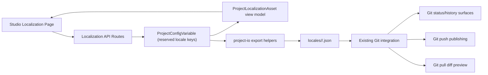

# HLD: Localization Asset Management

**Feature Spec**: [docs/features/sub-features/localization-asset-management.md](../features/sub-features/localization-asset-management.md)
**Test Spec**: [docs/testing/sub-features/localization-asset-management.md](../testing/sub-features/localization-asset-management.md)
**Status**: IMPLEMENTED
**Author**: Codex
**Date**: 2026-04-16

---

## 1. Problem Statement

The platform already has a runtime-localization foundation, but Studio still lacked the content-authoring layer needed to manage locale assets cleanly:

- locale files were not first-class Studio assets
- Config Variables was the only nearby surface, but it models compile-time `{{config.KEY}}` constants rather than locale JSON files
- the existing export/Git flow did not clearly surface locale assets as real files from the stored model
- editing localized JSON in a narrow form would be poor UX and slow down builders

The design goal is to add first-class, design-system-consistent locale asset management without inventing a new storage collection or parallel publishing system.

---

## 2. Alternatives Considered

### Option A: Extend Config Variables for locale files

- **Description**: Keep locale assets inside the existing Config Variables UI and relax key validation.
- **Pros**: Minimal navigation/API surface change.
- **Cons**: Wrong mental model, poor editing UX, muddles compile-time constants with locale file content.
- **Effort**: S

### Option B: File upload only

- **Description**: Let users upload/download locale JSON files but not edit them in Studio.
- **Pros**: Smallest implementation footprint.
- **Cons**: Fails the core authoring UX requirement; not useful for iterative editing.
- **Effort**: S

### Option C: Dedicated localization workbench backed by reserved project config entries (Recommended)

- **Description**: Add a Localization page in Studio, reuse the design system, store assets in reserved project config records, and export them as canonical locale files.
- **Pros**: Clear mental model, minimal persistence change, aligns with Git/export, enables wide/full-screen editing.
- **Cons**: Requires coordinated Studio, project-io, and Git-surface changes.
- **Effort**: M

### Recommendation: Option C

Option C is the right fit because the problem is not only persistence. It is a UX, authoring, and publishing contract problem that benefits from a dedicated surface while still reusing the current storage model.

---

## 3. Architecture

### System Context Diagram



### Component Diagram

```text
Studio UI
  - LocalizationSettingsPage
  - DetailPageShell (maxWidth=full)
  - SlidePanel (width=full)
  - DataTable / Card / Button / Input / Select / Textarea / ConfirmDialog
        |
        v
Studio API
  - /api/projects/:id/localization
  - /api/projects/:id/localization/:assetId
        |
        v
Storage / helpers
  - ProjectConfigVariable (reserved locale:* keys)
  - localization-assets.ts
  - project-io locale-files.ts helpers
        |
        +--> project-exporter.ts
        +--> core-assembler.ts
        +--> git push/status/pull routes
        +--> GitIntegrationTab
```

### Data Flow

1. A builder opens `Settings > Localization`.
2. Studio calls project-scoped localization API routes and receives normalized `ProjectLocalizationAsset` records.
3. The user edits JSON in a full-width panel and saves back through the same API.
4. Reserved storage keys are converted to canonical relative paths and file paths by shared helpers.
5. Export/Git push materializes locale entries as `locales/...json` files.
6. Git status/history surfaces locale assets as part of the existing Git integration experience.

### Sequence Diagram

```text
User
  -> LocalizationSettingsPage
  -> GET /api/projects/:id/localization
  -> list ProjectConfigVariable records with locale: prefix
  -> edit/create/delete asset
  -> POST/PATCH/DELETE localization API
  -> reserved locale key/value stored in ProjectConfigVariable
  -> push via existing Git integration
  -> project-io export emits locales/<locale>/<asset>.json
```

---

## 4. The 12 Architectural Concerns

### Structural Concerns

| #   | Concern                 | Design Decision                                                                                                |
| --- | ----------------------- | -------------------------------------------------------------------------------------------------------------- |
| 1   | **Tenant Isolation**    | Every Studio route query includes explicit `tenantId` and `projectId` filters; cross-scope access returns 404. |
| 2   | **Data Access Pattern** | Reuse `ProjectConfigVariable` with a reserved namespace instead of creating a new collection.                  |
| 3   | **API Contract**        | Add dedicated localization CRUD endpoints rather than overloading config-variable routes.                      |
| 4   | **Security Surface**    | Validate canonical relative paths, JSON object content, and duplicate-key conflicts at the boundary.           |

### Behavioral Concerns

| #   | Concern           | Design Decision                                                                                                              |
| --- | ----------------- | ---------------------------------------------------------------------------------------------------------------------------- |
| 5   | **Error Model**   | Invalid path/JSON returns 400; duplicates return 409; missing assets return 404.                                             |
| 6   | **Failure Modes** | Invalid reserved entries are skipped defensively during listing/export with warnings rather than crashing the whole export.  |
| 7   | **Idempotency**   | Canonical path normalization plus unique `(tenantId, projectId, key)` index prevents duplicate locale assets.                |
| 8   | **Observability** | Existing Git history/status and route logging surface operational visibility; reserved path helpers centralize tricky logic. |

### Operational Concerns

| #   | Concern                | Design Decision                                                                                                                   |
| --- | ---------------------- | --------------------------------------------------------------------------------------------------------------------------------- |
| 9   | **Performance Budget** | Listing and editing are lightweight project-scoped document operations; no new background pipeline is introduced.                 |
| 10  | **Migration Path**     | Existing locale-bearing config entries can already be interpreted via shared helpers; Studio now makes them visible and editable. |
| 11  | **Rollback Plan**      | Localization UI/routes can be removed without schema migration because data lives in existing project config records.             |
| 12  | **Test Strategy**      | Cover helper/export/Git wiring with unit tests first, then add route/browser tests as follow-up coverage.                         |

---

## 5. Data Model

### Canonical Storage Shape

```text
key: "locale:<locale>/<asset>.json"
value: "{ ...json object... }"
description: optional string
```

### Derived Path Helpers

```text
relative path: en/_shared.json
file path:     locales/en/_shared.json
config key:    locale:en/_shared.json
```

### Modified Existing Shapes

- `ProjectData.locales?: Map<string, string>` in `project-exporter.ts`
- locale-aware export branch in `core-assembler.ts`
- `GitStatusResponse.localLocaleFiles` in Studio client/server types

---

## 6. API Design

### New Endpoints

| Method | Path                                      | Purpose             |
| ------ | ----------------------------------------- | ------------------- |
| GET    | `/api/projects/:id/localization`          | List locale assets  |
| POST   | `/api/projects/:id/localization`          | Create locale asset |
| GET    | `/api/projects/:id/localization/:assetId` | Get locale asset    |
| PATCH  | `/api/projects/:id/localization/:assetId` | Update locale asset |
| DELETE | `/api/projects/:id/localization/:assetId` | Delete locale asset |

### Error Responses

- `400` for invalid locale path or non-object JSON
- `404` for missing/cross-scope asset access
- `409` for duplicate locale asset path
- `500` for unexpected persistence failures

---

## 7. Cross-Cutting Concerns

- **Design system reuse**: no custom visual system or bespoke shell; the page is composed from existing Studio primitives.
- **Git alignment**: localization remains inside the existing Git integration, not a parallel publish mechanism.
- **Import/export contract honesty**: the slice fully aligns export and Git push/status/history, while broader locale-file import-apply remains explicit follow-on work.
- **Documentation clarity**: runtime localized message resolution is documented as out of scope to prevent overclaiming ABLP-289 completion.

---

## 8. Dependencies

### Upstream

| Dependency                        | Type           | Risk   |
| --------------------------------- | -------------- | ------ |
| `ProjectConfigVariable` model     | Storage model  | Low    |
| Studio design-system primitives   | UI foundation  | Low    |
| `project-io` export/Git utilities | Shared library | Medium |

### Downstream

| Consumer / Follow-On                 | Impact                                               |
| ------------------------------------ | ---------------------------------------------------- |
| Runtime localized message resolution | Can consume a stable locale asset contract later     |
| Git review / repo workflows          | Locale assets now appear as first-class file changes |
| Project export/import consumers      | Locale assets participate in canonical file output   |

---

## 9. Open Questions & Decisions Needed

1. Should locale-file import apply be added through the existing staged import path or a dedicated locale-asset apply path?
2. Should future iterations move beyond raw JSON assets into message-key semantics and translation completeness tracking?
3. Should Git pull UI distinguish clearly between preview-only diffs and fully applied remote content for locale assets?
