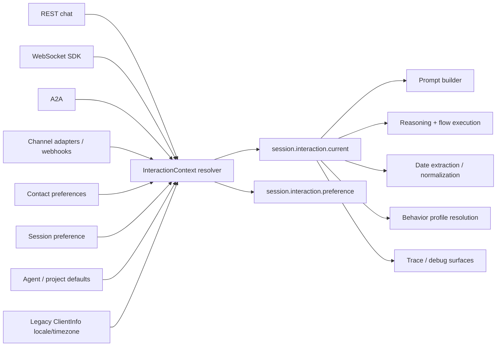

# HLD: Localized Interaction Context

**Feature Spec**: [docs/features/sub-features/localized-interaction-context.md](../features/sub-features/localized-interaction-context.md)
**Test Spec**: [docs/testing/sub-features/localized-interaction-context.md](../testing/sub-features/localized-interaction-context.md)
**Status**: DRAFT
**Author**: Codex
**Date**: 2026-04-16

---

## 1. Problem Statement

The runtime has the raw ingredients for localization-aware execution, but they stop at different layers:

- chat, A2A, and SDK ingress can carry metadata, but execution paths do not treat it as canonical interaction context
- contact preferences and channel-native hints exist, but they are not resolved into one stable runtime contract, and Teams `activity.locale` is currently discarded during adapter normalization
- prompt building, extraction, behavior-profile evaluation, and date parsing each read different inputs: `_locale`, generic metadata, and `session.data.values.language` are all in play today
- `SessionMetadata.clientInfo.locale/timezone` exists as a dead shape that neither ingress nor execution treats as authoritative
- relative dates are still anchored on process-local `new Date()`, and helper semantics such as `toISODate()` / `normalizeDate()` are inconsistent across call paths

The result is inconsistent language switching, user-local date mistakes, and different behavior depending on which channel the user happens to use.

The design goal is one canonical, per-turn interaction-context contract that is defined in the shared kernel, resolved at ingress, and consumed uniformly by the runtime.

---

## 2. Alternatives Considered

### Option A: Patch individual consumers in place

- **Description**: Leave ingress behavior unchanged and separately teach prompt builder, extractors, and date parsing to inspect more metadata fields.
- **Pros**: Lowest short-term code churn.
- **Cons**: Preserves duplication, creates more drift, and does not make future channels safer.
- **Effort**: S

### Option B: Expand `_locale` into a session-global localization bucket

- **Description**: Reuse the existing `_locale` pattern and add sibling values like `_language` and `_timezone`, updating them in place.
- **Pros**: Small migration from current code.
- **Cons**: Still conflates current-turn context with session preference; does not model provenance or precedence clearly.
- **Effort**: M

### Option C: Canonical `InteractionContext` resolver with turn-scoped and session-preference state (Recommended)

- **Description**: Normalize one `InteractionContext` at every ingress, store it in the canonical session namespace, and make all execution consumers read that state.
- **Pros**: Clear contract, predictable precedence, safe message-level switching, better long-term channel extensibility.
- **Cons**: More coordinated changes across ingress, execution, and date parsing.
- **Effort**: M

### Recommendation: Option C

Option C is the best fit because the problem is architectural, not just parser-specific. A shared resolver and canonical session state fix the root cause instead of teaching every consumer to guess.

---

## 3. Architecture

### System Context Diagram



### Component Diagram

```text
Ingress normalizers
  - chat.ts
  - server.ts (A2A)
  - websocket/sdk-handler.ts
  - channels/adapters/msteams-adapter.ts
  - channels/session-resolver.ts
  - channels/pipeline/session-factory.ts
        |
        v
InteractionContext resolver
  - shared-kernel type contract
  - validate explicit values
  - map legacy ClientInfo locale/timezone as compatibility input only
  - merge precedence layers
  - produce current-turn + preference update decision
        |
        v
Canonical session state
  - session.interaction.current
  - session.interaction.preference
  - compatibility aliases (_locale, _language, _timezone)
  - no long-lived alias for session.data.values.language
        |
        +--> prompt-builder.ts
        +--> reasoning-executor.ts
        +--> profile-resolver.ts
        +--> flow-step-executor.ts
        +--> extraction-validation.ts
        +--> date-extraction.ts
```

### Data Flow

1. An inbound message arrives through REST, A2A, SDK, or a channel adapter.
2. The ingress path extracts any explicit interaction context and channel-native localization hints, and it stops dropping adapter-native fields such as Teams `locale`.
3. The resolver merges explicit message values, session preference, contact preferences, channel hints, legacy `ClientInfo` locale/timezone, and defaults into one `InteractionContext`.
4. Runtime persists `current` and optionally updates `preference`, while maintaining only bounded compatibility aliases.
5. Execution consumers read only the canonical session interaction state, replacing both `_locale` and `session.data.values.language` reads.
6. Date parsing and date normalization receive the same locale-aware, timezone-aware reference options so helper behavior is consistent across call paths.

### Sequence Diagram

```text
Inbound message
  -> ingress normalizer
  -> resolveInteractionContext()
  -> persist session.interaction.current
  -> update compatibility aliases
  -> stop generic profile-language reads from session.data.values.language
  -> build prompt + run extraction
  -> normalize dates with user-local reference instant
  -> emit response / traces
```

---

## 4. The 12 Architectural Concerns

### Structural Concerns

| #   | Concern                 | Design Decision                                                                                                                                                                                                                                                 |
| --- | ----------------------- | --------------------------------------------------------------------------------------------------------------------------------------------------------------------------------------------------------------------------------------------------------------- |
| 1   | **Tenant Isolation**    | Resolver reads only already-scoped session, contact, and channel data. No new cross-tenant lookups are introduced.                                                                                                                                              |
| 2   | **Data Access Pattern** | Use in-memory message inputs plus existing session namespace and caller/contact preference preload. `SessionMetadata.clientInfo.locale/timezone` is treated as legacy compatibility input, not authoritative storage. No new collection is required in phase 1. |
| 3   | **API Contract**        | Add an explicit interaction-context contract at inbound surfaces, with a compatibility branch mapping legacy metadata fields, Teams locale, and legacy `ClientInfo` localization fields into the resolver.                                                      |
| 4   | **Security Surface**    | Validate BCP-47 locale and IANA timezone at the boundary. Keep user-visible errors sanitized and avoid timezone inference from IP or locale alone.                                                                                                              |

### Behavioral Concerns

| #   | Concern           | Design Decision                                                                                                                                                                                                                                              |
| --- | ----------------- | ------------------------------------------------------------------------------------------------------------------------------------------------------------------------------------------------------------------------------------------------------------ |
| 5   | **Error Model**   | Invalid explicit context returns a boundary error on direct APIs and a recoverable socket error for WS; missing values degrade to fallback resolution. Date-normalization paths must fail consistently instead of silently diverging by locale defaults.     |
| 6   | **Failure Modes** | If detection or normalization fails, the resolver falls back to lower-precedence sources rather than blocking the turn. Hidden host-timezone dependencies (`new Date()`, local getters) are treated as correctness bugs to remove, not acceptable fallbacks. |
| 7   | **Idempotency**   | Turn-scoped interaction context participates in turn identity. Different message-level context must not collapse into the same dedup execution.                                                                                                              |
| 8   | **Observability** | Add resolver traces/logs for selected source, applied overrides, and invalid explicit inputs. Debug surfaces should surface resolved context safely.                                                                                                         |

### Operational Concerns

| #   | Concern                | Design Decision                                                                                                                                                                                                                                                    |
| --- | ---------------------- | ------------------------------------------------------------------------------------------------------------------------------------------------------------------------------------------------------------------------------------------------------------------ |
| 9   | **Performance Budget** | Resolver must stay in-memory and lightweight. Prompt context adds a bounded number of tokens. Expensive language inference should be optional and short-circuited when explicit input exists.                                                                      |
| 10  | **Migration Path**     | Roll out with canonical `session.interaction.*` plus compatibility aliases. Consumers migrate incrementally away from `_locale` reads, direct `session.data.values.language` profile routing, discarded Teams locale, and legacy `ClientInfo` localization fields. |
| 11  | **Rollback Plan**      | Keep alias and compatibility mapping in place so execution can fall back to prior behavior if new consumers need to be disabled. No DB migration is required.                                                                                                      |
| 12  | **Test Strategy**      | Add unit tests for resolver policy and date normalization, integration tests for canonical session state, and E2E tests across REST, SDK, A2A, and channel ingress.                                                                                                |

---

## 5. Data Model

### New Runtime Types

```typescript
interface InteractionContext {
  language: string | null;
  locale: string | null;
  timezone: string | null;
  source: 'message' | 'session' | 'contact' | 'channel' | 'project' | 'agent' | 'default';
  confidence: 'explicit' | 'high' | 'medium' | 'low';
  resolvedAt: string;
}

interface SessionInteractionState {
  current: InteractionContext;
  preference?: {
    language?: string;
    locale?: string;
    timezone?: string;
    source: string;
    updatedAt: string;
  };
}
```

### Modified Existing Shapes

- `packages/shared-kernel/src/types/index.ts` exports the canonical `InteractionContext` / `SessionInteractionState` types for runtime, A2A, and compiler-adjacent consumers
- session namespace gains `session.interaction.current` and `session.interaction.preference`
- compatibility aliases `_locale`, `_language`, and `_timezone` are derived from canonical state
- behavior-profile consumers stop reading `session.data.values.language` directly and instead read canonical interaction state
- inbound execution option shapes gain explicit interaction-context support or canonical mapping from legacy metadata
- `SessionMetadata.clientInfo.locale/timezone` becomes compatibility input only and is marked for deprecation as an execution contract

### Key Relationships

- explicit message context feeds `current`
- session/contact state influences `preference`
- legacy `ClientInfo` localization fields can seed resolver input during migration but never outrank explicit turn input
- prompt, extraction, and date parsing read `current`

---

## 6. API Design

### Modified Endpoints / Surfaces

| Method / Surface | Path                                | Purpose                                                                                                 | Auth                           |
| ---------------- | ----------------------------------- | ------------------------------------------------------------------------------------------------------- | ------------------------------ |
| POST             | `/api/v1/chat/agent`                | Accept explicit interaction context for direct runtime execution                                        | Existing chat auth             |
| POST             | `/a2a/:connectionId`                | Map A2A localization input into canonical execution options                                             | Existing A2A auth              |
| WS               | `/ws/sdk`                           | Preserve per-message interaction context in SDK execution                                               | Existing SDK auth/bootstrap    |
| POST             | `/api/v1/channels/:channelType/...` | Normalize channel-native hints before session creation and stop dropping adapter locale/language fields | Existing provider/webhook auth |

### Error Responses

- `400 INVALID_INTERACTION_CONTEXT` for malformed explicit locale/timezone values on direct APIs
- WS error event with sanitized message for malformed explicit context
- no new user-visible internal remediation details
- no silent locale fallback split between flow extraction and `normalizeDate()`

---

## 7. Cross-Cutting Concerns

- **Audit Logging**: No new audit collection is required. Resolver decisions should be traceable through existing runtime traces/logs.
- **Rate Limiting**: Existing route-level rate limiting remains sufficient; the resolver adds no new unauthenticated surface.
- **Caching**: Session preference is the main reuse mechanism. Any language inference cache must not prevent explicit message-level switching.
- **Encryption**: No new secrets or encrypted storage are required. Contact preference reuse follows existing contact-context handling.

---

## 8. Dependencies

### Upstream (this feature depends on)

| Dependency                                        | Type                  | Risk   |
| ------------------------------------------------- | --------------------- | ------ |
| `@agent-platform/shared-kernel` interaction types | Shared library        | Low    |
| `sdk-message-metadata` validation                 | Runtime helper        | Medium |
| `resolve-locale` helper                           | Shared library        | Low    |
| `date-extraction` helper                          | Compiler utility      | High   |
| contact preference preload                        | Runtime orchestration | Medium |
| channel adapters exposing locale/language hints   | Runtime ingress       | Medium |

### Downstream (depends on this feature)

| Consumer               | Impact                                                                                   |
| ---------------------- | ---------------------------------------------------------------------------------------- |
| Prompt builder         | Gains deterministic user-local date/time context                                         |
| Entity/date extraction | Stops reading raw `_locale`, inconsistent locale defaults, and server-local time         |
| Behavior profiles      | Stop depending on `session.data.values.language` and evaluate canonical session language |
| Channel continuity     | Can carry localization preference across channels more safely                            |

---

## 9. Open Questions & Decisions Needed

1. Should REST/A2A publish a top-level `interactionContext` field immediately, or should the first release normalize legacy `messageMetadata` first and add a top-level field later?
2. What deprecation window should apply to `SessionMetadata.clientInfo.locale/timezone` once canonical `InteractionContext` is in place?
3. Should inferred language switching ever update `session.interaction.preference` on a single message, or only after repeated confirmation?

---

## 10. References

- Feature spec: [docs/features/sub-features/localized-interaction-context.md](../features/sub-features/localized-interaction-context.md)
- Test spec: [docs/testing/sub-features/localized-interaction-context.md](../testing/sub-features/localized-interaction-context.md)
- Related designs: [docs/specs/channels.hld.md](./channels.hld.md), [docs/specs/nlu.hld.md](./nlu.hld.md), [docs/specs/entity-extraction.hld.md](./entity-extraction.hld.md), [docs/specs/memory-sessions.hld.md](./memory-sessions.hld.md)
