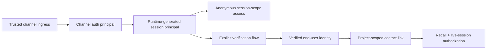
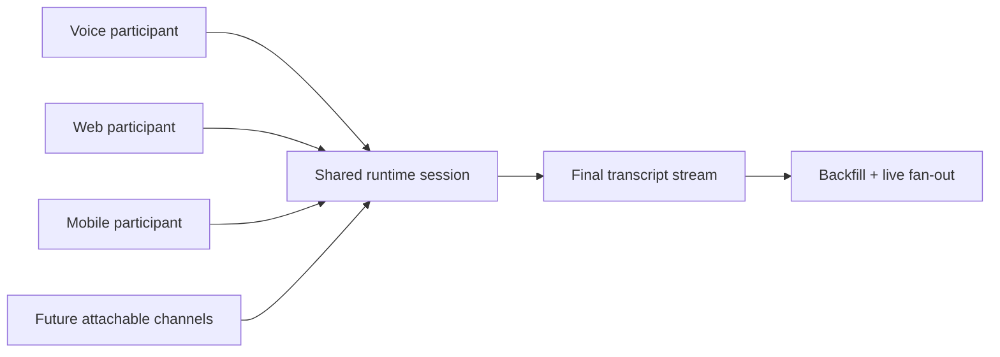

# Omnichannel Session Continuity - High-Level Design

## What

Omnichannel Session Continuity gives verified end users a continuous experience across channels without requiring them to repeat prior discussion. It covers two connected capabilities:

1. **Part 1: Cross-Channel Conversation Recall**
   Project-scoped recall that lets the agent retrieve prior relevant conversation from earlier sessions for the same verified contact.
2. **Part 2: Live Omnichannel Transcript Sync**
   A shared live session where an active voice conversation can also be attached to text surfaces such as web or mobile chat, with the same transcript, same agent, same session, and typed interruption behavior.

This design is grounded in four principles:

- authenticate channels first
- verify end-user identity separately and explicitly
- keep anonymous users supported but session-scoped
- fail closed on any cross-session or cross-channel ambiguity

## Why

Today, each channel interaction behaves like an isolated session. That creates two user-visible failures:

- a user who starts on web or mobile and later calls by phone must repeat themselves
- a user on a voice call cannot see or type into the same conversation from a text surface

The platform already has useful building blocks for contacts, identity tiers, channel-switch orchestration, SDK session tokens, and contact-level facts. The missing piece is a deliberate omnichannel model that keeps project isolation and privacy intact while making recall and shared live sessions possible.

## Assumptions and Product Decisions

The following decisions are assumed for the initial design and should be treated as the working contract unless product changes them later:

1. Cross-channel recall is strictly project-scoped.
2. Recall uses a hybrid model: facts and preferences are preloaded, transcript recall is on demand, and the SDK may request narrower behavior.
3. Identity signals may include verified phone or caller ID, email, channel-native identities such as Slack, MS Teams, and WhatsApp, member or account number, and tenant-signed envelopes.
4. Contact linking must wait for explicit verification and explicit confirmation, except for provider-verified continuity classified by trusted channel/provider policy. The default classification is weak tier 1, which may bootstrap or resume continuity only on the same channel when the artifact is channel-owned and stable. Selected trusted channels/providers may classify provider verification as strong tier 2 explicitly; only then may provider verification satisfy strong-verification gates.
5. Live transcript sync requires strong verified identity. OTP by text is an acceptable default, and projects may enable additional strong methods.
6. Opening web chat during an active voice call auto-joins only when the user uses an explicitly linked verified join URL. Otherwise the user is prompted to join.
7. Typed input interrupts active voice playback and TTS.
8. Only final transcript text is shown in attached text surfaces.
9. If the voice call ends, the same session continues in text.
10. Multiple attached tabs or windows are allowed and all participate in the same session.
11. Consent, retention, redaction, audit, tenant isolation, and project isolation are mandatory privacy gates.
12. Default transcript recall is limited to 20 messages, and session-start latency should remain under one second.
13. Assumption for unresolved merge behavior: after a manual contact merge, future recall immediately spans both historical contact histories under the surviving primary contact.
14. The architecture should be channel-agnostic from day one and treat all channels as attachable participants, even if rollout starts with voice plus web and mobile.
15. SDK auth is channel-scoped first and identity-scoped second.
16. The runtime-trusted `sdk_session` is the source of truth for `tenantId`, `projectId`, `channelId`, and granted capabilities.
17. End-user identity is optional and must be verified before it can affect authorization, recall, resume, or ownership decisions.
18. Caller-provided unsigned `userContext.userId` is metadata only and may be used for personalization, not authorization.
19. Anonymous SDK users remain fully supported, including auth-preflight and OAuth initiation, but their grants are bound to the session principal instead of a reusable user identity.

## Goals

- Preserve conversation continuity across channels for the same verified contact within one project
- Keep anonymous SDK usage fully functional and safe
- Support strong identity verification before any reusable cross-session authorization decision
- Keep session-start latency under one second by separating eager facts from lazy transcript recall
- Support shared live sessions with multiple attached participants and final-transcript rendering
- Make the session core channel-agnostic so future attachable channels fit the same model
- Enforce privacy, retention, audit, and fail-closed isolation throughout the design

## Non-Goals

- Automatic recognition of fully anonymous users across sessions
- Cross-project recall or tenant-wide recall
- Interim transcript rendering in the attached chat surface
- Bypassing explicit verification and confirmation with raw caller-provided identity values
- Conflating SDK channel authentication with verified end-user identity
- First-wave support for every transport-specific live attach behavior on SMS, WhatsApp, Slack, and Teams

## Current-State Assessment

| Area                     | Current foundation                                                                          | Gap to close                                                                                                       |
| ------------------------ | ------------------------------------------------------------------------------------------- | ------------------------------------------------------------------------------------------------------------------ |
| SDK authentication       | `sdk_session` already carries trusted tenant, project, deployment, channel, and permissions | Need to explicitly model channel auth principal separate from verified identity and session principal              |
| Contacts                 | Contact identities, merge state, and contact context already exist                          | Linking must be consistently explicit, verification-gated, and project-safe for recall                             |
| Session model            | Session records already carry contact and channel metadata                                  | Need live participant and principal metadata                                                                       |
| Message model            | Messages already persist contact and channel metadata                                       | Need safe project scoping, transcript sequence metadata, and recall retrieval support                              |
| Contact preload          | Contact facts and preferences already preload at session start                              | Need hybrid recall split with lazy transcript retrieval                                                            |
| Identity verification    | Initiate and status routes exist                                                            | Completion must produce a project-safe session-resolution record with durable provenance, not a bare session match |
| Live WebSocket transport | SDK WebSocket handler exists                                                                | Needs join, backfill, shared-session fan-out, and multi-subscriber registry                                        |
| Web SDK                  | Chat and voice clients exist                                                                | Widget is mode-toggle based and does not render a shared transcript                                                |

## Architecture Principles

### Principal Separation

We will separate three principals that are currently overloaded:

- **Channel auth principal**
  The authenticated channel scope. This comes from trusted ingress such as `sdk_session`, telephony connectors, or channel-native server trust and is authoritative for tenant, project, channel, and granted capabilities.
- **Session principal**
  A runtime-generated, unique principal for the current conversation session. It always exists, even for anonymous users.
- **Verified end-user identity**
  An optional, strongly verified identity that may link the session to a reusable contact and authorize recall, resume, and live join.

This prevents identity collisions and keeps anonymous access safe.

### Canonical Scope Inheritance

Recall, resume, and live-session authorization must consume the validated `ProductionExecutionScope` created by Session Scope Enforcement. That means every omnichannel decision has access to:

- `sessionPrincipalId` as the continuity identity for the active session
- `subject` as the human subject-of-record once contact linkage completes
- `actor` as the caller or automation acting in the session
- `identityEvidence` as the canonical verification/provenance summary
- `source` and `traceId` for audit and replay

Workers, routers, and WebSocket fan-out should persist or read from that canonical envelope directly. They must not reconstruct actor, project, or verification provenance later from ad hoc session/message fields.

### Fail-Closed Authorization

- channel auth establishes the outer boundary
- verified identity authorizes reusable cross-session access
- unsigned identity values never authorize anything
- conflicting identity signals fail closed and require explicit resolution

### Hybrid Continuity Model

- eager preload for facts and preferences
- lazy transcript recall on demand
- same-session shared transcript for active live interactions

## Proposed Architecture

### Principal and Session Model

### Shared Participant Model

### Decision Summary

- `sdk_session` remains the trusted channel principal for SDK-origin traffic
- unsigned `userContext.userId` is metadata only
- verified identity is optional but mandatory for reuse across sessions
- provider-verified continuity is policy-driven: weak tier-1 by default, optional strong tier-2 for explicitly trusted channels/providers
- session principal is the continuity backbone for anonymous and verified users alike
- omnichannel authorization consumes canonical `sessionPrincipalId` + `identityEvidence`; it does not infer provenance downstream
- recall is project-scoped and bounded
- live sync is a shared-session problem, not a session-switch problem

## Identity and Verification Model

### Verification Policy

The verified end-user identity must be proven through a strong method configured at the project or channel level:

- OTP over a registered phone or trusted device
- OAuth or federated login
- tenant-signed identity envelope
- email link or provider-native strong verifier
- HMAC or equivalent signed user identity when the tenant treats it as a strong mechanism

There is one deliberate policy carve-out for channel-provider-verified identities. When ingress itself is trusted and the provider supplies a stable, channel-owned identity artifact, the runtime may classify that signal through explicit channel/provider policy:

- default weak tier 1, used only for same-channel continuity
- optional strong tier 2, but only for explicitly trusted channel/provider configurations

Absent that explicit strong policy, provider verification remains a same-channel continuity aid rather than a general reusable identity grant.

Unsigned `userContext.userId` remains personalization metadata only. It may improve greetings or routing hints, but it must not:

- link a session to a contact
- authorize recall
- authorize resume
- authorize live-session discovery or join

Provider-verified weak tier-1 continuity may resume or relink only within the same channel and stable artifact scope. It must not:

- authorize cross-channel recall
- authorize live-session discovery or join
- override explicit verification requirements
- silently escalate into a reusable strong identity

When provider verification is explicitly classified as strong tier 2 for a trusted channel/provider, it must be treated the same as other strong-verification methods for authorization, audit, and privacy gates.

Verification completion and any trusted same-channel continuity bootstrap must register a project-safe `SessionResolutionRecord` carrying:

- `sessionLocator`
- `sessionPrincipalId`
- `verificationAttemptId`
- `verifiedAt`
- `policySource`
- `grantScope`
- `traceId`

Omnichannel recall and live-session join decisions consume that record together with the current `ProductionExecutionScope`; they do not authorize off a tenant-only artifact match or a reconstructed contact/session guess.

### Conflict Handling

If multiple strong signals resolve to different contacts, the runtime must fail closed. The allowed outcomes are:

- prompt for additional verification
- require explicit operator action
- require manual contact merge

Silent precedence across conflicting contacts is not allowed.

### Contact Linking

A session may only link to a contact after:

1. a strong verification succeeds
2. the user explicitly confirms the identity or join intent
3. privacy gates allow the capability

Exception: the runtime may create or restore a provider-verified continuity link during channel bootstrap when all of the following are true:

1. the channel ingress is trusted and already authenticated at the channel boundary
2. the artifact is channel-owned, stable, and normalized into the session resolution key
3. if the provider verification is only weak tier 1, the scope stays on that same channel and does not unlock recall, cross-channel join, or other strong-verification-only capabilities
4. if the provider verification is classified as strong tier 2, that classification comes from explicit trusted channel/provider policy rather than an implicit default
5. failure or ambiguity still fails closed

After linking:

- the session record must store the final `contactId`
- historical pre-link messages from the same session must be backfilled with that `contactId`
- channel history and audit state must be updated atomically enough to avoid split-brain linkage

## Part 1: Cross-Channel Recall Design

### Functional Behavior

Part 1 gives the agent access to bounded relevant prior discussion for the same verified contact in the same project. It should support questions such as:

- “what did we discuss last time?”
- “you told me to upload photos”
- “can you check the claim we talked about last week?”

### Retrieval Strategy

The recall design is intentionally hybrid:

- preload `contactContext` facts and preferences during session initialization
- do not preload raw transcript history at startup
- retrieve bounded final transcript snippets only when needed

This keeps startup fast and token-efficient while still supporting conversation recall.

### Recall Candidate Selection

Recall candidate sessions should be selected using:

- `tenantId`
- `projectId`
- `contactId`
- optional channel allowlist
- max-age filter
- session count limit

The retrieval flow should:

1. resolve eligible prior sessions for the contact within the same project
2. rank sessions by recency and semantic relevance
3. fetch only final transcript items
4. cap the returned transcript to the configured window, default `20` messages
5. return either snippets or a compact recall summary for the agent

### Performance Model

To meet the startup budget:

- all transcript retrieval is lazy
- contact facts and preferences are the only eager preload
- recall service timeouts degrade gracefully and never block the primary conversation path

## Part 2: Live Omnichannel Transcript Sync Design

### Functional Behavior

Part 2 allows one active session to be attached by multiple channel participants. The first implementation target is a verified voice call plus web or mobile chat. The underlying model, however, is channel-agnostic.

When a verified user opens another channel during an active voice session:

- the runtime checks for an active live session for the same verified contact in the same project
- if the request comes through an explicit verified join link, it auto-joins
- otherwise it prompts the user to join
- the attached participant receives transcript backfill up to the current point
- only final transcript text is shown
- typed input enters the same shared session and interrupts voice playback

### Same Session, Multiple Participants

This must stay one session, not one session per attached surface. The session principal remains constant while participants are attached and detached.

Participant semantics:

- multiple web tabs or windows are allowed
- all attached participants share the same session
- each participant has its own connection lifecycle
- disconnecting one participant does not end the session
- ending the call removes the voice participant but does not end the session if text remains active

### Transcript Persistence and Ordering

The persisted transcript should contain:

- source channel
- participant identifier
- input mode
- final flag
- sequence number

Interim transcript chunks may exist transiently for STT internals, but the attached text surface displays only final transcript items.

## Data Model Changes

### Session Changes

Add planned fields to `sessions`:

- `sessionPrincipalId`
- `sdkPrincipal`
- `verifiedIdentity`
- `identityEvidenceSummary`
- `attachedParticipants`
- `liveSyncState`

### Message Changes

Add planned fields to `messages`:

- `projectId`
- `sourceChannel`
- `inputMode`
- `participantId`
- `final`
- `sequence`
- `deliveryChannels`

Adding `projectId` to messages is especially important because current recall by `tenantId + contactId` is not enough to meet the product’s project-scope requirement safely.

### Consent Model

Add a project-scoped consent store for:

- `cross_channel_recall`
- `live_transcript_sync`

This lets the runtime enforce capability-specific consent and later revoke it cleanly.

### Redis / Ephemeral Model

Use shared Redis state for:

- active live-session lookup by contact and project
- attached participant registry
- one-time join links
- transcript sequence allocation

This keeps live-session truth distributed and avoids pod-local state.

## API and WebSocket Contract Changes

### Runtime HTTP Contracts

| Method | Path                                                                  | Purpose                                                                                                                               |
| ------ | --------------------------------------------------------------------- | ------------------------------------------------------------------------------------------------------------------------------------- |
| POST   | `/api/v1/sdk/init`                                                    | Existing. Establish channel auth principal for SDK traffic                                                                            |
| POST   | `/api/identity/verify/initiate`                                       | Existing. Start strong verification                                                                                                   |
| POST   | `/api/identity/verify/complete`                                       | Existing route to fully wire. Complete verification, promote verified identity, and update the project-safe session-resolution record |
| POST   | `/api/contacts/:id/link-session`                                      | Existing. Explicitly link the verified session to a contact                                                                           |
| GET    | `/api/projects/:projectId/omnichannel/live-session`                   | Planned. Discover active shared session for verified contact                                                                          |
| POST   | `/api/projects/:projectId/omnichannel/live-session/:sessionId/join`   | Planned. Attach new participant                                                                                                       |
| POST   | `/api/projects/:projectId/omnichannel/live-session/:sessionId/detach` | Planned. Detach participant cleanly                                                                                                   |
| POST   | `/api/projects/:projectId/omnichannel/recall`                         | Planned. Retrieve bounded recall snippets                                                                                             |

### WebSocket Additions

The SDK WebSocket contract needs new message types:

- `discover_live_session`
- `join_live_session`
- `live_session_joined`
- `transcript_backfill`
- `transcript_item`
- `participant_detached`
- `typed_interrupt`

The current one-session/one-connection registry must be replaced with a session-to-participants model.

## SDK and Studio Changes

### SDK

The web SDK must evolve in four ways:

1. `SessionManager` must align to the token-based `sdk_session` source of truth and support join and reattach.
2. `ChatClient` must support transcript hydration, live transcript subscription, dedupe, and source-channel labeling.
3. `VoiceClient` must publish final transcript items into the shared session model.
4. `UnifiedWidget` must move from a chat-or-voice toggle to a simultaneous transcript-plus-input experience.

### Studio

Studio should expose:

- project-level enablement
- recall policy
- verification policy
- attachable channel policy
- privacy gates
- audit and rollout visibility

Channel-level settings may narrow behavior but must not widen project policy.

## Security, Privacy, and Compliance

This feature is privacy-sensitive by default because it surfaces prior discussion content and live transcript content across channel boundaries.

Mandatory controls:

- tenant and project isolation on every lookup
- strong verified identity for any reusable cross-session decision
- project-safe session-resolution records and canonical `sessionPrincipalId` on every recall/join decision
- consent enforcement before recall or live transcript join
- retention and GDPR erase enforcement on recallability
- redaction before transcript display or recall return
- one-time join links with expiration
- audit trails for link, recall, join, detach, merge, revoke, and delete
- fail-closed responses that avoid leaking resource existence

## Performance and Scalability

### Latency

- session start target: under one second
- eager work limited to facts and preferences
- transcript recall performed lazily
- live join should backfill bounded final transcript items only

### Horizontal Scale

- no pod-local participant state as source of truth
- Redis-backed participant registry and active-session lookup
- sequence-based transcript ordering to support reconnect and replay
- shared-session fan-out should work across multiple pods

### Cost

- recall windows capped to 20 messages by default
- optional summarization for older sessions when raw snippet injection would exceed budget
- no eager transcript injection at session start

## Activation and Enablement Chain

The omnichannel feature requires four gates to pass before any capability is available. Each gate is evaluated in order; failure at any gate stops processing.

### Gate 1: Plan/Deal Feature Gate (Fail-Closed)

The feature `omnichannel_session_continuity` must be present in the tenant's plan tier (BUSINESS or ENTERPRISE in `PLAN_FEATURES`) or in a Deal override. This is enforced by `createFailClosedFeatureGate('omnichannel_session_continuity')` middleware which returns 503 on DB errors (fail-closed, not fail-open). This is the only gate evaluated before route handlers execute.

### Gate 2: Project-Level Settings (Lazy Initialization)

Project settings are stored in `OmnichannelProjectSettings` (separate Mongoose model, not embedded in `ProjectSettings`). Settings are lazily initialized: `getOmnichannelSettings()` returns in-memory defaults (all capabilities disabled) when no DB document exists. The first `PATCH` call creates the document via `findOneAndUpdate` with `upsert: true`. This means a project must explicitly enable recall or live sync via the settings API.

### Gate 3: Contact Consent

Per-capability consent is stored in `ContactCapabilityConsent`. Recall requires `cross_channel_recall` consent; live sync requires `live_transcript_sync` consent. Consent is checked per-request, not cached.

### Gate 4: Identity Tier

The caller's `identityTier` (from the canonical `identityEvidence` / verification provenance carried in production scope) must meet or exceed the project's `identity.minTier` setting (default: 2). Tier 0 = anonymous, Tier 1 = weak verification, Tier 2 = strong verification (OTP, HMAC, OAuth, or explicitly trusted provider verification). The weak provider-verified tier-1 continuity exception above does not bypass this gate; recall and live-session capabilities remain governed by the configured minimum tier.

### Agent IR Opt-In

Agents may declare omnichannel policies in their IR configuration (`agentIR.omnichannel.recall.enabled`). The `executeOmnichannelRecall()` function in `memory-integration.ts` checks this flag. However, this function is currently exported but not called from any production code path (GAP-021).

### Production Wiring Requirement

All four gates are implemented in code, but the omnichannel HTTP router is not mounted in the production `server.ts` entry point (GAP-020). The complete activation chain is only exercisable in E2E test harnesses. Wiring the router into `server.ts` is a prerequisite for BETA status.

---

## Rollout Plan

### Phase 0: Consistency and Safety Foundations

- unify session-to-contact linking so session and contact stay in sync
- fully wire verification completion
- normalize identity artifacts across voice and digital channels
- add safe project scoping to recallable messages

### Phase 1: Part 1 Recall

- implement project-scoped recall service
- preload facts, not transcripts
- expose recall through runtime APIs and agent integration
- enforce privacy gates and audit

### Phase 2: Part 2 Live Sync for Voice + Web/Mobile

- add shared-session participant model
- add join, detach, backfill, and transcript fan-out contracts
- ship simultaneous transcript UI in the web SDK

### Phase 3: Broader Attachable Channels

- generalize attachable-participant semantics to SMS, WhatsApp, Slack, and Teams where transport models allow it
- measure latency, fan-out, and policy behavior before widening rollout

## Task Decomposition

| Task                                                     | Package(s)                                               | Independent? | Est. Files |
| -------------------------------------------------------- | -------------------------------------------------------- | ------------ | ---------- |
| T-1: Principal separation and safe linking               | `apps/runtime`, `packages/database`                      | No           | 8-12       |
| T-2: Project-scoped recall service                       | `apps/runtime`, `packages/database`, `packages/compiler` | No           | 6-10       |
| T-3: Shared-session participant registry and WS contract | `apps/runtime`                                           | No           | 8-14       |
| T-4: Web SDK transcript/backfill/join UX                 | `packages/web-sdk`                                       | No           | 5-8        |
| T-5: Studio settings and rollout controls                | `apps/studio`                                            | Yes          | 4-7        |
| T-6: E2E and integration coverage                        | `apps/runtime`, `packages/web-sdk`, `apps/studio`        | No           | 8-12       |

## Risks and Mitigations

| Risk                                                     | Why it matters                                      | Mitigation                                                                       |
| -------------------------------------------------------- | --------------------------------------------------- | -------------------------------------------------------------------------------- |
| Cross-project recall leakage                             | Same contact may exist in multiple projects         | Add `projectId` to recall path and fail closed on any cross-project ambiguity    |
| Identity collision between unsigned and verified signals | Could incorrectly authorize cross-session access    | Treat unsigned values as metadata only and require strong verification for reuse |
| Split-brain link state                                   | Session and contact can disagree                    | Unify linking flow and backfill messages atomically enough for correctness       |
| Multi-pod live fan-out bugs                              | Participants may miss or duplicate transcript items | Use Redis participant registry, sequence numbers, dedupe, and replay             |
| Session-start latency regression                         | Eager transcript preload would hurt startup         | Keep transcript recall lazy and bound eager work to facts only                   |
| Privacy regression after merge or delete                 | Old data might remain recallable                    | Make merge and GDPR delete update recall eligibility and audit state immediately |

## Test Strategy Summary

The test strategy is intentionally black box at the acceptance level:

- no mocks of codebase modules in E2E tests
- no direct database reads or writes in E2E tests
- real HTTP and WebSocket surfaces only
- external-service doubles only at boundaries such as telephony, STT, or OTP providers

Primary acceptance scenarios:

- verified web-to-voice recall in one project
- anonymous SDK safety with no cross-session leakage
- live voice session joined by web chat with final transcript backfill
- typed interruption during voice playback
- same-session continuity after call end
- merge, consent, retention, and GDPR enforcement

Detailed test coverage and execution checklist live in `docs/testing/omnichannel-session-continuity.md`.
