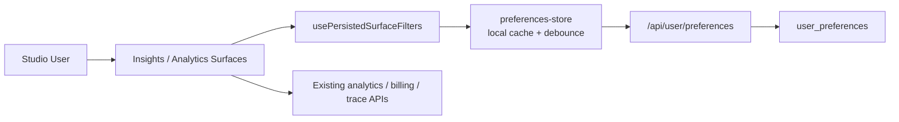
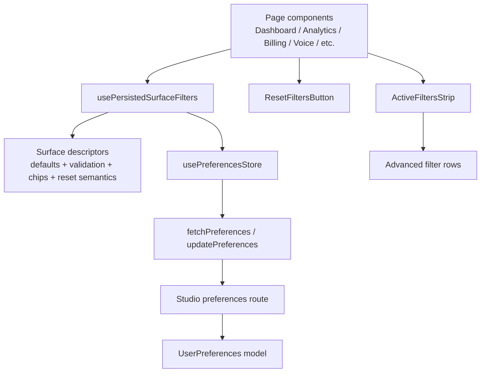
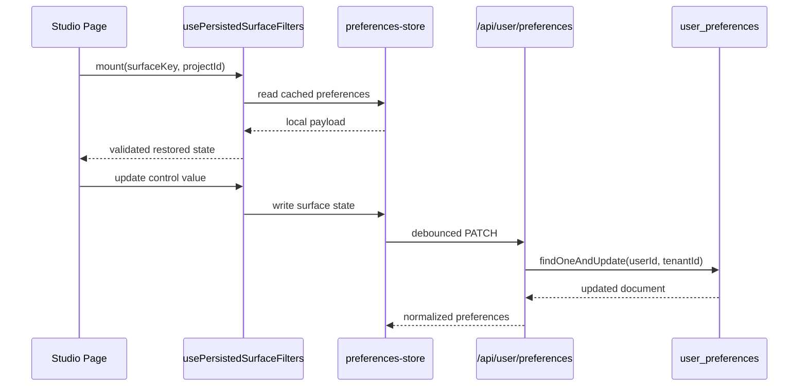

# HLD: Persistent Insights & Analytics Filters

**Feature Spec**: `docs/features/sub-features/persistent-insights-analytics-filters.md`
**Test Spec**: `docs/testing/sub-features/persistent-insights-analytics-filters.md`
**UX Spec**: `docs/specs/persistent-insights-analytics-filters.ux.md`
**Status**: IMPLEMENTED
**Author**: Platform team
**Date**: 2026-04-22

---

## 1. Problem Statement

Insights and Analytics now function as one continuous operator workflow inside Studio, but their filter state is still fragmented into page-local React state. That makes revisits, refreshes, project switching, and cross-device usage feel lossy and repetitive.

The finalized UX design resolves the product behavior:

- persistence is silent and visible only through the controls themselves
- remembered state is partitioned per user, per project, and per surface
- reset affordances scale with surface density
- transient UI state remains ephemeral

The technical problem is to implement that UX without creating a sprawl of page-specific `localStorage` helpers, while preserving Studio performance and avoiding project-state bleed.

---

## 2. Alternatives Considered

### Option A: Per-page `localStorage` helpers

- **Description**: Each page writes its own filter state to a dedicated browser key.
- **Pros**: Small local changes, fast first pass, no backend changes.
- **Cons**: No cross-device restore, duplicated validation, inconsistent defaults/reset behavior, difficult migrations, and likely drift across pages.
- **Effort**: S

### Option B: Shared Studio preferences substrate with local cache and server sync

- **Description**: Extend the existing user-preferences flow with one versioned `insightsAnalyticsFilters` payload, then build a shared `usePersistedSurfaceFilters` hook and shared reset/strip components.
- **Pros**: Cross-device restore, one validation/migration path, consistent semantics across surfaces, local-first performance, and alignment with the final UX tiers.
- **Cons**: Requires touching store, API route, model, and multiple pages together.
- **Effort**: M

### Option C: URL-driven persistence

- **Description**: Encode all filter state into query params and rely on browser history/bookmarks.
- **Pros**: Shareable deep links, transparent state model, no user-preferences schema changes.
- **Cons**: Very noisy URLs, poor fit for dense explorer state, not silent by default, and a mismatch with the finalized UX requirement that persistence be invisible.
- **Effort**: M

### Recommendation: Option B

**Rationale**: The final UX explicitly calls for silent per-user memory, local-first restoration, and cross-device continuity. That maps directly to the existing Studio preferences architecture. Option B achieves the UX while keeping persistence centralized and versionable.

---

## 3. Architecture

### System Context Diagram



### Component Diagram



### Data Flow

1. A page mounts or the active `projectId` changes.
2. `usePersistedSurfaceFilters(surfaceKey)` reads the current project and the cached preferences payload from Zustand persist.
3. The hook validates the raw surface blob against the surface descriptor and falls back per control where needed.
4. The page renders using that restored state immediately.
5. The page updates filters through the hook, which writes the new state into the preference store synchronously.
6. The store debounces server persistence through `PATCH /api/user/preferences`.
7. On app startup or first preference usage, `GET /api/user/preferences` reconciles local cache with the server-backed source of truth.

### Sequence Diagram



---

## 4. The 12 Architectural Concerns

### Structural Concerns

| #   | Concern                 | Design Decision                                                                                                                                                                           |
| --- | ----------------------- | ----------------------------------------------------------------------------------------------------------------------------------------------------------------------------------------- |
| 1   | **Tenant Isolation**    | Preferences are read and written only through `userId + tenantId` scoped Studio route handlers. Project state is nested under the authenticated user's tenant-scoped preference document. |
| 2   | **Data Access Pattern** | Studio pages use a single shared store plus shared hook. The server route uses direct `UserPreferences.findOne` / `findOneAndUpdate` with explicit scoping.                               |
| 3   | **API Contract**        | Extend `GET/PATCH /api/user/preferences` to include `insightsAnalyticsFilters`. Response envelope remains `{ success, data }`.                                                            |
| 4   | **Security Surface**    | No secrets or sensitive runtime data are stored. Route validation is strict at the top level, and client hydration validates per control before use.                                      |

### Behavioral Concerns

| #   | Concern           | Design Decision                                                                                                                                                  |
| --- | ----------------- | ---------------------------------------------------------------------------------------------------------------------------------------------------------------- |
| 5   | **Error Model**   | Preference failures are silent fallbacks to defaults or local cache. User-visible analytics errors remain owned by existing page data hooks, not by persistence. |
| 6   | **Failure Modes** | Corrupt cache, stale schema versions, invalid enums, and server PATCH failures all fail open. Only the affected control resets to default where possible.        |
| 7   | **Idempotency**   | Preference updates are state replacements for a nested surface blob. Repeated writes of the same state are harmless.                                             |
| 8   | **Observability** | Log preference load/save failures and version-mismatch fallbacks. No new runtime trace events are required.                                                      |

### Operational Concerns

| #   | Concern                | Design Decision                                                                                                                                                         |
| --- | ---------------------- | ----------------------------------------------------------------------------------------------------------------------------------------------------------------------- |
| 9   | **Performance Budget** | Local cache is the first read path. Preference writes are debounced. Only compact filter objects are stored. Explorer-heavy components remain lazy-loaded.              |
| 10  | **Migration Path**     | Introduce `version: 1` payload. Unknown or mismatched versions fall back to defaults. Existing `pinnedProjectIds` behavior remains unchanged.                           |
| 11  | **Rollback Plan**      | Revert UI consumers first if needed; the new payload is additive and can safely remain unused in the preference document.                                               |
| 12  | **Test Strategy**      | Unit-test hydration, count, chips, and reset semantics; integration-test the preference route; add E2E coverage for restore, reset, and project isolation across tiers. |

---

## 5. Data Model

### Modified Collections/Tables

```text
Collection: user_preferences
Existing fields:
  - _id: string
  - userId: string
  - tenantId: string
  - pinnedProjectIds: string[]
New field:
  - insightsAnalyticsFilters: {
      version: 1,
      byProject: {
        [projectId: string]: {
          atAGlance?: {...}
          analyticsPage?: {...}
          analyticsSessions?: {...}
          analyticsTraces?: {...}
          analyticsGenerations?: {...}
          billingUsage?: {...}
          agentPerformance?: {...}
          qualityMonitor?: {...}
          customerInsights?: {...}
          voiceAnalytics?: {...}
        }
      }
    }
Indexes:
  - existing { userId: 1, tenantId: 1 } unique
  - existing { tenantId: 1 }
```

### Key Relationships

- One preference document owns all persistent Studio memory for a user inside a tenant.
- Project-specific state is nested under `byProject[projectId]`.
- Surface independence is preserved by separate surface keys under each project.
- Column configuration and ROI settings remain outside this data model.

---

## 6. API Design

### Modified Endpoints

| Method | Path                    | Purpose                                                                                   | Auth                |
| ------ | ----------------------- | ----------------------------------------------------------------------------------------- | ------------------- |
| GET    | `/api/user/preferences` | Return pinned project IDs plus the versioned persistent Insights/Analytics filter payload | `requireTenantAuth` |
| PATCH  | `/api/user/preferences` | Persist or clear the versioned persistent Insights/Analytics filter payload               | `requireTenantAuth` |

### Error Responses

| Code               | Status | Meaning                                    |
| ------------------ | ------ | ------------------------------------------ |
| `INVALID_BODY`     | 400    | Request body is not valid JSON             |
| `VALIDATION_ERROR` | 400    | Preferences payload shape is invalid       |
| `INTERNAL_ERROR`   | 500    | Preferences could not be loaded or updated |

The user-facing UX for these failures remains silent fallback to defaults or cache; the API still returns the standard error envelope.

---

## 7. Cross-Cutting Concerns

- **Audit Logging**: Existing audit-trail plugin on `user_preferences` continues to cover document mutations.
- **Rate Limiting**: No new endpoint is added; existing Studio API protections remain sufficient because writes are debounced client-side.
- **Caching**: Browser-local Zustand persist is the first-layer cache. MongoDB remains the durable source of truth.
- **Encryption**: No new secret material is introduced; preference data remains ordinary application data over existing HTTPS/TLS transport.

---

## 8. Dependencies

### Upstream

| Dependency                    | Type             | Risk                                                       |
| ----------------------------- | ---------------- | ---------------------------------------------------------- |
| `preferences-store`           | Client store     | Medium — all page wiring depends on one shared update path |
| `/api/user/preferences` route | Studio API       | Medium — must stay additive and backward-compatible        |
| `user_preferences` model      | Mongo model      | Low — additive field only                                  |
| Final UX spec                 | Product contract | Low — finalized and explicit                               |

### Downstream

| Consumer                      | Impact                                                        |
| ----------------------------- | ------------------------------------------------------------- |
| Dashboard / Insights pages    | Gain persisted date range and reset behavior                  |
| Analytics shell and explorers | Gain page-shell memory, reset button, and active-filter strip |
| Billing & Voice Analytics     | Gain silent date-memory behavior                              |

---

## 9. Open Questions & Decisions Needed

1. The final UX spec says Traces Explorer persists `activeSubTab` but also says reset should not navigate away from the current sub-tab. Implementation should follow the UX narrative and keep `activeSubTab` persisted but excluded from reset.
2. Phase 1 can ship without named saved views, shared links, or live multi-tab conflict resolution. Those remain explicit follow-ons.

---

## 10. References

- Feature spec: `docs/features/sub-features/persistent-insights-analytics-filters.md`
- Test spec: `docs/testing/sub-features/persistent-insights-analytics-filters.md`
- UX spec: `docs/specs/persistent-insights-analytics-filters.ux.md`
- Existing preference seam: `apps/studio/src/store/preferences-store.ts`, `apps/studio/src/api/preferences.ts`, `apps/studio/src/app/api/user/preferences/route.ts`
