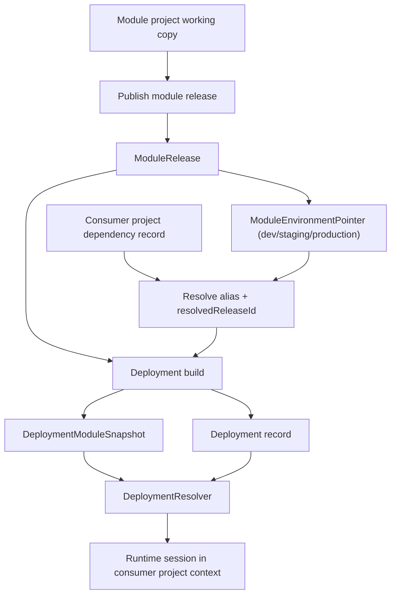

# HLD: Reusable Agent Modules

**Feature Spec**: `docs/features/reusable-agent-modules.md`
**Test Spec**: `docs/testing/reusable-agent-modules.md`
**Status**: APPROVED -- Phase 1 complete, Phase 2 complete
**Date**: 2026-03-23
**Previous Path**: `docs/specs/reusable-agent-modules-phase-plan.hld.md`

**Post-Implementation Note (2026-04-15)**: Follow-up remediation closed the remaining production-wiring gaps that were discovered after the original phase signoff: Studio now exposes reachable module-management pages with project-level dependency hydration, and deployment create/promote now materialize frozen module snapshots before cutover while restoring the previous deployment on failure. See `docs/sdlc-logs/reusable-agent-modules/implementation.log.md`.

## What

Build reusable agent modules as a first-class platform capability so a team can define shared agent logic once, publish immutable releases, and import those releases into multiple projects without copy-paste. Phase 1 should be the smallest slice that proves the full value loop end to end:

- author a module in one project
- preview and publish it in isolation
- import it into another project with a clear alias and explicit pin
- deploy the consumer project with a frozen module snapshot
- execute imported agents and tools inside the consumer project's tenant, project, security, and retention boundaries

This design deliberately avoids "copy project" semantics. Imported modules are dependencies, not duplicated records.

## Principles

### Architecture

1. **A module is still a project.** Reuse the existing project authoring model. Phase 1 should designate an entire project as `kind=module` instead of inventing a second editing surface.
2. **Releases are immutable.** A consumer never points at a mutable working copy. Every import resolves to a concrete `moduleReleaseId`.
3. **Promotion is a pointer update, not a live mutation.** `dev`, `staging`, and `production` environment pointers move; consumers do not move until they explicitly upgrade.
4. **Runtime context always belongs to the consumer project.** Sessions, traces, data retention, auth, env vars, audit, and tenant isolation stay in the importing project.
5. **Secrets never travel with the module.** Module releases can declare prerequisites and logical config slots, but credentials remain in consumer auth profiles and environment variables.
6. **No source-project runtime coupling.** Consumer deployments should not query the source module project's live state during execution.
7. **Do not bolt this onto copy/import flows.** Reuse `project-io` assemblers and prerequisite logic, but do not build module installs on top of `importProjectV2` staged record activation.
8. **Keep Phase 1 parser-safe.** Use deterministic alias-based mounted names rather than adding a new DSL import syntax in the first release.
9. **Visibility is least-privileged by default.** A new module should not automatically appear in every tenant catalog unless the owner explicitly marks it tenant-visible.

### UX and simplicity

1. **A project becomes a module with one explicit action.** No partial-export wizard in Phase 1.
2. **Import requires only three core decisions.** Pick module release, choose alias, satisfy prerequisites.
3. **The platform should explain why an import or deploy is blocked.** Missing env vars, auth profiles, or alias conflicts must return actionable remediation.
4. **Preview should feel familiar.** Module authors should use the existing preview workflow with a preview-only entry agent.
5. **Upgrade remains explicit.** No silent drift from a promoted module release into a live consumer project.
6. **Sensitive values should never be typed into the import dialog.** Phase 1 overrides are non-secret; secrets stay in env vars and auth profiles.

## Existing foundation to reuse

| Existing file(s)                                                  | Reuse in the module design                                                                               |
| ----------------------------------------------------------------- | -------------------------------------------------------------------------------------------------------- |
| `packages/project-io/src/export/project-exporter.ts`              | Base release assembly and portable artifact packaging patterns                                           |
| `packages/project-io/src/export/manifest-generator.ts`            | Manifest generation patterns and prerequisite metadata extraction                                        |
| `packages/project-io/src/types.ts`                                | Existing `ProjectManifestV2` and layered export concepts                                                 |
| `packages/project-io/src/import/prerequisite-validator.ts`        | Pre-import prerequisite validation for env vars, connectors, MCP servers, auth profiles, and permissions |
| `packages/project-io/src/import/auth-profile-resolver.ts`         | Name-to-target auth profile mapping approach for consumer bindings                                       |
| `apps/studio/src/app/api/sdk/preview-token/route.ts`              | Isolated module preview entry point                                                                      |
| `apps/studio/src/app/preview/[projectId]/page.tsx`                | Existing preview UX to extend for module testing                                                         |
| `apps/runtime/src/services/session/session-bootstrap.ts`          | Existing support for `agentName`, environment resolution, and working-copy preview                       |
| `apps/runtime/src/services/deployment-resolver.ts`                | Deployment-aware runtime loading path to extend with mounted module snapshots                            |
| `apps/runtime/src/services/snapshot-service.ts`                   | Proven pattern for immutable deployment-time snapshots                                                   |
| `apps/runtime/src/services/auth-profile/resolve-tool-auth.ts`     | Existing `{{config.KEY}}` support for auth profile indirection                                           |
| `packages/compiler/src/platform/ir/auth-requirement-collector.ts` | Existing auth prerequisite extraction and deduplication behavior                                         |
| `packages/shared/src/tools/resolve-tool-implementations.ts`       | Existing local tool compilation path to extend with imported tools                                       |

## Current constraints that shape the design

| Constraint                                                                                                                                                                       | Why it matters                                                               |
| -------------------------------------------------------------------------------------------------------------------------------------------------------------------------------- | ---------------------------------------------------------------------------- |
| `packages/database/src/models/project.model.ts` has no module-specific fields or related entities                                                                                | We need first-class module nouns before any UI or runtime behavior can exist |
| `packages/database/src/models/deployment.model.ts` models an application deployment with `entryAgentName` and `endpointSlug`                                                     | A module release must not be modeled as a deployable app                     |
| `apps/runtime/src/services/deployment-resolver.ts` resolves only local project agents from deployments, environment pointers, or working copy                                    | Runtime has no concept of imported module bundles today                      |
| `packages/shared/src/tools/resolve-tool-implementations.ts` and `apps/runtime/src/tools/load-project-tools-as-ir.ts` are project-local and carry source `variable_namespace_ids` | Module release assembly must strip or rebind source-specific namespace data  |
| `apps/studio/src/app/api/projects/[id]/import/apply/route.ts` uses staged imports with assumptions that do not match current schemas                                             | Phase 1 should not depend on the staged import activation path               |
| `packages/database/src/cascade/cascade-delete.ts` does not know about module release/dependency entities                                                                         | Project deletion and module cleanup will leak without cascade updates        |

## Recommended phase map

| Phase       | Outcome                                      | Included                                                                                                                                                                                                                                                               | Excluded                                                                                                                                       |
| ----------- | -------------------------------------------- | ---------------------------------------------------------------------------------------------------------------------------------------------------------------------------------------------------------------------------------------------------------------------- | ---------------------------------------------------------------------------------------------------------------------------------------------- |
| **Phase 1** | Core module lifecycle, testable in isolation | module project kind, immutable releases, environment promotion pointers, consumer dependency import, alias-based symbol mounting, consumer deployment snapshots, runtime execution, consumer-project-scoped module catalog, preview in isolation, provenance in traces | transitive module dependencies, partial export selection, advanced data-model mapping UI, reusable workflows/vocabulary/channels, auto-upgrade |
| **Phase 2** | Safer operations and adoption UX             | upgrade workflow, release diffing, reverse dependency graph, richer observability UI, stronger deletion guards, "update available" indicators                                                                                                                          | tenant-admin curation rules, transitive dependencies, additional reusable layers                                                               |
| **Phase 3** | Broader reuse and richer contracts           | data-field mapping DSL, namespace binding UX, reusable non-core layers, tenant-admin curated catalog, optional policy controls                                                                                                                                         | cross-tenant modules, external marketplace distribution                                                                                        |

---

## Phase 1

### Why this is the right Phase 1 boundary

Phase 1 is intentionally the smallest slice that proves the customer story without creating future architectural debt:

- It proves maintenance-once reuse across projects.
- It keeps the mental model simple: "a module is a project with releases."
- It reuses the existing authoring and preview model.
- It avoids transitive dependency resolution, which would otherwise dominate the first implementation.
- It delivers end-to-end runtime behavior, not just packaging.

### Scope

#### In scope

- Mark a project as `kind=module`
- Publish an immutable release from the module project
- Promote releases through `dev`, `staging`, and `production` pointers
- Browse modules from a consumer-project-scoped tenant catalog
- Import a module release into a consumer project with a required alias
- Validate consumer prerequisites before saving the dependency
- Store dependency pins as immutable `resolvedReleaseId` references
- Build a deployment-time module snapshot for the consumer deployment
- Execute imported agents and tools from the consumer project runtime context
- Surface module provenance in traces and runtime metadata
- Preview a module in isolation before publish

#### Explicitly out of scope

- Module importing another module
- Partial exports from a module project
- Automatic consumer upgrades when a pointer moves
- Data-model field mapping UI
- Namespace binding UI beyond the default namespace path
- Reusable workflows, channels, search indexes, vocabularies, or evals
- Cross-tenant reuse

### Phase 1 hard decisions

1. **Use the existing environment vocabulary**: `dev`, `staging`, `production`. Do not add `qa` or `prod` aliases in Phase 1.
2. **Export the entire project** when `Project.kind === 'module'`. No per-agent export list in the first release.
3. **Require a consumer alias** and mount imported symbols as parser-safe names: `<alias>__<symbol>`.
4. **Use config-variable indirection instead of a new binding DSL** for module customization in Phase 1.
5. **Persist a consumer-specific deployment snapshot** so runtime execution never depends on the source module project's mutable state.
6. **Disallow transitive module dependencies** in Phase 1 for simpler resolution, preview, and rollback semantics.
7. **Treat auth profile references as deploy-time validated live bindings.** The current runtime resolves `auth_profile_ref` by name, so Phase 1 must validate those names on import and deploy and document rename/delete as controlled breaking operations.
8. **Keep module discovery consumer-project-scoped in Phase 1.** The first catalog route should inherit the consumer project's tenant context instead of inventing a global module surface up front.
9. **Use one fixed preview entry agent per module project in Phase 1.** Reuse `entryAgentName` rather than introducing a new preview-session protocol.
10. **Make dependency edits conservative.** Phase 1 supports create and delete; alias changes and release swaps use an explicit replace flow.
11. **Do not assume source-project DB-side model config is portable.** If a module needs model-specific behavior in Phase 1, it should come from DSL or release metadata, not live `AgentModelConfig` rows.

### Phase 1 security and governance rules

#### Visibility and permissions

| Action                       | Required access                                                                                           | Expected failure mode                                                          |
| ---------------------------- | --------------------------------------------------------------------------------------------------------- | ------------------------------------------------------------------------------ |
| Mark project as module       | access to source project + `module:manage`                                                                | 404 if project not visible, 403 only after project membership is proven        |
| Browse module catalog        | consumer project access + `module:read`; results filtered to `moduleVisibility='tenant'` or owned modules | empty list or 404 on direct lookup, never leaked metadata                      |
| Publish release              | access to source module project + `module:publish`                                                        | 404 if project outside tenant, 403 if membership exists but permission missing |
| Promote pointer              | access to source module project + `module:publish`                                                        | same as above                                                                  |
| Import dependency            | access to consumer project + `module:import` and catalog visibility to the source module                  | 404 when module is not visible to caller                                       |
| Deploy consumer with modules | consumer project `deployment:create` plus successful resolution of already-pinned releases                | 422 for unmet prerequisites, 404 for invalid project scope                     |
| Archive/delete release       | source module project access + `module:manage` + no active pointers or consumer references                | 409 with dependency/pointer details                                            |

#### Secret and credential safety

- Publish must reject any module tool that contains inline literal secrets in `auth_config`, custom headers, or query/body templates when those values are not templated through `{{env.*}}`, `{{config.*}}`, or auth-profile indirection.
- Publish must not export environment variable values, project config values, tool secret values, or auth profile secret material.
- `configOverrides` on `ProjectModuleDependency` are non-secret only. If a module needs a secret, it must come from the consumer project's env vars or auth profiles.
- Publish must strip source-project-only identifiers from the artifact, including `variableNamespaceIds` and any raw database IDs accidentally denormalized into metadata.
- Module preview and consumer deployment preflight must validate that all required auth profiles, env vars, and config keys exist before runtime execution starts.
- Current runtime auth resolution is name-based through `auth_profile_ref`. Phase 1 should fail deploy preflight when a referenced profile has been renamed or removed, and Phase 2 can consider an ID-based binding model if rename stability becomes a real issue.

#### Delete, archive, and retention rules

- Hard delete of a `ModuleRelease` is blocked while it is referenced by any environment pointer, consumer dependency, or deployment module snapshot.
- Deleting a module project is blocked while any consumer dependency or active deployment snapshot still references one of its releases.
- Removing a dependency or changing its alias must run reference validation against the consumer project's DSL before the change is saved.
- Session data, traces, and retention remain governed by the consumer project's retention settings.
- Module releases and deployment module snapshots are operational metadata, not conversation history; they should not inherit session TTL behavior.

#### Consistency and concurrency rules

- Publishing the same module version twice in parallel must produce a single winning release and one deterministic `409` loser.
- Alias uniqueness is enforced per consumer project. Concurrent attempts to create the same alias must collapse to one successful write.
- A consumer deployment resolves environment pointers to `resolvedReleaseId` once per build and persists that result; pointer moves after snapshot creation do not mutate the deployment.
- Dependency edits and deployment creation must use optimistic conflict detection so a deployment cannot build against a half-updated dependency record.

#### Portability and runtime binding rules

| Concern                                  | Frozen at deployment time? | Phase 1 rule                                                                                 |
| ---------------------------------------- | -------------------------- | -------------------------------------------------------------------------------------------- |
| Module agent/tool source                 | Yes                        | Stored immutably in `ModuleRelease` and mounted into `DeploymentModuleSnapshot`              |
| Consumer env/config values               | Yes                        | Reuse the existing deployment variable snapshot path                                         |
| Auth profile references                  | No                         | Resolved live in the consumer project runtime after preflight validation                     |
| Consumer project runtime config          | No                         | Imported agents run with the consumer project's `ProjectRuntimeConfig`                       |
| Source module project runtime config     | No                         | Does not travel in Phase 1                                                                   |
| Source module DB-side `AgentModelConfig` | No                         | Unsupported for portability in Phase 1 unless mirrored into DSL or explicit release metadata |
| Variable namespace binding               | Yes, by policy             | Imported tools mount into the consumer default namespace only in Phase 1                     |

### Phase 1 domain model

| Entity                     | Purpose                                                 | Key fields                                                                                                                             |
| -------------------------- | ------------------------------------------------------- | -------------------------------------------------------------------------------------------------------------------------------------- | --------------------------------------- | ------------------------------------------------------------------------------------------------ |
| `Project`                  | Existing authoring container, extended with module role | `kind: 'application'                                                                                                                   | 'module'`, `moduleVisibility: 'private' | 'tenant'`, existing `name`, `slug`, `description`, `entryAgentName` as fixed preview entry agent |
| `ModuleRelease`            | Immutable release artifact for a module project         | `tenantId`, `moduleProjectId`, `version`, `artifact`, `contract`, `sourceHash`, `createdBy`, `createdAt`, `archivedAt?`, `archivedBy?` |
| `ModuleEnvironmentPointer` | Current promoted release for each environment           | `tenantId`, `moduleProjectId`, `environment`, `moduleReleaseId`, `revision`, `updatedBy`, `updatedAt`                                  |
| `ProjectModuleDependency`  | Consumer-project dependency record                      | `tenantId`, `projectId`, `moduleProjectId`, `alias`, `selector`, `resolvedReleaseId`, `configOverrides`, `createdBy`, `updatedAt`      |
| `DeploymentModuleSnapshot` | Frozen consumer-specific mounted module bundle          | `tenantId`, `projectId`, `deploymentId`, `snapshotHash`, `dependencies`, `mountedAgents`, `mountedTools`, `createdBy`, `createdAt`     |

### Proposed artifact contracts

#### `ModuleRelease.artifact`

The release artifact should store canonical module sources, not consumer-specific mounted IR.

Recommended shape:

```ts
type ModuleReleaseArtifact = {
  dslFormat: 'legacy' | 'yaml';
  agents: Record<
    string,
    {
      dslContent: string;
      sourceHash: string;
    }
  >;
  tools: Record<
    string,
    {
      dslContent: string;
      toolType: 'http' | 'mcp' | 'sandbox' | 'searchai';
      sourceHash: string;
    }
  >;
};
```

#### `ModuleRelease.contract`

The release contract is derived at publish time and should include:

- provided agents
- provided tools
- required config keys
- required environment variables
- required connectors
- required MCP servers
- required auth profiles
- warnings for unsupported source-specific constructs

#### `DeploymentModuleSnapshot`

The deployment snapshot is consumer-specific and runtime-ready.

Recommended shape:

```ts
type DeploymentModuleSnapshot = {
  dependencies: Array<{
    alias: string;
    moduleProjectId: string;
    moduleReleaseId: string;
    version: string;
  }>;
  mountedAgents: Record<
    string,
    {
      sourceAgentName: string;
      alias: string;
      moduleProjectId: string;
      moduleReleaseId: string;
      ir: AgentIR;
    }
  >;
  mountedTools: Record<
    string,
    {
      sourceToolName: string;
      alias: string;
      moduleProjectId: string;
      moduleReleaseId: string;
      definition: ToolDefinitionLocal;
    }
  >;
  snapshotHash: string;
};
```

### Phase 1 data flow



### Phase 1 UX

#### 1. Convert a project into a module

- Phase 1 should support **convert after creation**, not module-type selection in the new-project flow.
- Surface a simple toggle in module settings: `Project type: Application | Reusable module`.
- Reuse the project's existing `name`, `slug`, and `description`.
- Reuse `entryAgentName` as the fixed preview-only entry agent for module testing.
- Validate that the project has at least one agent before allowing publish.
- Module projects should present a distinct workspace treatment in the dashboard and switcher:
  - show a module badge
  - hide or relabel deploy-first actions
  - surface preview, publish, and releases as the primary actions

#### 2. Preview the module in isolation

- Reuse the existing preview page and preview token flow.
- Keep Phase 1 preview simple: no per-session agent picker.
- If multiple exported agents exist, the author changes the module's fixed preview entry agent in settings before previewing.
- The preview session should use working-copy compilation and should not create a public endpoint or deployment.

#### 3. Publish a module release

- Publish form asks for:
  - version
  - release notes
  - target pointer update choice: none, `dev`, `staging`, or `production`
- Publish flow shows:
  - exported agents and tools
  - required prerequisites
  - warnings about unsupported constructs
- If publish succeeds, the author sees the immutable release ID and current environment pointer mapping.

#### 4. Import into a consumer project

- Import dialog starts from a **consumer-project-scoped module catalog** so it inherits the consumer project's tenant context and 404 semantics.
- User selects:
  - module
  - version or environment pointer
  - alias
- Dialog then validates prerequisites and asks only for missing configuration values.
- Save action stores a `ProjectModuleDependency` record. It does not mutate local agents or tools.
- Phase 1 mutation semantics:
  - create dependency
  - delete dependency
  - replace dependency explicitly when alias or pinned release must change

#### 5. Use the module in the consumer project

- Imported symbols appear grouped by alias in Studio dependency and topology views.
- Consumer authors reference mounted names in Phase 1, for example `benefits__coverage_agent`.
- Imported agents and tools must be visible in:
  - `ABLEditor` symbol browsing
  - `ABLSymbolTree`
  - `ToolPickerDialog`
  - `CoordinationSection`
  - dependency and topology views
- Imported symbols must be marked read-only with provenance badges so they are usable but clearly not locally editable.
- Alias rename should be treated as a breaking change warning because consumer DSL references the alias directly.

### Phase 1 implementation workstreams

#### Workstream A - first-class data model

**Goal:** create stable storage for module releases, environment pointers, dependencies, and deployment snapshots.

**Files to update**

- `packages/database/src/models/project.model.ts`
- `packages/database/src/models/deployment.model.ts`
- `packages/database/src/models/index.ts`
- `packages/database/src/cascade/cascade-delete.ts`
- `apps/studio/src/lib/project-access.ts`
- `apps/studio/src/repos/project-repo.ts`
- `apps/studio/src/services/project-service.ts`
- `apps/studio/src/services/audit-service.ts`

**Files to add**

- `packages/database/src/models/module-release.model.ts`
- `packages/database/src/models/module-environment-pointer.model.ts`
- `packages/database/src/models/project-module-dependency.model.ts`
- `packages/database/src/models/deployment-module-snapshot.model.ts`
- `packages/database/src/__tests__/model-module-release.test.ts`
- `packages/database/src/__tests__/model-project-module-dependency.test.ts`
- `packages/database/src/__tests__/model-deployment-module-snapshot.test.ts`

**Notes**

- Default every existing project to `kind='application'`.
- Default every module project to `moduleVisibility='private'` until explicitly published tenant-wide.
- Add compound indexes for `(tenantId, moduleProjectId, version)`, `(tenantId, moduleProjectId, environment)`, and `(tenantId, projectId, alias)`.
- Project deletion must cascade module releases, environment pointers, dependency records, and deployment module snapshots.
- Deleting a module project with active consumer dependencies should be blocked in the service layer, not hidden as a database error.
- Add service-level reverse dependency queries in Phase 1 even if the user-facing dependency graph UI waits for Phase 2. Delete guards need them immediately.

#### Workstream B - module release builder

**Goal:** create a release artifact and contract without reusing copy/install semantics.

**Files to update**

- `packages/project-io/src/types.ts`
- `packages/project-io/src/export/project-exporter.ts`
- `packages/project-io/src/export/manifest-generator.ts`
- `packages/project-io/src/import/prerequisite-validator.ts`
- `packages/project-io/src/import/auth-profile-resolver.ts`

**Files to add**

- `packages/project-io/src/module-release/build-module-release.ts`
- `packages/project-io/src/module-release/module-contract.ts`
- `packages/project-io/src/module-release/module-selector.ts`
- `packages/project-io/src/module-release/module-publish-safety.ts`
- `packages/project-io/src/__tests__/module-release-builder.test.ts`
- `packages/project-io/src/__tests__/module-contract.test.ts`
- `packages/project-io/src/__tests__/module-selector.test.ts`
- `packages/project-io/src/__tests__/module-publish-safety.test.ts`

**Notes**

- Reuse existing manifest scanning logic, but emit a module-specific artifact contract rather than a full project export.
- Strip source-only identifiers such as `variableNamespaceIds` from released tool metadata.
- Prefer warnings over silent mutation when the source project contains unsupported v1 constructs.
- Do not call `importProjectV2` or staged import activation from the module import flow.
- Add publish-time safety validation that blocks inline literal secrets in tool DSL and blocks artifact content that would embed source-project-only identifiers.
- Phase 1 should only allow explicit non-secret defaults into the module contract. Consumer env and config values are never copied into the release artifact.

#### Workstream C - Studio API and UX

**Goal:** let users author, publish, browse, and import modules with minimal friction.

**Files to update**

- `apps/studio/src/lib/route-handler.ts`
- `apps/studio/src/lib/permissions.ts`
- `apps/studio/src/lib/project-access.ts`
- `apps/studio/src/store/project-store.ts`
- `apps/studio/src/api/projects.ts`
- `apps/studio/src/api/tools.ts`
- `apps/studio/src/app/api/projects/route.ts`
- `apps/studio/src/app/api/projects/[id]/route.ts`
- `apps/studio/src/app/preview/[projectId]/page.tsx`
- `apps/studio/src/app/api/sdk/preview-token/route.ts`
- `apps/studio/src/app/api/projects/[id]/dependencies/route.ts`
- `apps/studio/src/app/api/projects/[id]/topology/route.ts`
- `apps/studio/src/services/audit-service.ts`
- `apps/studio/src/components/projects/ProjectDashboard.tsx`
- `apps/studio/src/components/projects/ProjectCard.tsx`
- `apps/studio/src/components/projects/ProjectSwitcher.tsx`
- `apps/studio/src/components/creation/NewProjectDropdown.tsx`
- `apps/studio/src/components/abl/ABLEditor.tsx`
- `apps/studio/src/components/abl/ABLSymbolTree.tsx`
- `apps/studio/src/components/abl/ToolPickerDialog.tsx`
- `apps/studio/src/components/agent-detail/CoordinationSection.tsx`

**Files to add**

- `apps/studio/src/app/api/projects/[id]/module/route.ts`
- `apps/studio/src/app/api/projects/[id]/module/releases/route.ts`
- `apps/studio/src/app/api/projects/[id]/module/releases/[releaseId]/promote/route.ts`
- `apps/studio/src/app/api/projects/[id]/module-catalog/route.ts`
- `apps/studio/src/app/api/projects/[id]/module-dependencies/route.ts`
- `apps/studio/src/app/api/projects/[id]/module-dependencies/[dependencyId]/route.ts`
- `apps/studio/src/components/modules/ModuleSettingsPanel.tsx`
- `apps/studio/src/components/modules/PublishModuleDialog.tsx`
- `apps/studio/src/components/modules/ImportModuleDialog.tsx`
- `apps/studio/src/components/modules/ModuleDependencyList.tsx`
- `apps/studio/src/__tests__/project-dashboard-modules.test.tsx`
- `apps/studio/src/__tests__/project-switcher-modules.test.tsx`
- `apps/studio/src/__tests__/tool-picker-imported-tools.test.tsx`
- `apps/studio/src/__tests__/coordination-section-imported-agents.test.tsx`
- `apps/studio/src/__tests__/topology-imported-symbols.test.ts`
- `apps/studio/src/__tests__/api-module-routes.test.ts`
- `apps/studio/src/__tests__/api-module-catalog-routes.test.ts`
- `apps/studio/src/__tests__/api-module-dependencies.test.ts`
- `apps/studio/src/__tests__/module-settings-panel.test.tsx`
- `apps/studio/src/__tests__/import-module-dialog.test.tsx`
- `apps/studio/src/__tests__/module-audit-events.test.ts`
- `apps/studio/e2e/reusable-agent-modules-smoke.spec.ts`

**Notes**

- Add four module permissions in Phase 1:
  - `module:read`
  - `module:manage`
  - `module:publish`
  - `module:import`
- Use a consumer-project-scoped catalog route in Phase 1 rather than a global `/api/modules` surface.
- Module catalog listing should be filtered by `moduleVisibility`.
- Keep Phase 1 UI intentionally narrow: publish, browse, import, view current dependencies.
- Project list/get/store payloads should include `kind`, and module projects should render with module-specific actions in dashboard, cards, and switcher surfaces.
- All new module routes should use the same `withRouteHandler` and scoped-access patterns as other Studio project routes, with `404` for cross-tenant or non-visible modules.
- Apply explicit payload, rate-limit, and response-size guards to publish/import routes. The existing `project-io` limits are the baseline to mirror.
- Add audit events for module enable, publish, promote, import, dependency remove, release archive, and delete-blocked actions.
- Add dedicated audit actions for publish, promote, import, remove, and upgrade later:
  - `module_published`
  - `module_promoted`
  - `module_imported`
  - `module_removed`
- Add one Playwright smoke flow for the main UX path instead of trying to prove all browser behavior through unit tests alone.

#### Workstream D - deployment build and module snapshotting

**Goal:** compile imported module sources into a consumer-specific mounted snapshot and pin it at deployment time.

**Files to update**

- `apps/runtime/src/routes/deployments.ts`
- `apps/runtime/src/repos/deployment-repo.ts`
- `apps/runtime/src/services/snapshot-service.ts`
- `apps/runtime/src/services/deployment-resolver.ts`
- `apps/runtime/src/services/session/session-bootstrap.ts`
- `apps/runtime/src/services/version-service.ts`
- `apps/runtime/src/services/preflight-validation-service.ts`
- `apps/runtime/src/services/auth-profile/auth-preflight.ts`
- `apps/runtime/src/services/auth-profile/resolve-tool-auth.ts`
- `apps/runtime/src/services/execution/routing-executor.ts`
- `apps/runtime/src/services/runtime-executor.ts`
- `apps/runtime/src/services/config/project-runtime-config-resolver.ts`
- `apps/runtime/src/services/llm/model-resolution.ts`
- `apps/runtime/src/tools/load-project-tools-as-ir.ts`
- `packages/shared/src/tools/resolve-tool-implementations.ts`
- `apps/runtime/src/services/trace-store.ts`

**Files to add**

- `apps/runtime/src/services/deployments/deployment-build-service.ts`
- `apps/runtime/src/services/modules/module-dependency-service.ts`
- `apps/runtime/src/services/modules/module-snapshot-service.ts`
- `apps/runtime/src/services/modules/module-alias-rewriter.ts`
- `apps/runtime/src/services/modules/module-provenance.ts`
- `apps/runtime/src/services/modules/__tests__/module-alias-rewriter.test.ts`
- `apps/runtime/src/services/modules/__tests__/module-snapshot-service.test.ts`
- `apps/runtime/src/services/deployments/__tests__/deployment-build-service.test.ts`

**Notes**

- If a consumer project has module dependencies, deployment creation should move to a combined-build path:
  - load local agents and tools
  - load module release artifacts
  - rewrite imported symbols with alias-mounted names
  - compile local and imported sources together
  - store local agent versions using a module-aware hash that includes resolved module releases and consumer config bindings
  - store imported mounted IR and tool definitions in `DeploymentModuleSnapshot`
- The current single-agent `VersionService` flow is not sufficient on its own for module-backed deployments. Phase 1 must either extend it or bypass it through `deployment-build-service.ts` when module dependencies exist.
- If a project has no module dependencies, the current deployment path must behave exactly as it does today.
- This workstream is where Phase 1 earns isolation: runtime should read only the frozen deployment snapshot, not the source module project, during execution.
- The deployment snapshot should store enough provenance to explain which module release and alias produced each mounted symbol during incident review.
- Because runtime auth profile resolution is currently name-based through `auth_profile_ref`, deployment preflight must validate those names and fail closed when a referenced profile is missing.
- Deployment preflight must run on the combined mounted bundle, not just local agent names.
- Alias rewriting must cover all runtime coordination surfaces, including routing targets, delegate targets, fan-out targets, `available_agents`, and any coordination metadata keyed by agent name.
- Imported tools mount into the consumer default namespace only in Phase 1.
- Cutover order matters: do not retire the previous active deployment until module resolution, combined compile, snapshot creation, and new deployment persistence have all succeeded.
- `DeploymentModuleSnapshot` should be stored in its own collection and compressed or size-bounded to avoid bloating `Deployment` documents.

#### Workstream E - runtime merge and provenance

**Goal:** make imported agents and tools execute like local assets while preserving module provenance.

**Files to update**

- `apps/runtime/src/services/deployment-resolver.ts`
- `apps/runtime/src/services/execution/types.ts`
- `apps/runtime/src/services/session/session-bootstrap.ts`
- `apps/runtime/src/services/session/types.ts`
- `apps/runtime/src/services/session/redis-session-store.ts`
- `apps/runtime/src/services/session/session-state-repo.ts`
- `apps/runtime/src/services/trace-store.ts`
- `apps/runtime/src/routes/sessions.ts`

**Files to add**

- `apps/runtime/src/__tests__/module-runtime-provenance.e2e.test.ts`
- `apps/runtime/src/__tests__/module-runtime-isolation.e2e.test.ts`

**Notes**

- `ResolvedAgent` can carry module provenance during initial resolution, but Phase 1 must also persist that provenance in serializable session state so rehydrated sessions remain correct across pods.
- Trace payloads should include:
  - `moduleAlias`
  - `moduleProjectId`
  - `moduleReleaseId`
  - `sourceAgentName`
- Local agents should continue producing traces with no module fields.
- The runtime contract should be explicit:
  - mounted module source and consumer env/config bindings are frozen
  - auth profile existence and token state remain live consumer-project dependencies
  - imported agents use the consumer project's runtime config

#### Workstream F - isolated testing harness

**Goal:** make Phase 1 shippable and verifiable before Phase 2 or Phase 3 exist.

**Files to reuse**

- `apps/runtime/src/__tests__/helpers/runtime-api-harness.ts`
- `apps/runtime/src/__tests__/helpers/channel-e2e-bootstrap.ts`

**Files to add**

- `apps/runtime/src/__tests__/module-lifecycle.e2e.test.ts`
- `apps/runtime/src/__tests__/module-preview.e2e.test.ts`
- `apps/runtime/src/__tests__/helpers/module-e2e-bootstrap.ts`

**Notes**

- E2E tests must stay API-only and black-box.
- No direct Mongoose model access in E2E assertions.
- Real servers on random ports, real middleware chain, real deployment creation, real SDK init.

#### Workstream G - rollout guards and operational safety

**Goal:** make Phase 1 safe to release incrementally and safe to turn off.

**Files to update**

- `apps/runtime/src/middleware/feature-gate.ts`
- `apps/runtime/src/routes/platform-admin-features.ts`
- `apps/studio/src/services/audit-service.ts`
- `apps/runtime/src/__tests__/deployment-pipeline.e2e.test.ts`
- `apps/runtime/src/__tests__/deployments-authz.test.ts`

**Files to add**

- `apps/runtime/src/__tests__/module-concurrency.e2e.test.ts`
- `apps/runtime/src/__tests__/module-cutover-safety.e2e.test.ts`
- `apps/studio/src/__tests__/api-module-audit-routes.test.ts`

**Notes**

- Gate Phase 1 behind a tenant-resolved feature flag and keep a kill switch for both Studio and runtime surfaces.
- Add explicit 409 handling for:
  - duplicate module version publish
  - duplicate consumer alias import
  - pointer update races
- Record operational metrics:
  - module publish success/failure rate
  - import validation failure reasons
  - combined compile duration
  - module snapshot size
  - deployment cutover failure count
  - runtime resolution latency for module-backed sessions
- Start with conservative limits and enforce them at validation time. Recommended starting caps:
  - maximum 5 module dependencies per consumer project
  - maximum 250 mounted agents and tools per deployment snapshot combined
- Removal or downgrade flows must validate local DSL references before allowing a dependency change.

### Phase 1 acceptance criteria

Phase 1 is complete when all of the following are true:

1. A project can be marked as `kind=module`.
2. A module project can preview its working copy without creating a public endpoint.
3. A module release can be published and promoted to an environment pointer.
4. A consumer project can import a module release with an alias and explicit pin.
5. The consumer project can deploy with a frozen deployment module snapshot.
6. Imported agents and tools can be referenced and executed from the consumer project.
7. Source module working-copy changes do not change an already-created consumer deployment.
8. Traces clearly show module provenance.
9. Cross-tenant browse, import, and resolution are blocked without leaking existence.
10. Publish rejects inline secret-bearing tool definitions and source-project-only identifiers.
11. Release archive/delete and module project delete are blocked when they would orphan live consumers.
12. Module lifecycle actions emit auditable, sanitized audit events.
13. All Phase 1 unit, integration, E2E, and regression tests pass.
14. Failed module-backed deployments do not retire or break the previously active deployment.
15. Feature-gated rollout can be disabled without affecting projects that never enabled modules.
16. Imported agents and tools are discoverable in authoring surfaces as read-only, provenance-labeled symbols.
17. Module provenance survives persisted session rehydration.

### Phase 1 test suite boundaries

Phase 1 needs four complementary suites. They should not be collapsed into one oversized harness.

1. **Package-level unit tests** in `packages/database` and `packages/project-io`
   - fast schema, contract, selector, and release-builder feedback
2. **Studio route and component tests** in `apps/studio/src/__tests__`
   - Next.js control-plane behavior, permission checks, validation, and action-specific audit logging
3. **Runtime API/E2E tests** in `apps/runtime/src/__tests__`
   - public HTTP-only deployment, session, resolution, and trace behavior with real middleware
4. **Studio browser smoke** in `apps/studio/e2e`
   - verifies the main publish/import UX path is understandable and wired correctly

Do not force publish/import UI coverage into runtime E2E, and do not replace runtime black-box execution tests with mocked Studio route tests. Both are required.

### Phase 1 test plan

#### Unit tests

| ID     | Proposed file                                                                                                                                       | What it proves                                                                                    |
| ------ | --------------------------------------------------------------------------------------------------------------------------------------------------- | ------------------------------------------------------------------------------------------------- |
| P1-U01 | `packages/database/src/__tests__/model-module-release.test.ts`                                                                                      | release uniqueness, tenant scoping, immutable required fields                                     |
| P1-U02 | `packages/database/src/__tests__/model-project-module-dependency.test.ts`                                                                           | alias uniqueness per consumer project and resolved release pin storage                            |
| P1-U03 | `packages/database/src/__tests__/model-deployment-module-snapshot.test.ts`                                                                          | snapshot hash persistence and deployment linkage                                                  |
| P1-U04 | `packages/project-io/src/__tests__/module-release-builder.test.ts`                                                                                  | correct artifact assembly from a module project without channels/workflows                        |
| P1-U05 | `packages/project-io/src/__tests__/module-contract.test.ts`                                                                                         | prerequisite extraction for env vars, auth profiles, connectors, MCP servers, and config slots    |
| P1-U06 | `packages/project-io/src/__tests__/module-selector.test.ts`                                                                                         | selector resolution from version or environment pointer to immutable release ID                   |
| P1-U07 | `apps/runtime/src/services/modules/__tests__/module-alias-rewriter.test.ts`                                                                         | deterministic `<alias>__<symbol>` rewriting for agent handoffs and tool references                |
| P1-U08 | `apps/runtime/src/services/modules/__tests__/module-snapshot-service.test.ts`                                                                       | mounted bundle generation and stable snapshot hash                                                |
| P1-U09 | `apps/runtime/src/services/deployments/__tests__/deployment-build-service.test.ts`                                                                  | combined compile path for local plus imported module sources                                      |
| P1-U10 | `apps/studio/src/__tests__/api-module-routes.test.ts`                                                                                               | request validation, permissions, and 404 isolation for module routes                              |
| P1-U11 | `packages/project-io/src/__tests__/module-publish-safety.test.ts`                                                                                   | publish validator rejects inline literal secrets and source-only IDs                              |
| P1-U12 | `apps/studio/src/__tests__/api-module-dependencies.test.ts`                                                                                         | dependency removal and alias change are blocked when consumer DSL still references mounted names  |
| P1-U13 | `apps/studio/src/__tests__/api-module-audit-routes.test.ts`                                                                                         | module actions emit expected audit events with sanitized metadata                                 |
| P1-U14 | `apps/runtime/src/services/__tests__/version-service.test.ts` or `apps/runtime/src/services/deployments/__tests__/deployment-build-service.test.ts` | local version dedup hash changes when resolved module releases or consumer config bindings change |
| P1-U15 | `apps/runtime/src/services/session/__tests__/session-store-modules.test.ts`                                                                         | serialized session state preserves module provenance across rehydration                           |
| P1-U16 | `apps/studio/src/__tests__/project-dashboard-modules.test.tsx`                                                                                      | project dashboard, card, and switcher show `kind` and module-specific actions correctly           |

#### Integration tests

| ID     | Proposed file                                                                                                                                 | Setup                                                                                             | Assertions                                                                                          |
| ------ | --------------------------------------------------------------------------------------------------------------------------------------------- | ------------------------------------------------------------------------------------------------- | --------------------------------------------------------------------------------------------------- |
| P1-I01 | `packages/project-io/src/__tests__/module-release-builder.test.ts`                                                                            | module project with agents, tools, config refs, and auth refs                                     | release artifact excludes app-only resources and captures prerequisites                             |
| P1-I02 | `apps/studio/src/__tests__/api-module-routes.test.ts`                                                                                         | publish a release and promote pointer                                                             | pointer updates but release stays immutable                                                         |
| P1-I03 | `apps/studio/src/__tests__/api-module-dependencies.test.ts`                                                                                   | import a module with missing env var or auth profile                                              | API returns blocking issues with remediation text                                                   |
| P1-I04 | `apps/runtime/src/services/deployments/__tests__/deployment-build-service.test.ts`                                                            | consumer project with one local agent and one imported module                                     | combined compile succeeds and deployment snapshot is created                                        |
| P1-I05 | `apps/runtime/src/services/modules/__tests__/module-snapshot-service.test.ts`                                                                 | publish release, import into consumer, deploy, then mutate source module project                  | existing deployment snapshot hash remains unchanged                                                 |
| P1-I06 | `apps/runtime/src/__tests__/module-preview.e2e.test.ts`                                                                                       | preview module working copy                                                                       | preview sessions use module project and preview entry agent only                                    |
| P1-I07 | `apps/studio/src/__tests__/api-module-routes.test.ts`                                                                                         | private module owned by one user in the tenant                                                    | catalog hides it until `moduleVisibility` is changed to `tenant`                                    |
| P1-I08 | `apps/studio/src/__tests__/api-module-routes.test.ts`                                                                                         | concurrent publish of the same version                                                            | one release succeeds and the second request returns `409`                                           |
| P1-I09 | `apps/studio/src/__tests__/api-module-routes.test.ts`                                                                                         | attempt to archive/delete a pointed-to or depended-on release                                     | API returns `409` with blocking references                                                          |
| P1-I10 | `apps/studio/src/__tests__/api-module-dependencies.test.ts`                                                                                   | remove dependency or rename alias while DSL still references mounted names                        | save is blocked with actionable remediation                                                         |
| P1-I11 | `apps/studio/src/__tests__/module-audit-events.test.ts`                                                                                       | publish, promote, import, and dependency removal flows                                            | sanitized audit events are emitted for each lifecycle action                                        |
| P1-I12 | `apps/runtime/src/__tests__/module-cutover-safety.e2e.test.ts`                                                                                | previous active deployment exists and new module-backed deployment fails during snapshot creation | previous deployment remains active and traffic-safe                                                 |
| P1-I13 | `apps/studio/src/__tests__/api-module-catalog-routes.test.ts`                                                                                 | same tenant, different consumer project contexts                                                  | project-scoped catalog route only returns modules visible to that consumer project                  |
| P1-I14 | `apps/studio/src/__tests__/tool-picker-imported-tools.test.tsx` and `apps/studio/src/__tests__/coordination-section-imported-agents.test.tsx` | consumer project with one imported module                                                         | imported tools and agents are discoverable, read-only, and provenance-labeled in authoring surfaces |
| P1-I15 | `apps/runtime/src/services/auth-profile/auth-preflight.test.ts`                                                                               | deployed module-backed consumer with missing or renamed auth profile                              | auth preflight fails closed with actionable remediation                                             |

#### End-to-end scenarios

| ID     | Proposed file                                                      | Scenario                                                                                                                                                    |
| ------ | ------------------------------------------------------------------ | ----------------------------------------------------------------------------------------------------------------------------------------------------------- |
| P1-E01 | `apps/runtime/src/__tests__/module-lifecycle.e2e.test.ts`          | author module, publish `1.0.0`, import into consumer project, deploy, start SDK session, route into imported module agent, verify user-visible response     |
| P1-E02 | `apps/runtime/src/__tests__/module-lifecycle.e2e.test.ts`          | publish `1.1.0`, leave consumer pinned to `1.0.0`, deploy both source and consumer again, verify consumer behavior does not change                          |
| P1-E03 | `apps/runtime/src/__tests__/module-runtime-isolation.e2e.test.ts`  | two consumer projects import the same module with different config overrides and environment variables, then verify behavior diverges only where configured |
| P1-E04 | `apps/runtime/src/__tests__/module-runtime-isolation.e2e.test.ts`  | missing prerequisite blocks dependency import or deployment before runtime execution starts                                                                 |
| P1-E05 | `apps/runtime/src/__tests__/module-runtime-isolation.e2e.test.ts`  | import two modules exporting the same agent/tool names, use distinct aliases, and verify deterministic routing and tool execution                           |
| P1-E06 | `apps/runtime/src/__tests__/module-runtime-provenance.e2e.test.ts` | imported agent executes and traces/session detail expose module provenance fields                                                                           |
| P1-E07 | `apps/runtime/src/__tests__/module-runtime-isolation.e2e.test.ts`  | attempt cross-tenant module browse/import/resolve and verify 404 behavior                                                                                   |
| P1-E08 | `apps/runtime/src/__tests__/module-lifecycle.e2e.test.ts`          | delete or change source module working copy after consumer deployment and confirm live consumer deployment keeps working from its snapshot                  |
| P1-E09 | `apps/runtime/src/__tests__/module-lifecycle.e2e.test.ts`          | remove a dependency or change its alias, then verify preview/deploy catches stale local references before activation                                        |
| P1-E10 | `apps/runtime/src/__tests__/module-lifecycle.e2e.test.ts`          | promote an environment pointer while a consumer deployment is building and verify the build pins one concrete release deterministically                     |
| P1-E11 | `apps/runtime/src/__tests__/module-concurrency.e2e.test.ts`        | concurrent publish or import attempts for the same version or alias produce one winner and one clean 409                                                    |
| P1-E12 | `apps/runtime/src/__tests__/module-cutover-safety.e2e.test.ts`     | failed module-backed deployment leaves the currently active deployment serving traffic                                                                      |
| P1-E13 | `apps/runtime/src/__tests__/module-runtime-isolation.e2e.test.ts`  | auth profile is renamed or deleted after dependency import but before deployment or execution, and the platform fails closed with a clear error             |

#### Studio browser smoke

| ID     | Proposed file                                          | Scenario                                                                                                                             |
| ------ | ------------------------------------------------------ | ------------------------------------------------------------------------------------------------------------------------------------ |
| P1-B01 | `apps/studio/e2e/reusable-agent-modules-smoke.spec.ts` | create or open a module project, publish a release, import it into a consumer project, and verify dependency state appears in the UI |
| P1-B02 | `apps/studio/e2e/reusable-agent-modules-smoke.spec.ts` | hit an alias conflict or missing prerequisite and verify the UI shows actionable copy rather than a generic failure                  |
| P1-B03 | `apps/studio/e2e/reusable-agent-modules-smoke.spec.ts` | module project shows preview/publish affordances and hides deploy-first actions that only make sense for applications                |

#### Detailed E2E expectations

##### P1-E01 - publish, import, deploy, execute

**Setup**

- Same tenant
- Project A marked as `kind=module`
- Project B remains `kind=application`
- Project A contains one supervisor agent and one tool

**Steps**

1. Preview Project A in working-copy mode.
2. Publish release `1.0.0` and move the `dev` pointer.
3. From Project B, browse the module catalog and import Project A at `1.0.0` with alias `benefits`.
4. Create a deployment for Project B.
5. Start an SDK session against Project B and send a message that routes into `benefits__...`.

**Assertions**

- Deployment succeeds and creates a `DeploymentModuleSnapshot`.
- Runtime resolves imported mounted agents without querying Project A's working copy.
- Session and trace metadata contain module provenance.
- All data writes remain under Project B's `projectId`.

##### P1-E03 - same module, different consumer configuration

**Setup**

- Two consumer projects in the same tenant
- Same module release imported into both
- Different `configOverrides` or project config variables in each consumer

**Assertions**

- Both consumers use the same source module release ID.
- Response behavior differs only where configured.
- No secret or env var value from Consumer A is visible in Consumer B.

##### P1-E05 - alias collision safety

**Setup**

- Two modules both export `lookup_agent` and `coverage_tool`
- Consumer imports them as `benefits` and `claims`

**Assertions**

- Mounted names are unique and deterministic.
- Local routing to `benefits__lookup_agent` and `claims__lookup_agent` both succeeds.
- Topology/dependency views label them with the correct alias and module provenance.

##### P1-E10 - deployment cutover safety

**Setup**

- Consumer project already has an active deployment in `dev`
- A new module-backed deployment is attempted
- Snapshot creation or combined compile is forced to fail through a public API-visible validation condition, not by mocking internals

**Assertions**

- The previous deployment remains active
- No partial `DeploymentModuleSnapshot` is left referenced by an active deployment
- The failure response is actionable and does not leak internal stack details
- A retry after fixing the validation issue can still succeed cleanly

### Phase 1 regression matrix

| ID     | Regression risk                                                                            | Required assertion                                                                                                  | Likely test location                                                                               |
| ------ | ------------------------------------------------------------------------------------------ | ------------------------------------------------------------------------------------------------------------------- | -------------------------------------------------------------------------------------------------- |
| P1-R01 | Ordinary projects break because `Project` gained `kind`                                    | existing project create/list/update flows still default to `application`                                            | `apps/studio/src/__tests__/api-projects.test.ts`                                                   |
| P1-R02 | Existing deployment path regresses for projects with no module dependencies                | deployment creation behaves exactly as before when no module dependencies exist                                     | `apps/runtime/src/__tests__/deployment-routes.test.ts` plus new deployment build tests             |
| P1-R03 | Existing preview breaks                                                                    | non-module preview still works with the current page and token flow                                                 | `apps/runtime/src/__tests__/module-preview.e2e.test.ts` and existing preview coverage              |
| P1-R04 | Export/import portability is accidentally coupled to module logic                          | `project-io` export/import v2 tests continue to pass without module configuration                                   | existing `packages/project-io/src/__tests__/*` suite                                               |
| P1-R05 | Source `variableNamespaceIds` leak into module releases                                    | release artifact omits source namespace IDs and consumer mounts use consumer context                                | `packages/project-io/src/__tests__/module-release-builder.test.ts`                                 |
| P1-R06 | Auth profile resolution for local tools regresses                                          | existing `{{config.KEY}}` auth resolution still works for non-module projects                                       | existing auth-profile tests plus `apps/runtime/src/__tests__/module-runtime-isolation.e2e.test.ts` |
| P1-R07 | Deployment resolver breaks when no module snapshot exists                                  | resolver continues to load local deployment, environment, and working-copy paths                                    | `apps/runtime/src/__tests__/model-resolution-comprehensive.test.ts` plus new tests                 |
| P1-R08 | Project deletion leaks module records                                                      | cascade delete removes releases, pointers, dependencies, and module snapshots                                       | new database cascade tests                                                                         |
| P1-R09 | Cross-tenant access leaks module existence                                                 | browse/import/resolve returns 404-style behavior, not 403 with resource detail                                      | new Studio and runtime route tests                                                                 |
| P1-R10 | Trace consumers break on new provenance fields                                             | trace events remain backward compatible when module fields are absent                                               | `apps/runtime/src/__tests__/trace-store.test.ts` or new trace coverage                             |
| P1-R11 | Alias rename causes silent consumer breakage                                               | API warns clearly and requires explicit save before alias changes                                                   | `apps/studio/src/__tests__/api-module-dependencies.test.ts`                                        |
| P1-R12 | Source module deletion breaks existing deployments                                         | existing consumer deployment still works from its deployment snapshot; new deployment or upgrade is blocked cleanly | `apps/runtime/src/__tests__/module-lifecycle.e2e.test.ts`                                          |
| P1-R13 | Module publish leaks inline secrets                                                        | publish validation rejects literal secret-bearing tool config and audit logs never record those values              | `packages/project-io/src/__tests__/module-publish-safety.test.ts` and Studio route tests           |
| P1-R14 | Private module metadata leaks in tenant catalog                                            | non-visible modules are hidden until explicitly marked `tenant` visible                                             | `apps/studio/src/__tests__/api-module-routes.test.ts`                                              |
| P1-R15 | Auth profile rename/delete causes silent credential drift                                  | new deployments fail preflight with actionable errors instead of silently binding the wrong profile                 | new module auth preflight coverage                                                                 |
| P1-R16 | Concurrent publish/import creates duplicate state                                          | one winner, one deterministic conflict response, no duplicate releases or aliases                                   | new Studio API tests                                                                               |
| P1-R17 | Concurrent publish of the same module version creates duplicate releases                   | exactly one publish succeeds and the second returns 409                                                             | `apps/runtime/src/__tests__/module-concurrency.e2e.test.ts` or Studio route integration tests      |
| P1-R18 | Concurrent import of the same alias creates duplicate dependencies                         | exactly one dependency record is created per alias per project                                                      | `apps/runtime/src/__tests__/module-concurrency.e2e.test.ts` plus Studio route tests                |
| P1-R19 | Pointer moves between import preview and save, causing silent drift                        | save response returns the actual `resolvedReleaseId` that was pinned                                                | `apps/studio/src/__tests__/api-module-dependencies.test.ts`                                        |
| P1-R20 | Project-scoped catalog route leaks modules outside the consumer project tenant context     | catalog results are derived from the consumer project scope, not a global user-wide lookup                          | `apps/studio/src/__tests__/api-module-catalog-routes.test.ts`                                      |
| P1-R21 | Module provenance is lost after session rehydration or cross-pod resume                    | traces and session detail still show module alias/release/source agent after a persisted reload                     | `apps/runtime/src/__tests__/module-runtime-provenance.e2e.test.ts`                                 |
| P1-R22 | Source DB-side `AgentModelConfig` is silently assumed portable                             | publish/import/deploy either rejects or clearly documents unsupported source DB-only model config                   | runtime and Studio route tests                                                                     |
| P1-R23 | Imported tools bind to source-project namespaces instead of the consumer default namespace | mounted tools resolve against the consumer default namespace only                                                   | module snapshot and auth preflight tests                                                           |
| P1-R24 | Removing a dependency with live mounted references strands local DSL                       | removal is blocked with a validation error that names the referencing agents                                        | `apps/studio/src/__tests__/api-module-dependencies.test.ts`                                        |
| P1-R25 | Module-backed deployment failure retires the last healthy deployment                       | failed cutover leaves the previous deployment active                                                                | `apps/runtime/src/__tests__/module-cutover-safety.e2e.test.ts`                                     |
| P1-R26 | Feature flag off-path regresses ordinary project UX                                        | module UI is hidden or unavailable cleanly when the feature is disabled                                             | `apps/studio/e2e/reusable-agent-modules-smoke.spec.ts` and route tests                             |

### Phase 1 rollout guards

#### Feature gating

- Reuse the existing feature-availability pattern instead of inventing a one-off flag system.
- Runtime touchpoints:
  - `apps/runtime/src/middleware/feature-gate.ts`
  - `apps/runtime/src/routes/platform-admin-features.ts`
- Studio should read the same tenant feature decision and hide module surfaces when disabled.

#### Safe rollout sequence

1. Ship schemas and dormant read paths first.
2. Enable control-plane publish/import routes behind the feature gate.
3. Enable runtime deployment and resolver support for a single internal tenant.
4. Run browser smoke plus runtime E2E for every gated tenant before broader rollout.
5. Keep a kill switch that disables new module publish/import while leaving existing non-module projects untouched.

#### Operational metrics and alerts

- Alert on deployment cutover failures and snapshot creation failures.
- Track publish/import API error rates separately from runtime execution errors.
- Record snapshot size percentiles and combined compile latency percentiles.
- Monitor frequency of blocked prerequisite checks to identify UX friction.

#### Rollback expectations

- Turning the feature off stops new publish/import activity.
- Existing consumer deployments continue to serve from their frozen deployment snapshots.
- Deleting or archiving module releases remains blocked while active consumers exist.

### Phase 1 rollout recommendation

1. Ship behind an internal feature flag in Studio and runtime.
2. Enable Phase 1 first for one tenant that owns both a module project and two consumer projects.
3. Dogfood with a single shared capability such as benefits lookup or identity verification.
4. Add counters and audit visibility for:
   - publish success and failure
   - import success and failure
   - deployment snapshot build failures
   - runtime module resolution failures
5. Do not begin Phase 2 until:
   - all P1 E2E scenarios are green
   - no cross-tenant or deletion regressions remain
   - deployment resolver fallback behavior is proven unchanged for local-only projects

---

## Phase 2

### Outcome

Make modules operationally safe at scale: upgrades are understandable, reverse dependencies are visible, and provenance is available in product surfaces rather than only backend traces.

### Scope

- Update-available indicators for imported dependencies
- Upgrade flow with current-versus-target release diff
- Reverse dependency graph: module -> consumer projects and deployments
- Richer observability surfaces in Studio session/debug views
- Stronger deletion guards and release archival policies

### Likely file touchpoints

- `apps/studio/src/app/api/modules/route.ts`
- `apps/studio/src/app/api/projects/[id]/module-dependencies/route.ts`
- `apps/studio/src/app/api/projects/[id]/module-dependencies/[dependencyId]/route.ts`
- `apps/studio/src/app/api/projects/[id]/dependencies/route.ts`
- `apps/studio/src/components/modules/ModuleDependencyList.tsx`
- `apps/studio/src/components/modules/UpgradeModuleDialog.tsx`
- `apps/runtime/src/routes/deployments.ts`
- `apps/runtime/src/routes/sessions.ts`
- `apps/runtime/src/services/modules/module-provenance.ts`
- `packages/project-io/src/dependencies/dependency-graph.ts`

### Phase 2 tests

| ID     | Scenario                                                                | Proposed file                                               |
| ------ | ----------------------------------------------------------------------- | ----------------------------------------------------------- |
| P2-I01 | consumer sees update available when pointer moves but remains pinned    | `apps/studio/src/__tests__/api-module-dependencies.test.ts` |
| P2-I02 | upgrade diff shows symbol additions, removals, and prerequisite changes | `apps/studio/src/__tests__/module-upgrade-dialog.test.tsx`  |
| P2-I03 | reverse dependency API lists projects and deployments using a release   | `apps/studio/src/__tests__/api-module-routes.test.ts`       |
| P2-E01 | consumer upgrades from `1.0.0` to `1.1.0`, deploys, then rolls back     | `apps/runtime/src/__tests__/module-lifecycle.e2e.test.ts`   |
| P2-R01 | archived or deleted releases are blocked while active consumers exist   | new Studio route tests                                      |

### Phase 2 regression focus

- Upgrade must never mutate a consumer deployment in place.
- Diff views must not rely on source module working copy.
- Reverse dependency queries must stay tenant-scoped and return 404 on cross-tenant access.

---

## Phase 3

### Outcome

Expand modules beyond the core runtime path while keeping the authoring model simple and safe.

### Scope

- Data-field mapping between module expectations and consumer project models
- Namespace binding UX for advanced variable scoping
- Additional reusable layers after validation: workflows, vocabulary, possibly evals
- Tenant-admin curated catalog and publish policies
- Optional transitive module dependencies, only if Phase 1 and Phase 2 prove stable

### Likely file touchpoints

- `packages/project-io/src/types.ts`
- `packages/project-io/src/module-release/module-contract.ts`
- `apps/studio/src/components/modules/*`
- `apps/studio/src/app/api/modules/*`
- `apps/runtime/src/services/modules/*`
- `packages/database/src/models/*module*.ts`

### Phase 3 tests

| ID     | Scenario                                                                             | Proposed file                     |
| ------ | ------------------------------------------------------------------------------------ | --------------------------------- |
| P3-I01 | consumer binds module contract fields to a local project data model                  | new Studio integration tests      |
| P3-I02 | module tool binds to a non-default namespace without leaking source namespace IDs    | new runtime integration tests     |
| P3-E01 | workflow or vocabulary assets imported from a module behave as local consumer assets | new runtime E2E tests             |
| P3-R01 | transitive dependencies, if enabled, remain acyclic and explicitly pinned            | new `project-io` dependency tests |

### Phase 3 regression focus

- Additional reusable layers must not force non-module projects into the module code path.
- Data-model mapping must not create cross-project data reads.
- Namespace binding must not leak source module project identifiers.

---

## Anti-patterns to avoid across all phases

1. **Do not copy module agents or tools into the consumer project's local collections** as the primary import mechanism.
2. **Do not model module releases as ordinary deployments.**
3. **Do not resolve module runtime behavior from source working copies.**
4. **Do not store secrets in module release artifacts.**
5. **Do not introduce a new DSL import syntax in Phase 1.**
6. **Do not allow transitive module dependencies before reverse dependency and upgrade visibility exist.**

## Final recommendation

Ship Phase 1 as a backend-and-runtime-complete slice with intentionally narrow UX:

- module project kind
- publish and promote
- tenant catalog browse
- import with alias
- prerequisite validation
- deployment-time mounted snapshot
- runtime provenance

That slice is simple enough to reason about, strong enough to prove the product value, and isolated enough to test thoroughly before the platform takes on upgrades, governance, or richer reusable asset types.
