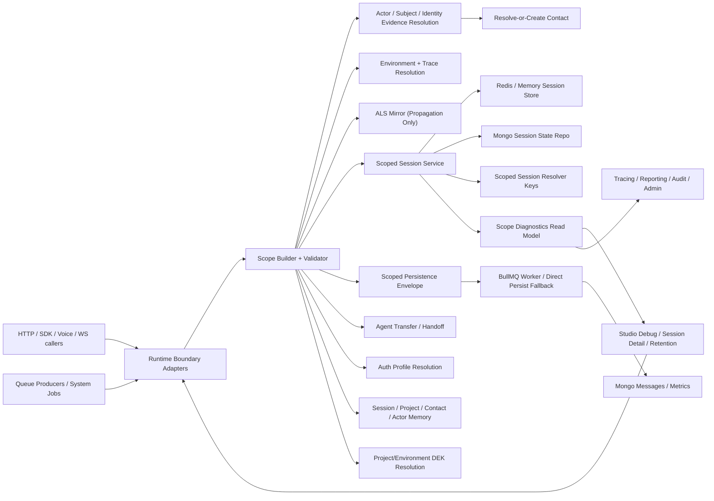
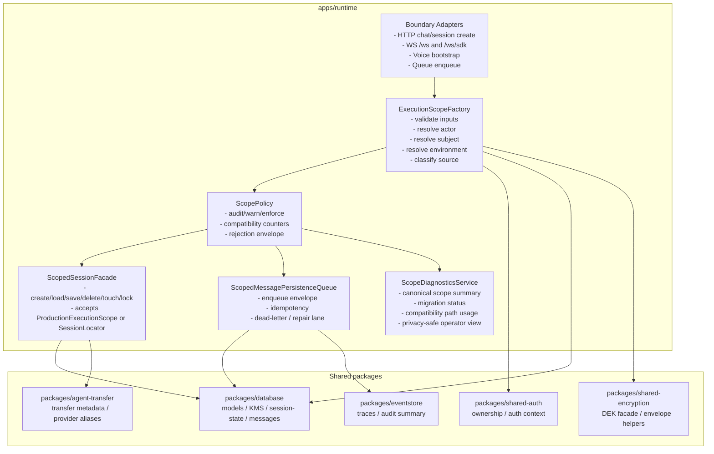
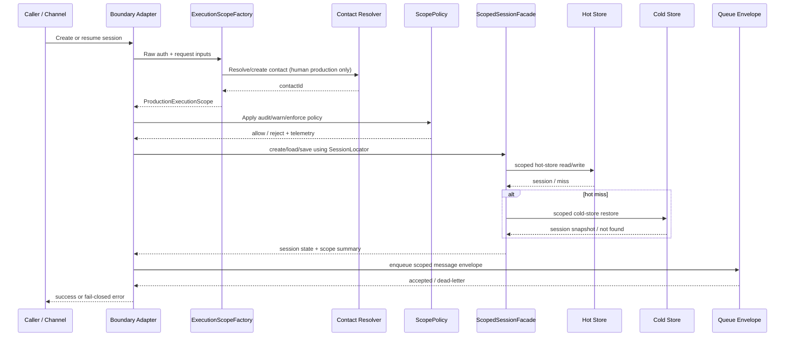

# Session Scope Enforcement -- High-Level Design

**Feature**: Session Scope Enforcement
**Status**: APPROVED
**Feature Spec**: `docs/features/sub-features/session-scope-enforcement.md`
**Test Spec**: `docs/testing/sub-features/session-scope-enforcement.md`
**Parent Feature**: `docs/features/memory-sessions.md`
**Last Updated**: 2026-04-23

---

## 1. Problem Statement

The runtime currently treats `sessionId` as the practical capability token even though the platform’s core invariants require tenant, project, and caller isolation. The root cause is architectural drift:

- production boundaries sometimes pass explicit scope
- deeper layers sometimes rely on AsyncLocalStorage
- hot-store, cold-store, and queue paths still normalize missing scope into empty values, late repair, or route-local ownership checks

That inconsistency makes critical paths fail late instead of fail closed. It also leaves the system with multiple incompatible meanings for the old `userId` slot: Studio/debug operator, session principal, anonymous end user, customer/contact surrogate, or service automation.

The target design is a single explicit scope architecture:

- every production session operation is driven by a validated `ProductionExecutionScope`
- every persisted session operation uses a scoped locator rather than bare `sessionId`
- every production scope carries a runtime-generated `sessionPrincipalId` as the private continuity lane for that session
- every human production session resolves to a canonical `contactId`
- actor, subject, session principal, and identity evidence stay distinct
- debug and system flows become explicit discriminated variants instead of “missing scope”
- migration, reporting, tracing, Studio diagnostics, auth profiles, memory, and DEK use all align around the same canonical scope summary

This HLD chooses the architecture that makes scope impossible to forget on the production path while still allowing phased rollout, compatibility telemetry, bounded rollback, and migration of legacy rows and queue artifacts.

---

## 2. Alternatives Considered

### Alternative A: Boundary Validation Only, Keep Existing Internal Contracts

**Description**: Add stricter validation at HTTP/WS/queue boundaries but keep existing `SessionStore`, Redis reverse lookup, Mongo cold-store helpers, and queue payloads mostly unchanged internally.

**Pros**:

- Lowest short-term implementation cost
- Minimal public API churn
- Quickest path to initial fail-closed coverage at the edge

**Cons**:

- Internal code still operates on bare `sessionId`
- ALS and fallback helpers remain implicit sources of truth
- Debug/system exceptions still bleed into production abstractions
- Reporting, auth-profile resolution, memory, and Studio remain inconsistent
- Easy for future code to bypass the boundary assumptions

**Effort**: M

### Alternative B: Explicit Scope and Locator Architecture with Phased Compatibility (Selected)

**Description**: Introduce typed `ExecutionScope`, `SessionLocator`, and `PrivilegedSessionLocator` contracts; require them at production boundaries and store/service seams; mirror validated scope into ALS only after validation; migrate data and queues through staged compatibility lanes.

**Pros**:

- Makes production scope a durable invariant instead of a convention
- Unifies actor, subject, ownership, tracing, metrics, and diagnostics
- Supports phased rollout with `audit -> warn -> enforce`
- Keeps debug/system flows explicit and isolated
- Aligns authorization scope with encryption scope for project-scoped artifacts

**Cons**:

- Broader cross-package implementation surface
- Requires migration and compatibility instrumentation
- Requires deliberate read-model changes for Studio/admin/reporting

**Effort**: L

### Alternative C: Full Storage Rewrite and Big-Bang Migration

**Description**: Replace hot-store, cold-store, queue payloads, and related read models all at once, cutting directly from the old optional session model to the new scope model with no compatibility lane.

**Pros**:

- Cleanest theoretical end state
- No transitional compatibility logic once complete

**Cons**:

- Highest blast radius on a critical runtime path
- Difficult rollback story
- Requires production data migration, queue draining, and Studio/read-model cutover to succeed together
- Increases outage risk for a foundational security feature

**Effort**: XL

### Recommendation

**Alternative B** is the selected approach.

It is the only option that is both future-ready and operationally safe. The architecture must change at the type and service boundary level, not just at route validation, but this needs to happen with a bounded compatibility lane and a reversible rollout. The chosen design makes production scope explicit everywhere it matters, while still allowing phased migration of storage, queue, Studio, reporting, and encryption consumers.

---

## 3. Architecture

### System Context Diagram



### Component Diagram



### Core Contracts

```ts
type SessionSubject =
  | { kind: 'contact'; contactId: string }
  | {
      kind: 'service_principal';
      principalType: 'workflow' | 'agent' | 'integration';
      principalId: string;
    };

type SessionActor =
  | { kind: 'contact'; contactId: string }
  | { kind: 'platform_user'; userId: string }
  | { kind: 'api_key'; keyId: string }
  | {
      kind: 'service_principal';
      principalType: 'workflow' | 'agent' | 'integration';
      principalId: string;
    };

type IdentityGrantScope =
  | 'session'
  | 'same_channel'
  | 'project_contact'
  | 'cross_channel'
  | 'service';

type IdentityEvidence = {
  identityTier: 0 | 1 | 2;
  verificationMethod: string;
  verificationAttemptId?: string;
  verifiedAt?: string;
  policySource: 'runtime_default' | 'channel_policy' | 'project_policy' | 'tenant_policy';
  grantScope: IdentityGrantScope;
  artifacts: Array<{
    type: 'external' | 'phone' | 'email' | 'cookie' | 'caller_id' | 'device_id';
    valueHash: string;
  }>;
};

type ProductionExecutionScope = {
  kind: 'production';
  tenantId: string;
  projectId: string;
  sessionId: string;
  sessionPrincipalId: string;
  channelId: string;
  environment: string;
  source: string;
  authType: string;
  actor: SessionActor;
  subject: SessionSubject;
  identityEvidence: IdentityEvidence;
  traceId: string;
  callerContext: Record<string, unknown>;
};

type DebugExecutionScope = {
  kind: 'debug';
  debugSessionId: string;
  studioUserId: string;
  traceId: string;
  source: 'studio_debug' | 'studio_preview';
};

type SystemExecutionScope = {
  kind: 'system';
  tenantId?: string;
  projectId?: string;
  jobId: string;
  traceId: string;
  actor: Extract<SessionActor, { kind: 'service_principal' }>;
  source: string;
};

type SessionLocator = {
  kind: 'production';
  tenantId: string;
  projectId: string;
  sessionId: string;
};

type PrivilegedSessionLocator = {
  tenantId: string;
  sessionId: string;
  requestedProjectId?: string;
  accessReason: 'admin_investigation' | 'migration' | 'gdpr' | 'audit_replay';
  actor: Exclude<SessionActor, { kind: 'contact' }>;
  traceId: string;
  redactIdentities: boolean;
};
```

`sessionPrincipalId` is mandatory for every production scope, including anonymous and pre-verification sessions. It is the runtime-generated continuity handle for exactly one session and must never be reused as a substitute for human `contactId`, actor provenance, or verified identity.

### Data Flow

#### Production Session Create / Resume

1. A production entry point receives a request on HTTP, WebSocket, SDK, or voice.
2. The boundary adapter authenticates the caller and gathers raw scope inputs.
3. `ExecutionScopeFactory` validates tenant/project/channel/auth inputs and classifies the request as `production`, `debug`, or `system`.
4. For human production flows, the boundary resolves or creates a `Contact` before session creation completes.
5. The boundary constructs a `ProductionExecutionScope` with explicit `sessionPrincipalId`, `subject`, `actor`, `identityEvidence`, `environment`, `source`, and `traceId`.
6. `ScopePolicy` applies rollout mode:
   - `audit`: allow current behavior but emit compatibility telemetry
   - `warn`: allow bounded compatibility paths and emit warnings/counters
   - `enforce`: reject invalid or incomplete production scope
7. The validated scope is mirrored into ALS for deep DB/plugin access.
8. `ScopedSessionFacade` creates, loads, saves, locks, deletes, and touches sessions using `SessionLocator` rather than bare `sessionId`.
9. Hot store, cold store, ownership checks, and diagnostics all read the same canonical scope summary.

#### Queue Enqueue / Persistence

1. Runtime producer code receives a validated `ProductionExecutionScope`.
2. The producer creates a scoped persistence envelope that includes:
   - `sessionLocator`
   - `sessionPrincipalId`
   - canonical `subject` and `actor`
   - evidence summary
   - `traceId`, `source`, `authType`
   - idempotency key
3. If scope is missing in `enforce`, enqueue fails closed.
4. In `warn`, legacy payloads may enter a bounded dead-letter/repair lane.
5. The worker persists messages and metrics without reconstructing actor or project later.
6. Worker traces and audit events emit the same canonical scope summary used elsewhere.

#### Privileged Admin / GDPR / Audit Reads

1. Admin and observability surfaces use `PrivilegedSessionLocator`, not production request locators.
2. Access reason, actor, redaction mode, and trace ID are mandatory.
3. The read path fetches the same underlying session and diagnostics data, but applies privacy-preserving projection rules.
4. Privileged access is audited as a separate event class from production session access.

### Sequence Diagram



---

## 4. The 12 Architectural Concerns

### Structural Concerns

| #   | Concern                 | Design Decision                                                                                                                                                                                                                                                                                                                                                                                                                                                                                                                                                                                                                                      |
| --- | ----------------------- | ---------------------------------------------------------------------------------------------------------------------------------------------------------------------------------------------------------------------------------------------------------------------------------------------------------------------------------------------------------------------------------------------------------------------------------------------------------------------------------------------------------------------------------------------------------------------------------------------------------------------------------------------------- |
| 1   | **Tenant Isolation**    | All production session operations require `tenantId + projectId + sessionId` through `SessionLocator`. The production scope also carries a first-class `sessionPrincipalId` so anonymous and pre-verification traffic has a canonical provenance slot before contact linkage completes. Human production sessions additionally anchor to tenant-scoped `contactId`, but project scope remains mandatory for runtime access. Wrong-tenant, wrong-project, and wrong-owner reads return non-leaky `404` responses.                                                                                                                                     |
| 2   | **Data Access Pattern** | Boundary code builds explicit scope; `ScopedSessionFacade` and storage adapters consume `ProductionExecutionScope` or `SessionLocator`; ALS is propagation only. Hot store, cold store, queue workers, ownership filters, and diagnostics all move to one shared scope summary contract. Bare `load(sessionId)` / `delete(sessionId)` production paths are removed.                                                                                                                                                                                                                                                                                  |
| 3   | **API Contract**        | No brand-new public API is required for phase 1. Existing session create/resume/bootstrap routes tighten behavior. Public failures use stable envelopes: `400 INVALID_SESSION_SCOPE`, `400 UNSUPPORTED_SCOPE_KIND`, `401 AUTHENTICATION_REQUIRED`, and non-leaky `404 SESSION_NOT_FOUND` for cross-scope/wrong-owner access. Session detail surfaces gain an additive `scopeDiagnostics` payload instead of inventing separate identity APIs.                                                                                                                                                                                                        |
| 4   | **Security Surface**    | `userContext.userId` and similar client hints are non-authoritative. Authoritative human identity comes from verified bootstrap or trusted identity evidence resolved to `contactId`. `sessionPrincipalId`, `subject`, `actor`, and `identityEvidence` remain deliberately separate so anonymous continuity, delegated action, and verified human identity do not collapse into one field. Debug and system use separate discriminated contracts. Project-scoped session artifacts use project/environment-scoped DEKs, while contact identity crypto remains tenant-scoped by design. Privileged reads require a separate audited locator contract. |

### Behavioral Concerns

| #   | Concern           | Design Decision                                                                                                                                                                                                                                                                                                                                                                                             |
| --- | ----------------- | ----------------------------------------------------------------------------------------------------------------------------------------------------------------------------------------------------------------------------------------------------------------------------------------------------------------------------------------------------------------------------------------------------------- |
| 5   | **Error Model**   | Production boundaries reject incomplete or wrong-kind scope before session state mutates. Queue payloads missing required scope fail at enqueue in `enforce` and route to a bounded repair lane in `warn`. Migration-invalid sessions are quarantined/expired and presented as unavailable to production callers while internal diagnostics surface the true reason.                                        |
| 6   | **Failure Modes** | Reverse-lookup expiry, cold-store misses, contact-resolution failures, queue persistence failures, and KMS lookup failures all fail closed on the production path. Compatibility paths are explicit, time-boxed, and telemetry-backed. No empty-string tenant namespace or late actor repair remains in the target design.                                                                                  |
| 7   | **Idempotency**   | Session create/resume remains idempotent around scoped resolution keys and session principals. Queue persistence keeps idempotency keys and deterministic migration classifiers. Migration tasks are re-runnable: backfill, re-encrypt, quarantine, and diagnostics projection all operate with deterministic target keys and status tracking.                                                              |
| 8   | **Observability** | Runtime emits counters and traces for scope construction, compatibility-path use, rejection reason, migration classification, queue dead-letter volume, and DEK-scope classification. Session detail becomes the operator-facing source of truth via `scopeDiagnostics`. Historical trace replay and live traces share the same canonical session-principal, subject, actor, and identity-evidence summary. |

### Operational Concerns

| #   | Concern                | Design Decision                                                                                                                                                                                                                                                                                                                                                                                                              |
| --- | ---------------------- | ---------------------------------------------------------------------------------------------------------------------------------------------------------------------------------------------------------------------------------------------------------------------------------------------------------------------------------------------------------------------------------------------------------------------------- |
| 9   | **Performance Budget** | Boundary scope resolution should add only bounded synchronous work to the hot path: target p95 incremental overhead under 50 ms for HTTP/WS bootstrap excluding external identity-verification hops. Contact resolution should be a single resolve-or-create operation. Queue enqueue remains O(1) relative to message payload size. Diagnostics are derived from persisted summaries instead of scanning raw session state. |
| 10  | **Migration Path**     | Roll out in four phases: Phase 0 adversarial tests + telemetry, Phase 1 boundary enforcement and enqueue envelopes, Phase 2 storage/service/ALS propagation plus diagnostics and ownership updates, Phase 3 discriminated debug/system separation and compatibility removal. Cross-cutting FR-13 to FR-21 may split into sibling workstreams if they threaten the boundary-enforcement critical path.                        |
| 11  | **Rollback Plan**      | Rollout mode is explicit: `audit -> warn -> enforce`, with documented rollback from `enforce` back to `warn`. The compatibility lane is bounded and observable. Production stores keep backward-readable fields during rollout, so rollback does not require data reversal; only enforcement toggles and compatibility projections change.                                                                                   |
| 12  | **Test Strategy**      | Follow the test spec exactly: red adversarial tests first, then implementation. Unit coverage for scope builders/classifiers, integration coverage for Redis/Mongo/BullMQ/KMS/auth-profile/memory seams, and black-box E2E coverage for HTTP, SDK, WS, voice, Studio proxy, diagnostics, rollback, and migration scenarios.                                                                                                  |

---

## 5. Data Model

### New Runtime Contracts

1. `ExecutionScope` discriminated union
2. `SessionLocator` for production session operations
3. `PrivilegedSessionLocator` for admin/GDPR/observability
4. `SessionSubject`, `SessionActor`, `sessionPrincipalId`, and `IdentityEvidence`
5. `ScopeDiagnostics` read-model payload

### Modified Persisted Session Shape

The hot-store `SessionData` and durable session snapshots should carry explicit scope metadata rather than optional free-form identity fields.

**Additions / target fields**

- `scopeKind: 'production' | 'debug' | 'system'`
- `scopeVersion: number`
- `sessionLocator: { tenantId, projectId, sessionId }`
- `sessionPrincipalId`
- `subject: SessionSubject`
- `actor: SessionActor`
- `identityEvidenceSummary: { identityTier, verificationMethod, verificationAttemptId?, verifiedAt?, policySource, grantScope, artifactTypes[] }`
- `channelId`
- `source`
- `authType`
- `environment`
- `traceId`
- `migrationStatus: 'native' | 'backfilled' | 'compatibility' | 'quarantined'`
- `compatibilityPathUsed?: string`

**Legacy fields retained temporarily**

- `userId`
- `callerContext`
- legacy `customerId` / `anonymousId` / `channelArtifact`-derived semantics in read compatibility paths only

### Message / Queue Envelope

`MessageJobData` evolves into a scoped persistence envelope:

- `sessionLocator`
- `sessionPrincipalId`
- `subject`
- `actor`
- `identityEvidenceSummary`
- `traceId`
- `source`
- `authType`
- `projectId` and `tenantId` required for production payloads
- `migrationStatus` / `compatibilityPathUsed` optional for rollout telemetry

Workers persist from this envelope directly; they do not reconstruct missing project or actor context from raw session lookups in steady state.

### Diagnostics Read Model

No new collection is required in phase 1. `ScopeDiagnosticsService` composes a canonical operator view from persisted session summary fields plus migration metadata:

- `scopeSummary`
- `migrationStatus`
- `compatibilityPathUsed`
- `legacyIdentitySummary`
- `encryptionScopeSummary`
- `ownershipSummary`

This read model is consumed first by session detail and then reused by traces, retention, transfer, and admin views.

### Key Relationships

- Human production session -> canonical `Contact`
- Non-human production/system session -> `service_principal`
- Session diagnostics -> session + trace + queue + migration metadata
- Project-scoped session artifacts -> project/environment DEK
- Contact identity registry -> tenant-scoped DEK / blind index / crypto-shred lifecycle

### Index and Query Implications

Target indexes for durable session/message stores:

- `{ tenantId: 1, projectId: 1, sessionId: 1 }`
- `{ tenantId: 1, projectId: 1, 'subject.kind': 1, 'subject.contactId': 1, createdAt: -1 }` for human history/continuity views
- `{ tenantId: 1, projectId: 1, 'actor.kind': 1, createdAt: -1 }` for operator and auth-profile diagnostics
- `{ migrationStatus: 1 }` for rollout inventory and cleanup

---

## 6. API Design

### New Public Endpoints

No new public endpoint is required for the first rollout. Existing runtime and Studio surfaces are tightened or enriched.

### Modified Endpoints / Entry Surfaces

| Method / Surface | Path / Contract                                             | Purpose                                                                                                    | Auth                                   |
| ---------------- | ----------------------------------------------------------- | ---------------------------------------------------------------------------------------------------------- | -------------------------------------- |
| `POST`           | `/api/projects/:projectId/sessions`                         | Build and validate `ProductionExecutionScope` before creating a production session.                        | Project-scoped Studio/runtime auth     |
| `POST`           | `/api/v1/chat/:agentName` and related chat bootstrap routes | Reject missing or malformed production scope before session creation or reuse.                             | Existing runtime auth                  |
| `POST`           | `/api/v1/livekit/token`                                     | Preflight canonical contact-backed production scope before issuing a token or starting LiveKit work.       | Existing runtime auth                  |
| `WS`             | `/ws`                                                       | Require correct `ExecutionScope` kind for production vs debug/system entry.                                | Existing runtime/session auth          |
| `WS`             | `/ws/sdk`                                                   | Build canonical production scope from verified bootstrap, trusted evidence, and contact resolution.        | `sdk_session`                          |
| Voice ingress    | Existing Twilio/media bootstrap routes                      | Resolve/create `contactId` before durable production session persistence and fail closed on invalid scope. | Channel/provider trust + project scope |
| Queue enqueue    | Internal producer API                                       | Require scoped persistence envelope in steady state.                                                       | Internal runtime                       |
| Session detail   | Existing runtime/admin/session detail route(s)              | Return additive `scopeDiagnostics` payload for Studio and admin consumers.                                 | Project or privileged admin auth       |

### Error Responses

| Code                          | HTTP Status                         | Meaning                                                                                         | Notes                                                                    |
| ----------------------------- | ----------------------------------- | ----------------------------------------------------------------------------------------------- | ------------------------------------------------------------------------ |
| `INVALID_SESSION_SCOPE`       | `400`                               | Missing or malformed production scope fields                                                    | Used when boundary inputs cannot form a valid `ProductionExecutionScope` |
| `UNSUPPORTED_SCOPE_KIND`      | `400`                               | Wrong discriminant for the entry surface                                                        | Example: debug payload sent to production route                          |
| `PAYLOAD_TOO_LARGE`           | `413`                               | Request or follow-up `sessionMetadata` exceeds the supported boundary or post-merge size budget | Must be returned instead of silently dropping `_metadata` updates        |
| `AUTHENTICATION_REQUIRED`     | `401`                               | Caller lacks required auth                                                                      | Existing auth behavior remains                                           |
| `SESSION_NOT_FOUND`           | `404`                               | Session missing, cross-scope, wrong-owner, or quarantined from caller perspective               | Non-leaky not-found behavior                                             |
| `SCOPE_COMPATIBILITY_WARNING` | `200`/`202` internal telemetry only | Compatibility path used under `warn`                                                            | Not a public error; emitted in logs/diagnostics                          |

### Diagnostics Payload

The session-detail response should gain an additive payload:

```json
{
  "scopeDiagnostics": {
    "scopeKind": "production",
    "sessionLocator": { "tenantId": "...", "projectId": "...", "sessionId": "..." },
    "sessionPrincipalId": "sessp_123",
    "subject": { "kind": "contact", "id": "contact-123" },
    "actor": { "kind": "platform_user", "id": "user-123" },
    "identityEvidenceSummary": {
      "identityTier": 2,
      "verificationMethod": "otp",
      "verificationAttemptId": "verify_123",
      "verifiedAt": "2026-04-23T10:12:00.000Z",
      "policySource": "project_policy",
      "grantScope": "project_contact",
      "artifactTypes": ["external", "phone"]
    },
    "migrationStatus": "native",
    "compatibilityPathUsed": null,
    "encryptionScope": { "tenantId": "...", "projectId": "...", "environment": "prod" }
  }
}
```

The operator-facing UI should use this payload as the canonical source of truth.

### Post-Implementation Notes (2026-04-16)

- `apps/runtime` now has the core scope contracts and scoped locator seams in place for converted production session create, load, cold-restore, and follow-up persistence paths.
- Converted voice/runtime boundaries currently include HTTP chat bootstrap, LiveKit token issuance, and Twilio media bootstrap. These paths now preflight canonical production scope and fail closed instead of degrading silently.
- Follow-up `sessionMetadata` validation now propagates typed `413 PAYLOAD_TOO_LARGE` failures through converted runtime paths instead of logging and dropping the update.
- Remaining program work is downstream and cross-cutting: Studio read models, reporting/audit surfaces, auth-profile and memory semantics, migration jobs, and DEK alignment are still separate follow-on slices.

---

## 7. Cross-Cutting Concerns

- **Audit Logging**: Log scope validation, compatibility-path use, privileged locator reads, migration quarantine, DEK-scope classification, and rollback-mode changes with `traceId`, `source`, `sessionPrincipalId`, `actor`, and privacy-safe subject/evidence summaries.
- **Rate Limiting**: Existing ingress rate limits remain. Invalid-scope requests still consume rate limit budget to avoid probing abuse. Privileged locator reads should use admin-focused limits.
- **Caching**: ALS is propagation-only and not an authority cache. Hot-store resolution keys remain, but all keys are scoped by tenant+project+channel/session semantics. Diagnostics should read persisted summaries, not rebuild from multiple raw stores on every request.
- **Encryption**: Production session artifacts use `tenantId + projectId + environment` DEKs. Contact identity encryption remains tenant-scoped. Compatibility telemetry must identify legacy ciphertext that still uses tenant-wide wrappers for project-scoped session data.

---

## 8. Dependencies

### Upstream Dependencies

| Dependency                                             | Type                        | Risk                                                |
| ------------------------------------------------------ | --------------------------- | --------------------------------------------------- |
| `apps/runtime` session/bootstrap/store code            | Core runtime dependency     | High — primary implementation surface               |
| `packages/database` session/message/KMS/contact models | Persistence + encryption    | High — affects storage and migration                |
| `packages/shared-auth` ownership / auth context        | Authorization               | High — caller semantics and not-found isolation     |
| `packages/shared-encryption`                           | Crypto helpers              | Medium — DEK contract alignment                     |
| `packages/eventstore`                                  | Audit / trace summary       | Medium — canonical subject/actor replay             |
| `packages/agent-transfer`                              | Handoff / provider aliasing | Medium — human subject vs transport alias semantics |
| `apps/studio` proxy/detail/retention surfaces          | Operator diagnostics        | Medium — additive but cross-cutting                 |
| `packages/web-sdk`                                     | Bootstrap identity hints    | Medium — docs and semantics, low wire break         |

### Downstream Consumers

| Consumer                                            | Impact                                                      |
| --------------------------------------------------- | ----------------------------------------------------------- |
| Runtime session create/resume and queue persistence | Direct contract change                                      |
| Studio session detail / traces / retention / debug  | New diagnostics and stricter semantics                      |
| Reporting / metrics / insights                      | New canonical dimensions and migration telemetry            |
| Admin and audit tooling                             | Separate privileged locator and privacy-safe summaries      |
| Voice / SDK / omnichannel features                  | Stronger contact anchoring, less route-local reconstruction |
| Auth-profile and memory flows                       | Canonical actor vs subject ownership                        |

---

## 9. Decisions Confirmed

No unresolved architecture questions remain for HLD.

The following decisions are already locked and this HLD implements them:

1. Admin/observability reads use a separate `PrivilegedSessionLocator`.
2. Human production sessions always anchor to `contactId`; non-human flows use `service_principal`.
3. `environment` is explicit in production runtime scope.
4. Service principals use shared/project-safe auth profiles by default.
5. Human memory migrates to contact-backed ownership through compatibility-read migration, not long-lived dual write.
6. GDPR/retention keeps a bounded legacy compatibility scan during migration.
7. Rollout is phased and reversible through `audit -> warn -> enforce`.

Implementation prerequisites, not architecture blockers:

- run migration inventory queries to size legacy session, queue, and ciphertext populations
- choose rollout thresholds for switching from `warn` to `enforce`
- validate voice E2E CI stability versus high-fidelity integration fallback

---

## 10. References

- Feature spec: `docs/features/sub-features/session-scope-enforcement.md`
- Test spec: `docs/testing/sub-features/session-scope-enforcement.md`
- Parent feature: `docs/features/memory-sessions.md`
- Related design: `docs/specs/sdk-auth-session-unification.hld.md`
- Related design: `docs/specs/session-compaction.hld.md`
- Related feature: `docs/features/omnichannel-session-continuity.md`
- Related plan: `docs/plans/seed-data.lld.md`
