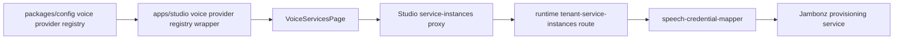
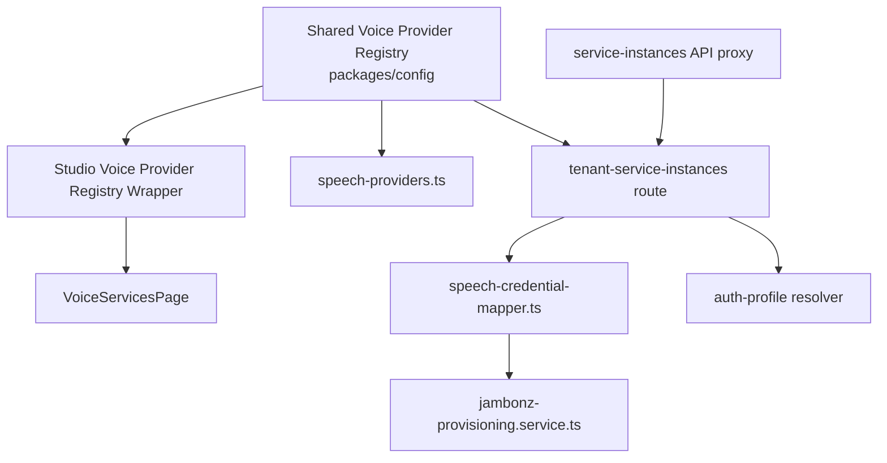

# HLD: Voice Pipeline TTS Provider Parity

**Feature Spec**: `docs/features/sub-features/voice-pipeline-tts-provider-parity.md`
**Test Spec**: `docs/testing/sub-features/voice-pipeline-tts-provider-parity.md`
**Status**: APPROVED
**Author**: Platform Engineering
**Date**: 2026-04-23

---

## 1. Problem Statement

ABL already had the generic voice-service plumbing needed to carry more pipeline TTS vendors, but the control plane still modeled a much smaller first-class TTS set. Shared provider membership, admin forms, runtime normalization, and Jambonz provisioning were not consistently aligned for the broader KoreVG-backed TTS surface.

The goal is to make pipeline TTS parity explicit and repo-backed without broadening into S2S work or redesigning the existing voice-service UX.

---

## 2. Alternatives Considered

### Option A: Add each TTS provider ad hoc in Studio and runtime

- **Description**: Wire providers directly where needed without consolidating shared metadata.
- **Pros**: Low up-front organization effort.
- **Cons**: Recreates the drift problem across registry, Studio, and runtime.
- **Effort**: M

### Option B: Shared registry expansion + Studio field metadata + runtime credential mapper (Recommended)

- **Description**: Keep provider membership and preview-capability metadata in `packages/config`, keep form metadata in Studio, and rely on the runtime mapper/Jambonz provisioning path for vendor-specific serialization.
- **Pros**: Clear boundaries, future-friendly for voice provider work, preserves the current admin UX.
- **Cons**: Touches multiple layers in one story.
- **Effort**: M

### Option C: Full schema-driven voice-service form engine

- **Description**: Replace the current provider-card model with a shared form schema renderer.
- **Pros**: Maximum theoretical centralization.
- **Cons**: Too large for this story and would redesign a working admin flow.
- **Effort**: L

### Recommendation: Option B

**Rationale**: The shared registry plus runtime mapper gives the right amount of structure for parity work while keeping the current Studio admin flow intact.

---

## 3. Architecture

### System Context Diagram

### Component Diagram

### Data Flow

1. `packages/config` defines the expanded TTS provider set, preview flags, and speech-role metadata.
2. Studio uses its wrapper file to render provider-specific admin forms for the TTS vendors.
3. Studio proxies service-instance reads to runtime with `serviceType` / `isActive` filters intact.
4. Runtime stores provider credentials in the existing service-instance model via direct encrypted credentials or `authProfileId`.
5. Runtime resolves the current credential plus config into a normalized `SpeechCredentialInput`.
6. `jambonz-provisioning.service.ts` serializes that input into provider-specific Jambonz payloads.

---

## 4. The 12 Architectural Concerns

### Structural Concerns

| #   | Concern                 | Design Decision                                                                                     |
| --- | ----------------------- | --------------------------------------------------------------------------------------------------- |
| 1   | **Tenant Isolation**    | Existing tenant-scoped runtime CRUD and auth-profile resolution remain the only data access path.   |
| 2   | **Data Access Pattern** | Reuse `TenantServiceInstance` plus existing encrypted fields; no schema migration.                  |
| 3   | **API Contract**        | Existing CRUD endpoints stay in place but now accept the expanded runtime-managed TTS provider set. |
| 4   | **Security Surface**    | Secrets remain encrypted or auth-profile-backed and runtime strips sensitive config on read.        |

### Behavioral Concerns

| #   | Concern           | Design Decision                                                                                  |
| --- | ----------------- | ------------------------------------------------------------------------------------------------ |
| 5   | **Error Model**   | Unsupported provider types still fail closed; `azure` remains excluded from runtime CRUD.        |
| 6   | **Failure Modes** | The main risk is malformed vendor payload mapping; mitigate with mapper and Jambonz tests.       |
| 7   | **Idempotency**   | Create/update semantics stay the same; provisioning re-sync is deterministic from stored config. |
| 8   | **Observability** | Existing audit/logging remains; no new trace contract is required for this story.                |

### Operational Concerns

| #   | Concern                | Design Decision                                                                                            |
| --- | ---------------------- | ---------------------------------------------------------------------------------------------------------- |
| 9   | **Performance Budget** | Static metadata lookups and small payload mapping only; negligible request overhead.                       |
| 10  | **Migration Path**     | Pure code-path expansion; existing service instances remain compatible.                                    |
| 11  | **Rollback Plan**      | Revert the registry entries, Studio cards, and mapper/provisioning changes for the new vendors only.       |
| 12  | **Test Strategy**      | Shared registry tests, mapper tests, Jambonz payload tests, Studio filtering tests, manual admin coverage. |

---

## 5. Data Model

### New Collections/Tables

None.

### Modified Collections/Tables

None.

### Key Relationships

- `TenantServiceInstance.serviceType` now covers the expanded pipeline TTS provider set
- `TenantServiceInstance.authProfileId` may supply the primary credential for supported TTS vendors
- `TenantServiceInstance.encryptedConfig` stores vendor-specific config that is sanitized on read

---

## 6. API Design

### New Endpoints

None.

### Modified Endpoints

| Method                  | Path                                       | Purpose                                                                               | Auth                     |
| ----------------------- | ------------------------------------------ | ------------------------------------------------------------------------------------- | ------------------------ |
| `GET/POST/PATCH/DELETE` | `/api/tenants/:tenantId/service-instances` | Expanded TTS provider acceptance, sanitized config responses, auth-profile-aware sync | Existing credential auth |
| `GET`                   | `/api/service-instances`                   | Preserve `serviceType` / `isActive` forwarding from Studio to runtime                 | Existing Studio auth     |

### Error Responses

- Unsupported runtime provider types still return `400`
- Clearing an auth-profile-backed provider without a replacement primary credential still returns `400`
- Cross-tenant access rules remain unchanged

---

## 7. Cross-Cutting Concerns

- **Audit Logging**: Existing create/update/delete audit log writes remain unchanged.
- **Rate Limiting**: Existing tenant route rate limiting remains unchanged.
- **Caching**: Voice-service cache invalidation still happens after service-instance updates/deletes.
- **Encryption**: Direct primary credentials still flow through encrypted storage; auth-profile-backed providers resolve credentials at sync time.
- **Capability Guarding**: Preview capability remains a separate shared flag so admin/runtime support does not imply preview support.

---

## 8. Dependencies

### Upstream (this feature depends on)

| Dependency                             | Type           | Risk   |
| -------------------------------------- | -------------- | ------ |
| `@agent-platform/config`               | shared package | Low    |
| existing `TenantServiceInstance` model | internal       | Low    |
| existing auth-profile resolver         | internal       | Medium |
| existing Jambonz provisioning client   | internal       | Medium |

### Downstream (depends on this feature)

| Consumer                 | Impact                                                                 |
| ------------------------ | ---------------------------------------------------------------------- |
| Future TTS preview work  | Can reuse the shared preview-capability matrix                         |
| Future voice parity work | Can extend provider metadata without reopening the control-plane split |

---

## 9. Open Questions & Decisions Needed

1. Should `azure` eventually become a first-class runtime/admin speech provider, or stay outside the ABL voice-service CRUD model?
2. Which TTS vendors need live credential smoke tests before this story can move beyond `ALPHA`?
3. Do we want a dedicated runtime route integration suite for expanded TTS provider acceptance once workspace blockers are fixed?

---

## 10. References

- Feature spec: `docs/features/sub-features/voice-pipeline-tts-provider-parity.md`
- Test spec: `docs/testing/sub-features/voice-pipeline-tts-provider-parity.md`
- Shared provider registry: `packages/config/src/constants/voice-providers.ts`
- Runtime CRUD route: `apps/runtime/src/routes/tenant-service-instances.ts`
- Runtime credential mapper: `apps/runtime/src/services/voice/speech-credential-mapper.ts`

---

## Post-Implementation Notes (2026-04-23)

- The story shipped in the same combined branch as the provider-registry and STT parity work, so some verification commands covered overlapping voice surfaces together.
- Dual-role providers now expose aligned TTS capability metadata across shared config, Studio, and runtime provisioning.
- Preview support intentionally stayed limited to `elevenlabs` and `custom:orpheus`; the story widened provider parity without widening preview promises.
- Workspace-wide runtime and Studio build verification remains partially blocked in this worktree by unrelated module-resolution issues, so the story remains `ALPHA`.
