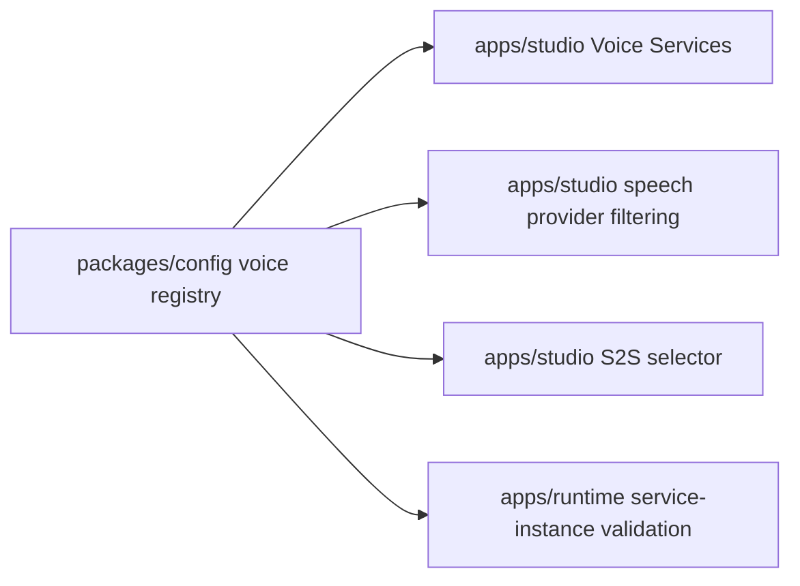
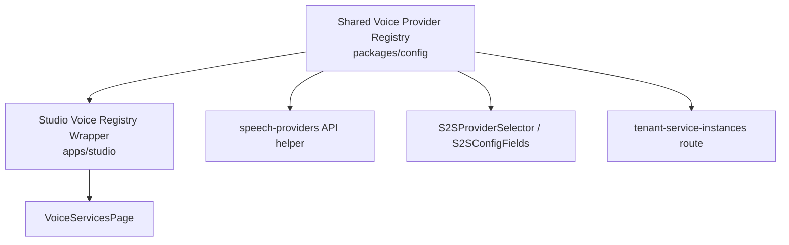

# HLD: Voice Provider Registry and Capability Matrix

**Feature Spec**: `docs/features/sub-features/voice-provider-registry.md`
**Test Spec**: `docs/testing/sub-features/voice-provider-registry.md`
**Status**: APPROVED
**Author**: Platform Engineering
**Date**: 2026-04-22

---

## 1. Problem Statement

ABL voice-provider metadata is duplicated across Studio and runtime. The same provider surface is currently represented by separate hardcoded arrays, label maps, and validation switches. That duplication has already produced drift, including mismatched provider visibility and UI surfaces that imply fuller support than the runtime actually provides.

The goal is to introduce a shared provider registry and capability matrix that Studio and runtime can both consume, while keeping provider-specific UI presentation local to Studio.

---

## 2. Alternatives Considered

### Option A: Keep separate local lists and patch drift case-by-case

- **Description**: Leave the current duplicated arrays/maps in place and only fix obviously wrong lists when they break.
- **Pros**: Lowest immediate code churn.
- **Cons**: Guarantees continued drift, makes later provider-expansion stories harder, does not satisfy the story goal.
- **Effort**: S

### Option B: Shared core registry plus Studio-only presentation extension (Recommended)

- **Description**: Move canonical provider metadata and capabilities into `packages/config`, and let Studio keep a small local registry wrapper for icons, field configs, and S2S component routing.
- **Pros**: Gives Studio and runtime one source of truth while preserving local UI concerns; easy to extend in future stories.
- **Cons**: Requires touching both runtime and Studio call sites in one refactor.
- **Effort**: M

### Option C: Full schema-driven provider UI

- **Description**: Replace provider-specific Studio card/field components with a single schema-driven renderer sourced entirely from shared metadata.
- **Pros**: Maximum centralization.
- **Cons**: Too large for this story; risks redesigning working UI and conflating registry work with form-engine work.
- **Effort**: L

### Recommendation: Option B

**Rationale**: The shared registry solves the duplication problem cleanly without overreaching into a UI redesign. Core metadata belongs in a shared package; presentational JSX, icons, and field components stay in Studio.

---

## 3. Architecture

### System Context Diagram

### Component Diagram

### Data Flow

1. `packages/config` exports provider types, metadata, and capability helpers.
2. Studio imports the shared metadata for labels, grouped provider lists, STT/TTS filtering, and support-status messaging.
3. Runtime imports the shared metadata for service-type validation and speech-role helpers.
4. Studio-specific UI details such as icons, field configs, and provider-specific S2S field components are layered on top locally.

---

## 4. The 12 Architectural Concerns

### Structural Concerns

| #   | Concern                 | Design Decision                                                                                              |
| --- | ----------------------- | ------------------------------------------------------------------------------------------------------------ |
| 1   | **Tenant Isolation**    | No new data access paths. Existing tenant-scoped runtime and Studio APIs remain unchanged.                   |
| 2   | **Data Access Pattern** | Static in-memory metadata in `packages/config`; existing Mongo-backed service-instance access remains as-is. |
| 3   | **API Contract**        | No new endpoints. Existing runtime CRUD behavior becomes registry-driven internally.                         |
| 4   | **Security Surface**    | No new credential handling. Capability flags only affect UI messaging and validation helpers.                |

### Behavioral Concerns

| #   | Concern           | Design Decision                                                                   |
| --- | ----------------- | --------------------------------------------------------------------------------- |
| 5   | **Error Model**   | Existing runtime validation and Studio error surfaces stay intact.                |
| 6   | **Failure Modes** | Main risk is metadata drift during refactor; lock with helper and route tests.    |
| 7   | **Idempotency**   | No new write semantics.                                                           |
| 8   | **Observability** | No new traces needed; correctness is verified through tests and Studio messaging. |

### Operational Concerns

| #   | Concern                | Design Decision                                                                                                    |
| --- | ---------------------- | ------------------------------------------------------------------------------------------------------------------ |
| 9   | **Performance Budget** | Static metadata lookups only; negligible cost.                                                                     |
| 10  | **Migration Path**     | Pure code refactor with no data migration.                                                                         |
| 11  | **Rollback Plan**      | Revert the registry consumers back to local lists if needed; no schema rollback required.                          |
| 12  | **Test Strategy**      | Shared-config unit tests, Studio filtering tests, selector rendering tests, and runtime route regression coverage. |

---

## 5. Data Model

### New Collections/Tables

None.

### Modified Collections/Tables

None.

### Key Relationships

- `TenantServiceInstance.serviceType` must remain one of the runtime service types defined by the shared registry
- Studio channel provider selection reads configured instances but classifies them through shared metadata

---

## 6. API Design

### New Endpoints

None.

### Modified Endpoints

| Method                  | Path                                       | Purpose                                                              | Auth                     |
| ----------------------- | ------------------------------------------ | -------------------------------------------------------------------- | ------------------------ |
| `GET/POST/PATCH/DELETE` | `/api/tenants/:tenantId/service-instances` | Internal validation derives supported types from the shared registry | Existing credential auth |

### Error Responses

No new error contracts. Existing validation and auth behavior should remain stable.

---

## 7. Cross-Cutting Concerns

- **Audit Logging**: Existing route-level audit behavior remains unchanged.
- **Rate Limiting**: Existing runtime rate limiting remains unchanged.
- **Caching**: Not applicable.
- **Encryption**: Existing encrypted voice credentials remain unchanged.

---

## 8. Dependencies

### Upstream (this feature depends on)

| Dependency                                   | Type           | Risk |
| -------------------------------------------- | -------------- | ---- |
| `@agent-platform/config`                     | shared package | Low  |
| `apps/studio` existing voice UI              | internal       | Low  |
| `apps/runtime` tenant service-instance route | internal       | Low  |

### Downstream (depends on this feature)

| Consumer                         | Impact                                                 |
| -------------------------------- | ------------------------------------------------------ |
| Future STT/TTS expansion stories | Lower risk because provider lists are centralized      |
| Future S2S parity stories        | Can rely on shared capability flags and provider types |

---

## 9. Open Questions & Decisions Needed

1. Whether partial S2S providers should remain selectable or become blocked is deferred to a later story.
2. A full schema-driven provider form system is intentionally deferred.

---

## 10. References

- Feature spec: `docs/features/sub-features/voice-provider-registry.md`
- Test spec: `docs/testing/sub-features/voice-provider-registry.md`
- Existing channel registry pattern: `apps/studio/src/components/deployments/channels/channel-registry.tsx`
- Existing runtime route: `apps/runtime/src/routes/tenant-service-instances.ts`

---

## Post-Implementation Notes (2026-04-22)

- The recommended split shipped as designed: canonical provider metadata lives in `packages/config`, while Studio keeps a thin wrapper for icons, field configs, and provider-specific S2S field components.
- Studio now surfaces partial telephony parity for S2S providers directly in both the selector and config panels without changing the existing credential-entry UX.
- Runtime moved the covered service-type allowlist and speech-role derivation to the shared registry for the tenant service-instance route.
- Verification is strong for shared-config and Studio surfaces; runtime package-wide execution in this worktree remains partially blocked by unrelated workspace package-resolution issues, so the feature stays `ALPHA` rather than a higher lifecycle stage.
