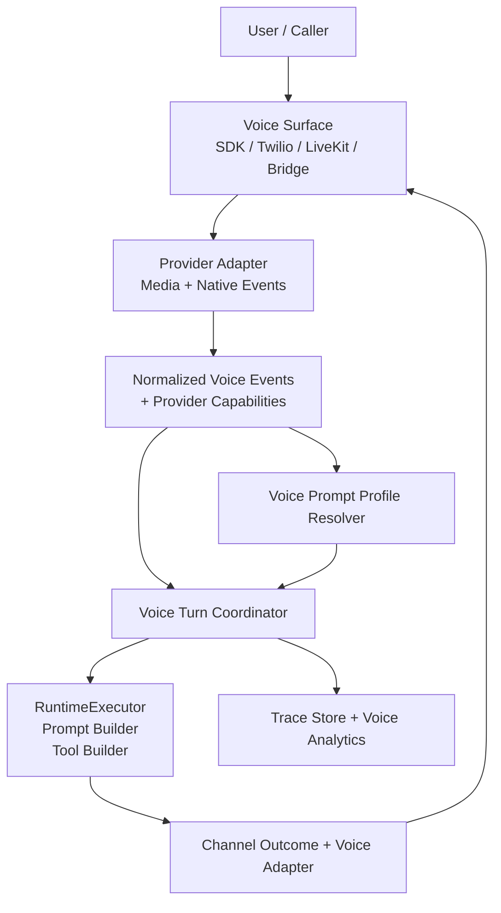
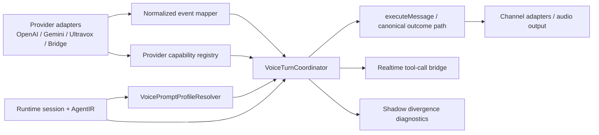
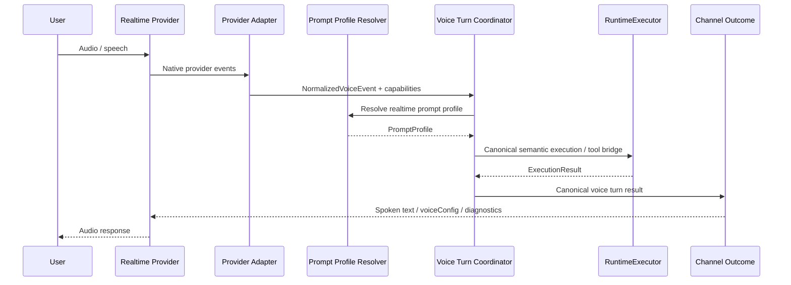

# HLD: Voice Runtime Semantics Unification

**Feature Spec**: `docs/features/sub-features/voice-runtime-semantics-unification.md`
**Test Spec**: `docs/testing/sub-features/voice-runtime-semantics-unification.md`
**Status**: IMPLEMENTED
**Author**: Platform Engineering / Codex
**Date**: 2026-04-22
**Last Updated**: 2026-04-24

---

## 0. Overview / Goal

The goal of this design is to give all voice families one semantic runtime authority without flattening provider differences that are real at the transport and prompt layers. The design keeps media transport, native provider events, and provider capability limits in adapters, while moving DSL/runtime semantics into shared runtime services that can be tested and rolled out consistently.

---

## 1. Problem Statement

The current voice stack has two different semantic shapes:

- **Pipeline voice** already routes finalized utterances through the canonical runtime path (`executeMessage()` and `buildExecutionOutcome()`).
- **Realtime voice** uses provider-native sessions and a smaller `RealtimeVoiceExecutor` surface that currently rebuilds prompt and tool definitions locally.

That split is why voice semantics feel better in pipeline paths than in realtime paths. Existing DSL constructs already compile into one shared IR, but realtime voice does not yet consume the full runtime contract that pipeline voice consumes. At the same time, realtime providers do not expose one shared raw event grammar or one shared prompt format, so "just use the pipeline stack everywhere" is not a safe architecture.

The design challenge is therefore:

1. keep provider/media/event differences explicit,
2. keep prompt profiles mode-aware,
3. unify the semantic meaning of voice DSL/runtime constructs across all voice families.

---

## 2. Alternatives Considered

### Option A: Keep Provider-Native Realtime Stacks And Patch Gaps Incrementally

- **Description**: Leave realtime voice as a mostly separate stack and fix each missing construct or behavior where it appears.
- **Pros**:
  - Lowest immediate code churn
  - Minimal short-term risk to provider-specific latency behavior
  - No migration of the realtime abstraction required up front
- **Cons**:
  - Semantic drift continues
  - Every new DSL construct must be re-implemented provider-by-provider
  - Hard to test parity because there is no semantic authority
- **Effort**: S

### Option B: Force All Voice Families Through The Pipeline Turn Path

- **Description**: Make all voice channels, including realtime providers, behave like pipeline voice and receive one identical prompt/tool/runtime shape.
- **Pros**:
  - Maximum conceptual reuse
  - Easiest parity story on paper
  - Simplifies one class of testing
- **Cons**:
  - Ignores real provider event differences
  - Risks unacceptable latency and unnatural realtime behavior
  - Does not fit immutable providers that cannot refresh prompt/tool state mid-call
- **Effort**: M

### Option C: Canonical Voice Semantic Layer With Event Normalization, Prompt Profiles, And Capability Gating

- **Description**: Introduce one shared semantic layer for voice turns, while explicitly separating provider event normalization, mode-specific prompt profiles, and provider capability metadata.
- **Pros**:
  - Preserves provider/media reality without forking semantics
  - Gives DSL constructs one runtime authority
  - Supports partial providers explicitly instead of silently drifting
  - Rollout can happen incrementally by family/provider
- **Cons**:
  - More architectural work than tactical gap-fixing
  - Requires a migration bridge between old and new realtime semantics
  - Needs strong observability to prove parity during rollout
- **Effort**: M/L

### Recommendation: Option C

**Rationale**: Option C is the only design that acknowledges both truths at once: realtime providers are genuinely different at the transport/event/prompt layer, and the DSL/runtime contract still needs one semantic authority. It preserves low-latency realtime transport while moving construct semantics back into shared runtime services.

---

## 3. Architecture

### System Context Diagram

### Component Diagram

### Data Flow

#### Pipeline Voice

1. Voice surface finalizes one user utterance.
2. Pipeline voice path already reaches canonical runtime execution (`executeMessage()`).
3. `VoiceTurnCoordinator` wraps this path as the baseline semantic authority.
4. Canonical outcome is adapted to spoken text via channel/voice adapters.
5. Trace events record selected prompt profile and semantic result.

#### Realtime Voice

1. Provider adapter receives native audio/transcript/tool events.
2. Adapter emits normalized voice events plus explicit provider capabilities.
3. `VoicePromptProfileResolver` selects a `realtime` prompt profile from shared runtime inputs.
4. `VoiceTurnCoordinator` interprets normalized events and routes semantic work through canonical builders and runtime execution.
5. Provider capability gates decide whether prompt/tool refresh, tool-result injection, or fallback behavior is allowed.
6. Canonical semantic result is rendered back through the provider/channel surface.

### Sequence Diagram

---

## 4. The 12 Architectural Concerns

### Structural Concerns

| #   | Concern                 | Design Decision                                                                                                                                                                                                                                        |
| --- | ----------------------- | ------------------------------------------------------------------------------------------------------------------------------------------------------------------------------------------------------------------------------------------------------ |
| 1   | **Tenant Isolation**    | Session, channel, and tenant-model lookup remain server-authoritative. Normalized voice events never become a direct lookup key without scoped session context.                                                                                        |
| 2   | **Data Access Pattern** | Reuse existing channel/session/model lookup on bootstrap; hot-path semantic work stays in-memory using runtime session state, provider capability metadata, and canonical builders.                                                                    |
| 3   | **API Contract**        | No new public voice endpoint in phase 1. Introduce internal contracts: `NormalizedVoiceEvent`, `VoiceProviderCapabilities`, `VoicePromptProfile`, and `VoiceTurnResult`. Keep existing minimal realtime events as a compatibility shim during rollout. |
| 4   | **Security Surface**    | Keep existing SDK auth, HMAC validation, and encrypted credential handling unchanged. Validate provider payloads at the adapter boundary and sanitize any capability/fallback diagnostics that escape to user surfaces.                                |

### Behavioral Concerns

| #   | Concern           | Design Decision                                                                                                                                                                                                                                                       |
| --- | ----------------- | --------------------------------------------------------------------------------------------------------------------------------------------------------------------------------------------------------------------------------------------------------------------- |
| 5   | **Error Model**   | Introduce explicit semantic families such as `VOICE_CAPABILITY_UNSUPPORTED`, `VOICE_EVENT_UNMAPPED`, `VOICE_PROMPT_PROFILE_FAILED`, and `VOICE_SEMANTIC_FALLBACK`. User-visible messages stay sanitized; raw provider detail remains in traces/logs.                  |
| 6   | **Failure Modes** | Handle provider disconnects, immutable mid-call state, duplicate terminal events, barge-in during pending tool calls, and missing realtime credentials as explicit branches. Where policy allows, fall back to pipeline voice; otherwise surface an explicit partial. |
| 7   | **Idempotency**   | Deduplicate normalized terminal events and tool-result submission by provider call/turn identifiers. Outcome emission and persistence must stay safe under repeated `response.done` or equivalent finalization events.                                                |
| 8   | **Observability** | Emit trace events for normalized provider events, selected prompt profile, provider capability profile, semantic result classification, and shadow-vs-enforce divergence. Preserve existing voice metrics and terminal outcome evidence.                              |

### Operational Concerns

| #   | Concern                | Design Decision                                                                                                                                                                                                                 |
| --- | ---------------------- | ------------------------------------------------------------------------------------------------------------------------------------------------------------------------------------------------------------------------------- |
| 9   | **Performance Budget** | Keep audio/media transport unchanged. Limit added semantic control-path overhead to an in-memory budget target of `<25ms` per finalized realtime turn and `<50ms` per finalized pipeline turn.                                  |
| 10  | **Migration Path**     | Introduce rollout modes `off`, `shadow`, and `enforce`, plus optional family allowlists. Migrate in order: provider capability registry -> normalized events -> prompt profile convergence -> semantic coordinator enforcement. |
| 11  | **Rollback Plan**      | Global or per-family rollback disables semantic enforcement and returns handlers to the current realtime semantics while preserving new observability code where safe. Compatibility emissions remain until rollout completes.  |
| 12  | **Test Strategy**      | Cover provider event normalization, prompt profile selection, realtime executor convergence, canonical voice outcomes, and family-level E2E parity. Add shadow-mode divergence assertions before enforce-mode rollout.          |

---

## 5. Data Model

### New Runtime-Only Types

No new MongoDB collection or SQL table is required in phase 1. The feature adds runtime-only structures and optional interface extensions.

| Type                         | Purpose                                                                                                                                    |
| ---------------------------- | ------------------------------------------------------------------------------------------------------------------------------------------ |
| `NormalizedVoiceEvent`       | Canonical event contract for provider-native and bridge-native voice events                                                                |
| `VoiceProviderCapabilities`  | Explicit capability map for prompt refresh, tool refresh, tool-result injection, partial transcripts, provider VAD, interruption semantics |
| `VoicePromptProfile`         | Mode-aware prompt/tool packaging for pipeline vs realtime voice                                                                            |
| `VoiceTurnResult`            | Canonical semantic result shape for voice turns before channel adaptation                                                                  |
| `VoiceConstructParityRecord` | Construct-by-family parity classification used by CI and diagnostics                                                                       |

### Modified Existing Records / Runtime Objects

| Object                                               | Change                                                                                                                    |
| ---------------------------------------------------- | ------------------------------------------------------------------------------------------------------------------------- |
| `RuntimeSession`                                     | Add runtime-only voice semantic metadata such as selected prompt profile, provider capabilities, and semantic diagnostics |
| `RealtimeVoiceSession`                               | Add optional normalized-event and capability hooks while preserving current event callbacks during migration              |
| `ChannelBehaviorContract` or sibling parity registry | Add voice semantic parity metadata and rollout visibility                                                                 |

### Key Relationships

- `SDKChannel` / channel connection voice settings -> voice mode resolution
- tenant realtime model / credentials -> provider adapter and session config
- provider type -> capability profile -> prompt profile + semantic gating
- canonical voice turn result -> channel outcome -> voice adapter -> user-visible speech

---

## 6. API Design

### New Endpoints

No new external endpoint is required in phase 1.

### Modified Endpoints / Surfaces

| Method | Path                                              | Purpose                                                                                    | Auth                 |
| ------ | ------------------------------------------------- | ------------------------------------------------------------------------------------------ | -------------------- |
| WS     | `/ws/sdk`                                         | SDK voice sessions adopt the normalized event / prompt profile / semantic coordinator path | SDK session token    |
| POST   | `/api/v1/voice/connect`                           | Twilio voice bootstrap resolves semantic rollout mode and provider capability context      | Twilio HMAC          |
| WS     | `/voice/media`                                    | Twilio media path feeds pipeline/realtime turns into the semantic coordinator              | Twilio media session |
| POST   | `/api/v1/channels/vxml/hooks/:streamId`           | Sync voice bridge uses canonical voice turn outcome shaping where supported                | channel token        |
| POST   | `/api/v1/channels/audiocodes/webhook/:identifier` | Bridge family adopts the same semantic classification and diagnostics                      | channel token        |

### Error Responses

| Surface                   | Condition                                                              | Response                                                                                    |
| ------------------------- | ---------------------------------------------------------------------- | ------------------------------------------------------------------------------------------- |
| SDK websocket             | Provider capability required in enforce mode but unsupported           | sanitized `voice_error` or equivalent status event with explicit semantic code              |
| Telephony bootstrap       | Realtime explicitly requested but no tenant realtime capability exists | deterministic fallback to pipeline when allowed, otherwise sanitized failure path           |
| Realtime provider session | Native event cannot be normalized safely                               | provider/session error plus trace-only `VOICE_EVENT_UNMAPPED`; no unsafe semantic execution |

---

## 7. Cross-Cutting Concerns

- **Audit Logging**: No new audit-log collection is needed in phase 1. Operator evidence lives in traces/voice analytics rather than admin audit tables.
- **Rate Limiting**: Existing websocket, telephony, and provider ingress controls remain. The feature does not add new externally callable endpoints.
- **Caching**: Provider capability profiles should be static or session-cached. Prompt profile resolution may cache per-session invariant pieces but must re-evaluate turn-sensitive inputs when needed.
- **Encryption**: Tenant provider credentials remain encrypted and decrypted only inside scoped runtime services.

---

## 8. Dependencies

### Upstream (this feature depends on)

| Dependency                                                | Type                        | Risk   |
| --------------------------------------------------------- | --------------------------- | ------ |
| `apps/runtime` voice session resolution and handlers      | Internal runtime dependency | High   |
| `packages/compiler` realtime provider adapters and types  | Internal shared contract    | High   |
| Canonical runtime prompt/tool builders                    | Internal runtime dependency | High   |
| Existing channel behavior contract and outcome builder    | Internal runtime dependency | Medium |
| Third-party realtime providers (OpenAI, Gemini, Ultravox) | External                    | High   |

### Downstream (depends on this feature)

| Consumer                           | Impact                                                                                           |
| ---------------------------------- | ------------------------------------------------------------------------------------------------ |
| SDK voice surfaces                 | More consistent DSL/runtime behavior plus better diagnostics                                     |
| Twilio voice                       | Canonical outcome shaping and rollout visibility                                                 |
| LiveKit voice                      | Stronger prompt-profile visibility and semantic parity proof                                     |
| KoreVG / AudioCodes / VXML bridges | Canonical final voice delivery with explicit supported partials for custom KoreVG realtime lanes |
| Voice analytics / observability    | Richer semantic traces and rollout evidence                                                      |

---

## 9. Open Questions & Decisions Needed

1. Should immutable providers such as Ultravox stay as explicit partials, or should the platform introduce a dedicated immutable-session semantic path?
2. Should provider capability profiles live in `packages/compiler` as shared provider metadata, in runtime as enforcement policy, or in both?
3. For bridge families, should normalized mid-turn voice events be emitted directly by bridge adapters or derived from a second-stage wrapper inside runtime? Final delivery now goes through the shared channel-adapter surface.

---

## 10. Post-Implementation Notes (2026-04-24)

- Supported realtime families now serialize coordinator-tool `response_text` through the same channel-adapter registry used by pipeline voice final delivery.
- LiveKit, VXML, AudioCodes, and terminal/non-streaming KoreVG turns now resolve final spoken text from canonical `voiceConfig.plain_text` when it is present.
- The explicit parity contract now lives in both `voice-dsl-parity.ts` and `channel-behavior-contract.ts`, which keeps family-level semantics and channel-level delivery guarantees aligned.
- The remaining partials are deliberate rather than implicit: immutable realtime providers without tool-result injection, and KoreVG custom S2S/realtime or already-streamed token paths.
- Rollout remains safe-by-default: the implementation is landed, but shadow/enforce operator review remains a separate post-implementation step.

---

## 10. References

- Feature spec: `docs/features/sub-features/voice-runtime-semantics-unification.md`
- Test spec: `docs/testing/sub-features/voice-runtime-semantics-unification.md`
- Related designs:
  - `docs/plans/2026-03-29-runtime-channel-contract-rollout.md`
  - `docs/plans/2026-03-31-channel-parity-matrix.md`
  - `docs/features/voice-capabilities.md`
  - `docs/features/channels.md`
  - `docs/features/sub-features/conversation-behavior.md`
