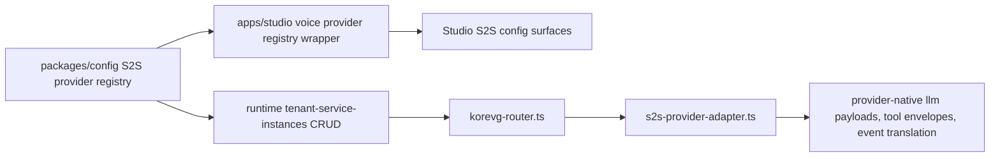
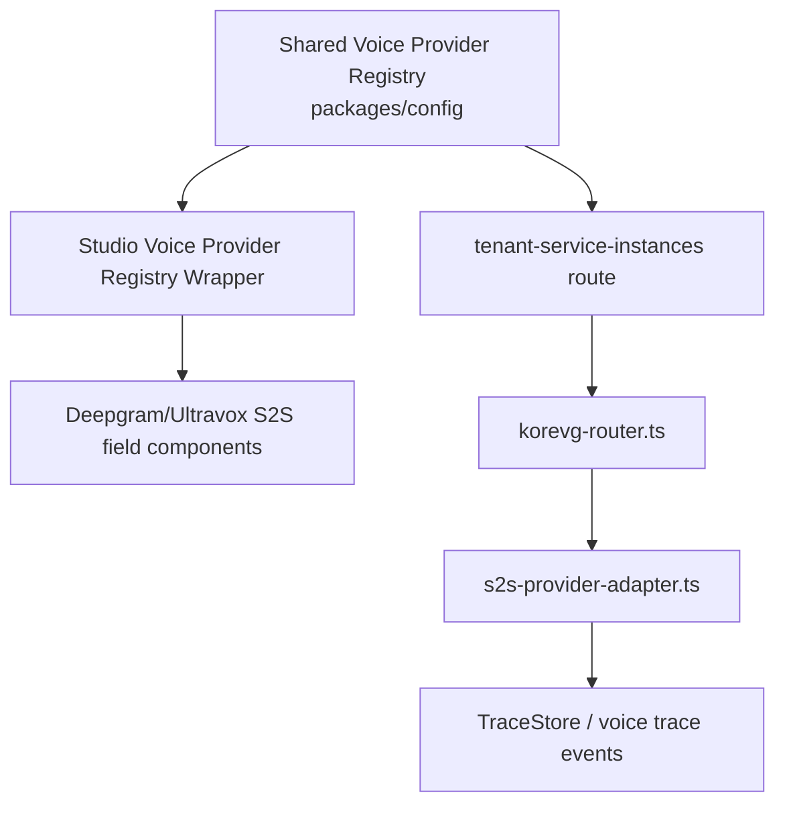

# HLD: Voice S2S Provider Parity

**Feature Spec**: `docs/features/sub-features/voice-s2s-provider-parity.md`
**Test Spec**: `docs/testing/sub-features/voice-s2s-provider-parity.md`
**Status**: APPROVED
**Author**: Platform Engineering
**Date**: 2026-04-23

---

## 1. Problem Statement

ABL already modeled six S2S providers in shared config and Studio, but the KoreVG telephony runtime still handled too much of that surface as if every provider were OpenAI-compatible. Non-OpenAI providers lacked provider-aware payload builders, tool envelopes, event translation, and some provider-specific Studio config fields.

The goal is to make the currently modeled S2S provider set behave as provider-aware KoreVG integrations while keeping the remaining inline handoff limitations visible in shared capability messaging.

---

## 2. Alternatives Considered

### Option A: Keep a mostly OpenAI-shaped runtime path and patch providers ad hoc

- **Description**: Add special cases directly inside `korevg-router.ts` only where a failure is visible.
- **Pros**: Lower up-front file count.
- **Cons**: Hard to reason about, increases router complexity, and keeps provider-specific drift hidden.
- **Effort**: M

### Option B: Add a provider-aware S2S adapter layer and keep the router orchestrating (Recommended)

- **Description**: Keep shared provider membership/support flags in `packages/config`, keep Studio field metadata in Studio, and add a dedicated runtime adapter for provider payloads, tool messages, and event translation.
- **Pros**: Clear separation of concerns, smaller router surface, more honest provider support story.
- **Cons**: Still leaves some non-OpenAI inline handoff parity for later follow-up.
- **Effort**: M

### Option C: Rebuild all S2S providers around one new generic realtime abstraction

- **Description**: Replace the existing router/provider split with a new transport-agnostic realtime framework.
- **Pros**: Maximum theoretical consistency.
- **Cons**: Too large for this story and would risk working Google/Grok/OpenAI paths.
- **Effort**: L

### Recommendation: Option B

**Rationale**: A provider-aware adapter achieves the needed parity without destabilizing the existing specialized router flows for Google and Grok.

---

## 3. Architecture

### System Context Diagram

### Component Diagram

### Data Flow

1. `packages/config` defines the modeled S2S provider set and telephony capability/support messaging.
2. Studio uses its wrapper file plus Deepgram/Ultravox field components to render provider-specific config surfaces.
3. Runtime CRUD persists modeled S2S provider credentials/config through existing service-instance paths.
4. `korevg-router.ts` resolves the S2S provider and delegates provider-specific payload/tool/event handling to `s2s-provider-adapter.ts`.
5. The adapter builds provider-native payloads, serializes tool results, and translates provider-native events into internal realtime event shapes.
6. Router orchestration keeps Google and Grok specialized branches intact and avoids invalid OpenAI inline session updates for providers that do not support them.

---

## 4. The 12 Architectural Concerns

### Structural Concerns

| #   | Concern                 | Design Decision                                                                                  |
| --- | ----------------------- | ------------------------------------------------------------------------------------------------ |
| 1   | **Tenant Isolation**    | Existing tenant-scoped service-instance CRUD and runtime session boundaries remain unchanged.    |
| 2   | **Data Access Pattern** | Reuse existing provider config persistence; no schema migration.                                 |
| 3   | **API Contract**        | Existing CRUD endpoints stay in place; the story changes runtime provider behavior behind them.  |
| 4   | **Security Surface**    | No new credential surface; provider-specific config continues through existing encrypted fields. |

### Behavioral Concerns

| #   | Concern           | Design Decision                                                                                            |
| --- | ----------------- | ---------------------------------------------------------------------------------------------------------- |
| 5   | **Error Model**   | Unknown providers still fail closed; partial-support providers still show an explicit support warning.     |
| 6   | **Failure Modes** | The biggest risk is provider contract mismatch; mitigate with adapter tests and router integration tests.  |
| 7   | **Idempotency**   | Session bootstrap remains deterministic from the resolved provider config.                                 |
| 8   | **Observability** | Provider-native events translate into the existing voice trace taxonomy rather than introducing a new one. |

### Operational Concerns

| #   | Concern                | Design Decision                                                                                             |
| --- | ---------------------- | ----------------------------------------------------------------------------------------------------------- |
| 9   | **Performance Budget** | Adapter work is lightweight payload shaping and event normalization only.                                   |
| 10  | **Migration Path**     | Pure code-path expansion; existing modeled S2S service instances remain compatible.                         |
| 11  | **Rollback Plan**      | Revert the adapter and Studio field metadata while preserving the registry-backed provider set.             |
| 12  | **Test Strategy**      | Registry tests, provider-adapter tests, Studio selector tests, and router integration tests where runnable. |

---

## 5. Data Model

### New Collections/Tables

None.

### Modified Collections/Tables

None.

### Key Relationships

- `TenantServiceInstance.serviceType` must match one of the modeled S2S provider types
- Stored provider config now feeds provider-specific runtime bootstrap logic for Deepgram and Ultravox
- Trace emission depends on provider-native event translation for the partial providers

---

## 6. API Design

### New Endpoints

None.

### Modified Endpoints

| Method                  | Path                                       | Purpose                                                                     | Auth                     |
| ----------------------- | ------------------------------------------ | --------------------------------------------------------------------------- | ------------------------ |
| `GET/POST/PATCH/DELETE` | `/api/tenants/:tenantId/service-instances` | Persist modeled S2S provider credentials/config through the shared registry | Existing credential auth |
| websocket               | KoreVG runtime voice session               | Provider-aware S2S bootstrap, tool/result, and event handling               | Existing telephony auth  |

### Error Responses

- Unsupported runtime provider types still return `400`
- Providers without inline prompt-swap parity continue to surface support limitations through the shared support message, not a silent failure
- Cross-tenant access rules remain unchanged

---

## 7. Cross-Cutting Concerns

- **Audit Logging**: Existing create/update/delete audit log writes remain unchanged.
- **Rate Limiting**: Existing tenant route rate limiting remains unchanged.
- **Caching**: Voice-service cache invalidation still happens after service-instance updates/deletes.
- **Tracing**: Provider-native realtime events normalize into the existing voice trace taxonomy.
- **Capability Guarding**: Shared support messaging remains the product contract for partial vs full S2S support.

---

## 8. Dependencies

### Upstream (this feature depends on)

| Dependency                             | Type           | Risk   |
| -------------------------------------- | -------------- | ------ |
| `@agent-platform/config`               | shared package | Low    |
| existing KoreVG router/runtime session | internal       | Medium |
| existing service-instance persistence  | internal       | Low    |
| existing trace-store/event emission    | internal       | Medium |

### Downstream (depends on this feature)

| Consumer                   | Impact                                                                  |
| -------------------------- | ----------------------------------------------------------------------- |
| Future S2S provider work   | Can extend the adapter instead of reopening OpenAI-only assumptions     |
| Future handoff parity work | Can upgrade partial providers without redoing payload/event translation |

---

## 9. Open Questions & Decisions Needed

1. Do we want to make inline handoff/prompt-swap fully provider-aware for ElevenLabs, Deepgram, and Ultravox in a follow-up story?
2. Can we stabilize the runtime integration-config lane in this worktree so `korevg-router.test.ts` becomes executed coverage?
3. Which modeled partial providers need live telephony smoke testing before this story moves beyond `ALPHA`?

---

## 10. References

- Feature spec: `docs/features/sub-features/voice-s2s-provider-parity.md`
- Test spec: `docs/testing/sub-features/voice-s2s-provider-parity.md`
- Shared provider registry: `packages/config/src/constants/voice-providers.ts`
- KoreVG router: `apps/runtime/src/services/voice/korevg/korevg-router.ts`
- Provider adapter: `apps/runtime/src/services/voice/korevg/s2s-provider-adapter.ts`

---

## Post-Implementation Notes (2026-04-23)

- The story widened actual runtime S2S behavior much more than the registry support flags imply at first glance; the remaining `partial` flags now specifically represent inline handoff/prompt-swap limitations, not missing baseline telephony support.
- Google and Grok kept their existing specialized branches; the new adapter mainly covers the modeled non-OpenAI providers that previously fell through OpenAI-shaped assumptions.
- Runtime integration coverage exists on disk via `korevg-router.test.ts`, but in this worktree the correct integration-config lane is still blocked by unrelated package-resolution issues, so the story remains `ALPHA`.
