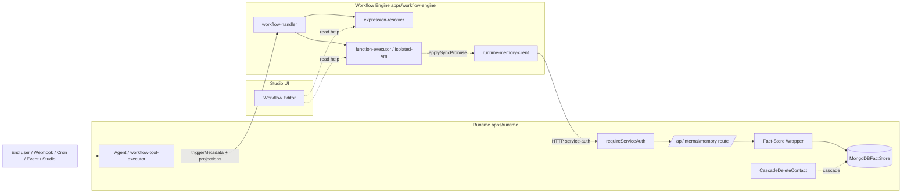
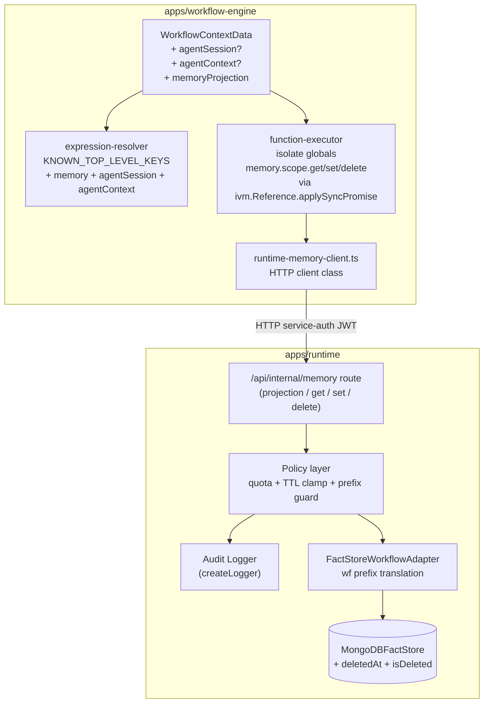
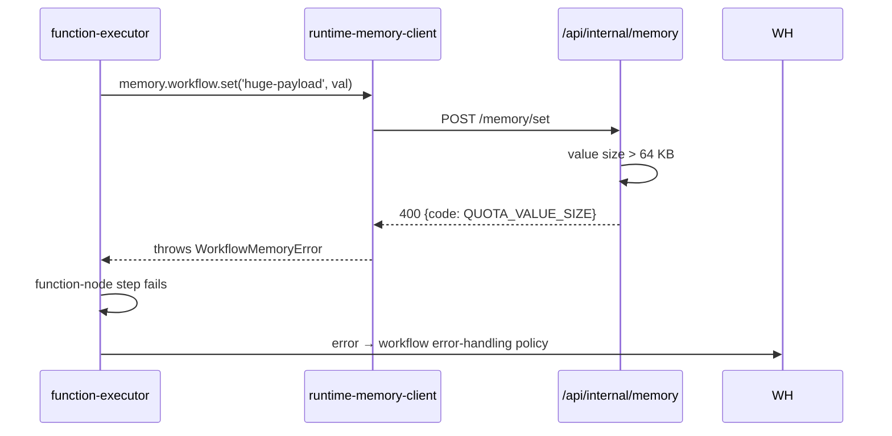

# HLD: Workflow First-Class Memory, Agent Session, and Context

**Feature Spec**: `docs/features/sub-features/workflow-first-class-memory-and-context.md`
**Test Spec**: `docs/testing/sub-features/workflow-first-class-memory-and-context.md`
**Status**: APPROVED — implementation complete (Phases 0-6 landed 2026-04-28); feature at ALPHA
**Author**: Pattabhi
**Date**: 2026-04-27
**Last Updated**: 2026-04-28
**JIRA**: ABLP-638 (HLD); feature spec ABLP-634; LLD ABLP-643; impl ABLP-644 / 645 / 646 / 647 / 649 / 653 / 658 / 659

---

## 1. Problem Statement

Workflow authors today see only `trigger`, `workflow`, `tenant`, `steps`, and `vars` in the workflow expression resolver and the function-node `context` proxy. This forces two awkward patterns:

1. Agent-triggered workflows must navigate `trigger.metadata.sessionId` / `trigger.metadata.agentName` instead of reading a first-class `agentSession.*` projection that mirrors what code tools already see.
2. There is no workflow-native persistent memory surface that works uniformly across `webhook`, `cron`, `event`, `studio`, and `agent` triggers — authors fall back to ad-hoc `triggerMetadata`, duplicated project state, or custom tools.

The feature spec (FR-1 through FR-23) defines three new first-class objects — `agentSession`, `agentContext`, `memory` — exposed to both expressions and function nodes, with a positive-list projection schema, `wf:<workflowId>:<key>` reserved-prefix namespacing for workflow scope, per-write quotas, mandatory audit logging, and right-to-erasure cascade for `memory.user.*`. This HLD locks the architecture for those contracts.

---

## 2. Alternatives Considered

### Option A (recommended): First-class objects via scoped helpers, sync-from-script writes via `ivm.Reference.applySyncPromise()`, new `/api/internal/memory` route

- **Description.** Expand `WorkflowContextData` and the function-executor isolate globals with `agentSession`, `agentContext`, and `memory` as scoped helpers (`memory.workflow.get/set/delete`, `memory.project.*`, `memory.user.*`). Function-node memory ops cross the isolate boundary via `ivm.Reference.applySyncPromise()` — from the user script's view the call is synchronous, but on the host side it awaits a real async HTTP round-trip to the runtime memory route. This blocks the isolate's worker thread until the host promise resolves; per-tenant isolate-thread budgeting is required (see Concern #9). Errors propagate as exceptions back into the script at the call site, satisfying FR-21. The host calls a new dedicated `/api/internal/memory/*` route group on runtime via `requireServiceAuth`. The runtime memory route applies the `wf:<workflowId>:<key>` reserved prefix, enforces TTL ceiling and per-write quotas, emits audit logs, and delegates to `FactStoreWorkflowAdapter` over `MongoDBFactStore`. A second prefix guard lives at `MongoDBFactStore.set()` itself to block any caller (including `tool-memory-bridge.ts`) from forging `wf:` keys — only `FactStoreWorkflowAdapter` may bypass it. Agent-triggered runs receive a positive-list `agentSession`/`agentContext` projection enriched at invocation time by `workflow-tool-executor.ts` (push-at-invoke) and carried in `triggerMetadata`.
- **Pros.** Clean separation of concerns; reuses every existing pattern (service-auth JWT, `requireServiceAuth`, FactStore); zero changes to non-workflow callers; mid-step write failures surface as exceptions per FR-21; matches the existing `_contextWrite` callback pattern in `function-executor.ts`.
- **Cons.** Each memory op crosses both the V8 isolate boundary and the workflow-engine → runtime HTTP boundary — at the FR-20 cap (100 writes/run) a memory-heavy run pays ~2s of write-latency. Adds a new internal route group.
- **Effort.** M.

### Option B: Tunnel through `trigger.metadata` and `vars` (status quo + cosmetic helpers)

- **Description.** No first-class objects. Document conventions for authors to read `trigger.metadata.sessionId` etc. Add a workflow-engine-side `MemoryHelper` library that authors import inside function nodes, which still uses the existing `tool-memory-bridge.ts` route through runtime (or a direct Mongo client embedded in the workflow-engine).
- **Pros.** Zero changes to expression resolver or context shape; minimal risk.
- **Cons.** Fails the core goal — authors still navigate raw metadata. Memory writes from workflows continue to be invisible (no audit), unbounded (no quotas), and cross-tenant-leak-prone (no isolation contract). Does not address any of the FR-3 through FR-23 contracts. Effectively rejects the feature.
- **Effort.** S — but does not satisfy the spec.

### Option C: Direct MongoDB access from workflow-engine (skip the runtime seam)

- **Description.** Workflow-engine imports the MongoDB driver and the `Fact` model directly. Memory ops bypass runtime and write to Mongo from the workflow-engine process.
- **Pros.** Lowest write latency (no HTTP hop). Single-process simplicity.
- **Cons.** Violates the platform principle that workflow-engine does not own data persistence — runtime owns the fact store. Doubles the surface area requiring tenant-isolation review. Bypasses the established service-auth boundary; harder to audit. Couples workflow-engine deployment to Mongo schema migrations. Inconsistent with `tool-memory-bridge.ts`'s route through runtime.
- **Effort.** M — but architecturally regressive.

### Recommendation: Option A

Option A is the only choice that satisfies the full FR set and respects the existing service boundaries. The 2s worst-case write latency is bounded by the FR-20 cap and acceptable for the mostly-stateful-but-low-frequency memory access patterns the spec targets. Option B fails the goal; Option C is architecturally regressive.

**Trade-off acknowledged.** Each `memory.set`/`get`/`delete` inside a function node pays an HTTP round-trip. Authors writing memory-heavy logic should batch-state at the end of a node (one write per node, not one per logical change). Documented in feature-spec §6 (Design Considerations).

---

## 3. Architecture

### 3.1 System Context



### 3.2 Component Diagram



### 3.3 Data Flow — agent-triggered workflow run with memory write

```mermaid
sequenceDiagram
  autonumber
  participant Agent
  participant WTE as workflow-tool-executor
  participant WH as workflow-handler
  participant FE as function-executor (isolate)
  participant RMC as runtime-memory-client
  participant IMR as /api/internal/memory
  participant FS as FactStore + Mongo

  Agent->>WTE: invoke workflow tool
  WTE->>WTE: project session → agentSession & agentContext (positive-list, deep-frozen)
  WTE->>WH: POST executions/execute<br/>{triggerType: 'agent', triggerMetadata: {agentSession, agentContext, ...}}
  WH->>WH: build WorkflowContextData<br/>materialize agentSession/agentContext (frozen)
  WH->>RMC: POST /memory/projection<br/>{tenantId, projectId, workflowId, endUserId?}
  RMC->>IMR: HTTP service-auth
  IMR->>FS: bulk get (project + user + wf:<id>:* prefix)
  FS-->>IMR: facts
  IMR-->>RMC: projection
  RMC-->>WH: in-run memory projection
  WH->>FE: enter function node (globals: agentSession, agentContext, memory)
  FE->>FE: user JS runs; memory.workflow.set('lastCursor', X, {ttl:'7d'})
  FE->>RMC: ivm.Reference.applySyncPromise (sync from script's view)
  RMC->>IMR: POST /memory/set
  IMR->>IMR: validate scope, key prefix guard, TTL clamp, quota
  IMR->>AUDIT: structured audit log entry
  IMR->>FS: upsert (key wf:<workflowId>:lastCursor, ttlMs)
  FS-->>IMR: ok
  IMR-->>RMC: 200
  RMC-->>FE: returns to script (or throws on failure)
  FE-->>WH: node complete
```

### 3.3a Non-agent triggers (webhook, cron, event, studio)

The flow is identical to §3.3 except for two differences:

1. The trigger source is `trigger-engine.ts` (or the Studio direct-run handler) rather than `workflow-tool-executor.ts`. There is no `agentSession` or `agentContext` projection in `triggerMetadata`; `WorkflowContextData.agentSession` and `agentContext` are `undefined` for the entire run.
2. `POST /memory/projection` is still called at run start with `tenantId`, `projectId`, `workflowId`, and `endUserId: undefined`. The response carries the `workflow` and `project` views; the `user` view is empty/absent. Function-node `memory.user.*` operations throw `UNAVAILABLE_SCOPE` (per the User Identity Resolution Matrix); `memory.workflow.*` and `memory.project.*` work normally.

### 3.4 Failure path



---

## 4. The 12 Architectural Concerns

### Structural

| #   | Concern                 | Design Decision                                                                                                                                                                                                                                                                                                                                                                                                                                                                                                                                                                                                                                                                                                                                                                                                                                                                                                                                                                                                                                                                                 |
| --- | ----------------------- | ----------------------------------------------------------------------------------------------------------------------------------------------------------------------------------------------------------------------------------------------------------------------------------------------------------------------------------------------------------------------------------------------------------------------------------------------------------------------------------------------------------------------------------------------------------------------------------------------------------------------------------------------------------------------------------------------------------------------------------------------------------------------------------------------------------------------------------------------------------------------------------------------------------------------------------------------------------------------------------------------------------------------------------------------------------------------------------------------- |
| 1   | **Tenant Isolation**    | Every memory op flows through `requireServiceAuth`, which extracts `tenantId` and `projectId` from the service-token payload. Today the middleware cross-checks `projectId` from the request body against the JWT but NOT `tenantId` (`apps/runtime/src/middleware/internal-service-auth.ts:59-73`). v1 closes this gap as a **prerequisite infrastructure change** sequenced before the workflow-memory work — `requireServiceAuth` is extended with a body `tenantId` cross-check, which benefits every internal route group (tools, chat, callback, memory). See §8.1. Workflow scope additionally binds `workflowId` via the `wf:<workflowId>:<key>` prefix. `memory.user.*` keys on `endUserId` per §4a User Identity Resolution Matrix. Cross-scope reads fail closed (return `undefined` for expressions; throw for function-node ops).                                                                                                                                                                                                                                                  |
| 2   | **Data Access Pattern** | Persistence reuses `MongoDBFactStore` (with two new optional fields `deletedAt`/`isDeleted` and a `wf:` prefix-write guard); a thin wrapper `FactStoreWorkflowAdapter` adds the `wf:<workflowId>:<key>` translation and is the only caller permitted to bypass the prefix guard. No direct MongoDB driver from workflow-engine. In-run memory projection is loaded once at execution start (`POST /memory/projection`) and held in `WorkflowContextData.memoryProjection`; per-op mutations call back to runtime AND update the in-run copy so downstream expressions/nodes in the SAME run see latest values (FR-14). **Snapshot isolation:** the in-run projection is snapshot-isolated to load time plus the current run's own writes. A concurrent run's write is NOT visible to this run unless the keys overlap and this run also reads via the runtime route. Cross-run real-time visibility is explicitly NOT in v1.                                                                                                                                                                    |
| 3   | **API Contract**        | Internal-only — no new public API. New route group `/api/internal/memory` with four verbs: `POST /projection` (bulk load), `POST /get`, `POST /set`, `POST /delete`. Request/response shape uses the structured envelope `{success, data?, error?: {code, message}}` per platform standard. JSON; service-auth JWT in `Authorization` header.                                                                                                                                                                                                                                                                                                                                                                                                                                                                                                                                                                                                                                                                                                                                                   |
| 4   | **Security Surface**    | (a) Positive-list projection at `workflow-tool-executor` — fields not in §9 schema are dropped; deep-frozen object. (b) Single-pass expression interpolation (existing structural property of `String.replace(EXPRESSION_PATTERN, ...)`); add a regression test asserting that `agentContext.attachments[].name = '{{memory.project.secret}}'` is preserved verbatim. (c) **Reserved-prefix guard at TWO layers** to close the cross-surface bypass — (c.1) at the runtime memory route for workflow-engine callers, blocking author writes to `wf:`/`_meta:`/`_system:`/`_audit:`; (c.2) at `MongoDBFactStore.set()` — keys starting with `wf:` are rejected unless the caller passes an `__originAdapter: 'workflow'` marker that ONLY `FactStoreWorkflowAdapter` sets. This blocks `tool-memory-bridge.ts` and any future caller from forging `memory.workflow.*` reads via the project-fact namespace. (d) Internal-only route gated by `requireServiceAuth` (with the new tenantId body cross-check, see Concern #1). (e) No raw model IDs / credential refs / transcripts in projections. |

### Behavioral

| #   | Concern           | Design Decision                                                                                                                                                                                                                                                                                                                                                                                                                                                         |
| --- | ----------------- | ----------------------------------------------------------------------------------------------------------------------------------------------------------------------------------------------------------------------------------------------------------------------------------------------------------------------------------------------------------------------------------------------------------------------------------------------------------------------- |
| 5   | **Error Model**   | All memory failures throw `WorkflowMemoryError` from the script's perspective (FR-21). Error codes: `QUOTA_KEY_LENGTH`, `QUOTA_VALUE_SIZE`, `QUOTA_WRITE_COUNT`, `RESERVED_PREFIX`, `TTL_INVALID`, `STORAGE_UNAVAILABLE`, `UNAVAILABLE_SCOPE`, `INTERNAL`. User-visible workflow error surfaces sanitize per CLAUDE.md user-error rule (no tenant IDs, model IDs, credential hints).                                                                                    |
| 6   | **Failure Modes** | Storage unavailable → 503 from route → throw at script. HTTP timeout → throw. Partial multi-key writes are NOT allowed; the contract is single-key per call. Runtime memory route applies a small jittered retry on transient Mongo errors (max 3 attempts, < 200 ms) — but does NOT retry on quota / validation errors. Network partition between workflow-engine and runtime → workflow run fails the function node; existing workflow error-handling policy applies. |
| 7   | **Idempotency**   | v1 does NOT provide write-once / exactly-once for `memory.set`. Function-node retries re-execute the body and can write the same key twice. Authors must use deterministic keys; assume any `set` may execute > once (FR's idempotency note). The runtime memory route itself is idempotent for `set` (Mongo upsert is last-write-wins). `delete` is idempotent — repeated deletes of an already-tombstoned fact return ok.                                             |
| 8   | **Observability** | (a) Trace event per memory op with `{operation, scope, key, ttl, result, durationMs}` — value is never traced. (b) Mandatory audit log via `createLogger('workflow-memory')` to stdout with `{tenantId, projectId, workflowId, runId, scope, key, actor, appliedTtlMs, op}` — separate from operational tracing (FR-22). (c) Trace event also at projection-load with cardinality (number of keys loaded per scope). (d) Existing workflow-execution traces unchanged.  |

### Operational

| #   | Concern                | Design Decision                                                                                                                                                                                                                                                                                                                                                                                                                                                                                                                                                                                                                                                                                                                                                                                                                                     |
| --- | ---------------------- | --------------------------------------------------------------------------------------------------------------------------------------------------------------------------------------------------------------------------------------------------------------------------------------------------------------------------------------------------------------------------------------------------------------------------------------------------------------------------------------------------------------------------------------------------------------------------------------------------------------------------------------------------------------------------------------------------------------------------------------------------------------------------------------------------------------------------------------------------- |
| 9   | **Performance Budget** | Projection load: < 100 ms p95 for ≤ 200 keys (typical project). Per-op `set/get/delete`: < 50 ms p95 over the internal HTTP seam. Worst-case run: 100 writes × 50 ms = 5 s of memory-only latency (FR-20 cap × p95). Authors are guided in docs to write once per node, not once per logical change. Projection payload cap: 256 KB serialized — runs exceeding it fail with a clear error. Expression resolver overhead: O(1) Set.has check for new top-level keys (negligible). **Isolate-thread budget:** `applySyncPromise` blocks the isolate worker thread for the duration of the HTTP round-trip. The function-executor isolate pool size MUST be sized to the expected concurrent function-node count, not the concurrent run count, because each in-flight memory op holds an isolate thread. LLD locks the pool size and per-tenant cap. |
| 10  | **Migration Path**     | All changes are additive; no data migration required. (a) `Fact` model gets two new optional fields (`deletedAt`, `isDeleted`) — existing documents read fine without them. (b) `KNOWN_TOP_LEVEL_KEYS` adds `memory`, `agentSession`, `agentContext` — existing workflows continue to resolve their existing top-level objects unchanged (no collisions found per oracle I4). (c) `triggerMetadata` enrichment is additive — old consumers ignore extra fields. Phased rollout commits 1 (reads) and 2 (writes) per §3.4 of feature-spec §13.                                                                                                                                                                                                                                                                                                       |
| 11  | **Rollback Plan**      | Rollback in two ordered steps. **(1) Pre-revert cleanup**: run a one-shot script that hard-deletes every `Fact` document with `isDeleted: true`. These are tombstones from the rollout — without the `isDeleted` filter (which the revert removes), `MongoDBFactStore.get()` would return them to readers as live facts. The cleanup script is small, idempotent, and required before the code revert. **(2) Revert** the two commits (reads, writes). The schema additions (`deletedAt`, `isDeleted`) on documents that survive the cleanup are harmless — Mongoose accepts them; `strict: false` is not needed because the fields remain declared in the model file even at revert time (declare-and-keep is the recommended pattern). No other data deletion is required. Aggregate cost: < 1 minute downtime if memory traffic is paused first. |
| 12  | **Test Strategy**      | Per the No-Mocking-Codebase-Components rule (CLAUDE.md): integration tests instantiate the real isolate, real Mongo (testcontainer), real internal HTTP route. Only external boundaries (none here — fact-store IS the boundary) may be DI-mocked. Unit tests target pure functions (TTL clamping, key-prefix translation, projection schema enforcement). E2E tests in `apps/studio/e2e/workflows/workflow-first-class-memory.spec.ts` exercise the real workflow + runtime stack. See §6 below and feature-spec §17 (21 scenarios).                                                                                                                                                                                                                                                                                                               |

---

### 4a. FR Traceability

| FR    | Topic                                              | HLD location                      |
| ----- | -------------------------------------------------- | --------------------------------- |
| FR-1  | First-class top-level objects in expressions       | §3, §6.4, Concern #3              |
| FR-2  | `agentSession` for agent runs                      | §3.3, Concern #4                  |
| FR-3  | `agentContext` for agent runs                      | §3.3, Concern #4                  |
| FR-4  | Non-agent triggers don't fabricate agent objects   | §3.3a, §6.4                       |
| FR-5  | Function-node direct globals                       | §6.4                              |
| FR-6  | Agent objects read-only (deep freeze)              | §6.4, Concern #4                  |
| FR-7  | Memory available for all trigger types             | §3.3a, §5.4                       |
| FR-8  | Typed dot-path expression reads on memory          | §6.4, Concern #3                  |
| FR-9  | Function-node `memory.get/set/delete` API          | §6.4                              |
| FR-10 | Workflow scope isolation (`wf:<workflowId>:<key>`) | §5.2, §5.4, Concern #1            |
| FR-11 | Project and user scope isolation                   | §5.4, §6.1, Concern #1            |
| FR-12 | Default TTL inherited from fact-store              | Concern #9, §6.1                  |
| FR-13 | Per-write TTL with ceiling clamp                   | §6.1, Concern #9                  |
| FR-14 | In-run projection visibility                       | Concern #2 (snapshot isolation)   |
| FR-15 | Exclusion list — no secrets / transcripts          | Concern #4                        |
| FR-16 | Fail-closed isolation across all scopes            | Concern #1                        |
| FR-17 | Deterministic interpolation; no hidden I/O         | §3.3, Concern #2                  |
| FR-18 | Positive-list projection materialization           | §3 (push-at-invoke), Concern #4   |
| FR-19 | No template re-interpolation                       | Concern #4                        |
| FR-20 | Per-write quotas + reserved-prefix guard           | §6.1, Concern #4, Concern #5      |
| FR-21 | Memory failures throw                              | Concern #5, Concern #6, §3.4      |
| FR-22 | Audit log for `set`/`delete` + tombstones          | Concern #8, §5.1                  |
| FR-23 | Right-to-erasure cascade for `memory.user.*`       | §7 (Compliance / GDPR), Open Q #4 |

---

## 5. Data Model

### 5.1 Modified collections

**`facts` (in `packages/database/src/models/fact.model.ts`):** add two optional fields for tombstone support.

| Field       | Type                   | Required | Purpose                                                                           |
| ----------- | ---------------------- | -------- | --------------------------------------------------------------------------------- |
| `deletedAt` | `Date \| undefined`    | NO       | Set when soft-deleted; absent for live facts.                                     |
| `isDeleted` | `boolean \| undefined` | NO       | Index-friendly flag; `true` for tombstones. `MongoDBFactStore.get()` filters out. |

Existing documents missing these fields read as `isDeleted=false`. Existing TTL index on `expiresAt` continues to expire tombstones automatically.

**`MongoDBFactStore.get/getMany`:** add `{isDeleted: {$ne: true}}` to all read filters. Behavior unchanged for callers; only writes via the new memory route create tombstones.

### 5.2 Reserved key namespace

`memory.workflow.foo` → fact key `wf:<workflowId>:foo`, project scope, `userId='__project__'` sentinel. Reserved-prefix guard at the runtime memory route blocks author writes to any of `wf:`, `_meta:`, `_system:`, `_audit:` (FR-20).

### 5.3 No new collections in v1

Audit log destination is structured logs (per oracle I3). If audit needs to become queryable later, a `fact_audit` collection or ClickHouse table is a separate v1.1 RFC.

### 5.4 Key relationships

- `memory.workflow.*` → workflow-scoped (via reserved prefix), shared across all invokers, all triggers, all concurrent runs of that workflow.
- `memory.project.*` → project-scoped, shared across both workflow-written and tool-memory-bridge-written facts.
- `memory.user.*` → user-scoped, keyed on `endUserId` resolved per the §4a matrix; cascade-deleted by the new contact-erasure step.

---

## 6. API Design

### 6.1 New internal endpoints (runtime, gated by `requireServiceAuth`)

| Method | Path                              | Purpose                                                                                                       | Auth         |
| ------ | --------------------------------- | ------------------------------------------------------------------------------------------------------------- | ------------ |
| POST   | `/api/internal/memory/projection` | Bulk-load the in-run projection at workflow execution start. Returns `{workflow, project, user}` views.       | service-auth |
| POST   | `/api/internal/memory/get`        | Single-key read against a named scope.                                                                        | service-auth |
| POST   | `/api/internal/memory/set`        | Single-key write with optional TTL override; clamps TTL, enforces quotas, writes audit log, mutates in Mongo. | service-auth |
| POST   | `/api/internal/memory/delete`     | Soft-delete (tombstone) a single key; emits audit log; idempotent.                                            | service-auth |

**Request envelope (POST `/set`):**

```json
{
  "tenantId": "<from JWT must match>",
  "projectId": "<from JWT must match>",
  "workflowId": "<required for scope=workflow>",
  "runId": "<for audit>",
  "actor": { "kind": "workflow-author" | "end-user", "endUserId": "<optional>" },
  "scope": "workflow" | "project" | "user",
  "key": "<no reserved prefix>",
  "value": <JSON serializable, ≤64KB>,
  "ttl": "<duration string optional, e.g. '7d'>"
}
```

**Response envelope:** `{success: true, data: {…}}` on success; `{success: false, error: {code, message}}` on failure. Error codes per §4 concern #5.

### 6.2 No public API changes

Authors interact with the feature via expression syntax and function-node JS — no Studio API additions. Existing workflow Studio routes carry the new objects implicitly via `WorkflowContextData`.

### 6.3 No modified existing endpoints

`workflow-tool-executor.ts` invocation contract gets additional `triggerMetadata` fields (`agentSession`, `agentContext` projections) — additive, no breaking change to consumers that ignore them.

### 6.4 Function-node API shape (in-isolate)

```js
// Read
const cursor = memory.workflow.get('lastCursor');
const pref = memory.user.get('preferredLanguage');

// Write with TTL
memory.workflow.set('lastCursor', { id: 42, at: Date.now() }, { ttl: '7d' });

// Delete (idempotent tombstone)
memory.workflow.delete('lastCursor');

// agentSession / agentContext are deep-frozen
agentSession.channel; // 'web'
agentSession.foo = 'x'; // throws (strict mode)
```

---

## 7. Cross-Cutting Concerns

| Concern               | Decision                                                                                                                                                                                                                                                                                                                                                                                         |
| --------------------- | ------------------------------------------------------------------------------------------------------------------------------------------------------------------------------------------------------------------------------------------------------------------------------------------------------------------------------------------------------------------------------------------------ |
| **Audit Logging**     | `createLogger('workflow-memory').info('memory_op', {...})` emits a structured entry per `set`/`delete`. Fields: `tenantId`, `projectId`, `workflowId`, `runId`, `scope`, `key`, `actor`, `appliedTtlMs`, `op`. Value is NEVER logged. Tombstone deletes carry `op='delete'` and `tombstone=true`.                                                                                                |
| **Rate Limiting**     | Inherits from existing `requireServiceAuth` gate (per-token rate limits already configured). Per-run write count cap (FR-20 = 100) is the more relevant ceiling and is enforced at the route.                                                                                                                                                                                                    |
| **Caching**           | The in-run memory projection is the cache: loaded once at run start, updated in-place on writes. No cross-run cache. Projection-load endpoint is non-cacheable (per-run identity).                                                                                                                                                                                                               |
| **Encryption**        | At-rest: inherits MongoDB at-rest encryption posture (FR Security note). In-transit: internal HTTP within cluster — relies on existing TLS / network policy posture. Field-level encryption deferred (GAP-015).                                                                                                                                                                                  |
| **Compliance / GDPR** | Right-to-erasure cascade extends `CascadeDeleteContact` (oracle I2) with a fact-erasure step that removes facts where `userId = endUserId AND scope = 'user'`. Trigger event: existing `DELETE /:id/gdpr` route. `memory.workflow.*` and `memory.project.*` are NOT scanned (per spec FR-23 + §6 anti-pattern). Anonymous (cookie-reset) users: each `anonymousId` is a separate erasure target. |
| **Sanitization**      | User-visible workflow errors pass through the existing user-error sanitizer. Audit logs use a separate, less-redacted formatter (still no `value`).                                                                                                                                                                                                                                              |

---

## 8. Dependencies

### 8.1 Upstream (this feature depends on)

| Dependency                                                    | Type                  | Risk                                                                                                                                                                                                                                                                                                                                                           |
| ------------------------------------------------------------- | --------------------- | -------------------------------------------------------------------------------------------------------------------------------------------------------------------------------------------------------------------------------------------------------------------------------------------------------------------------------------------------------------- |
| `MongoDBFactStore` (`apps/runtime/src/services/stores/`)      | Persistence           | Low — schema additions are optional fields; upsert + TTL index already in place.                                                                                                                                                                                                                                                                               |
| `requireServiceAuth` middleware                               | Auth                  | **PREREQUISITE CHANGE.** Today the middleware cross-checks `projectId` body→JWT but NOT `tenantId` (`apps/runtime/src/middleware/internal-service-auth.ts:59-73`). v1 extends it with a `tenantId` body cross-check; benefits all internal route groups (tools, chat, callback, memory). Sequenced as a separate first commit before the workflow-memory work. |
| `isolated-vm` runtime in `function-executor.ts`               | Sandbox               | Medium — `ivm.Reference.applySyncPromise()` integration with async HTTP is the most novel pattern (oracle R3); prototype early in commit 1. Per-tenant isolate-thread budgeting required (see Concern #9).                                                                                                                                                     |
| `CascadeDeleteContact` (`apps/runtime/src/contexts/contact/`) | GDPR                  | Medium — extending with a fact-erasure step requires testing the full end-user-deletion path. Non-contact identities (`customerId`, `anonymousId`) flagged in §9 Open Question #4.                                                                                                                                                                             |
| `Fact` model (`packages/database/src/models/fact.model.ts`)   | Schema                | Low — additive optional fields (`deletedAt`, `isDeleted`).                                                                                                                                                                                                                                                                                                     |
| `WorkflowExecution.triggerMetadata` Mongoose field            | Schema                | Low — field MUST be a declared field on the Mongoose schema, otherwise `strict: true` will silently strip the enriched `agentSession`/`agentContext` projection. LLD verifies. (Reference: `apps/workflow-engine/agents.md` 2026-03-24 entry.)                                                                                                                 |
| `workflow-tool-executor.ts` invocation contract               | Push-at-invoke source | Low — additive metadata fields.                                                                                                                                                                                                                                                                                                                                |

### 8.2 Downstream (consumers of this feature)

| Consumer                     | Impact                                                                                                                                      |
| ---------------------------- | ------------------------------------------------------------------------------------------------------------------------------------------- |
| Existing workflows           | None — additive. Existing workflows continue to resolve `trigger`/`workflow`/`tenant`/`steps`/`vars` unchanged.                             |
| Workflow-as-tool integration | Gains `agentSession`/`agentContext` projection as first-class context; no breaking change to the agent → workflow tool invocation contract. |
| Function-node authors        | New globals `memory`, `agentSession`, `agentContext` available; existing scripts unaffected.                                                |
| Studio workflow editor       | Helper / autocomplete updates planned in feature-spec §13.5 (separate commit; UI polish).                                                   |
| Tool-memory-bridge consumers | None — value-size limit at fact-store layer unchanged at 10 KB; the 64 KB cap is enforced at the workflow-memory route only (oracle I1).    |

---

## 9. Open Questions & Decisions Needed

1. **Audit log retention.** Structured-log destination in v1 = stdout → log aggregator. Retention is whatever the platform's log-aggregator policy provides today. If compliance requires a fixed N-year retention beyond log retention, a `fact_audit` collection becomes a v1.1 follow-on. **Defer to LLD; flag in feature-spec §16 GAP table.**
2. **Projection-load latency budgeting.** Per-project total memory cardinality could grow large; the projection-load endpoint imposes a 256 KB serialized payload cap, but the right operational ceiling for keys-per-project needs measurement. **LLD adds a metric; HLD assumes < 200 keys typical.**
3. **Test-spec drift.** The committed `docs/testing/sub-features/workflow-first-class-memory-and-context.md` was authored against an earlier FR set (FR-1 through FR-17 only). It needs to be re-run via `/test-spec` to capture FR-18 through FR-23 (projection schema, expression injection, quotas, audit, erasure, tombstones, concurrency, retry, nesting, deep-freeze, fact-namespace). **Action item before LLD.**
4. **End-user erasure for non-contact identities.** Oracle I2 confirms `CascadeDeleteContact` is the trigger for contacts. But `memory.user.*` is keyed on `endUserId` which can also be a `customerId`, `anonymousId`, or channel-artifact identifier (per feature spec §4a). Parallel cascade entry points for those identity types may not exist today. LLD must enumerate the erasure trigger per identity type and add fact-erasure to each — if a non-contact cascade does not exist, LLD scopes a new one. Tracked as a follow-up GAP for the feature spec.

---

## 10. References

- **Feature spec**: `docs/features/sub-features/workflow-first-class-memory-and-context.md` (commit `eb29532421`, ABLP-634)
- **Test spec**: `docs/testing/sub-features/workflow-first-class-memory-and-context.md` (NOTE: needs `/test-spec` re-run for FR-18+ coverage — Open Question #3)
- **Parent design**: `docs/specs/workflows.hld.md`
- **Related**: `docs/specs/workflow-as-tool.hld.md`, `docs/specs/workflow-function-node.hld.md`, `docs/specs/memory-sessions.hld.md`, `docs/specs/session-scope-enforcement.hld.md`
- **Implementation seams**:
  - Workflow-engine: `apps/workflow-engine/src/context/expression-resolver.ts`, `apps/workflow-engine/src/handlers/workflow-handler.ts`, `apps/workflow-engine/src/executors/function-executor.ts`, `apps/workflow-engine/src/clients/runtime-memory-client.ts` (new)
  - Runtime: `apps/runtime/src/services/workflow/workflow-tool-executor.ts`, `apps/runtime/src/services/execution/tool-memory-bridge.ts` (reference), `apps/runtime/src/services/stores/mongodb-fact-store.ts`, `apps/runtime/src/middleware/internal-service-auth.ts`, `apps/runtime/src/routes/internal-memory.ts` (new)
  - Database: `packages/database/src/models/fact.model.ts`, `packages/database/src/cascade/cascade-delete.ts`, `apps/runtime/src/contexts/contact/use-cases/cascade-delete-contact.ts`
- **Oracle decisions**: `docs/sdlc-logs/workflow-first-class-memory-and-context/hld.log.md`
