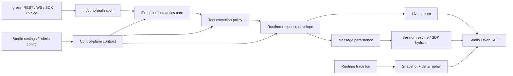

# Runtime + Studio Contract Convergence Design

**Date**: 2026-04-18
**Status**: Draft - pending product and platform confirmation
**Owner**: Platform team
**Tickets**: ABLP-367, ABLP-400, ABLP-397, ABLP-242, ABLP-376, ABLP-350, ABLP-265, ABLP-323, ABLP-292, ABLP-289, ABLP-245, ABLP-340, ABLP-326, ABLP-396, ABLP-320, ABLP-334
**Related**:

- `docs/features/sub-features/localization-asset-management.md`
- `docs/specs/localization-asset-management.hld.md`
- `docs/features/sub-features/sdk-rich-content-templates.md`
- `docs/features/sub-features/localized-interaction-context.md`
- `docs/plans/2026-04-13-runtime-url-plane-routing-plan.md`
- `docs/archive/plans-2026-02/2026-02-21-i18n-end-to-end-design.md`

---

## 1. Why these tickets should be solved together

This backlog is not sixteen unrelated defects. It is one recurring failure mode expressed at different boundaries:

1. execution semantics are duplicated across compiler and runtime
2. control-plane settings mix project intent with platform infrastructure ownership
3. response payloads are lossless on the live wire but lossy in persistence and rehydration
4. Studio replay logic treats reconnection as "clear and rebuild" instead of "merge snapshot and delta"

The symptoms look different, but the root cause is contract drift:

| Symptom cluster                                | Tickets                                                    | Root issue                                                                                           |
| ---------------------------------------------- | ---------------------------------------------------------- | ---------------------------------------------------------------------------------------------------- |
| validation, gather, SET, prompt drift          | ABLP-397, ABLP-242, ABLP-376, ABLP-350, ABLP-323, ABLP-320 | runtime behavior is spread across ad hoc branches instead of one shared semantics layer              |
| redundant LLM work and HTTP/NLU config drift   | ABLP-400, ABLP-265, ABLP-292                               | hot-path tool behavior and infra bindings are implicit instead of typed                              |
| localization, templates, resume fidelity       | ABLP-289, ABLP-245, ABLP-367                               | live transport supports richer behavior than persisted UI/session contracts                          |
| runtime URL, eval forms, agent transfer config | ABLP-340, ABLP-326, ABLP-334                               | Studio writes or reads partial DTOs and environment-driven config instead of stable shared contracts |
| trace replay duplication and gaps              | ABLP-396                                                   | Observatory uses destructive replay semantics instead of cursor-based merge                          |

This design treats the tickets as one convergence program: define a small number of canonical contracts and make both Runtime and Studio consume them.

---

## 2. Grounding observations from current code

These findings explain why local fixes keep resurfacing elsewhere:

- `apps/runtime/src/services/execution/prompt-builder.ts` already centralizes `buildSystemPrompt(session)`, but `apps/runtime/src/services/execution/flow-step-executor.ts` still has a reasoning-zone branch that builds its own prompt text and bypasses that contract.
- `apps/runtime/src/services/execution/intrinsic-validation.ts` already exists, but `packages/compiler/src/platform/ir/compiler.ts` still only auto-generates enum validation into gather-field IR.
- `apps/runtime/src/services/execution/value-resolution.ts` resolves string templates, booleans, and numbers, but step-level arithmetic and CEL-backed `SET` semantics are still not treated as a first-class action evaluator.
- `apps/runtime/src/services/search-ai/searchai-kb-tool-executor.ts` still performs LLM query enrichment, and `apps/runtime/src/services/execution/reasoning-executor.ts` can still summarize tool results with another LLM call.
- `apps/studio/src/adapters/useStudioTransport.ts` can forward `richContent`, `actions`, and `voiceConfig`, but `apps/studio/src/store/session-store.ts`, `apps/studio/src/contexts/WebSocketContext.tsx`, `packages/database/src/models/message.model.ts`, and session-resume payloads reduce persisted history to plain text.
- `apps/runtime/src/websocket/handler.ts` resumes sessions with `conversationHistory` carrying only `{ role, content }`, while `apps/studio/src/contexts/WebSocketContext.tsx` clears Observatory state before replay finishes, creating a race with incoming live events.
- `apps/studio/src/config/runtime.public.ts` and `apps/studio/src/config/runtime.server.ts` already support same-origin/public fallback behavior, but `apps/studio/src/config/runtime.ts` still reads `NEXT_PUBLIC_RUNTIME_URL` directly.
- `apps/runtime/src/services/execution/localized-messages.ts` and the implemented Localization asset-management feature already provide a session-scoped locale catalog, but runtime localized scripted-message resolution is still incomplete.
- `packages/agent-transfer/src/config/schema.ts` and `apps/runtime/src/config/agent-transfer.ts` still assume SmartAssist secrets come from environment variables, while Studio settings types do not expose a project-scoped `authProfileId` binding.

The platform already has many of the building blocks. The missing piece is contract unification.

---

## 3. Design goals

### 3.1 Goals

- Make execution behavior compiler-authored and runtime-reused instead of branch-specific.
- Make hot-path tool execution deterministic by default and LLM-optional by policy.
- Keep platform infrastructure ownership out of project-scoped settings.
- Preserve full response fidelity across live chat, persistence, session resume, and SDK hydration.
- Make replay and reconnect cursor-based and merge-safe.
- Reuse existing project localization assets and auth-profile infrastructure where ownership matches, without collapsing project and platform localization into one catalog.
- Roll out through dual-read and compatibility shims rather than big-bang replacement.

### 3.2 Non-goals

- Rewriting the full runtime execution stack in one release.
- Replacing existing localization asset storage or Auth Profile storage.
- Introducing a generic service-binding platform as a prerequisite.
- Redesigning the entire Observatory UI.
- Forcing one monolithic migration of all legacy route/env aliases on day one.

### 3.3 Persona boundaries and swim lanes

This program crosses three distinct personas. Treating them as one blended "developer" role is how ownership drift keeps reappearing in settings, localization, and replay behavior.

| Persona            | Owns                                                 | Primary surfaces                                                                            | Allowed to author directly                                                                            | Must reference rather than own                                                      |
| ------------------ | ---------------------------------------------------- | ------------------------------------------------------------------------------------------- | ----------------------------------------------------------------------------------------------------- | ----------------------------------------------------------------------------------- |
| End user           | preferences and live interaction state               | Runtime chat, SDK widgets, notifications, resumed sessions, exported conversation artifacts | locale choice, response consumption, interaction history                                              | project builder config, platform infrastructure config, system-only diagnostics     |
| Agent developer    | project behavior and project-owned content           | Studio builder, project exports/imports, localized agent assets, project settings           | prompts, flows, project locale assets, project-scoped capability intent, auth-profile references      | platform system copy, runtime protocol mechanics, raw service endpoints and secrets |
| Platform developer | shared platform contracts and platform-owned content | Runtime, Studio/Admin shell, shared APIs, observability, platform localization catalogs     | response/replay contracts, runtime semantics, shared error/auth/system copy, infra endpoint ownership | per-project content, tenant/project business copy, agent-authored localized content |

Cross-lane rules:

- a shared end-user surface does not create shared authoring ownership
- every persisted or replayed artifact must preserve enough metadata to recover its ownership lane
- Studio should expose project-owned authoring inputs separately from platform-owned references or defaults
- Runtime should resolve content, settings, and localization by ownership domain rather than inferring ownership from whichever UI rendered first
- platform-owned contracts may compose project-owned content, but they must not silently rewrite project source-of-truth assets

---

## 4. Recommended platform decisions

### Decision 1: Execution semantics become a first-class shared contract

Compiler output should describe validation, prompt assembly inputs, step-entry actions, and reroute affordances explicitly enough that Runtime does not re-invent the rules in separate branches.

This decision directly addresses ABLP-397, ABLP-242, ABLP-376, ABLP-350, ABLP-323, and part of ABLP-320.

### Decision 2: Hot-path tools are deterministic unless explicitly opted into extra LLM work

Tool executors should make one external tool call by default. Query repair, summarization, or context recovery belongs above the tool boundary or behind an explicit policy switch, not hidden in the executor.

This decision directly addresses ABLP-400 and prevents the same cost/latency pattern from spreading to other tools.

### Decision 3: Project settings store intent and references, not platform-owned endpoints or secrets

Project config should choose capabilities and auth-profile references. Platform config should own infrastructure URLs and service endpoints. This keeps multitenant configuration safer and easier to operate.

This decision directly addresses ABLP-292, ABLP-334, and ABLP-340.

### Decision 4: Runtime responses use one lossless envelope across live, persisted, and resumed flows

If a response can carry `text`, `richContent`, `actions`, `voiceConfig`, or localization metadata over WebSocket, the persisted and resumed forms must carry the same envelope. Plain-text-only persistence is the root cause of multiple UI regressions.

This decision directly addresses ABLP-245 and enables durable fixes for ABLP-367 and ABLP-289.

### Decision 5: Rehydration is snapshot-plus-delta merge with cursors, never destructive clear-and-replay

Reconnects and session resume should preserve live events, request a server snapshot after a cursor, and merge deterministically. Clearing the client store before replay is what creates missing and duplicated trace events.

This decision directly addresses ABLP-396.

### Decision 6: Project and platform localization remain separate ownership domains

Project localization assets should remain the source of truth for project-owned agent content. Platform-owned localization should remain in platform-managed catalogs such as `packages/i18n` and shared runtime/system message catalogs. Runtime resolution must choose the catalog by ownership domain instead of forcing one team to author both kinds of content.

This decision directly addresses ABLP-289 while preserving the already-implemented Localization asset-management slice for agent developers and keeping platform-owned copy under platform-team control.

---

## 5. Target architecture



### 5.1 Workstream A - Execution Semantics Core

#### A.1 Compiled validation plan

Extend gather-field compilation so every field can carry a normalized validation plan:

```ts
type GatherValidationPlan = {
  intrinsic?: 'email' | 'phone' | 'date' | 'datetime' | 'number' | 'integer' | 'float';
  enumValues?: string[];
  pattern?: string;
  lookupRef?: string;
  customRule?: string;
  validationProcess?: 'regex' | 'llm' | 'hybrid';
};
```

Compiler responsibilities:

- emit intrinsic validation for system entity types instead of enum-only auto-generation
- preserve compile-time regex safety checks
- normalize lookup-backed validation into the same plan

Runtime responsibilities:

- use one `GatherValidationEngine` for scripted gather, inline lookups, correction flows, and future voice normalization
- always emit `field_validation` trace events when a plan exists, regardless of which branch performed validation

This is the primary fix shape for ABLP-397 and ABLP-323.

#### A.2 Input normalization pipeline

Add an ingress-time normalization layer that preserves both raw input and extraction-friendly variants:

```ts
type NormalizedInput = {
  rawText: string;
  displayText: string;
  extractionText: string;
  variants: {
    spokenNumberDigits?: string;
    punctuationNormalized?: string;
  };
};
```

Rules:

- raw transcript remains authoritative for audit and customer-visible replay
- extraction uses the best-fit normalized variant based on active gather field metadata
- spoken-number-to-digit conversion is only enabled when the active field expects numeric or phone-like content, not for arbitrary free text

This is the durable fix shape for ABLP-320 and reduces future ASR-related gather regressions.

#### A.3 Shared step action evaluator

Introduce a dedicated `ActionEvaluator` used by scripted entry hooks, step-entry `SET`, and future lifecycle hooks:

- literal values continue to work
- arithmetic and computed assignments use `evaluateCel()`
- step-entry `SET` executes before gather/collect handling
- assignment output is typed and normalized before entering session state

Legacy compatibility:

- old quoted-string behavior remains valid
- non-CEL scalar assignments still parse as today
- CEL activation is additive, not breaking

This is the durable fix shape for ABLP-376.

#### A.4 Central prompt assembly

All reasoning and hybrid/scripted prompt entry points must call one `PromptAssemblyService`.

Rules:

- DB prompt overrides, prompt catalog fallbacks, behavior profiles, and any channel-appropriate status-tag injection are applied once
- reasoning-zone steps may add local instructions, but only as structured deltas on top of the centralized prompt
- no branch is allowed to construct the base system prompt ad hoc

This is the durable fix shape for ABLP-350.

#### A.5 Parent reroute contract

Formalize the already-emerging parent-supervisor reroute logic into a reusable coordinator:

- evaluate explicit digressions first
- evaluate parent-supervisor reroute second
- only treat input as field content after reroute opportunities fail
- emit a stable `return_to_parent` action with the forwarded message payload

This is the durable fix shape for ABLP-242.

#### A.6 Tool execution policy

Adopt a default rule: one user request should not silently trigger extra LLM hops inside a tool executor.

For SearchAI specifically:

- remove executor-side query enrichment LLM pass from the default path
- keep tool discovery and vocabulary in the tool description, not as runtime query rewriting
- change large-result compaction default from `summarize` to deterministic structural compression for search-style tools
- keep LLM summarization only as explicit policy opt-in for tools that truly need semantic condensation

This is the durable fix shape for ABLP-400.

### 5.2 Workstream B - Control-Plane Contract

#### B.1 Platform-managed service endpoints

Project settings should not store raw infrastructure URLs for platform-owned services.

Recommended split:

- project config stores `nlu_provider: 'standard' | 'advanced'`
- platform config or instance config stores the advanced NLU sidecar endpoint and timeout/circuit-breaker policy
- runtime resolves provider tier from the project and endpoint from the platform

Compatibility plan:

- continue reading `advanced_sidecar_url` during migration
- treat it as deprecated and ignore it when a platform endpoint is configured

This is the durable fix shape for ABLP-292.

#### B.2 Typed HTTP request-body descriptor

Replace the implicit `body_template` contract with an explicit request-body descriptor:

```ts
type HttpRequestBodyDescriptor = {
  format: 'json' | 'raw' | 'form_urlencoded';
  template?: string;
  fields?: Record<string, string>;
  contentType?: string;
};
```

Rules:

- `json` remains the default for backward compatibility
- `form_urlencoded` serializes from fields or template output deterministically
- legacy `body_template` maps to `request_body.template`

This is the durable fix shape for ABLP-265.

#### B.3 Reference-based integration settings

Project-scoped integrations should bind to credentials by `authProfileId`, not raw environment secrets.

For agent transfer:

- add a typed `smartassist` settings block to project agent-transfer settings
- support `authProfileId` for credentials plus project-specific metadata like `appId`, `hoursId`, `orgId`, queue defaults, and voice mode
- keep environment values as system defaults and migration fallback, not as the only source
- resolve the effective SmartAssist config per project at runtime, not only at process boot

This is the durable fix shape for ABLP-334.

#### B.4 Plane-specific runtime URL contract

Adopt the existing plane-routing proposal as the canonical direction:

- browser/public routing uses `RUNTIME_PUBLIC_BASE_URL` or same-origin fallback
- Studio server-side proxies use plane-aware runtime helpers
- legacy `NEXT_PUBLIC_RUNTIME_URL` remains an alias, not the authored primary

This is the durable fix shape for ABLP-340.

#### B.5 Schema-first Studio DTOs

Studio create/edit forms should bind to shared read/write DTOs instead of parallel handwritten interfaces.

Recommended pattern:

- extract shared Zod schemas for `EvalScenarioRead`, `EvalScenarioWrite`, and `AgentTransferSettings`
- generate client types with `z.infer`
- use one mapper for API response to form state and the same mapper for edit hydration

This is the durable fix shape for ABLP-326 and reduces repeat drift in settings pages.

### 5.3 Workstream C - Response and Rendering Contract

#### C.1 Runtime response envelope

Introduce one lossless response shape used everywhere after model/tool execution:

```ts
type RuntimeResponseEnvelope = {
  text: string;
  richContent?: Record<string, unknown>;
  actions?: Record<string, unknown>;
  voiceConfig?: Record<string, unknown>;
  metadata?: {
    ownershipDomain?: 'project' | 'platform' | 'llm';
    localizationKey?: string;
    resolvedLocale?: string;
    renderMode?: 'text' | 'rich' | 'voice';
  };
};
```

The envelope should be the source of truth for:

- live `response_end` messages
- persisted `Message` documents
- session-resume payloads
- Studio `SessionMessage`
- SDK backfill hydration

The ownership domain must travel with the envelope so localization, replay, and renderer decisions remain lane-aware after persistence and reconnect.

Storage recommendation:

- keep `content` for backward compatibility
- add envelope fields or one mixed `payload` field to persisted message records
- dual-write during migration

This is the primary fix shape for ABLP-245.

#### C.2 Lossless resume and chat hydration

Session resume should no longer depend on lossy `conversationHistory` only.

Recommended direction:

- runtime returns a bounded list of persisted message envelopes for resume
- Studio hydrates the chat client and local store from those envelopes
- `conversationHistory` can remain a lightweight execution window for model context, but it is no longer the UI source of truth

This fixes the persistent/live mismatch behind ABLP-245 and keeps future rich content additions stable.

#### C.3 Shared streaming + follow-state primitives

Standardize the already-emerging Arch v3 approach into shared chat primitives:

- RAF-based streaming buffer
- explicit "is following" state
- resize-aware follow mode
- shared scroll-to-bottom affordance

Arch v3 can remain the pilot implementation, but the behavior should be expressed as a reusable contract rather than one overlay-specific hook.

This is the durable fix shape for ABLP-367.

#### C.4 Dual-domain localized message resolution

Localized runtime content should resolve from two separate catalogs with explicit ownership:

- **Project catalog**: project-scoped locale assets in `locales/<locale>/<asset>.json`, managed by agent developers in Studio
- **Platform catalog**: platform-owned localization catalogs such as `packages/i18n` and shared runtime/system-message catalogs, managed by platform developers

Resolver rule:

1. classify the message as `project-owned` or `platform-owned`
2. choose the matching catalog
3. resolve locale using the current-turn/session fallback chain for that catalog
4. never allow one catalog to silently override the other

The classification should happen before persistence/resume and should be carried in `RuntimeResponseEnvelope.metadata.ownershipDomain`. Renderers must not guess ownership from page context or route alone.

Project-owned resolution order:

1. explicit current-turn locale
2. session preference locale
3. agent default locale
4. `en`
5. IR literal fallback

Platform-owned resolution order:

1. explicit current-turn locale if supported by the platform catalog
2. platform default locale policy
3. `en`
4. sanitized literal fallback

Examples of project-owned content:

- scripted agent messages
- business-domain handoff copy
- project-authored rich-content labels

Examples of platform-owned content:

- auth and consent framework copy
- runtime/system error and health notices
- generic transfer status notices
- Studio and SDK chrome

Recommended authoring model:

- project-owned scripted/system prompts and canned messages resolve by stable keys into the project catalog
- platform-owned notices and errors resolve by stable keys into the platform catalog
- free-form LLM output remains free-form unless a feature explicitly templates it

This is the durable fix shape for ABLP-289.

### 5.4 Workstream D - Replay and Observatory Contract

#### D.1 Snapshot + delta replay

Replace destructive replay with cursor-based merge:

```ts
type TraceCursor = {
  sessionId: string;
  sequence: number;
  lastEventId: string;
};
```

Rules:

- live events carry monotonic sequence numbers
- resume/reconnect requests ask for a snapshot after the last applied cursor
- Studio merges replayed and live events by sequence plus event id
- the client does not clear dedupe state until the new snapshot is applied

This is the durable fix shape for ABLP-396.

#### D.2 Rehydration state machine

Studio reconnect behavior should move through explicit states:

1. `live`
2. `rehydrating`
3. `merged`
4. `failed_replay`

While `rehydrating`:

- live events are buffered
- snapshot fetch occurs in parallel
- merge happens once
- buffer drains after cursor alignment

This keeps observability deterministic even when cross-pod session recovery lags.

---

## 6. Ticket-to-workstream mapping

| Ticket   | Proposed home            | Recommended first move                                                           |
| -------- | ------------------------ | -------------------------------------------------------------------------------- |
| ABLP-397 | Execution semantics core | emit intrinsic validation plan from compiler, consume in shared gather validator |
| ABLP-242 | Execution semantics core | formalize parent reroute coordinator before gather swallow                       |
| ABLP-376 | Execution semantics core | add CEL-backed shared action evaluator for step-entry `SET`                      |
| ABLP-350 | Execution semantics core | require all reasoning/scripted branches to call central prompt assembly          |
| ABLP-323 | Execution semantics core | route inline lookup validation through shared validation engine                  |
| ABLP-320 | Execution semantics core | add input normalization pipeline with numeric-aware extraction variants          |
| ABLP-400 | Execution semantics core | remove hidden LLM calls from SearchAI hot path defaults                          |
| ABLP-265 | Control-plane contract   | add typed request-body descriptor with `form_urlencoded` support                 |
| ABLP-292 | Control-plane contract   | move advanced NLU sidecar endpoint ownership to platform config                  |
| ABLP-334 | Control-plane contract   | add project-scoped SmartAssist settings with `authProfileId` resolution          |
| ABLP-340 | Control-plane contract   | adopt plane-specific runtime URL helpers and same-origin browser fallback        |
| ABLP-326 | Control-plane contract   | extract shared eval-scenario read/write DTOs and hydrate edits from them         |
| ABLP-245 | Response/render contract | persist and resume a lossless response envelope                                  |
| ABLP-289 | Response/render contract | consume locale assets via key-based fallback chain                               |
| ABLP-367 | Response/render contract | reuse shared streaming/follow-state primitives                                   |
| ABLP-396 | Replay contract          | replace clear-and-replay with cursor-based snapshot merge                        |

---

## 7. Delivery plan

### 7.1 Phase roadmap by swim lane

| Phase                                | Platform developer swim lane                                                                                                       | Agent developer swim lane                                                                                         | End-user outcome                                                                                                    |
| ------------------------------------ | ---------------------------------------------------------------------------------------------------------------------------------- | ----------------------------------------------------------------------------------------------------------------- | ------------------------------------------------------------------------------------------------------------------- |
| 1. Contract spine                    | define compiled validation plan, shared action evaluator, prompt assembly contract, request-body descriptor, and schema-first DTOs | no immediate authoring migration beyond compatibility-safe DTO consumers                                          | fewer silent execution mismatches and cleaner validation behavior                                                   |
| 2. Lossless response envelope        | add envelope persistence, dual-write compatibility, resume hydration, and ownership-domain metadata                                | project-authored templates and localized content become durable across resume without changing authoring workflow | rich content, actions, and localized messages survive refresh/reconnect                                             |
| 3. Replay hardening                  | add cursor ordering, snapshot-plus-delta merge, and rehydration state machine                                                      | no new authoring burden; observability and support tooling become more trustworthy                                | fewer missing or duplicated trace/chat artifacts after reconnect                                                    |
| 4. Control-plane reference migration | move infra endpoints and secret ownership to platform config; resolve per-project settings by references                           | switch project configuration from raw URLs/secrets to intent plus `authProfileId`-style bindings                  | fewer project-specific config failures and safer operational behavior                                               |
| 5. Localization and UX completion    | finish platform-owned catalog resolution, shared streaming primitives, and remaining text-only fallback removal                    | author project-owned localized content and project-owned labels by stable keys and project catalogs               | cleaner streaming, correct localized copy, and clearer separation between product chrome and agent-authored content |

### 7.2 Phase detail

#### Phase 1 - Contract definition and compiler/runtime seam cleanup

- compiled gather validation plan
- shared action evaluator for `SET`
- centralized prompt assembly adoption
- typed HTTP request-body descriptor
- shared DTO extraction for eval scenarios and agent-transfer settings

#### Phase 2 - Lossless response envelope

- extend persisted message model with response envelope
- dual-write live responses to both legacy text and new envelope
- carry ownership-domain metadata through persistence and resume
- update session-resume payloads and Studio session store
- hydrate SDK backfill from persisted envelopes

#### Phase 3 - Replay and reconnect hardening

- add trace/event sequence cursor support
- snapshot-plus-delta merge in Runtime and Studio
- remove destructive `clear + replay` behavior

#### Phase 4 - Control-plane reference migration

- adopt platform-managed advanced NLU endpoint
- add project-scoped SmartAssist settings with auth-profile binding
- move Studio runtime config callers to plane-aware URL helpers

#### Phase 5 - UX and localization completion

- wire localized scripted-message resolution to existing locale assets
- extract shared streaming/follow-state primitives from Arch pilot behavior
- remove remaining plain-text-only resume and rendering paths

---

## 8. Compatibility and rollback strategy

| Area                 | Compatibility plan                                                           | Rollback posture                                           |
| -------------------- | ---------------------------------------------------------------------------- | ---------------------------------------------------------- |
| message persistence  | dual-write `content` plus response envelope                                  | ignore envelope and continue reading `content`             |
| session resume       | accept legacy `{ role, content }` payloads while new envelope path rolls out | fall back to text-only hydration                           |
| runtime URL config   | keep `RUNTIME_URL` and `NEXT_PUBLIC_RUNTIME_URL` as aliases                  | revert helper usage without changing public origin         |
| SmartAssist config   | env remains fallback while `authProfileId` path rolls out                    | switch resolution back to env-only                         |
| advanced NLU config  | keep deprecated per-project URL read during migration                        | continue resolving old field if platform endpoint disabled |
| HTTP tool body shape | map legacy `body_template` into new descriptor                               | keep legacy serializer as compatibility branch             |

---

## 9. Risks and tradeoffs

### 9.1 Message storage grows

Persisting `richContent`, `actions`, and `voiceConfig` increases message size. This is acceptable because the current plain-text-only model already loses data the UI needs. The mitigation is bounded history, TTLs, and dual-read migration.

### 9.2 Trace cursors require runtime protocol changes

ABLP-396 is not only a Studio bug. A reliable client merge needs server-issued ordering metadata. The change is worth it because every reconnection edge gets simpler once ordering is explicit.

### 9.3 Per-project SmartAssist resolution adds runtime lookup cost

Resolving auth-profile-backed settings dynamically adds one config lookup path. The mitigation is small TTL caches keyed by project plus auth profile version, not boot-only process globals.

### 9.4 Removing hidden LLM tool passes may expose weak prompts elsewhere

If query enrichment disappears from SearchAI, missing context may become visible in orchestrator prompts. That is intentional. The repair belongs at the orchestration layer, not inside a tool where cost and latency are opaque.

### 9.5 Input normalization can over-correct if applied globally

ASR spoken-number normalization must remain field-aware. Global transcript mutation would create new semantic regressions. Raw transcript preservation is therefore non-negotiable.

---

## 10. Decisions requiring confirmation

These are the key product/platform choices this design recommends:

1. **Use four canonical contracts as the delivery frame**: execution semantics, control-plane settings, response envelope, and replay cursor.
   Why: this is the smallest structure that cleanly maps all sixteen tickets without inventing a new platform.
2. **Treat project settings as references and feature intent, not raw infra endpoints or secrets**.
   Why: it fixes the NLU sidecar, SmartAssist, and runtime URL drift with one rule.
3. **Persist a lossless response envelope even if it increases message storage**.
   Why: rich content, actions, voice config, and localization cannot stay correct through resume otherwise.
4. **Remove hidden extra LLM passes from SearchAI and similar hot-path tools by default**.
   Why: latency and cost should be explicit product choices, not side effects inside tool executors.
5. **Keep localization split into project-owned and platform-owned catalogs**.
   Why: agent developers and platform developers own different content, so the runtime should resolve by ownership domain instead of forcing one shared source of truth.
6. **Adopt cursor-based replay merge rather than patching the current clear-and-replay race**.
   Why: it is the only design that remains correct across reconnects, cross-pod recovery, and future observability surfaces.

If these six decisions are accepted, the remaining work becomes a phased engineering program rather than another round of isolated ticket patches.
