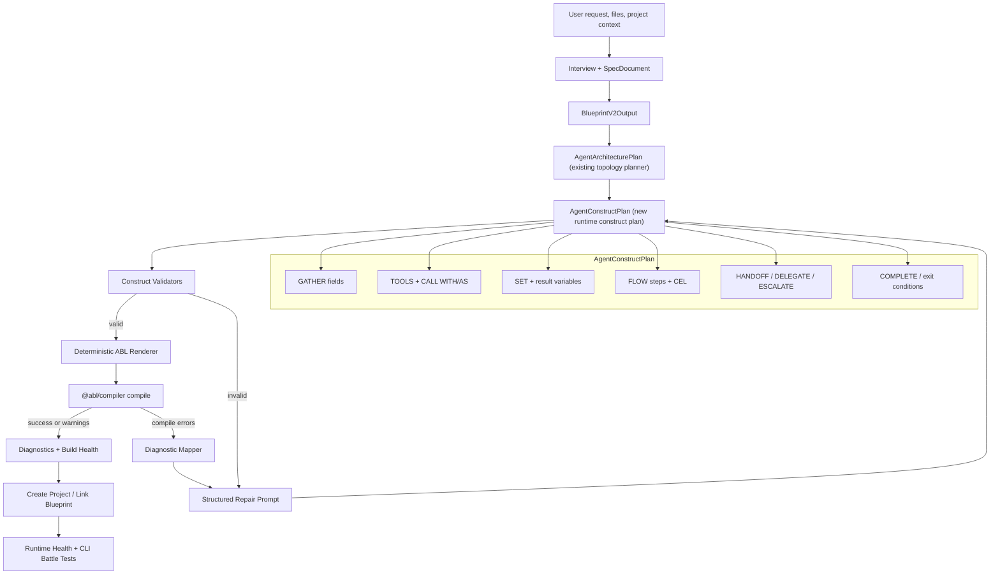

# Arch AI Construct-Aware Generation Architecture

> Package: `@agent-platform/arch-ai` (`packages/arch-ai/`)
> Status: Proposed implementation architecture
> Scope: Documentation and architecture plan for the next generation engine slice
> Last reviewed: 2026-05-12

This document is the canonical plan for moving Arch AI generation from "LLM writes
ABL, then repair loops try to make it compile" to a construct-aware pipeline:

```text
blueprint -> construct plan -> validated render -> compile -> diagnostics
```

The design is not greenfield. It extends the current Arch AI package:

- `blueprint/v2-schema.ts` already defines `BlueprintV2Output`.
- `blueprint/renderer.ts` already renders deterministic baseline ABL from a blueprint.
- `planning/agent-architecture-planner.ts` already computes topology-aware
  `AgentArchitecturePlan` objects.
- `diagnostics/diagnostic-engine.ts` already runs compiler, semantic, and pattern diagnostics.
- `generation/abl-pipeline.ts` already provides skeleton, precompile validation, and auto-fix helpers.

The next step is to insert an explicit runtime construct plan between blueprint planning
and ABL rendering, so complex ABL constructs are chosen intentionally and validated before
the compiler sees the final DSL.

## Current State Audit

### Blueprint v2

`BlueprintV2Output` captures project metadata, specification, topology, per-agent roles,
tools, gather fields, memory, constraints, guardrails, completion conditions, handoffs,
governance, integrations, and build order.

Gaps:

- It does not model detailed runtime execution plans.
- It cannot yet represent full flow steps, `CALL WITH/AS`, result aliases, `SET`, `ON_RESULT`,
  `ON_SUCCESS`, `ON_FAILURE`, `DELEGATE`, `ESCALATE`, return mapping, tool error branches, or
  detailed exit paths.
- Topology edges exist, but they are not enough to decide whether a child agent should be
  handoff-only, returnable, delegated, escalated, or terminal.

### Blueprint renderer

`renderAgentDslFromBlueprint()` is deterministic and already produces valid baseline DSL
for the battle-test fixtures. It renders:

- `AGENT`
- `GOAL`
- `PERSONA`
- `LIMITATIONS`
- `MEMORY`
- `TOOLS`
- `GATHER`
- `CONSTRAINTS`
- `GUARDRAILS`
- `HANDOFF`
- `COMPLETE`

Gaps:

- It cannot yet render complex scripted or hybrid `FLOW` graphs.
- It does not render tool call steps with `WITH`, `AS`, `ON_RESULT`, `ON_SUCCESS`, or `ON_FAILURE`.
- It cannot express `SET` assignments after tool calls.
- It cannot render `DELEGATE`, `ESCALATE`, `RETURN_HANDLERS`, or explicit parent callback behavior.

### Architecture planner

`computeArchitecturePlans()` already makes useful deterministic decisions from topology:

- agent archetype
- `SUPERVISOR` vs `AGENT`
- gather requirement hints
- completion requirement hints
- complexity hints
- flow recommendation
- handoff targets
- return-contract hints
- local topology context

Gaps:

- It is topology-focused, not runtime-construct-complete.
- It does not decide exact flow steps, tool result handling, response variables, or CEL inputs.
- It does not produce renderer-ready data for complex ABL constructs.

### ABL pipeline

`generation/abl-pipeline.ts` currently provides skeleton generation, precompile validation,
and deterministic auto-fixes for common missing sections.

Gaps:

- Validation is still mostly text/regex based before compilation.
- It catches some known bad forms, such as object-shaped `CALL` blocks, but does not validate a
  complete construct graph before render.
- Repair still happens after broad LLM output rather than before deterministic rendering.

### Diagnostics

`diagnostics/diagnostic-engine.ts` is the strongest existing quality gate. It runs:

- Tier 1 compiler structural diagnostics via `validateIR`.
- Tier 2 semantic validators for handoff, delegation, completion, flow, gather, memory,
  constraints, guardrails, naming, and behavior profiles.
- Tier 3 pattern analysis and anti-pattern detection.

Direction:

- Keep this engine.
- Reuse it after compile.
- Add pre-render construct validation before compile.
- Feed structured diagnostics into targeted repair prompts instead of broad retry prompts.

## Target Architecture

The target architecture adds one new concept: `AgentConstructPlan`.

`AgentArchitecturePlan` remains the topology/archetype planner. `AgentConstructPlan` becomes
the runtime execution plan for each agent.



## Target Data Flow

1. **User context enters Arch AI**
   - User request, uploaded files, project context, and conversation history are normalized into
     session state and the spec document.

2. **Spec document drives blueprint**
   - The existing onboarding flow produces or updates `BlueprintV2Output`.
   - Blueprint remains the reviewable user-facing source of truth.

3. **Topology planner derives structural plans**
   - `computeArchitecturePlans()` consumes topology and produces `AgentArchitecturePlan`.
   - This remains deterministic and should not call an LLM.

4. **Construct planner derives runtime plans**
   - New `AgentConstructPlan` is generated per agent.
   - Simple agents can use deterministic defaults.
   - Complex agents can use one structured LLM call, constrained by blueprint plus
     `AgentArchitecturePlan`.

5. **Construct validators run before render**
   - Validate variable declarations, tool signatures, tool result aliases, flow transitions,
     completion gates, handoff/delegate/return contracts, and unsupported constructs.
   - Failures return structured diagnostics to the construct planner, not raw text repair.

6. **Renderer emits ABL deterministically**
   - Rendering should be data-driven from the validated construct plan.
   - Avoid asking the LLM to write final DSL when the plan is already precise.

7. **Compiler and diagnostics verify runtime truth**
   - Compile with `@abl/compiler`.
   - Run `runDiagnostics()` on compiled output.
   - Map compiler and diagnostic findings back to construct-plan fields.

8. **Repair is narrow and capped**
   - Only repair the specific plan sections implicated by diagnostics.
   - Use a retry budget.
   - Stop with actionable findings instead of looping indefinitely.

9. **Project creation links blueprint and generated agents**
   - Persist blueprint lineage and generated source hashes.
   - Create or link project tools.
   - Create agent DSL and versions from rendered output.

10. **CLI battle tests close the loop**
    - Run full onboarding/project creation through the Arch CLI.
    - Measure compile success, diagnostic severity, repair count, latency, and generated-agent
      quality.

## AgentConstructPlan

The minimum internal shape should be renderer-ready and model-agnostic.

```ts
interface AgentConstructPlan {
  agentName: string;
  executionMode: 'reasoning' | 'scripted' | 'hybrid';
  gathers: GatherPlanItem[];
  tools: ToolPlanItem[];
  toolCalls: ToolCallPlanItem[];
  state: StateAssignmentPlanItem[];
  flow: FlowStepPlanItem[];
  handoffs: HandoffPlanItem[];
  delegates: DelegatePlanItem[];
  escalations: EscalationPlanItem[];
  completion: CompletionPlanItem[];
  unsupportedConstructs: UnsupportedConstructNote[];
  rationale: string[];
}
```

Required semantics:

- `gathers` declares user-provided values and validation expectations.
- `tools` declares available tool signatures.
- `toolCalls` declares `CALL`, `WITH`, `AS`, `ON_RESULT`, `ON_SUCCESS`, and `ON_FAILURE`.
- `state` declares values that must be set before response, handoff, delegate, or completion.
- `flow` declares deterministic scripted/hybrid step transitions.
- `handoffs` declares transfer of conversation control.
- `delegates` declares parent-owned child work and return expectations.
- `escalations` declares human or external escalation paths.
- `completion` declares terminal conditions and return readiness.
- `unsupportedConstructs` records constructs intentionally avoided, such as `human_approval`
  until runtime support is proven.

## Validation Gates

Construct validation runs before ABL rendering.

### Variable and CEL gates

- Every variable referenced in CEL must come from gather, memory, tool result alias, `SET`,
  runtime built-ins, or explicit context.
- Every variable used in `RESPOND` must be declared or safely optional with a fallback.
- Avoid nested invented namespaces unless the source defines them.
- Use flat conditions such as `field != null`, `flag == true`, and `status == "eligible"`.

### Tool gates

- Every `CALL` must reference a declared tool.
- Every reused tool result must have an explicit `AS` alias.
- Tool arguments must match declared signatures.
- Branching on result fields must use `ON_RESULT`.
- Binary success/failure paths should use `ON_SUCCESS` and `ON_FAILURE`.
- Values needed later must be persisted through `SET` or a known result alias.

### Flow gates

- Every `THEN` target must exist or be `COMPLETE`.
- Scripted/hybrid flows must have an entry path.
- Terminal steps must have explicit `THEN: COMPLETE` or a valid transition.
- Step-level `COMPLETE_WHEN` should be avoided unless there is a concrete runtime reason.

### Handoff, delegate, and escalation gates

- Handoff/delegate targets must exist.
- `HANDOFF RETURN: true` requires the child to complete through the runtime return path.
- Context pass fields must exist on the source and be declared on the target if consumed.
- Delegates need explicit input and result contracts when parent flow depends on child output.
- Escalation must target a supported destination or a generated escalation agent.
- Do not generate unsupported `human_approval` until runtime support and tests exist.

### Diagnostic gates

- Compile output must pass compiler structural validation.
- Deep diagnostics should run for full projects.
- Error findings block project creation.
- Warnings can be allowed only if they are explicitly classified as non-blocking for the
  project type.

## Latency Strategy

The architecture should improve quality without making build time unacceptable.

- Keep one LLM call for high-level blueprint generation.
- Use deterministic construction for simple agents.
- Use one structured construct-plan LLM call per complex agent only when needed.
- Render ABL deterministically from validated plans.
- Run repair only from structured diagnostics.
- Cap repair attempts per agent.
- Track latency by stage:
  - blueprint generation
  - construct planning
  - construct validation
  - ABL render
  - compile
  - diagnostics
  - repair
  - project creation

## Risk Review

### Loop or freeze during build

Risk: broad repair prompts can keep regenerating the same invalid DSL.

Controls:

- Use structured diagnostics as repair input.
- Cap repair attempts.
- Detect repeated plan hashes.
- Persist build progress per agent so reload does not restart completed work.

### Stale live-vs-DB session state

Risk: UI and DB can disagree after reload, cancellation, or lost streaming connection.

Controls:

- Treat DB session metadata as durable truth.
- Reconstruct UI from `buildProgress`, blueprint, files, artifacts, and pending interaction.
- Recover stale `ACTIVE` sessions only when no live lock or pending interaction exists.

### Unsupported construct hallucination

Risk: model emits plausible but unsupported ABL, such as unproven `human_approval` syntax.

Controls:

- Maintain a runtime support matrix.
- Record unsupported constructs in `unsupportedConstructs`.
- Block rendering of unsupported constructs.
- Prefer supported `ESCALATE` or handoff patterns.

### Undeclared CEL variables

Risk: generated `WHEN`, `COMPLETE`, or `RESPOND` references variables that are never declared.

Controls:

- Construct-plan symbol table.
- Pre-render variable validation.
- Compiler `validateFieldReferences`.
- Diagnostic mapping back to plan fields.

### Incorrect handoff/delegate semantics

Risk: child agents hand off back to the parent instead of completing, causing nested handoff loops
or stalled return flows.

Controls:

- Keep `AgentArchitecturePlan` return-contract hints.
- Validate returnable child agents have valid completion.
- Use `DELEGATE` only for parent-owned subwork.
- Use `HANDOFF` for control transfer.

### Tool result misuse

Risk: generated agents branch on tool fields without aliases or try to display tool output that is
not in scope.

Controls:

- Require `CALL WITH/AS` for reusable tool output.
- Require `SET` for durable values used after the step.
- Validate `ON_RESULT` field references against declared result aliases.

### Excessive LLM calls

Risk: per-agent planning can slow builds.

Controls:

- Skip LLM construct planning for simple reasoning-only agents.
- Batch independent simple agents when safe.
- Cache construct plans by blueprint section hash.
- Measure stage-level latency in CLI battle tests.

### Model drift

Risk: different providers may obey structured instructions differently.

Controls:

- Keep structured output schemas strict.
- Validate all model outputs before render.
- Keep prompts model-agnostic.
- Treat deterministic render and compiler diagnostics as the final authority.

## Implementation Roadmap

### Phase 1: Documentation and agreement

- Add this architecture doc.
- Link it from `DESIGN.md`.
- Use it as the implementation contract for the next work slice.

### Phase 2: Construct plan types

- Add `AgentConstructPlan` types and Zod schemas.
- Add symbol table helpers for gather, memory, tool aliases, `SET`, context, and runtime built-ins.
- Add conversion from `BlueprintV2Output` plus `AgentArchitecturePlan` into draft construct plans.

### Phase 3: Construct validators

- Add pre-render validators for variables, tool calls, flow transitions, handoff/delegate contracts,
  escalation support, and completion gates.
- Reuse diagnostic rule codes where possible.
- Add plan-level error paths so repair can target exact fields.

### Phase 4: Renderer expansion

- Extend deterministic rendering to support:
  - `FLOW`
  - `CALL WITH/AS`
  - `ON_RESULT`
  - `ON_SUCCESS`
  - `ON_FAILURE`
  - `SET`
  - `DELEGATE`
  - `ESCALATE`
  - `RETURN_HANDLERS` where runtime-supported
- Keep existing blueprint renderer behavior for simple agents.

### Phase 5: Repair orchestration

- Replace broad ABL repair with plan-section repair.
- Feed compiler and diagnostic findings into the construct plan.
- Cap retries and expose unresolved findings to the user.

### Phase 6: CLI battle testing

- Run at least 20 full CLI project creations.
- Record:
  - number of agents
  - LLM time by phase
  - compile time
  - repair count
  - errors/warnings
  - health score
  - invalid construct counts
- Compare against the current baseline.

## Test And Acceptance Plan

### Documentation acceptance

- `packages/arch-ai/docs/generation-architecture.md` exists.
- `packages/arch-ai/docs/DESIGN.md` links to the new doc.
- Mermaid diagram is embedded directly in Markdown.
- The doc explicitly references the existing planner, renderer, diagnostics engine, and ABL pipeline.

### Future implementation acceptance

- 20 CLI-created projects compile with zero hard errors.
- Battle-test coverage includes:
  - simple reasoning agents
  - scripted flows
  - hybrid flows
  - tool-backed flows
  - `CALL WITH/AS`
  - `ON_RESULT`
  - `ON_SUCCESS` and `ON_FAILURE`
  - `SET`
  - handoff
  - delegate
  - escalation
  - returnable child-agent flows
- Health improves by eliminating undeclared handoff variables and invalid tool-result references.
- Repair loops decrease because construct validation happens before rendering.
- Generated agents remain use-case appropriate; complex constructs are used only when required.

## Future Scope

- Construct-aware LLM eval corpus with golden projects and per-construct expected outputs.
- Per-construct renderer modules under the blueprint/generation layer.
- Compile-time and LLM-time telemetry surfaced in CLI battle-test reports.
- Model-agnostic structured output adapter for provider-specific quirks.
- Graph-based UI explanation of blueprint/build decisions.
- Runtime trace feedback loop that learns which generated constructs perform poorly.
- Blueprint diff UI that shows construct-plan changes before rebuild.
- Automated prompt/card drift checks against compiler/runtime support.
